# Instructor manual

This file is for the person who teaches with Tassl: you set up the course, put people on a roster,
configure the assignment a run starts from, read each finished run back, decide its seven bands, and
carry the result to your own gradebook. Read it beside the running app. By the end you can run a
course from an empty screen to a filed export without asking anyone how.

---

## 1. Who you are in Tassl

You hold two seats at once, and they are different things.

- Your **institution** seat is **Instructor**. It is what lets you create courses, author scenario
  packages, invite people, and see the **Courses**, **Review** and **Packages** items in the rail.
- Your **section** seat is **Instructor** on each section you teach. It is what lets you open a
  student's run, decide its bands, void it, and enter a correction.

Both are needed. An instructor seat with no row on a section can read the course but cannot open a
run in it.

### You can

- Create a course, and create sections inside it.
- Add people to a section roster at any of three section roles, remove them, and invite an address
  that does not belong to the institution yet.
- Create and configure assignments, and set the course's outside-AI policy, default run weight and
  taught concepts.
- Set the course's band-to-points mapping, and change it afterwards, which re-prices and re-exports
  every confirmed run in the course.
- Open the replay of any run in a section you instruct, including the parts a student never sees:
  warranted stances, evidence status, planted defects and the author's expected-answer notes.
- Decide all seven bands on a run: confirm the draft, record a different band, or record the
  dimension as **Unassessed** — and decide one again after the run is confirmed, which writes a new
  export version.
- Set all seven bands by hand on a run nothing could place.
- Enter a correction on a claim, mark a delegation as outside the scenario, void a run and offer
  another in its place, and delete a run on a **Walkthrough** assignment.
- Download a run's course export and the whole assignment's export history.
- Build a scenario package from a seed case, import one, run generation on it, edit and reject its
  elements, confirm each element and confirm the version.
- Arm one assistant outage inside a live run, where test controls are turned on.

### You cannot

- Start a run. Only a person holding a **Student** row on the assignment's section can, and the
  refusal reads "Only a student on this assignment’s section can start a run."
- Read the student's own Judgment Record page. That artifact is theirs.
- Change anyone's institution role, or your own. There is no screen for it; a new invitation at the
  new role is the supported path.
- Rename or delete a course, change its term, or delete a section or an assignment. None of those
  exists in this build.
- Delete a run that counts. You void it instead, which keeps the record.
- Change the package version, the variant, the working clock or the weight of an assignment once a
  run has started on it.
- Reach anything in another institution, or the **Admin** area.
- Read or write a data agreement, or change institution settings.

### How your seat sits beside the others

A student sees only their own runs. A teaching assistant on your section can read the same replay you
do and decide bands, but cannot change a band you have already decided, cannot decide anything once
the run is confirmed, and cannot void, correct, or arm the test control. A scenario author builds
packages and never touches a course or a run. A program lead reads every course in the institution
but changes none of them, and is refused at **Packages**. A platform admin runs Tassl itself and,
holding no seat in your institution, sees none of your courses.

### What happens when you open a page you are not allowed to open

Nothing is refused with an error box. The page renders as **Not found**: "There is nothing at this
address. It may have moved, or the link may be wrong." with a **Go home** link. That is deliberate —
a resource in another institution answers the same way as one that does not exist, so an address
cannot be probed. You get this page if you type in the /admin address, a course in another
institution, or the replay of a run in a section you do not teach.

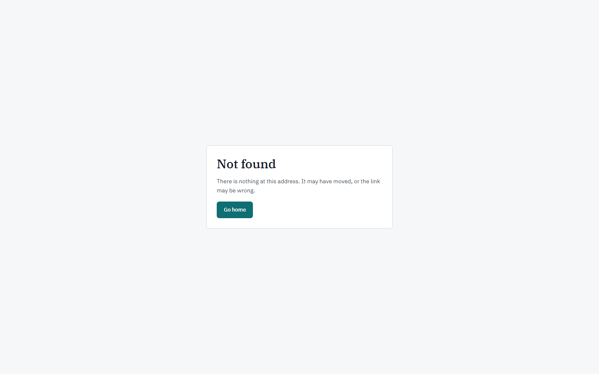

Signed in, the same two sentences are drawn inside the app shell, with the header and the rail still
beside them. One screen answers differently: **Packages**, where a seat that may not author reads
**Packages are not open to your seat** — "Only an instructor or a scenario author reads and writes
packages in {institution}. If you should be one, an administrator of the institution can change your
seat." Your seat authors packages, so that is the page a student or a program lead meets there and
never you.

---

## 2. Signing in and your home screen

### The sign-in screen

Go to your institution's Tassl address. Signed out, every address sends you to **Sign in to Tassl**.

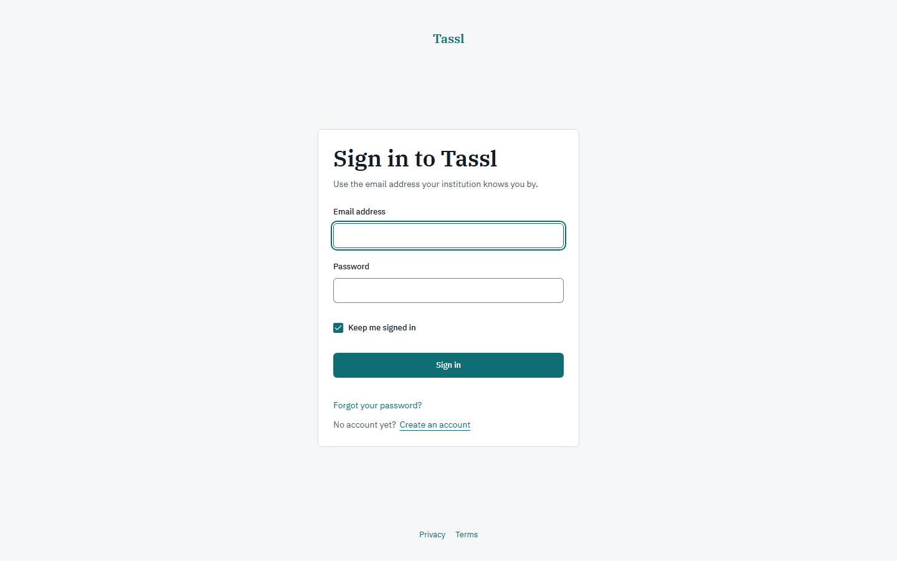

| Element | What it is |
|---|---|
| **Sign in to Tassl** | The heading. Under it: "Use the email address your institution knows you by." |
| **Email address** | The address your institution invited. It takes focus when the page opens. |
| **Password** | Between 12 and 128 characters. There are no composition rules. |
| **Keep me signed in** | A checkbox, ticked when the page opens. |
| **Sign in** | The submit button. While it works the label reads **Signing in**. |
| **Continue with Google** | Shown only where the installation has Google sign-in configured, under the divider word **or**. |
| **Forgot your password?** | Goes to **Reset your password**. |
| **No account yet?** + **Create an account** | Goes to the sign-up screen. |
| **Privacy** and **Terms** | In the footer of every signed-out screen. |

If you opened a Tassl link while signed out, the address bar keeps where you were going and you land
there after signing in.


Leave a field empty and the field is marked: "Enter a valid email address." or "Enter your password."

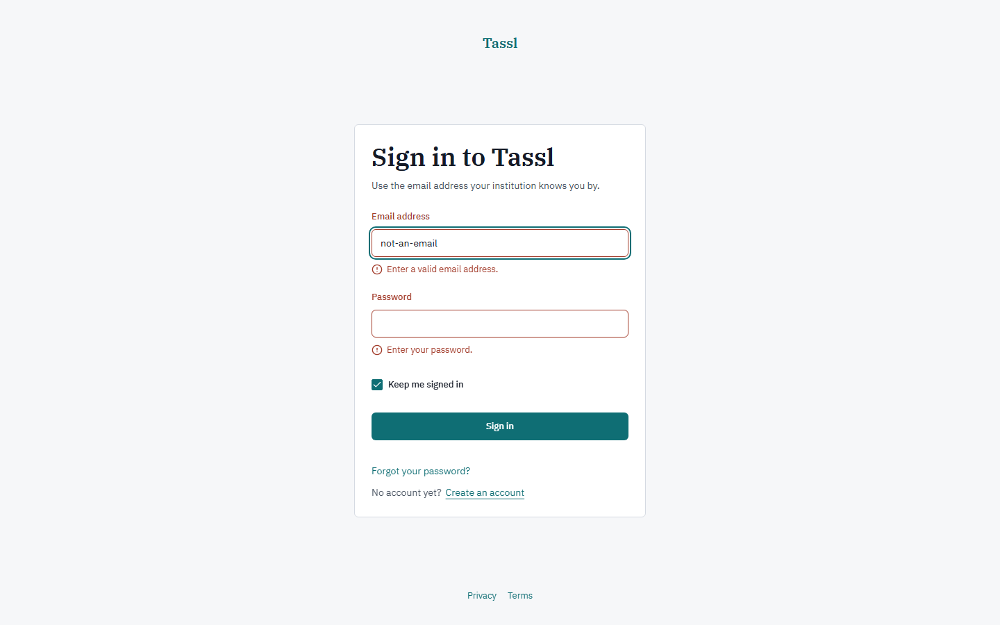

Get either the address or the password wrong and one sentence appears above the form: "That email
address and password do not match an account." The screen never says which of the two was wrong.

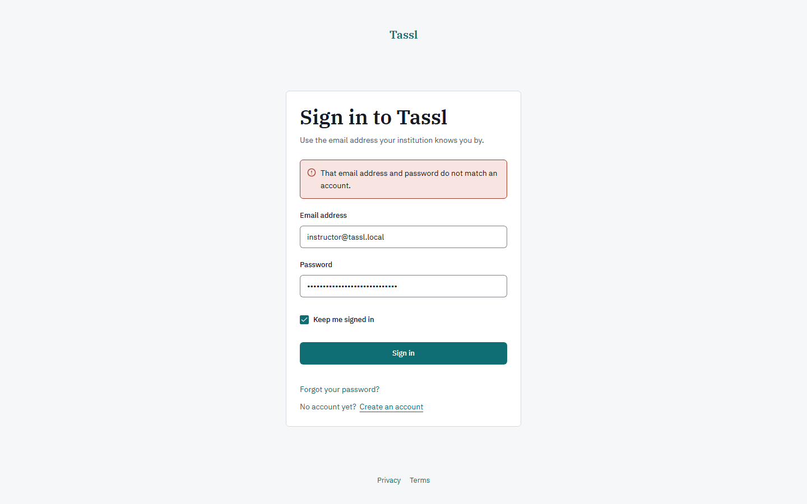

Ten failed attempts on one address in a minute are refused before the password is even checked, and
the form then reads "Too many attempts. Try again in {seconds} seconds."

### If you have no account yet

**Create an account** asks for **Your name** (at most 120 characters), **Email address** and a
**Password** of 12 to 128 characters. An account on its own gives you nothing: your institution then
invites you, and the invitation is what makes you an instructor there.

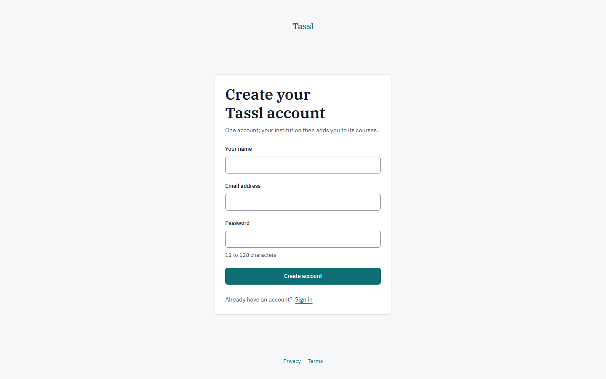

An address that already has an account is answered exactly like a new one, so nothing on this screen
ever tells you whether an address is in use.

### Forgetting and resetting your password

**Forgot your password?** opens **Reset your password**: one **Email address** field and **Email me a
link**. Whatever you type, the answer is "If that address exists, we sent a link. It works for one
hour."

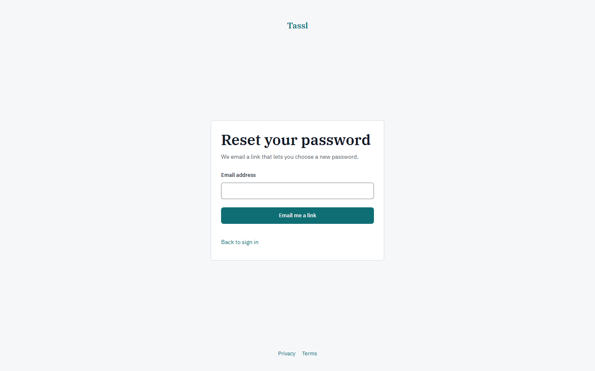

The link opens **Choose a new password**, which warns "Saving a new password signs out every other
session." and asks for **New password** and **New password again**. A link that has been used, or is
more than an hour old, opens instead as **That reset link no longer works** with **Ask for a new
link**.

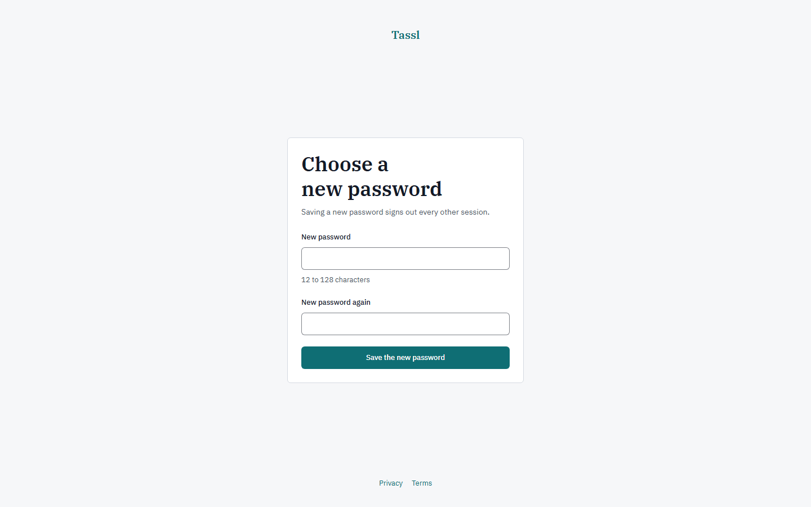

A confirmation link behaves the same way. A dead one lands on **Confirm your email address**, where
you can type your address and press **Resend the link**; the answer is always "If that address still
needs confirming, a new link is on its way." and a 60-second wait follows before you can ask again.

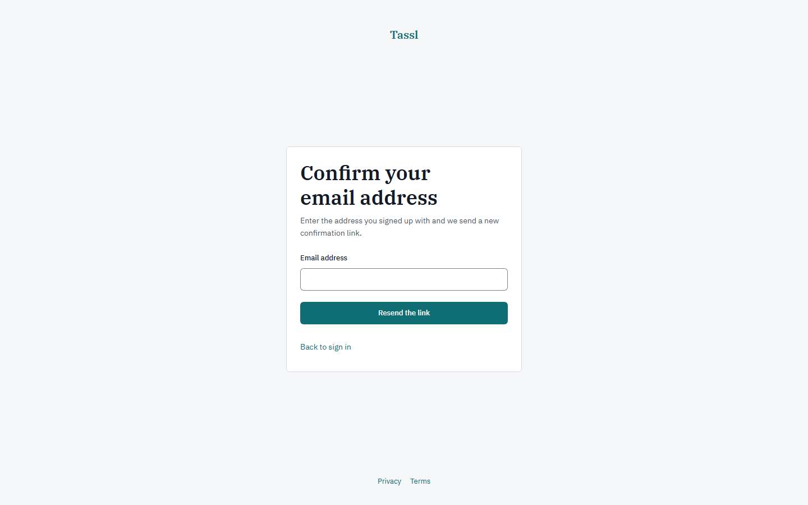

### Your home screen

Signing in lands you on **Home**, under the line "What needs your attention, and what is coming up."
The institution's name sits above the heading and in the header. If you belong to more than one
institution, the header offers **Switch institution**.

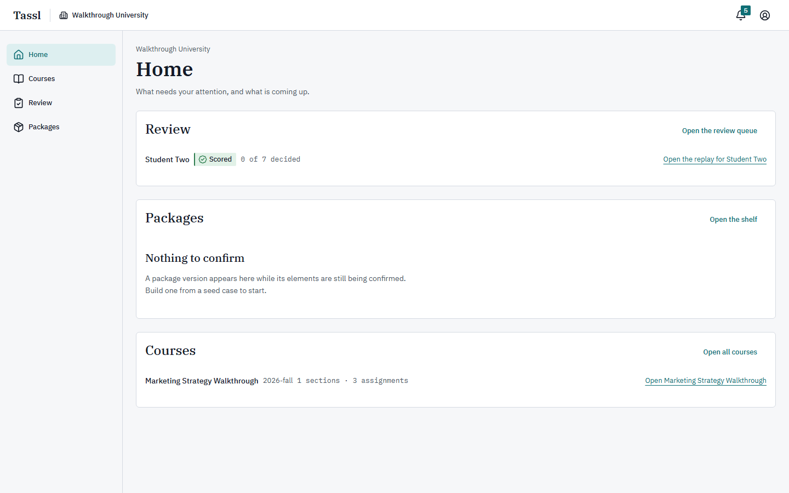

Three regions, each drawn only when your seat has data behind it, each showing at most five rows and
a link to the full screen.

| Region | What it lists | Link | When it is empty |
|---|---|---|---|
| **Review** | Runs in your sections waiting for a decision. Each row: the student's name, the run's state chip, **{n} of 7 decided**, and a link **Open the replay for {student}**. A run nothing could place also carries the chip **Needs a hand**. | **Open the review queue** | **Nothing waiting** — "A run appears here once its bands have been drafted, or when nothing could place them and it needs a hand." |
| **Packages** | Package versions still being confirmed. Each row: the package title, a **Draft** chip and **Version {n}, in confirmation**. | **Open the shelf** | **Nothing to confirm** — "A package version appears here while its elements are still being confirmed. Build one from a seed case to start." |
| **Courses** | Your institution's courses. Each row: the course name, its term, and **{n} sections · {n} assignments**. | **Open all courses** | **No course yet** — "Create a course to hold sections, assignments and the band mapping." |

A region whose data your seat cannot read is not drawn at all, rather than drawn empty. With no
institution membership the whole page reads **Waiting for an invitation**; with a membership but
nothing to do, **Nothing to do yet**.

On a narrow screen the same three regions stack in one column and the rail moves under the header.
Nothing is hidden.

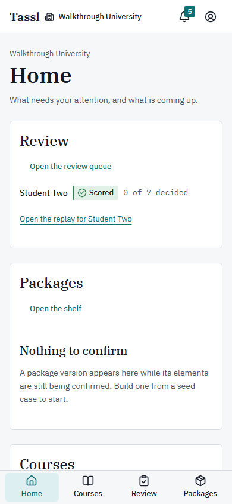

---

## 3. Navigation map

```
Header
├── Tassl (wordmark) ............... /home
├── Institution <name> ............. the institution you are working in; Switch institution when you have more than one
├── Notifications: {n} unread ...... /notifications
└── Account: <your name> ........... the account menu
    ├── Settings ................... /settings
    ├── Privacy .................... the privacy document
    ├── Terms ...................... the terms document
    └── Sign out ................... ends this session

Rail
├── Home ........................... /home
├── Courses ........................ /courses
│   └── <a course>
│       ├── Sections ............... the course's sections
│       │   └── Roster ............. one section's Members, Add member and Invitations
│       ├── Assignments ............ the course's assignments
│       │   └── <an assignment> .... Configuration and Runs
│       │       └── Course exports . every export written on that assignment
│       ├── Policy ................. outside-AI policy, default run weight, taught concepts
│       └── Mapping ................ band-to-points mapping
├── Review ......................... the review queue
│   └── <a run> .................... the replay
│       ├── Overview
│       ├── Bands
│       ├── Trace
│       ├── Package
│       └── Actions
└── Packages ....................... the package shelf
    ├── New package from a seed case
    │   └── Import a package export
    └── <a version>
        ├── Open the confirmation workspace
        └── Generation
```

| Destination | How you reach it | What is there |
|---|---|---|
| **Home** | Rail, or the **Tassl** wordmark | Your three regions |
| **Courses** | Rail | Every course in the institution, with **New course** |
| A course | Click the course name in the list | The four course views |
| **Sections** | Course view | The sections table and **New section** |
| **Roster** | The **Roster** link on a section row | **Members**, **Add member**, **Invitations** |
| **Assignments** | Course view | The assignments table and **New assignment** |
| An assignment | Click the assignment name | **Configuration** and **Runs** |
| **Course exports** | Button on the assignment screen | Every export written on that assignment |
| **Policy** | Course view | The outside-AI policy, weight and taught concepts |
| **Mapping** | Course view | The four band values, preview and apply |
| **Review** | Rail | The review queue |
| A replay | **Open the replay for {student}** | The five replay views |
| **Packages** | Rail | The package shelf |
| **New package from a seed case** | Button on the shelf | The create form and **Import a package export** |
| A package version | Click a package on the shelf | Identity, counts, records, measures, claims |
| The confirmation workspace | **Open the confirmation workspace** on a draft version, or **Open confirmation workspace** on the generation screen | The element tree and every element's decision |
| **Generation** | Button on a draft version | The seven generation steps, their status and their cost |
| **Notifications** | The bell in the header | Everything Tassl has told you |
| **Settings** | Account menu | **Profile**, **Security**, **Data** |

The course views and the replay views are addresses, not tab widgets: each has its own link, so you
can bookmark one and the browser's Back button works through them.

---

## 4. Dashboards

Four screens carry numbers you read rather than type.

### Home

The three regions are described in full in section 2. Two of their numbers are worth naming again:

| Number | What it counts | What it means |
|---|---|---|
| **{n} of 7 decided** on a Review row | Dimensions of that run that carry your decision | Zero means nothing has been decided; seven means the run is confirmed and has left the queue |
| **{n} sections · {n} assignments** on a Courses row | Live sections of the course, and live assignments across them | A course with zero sections cannot carry an assignment yet |

### The review queue

**Review** in the rail. The header reads "Runs of your own sections that are waiting for a decision,
and the shapes a queue takes once a course has run for a term."


Two panels, and only the lower one is about your students.

**Review queue (illustrative)** carries the amber chip **Illustrative sample data** and a dashed
border, and the note "These five groupings describe no student and count no real run. They show how
a queue is organised once a term’s worth of runs exists; the list below is the real one." Its five
groupings and their counts are fixed sample text. They exist so you can see the shape a term's
queue takes before you have one.

| Grouping | Count | What the grouping would hold |
|---|---|---|
| **Coherence gaps** | 4 | Runs where the frame and the filed decision point in different directions |
| **Boundary cases** | 6 | Runs sitting on a band boundary, where the descriptor could be read either way |
| **Appeals** | 1 | Runs a student has asked to have looked at again |
| **Pattern flags** | 3 | Runs carrying an observation worth a conversation, never a conclusion about the student |
| **Batch confirmation** | 12 | Runs whose seven drafts are ready to confirm together |

**Runs waiting for you** is the real list: "Every run of a section you review that has bands to
decide, newest first."

| Column | What it holds |
|---|---|
| **Student** | The student's name |
| **Attempt** | Which try at the assignment this is |
| **State** | The run's state chip — **Scored** while it waits for you, or the amber **Under review** when nothing could place its bands |
| **Bands decided** | **{n} of 7** |
| **Export** | **v{n}** once a course export exists, or **None** |
| **Replay** | A link reading **Open the replay for {student}** |

The queue has no filter, no sort and no ranking. Under it sits the note "Which variant a student
drew is on the replay rather than in this list, so this screen can be shown to a room."

### The assignment screen

Its **Runs** panel is the same list narrowed to one assignment, and it keeps every state, not only
the ones waiting for you. Its counts are described under feature 3.

### The replay's graphs

Four plots drawn from the run's own trace. They are covered in full under feature 9.

---

## 5. Features

### Courses

A course is the container that carries the outside-AI policy, the run weight, and the
band-to-points mapping its assignments run under. Everything else hangs off it.

**Courses** in the rail opens the list, under "Every course in this institution, with the sections
that hold its rosters and the assignments a run starts from."

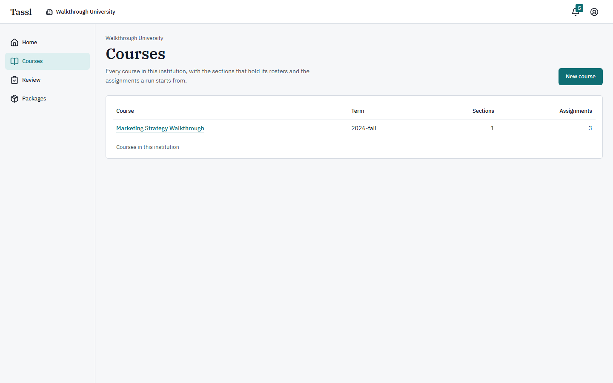

The table is captioned "Courses in this institution".

| Column | What it holds |
|---|---|
| **Course** | The course name, linked to the course |
| **Term** | The term as you typed it |
| **Sections** | How many live sections the course has |
| **Assignments** | How many live assignments across those sections |

With more courses than fit one page, a **Show more courses** link appears at the foot. With none at
all the screen reads **No courses yet** — "A course carries the outside-AI policy, the run weight,
and the band-to-points mapping its assignments run under." — and offers **New course** inside the
empty state.

#### Creating a course

1. Press **New course**. The dialog reads "Name it and give it a term. Policy, weight, and the band
   mapping are set on the course once it exists."
2. Type a **Course name**.
3. Type a **Term**. The hint under it reads "The term this course runs in, written the way your
   institution writes it."
4. Press **Create course**. While it saves the label reads **Creating…**.

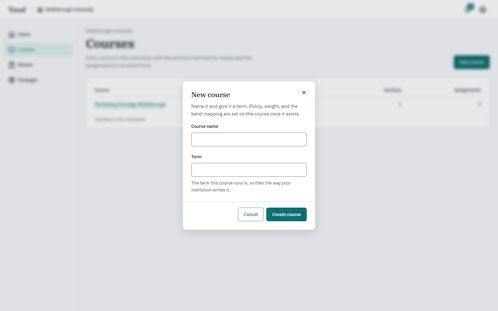

| Field | Limit | Message when it is wrong |
|---|---|---|
| **Course name** | 1–200 characters | "Give the course a name." / "A course name is at most 200 characters." |
| **Term** | 1–100 characters | "Give the course a term." / "A term is at most 100 characters." |

A toast reads "{name} is ready." and Tassl opens the new course. It starts with the outside-AI
policy **Declared**, a default run weight of 2.5, no taught concepts, and the institution's default
band mapping — on a fresh installation, Novice 1, Developing 2, Proficient 3, Professional 4.

A course cannot be renamed, re-termed or deleted afterwards. Name it the way your institution will
read it.

#### Opening a course

Click the name. The course screen carries the course name as its heading, **Term {term}** under it,
an **All courses** link above it, and four views: **Sections**, **Assignments**, **Policy**,
**Mapping**. **Sections** opens by default.


A seat that may read the course but not change it sees the **Policy** and **Mapping** forms disabled
with the note "You can read this course. Only an instructor who teaches it can change its setup."

---

### Sections and the roster

A section holds its own roster, and every assignment belongs to one section. A student needs a row
on a roster before they can start anything.

#### The Sections view

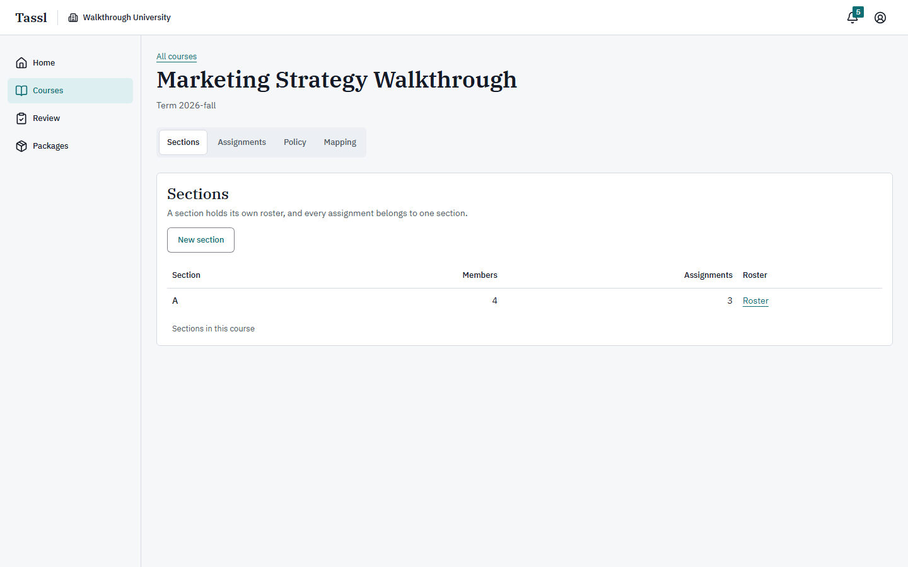

The panel reads "A section holds its own roster, and every assignment belongs to one section." The
table is captioned "Sections in this course".

| Column | What it holds |
|---|---|
| **Section** | The section name |
| **Members** | Everyone on the roster, in every role — not only students |
| **Assignments** | How many live assignments are set on that section |
| **Roster** | A link reading **Roster** |

Sections are listed by name. With none, the panel reads **No sections yet** — "Add a section, then
add the people who run its assignments to its roster."

#### Creating a section

1. Press **New section**. The dialog reads "Sections divide one course into rosters. An assignment is
   configured on a section."
2. Type a **Section name** — 1 to 100 characters. Empty gives "Give the section a name."; too long
   gives "A section name is at most 100 characters."
3. Press **Add section** (**Adding…** while it saves).

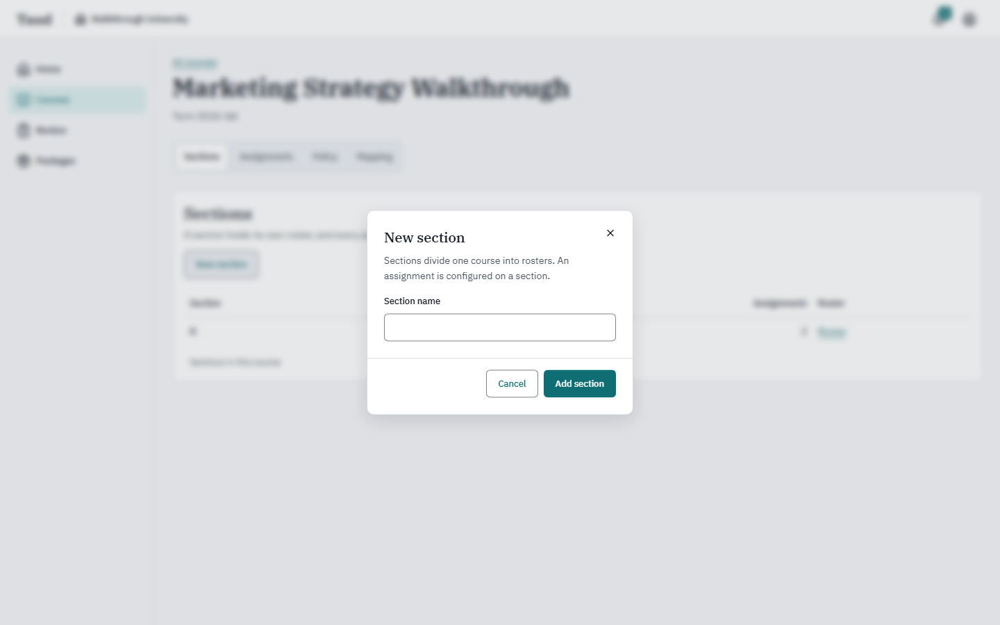

A toast reads "Section {name} added." A section cannot be renamed or deleted.

#### The roster

Press **Roster** on a section row. The screen is headed **Section roster**, with
"{course} · {section}" above it and the line "Who is in this section. Everyone on it already belongs
to the institution; invite anyone who does not." **Back to the course** returns you.

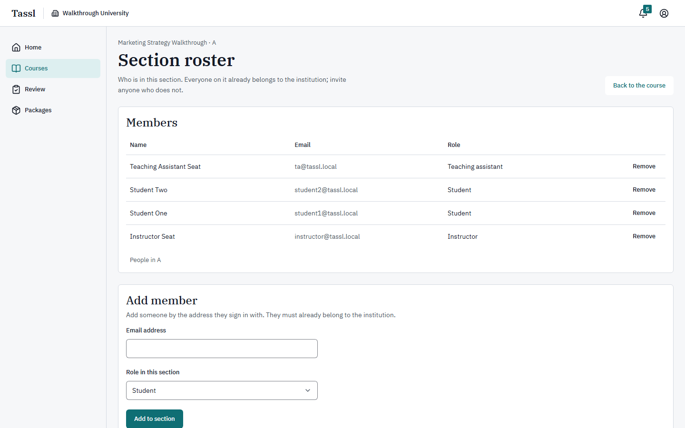

**Members** is captioned "People in {section}".

| Column | What it holds |
|---|---|
| **Name** | The person's display name |
| **Email** | The address they sign in with |
| **Role** | Their role *in this section*: **Student**, **Instructor** or **Teaching assistant** |
| (fourth column) | A **Remove** button on each row |

Rows are listed newest first. With nobody on it the panel reads **Nobody is in this section yet** —
"Add the people who will take this section’s assignments. A student needs a row here before a run
can start." On a very long roster a note reads "The first {count} members are shown."

#### Adding someone

The **Add member** panel says "Add someone by the address they sign in with. They must already
belong to the institution."

1. Type the **Email address**. A malformed address gives "Enter a valid email address."
2. Choose the **Role in this section**: **Student** (the default), **Instructor**, or
   **Teaching assistant**.
3. Press **Add to section**.

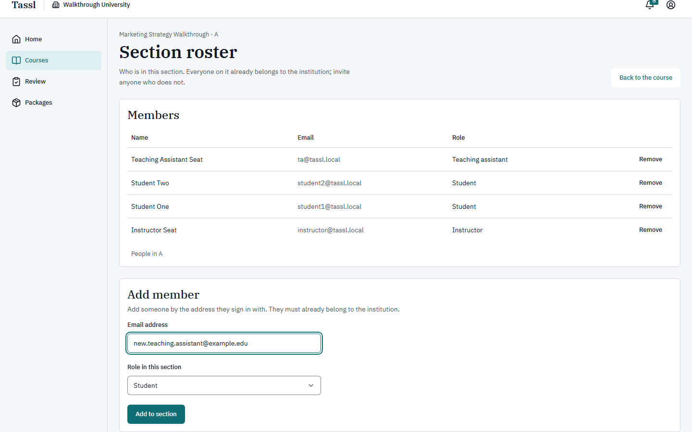

A toast reads "{email} is now in this section."

There is no separate control for changing someone's role. Add the same address again with the role
you want, and the new role replaces the old one.

#### When the address is not in the institution yet

The panel answers "That address does not belong to this institution yet." and grows a button
**Invite to institution** beside the message.

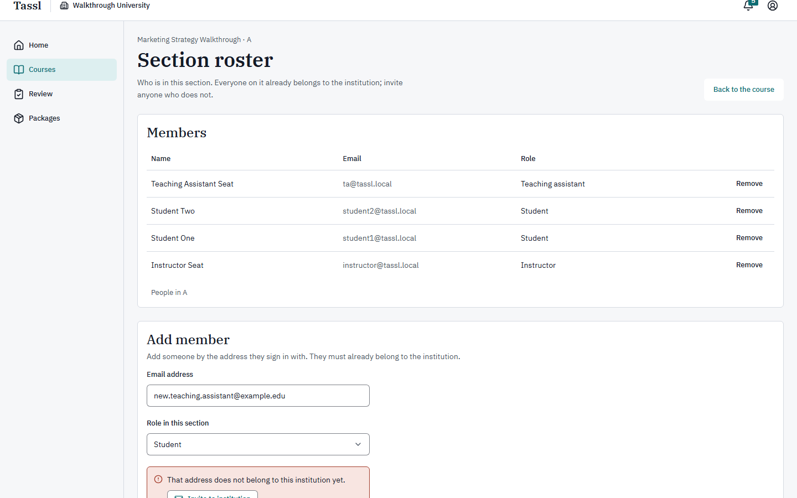

Press it and a dialog opens, pre-filled with the address you typed and the institution role that
matches the section role you chose.

| Element | What it is |
|---|---|
| Title | **Invite to the institution** |
| Description | "They get an email with a link that lasts seven days. Accepting it makes them a member of the institution; add them to this section afterwards." |
| **Email address** | Pre-filled, still editable |
| **Role in the institution** | **Student**, **Instructor** or **Teaching assistant**. Scenario author and program lead are institution appointments and are not offered here. |
| **Cancel** | Closes the dialog |
| **Send invitation** | Sends it (**Sending…** while it works) |

A toast reads "An invitation is on its way to {email}." The person gets an email subject-lined
"{your name} invited you to {institution} on Tassl", with a button **Accept the invitation**. They
must sign in with that same address; accepting makes them a member of the institution. Then come back
to the roster and add them to the section — the invitation puts them in the institution, not on your
roster.

#### Invitations

The **Invitations** panel says "An invitation lasts seven days and can be accepted once." and is
captioned "Outstanding invitations to this institution".

| Column | What it holds |
|---|---|
| **Email** | The invited address |
| **Role** | The *institution* role they were invited at |
| **Status** | **Pending**, or **Expired** once seven days have passed |
| **Expires** | The day and time it dies, in UTC |

With none, the panel reads **No invitations yet** — "Invite an address that does not belong to the
institution and the invitation appears here with the day it expires."

The list shows the whole institution's outstanding invitations, not only this section's. An
invitation cannot be cancelled or resent from here; inviting the same address again replaces it.

#### Removing someone

Press **Remove** on their row. A confirmation appears:

> **Take this person off the roster?**
>
> "{name} ({email}) comes off the roster of {section} and can no longer start its assignments.
> Nothing they have written is deleted, and you can add them back by address."

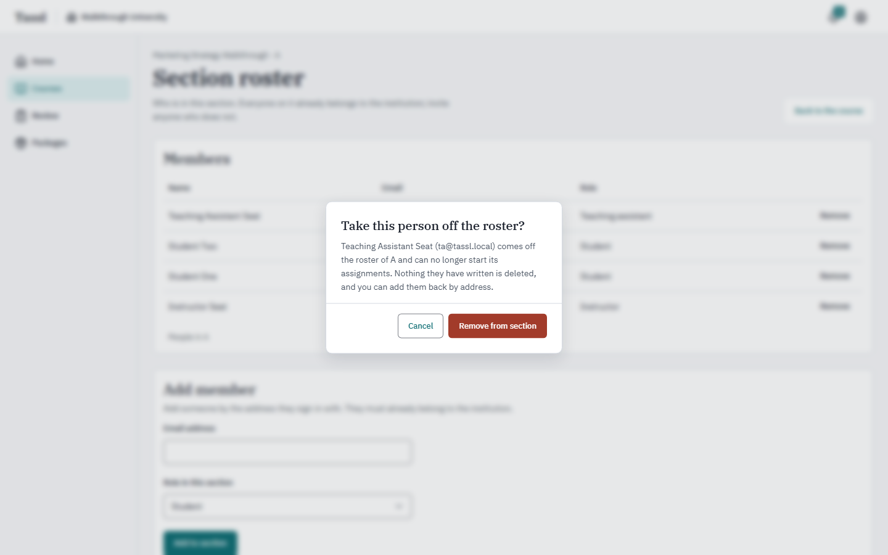

**Cancel** keeps them; **Remove from section** takes them off (**Removing…** while it works), and a
toast reads "{name} is out of this section."

Removal takes away the right to start this section's assignments. It deletes nothing: their runs,
their traces and their exports all stand. If they have any run in the section that has not been
voided, the removal is refused on that row with "This person has runs in the section, so they cannot
be removed." — leave them on the roster.

---

### Assignments

An assignment carries the scenario package version, the variant, the working clock, the weight and
the opening time a run is taken under. A run starts from an assignment and from nothing else.

#### The Assignments view

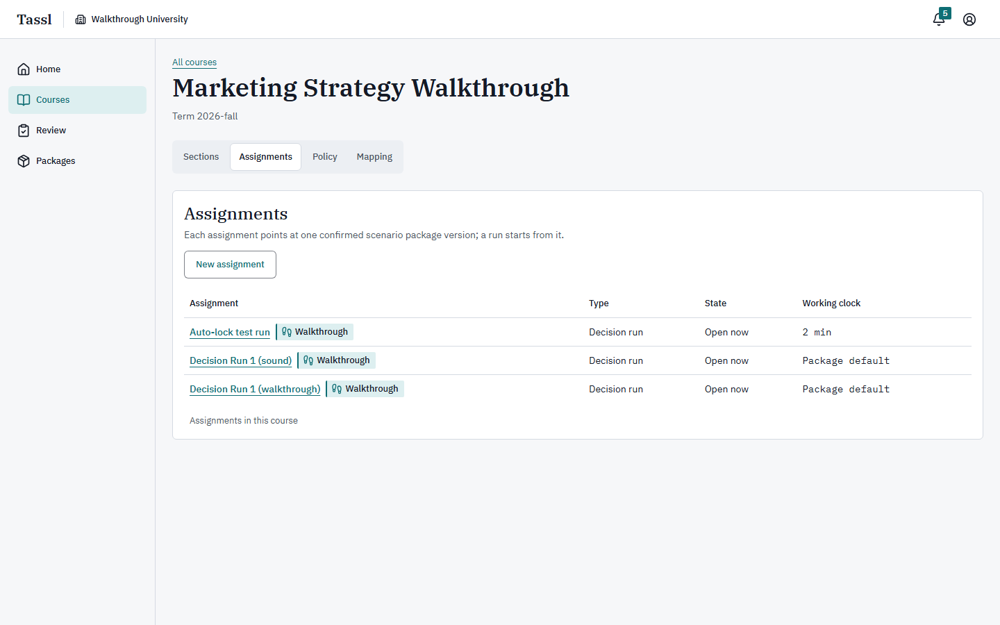

The panel reads "Each assignment points at one confirmed scenario package version; a run starts from
it." The table is captioned "Assignments in this course", newest first.

| Column | What it holds |
|---|---|
| **Assignment** | The assignment name, linked; a teal **Walkthrough** chip sits beside it when it is a practice assignment |
| **Type** | **Decision run** — every assignment built in the app is one |
| **State** | **Open now** when it is open, otherwise "Opens {date}" in UTC |
| **Working clock** | "{n} min", or **Package default** when the assignment sets no clock of its own |

With none, the panel reads **No assignments yet** — "An assignment carries the scenario package
version, the working clock, and the weight a run starts from. Confirm a scenario package first."

**New assignment** stays visible but refuses to open, with the reason printed beneath it, when the
course has no section ("An assignment belongs to a section. Add a section to this course first.") or
when the institution has confirmed no package version ("An assignment runs on a confirmed scenario
package version. Confirm one, then configure the assignment.").

#### Creating an assignment

Press **New assignment**. The dialog reads "An assignment belongs to one section and points at one
confirmed scenario package version. Every run on it is taken under what you set here."

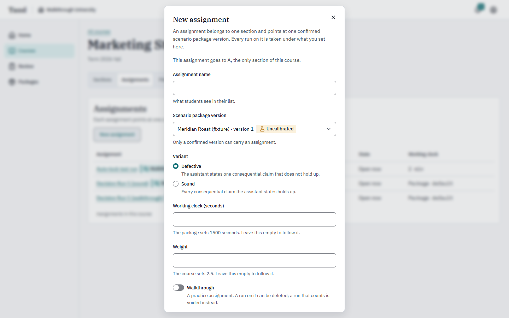

If the course has exactly one section, a sentence replaces the choice: "This assignment goes to
{name}, the only section of this course." With two or more, a **Section** select appears, hinted
"The roster this assignment is set for; its students are the ones who take it." Changing it clears
the rest of the form.

Then the configuration, field by field:

| Field | What to put in it | Limit and message |
|---|---|---|
| **Assignment name** | What students see in their list | 1–200 characters. "Name this assignment." / "Use 200 characters or fewer." |
| **Scenario package version** | A select. Each option reads "{title} · version {version}" and carries an **Uncalibrated** chip. Hint: "Only a confirmed version can carry an assignment." | "Choose a scenario package version." |
| **Variant** | Two radios. **Defective** — "The assistant states one consequential claim that does not hold up." **Sound** — "Every consequential claim the assistant states holds up." | "Choose a variant." Changing the version resets this. |
| **Working clock (seconds)** | Leave empty to follow the package. The hint names the package's own figure: "The package sets {n} seconds. Leave this empty to follow it." | Whole seconds, at least 60. "Enter whole seconds, at least 60, or leave it empty." |
| **Weight** | Leave empty to follow the course. The hint reads "The course sets {n}. Leave this empty to follow it." | A number of zero or more. "Enter the weight as a number of zero or more, or leave it empty." |
| **Walkthrough** | A switch. "A practice assignment. A run on it can be deleted; a run that counts is voided instead." | — |
| **Opens at** | A date and time. "Times are UTC. Leave this empty to open it now." | "Enter a date and time, or leave it empty." |

Press **Create assignment**. A toast reads "{label} is ready." and Tassl opens the assignment.

Choosing the **Defective** variant means the student will meet one consequential claim that does not
hold up. Choosing **Sound** means they will not. Which one a student drew is never shown on a list
that can be projected; it is on their replay.

#### The assignment screen

The heading is the assignment's name, with "{course} · {section}" above it and the **Walkthrough**
chip where it applies. Two buttons sit at the top right: **Course exports** and **Back to the
course**. Two panels follow.

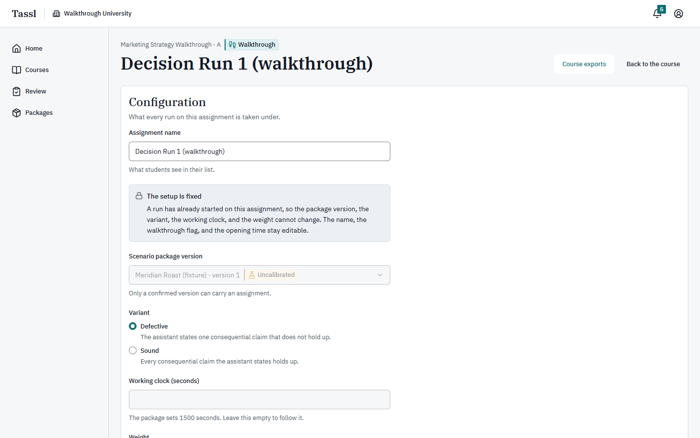

**Configuration** — "What every run on this assignment is taken under." It is the same form as the
dialog, with **Save configuration** at the foot and the toast "The assignment is saved."

Once any run exists that has not been voided, a panel appears above the package select:

> **The setup is fixed**
>
> "A run has already started on this assignment, so the package version, the variant, the working
> clock, and the weight cannot change. The name, the walkthrough flag, and the opening time stay
> editable."

Those four controls are then disabled. If something about the exercise has to change, make a new
assignment.

**Runs** — captioned "Runs taken on this assignment".

| Column | What it holds |
|---|---|
| **Student** | The student's name |
| **Attempt** | Which try this is. A second attempt exists only where you voided the first and offered another |
| **State** | The run's state chip |
| **Bands decided** | "{n} of 7" — how many dimensions carry your decision |
| **Export** | **v{n}** for the newest course export, or **None yet** |
| **Replay** | **Open the replay** |
| **Actions** | A **Delete** button — only on a **Walkthrough** assignment |

Under the table: "The replay shows a run’s trace as it is written, its test controls while it is
live, and its band decisions once it is scored." With no runs yet the panel reads **No runs yet** —
"Once a student starts this assignment, their run appears here with its state and its replay."

The states you will see in that column:

| Chip | What it means |
|---|---|
| **Not started** | The student has the assignment and has opened nothing |
| **Readiness Check**, **Framing**, **Working**, **Paused**, **Decision locked**, **Turn open**, **Turn locked**, **Defense** | The run is live, at that step |
| **Defense complete** | The interview is filed; scoring starts on its own |
| **Scored** | The seven drafts are written and waiting for you |
| **Confirmed** | All seven carry your decision, and export version 1 exists |
| **Recorded** | The student has since answered the two debrief questions |
| **Under review** (amber) | Nothing could place the bands. This word *replaces* the state word |
| **Voided** | You ended the run; it carries no partial result |
| **Abandoned**, **Defense missed**, **Expired**, **Under appeal** | The run ended without reaching a debrief, or is being looked at again |

#### Deleting a walkthrough run

Only on a **Walkthrough** assignment. Press **Delete** on the row.

> **Delete this walkthrough run?**
>
> "The run, its trace and everything written in it are removed for good. Only a run on a walkthrough
> assignment can be deleted; a run that counts is voided instead, which keeps the record."

**Keep the run** cancels; **Delete the run** removes it, with the toast "The walkthrough run was
deleted." On any other assignment the answer is "Only a run on a walkthrough assignment can be
deleted. A run that counts is voided instead."

#### A short working clock, as an example

The seeded course carries an assignment called **Auto-lock test run** with a **Working clock** of
120 seconds — it reads **2 min** in the assignments table. It exists so you can watch what happens
when a clock runs out: the decision is filed as it stands, empty fields and all, and the run carries
on to the Turn. Nothing about the run is treated differently because the clock ended it.

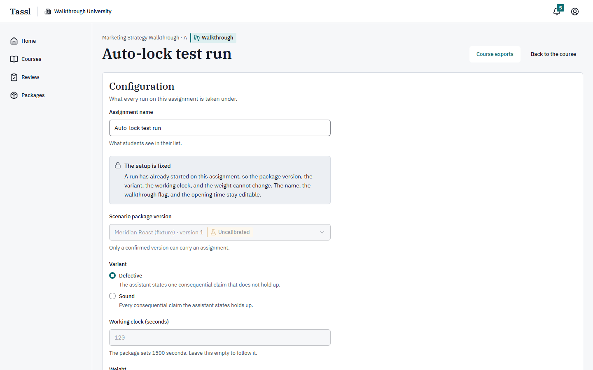

Set a short clock on a walkthrough assignment when you want a class to see the lock happen. Do not
set one on an assignment that counts.

---

### Policy

The **Policy** view holds what the course allows outside Tassl, what one run is worth, and which
concepts it teaches. Its panel is titled **Policy and weight**.

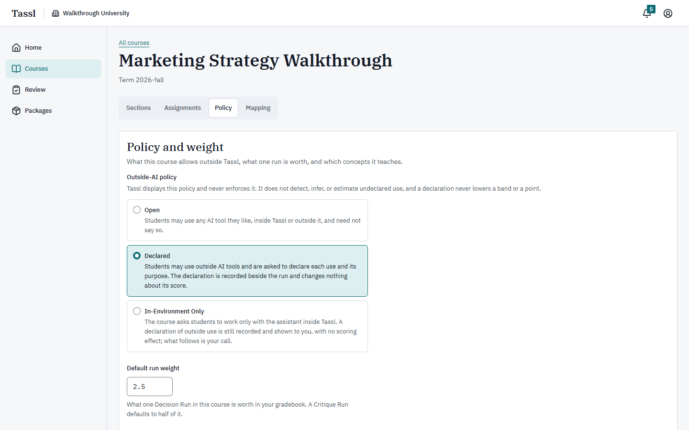

Under the legend **Outside-AI policy** stands a sentence that is always there and that you should
read before choosing:

> "Tassl displays this policy and never enforces it. It does not detect, infer, or estimate
> undeclared use, and a declaration never lowers a band or a point."

| Choice | What it says on this screen | What the student reads before their run |
|---|---|---|
| **Open** | "Students may use any AI tool they like, inside Tassl or outside it, and need not say so." | That they may use any AI tool |
| **Declared** | "Students may use outside AI tools and are asked to declare each use and its purpose. The declaration is recorded beside the run and changes nothing about its score." | That they should declare what they use outside Tassl |
| **In-Environment Only** | "The course asks students to work only with the assistant inside Tassl. A declaration of outside use is still recorded and shown to you, with no scoring effect; what follows is your call." | That they should work with the assistant inside Tassl |

A new course starts on **Declared**.

Whichever you choose, the student can still declare outside use during the run, and every
declaration appears on the replay under **Outside-tool declarations** with the line "A declaration
never changes how a run is banded." What you do about a declaration that sits badly with your policy
is a conversation between you and the student. Tassl does not act on it.

Two more fields sit on the same view:

| Field | What it does | Limits |
|---|---|---|
| **Default run weight** | "What one Decision Run in this course is worth in your gradebook. A Critique Run defaults to half of it." An assignment may override it. | A number, not negative. "Enter the weight as a number." / "A weight cannot be negative." |
| **Taught concepts** | "One per line. Tassl matches scenarios to what the course has taught." | Each line at most 120 characters, at most 50 lines. "A taught concept is at most 120 characters." / "A course lists at most 50 taught concepts." |

Press **Save policy** (**Saving…** while it works). A toast reads "Policy saved." A change applies to
every run started afterwards; a run already taken keeps the policy it was shown at its start, and
that is what its export carries.

---

### Mapping: bands to points

The **Mapping** view is where you say what one confirmed band is worth in your gradebook. Its panel
is titled **Band-to-points mapping**, under the line "What one confirmed band is worth in this
course. A run's points are the mean over the dimensions it assessed; an unassessed dimension is
excluded, never counted as zero."

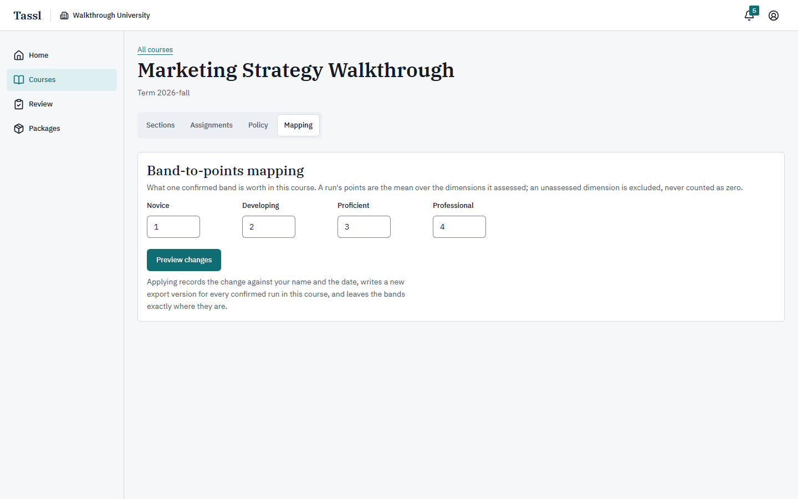

Four fields in one row, lowest first: **Novice**, **Developing**, **Proficient**, **Professional**.
Each must be a number above zero. "Enter the points as a number." if it is not a number; "Points must
be above zero." if it is zero or below.

The arithmetic is the plainest thing in Tassl: each assessed dimension is worth what the mapping
gives its band, those seven values are added, and the total is divided by the number of dimensions
actually assessed. A dimension you record as **Unassessed** is left out of the division, not counted
as nothing. The figure is rounded to three decimals. There is no total score, no rank and no
percentile anywhere.

#### Changing the mapping

The mapping has no plain **Save**. It has two steps, and it works the same way on a course with no
confirmed runs.

1. Type the four numbers.
2. Press **Preview changes** (**Working out what moves…** while it works).
3. Read **What would change**.
4. Tick "I understand every confirmed run will be re-exported."
5. Press **Apply the new mapping** (**Applying…** while it works).

Under **Preview changes** stands the note: "Applying records the change against your name and the
date, writes a new export version for every confirmed run in this course, and leaves the bands
exactly where they are."

What the preview tells you:

| Situation | What you read |
|---|---|
| The four numbers are already the course's | "These four numbers are the ones the course already uses." |
| No run in the course is confirmed | "No run in this course is confirmed yet, so nothing is re-exported. Applying sets the mapping for the runs that follow." |
| Confirmed runs exist | "{n} of {n} confirmed runs would carry a new number." and a table |
| You edited a number after previewing | An amber box: "These four numbers have changed since the preview. Preview again before applying." and **Apply the new mapping** stops working until you preview again |

The preview table is captioned "Every confirmed run in this course, priced under the current mapping
and the proposed one." with columns **Assignment**, **Points now**, **Points after**, **Change** and
**Run**. **Change** reads **Moves** or **Stays**; **Run** links to the replay, where the student's
name is. A run with no assessed dimension reads **No points**.

If you press **Apply the new mapping** without ticking the box, the screen answers "Tick the box
above before applying: every confirmed run in this course gets a new export version."

On success a toast reads "The mapping is saved. {n} runs were re-exported." That number counts the
runs whose points moved. A new export version is written for **every** confirmed run in the
course, including the ones whose number stayed the same, which is what the checkbox and the note are
telling you. The bands themselves never move; only the points do.

#### What a weight does, and what a student sees

The **Weight** on an assignment (or the course's **Default run weight** where the assignment sets
none) is what one run is worth in your gradebook. Tassl never multiplies anything by it. It shows the
number to the student before their run starts, alongside the mapping and the sentence "This run
counts toward the course grade. Run one counts.", and it writes both into the course export.

The student sees the mapping again in their debrief, with their bands priced under it and the
arithmetic written out. They do not see it in their downloadable Judgment Record: the weight, the
mapping and the points are stripped from that file at every depth, on purpose. The record is the
artifact that leaves Tassl; the arithmetic is your course's business.

**Tassl holds no grade.** You carry the bands, the mapping and the points to the gradebook of record
yourself. Every screen that shows a number says so.

---

### Exports

An export is the versioned document your gradebook is filled from. The first one is written the
moment all seven bands of a run carry a decision. Every correction, every re-decision and every
mapping change writes another. Nothing is ever unwritten.

Two places show them. On a replay, the **Course exports** panel on the **Bands** view lists that one
run's versions. For a whole assignment, press **Course exports** at the top of the assignment screen.

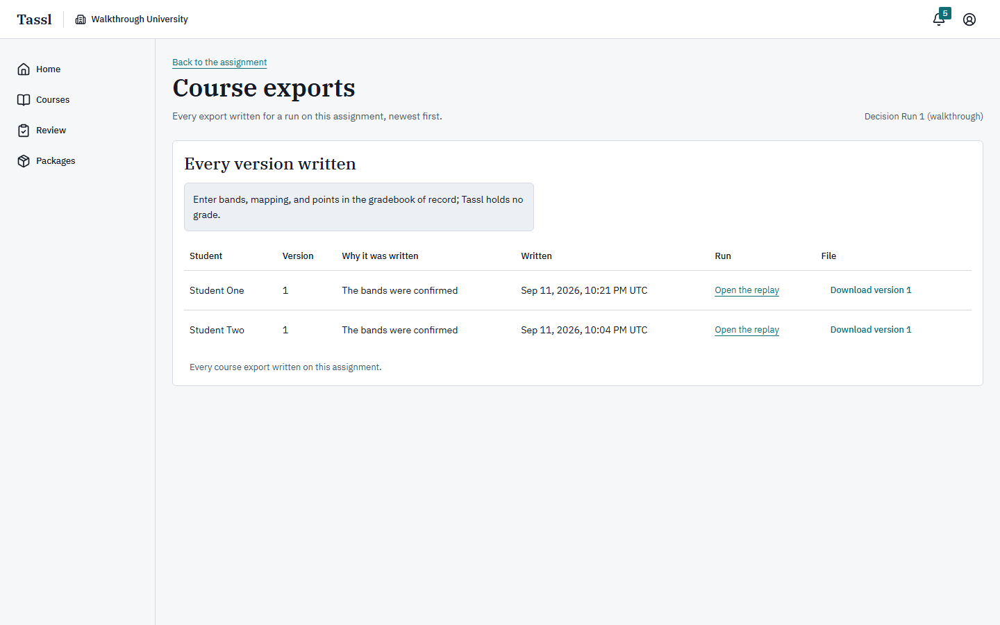

The screen is headed **Course exports** — "Every export written for a run on this assignment, newest
first." — with **Back to the assignment** above it and the assignment's name to the right. Its panel
is **Every version written**, and a boxed sentence sits above the table: "Enter bands, mapping, and
points in the gradebook of record; Tassl holds no grade."

| Column | What it holds |
|---|---|
| **Student** | The student the run belongs to |
| **Version** | The version number, counting up per run |
| **Why it was written** | One of five fixed sentences (below) |
| **Written** | When, in UTC |
| **Run** | **Open the replay** |
| **File** | **Download version {n}** |

| **Why it was written** | What caused it |
|---|---|
| "The bands were confirmed" | The seventh decision confirmed the run |
| "A band was decided again" | You decided a band on an already-confirmed run |
| "A correction was entered" | You entered a correction on a confirmed run |
| "The course changed its mapping" | You applied a new band-to-points mapping |
| "A dimension was marked not assessed" | A dimension was taken out of the arithmetic |

With none, the panel reads **No export yet** — "The first export for a run is written when all seven
of its bands carry a decision. Every correction after that writes another."

#### Starting a download and what arrives

Press **Download version {n}**. It is an ordinary link, so your browser's own save, open-in-new-tab
and copy-link all work. The file is named for the run and the version it holds, and arrives
immediately; nothing is queued and nothing is emailed.

Inside it are four parts:

| Part | What it carries |
|---|---|
| Header | The run, the package and version, which variant, the **policy** the student was shown — including the **weight** and the **mapping** — the working clock, the readiness result, and every state the run passed through |
| Events | Every event of the run in order, with the clock as it stood and the full record of each |
| Claims | One row per consequential claim: what it was, what it deserved, what the student did with it, whether they relied on it, and whether it carries a correction |
| Computed | The three confidence figures, the False Challenge Rate, and the **points** — confirmed points only; a draft figure never reaches an export |

The student never sees this file, and no notification about it goes to them. They have their own
**Judgment Record**, which is the same run in the same shape with the weight, the mapping, the points
and every reviewer-only field removed. Reviewer-only fields — the author's expected-answer notes, the
guard marks on a delegation, the observation that a decision was locked inside four minutes — are not
in their copy at all.

A voided run has no export history. Its versions are refused by name, and no export written
afterwards mentions it. If a voided run had already reached your gradebook, take it out yourself.

---

### Scenario packages

A scenario package is one decision case: the brief a student reads, the Evidence Room documents,
the stakeholders, the answer space, the claims the assistant states, the Turn, the defense question
bank, the Readiness Check items, and the clock.

Three words that are easy to confuse:

| Word | What it is |
|---|---|
| **Package** (a family) | The named case. It has a **Family key** unique inside your institution, and holds many versions. |
| **Version** | One state of that case. Version 1 is written with the package. It is a **Draft** until every element is confirmed, then **Confirmed** and frozen for good. |
| **Variant** | One of two readings of the same version. **Defective** plants exactly one consequential claim that does not hold up; **Sound** plants none. Both exist on every version, automatically. An assignment picks one. |

**An assignment can only run on a confirmed version.** That is the whole reason this area matters to
you.

#### What you do here, and what a scenario author does

In most courses a scenario author builds and confirms the package, and you never open these screens
except to read one. Your instructor seat carries every authoring power, so you can do the whole job
yourself where nobody else is doing it: the screens below are the same ones an author works on, and
[Building a package from a seed case, start to finish](#building-a-package-from-a-seed-case-start-to-finish)
at the end of this feature walks the whole job through. The
[scenario author manual](04-scenario-author.md) covers the same screens from a seat that does nothing
else.

#### The shelf

**Packages** in the rail — "The scenario packages this institution has authored. A confirmed version
is what an assignment runs on."

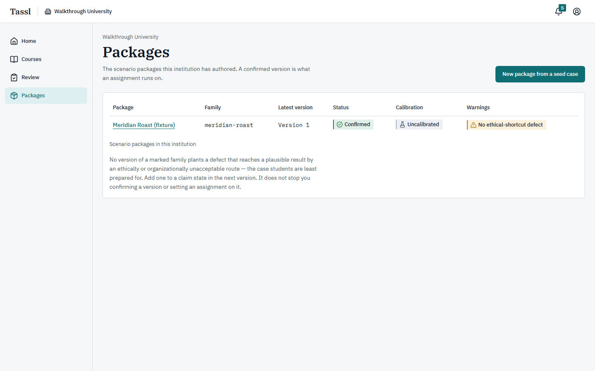

| Column | What it holds |
|---|---|
| **Package** | The title, linked to its latest version |
| **Family** | The family key |
| **Latest version** | **Version {n}**, and "{n} versions in the family" when there is more than one |
| **Status** | **Draft**, **Confirmed** or **Retired** |
| **Calibration** | **Uncalibrated** on every version in this build |
| **Warnings** | Warning chips, or an em dash |

Two warnings exist and neither blocks anything. **No ethical-shortcut defect** means no version of
the family plants a defect that reaches a plausible result by a route an organization should not
take. **A concept rests on one item** means a Readiness Check concept is carried by a single
question. Both print an explanation under the table, and both end "It does not stop you confirming a
version or setting an assignment on it."

With none, the screen reads **No packages yet** and offers **New package from a seed case**.

#### Starting one

**New package from a seed case** opens a form in two panels: **The package** (**Title**, **Family
key**, **Concepts** — at least four) and **The seed case** (**Case title**, **Publisher**, **License
terms**, the checkbox **The license permits adaptation**, and **Seed case text**, 200 to 200,000
characters pasted in).

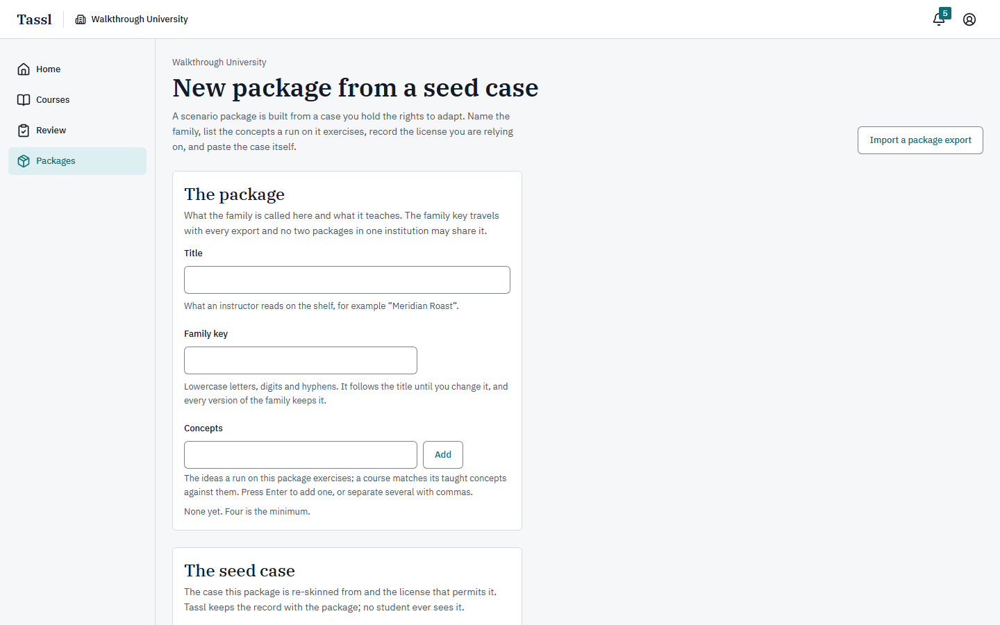

Two buttons finish it. **Create and generate** writes the package and then drafts its elements from
the seed case in seven steps. **Create the package** writes the package and nothing else, which is
what you want if you are bringing an export or writing it yourself. The note under them is worth
reading: "Nothing it writes is part of a package until you read every element and record a decision
on it."


Tassl will not build a package from a case whose license you have not confirmed permits adaptation.
Submitting with fields missing renders a summary above the buttons — "The package was not created.
Put these right and create it again:" — with one line per field, each a link that puts your cursor in
it.

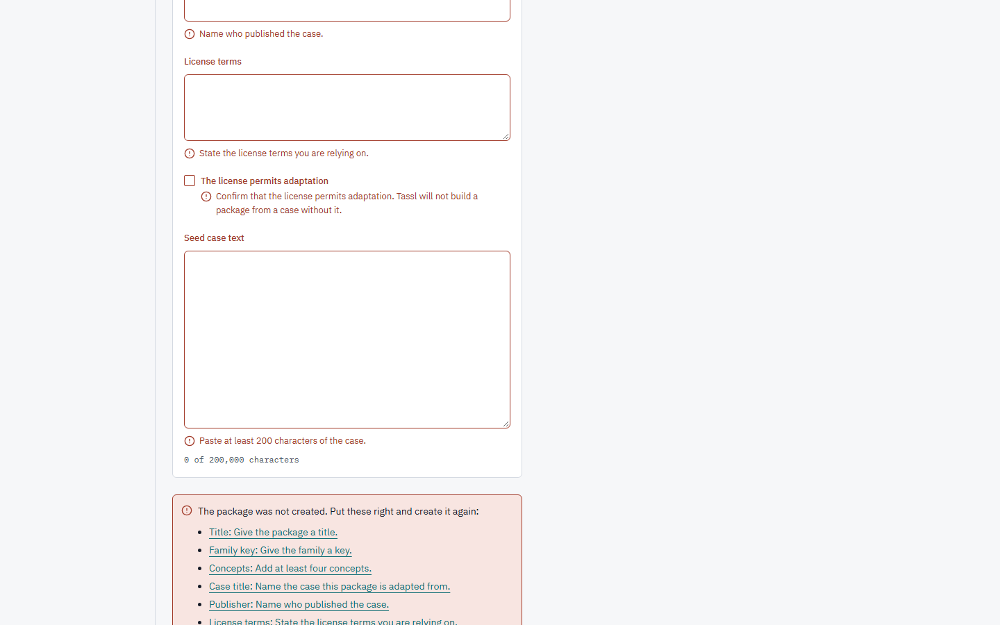

**Import a package export**, at the top right of the same screen, takes a pasted package JSON file
and brings it in as a new family with its own draft version.

#### The generation screen

Seven steps, one model call each, writing the version from the seed case.

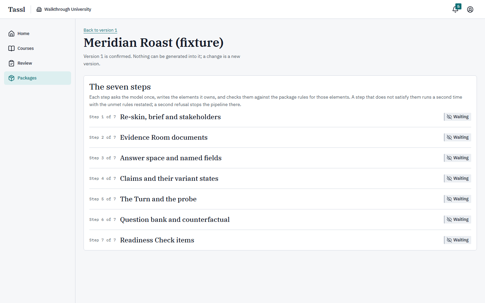

| Step | What it writes |
|---|---|
| 1. **Re-skin, brief and stakeholders** | The brief, the stakeholders, the re-skin log |
| 2. **Evidence Room documents** | The documents |
| 3. **Answer space and named fields** | The positions a decision can take, and the numeric fields |
| 4. **Claims and their variant states** | The claims and what each variant makes of them |
| 5. **The Turn and the probe** | The message from the world, and the scripted reversal |
| 6. **Question bank and counterfactual** | The defense questions and the three-sentence counterfactual |
| 7. **Readiness Check items** | The sixteen questions |

Each row shows **Step {n} of 7**, the step's name, and a status chip: **Waiting**, **Running**,
**Done** or **Did not finish**; once it has run, also **Pass**, **Tokens**, **Cost estimate** and
**Took**. A step that fails its rules runs a second time with the unmet rules restated; a second
refusal stops the pipeline there and names what it could not satisfy. On a confirmed version the
page says so plainly: "Version {n} is confirmed. Nothing can be generated into it; a change is a new
version."

#### Opening a version

Click a package on the shelf. The heading is the package title; **All packages** goes back.

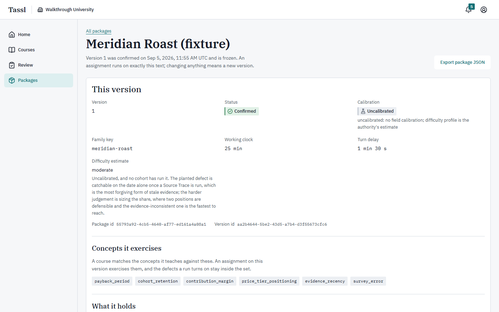

| Panel | What it tells you |
|---|---|
| **This version** | **Version**, **Status**, **Calibration** with the note "uncalibrated: no field calibration; difficulty profile is the authority's estimate", **Family key**, **Working clock**, **Turn delay**, **Difficulty estimate** with its written note, and the two identifiers **Package id** and **Version id** |
| **Concepts it exercises** | The concept set. "A course matches the concepts it teaches against these." |
| **What it holds** | **Claims**, **Variants**, **Documents**, **Stakeholders**, **Answer-space positions**, **Named fields**, **Defense questions**, **Readiness items** |
| **Warnings** | Any warning on this version, with its explanation |
| **Package rules** | On a draft only: whether every rule passes, or which still fail, with buttons **Open the confirmation workspace** and **Generation** |
| **Confirmation record** | Every decision an author took, as **Decisions by element type** (**Element type**, **Decisions**, **By**, **Latest decision**), then **Decisions that were not a plain confirmation**, then a disclosure **All {n} decisions, newest first** |
| **Authoring record** | **Generating model**, **Generated**, **Confirmed by**, **Confirmed**; then **The seed case** (case title, publisher, license terms relied on, and whether the author confirmed the terms permit adaptation) and the **Re-skin log** with columns **Change**, **From**, **To**, **Note** |
| **Authoring measures** | **Seed to confirmed**, **Edit rate**, **Rejected share**, **Generation passes**, **Review time per element** |
| **Claims** | The claims table |

Above the description, **Export package JSON** downloads the whole version as one file, named for the
family key. Every cross-reference inside it is an element key rather than an internal identifier, so
the file can be imported into another institution.

#### The claims table

"Every claim the assistant can state in this scenario package, and what each variant makes of it."
It is captioned "Claims and their per-variant states", and the claim column stays in place while the
variant columns scroll sideways.

| Column | What it holds |
|---|---|
| **Claim** | The claim's key and its text |
| **Importance** | **Load-bearing** or **Supporting** |
| **Consequence** | **Low**, **Medium** or **High** — what it costs to be wrong about it |
| **Verification cost** | **Cheap**, **Moderate** or **Expensive** |
| **Defective variant** | What that variant makes of the claim: a **Planted** chip where it is the planted defect, an evidence badge (**Sound** / **Defective**), the **Warranted stance**, and the failure family |
| **Sound variant** | The same four, for the other reading |

Reading the two variant columns side by side is the fastest way to see exactly what was planted and
what a student on either variant should have concluded.

#### One claim

Click **Open claim** on a row.


| Section | What it tells you |
|---|---|
| **Where it comes from** | **Stated by** ("The assistant, on its own account" or "A document in the Evidence Room"), the source document, its **Author**, its date, and the passage |
| **What it weighs** | **Importance**, **Consequence if wrong**, **Verification cost**, **Concept**, **Weakly sourced**, **Volatile**, **Figures it carries** |
| **What surfaces it** | The trigger phrases that bring the assistant to this claim |
| **Escalation** | Whether a student can escalate it, and the authored reply if so |
| **What it deserved, and why** | The author's rationale — the paragraph to read before you decide a band that turns on this claim |
| **Per variant** | For each variant: **Evidence status**, **Failure family**, **Warranted stance**, **Planted defect** |
| **How a student could check it** | What a **Source Trace**, a **Replication Check** or a **Decomposition Check** returns on this claim in this variant |

#### The confirmation workspace

**Open the confirmation workspace** from a draft version. It is where every element is read and
decided.

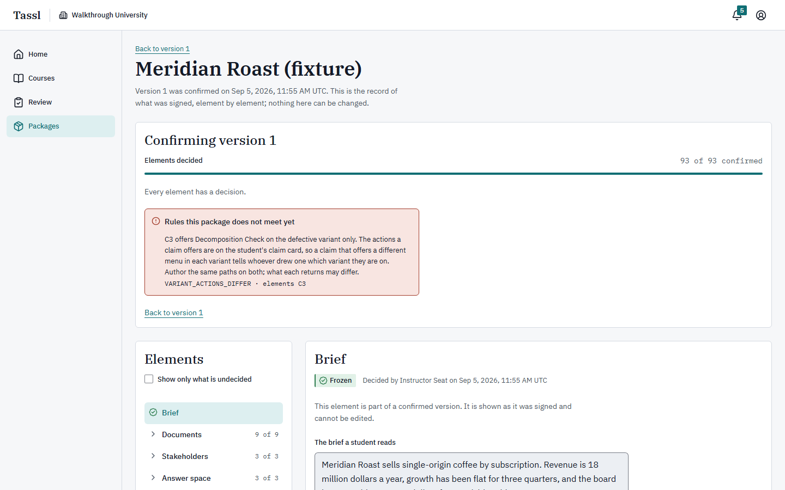

- **Confirming version {n}** shows a progress bar labelled **Elements decided** reading
  "{n} of {n} confirmed", how many are left, and any rules the package does not meet yet.
- **Elements** is the tree: **Brief**, **Documents**, **Stakeholders**, **Answer space**, **Named
  fields**, **Claims**, **Sycophancy probe**, **The Turn**, **Question bank**, **Readiness items**,
  **Debrief counterfactual**, **General escalation reply**, **Clock and difficulty**, **Seed re-skin
  log**. **Show only what is undecided** narrows it.
- The right-hand pane is the element itself, with **Save edits**, **Discard edits**, **Confirm**,
  **Reject** and **Rewrite**.
- The checkbox **Teaching note checked against the answer space and claims** and the button **Confirm
  version** finish the job.

Confirming asks for confirmation in turn: "Confirming freezes version {n} for good. No element in it
can be edited afterwards, and a change means a new version." It refuses while any element is
undecided or rejected, while the teaching-note box is unticked, or while any package rule fails.

Once a version is confirmed it is frozen: every element reads **Frozen** — "This element is part of a
confirmed version. It is shown as it was signed and cannot be edited." There is no un-confirm. When
the version is confirmed, every other instructor and scenario author in the institution is told
"A scenario package is ready to assign", and the version appears in the **Scenario package version**
select on your assignment form.

#### Building a package from a seed case, start to finish

This is the whole job on one instructor seat, in the order you do it: a new family, a licensed case
pasted in, seven generation steps, ninety-three elements read and decided, and a version frozen at
the end. The example builds a family titled "Manual authoring package" with four concepts. Budget an
hour of reading for a package of this size, and expect to come back to it — the workspace keeps every
decision as you make it.

**1. Open the form.** **Packages** → **New package from a seed case**. Nothing is filled in. Under
**Concepts** a status line reads "None yet. Four is the minimum."; under **Seed case text**, "0 of
200,000 characters".


**2. Name the family.** Type the **Title** — "What an instructor reads on the shelf, for example
“Meridian Roast”." The **Family key** fills itself in as you type, lowercased and hyphenated, so
"Manual authoring package" becomes "manual-authoring-package". Its hint says "Lowercase letters,
digits and hyphens. It follows the title until you change it, and every version of the family keeps
it." Type into the key yourself and it stops following the title. Two packages in one institution
cannot share a key.

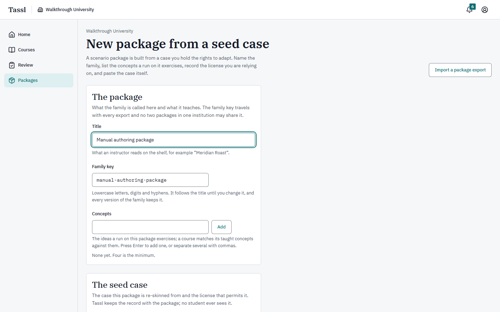

**3. Add the concepts.** Type one into **Concepts** and press Enter, or separate several with commas
and press **Add**. Each becomes a chip with its own **Remove {concept}** button, and the status line
counts them: "4 added. Four is the minimum." Four is the floor, each concept is 2 to 60 characters,
and a repeat is refused with "“{concept}” is already in the set." These are what a course's
**Taught concepts** are matched against, so write them the way your syllabus does.

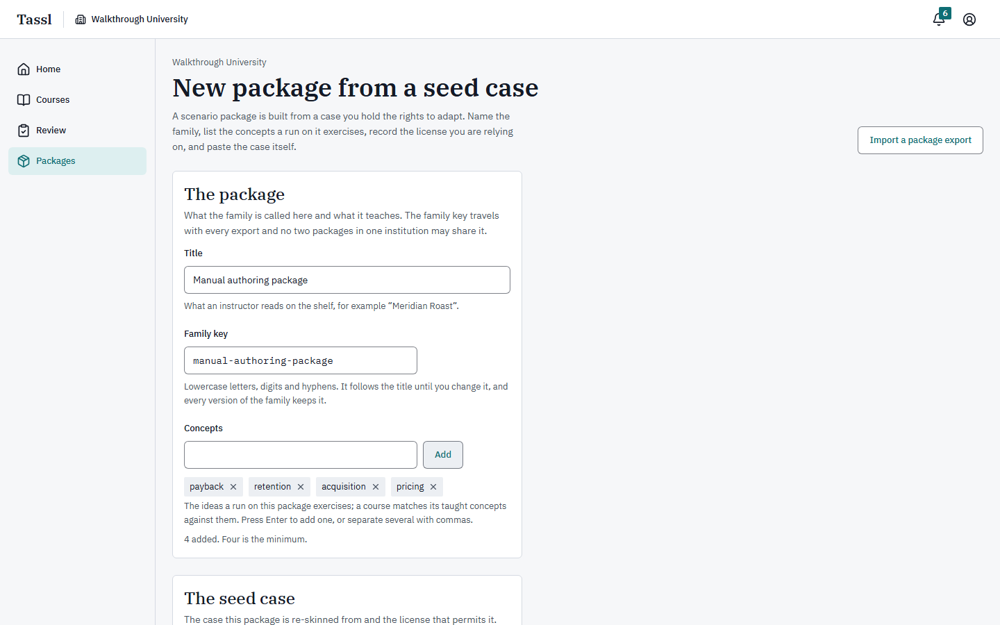

**4. Record the license.** Fill **Case title**, **Publisher** and **License terms** — "The terms you
are relying on, in your own words: the clause, the edition it belongs to, and where you read it." —
then tick **The license permits adaptation**. Under the box: "Tassl records this confirmation against
your name and keeps it in the seed record. It will not build a package from a case without it." Leave
it unticked and the form marks the checkbox with "Confirm that the license permits adaptation. Tassl
will not build a package from a case without it."

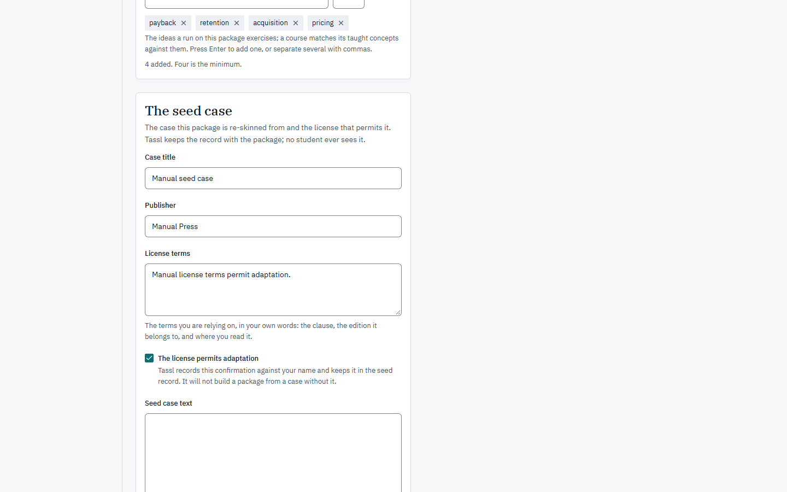

**5. Paste the case.** **Seed case text** takes at least 200 characters and at most 200,000; the
counter under it reads "{n} of 200,000 characters". "A long paste is expected and nothing is
trimmed." No student ever sees this text: it is kept in the seed record, and only an instructor or a
scenario author of your institution can read that.

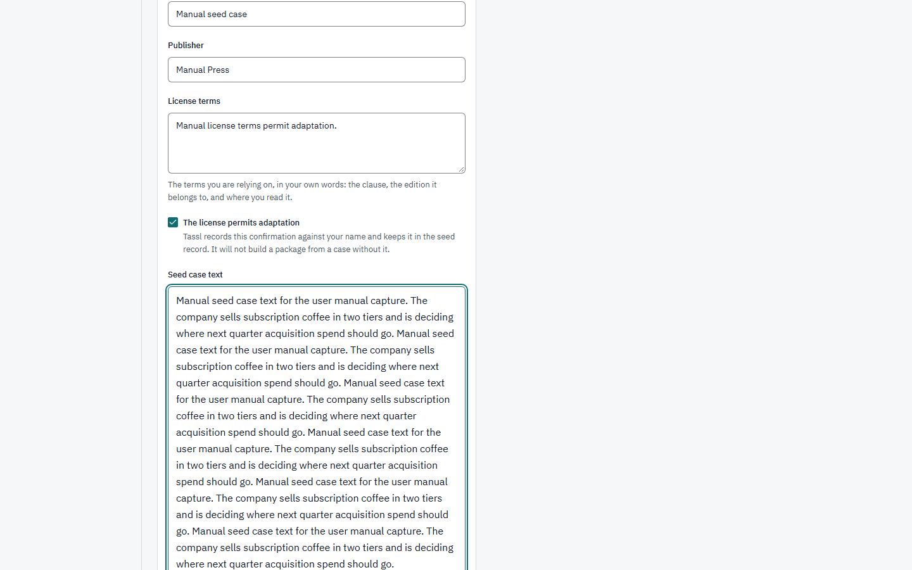

**6. Press Create and generate.** The label reads **Creating and starting…** while it works, a toast
reads "Created {title}.", and the generation screen opens on version 1 under the line "Seven steps
are writing version 1 from the seed case. This screen asks the server where they have got to every
five seconds." Every step starts at **Waiting** and the page moves them along on its own, so you can
leave it open. (**Create the package** instead writes the family and stops, on a screen reading
"{title} is on the shelf" with **Generate version 1**, **Open version 1** and **All packages** — that
is the path for an import or for writing the elements by hand.)

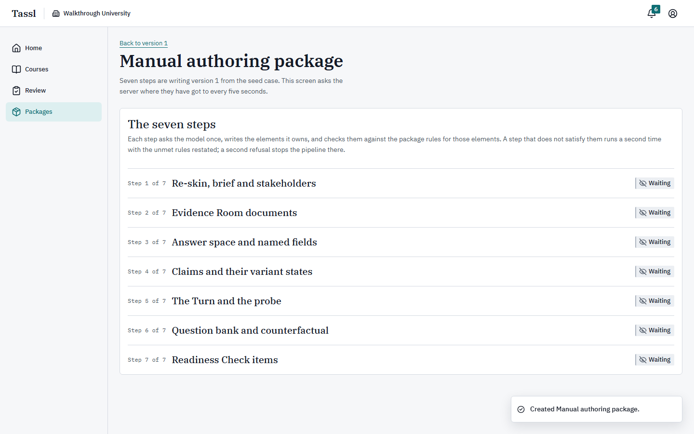

**7. Read the finished generation.** The description becomes "All seven steps finished. Every element
is a draft: read each one in the confirmation workspace and record a decision before version 1 can be
confirmed." Each step carries **Done**, **Pass**, **Tokens**, **Cost estimate** and **Took**, and
three totals close the panel: **Tokens so far**, **Cost estimate so far** and **Passes run**. A panel
above them reads **Every package rule is met** — "Version 1 is a complete draft. Read every element,
record a decision on each, and the version can be confirmed and frozen." — with the button **Open
confirmation workspace**. Where a rule still fails the same place reads **Rules this package does not
meet yet** and names them; a draft can be confirmed only once they all pass.

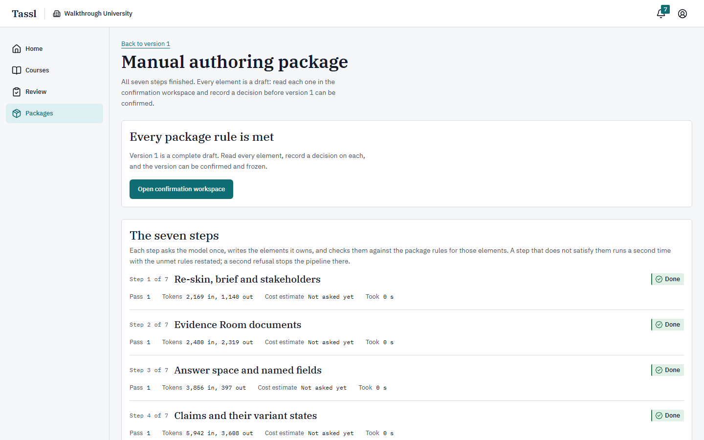

**8. Open the workspace.** It says what the job is: "Read each element, edit what needs it, and
record a decision. When every element has a decision, the teaching-note check is ticked and the
package rules pass, version 1 can be confirmed — and is then frozen for good." **Confirming version
1** carries the progress bar **Elements decided** at "0 of 93 confirmed" with "93 left to decide"
under it. The element the tree opens on fills the right-hand pane — here the **Brief**, "The decision,
its stakes and what is being asked for, in the world’s own voice.", with its word counter reading
"159 of 200 words", the buttons **Save edits**, **Confirm**, **Reject** and **Rewrite**, and the line
"Nothing has changed in this element yet."

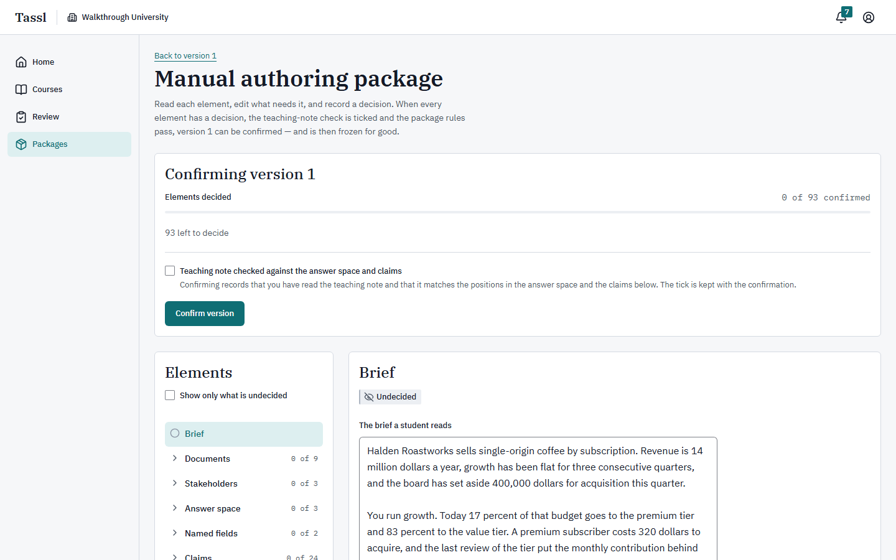

**9. Learn the tree.** **Elements** lists the version in the order a run meets it, each group with
its own count: **Brief**, **Documents** 9, **Stakeholders** 3, **Answer space** 3, **Named fields**
2, **Claims** 24, **Sycophancy probe**, **The Turn**, **Question bank** 29, **Readiness items** 16,
**Debrief counterfactual**, **General escalation reply**, **Clock and difficulty**, **Seed re-skin
log**. Each row carries a status: **Undecided**, **Edited**, **Confirmed** or **Rejected**. **Show
only what is undecided** narrows the tree to what is left, and answers "Nothing is left undecided."
when there is none.

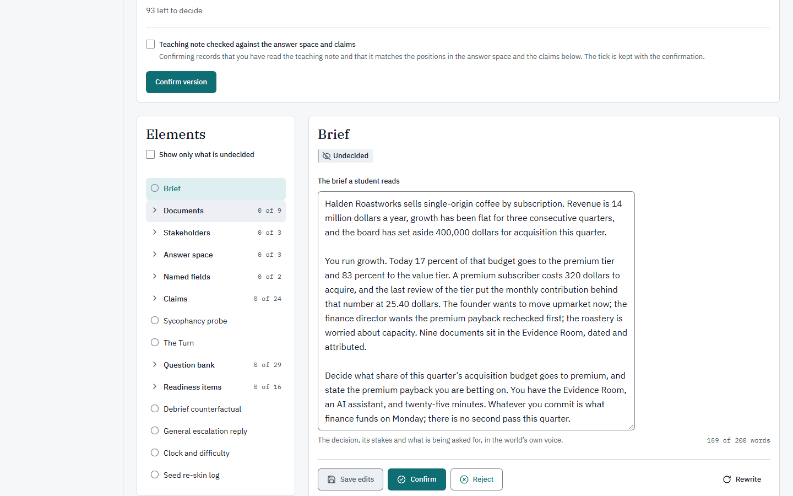

**10. Open a group.** Click a group to see its members. **Documents** opens to the nine Evidence Room
documents, each with its title and its key — D1 to D9 — so you can read them in the order a student
will. A document's pane carries **Title**, **Author**, **Dated**, **Role in the Evidence Room**,
**Order** ("Where this sits among the others of its kind; lowest first."), **Superseded by** ("The
later document that replaces this one. Required when the role is Superseded."), a field naming the
stakeholder it belongs to ("The stakeholder this document came from, if any.") and **Body**, up to
2,000 words.

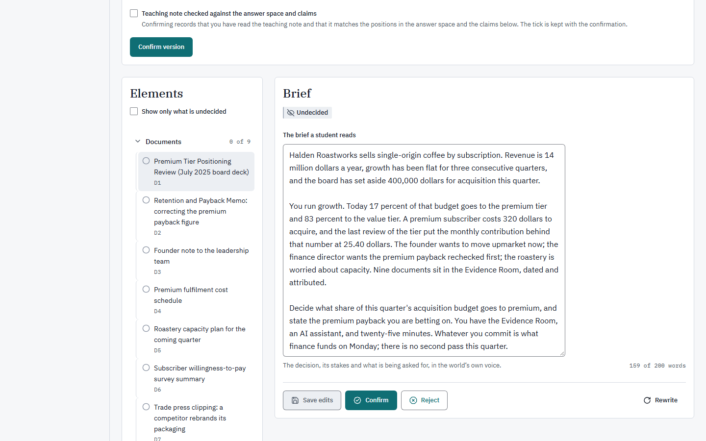

**11. Reject what is wrong.** **Reject** opens a panel under the element, named **Reject {name}** —
"Say what is wrong with it. The note is kept with the decision, and the element stays in the version
until it is re-authored." Write the reason into **Why this element is rejected**; it is required, and
an empty one is refused with "Say what is wrong with it before rejecting." Press **Reject element**
(**Rejecting…** while it works), or **Cancel**.

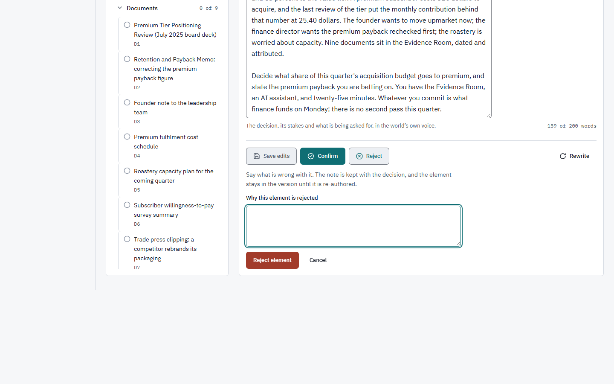

A toast reads "{name} rejected." The row now reads **Rejected**, the progress line adds "1 rejected"
beside what is left to decide, and a **Next undecided element** link appears so you can carry on
reading. A rejection is not a decision that lets the version through: the pane reads **Rejected, and
waiting to be re-authored** — "A rejected element keeps the version from being confirmed until it is
re-authored. Ask for a new draft with Rewrite, or edit the fields below and save, which records the
edit as its decision."

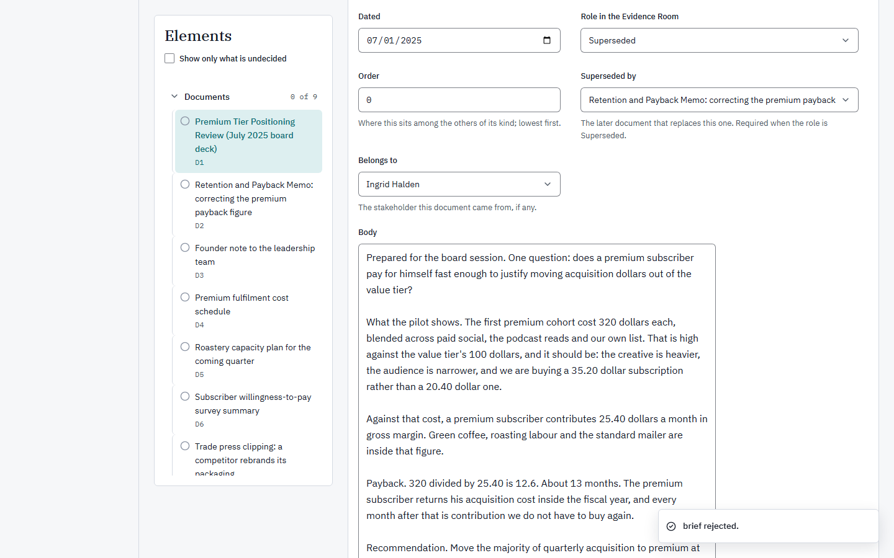

**12. Ask for a new draft.** **Rewrite** opens its own panel, named **Rewrite {name}**, and tells you
exactly how far it reaches: "A new draft is written for {scope}, this one included. Anything you have
confirmed is kept exactly as it is; everything else in that set is written afresh — including work you
have edited and saved but not confirmed — and needs a decision again." The scope is a set, not one
element: on a document it is every document in the version, on the brief it is the brief, the
stakeholders and the re-skin log, on a claim it is every claim, both variant readings of each, and the
general escalation reply. **What the new draft has to get right (optional)** takes one or two
sentences, up to 2,000 characters, and they are given to the model as a rule the new draft has to
satisfy beside the package rules. The button names the scope — **Rewrite every document in this
version** — and reads **Writing…** while it works.

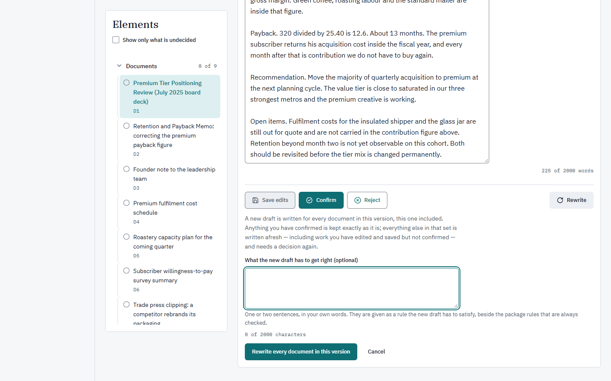

While a draft is being written nothing can be saved or decided: "A new draft is being written. Nothing
can be saved or decided on until it lands, so that no decision is recorded against values about to be
replaced." It takes about a minute and the screen picks it up itself, with the toast "The new draft of
{name} is on the screen." On an element that already carries a decision the button is replaced by the
sentence "Reject this one first, and the new draft will replace it." — a confirmed element is never
overwritten behind your back.

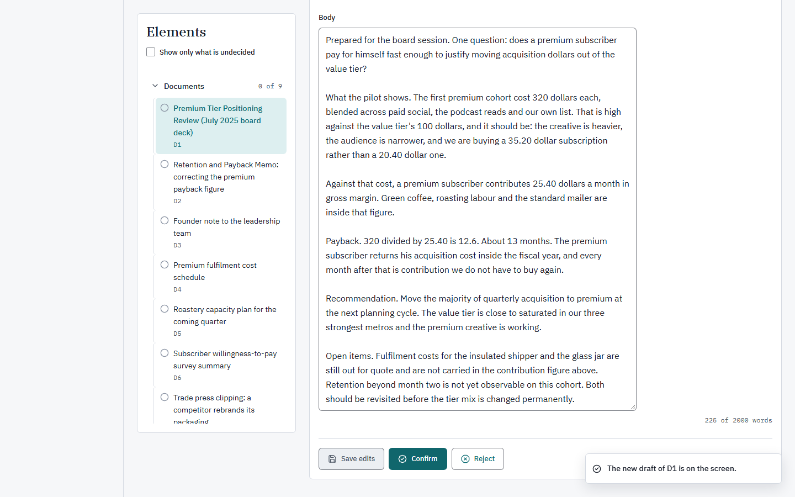

**13. Confirm an element.** Read it, edit anything that needs it — **Save edits** stays greyed until
something changes and then records the edit as that element's decision, **Discard edits** throws your
changes away — and press **Confirm** (**Confirming…** while it works). A toast reads "{name}
confirmed.", the count moves to "1 of 93 confirmed", the row turns **Confirmed**, and the pane moves
on to the next element. A confirmed pane carries "Decided by {name} on {date}", its revision number,
and "This element carries a decision that stands. Reopen it to change a field; saving the change
records a new decision on top of this one." with a **Reopen for editing** button.

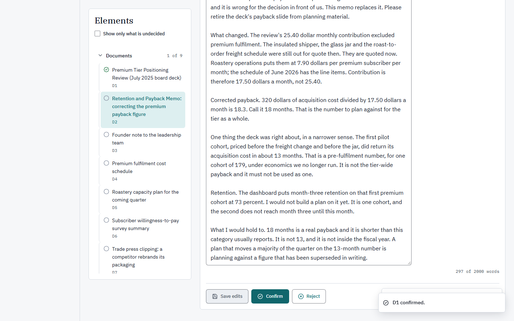

**14. Decide everything.** Work down the tree until the bar reads "93 of 93 confirmed" and the line
under it becomes "Every element has a decision." A rejected element has to be settled too — by a new
draft you then confirm, or by editing and saving it — so nothing is left reading **Rejected**.

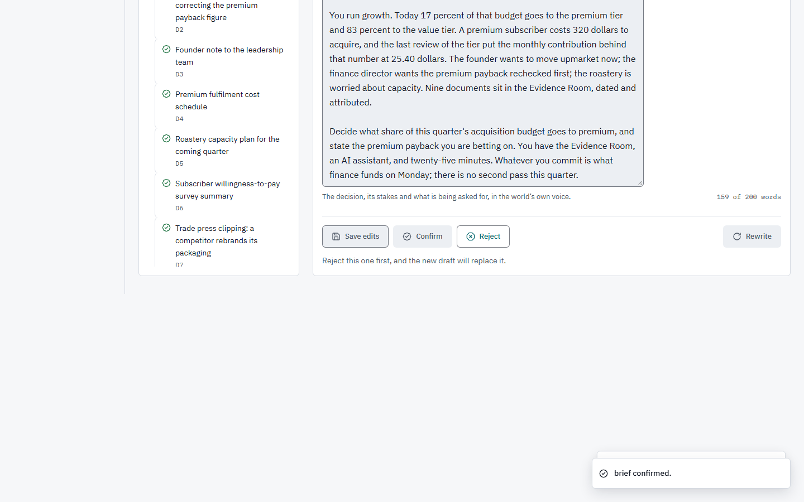

**15. Tick the teaching note.** **Teaching note checked against the answer space and claims** —
"Confirming records that you have read the teaching note and that it matches the positions in the
answer space and the claims below. The tick is kept with the confirmation." Tick it once you have
done that reading, not before: the tick is part of the record of who signed this version off.

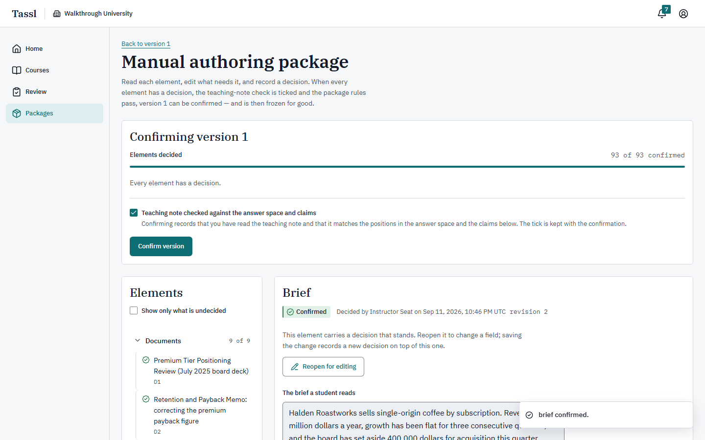

**16. Confirm the version.** Press **Confirm version**. The dialog is headed **Confirm version {n}?**
— "Confirming freezes version {n} for good. No element in it can be edited afterwards, and a change
means a new version." — and lists the three things that have to hold, each with its own answer:
**Elements** "93 of 93 decided", **Package rules** **All met**, **Teaching note** "Checked against the
answer space and the claims, and kept with the confirmation". **Not yet** backs out; **Confirm and
freeze** does it, and the toast reads "Version {n} is confirmed and frozen."

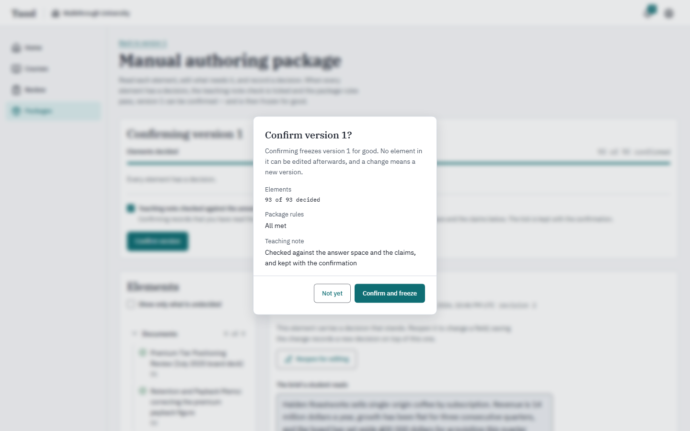

**17. What the workspace becomes.** The same address is now the record of what was signed: "Version 1
was confirmed on {date}. This is the record of what was signed, element by element; nothing here can
be changed." Every row reads **Confirmed**, every pane reads **Frozen**, the decision buttons are
gone, and **Back to version 1** is the only thing left to press.

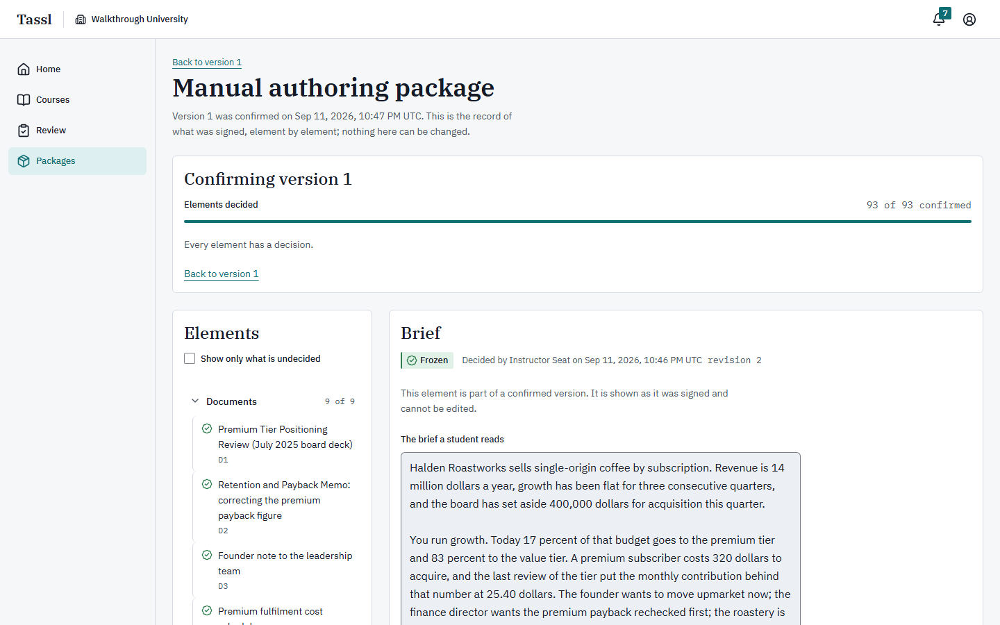

**18. The version screen afterwards.** It opens with "Version 1 was confirmed on {date} and is
frozen. An assignment runs on exactly this text; changing anything means a new version." **Status**
reads **Confirmed**, **What it holds** counts what the seven steps wrote, the **Confirmation record**
tables every decision you took — including the rejection, which stands in the record beside the
confirmation that settled the element — and the **Authoring record** carries the generating model, the
seed case and the re-skin log. A warning may sit above them, as **No ethical-shortcut defect** does
here, and none of them blocks anything.

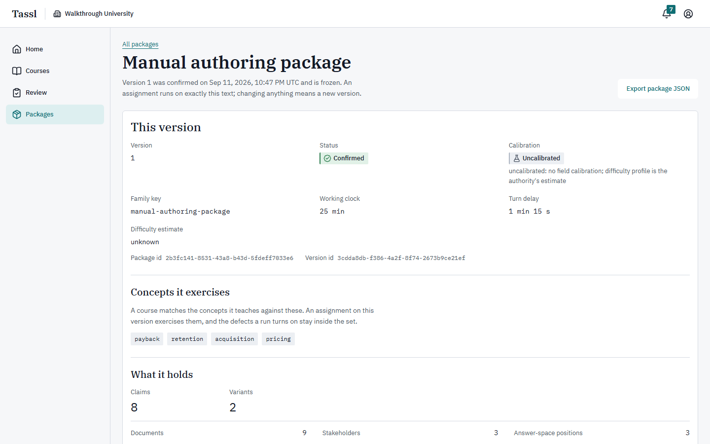

From here the version is assignable: **Assignments** → **New assignment** → **Scenario package
version**, and the family's title and version number are in the select. Nothing about the version can
change again, so if the class finds a problem in it, build version 2 rather than trying to mend
this one.

---

### Reviewing a run

#### The queue

**Review** in the rail. Its table, its six columns and the illustrative panel above it are described
in section 4. Two things to know before you open anything:

- A run appears here the moment its seven drafts are written, or the moment Tassl could place nothing
  and it needs a person. It leaves when all seven carry a decision.
- **{n} of 7** in **Bands decided** is the count of dimensions carrying your decision, not a
  progress bar through the run. **0 of 7** means the drafts are written and untouched.

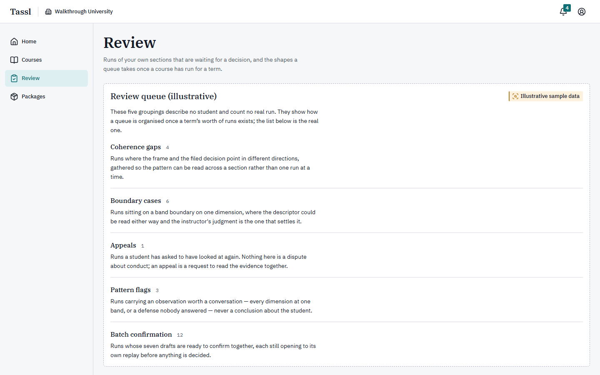

Open the oldest run first if you are working through a section; the list is newest first and has no
sort. If one row carries the amber **Under review** chip, open that one first whatever its age —
nothing placed its bands, and until somebody sets them the student's debrief does not open.


#### The replay

**Open the replay for {student}**. The heading is the student's name.

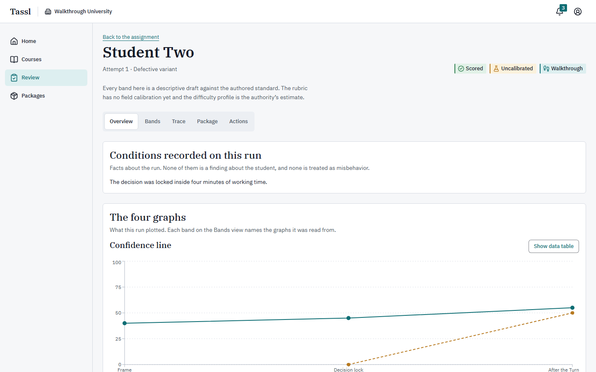

| Element | What it tells you |
|---|---|
| **Back to the assignment** | Above the heading |
| The sub-line | "Attempt {n} · Defective variant" or "· Sound variant" — this is the one place the variant is named |
| Chips | The run's state, **Uncalibrated**, and **Walkthrough** where it applies |
| The standing note | "Every band here is a descriptive draft against the authored standard. The rubric has no field calibration yet and the difficulty profile is the authority’s estimate." |
| The five views | **Overview**, **Bands**, **Trace**, **Package**, **Actions** |

A red banner appears across the top of a voided run: "This run is voided. It carries no partial
result, and no export written afterwards names it."

Opening a replay for the first time is recorded — it is what the time you spend reviewing is measured
from. Nothing about opening it changes the run.

#### Overview

Seven panels, in this order.

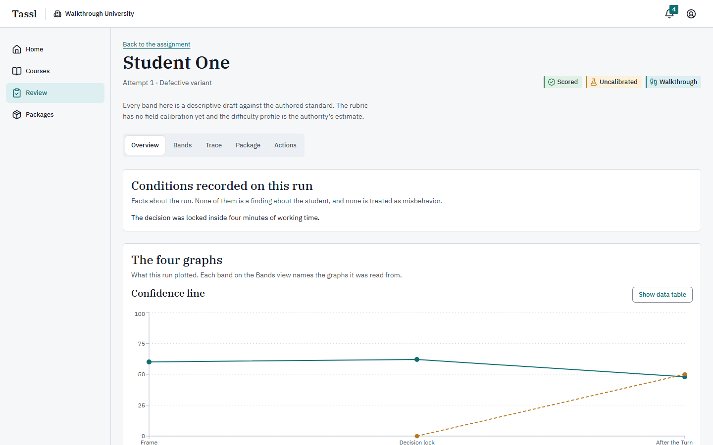

**Conditions recorded on this run** — "Facts about the run. None of them is a finding about the
student, and none is treated as misbehavior." It is drawn first on purpose. Six sentences can appear:

| Sentence | What happened |
|---|---|
| "The defense was filed with every answer left empty." | Every interview answer was blank |
| "All seven draft bands landed on Novice, the lowest band in the rubric." | Worth a second look at the drafts |
| "All seven draft bands landed on Professional, the highest band in the rubric." | The same, from the other end |
| "The decision was locked inside four minutes of working time." | The brief was filed very fast. It is an observation and no part of any placement |
| "The Readiness Check could not be submitted, so the skip was opened for the student." | A Tassl-side failure, not the student's |
| "An assistant outage is armed for this run’s next request." | Somebody armed the test control and it has not fired yet |

With none of them: "This run recorded none of these conditions."

**The four graphs** — "What this run plotted. Each band on the Bands view names the graphs it was read
from." See feature 9.

**Defense transcript** — "The interview as it happened, with the notes the package author wrote for
each question." Above it: "The defense is taken with the run record closed: the student answered from
memory."

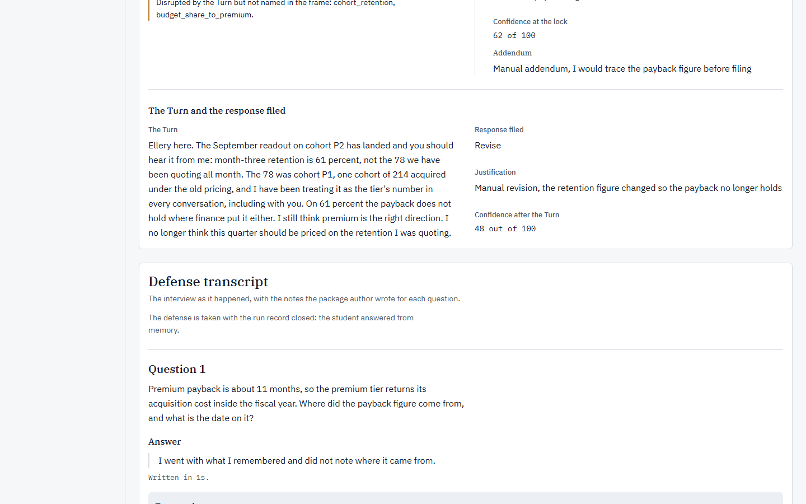

Each question is headed **Question {n}** (or **Question {n}, a follow-up**), then **Answer**, then
"Written in {n}s.", then a box of **Expected-answer notes**. Those notes are the author's, they are
yours alone, and they never appear in any student screen in any state. An unanswered question reads
"No answer was filed for this question." — which is itself an answer, and the rubric treats it as
one.

**Readiness Check** — "The concept map the Readiness Check closed with." Three sentences are possible
per concept: "You showed a working grasp of {concept}.", "{concept} looks thin.", "We could not tell
about {concept}." There is no score and no count. If the check was skipped or never finished, the
panel reads **The check did not close**.

**Outside-tool declarations** — "What the student said they used, beside what this course asks for."
Each declaration shows the student's own words, when they declared it, and your course's policy
sentence. The standing line "A declaration never changes how a run is banded." is always there.

**Delegation log** — "Every request the student made of the assistant, and what came back." The
student works in the same record while the run is open, where their panel is titled
**Delegation Log** with a capital L; it is one record under two spellings.

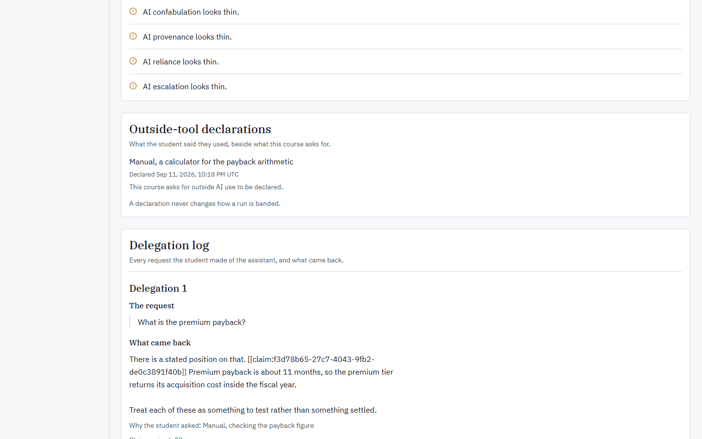

Each exchange is headed **Delegation {n}**, with **The request**, **What came back**, "Why the
student asked: {why}" (or "The student wrote no reason for this request."), and **Claims raised**
listing the claim keys, each clickable. A request made during the Turn window carries the badge
**Made inside the Turn window**. Under an exchange you may see a guard mark, written as a sentence:

| Sentence | What it means |
|---|---|
| "Tassl reassembled the reply so every claim of the scenario appeared." | The reply was rebuilt to carry the scenario's claims |
| "The reply carried the claims and no words of the assistant’s own." | Commentary was withheld |
| "The Sycophancy probe fired on this request." | The authored reversal was spliced in. It is identical for everyone and says nothing about this student |
| "The reply came back after the run had left the state that asked for it, so it was not kept." | A late reply, discarded |
| "A reviewer marked this request as outside the scenario." | See feature 11 |

With no delegation at all the panel reads **The assistant was not used** — "This run holds no
delegation. The Delegation band is drafted from what the defense says about working without one."

**Figures with nothing behind them** — "Numbers the assistant asserted that no document in the
Evidence Room supports." Usually "The assistant asserted no figure without a source."

#### Bands

The seven decisions. See feature 10 for how to make them.

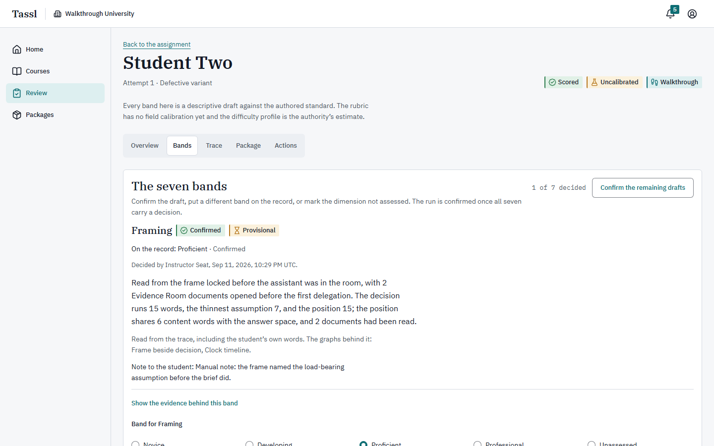

Three panels: **The seven bands**, **Points under this course’s mapping**, and **Course exports**.

#### Trace

Every event of the run in the order it was written. See feature 12.

#### Package

"Which version the student met, and who signed off on each part of it."


- Facts: **Package**, **Version**, **Status**, **Variant on this run**, and a link **Open the package
  version**.
- **Confirmation record** — "Every decision an author took on this version, and how much was
  rewritten before they took it." — followed by **Authoring measures**.
- **Claims** — "Every consequential claim of this package, with what each variant makes of it. The
  variant this run drew is marked."

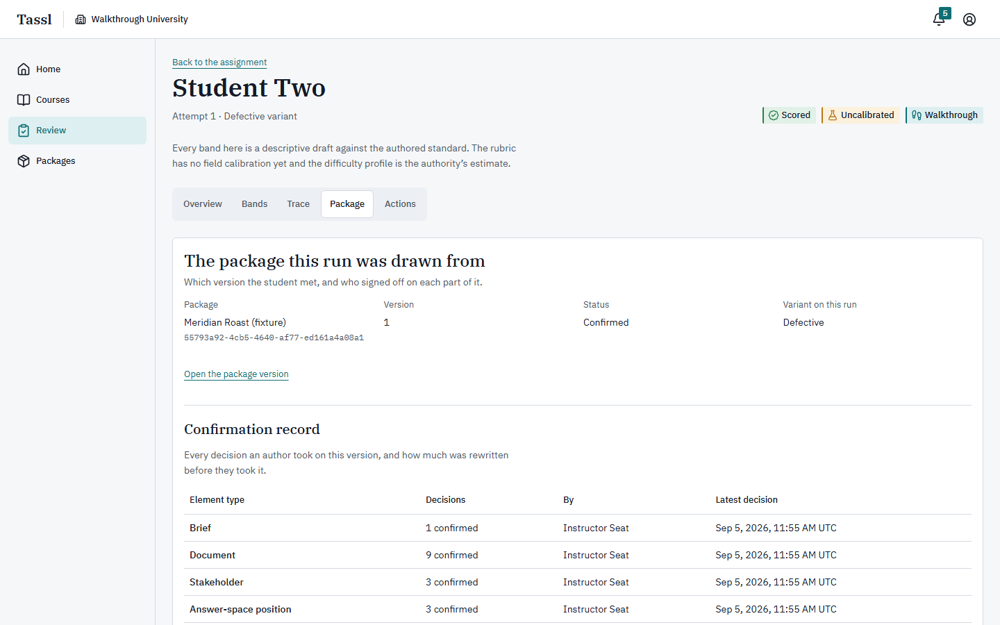

The claims table here has columns **Key**, **Claim**, **Evidence on this variant**, **Warranted
stance on this variant**, and a link **Open {key}**. A claim carrying a correction on this run is
marked "This claim carries a correction on this run." Opening one shows the same claim object
described under feature 7, with both variants' readings side by side — which is what you need when
you are deciding a band on a defective variant and want the sound reading beside it.

#### Actions

Everything that changes the run rather than describes it. See feature 11.

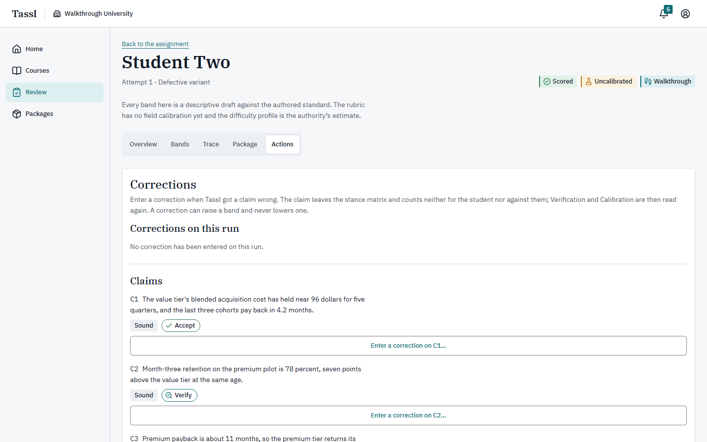

A teaching assistant opening the same view sees one panel instead: **What this seat can do** —
"Voiding a run, entering a correction and the test controls are the instructor’s. A
teaching-assistant seat decides bands."

---

### The four graphs

Every graph is plotted from the run's own trace at scoring time and stored. The student's debrief,
their Judgment Record and your replay all draw the same four from the same stored figures, so the
three can never disagree.


Each sits in a frame with a **Show data table** button. Press it and the plot is replaced by the
numbers behind it; the button becomes **Show graph**. An empty cell reads "not available".

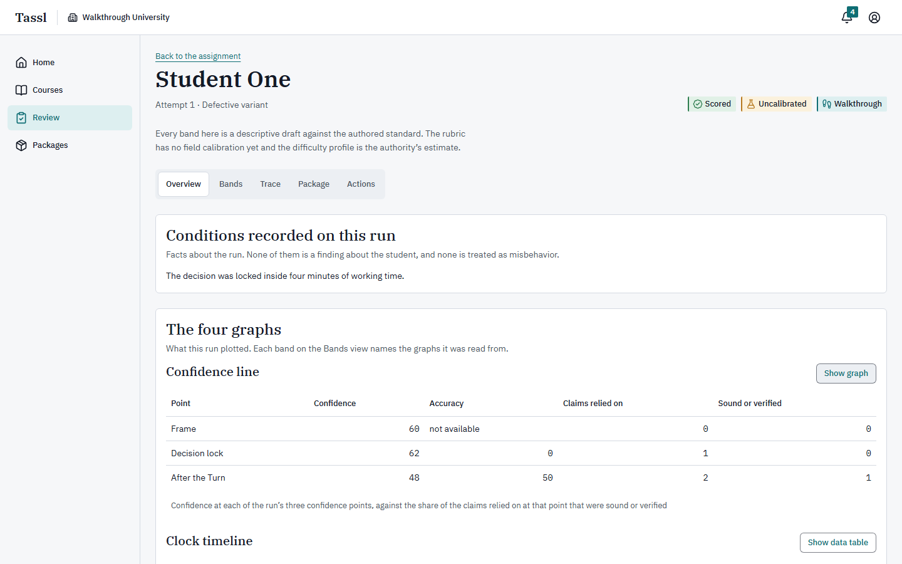

A graph that could not be drawn says so — "This graph is not available for this run." followed by
"Missing events: {types}." — and opens straight into its table. A run that never locked its frame or
never filed a decision plots no graph at all, and every dimension then comes back **Unassessed**.

#### Confidence line

- **What it plots.** Two lines over three points: the confidence the student stated, against the
  authored accuracy of the claims they were relying on at that moment.
- **Across the bottom:** **Frame**, **Decision lock**, **After the Turn**.
- **Up the side:** 0 to 100.
- **The two series:** **Confidence** (solid, round markers) and **Accuracy of claims relied on**
  (dashed, square markers). A claim counts as accurate if the material authored it sound, or if the
  student ran a check on it before that point.
- **Good shape:** confidence that tracks the accuracy line — rising as checked claims accumulate,
  falling when the Turn takes a load-bearing claim away.
- **Warning shape:** confidence rising over a flat or falling accuracy line. That is confidence
  bought with unchecked claims, and it blocks **Professional** on Calibration. A flat line — 50 all
  the way across, or 100 all the way across — is uninformative and holds Calibration at
  **Developing**.
- **At the frame the accuracy is empty, not zero.** Nothing is being relied on before the assistant
  is in the room.
- **Show data table** gives **Point**, **Confidence**, **Accuracy**, **Claims relied on**, **Sound or
  verified**.

#### Clock timeline

- **What it plots.** Two horizontal strips — **Working clock** and **Turn window** — each cut into
  segments by what the student was doing. Every millisecond belongs to exactly one segment.
- **Across the bottom:** elapsed time inside each clock, as mm:ss. Each strip keeps its own clock.
- **The segments:** **Reading**, **Delegation**, **Interrogation action**, **Escalation**, **Brief**,
  **Unattributed**, **Turn response**, **Paused**.
- **Good shape:** reading before the first delegation, checks landing on claims that mattered, a
  brief block long enough to have been written rather than typed.
- **Warning shape:** a first delegation before any document was opened — no Evidence Room document
  read before the assistant was used blocks **Professional** on Framing — and a large
  **Unattributed** block, which is time the run cannot account for.
- Claim touches, clock-stop credits, the decision lock and the Turn's delivery are carried as marks
  in the table and the description rather than drawn on the strip.
- **Show data table** gives **Clock**, **Activity**, **From**, **To**, **Length**, **Detail**.

#### Stance matrix

- **What it plots.** A five-by-five grid of counts. Rows are the stance the student **Taken**;
  columns are the stance the material **Warranted**. The five, in order, on both: **Accept**,
  **Verify**, **Challenge**, **Reject**, **Escalate**.
- **Good shape:** counts on the diagonal. A cell on the diagonal with anything in it is tinted; every
  other non-zero cell is grey. There is no good-to-bad color scale — the diagonal is the whole of
  what the drawing says.
- **Warning shape:** weight in the top-right of the grid, which is accepting what should have been
  challenged; or weight in the bottom-left, which is challenging what was sound.
- **Two figures under the grid:** **False Challenge Rate**, as "{n} percent ({n} of {n})", and
  **Stances matching what was warranted**, as a percentage.
- **False Challenge Rate** counts sound claims warranting accept or verify that the student
  challenged or rejected, over **every** consequential claim in the variant — not only the ones they
  met. Escalating is never a false challenge. Under 15 percent is a Professional condition on
  Calibration; under 30 percent with no indefensible false challenge is Proficient; 50 percent or
  above is Novice.
- **Show data table** gives one row per consequential claim and fourteen columns: **Claim**,
  **Statement**, **Surfaced**, **Stance taken**, **Set at**, **Previous stance**, **Preceding
  action**, **Stance warranted**, **Evidence status**, **Importance**, **Readiness context**, **Relied
  on**, **Corrected**, **Match**. This is the table to read when a Verification or Calibration band
  looks wrong to you.

#### Frame beside decision

- **What it shows.** Not a plot: two columns of the student's own prose. The frame they locked before
  the assistant was in the room, beside the brief they filed at the Decision Lock, with the Turn and
  their response below.
- **Columns:** **Field**, **Frame**, **Decision**.
- **Rows:** **Decision or recommendation**, **Position or rationale**, **Assumption {n}**, **What
  would change my mind**, **Confidence**, **Addendum**, **The Turn**, **Response to the Turn**. An
  assumption the Turn took away is marked **Disrupted by the Turn**. An empty field reads **Empty**.
- **Good shape:** a decision that is the same decision on both sides, assumptions that the brief still
  owns, and a response to the Turn whose justification names one of the frame's own assumptions.
- **Warning shape:** a frame and a brief pointing in different directions with nothing in between to
  explain the move; and the line "Disrupted by the Turn but not named in the frame: {list}." — the
  thing that actually moved the decision was never in the frame, which is a finding in itself.
- **Show data table** gives the same three columns as rows of text, which is the easier form to read
  a long brief in.

The data table and the sentence under each graph are the same figures your bands were read from. If
you are about to override a band, read the table first: it is the fastest way to see whether the
draft read the run correctly.

---

### The seven bands

The **Bands** view is where a run is settled. The panel is **The seven bands** — "Confirm the draft,
put a different band on the record, or mark the dimension not assessed. The run is confirmed once all
seven carry a decision." Its counter reads **{n} of 7 decided**.

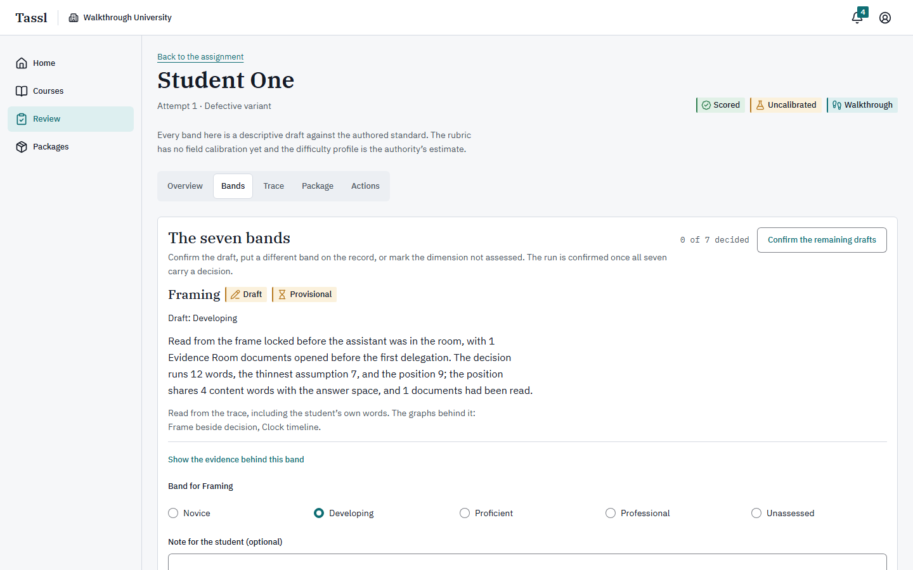

#### The seven dimensions

| Dimension | What it reads |
|---|---|
| **Framing** | The frame locked before the assistant was in the room: is the decision the one the brief ends up owning, are the three assumptions load-bearing and traceable, is the position inside the answer space, does the confidence have a stated reason |
| **Delegation** | What was handed to the assistant and what was kept: production work delegated, the decision and the claim evaluation retained, reasons stated, evidence read before the assistant was first used |
| **Verification** | Whether checks landed on the claims the decision rested on, and whether their results were read correctly. On a sound variant, whether checks were confined to claims that warranted one |
| **Calibration** | Whether reliance was proportionate to claim quality and stakes: defects kept out of the decision, false challenges few and defensible, escalations naming real limits, a confidence line that tracks checked claims |
| **Decision Quality** | The filed brief against the authored answer space: is the recommendation defensible, is the rationale on current rather than superseded evidence, is the **What would change my mind** line testable |
| **Adaptation** | The response to the Turn: hold, revise or reverse matching what the Turn warranted, the size of the move matching the new information, and a justification tying the Turn to a named frame assumption |
| **Ownership** | The unaided defense: provenance, verification choices and assumptions explained from the student's own memory, with the run record closed |

#### The four levels, and the fifth option

| Level | Where it sits |
|---|---|
| **Novice** | Lowest |
| **Developing** | |
| **Proficient** | |
| **Professional** | Highest |
| **Unassessed** | Not a low band. The dimension is left out of the points division entirely, never counted as zero |

#### What each band card shows

| Line | What it is |
|---|---|
| The dimension's name | The heading |
| A chip | **Draft** until you decide it, then **Confirmed** |
| A second chip | **Provisional**, when the band turns on free text a model read. Verification and Calibration are computed from the trace alone and are never provisional |
| The band line | **Draft: {band}** before a decision; **On the record: {band}** afterwards, followed by **Confirmed**, **Overridden** or **Unassessed** |
| The decider line | "Decided by {who}, {when}." |
| The rationale | One paragraph: the counted facts first, then the reader's own words. This is what the draft was read from |
| The basis | "Read from the trace, including the student’s own words." / "Read from the defense answers alone." / "Read from the counted facts of the run alone, without a reading of the student’s words." / "Nothing in this run placed this dimension." |
| The graphs | "The graphs behind it: {graphs}." |
| A correction notice | "A correction raised this band from {before} to {after}." where one applies |
| Your note | "Note to the student: {note}" |
| **Show the evidence behind this band** | A disclosure holding **Graphs it was read from**, **Trace events it was read from** (each linking into the Trace view) and **Quoted from the run’s own words**. All three are yours alone and reach no student screen |
| The decision control | The five radios and the note field |

Where a dimension could not be placed, the card says which of four things happened: "The graphs this
dimension is read from could not be drawn from this run’s trace." / "This run holds nothing that
places this dimension." / "The record of what this run did with its claims was lost, so it cannot be
read either way." / "The reading of this run’s free text did not come back, and the recorded events
alone do not place this dimension."

**Everything Tassl writes here is a draft.** Your decision is the one that stands.

#### Confirming a band

1. Read the rationale, and open **Show the evidence behind this band** if you want the events it was
   read from.
2. Leave the draft band selected in **Band for {dimension}**.
3. Press the primary button, which names the band: **Confirm the draft: {band}**.

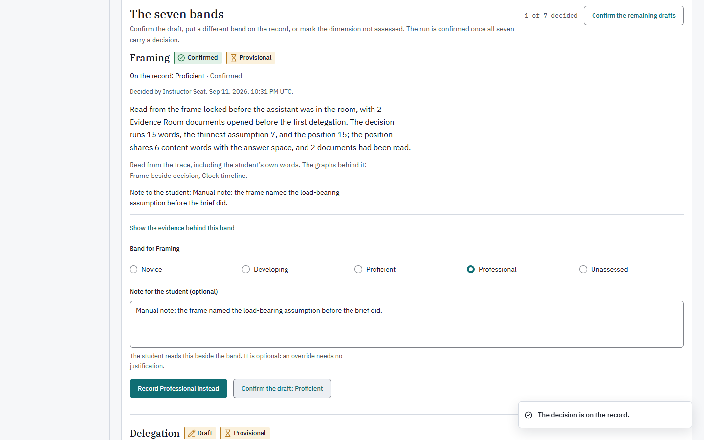

A toast reads "The decision is on the record." The card now reads **On the record: {band} ·
Confirmed** and carries your name and the time.

#### Overriding a band

1. Choose a different level in **Band for {dimension}**. The five options are **Novice**,
   **Developing**, **Proficient**, **Professional** and **Unassessed**.
2. Optionally write a **Note for the student (optional)** — at most 1,000 characters. Its hint reads
   "The student reads this beside the band. It is optional: an override needs no justification."
3. The primary button changes to **Record {band} instead**. A secondary button appears beside it
   still offering **Confirm the draft: {band}**, so you can change your mind without reloading.
4. Press the primary button.

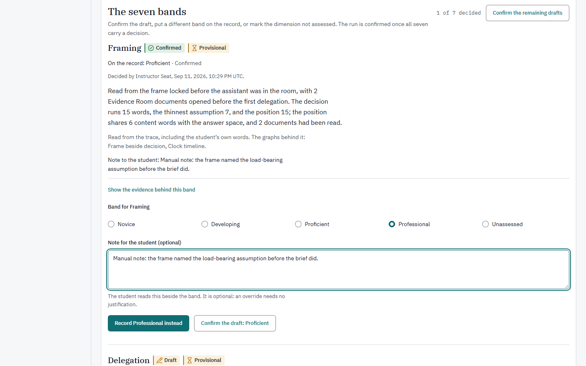

Choosing **Unassessed** changes the button to **Record this dimension as Unassessed**. That takes the
dimension out of the arithmetic; it is not a low band, and it never counts as zero.

Nothing is submitted by opening the card, and nothing is submitted by clicking a radio. If you press
the button with nothing selected, the card answers "Choose a band, or mark the dimension not
assessed."

#### Confirming the rest at once

**Confirm the remaining drafts**, at the top of the panel, is offered whenever anything is still
undecided. It opens a dialog:

> **Confirm the remaining drafts?**
>
> "These are the dimensions nobody has decided. Each takes the band drafted for it, and the last of
> the seven confirms the run."

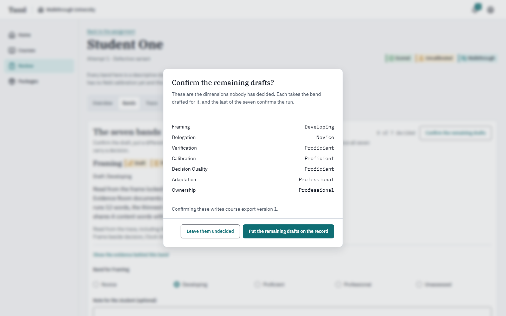

It lists every undecided dimension with the band it would take, then the line "Confirming these
writes course export version {n}." **Leave them undecided** cancels; **Put the remaining drafts on
the record** does it, and a toast reads "The remaining drafts are on the record."

It only touches dimensions nobody has decided. Anything you have already decided is left exactly as
it stands.

#### What happens on the seventh decision

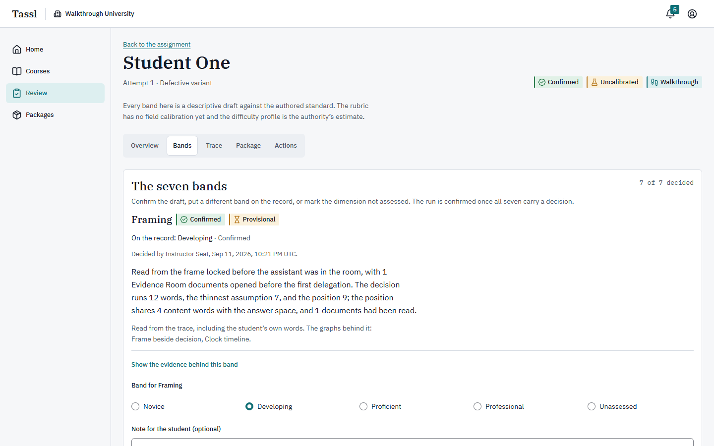

The moment the seventh dimension carries a decision:

1. The run moves from **Scored** to **Confirmed** — and straight on to **Recorded** if the student
   has already answered their two debrief questions.
2. The points are priced and written.
3. Course export version 1 is written, reason "The bands were confirmed".
4. The student is notified: **Your bands are confirmed** — "Your instructor has finished reviewing
   your run. Your debrief now shows the confirmed bands and any note they left."
5. Every other reviewer of the section is told **A course export is ready**.
6. The run leaves your review queue.


#### What the student sees the moment a band is confirmed

Their debrief chip changes from **Draft** to **Confirmed**, the standing note becomes "Your
instructor has read this run. Each band below is what they decided, with any note they wrote.", and
each dimension is labelled **Confirmed band** instead of **Draft band**, with one line saying what
you did:

| What you did | What they read |
|---|---|
| Confirmed the draft | "Your instructor confirmed the draft." |
| Recorded a different band | "Your instructor decided this dimension differently." |
| Recorded it unassessed | "Your instructor recorded this dimension as unassessed, so it is left out of the arithmetic." |
| Left a note | "Your instructor wrote" and then your words |
| Left no note | "Your instructor wrote no note on this dimension." |

They never see which band Tassl drafted, the evidence list behind the band, or the quotes it was read
from. They see the band you decided and your note.

#### Deciding again afterwards

You can change a band on a run that is already confirmed. The card warns you first: "This run is
already exported. A decision changed here writes a new export version." The new version's reason
reads "A band was decided again". The run is not confirmed a second time and the student is not
notified again; their debrief simply shows the new band.

#### The points panel

Under the bands sits **Points under this course’s mapping** — "The arithmetic, written out, so the
figure can be checked rather than taken on trust."

- **This course’s mapping** lists the four values, as "{band} = {value}".
- A sub-heading says which bands are being priced: **From the seven draft bands**, **From the seven
  bands on the record**, or **After the correction**.
- A table captioned "Each dimension, the band it stands on, and what the mapping makes of it." with
  columns **Dimension**, **Band**, **Points**. An unassessed dimension reads **Not counted**.
- A total row: **Total over the assessed dimensions ({n})**, to three decimals.
- The sum written out: "(3 + 1 + 1 + 1 + 2 + 3 + 4) / 7 = 2.143".
- Before all seven are decided: "The confirmed figure is written once all seven dimensions carry a
  decision. Until then this is what the drafts come to."
- Two standing notes: "A dimension marked not assessed is left out of the division rather than counted
  as nothing." and "Enter the bands, the mapping and the points in the gradebook of record. Tassl
  holds no grade."

If no dimension is assessed the panel says so: "No dimension of this run is assessed, so the mapping
has nothing to divide and there is no figure to enter."

#### Banding a run by hand

Where nothing could place the bands — the run carries the amber **Under review** chip — the Bands
view has no drafts to show. It reads **No draft bands yet** — "Nothing could place this run’s bands,
so there are no drafts to decide. The seven are yours to set by hand." — and offers a button **Band
this run by hand**, which takes you to the **Actions** view.

The panel there is **Band this run by hand** — "Nothing could place this run’s bands, so the seven
are yours to set. All seven are recorded together: every dimension needs a band, or Unassessed where
the run holds nothing to place it." Each dimension gets five radios. Nothing opens selected, because
a pre-selection would be the screen guessing.

Press **Put these seven on the record** (**Recording…** while it works). A partial submission is
refused on the spot, naming what is missing: "These still need a band or the word not assessed:
{dimensions}." A toast reads "The seven bands are on the record."

A hold leaves everything the run recorded intact — the trace, the graphs, the stance matrix. What is
missing is the reading. So read the Overview and the Trace, and set the seven from what the run
actually did.

---

### Corrections, marks and voiding

Four instruments, all on the **Actions** view, and three of them yours alone as the section's
instructor.


#### Entering a correction on a claim

Use a correction when **Tassl got a claim wrong** — the material misbehaved, a check came back
incorrect, or the record of what the student did was lost. It is not a way to give marks.

The panel is **Corrections** — "Enter a correction when Tassl got a claim wrong. The claim leaves the
stance matrix and counts neither for the student nor against them; Verification and Calibration are
then read again. A correction can raise a band and never lowers one."

Under **Corrections on this run** sit the corrections already entered ("No correction has been
entered on this run." where there are none). Under **Claims**, every claim of the version is listed
with its key, its text, a **Sound** or **Defective** badge, its warranted stance, a **Planted** chip
where it applies, and a button **Enter a correction on {key}…**.

1. Press **Enter a correction on {key}…**.
2. Choose one answer to **What went wrong?**

   | Option | Use it when |
   |---|---|
   | **The claim carried a defect nobody placed** | The material was wrong in a way the author did not intend |
   | **A check came back with the wrong result** | An interrogation action returned the wrong thing |
   | **The material misbehaved** | The scenario did not behave as authored |
   | **The re-skin left something from the original case** | The re-skin of the licensed case left something behind that resolves the claim. This is about the material, not about the student's **Adaptation** band |
   | **The record of what the student did was lost** | The run's own record of this claim is gone |
   | **Something else** | Anything the five do not cover |

3. Tick **Credit the student’s challenge as correct** where it applies. Its hint: "Check this when
   the student challenged the claim and was right: it then counts as a match in Verification and
   Calibration, on this run alone. Left unchecked, the claim counts neither for the student nor
   against them."
4. Write a **Note (optional)** if you want one, up to 1,000 characters.
5. Press **Enter the correction** (**Recomputing…** while it works).

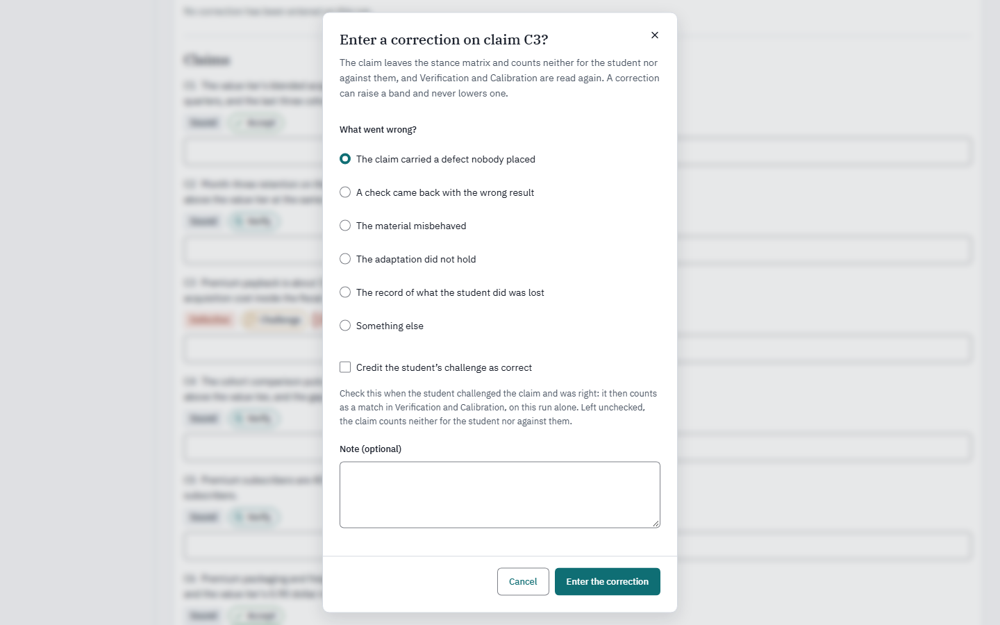

The dialog does not close. It becomes the answer — **What the correction moved** — and this is the
only place all of it is shown together:

| Line | What it tells you |
|---|---|
| "A correction can raise a band and never lowers one." | The rule, restated |
| "{dimension}: {before} → {after}" | Each band the correction moved |
| "No band moved. The correction is on the record and the run keeps the bands it had." | Where nothing moved |
| "Points: {before} → {after}." | To three decimals |
| "The run keeps {n} points." | The run keeps the higher of the two figures |
| "Export version {n} was written." or "No export was written: this run has no confirmed bands yet." | What it wrote |

**Exactly what a correction does to the bands.** The claim leaves the stance matrix. The matrix is
rebuilt without it and only **Verification** and **Calibration** are read again — the other five are
left alone, so a second reading cannot move a band the correction was never about. Each of those two
is then floored at the band the run already stood on: a correction can raise a band and never lowers
one, and the run keeps the higher of the two point totals. A dimension you recorded as **Unassessed**
stays unassessed. The claim keeps its row in the student's debrief, struck through, with the line
"Your instructor took this claim out of this run’s arithmetic, so nothing about it counts either
way." If you credited the challenge they read "Your instructor recorded that your challenge on this
claim was right, and this run reads it as a match."

One correction per claim per run. A second is refused with "A correction has already been entered on
this claim for this run."

#### Marking a delegation as outside the scenario

This one lives on the **Overview** view, under each exchange in the **Delegation log**, and any
reviewer of the section can use it.

Use it when the exchange was about something the scenario does not cover, so that the Delegation
read is taken over the exchanges that remain. Above the button: "Marking says the exchange was about
something this scenario does not cover, so the Delegation read is taken over the exchanges that
remain. It is a note about the material. The student is not told, and nothing is taken away from
them."

Press **Mark as outside the scenario** (**Marking…** while it works). The control becomes the
sentence "This exchange is already marked, and a mark is recorded once."

The marked exchange is left out of the Delegation read and out of the clock timeline's scored
segments, and the Delegation rationale then says "{n} delegations were flagged by a reviewer and left
out." If the bands were already drafted, a second line tells you so: "The bands on this run were
drafted before this mark, so the mark does not move them. It is recorded on the run, and a band
placement is changed with the band decision." In other words — mark it for the record, then decide
the band yourself.

#### Voiding a run

The panel is **Void this run** — "A voided run carries no partial result, and no export written
afterwards names it. Offer another run in its place when the student should still take one."

1. Press **Void this run…**.
2. Choose an answer to **Why is the run being voided?**: **The run cannot be banded at all**,
   **Nothing could place the bands, and they could not be set by hand**, **It was a walkthrough run**,
   or **Something else**.
3. Write a **Note (optional)**, up to 1,000 characters. Its hint: "What you write is kept on the run’s
   own record. Only the reason above is used in any count of voided runs."
4. Tick **Offer the student another run** if they should still take one. The hint reads "The new run
   uses the other variant of this scenario package unless you choose one." A **Variant for the new
   run** select then offers **The other variant** (the default), **Defective** or **Sound**.
5. Press **Void the run** (**Voiding…** while it works). **Keep the run** cancels.

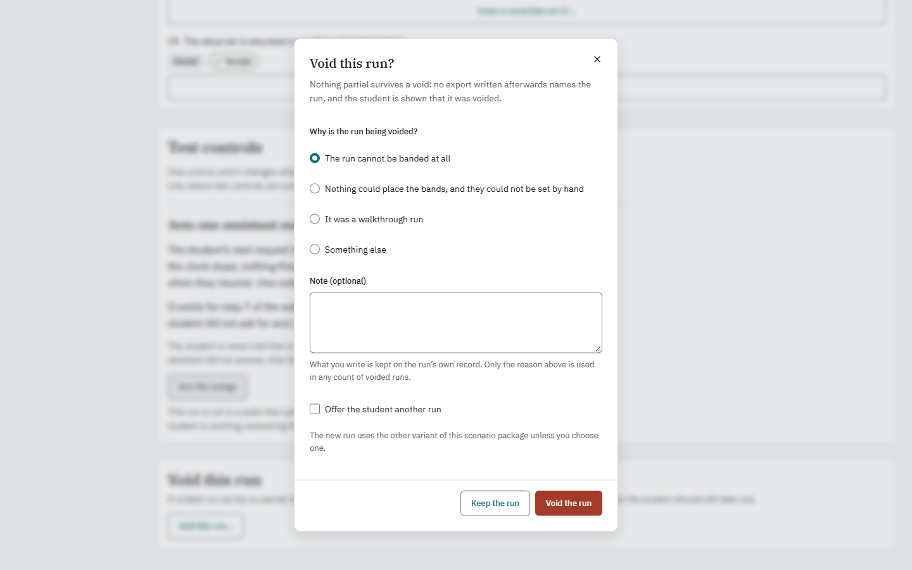

The dialog body reads "Nothing partial survives a void: no export written afterwards names the run,
and the student is shown that it was voided." If the run was already exported, an amber warning is
added: "This run is already exported. Voiding it withdraws that figure — no export version will name
the run afterwards, so take the run out of the gradebook of record as well." **Do that.** Tassl
cannot reach into your gradebook.

Afterwards the replay is read-only under its red banner, the run's export files answer "That export
version does not exist for this run.", and the student's run page reads **This attempt was voided** —
"A voided attempt is not scored and counts for nothing. If your instructor re-offers the assignment,
the new attempt appears in your runs."

A re-offered run is a new run at attempt N+1, starting at **Not started**, with the same working
clock and the same Turn delay as the one it replaces, on the other variant unless you chose
otherwise.

#### The test control

This panel appears only where test controls are turned on for this environment, and only for the
section's instructor. The panel says so itself: **Test controls** — "One control, and it changes what
happens inside a student’s live run. It appears only where test controls are turned on for this
environment." If you do not see it, the deployment has them switched off, and nothing on any screen
will arm one.

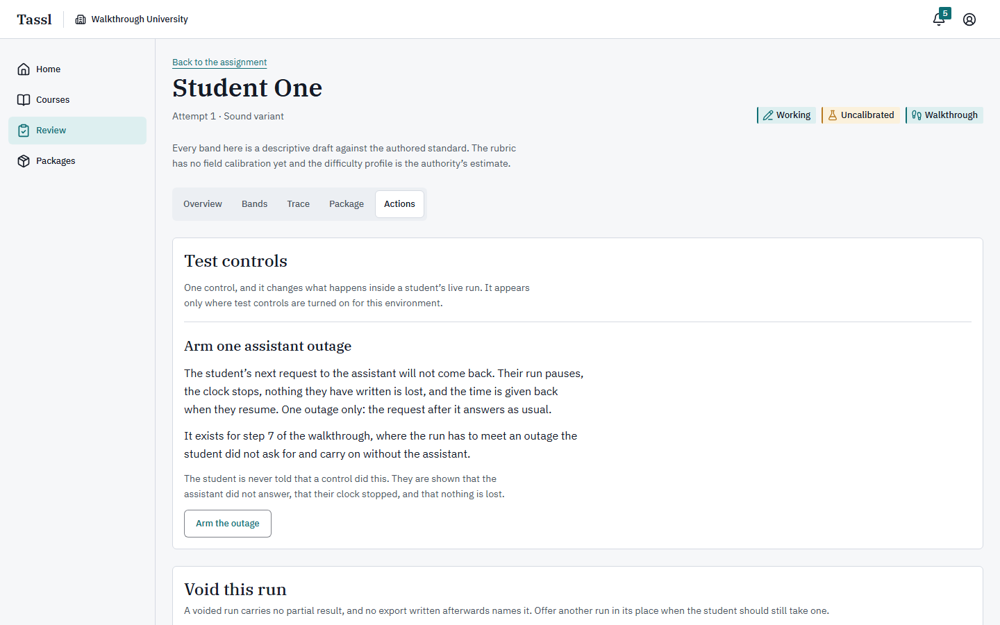

The one control is **Arm one assistant outage**:

> "The student’s next request to the assistant will not come back. Their run pauses, the clock stops,
> nothing they have written is lost, and the time is given back when they resume. One outage only:
> the request after it answers as usual."
>
> "It exists for step 7 of the walkthrough, where the run has to meet an outage the student did not
> ask for and carry on without the assistant."
>
> "The student is never told that a control did this. They are shown that the assistant did not
> answer, that their clock stopped, and that nothing is lost."

Press **Arm the outage** (**Arming…** while it works). A toast reads "One assistant outage is armed
for this run." An amber line then stands on the panel: "One assistant outage is already armed: the
student’s next request will not come back."

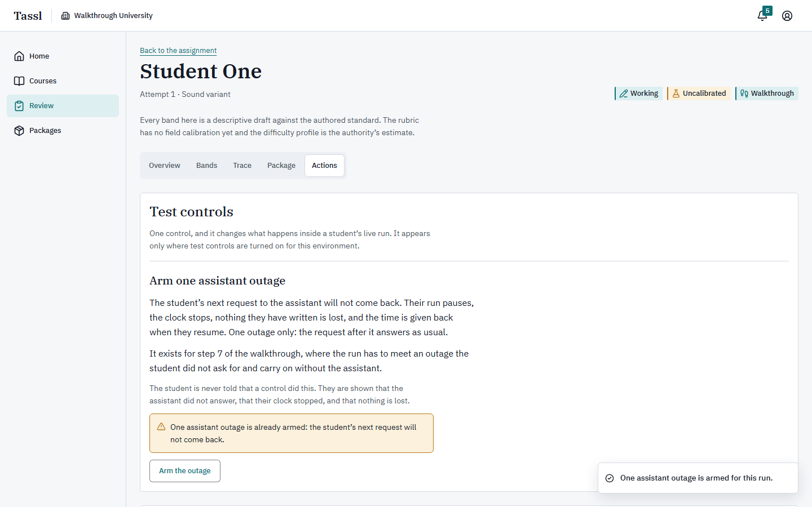

It can only be armed while the run is live — while the student is working, answering the Turn, or
paused. At any other moment the button is greyed with the reason beside it: "This run is not in a
state that can take an outage. One can be armed while the student is working, answering the Turn, or
paused."

Nothing is written to the run's trace when you arm one; what the run records is the pause its next
request writes. Every use is written to the audit log.

---

### The trace

The **Trace** view is the raw record: "Every event in the order it was written, with the clock as it
stood."

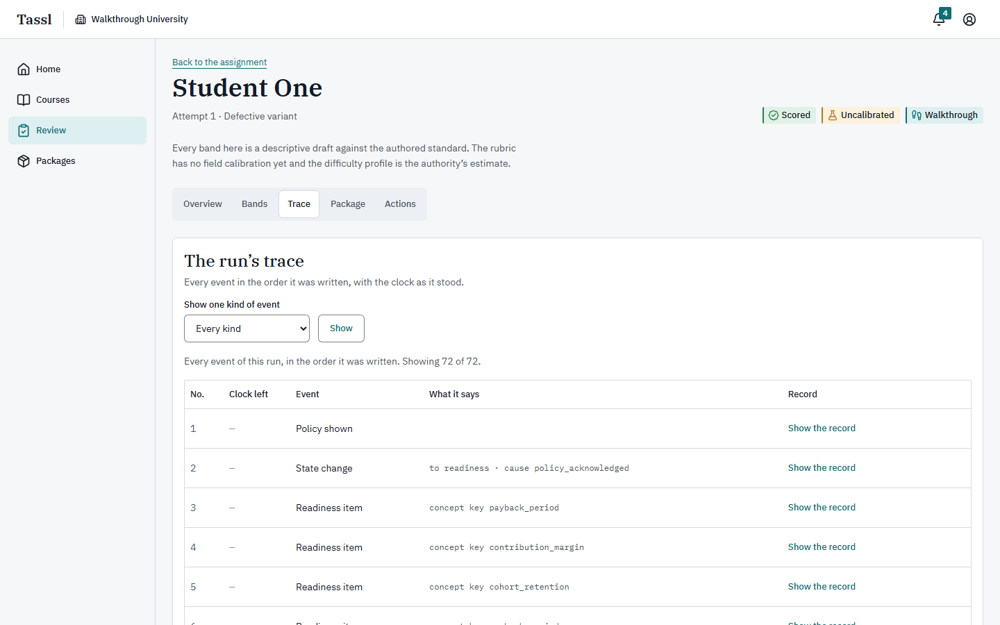

| Column | What it holds |
|---|---|
| **No.** | The sequence number. Every event has one and they never repeat |
| **Clock left** | mm:ss of working clock remaining when it was written, or an em dash where no clock was running |
| **Event** | The kind of event, in words |
| **What it says** | A short summary built from the event's own record — at most three name-and-value pairs |
| **Record** | **Show the record**, a disclosure holding everything the event carries |

Under the caption sits the count: "Showing {n} of {n}."

#### Filtering

**Show one kind of event** is a select listing only the kinds this run actually wrote, plus **Every
kind**. Choose one and press **Show**. The caption becomes "One kind of event from this run:
{type}.", and **Show every kind again** clears it. Filtering is an ordinary page load, so a filtered
trace has its own address you can send to someone. Where the filter matches nothing: **No events of
that kind** — "This run wrote no event of the kind you asked for."

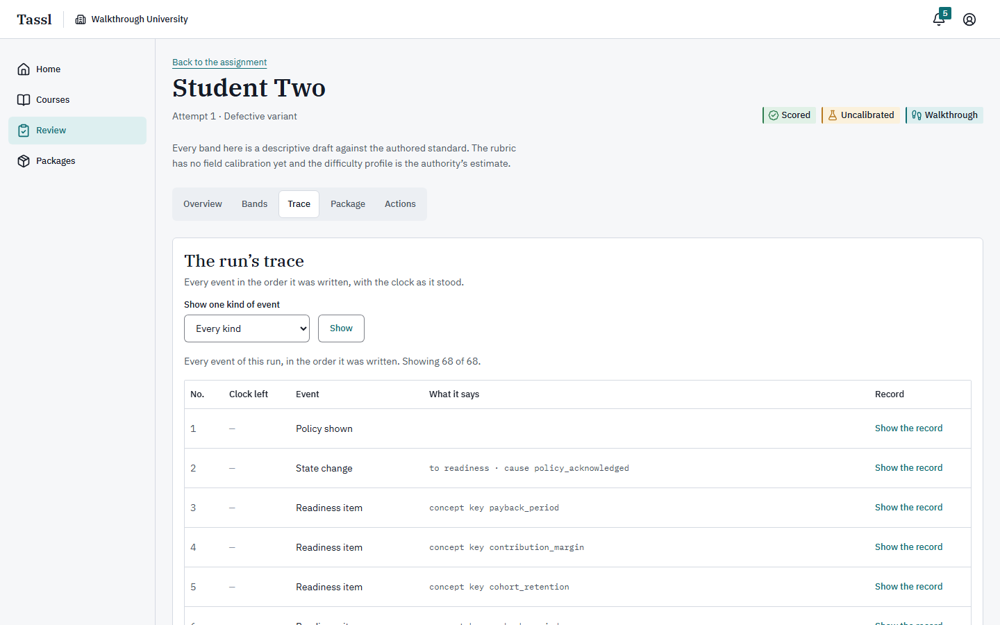

#### What the main event kinds mean

| Event | What it records |
|---|---|
| **Policy shown** | The course policy the run's first screen displayed |
| **State change** | The run moving from one step to the next |
| **Readiness item** / **Readiness skipped** | One Readiness Check answer, or that the check was skipped |
| **Document opened** / **Document closed** | One Evidence Room document, and how long it stayed open |
| **Frame locked** | The frame is immutable from this point, the assistant unlocks, and the clock starts |
| **Delegation** | One request to the assistant and the reply |
| **Claim marked used** | The student recorded that they leaned on a claim |
| **Stance set** | A position taken on a claim; a later one does not erase the earlier one |
| **Interrogation action** | A Source Trace, Replication Check or Decomposition Check, and its cost |
| **Escalation** | The one-sentence hand-off to a colleague, which costs five minutes |
| **Outside tool declared** | The student's own declaration |
| **Run paused** / **Run resumed** | The clock stopped, and the time credited back |
| **Brief opened** / **Brief closed** | The brief editor |
| **Lock refused** | A Decision Lock that was refused, and why |
| **Decision locked** | The irreversible filing |
| **Addendum** | The one note of up to fifty words added beside the filed decision |
| **Turn delivered** / **Turn response locked** | The message from the world, and the hold, revise or reverse filed against it |
| **Defense question** / **Defense answer** | One interview question, and one answer |
| **Band drafted** | A draft band written |
| **Band decided** | A reviewer's decision on one dimension |
| **Claim neutralized** | A correction, with what it recomputed and both point totals. The raw record keeps the older word for it; the screens a student reads say **Corrected** |
| **Run voided** / **Run offered again** | A void with its reason, and the run offered in its place |
| **Debrief opened** / **Debrief answered** | The student reading their debrief and answering its two questions |
| **Probe fired** | The Sycophancy probe |

#### Opens that were too short to have read anything

Open **Show the record** on a **Document closed** row and you see, beside the duration, whether Tassl
marked the open a skim. It marks one when the open was shorter than four seconds, or shorter than a
quarter of a second per word for a document short enough that four seconds would be generous —
whichever is less. A very short document therefore has almost no window, which is the point: the
question the mark answers is not "did they read it" but "was this open too short for anything to have
been read at all".

Read it as one fact among many, never as a finding. A student who opened a document, recognised it
and closed it has done nothing wrong, and Tassl does not treat it as misconduct. It is useful beside
the **Verification** band when a claim rested on a document nobody stayed in.

#### What it is for

The trace is the answer to what actually happened. Use it when a band's rationale does not match
what you expected, when a student asks how a figure was arrived at, and when you want to show a class
the order of a run rather than its result. Every band's evidence drawer links straight into it, at
the exact event a placement was read from.

---

## 6. The AI assistant

**You never meet the assistant directly.** It exists inside a student's run: it answers requests
inside the scenario, raises claims as cards, and never says whether a claim is sound. There is no
assistant on any instructor screen, and there is nothing to ask it.

What you see is what it did.

| Where | What you see of it |
|---|---|
| Replay → Overview → **Delegation log** | Every request, every reply, the reason the student gave, and the claims each reply raised |
| Replay → Overview → **Figures with nothing behind them** | Numbers the assistant asserted that no document in the Evidence Room supports |
| The guard marks under an exchange | Whether Tassl reassembled the reply, withheld commentary, fired the Sycophancy probe, or discarded a late reply |
| Replay → Overview → the **Clock timeline** | Where in the run the delegations fell, and what was read before the first of them |
| The **Delegation** band | What it makes of the log |

The assistant refuses nothing on your behalf. It never tells a student whether a claim is defective,
never says which stance to take, never grades, and never reveals that a defect was planted. It is
open to the student from the moment they lock their frame until the moment they lock their decision,
and again during the Turn window.

**When it is unavailable.** If the provider fails, the token budget is spent, or you armed the test
control, the student's request does not come back. Their run pauses, the clock stops, and they read:
"The assistant did not answer, so the run is paused and the clock has stopped. Nothing you did was
lost." When the budget is the cause the sentence is "The assistant is unavailable: usage limit
reached. Your clock stopped, and the run is paused." The time the pause takes is credited back when
they resume. The student is never told that a control did it. On your side the run shows as
**Paused**, and the trace carries **Run paused** and **Run resumed**.

**The scripted mode.** Some deployments answer the assistant from a built-in fixture instead of a
live model. That is not a degradation and not an outage: the product is whole, the claim cards and
every screen are identical, and only the assistant's prose is fixed. The student sees a chip in the
run's header reading **Scripted assistant** rather than **Live model**. A platform admin switches it,
and nothing on an instructor screen changes either way.

---

## 7. Notifications, settings, and account

### The bell

The header carries a bell whose accessible name reads "Notifications: {n} unread", with the number on
a badge — or "99+" once it passes 99. It re-checks about once a minute while the tab is in front.
Clicking it opens **Notifications**.

### The notifications screen

**Notifications** — "What Tassl has told you, newest first."

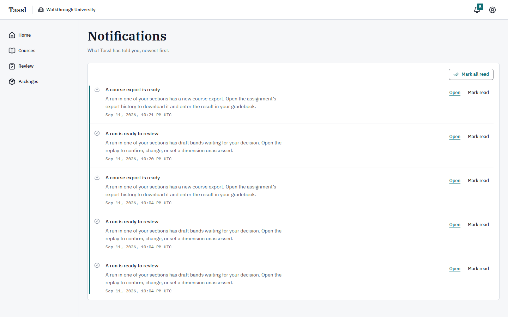

- **Mark all read** sits above the list and is disabled when nothing is unread. A toast then reads
  "Everything is marked read."
- Each row carries a kind, a title, the body, and the time in UTC. Unread rows are bold with a teal
  rule down the left.
- **Mark read** appears on an unread row; **Open** appears where the notification leads somewhere.
- **Show more notifications** fetches the next twenty.
- With none: **Nothing yet** — "Tassl writes here when a run is scored, a package finishes
  generating, or an instructor confirms your bands."

What you actually receive:

| Kind | Title | What triggers it | Where **Open** goes |
|---|---|---|---|
| **Run scored** | "A run is ready to review" | A run in one of your sections has draft bands waiting | The replay |
| **Run held for review** | "A run is held for review" | Tassl could not draft the bands for a run in one of your sections | The replay |
| **Export ready** | "A course export is ready" | A new course export was written for a run in one of your sections | That assignment's export history |
| **Package generated** | "Your scenario package has been drafted" | Generation finished on a package you created | The generation screen |
| **Generation stopped** | "A generation step could not be completed" | A generation step stopped after a second attempt | The generation screen |
| **Package confirmed** | "A scenario package is ready to assign" | Somebody else confirmed a version in your institution | That version |

No notification ever carries a band, a count, a rate or a student's own words — several of them are
also delivered by email, and an email is not a safe place for any of that. A held run sends the
student nothing at all, deliberately: you tell them.

Email copies are switched on or off for the whole installation by whoever runs it. There is no
per-person email setting anywhere in Tassl, and no unsubscribe link.

### Settings

The account menu, at the top right, shows your name and address and then four rows: **Settings**,
**Privacy**, **Terms**, **Sign out**.

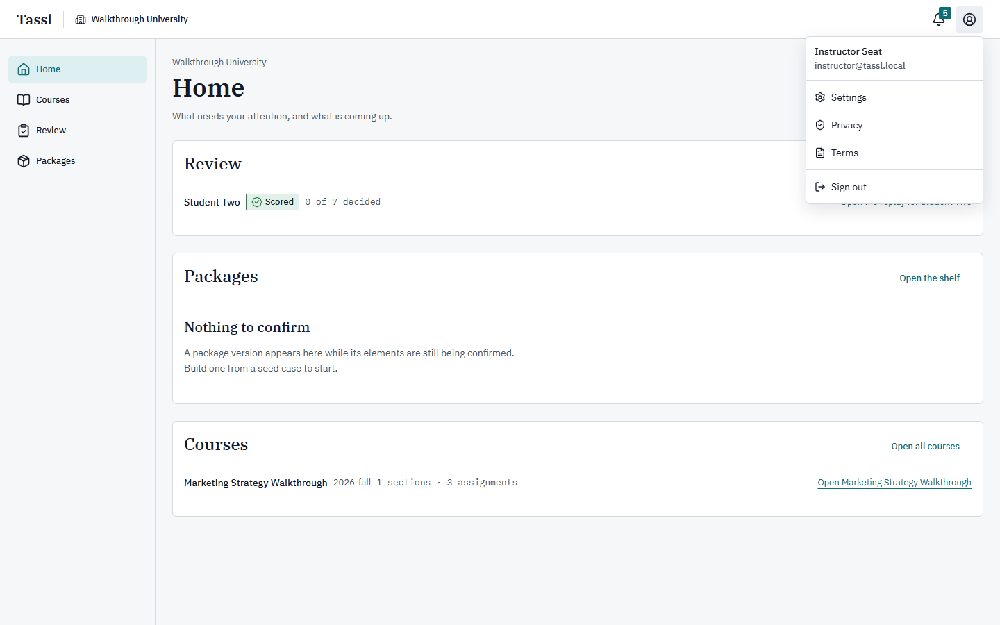

**Settings** opens **Account settings** — "Your profile, your password and devices, and your data." —
with three tabs: **Profile**, **Security**, **Data**.

#### Profile

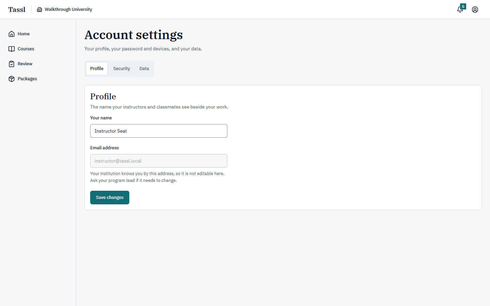

- **Your name** — "The name your instructors and classmates see beside your work." This is the name
  students and other reviewers see beside your band decisions. At most 120 characters.
- **Email address** — read-only, with the note "Your institution knows you by this address, so it is
  not editable here. Ask your program lead if it needs to change."
- **Save changes**, and the toast "Your name is saved."

There is no way to change your email address anywhere in Tassl.

#### Security

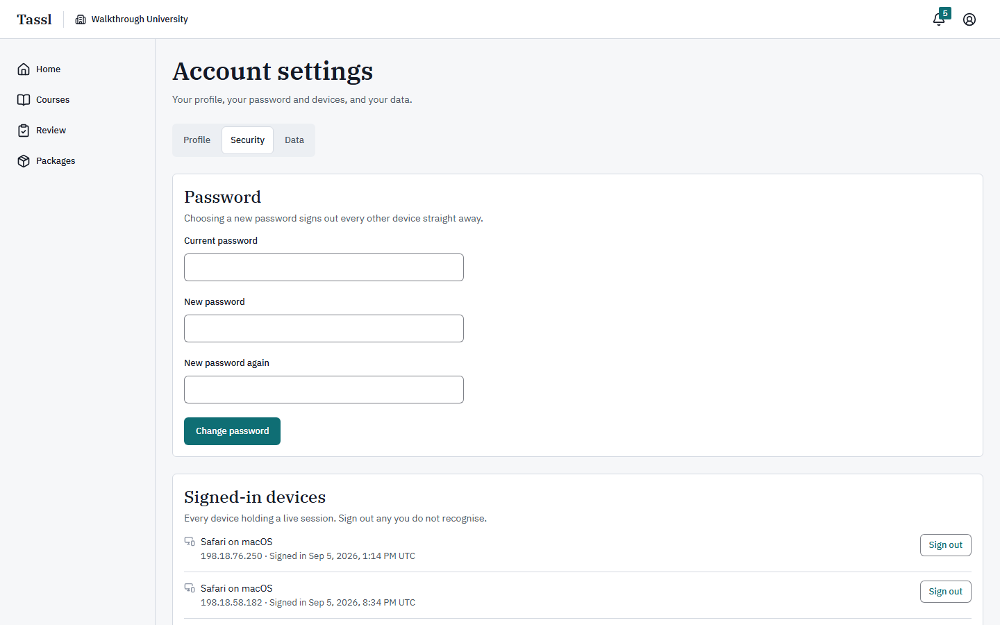

**Password** — "Choosing a new password signs out every other device straight away." Three fields:
**Current password**, **New password**, **New password again**. Then **Change password**, and the
toast "Your password is changed. Other devices are signed out."

| If | You read |
|---|---|
| The current password is wrong | "That is not your current password." |
| The new one is outside 12–128 characters | "Use between 12 and 128 characters." |
| The two new fields differ | "Both passwords must be the same." |

**Signed-in devices** — "Every device holding a live session. Sign out any you do not recognise."
Each row reads like "Chrome on Windows" with the address and "Signed in {date}" under it. Your own
row is badged **This device** and has no button. Others carry **Sign out**. Below the list,
**Sign out every other device** ends all of them at once; where there are none, the line reads "No
other device is signed in."

#### Data

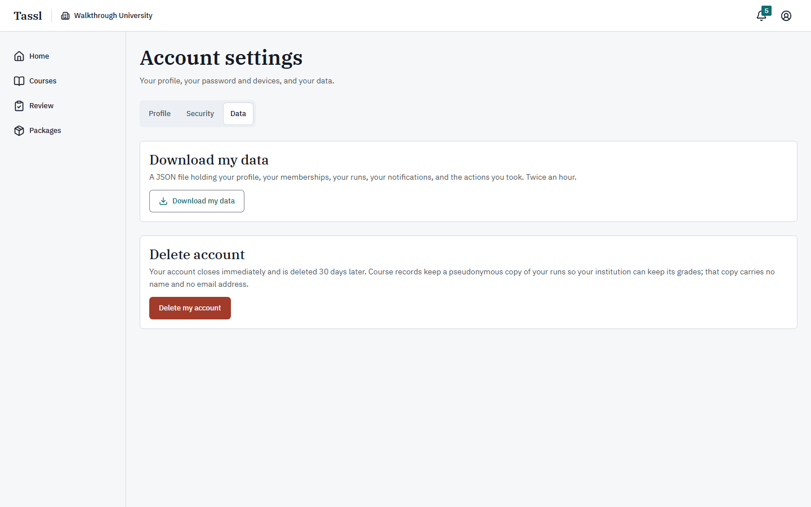

**Download my data** — "A JSON file holding your profile, your memberships, your runs, your
notifications, and the actions you took. Twice an hour." Press the button and the file downloads at
once, named for you; a toast reads "Your file is downloading." A third download inside an hour is
refused with "You can download your data twice an hour. Try again shortly."

**Delete account** — "Your account closes immediately and is deleted 30 days later. Course records
keep a pseudonymous copy of your runs so your institution can keep its grades; that copy carries no
name and no email address."

1. Press **Delete my account**.
2. The dialog **Delete your account?** repeats what happens: "You are signed out straight away and
   cannot sign in again. After 30 days everything Tassl holds about you is deleted; the pseudonymous
   course record of your runs stays with your institution."
3. Type your own address into **Type {email} to confirm**. The confirm button stays disabled until it
   matches.
4. Press **Delete my account**, or **Keep my account** to stop.

Closing your account takes you off every roster and every institution at once. Band decisions you
already made stand; the runs you reviewed keep them.

### Signing out

**Sign out** in the account menu ends this session and lands you on the sign-in screen. If it fails,
a toast reads "Signing out did not work. Try again." It signs out this device only — use **Security**
for the others.

---

## 8. Common situations

**I want to set up a brand-new course from nothing.**
**Courses** → **New course** → **Course name**, **Term** → **Create course** → **Sections** → **New
section** → **Roster** → **Add member** for each student → back to the course → **Policy** → choose
an outside-AI policy and a **Default run weight** → **Save policy** → **Mapping** → the four numbers
→ **Preview changes** → tick the box → **Apply the new mapping** → **Assignments** → **New
assignment**.

**I want to add a student who is not in the institution yet.**
**Courses** → the course → **Sections** → **Roster** → **Add member** → type the address → **Add to
section** → read "That address does not belong to this institution yet." → **Invite to institution**
→ **Send invitation** → wait for them to accept → **Add member** again with the same address.

**I want to add a teaching assistant, or change someone's role on the roster.**
**Roster** → **Add member** → the address → **Role in this section**: **Teaching assistant** → **Add
to section**. If the address is new to the institution, invite it first at **Teaching assistant**.
There is no separate control for a role change: adding the same address again replaces the role.

**I want to build a scenario package of my own and get it onto an assignment.**
**Packages** → **New package from a seed case** → **Title**, **Concepts**, the seed case and **The
license permits adaptation** → **Create and generate** → wait for the seven steps → **Open
confirmation workspace** → decide every element → tick **Teaching note checked against the answer
space and claims** → **Confirm version** → **Confirm and freeze** → **Courses** → the course →
**Assignments** → **New assignment**.

**I want to give a class a practice run they cannot damage anything with.**
**Assignments** → **New assignment** → turn **Walkthrough** on → **Create assignment**. Runs on it
can be deleted outright.

**I want to see who has started and who has finished.**
**Courses** → the course → **Assignments** → the assignment → the **Runs** panel. Read the **State**
and **Bands decided** columns.

**I want to review a finished run.**
**Review** → the student's row → **Open the replay for {student}** → **Overview** (read **Conditions
recorded on this run** and the four graphs) → **Bands** → decide each one.

**I want to confirm a run quickly because the drafts look right.**
**Review** → the run → **Bands** → **Confirm the remaining drafts** → read the list → **Put the
remaining drafts on the record**.

**I want to give a student a different band and tell them why.**
**Review** → the run → **Bands** → the dimension → choose a level in **Band for {dimension}** → write
**Note for the student (optional)** → **Record {band} instead**.

**I want to see exactly why a band says what it says.**
**Review** → the run → **Bands** → the dimension → **Show the evidence behind this band** → click a
trace event → read the record on the **Trace** view. Or go to **Overview**, find the graph the band
names, and press **Show data table**.

**I want to take a claim out of one run's arithmetic because our material was wrong.**
**Review** → the run → **Actions** → **Enter a correction on {key}…** → choose a reason → tick
**Credit the student’s challenge as correct** if they were right → **Enter the correction** → read
**What the correction moved**.

**I want to end a run that cannot be assessed and let the student take another.**
**Review** → the run → **Actions** → **Void this run…** → choose a reason → tick **Offer the student
another run** → **Void the run**. Then take the old figure out of your gradebook.

**I want to get the numbers into my gradebook.**
**Courses** → the course → **Assignments** → the assignment → **Course exports** → **Download version
{n}** for each student. Or open one run's replay → **Bands** → **Points under this course’s mapping**
and read the total.

**I want to change what a band is worth, mid-term.**
**Courses** → the course → **Mapping** → the four numbers → **Preview changes** → read which runs
move → tick the box → **Apply the new mapping**. Then re-download the exports, because every
confirmed run has a new version.

**I want to show an outage to a class without the student knowing it was me.**
**Review** → the live run → **Actions** → **Test controls** → **Arm the outage**. Their next request
does not come back, the clock stops, and the time is credited back when they resume.

To practice all of this end to end before term starts, work through
[the instructor guide](../guides/instructor-guide.md), which drives exactly these screens click by
click on the seeded walkthrough course.

---

## 9. Error messages and what they mean

### Refusals you can meet on a course, a roster or an assignment

| What you read | When | Why | What to do |
|---|---|---|---|
| "Give the course a name." / "A course name is at most 200 characters." | **New course** | The name is empty or too long | Name it in 200 characters or fewer |
| "Give the course a term." / "A term is at most 100 characters." | **New course** | The term is empty or too long | Shorten it |
| "Give the section a name." / "A section name is at most 100 characters." | **New section** | The name is empty or too long | Shorten it |
| "Name this assignment." / "Use 200 characters or fewer." | **New assignment** | The name is empty or too long | Shorten it |
| "Choose a scenario package version." | **New assignment** | No version chosen | Pick one from the select |
| "Choose a variant." | **New assignment** | Neither radio is chosen | Choose **Defective** or **Sound** |
| "Enter whole seconds, at least 60, or leave it empty." | **Working clock (seconds)** | A fraction, or under 60 | Type whole seconds, or clear the field |
| "Enter the weight as a number of zero or more, or leave it empty." | **Weight** | Not a number, or negative | Fix it, or clear the field |
| "Enter a date and time, or leave it empty." | **Opens at** | A part-typed date | Complete it, or clear it |
| "An assignment needs a confirmed scenario package version." | Creating or saving an assignment | The chosen version is still a draft, or was retired | Confirm the version first |
| "That variant belongs to a different package version." | Creating or saving an assignment | The variant is not one of that version's | Choose the variant again after changing the version |
| "A run has already started on this assignment, so its setup is fixed." | **Save configuration** | Somebody has started a run | Only the name, the walkthrough flag and the opening time can still change. Make a new assignment for anything else |
| "That address does not belong to this institution yet." | **Add to section** | The address has no membership | Press **Invite to institution** |
| "Enter a valid email address." | **Add member** or the invite dialog | A malformed address | Retype it |
| "This person has runs in the section, so they cannot be removed." | **Remove from section** | They have a run that is not voided | Leave them on the roster |
| "Only a run on a walkthrough assignment can be deleted. A run that counts is voided instead." | **Delete** on a run | The assignment is not a walkthrough | Void the run instead |
| "That course no longer exists." / "That section no longer exists." / "That assignment no longer exists." / "That run no longer exists." | Any stale link | The thing is gone, or is in another institution | Go back and pick it from the list |
| "Enter the weight as a number." / "A weight cannot be negative." | **Default run weight** | Not a number, or below zero | Fix it |
| "A taught concept is at most 120 characters." / "A course lists at most 50 taught concepts." | **Taught concepts** | A long line, or too many lines | Trim the list |

### Refusals on the mapping

| What you read | When | What to do |
|---|---|---|
| "Enter the points as a number." | A mapping field | Type a number |
| "Points must be above zero." | A mapping field | Every band must be worth more than nothing |
| "A band mapping needs four positive numbers." | Applying with one of the four missing or not positive | Fill all four |
| "Tick the box above before applying: every confirmed run in this course gets a new export version." | **Apply the new mapping** | Tick the acknowledgement |
| "Confirm the change: every confirmed run in this course is re-exported." | Applying without the acknowledgement | Preview, tick the box, apply |
| "These four numbers have changed since the preview. Preview again before applying." | You edited a field after previewing | Press **Preview changes** again |
| "The mapping was not applied. Try again." | The request did not land | Try again; nothing was changed |

### Refusals while reviewing

| What you read | When | What to do |
|---|---|---|
| "Choose a band, or mark the dimension not assessed." | Pressing the decision button with nothing selected | Choose one of the five options |
| "An override needs a band to settle on." | An override with no band | Choose the band you are recording |
| "This run has no drafted bands to decide yet." | Deciding on a run that is not yet scored | Wait for scoring, or band it by hand if it is held |
| "This run is not at a point where it can be scored." | **Put these seven on the record** on a run that is not held | Nothing to do; the run is not held |
| "These still need a band or the word not assessed: {dimensions}." | Hand-banding with gaps | Fill the named dimensions |
| "A correction has already been entered on this claim for this run." | A second correction on one claim | Nothing; the first one stands |
| "This run has no course export yet; its bands are not confirmed." | Opening export history too early, or on a voided run | Decide the seven bands |
| "That export version does not exist for this run." | A version number that was never written, or any version of a voided run | Pick a version from the list |
| "This run is not in a state that can take an outage. One can be armed while the student is working, answering the Turn, or paused." | **Arm the outage** at the wrong moment | Arm it while the run is live |
| "Test controls are switched off in this environment, so nothing was armed." | **Arm the outage** where the deployment has them off | Nothing on screen fixes it; it is a deployment setting |
| "The mark was not recorded. Try again." | **Mark as outside the scenario** | Press it again |
| "The instructor decided this dimension." | Only a teaching assistant meets this | Not yours; you are the instructor |

### Refusals while authoring a package

| What you read | When | What to do |
|---|---|---|
| "The package was not created. Put these right and create it again:" | Creating with fields missing | Each line links to its field |
| "Give the package a title." / "A title is at most 200 characters." | **Title** | Name the family in 200 characters or fewer |
| "Give the family a key." / "A family key is 3 to 60 characters of lowercase letters, digits and hyphens." | **Family key** | Use lowercase letters, digits and hyphens |
| "This institution already has a package with that family key. Change it and create again." | The family key is taken | Choose another key |
| "Add at least four concepts." / "A concept is 2 to 60 characters." | **Concepts** | Add four or more, each of 2 to 60 characters |
| "“{concept}” is already in the set." | Adding a concept twice | It is already there; add a different one |
| "Name the case this package is adapted from." / "Name who published the case." / "State the license terms you are relying on." | **Case title**, **Publisher**, **License terms** | Fill the three seed fields; each takes at most 200 characters, the terms 4,000 |
| "Confirm that the license permits adaptation. Tassl will not build a package from a case without it." | The checkbox is unticked | Tick it, or do not build from that case |
| "Paste at least 200 characters of the case." / "The seed case text is at most 200,000 characters. Leave out the appendices, or split the case across two packages." | **Seed case text** | Paste more, or paste less |
| "That request body is too large. The limit is one megabyte." | A very large paste — a seed case or a package export | Send less: leave out the appendices, or split the case |
| "Say what is wrong with it before rejecting." | **Reject element** with no reason | The note is required |
| "Save or discard the edits in this element before recording a decision on it." | **Confirm** or **Reject** with unsaved edits | Press **Save edits** or **Discard edits** first |
| "A new draft is being written. Nothing can be saved or decided on until it lands, so that no decision is recorded against values about to be replaced." | Any decision while a rewrite is running | Wait; the screen picks the new draft up itself |
| "The new draft of {name} was not written, and nothing changed. Try again, or edit the element by hand." | A rewrite that did not land | Ask again, or write the element yourself |
| "This field needs a value." / "At most {limit} words; there are {count}." | An element's own fields | Fill it, or cut it back to the limit |
| "Every element needs a decision before the version can be confirmed." | **Confirm version** | Decide the elements the screen lists under **Waiting on a decision** |
| "Confirm you have read the teaching note first." | **Confirm version** | Tick the teaching-note box |
| "This package does not yet meet the scenario rules." | **Confirm version** | Put right the rules the screen lists |
| "This version is confirmed, so it can no longer be changed." | Any edit to a frozen version | A change means a new version |
| "Generation is already running on this version." | Starting generation twice | Wait for the current run |
| "This version has no seed case to generate from." | Generating a version built without a seed | Write the elements by hand, or import an export |
| "Paste the export before importing." | **Import a package export** with an empty box | Paste the file first |
| "That file is not a Tassl package export." / "That is not JSON. Paste the exported file exactly as it was written, with nothing before or after it." | Importing | Paste the whole exported file, unchanged |
| "This institution already has a package with the family key in that export. Change the family key in the file, or open the package you already have." | Importing a family you already hold | Change the key in the file, or open what you have |
| "Package imported. {count} rules still fail." | An import that came in with failing rules | The version is a draft you can edit; put the listed rules right before confirming |

### General

| What you read | When | What to do |
|---|---|---|
| **Not found** — "There is nothing at this address. It may have moved, or the link may be wrong." | Any page your seat may not open, or a stale link | Use **Go home** and navigate from the rail |
| "You do not have permission to do this." | An action your seat does not carry | Ask someone whose seat does |
| "Too many requests. Try again shortly." | Many actions in one minute | Wait a moment |
| "Sign in to continue." | Your session ended | Sign in again |
| "This account has been deleted." | Your account was closed while you were still signed in | Nothing; the account is closed |
| "This invitation was sent to a different email address." | You opened an invitation link while signed in as another address | Sign out, sign in with the invited address, open the link again |
| "The request did not match the expected shape." / "The request conflicts with the current state." | A form sent something the screen could not mark | Reload the screen and fill the form again |
| "The device list could not be loaded." | **Security** | Reload the page |
| "The download did not start. Try again in a moment." | **Download my data** | Press it again |
| "The account was not deleted. Try again." | **Delete my account** | Press it again; nothing was closed |
| **Something went wrong** — "The problem has been recorded. If it continues, quote the reference below." | A defect | Press **Try again**; if it continues, send whoever runs Tassl the **Reference** shown |
| "The form could not be loaded. Close this and open it again." / "That could not be opened. Try the button again." | A dialog's code did not arrive | Close it and press the button again |

### Empty states you will meet, and what they are telling you

| Screen | What you read | What it means |
|---|---|---|
| **Courses** | **No courses yet** | Nobody has created one; press **New course** |
| **Sections** | **No sections yet** | The course has no roster yet |
| **Assignments** | **No assignments yet** | Confirm a scenario package version first, then configure one |
| **Runs** on an assignment | **No runs yet** | Nobody has started it |
| **Members** on a roster | **Nobody is in this section yet** | Add people before the assignment opens |
| **Invitations** | **No invitations yet** | Nobody outside the institution has been invited |
| Review queue | **Nothing waiting** | No run in your sections has bands to decide |
| Replay → Bands | **No draft bands yet** | The drafts are written after the defense is filed, or nothing could place them |
| Replay → graphs | **No graphs yet** | The run has not been scored |
| Replay → defense | **No interview yet** | The student has not taken the defense |
| Replay → delegation log | **The assistant was not used** | The run holds no delegation; Delegation is read from the defense instead |
| Replay → trace | **No events** | Nothing has been written to this run yet |
| Exports | **No export yet** | No run here has all seven bands decided |
| **Packages** | **No packages yet** | Build one from a seed case |
| The confirmation workspace, with the filter on | "Nothing is left undecided." | Every element has a decision; confirm the version |
| The confirmation workspace, before generation | **This version has no elements yet** | Run generation, or import a package export |
| The confirmation workspace, nothing selected | **No element open** | Choose an element in the tree on the left |

---

## 10. Glossary

**Assignment** — one section's configured pointer at one confirmed scenario package version, carrying
the variant, the working clock, the weight and the opening time a run is taken under.

**Answer space** — the positions the authored case allows a decision to take. A filed brief is read
against it, and a position outside it is a finding.

**Attempt** — the numbered try at an assignment. A second attempt exists only where an instructor
voided the first and offered another.

**Band** — the placement one dimension holds: **Novice**, **Developing**, **Proficient**,
**Professional**, or **Unassessed**.

**Claim** — something the assistant states, or a document carries, that the student has to take a
position on.

**concept map** — the per-idea reading the Readiness Check closes with: held, thin, or unknown.

**confirmation workspace** — the screen where every element of a draft version is read and decided,
and where the version is confirmed and frozen.

**Confirmed band** — the band you decided on a dimension, with any note you wrote. It replaces the
draft on the student's debrief.

**Correction** — taking one claim out of one run's arithmetic because Tassl got the claim wrong. It
re-reads Verification and Calibration only, can raise a band, and never lowers one.

**Course** — the container that carries the outside-AI policy, the run weight and the band-to-points
mapping its assignments run under.

**Course export** — the versioned document your gradebook is filled from. Written when all seven
bands carry a decision, and again after every correction, re-decision or mapping change.

**Decision Lock** — the student's irreversible filing of their brief. The clock ends, the assistant
and the Evidence Room close, and the Turn follows.

**Decision Run** — the full run type: one consequential business decision, taken with an AI assistant
in the room, under a clock that cannot be paused.

**Defense** — the closing interview, taken with the run record closed and no assistant: six to nine
typed questions the student answers from memory.

**Delegation** — one request to the assistant and its reply, kept in the Delegation log with the
claims it raised.

**Dimension** — one of the seven named aspects of judgment a run is read on: **Framing**,
**Delegation**, **Verification**, **Calibration**, **Decision Quality**, **Adaptation**,
**Ownership**.

**Draft band** — the band Tassl placed from the trace before you decided. Every band in this build is
a descriptive draft until a person confirms it.

**Element** — one confirmable unit of a package version: a document, a claim, a question, the Turn,
and so on.

**Escalation** — the student's one-sentence hand-off of a claim they cannot settle to a colleague. It
costs five minutes of the working clock, and a run offers two.

**Evidence Room** — every document in the scenario, all open to the student in any order for as long
as they like.

**Evidence status** — the author's per-variant mark on a claim: **Sound** or **Defective**.

**Failure family** — the named kind of defect a defective claim carries, such as **Stale evidence** or
**Near neighbor**.

**False Challenge Rate** — sound claims warranting accept or verify that the student challenged or
rejected, over every consequential claim in the variant, as a percentage.

**Family key** — the lowercase slug a scenario package family is keyed by. It is unique inside one
institution and travels with every export.

**Frame** — the student's pre-assistant position: the decision, three load-bearing assumptions, their
position and their confidence, locked before the assistant unlocks and never edited again.

**Generation** — the seven model calls that draft a version's elements from the seed case, one call
per step, each checked against the package rules it owns.

**gradebook of record** — your institution's own gradebook, the place a result is entered. Tassl holds
no grade.

**Institution** — the tenant your account belongs to. It owns the courses, packages, rosters and
invitations.

**Interrogation action** — one of the three checks a student can run on a claim, each costing working
clock: a **Source Trace** at one minute, a **Replication Check** at three, a **Decomposition Check**
at four. The last exists only where the author wrote a result for it.

**Judgment Record** — the student's own downloadable artifact: the four graphs, the confirmed bands,
the mode, the variant and the run's trace. It carries no weight, no mapping and no points.

**Load-bearing assumption** — one of three things the student takes as true such that the decision
would change if it turned out to be false.

**Mapping** — the four numbers saying what one confirmed band is worth in your course.

**Outside-tool declaration** — the student's own statement of what they used outside Tassl and what
for. It is recorded, never penalised, and never detected.

**Package rules** — the machine-checked constraints a scenario package version must satisfy before it
can be confirmed.

**Planted defect** — the one defective claim state the defective variant carries, and none in the
sound one.

**Points** — the mean of the mapping's value over the dimensions a run was assessed on, to three
decimals. An unassessed dimension is excluded, never counted as zero.

**Provisional** — a band that turns on free text a model read, shown so until a reviewer confirms it.

**Readiness Check** — sixteen four-option questions in eight minutes at the start of a run. It is not
scored and never blocks the run.

**Re-skin log** — the record of what was changed when the licensed case was adapted: each change,
what it was before, what it became, and a note. It is kept with the version and no student sees it.

**Replay** — your five-view record of one run: **Overview**, **Bands**, **Trace**, **Package**,
**Actions**.

**Review queue** — the list of runs in your own sections that have bands to decide.

**Roster** — the list of people in one section. A student needs a row on it before a run can start.

**Run** — one student's single attempt at one assignment, kept as a resumable record of everything
they did.

**Scenario package** — one decision case: the brief, the documents, the claims the assistant states,
the Turn, and the questions a student answers afterwards.

**Section** — a division of one course holding its own roster. Every assignment belongs to exactly
one section.

**Seed case** — the licensed published case a package was adapted from. It is kept with the package
and no student ever sees it.

**Stance** — the student's position on one claim, chosen from **Accept**, **Verify**, **Challenge**,
**Reject** and **Escalate**.

**Sycophancy probe** — the authored reversal in which the assistant changes its position after a
student pushes back. It is identical for everyone and means nothing about the claim.

**Taught concepts** — the ideas your course teaches, matched against the concept set a package
declares.

**Teaching note** — what the case's own teaching material says the case teaches. Confirming a version
records that you have read it and that it matches the answer space and the claims; the tick is kept
with the confirmation.

**Test control** — the one instructor control that changes a live run: arming a single assistant
outage. It appears only where a deployment turns test controls on.

**Trace** — every event of a run in the order it was written, with the clock as it stood.

**The Turn** — a message from the world arriving after the Decision Lock, reopening the run for twelve
minutes so the student can hold, revise or reverse.

**Unassessed** — a dimension the run holds nothing to place. It is reported as such and left out of
the arithmetic; it is never a low band and never a zero.

**Uncalibrated** — the state of every difficulty figure and every band in this build: no cohort has
run it, so the number is the authority's estimate.

**Variant** — one of two readings of a package version. **Defective** plants exactly one consequential
claim that does not hold up; **Sound** plants none.

**Version** — one state of a scenario package. A **Draft** until every element is confirmed, then
**Confirmed** and frozen for good.

**Void** — ending a run with no partial result. No export written afterwards names it.

**Walkthrough** — a practice assignment. A run on it can be deleted; a run that counts is voided
instead.

**Warranted stance** — the stance the authored material deserved. It is hidden from the student until
their run is scored.

**Weight** — what one run is worth in your gradebook. Tassl shows it and never multiplies anything by
it.

**Working clock** — the single unpausable countdown that starts when the student locks their frame
and ends at the Decision Lock. Checks and escalations spend it.

---

Related reading: [what Tassl is](00-what-tassl-is.md) · [the learner manual](02-learner.md) ·
[the scenario author manual](04-scenario-author.md) ·
[the instructor guide, click by click](../guides/instructor-guide.md)
