# Student manual

This file is for the person who takes a Decision Run: you sign in, open an assignment, make one
consequential business decision with an AI assistant in the room and a clock running, answer the
message that arrives afterwards, defend what you did without help, and read the result. After
reading it you can operate every screen Tassl gives you, from the sign-in page to the Judgment
Record you download at the end. For a guided practice run on a live installation, work through
[the student guide](../guides/learner-guide.md) beside this file. For what the product is and who
else uses it, see [what Tassl is](00-what-tassl-is.md).

---

## 1. Who you are in Tassl

You hold two seats. In your institution you are a **Student**. In the section of the course you are
enrolled on, you are a **Student** as well. Those two rows are what let you start a run. Nothing
else you hold changes what you see.

**You can:**

- See **Home** and **Runs**, and the assignments of every section you have a student row in.
- Start one run per assignment, and continue it from wherever you left it.
- Use everything inside your own run: the Readiness Check, the Evidence Room, the frame, the AI
  assistant, stances, checks, escalations, the Delegation Log, the outside-tool declaration, the
  decision brief, the addendum, the Turn response, and the defense.
- Read your own Run Debrief once your run is scored, and answer its two closing questions.
- Open and download your own Judgment Record once your instructor has confirmed the bands.
- Manage your own account: your name, your password, your signed-in devices, a download of your
  data, and closing the account.

**You cannot:**

- See any other student's run, in any form. Tassl answers "That run no longer exists." — the
  same sentence it gives for a run that was deleted, so an address cannot be probed.
- See which variant of the scenario you drew, until the Judgment Record opens.
- See a claim's warranted stance, its evidence status, whether it carries a planted defect, or the
  results of checks you did not run — until your run is scored.
- See the Readiness Check answer key, the defense question bank, the notes written for a question,
  or the licensed case the scenario was adapted from.
- Decide a band, void a run, or change anything an instructor decided.
- Start a run on a section you are not on. Tassl answers "Only a student on this assignment’s
  section can start a run."

You sit beside three other kinds of seat. Your instructor sets the course up, reads your run back
afterwards and confirms each of the seven bands ([the instructor manual](01-instructor.md)); a
teaching assistant can read your run and decide bands your instructor has not
([the teaching assistant manual](05-teaching-assistant.md)); a scenario author writes the case you
take but never sees your run ([the scenario author manual](04-scenario-author.md)). None of them can
write inside your run while it is live, and none of them can edit anything you locked.

**Opening a page your seat does not carry.** There is no "access denied" screen in Tassl. Four
things can happen instead, and it is worth knowing which is which.

Typing the address of the admin area gives you the in-app **Not found** page: "There is nothing at
this address. It may have moved, or the link may be wrong." with a **Go home** link. The header and
the rail stay where they are.


The review area behaves the same way — **Not found**, because the review queue belongs to people who
read other people's runs.

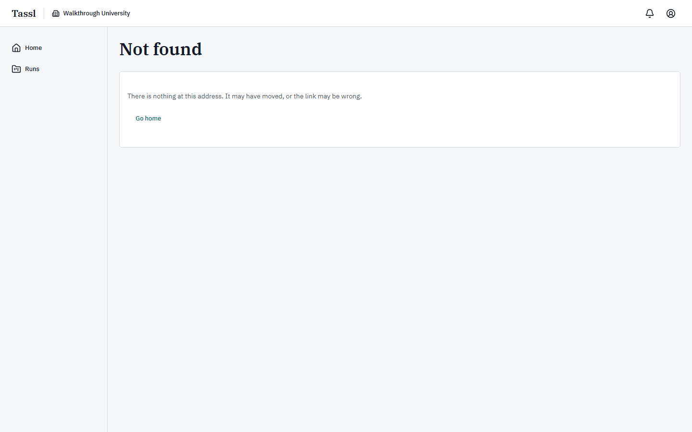

The packages area says so in words instead. The heading is **Packages are not open to your seat**
and the sentence beneath reads: "Only an instructor or a scenario author reads and writes packages
in Walkthrough University. If you should be one, an administrator of the institution can change your
seat."

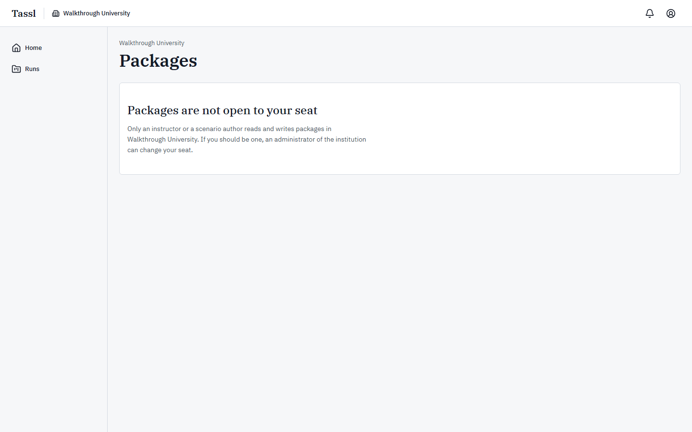

The courses address does open, and shows a read-only list under the caption "Courses in this
institution". Its columns are **Course**, **Term**, **Sections** and **Assignments**, and it holds
only the courses you have a section row in. There is no **Courses** item in your rail and nothing on
the page you can change. Everything you actually need from a course — the policy, the weight, the
band mapping — is shown to you inside the run itself.

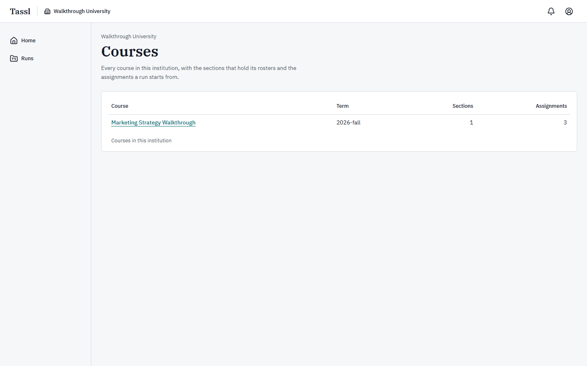

---

## 2. Signing in and your home screen

### The sign-in screen

Tassl's front door is **Sign in to Tassl**, described as "Use the email address your institution
knows you by." The card holds an **Email address** box, a **Password** box, a **Keep me signed in**
checkbox that is ticked for you, and the **Sign in** button. Below it sit **Forgot your password?**
and, after the line "No account yet?", **Create an account**. The footer of every signed-out page
carries **Privacy** and **Terms**.


To sign in:

1. Type the address your institution knows you by into **Email address**.
2. Type your password into **Password**.
3. Leave **Keep me signed in** ticked if this is your own device; clear it on a shared one.
4. Press **Sign in**. The button reads **Signing in** while it works.

If a field is empty or malformed the form marks it before sending anything: "Enter a valid email
address." under the address, "Enter your password." under the password.


If the pair does not match an account, one sentence appears above the fields: "That email address
and password do not match an account." It says the same thing whether the address is unknown or
the password is wrong, on purpose.


If you open a Tassl address while signed out, you are sent to the sign-in screen and brought back to
the address you wanted after you sign in. Nothing on the screen says where you were headed.


That redirect is also what an address your seat cannot reach looks like when nobody is signed in —
you are asked to sign in first, and the seat is checked afterwards.


### Creating an account

Most students never use this screen: your institution invites you by email and you accept. The
screen exists all the same. **Create your Tassl account**, described as "One account; your
institution then adds you to its courses." Fields: **Your name**, **Email address**, **Password**,
with the hint "12 to 128 characters" under the last one. The button is **Create account**.


Each field is checked before anything is sent: "Enter your name.", "Enter a valid email
address.", "Use between 12 and 128 characters."

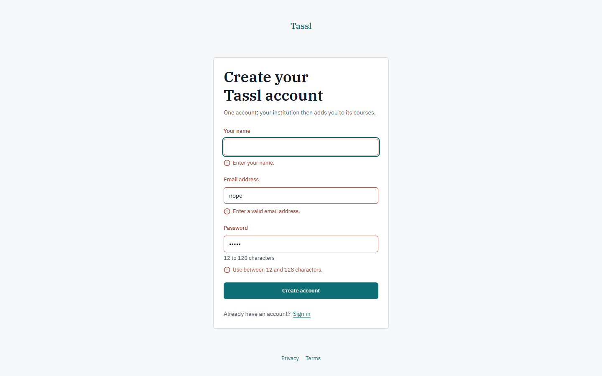

An address that already has an account gets exactly the same answer as a new one — you are sent to
the "confirm your email address" screen and told nothing. That is deliberate.

### Accepting your institution's invitation

This is the usual way a student arrives. The invitation email carries a link; opening it gives you a
page headed **Join {institution}** — "{institution} invited you to Tassl. Accept and your courses,
assignments, and runs there appear on your home page." It shows **Your role**, which is the seat the
person who invited you chose, and one button, **Accept the invitation**. Pressing it answers "You are
now a member of {institution}." and your assignments appear on **Home**.

An invitation lasts seven days and works once. The refusals it can give are in
[section 9](#accepting-an-invitation). Nothing on this page is editable: the seat is the inviter's
choice, and an administrator of the institution is the person who changes one.

### Confirming your address, and the two kinds of link

A confirmation link works once and lasts 24 hours. Open a spent one and you get **Confirm your email
address** with an **Email address** box, a **Resend the link** button and a **Back to sign in**
link. After a resend, the polite line reads "If that address still needs confirming, a new link is
on its way." and you must wait a minute before asking again.


A password reset starts at **Reset your password** — "We email a link that lets you choose a new
password." Type your address, press **Email me a link**, and the form is replaced by "If that
address exists, we sent a link. It works for one hour." It says that whether or not the address
has an account.


Following a reset link gives you **Choose a new password**, described as "Saving a new password
signs out every other session." Fill in **New password** (12 to 128 characters) and **New password
again**, then press **Save the new password**. If the two differ you see "Both passwords must be
the same." A link that has expired or already been used shows **That reset link no longer works**
instead, with **Ask for a new link**.


### The two public documents

**Privacy** ("What Tassl stores about you, why it stores it, how long it keeps it, and what you can
do about it") lists, in a table, everything the product holds: your account, your signed-in devices,
your seats, your run, what the run produced, your notifications, model-call records, rate-limit
counters and audit rows. It states plainly that "Tassl records no audio and no video, takes no
screenshots, and measures no typing."

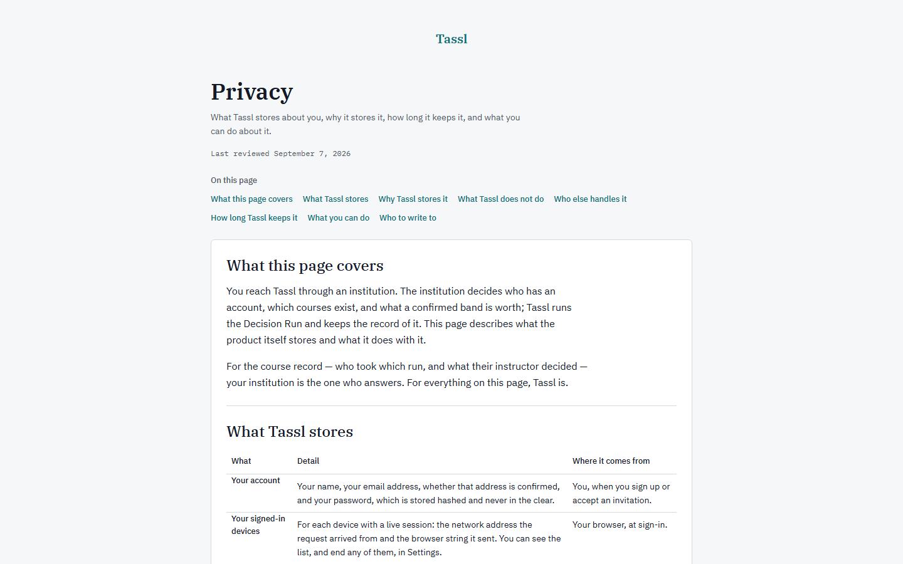

**Terms** ("What an account is for, what the product decides and what it leaves to your instructor,
and how access ends") says that Tassl assigns no grade, that "A band you disagree with is a
conversation with your instructor, who can change it," and that "Tassl makes no misconduct
findings."

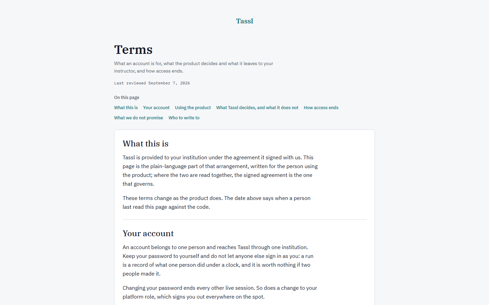

A Tassl address that does not exist gives a plain **Not found** page — "There is nothing at this
address. It may have moved, or the link may be wrong." — with **Go home**.


### Your home screen

Signing in lands you on **Home**, described as "What needs your attention, and what is coming up."
Above the heading sits the name of your institution.

The page carries one region for your seat: **Your runs**. Inside it is the first five rows of the
same table the **Runs** screen shows, with the caption "Your assignments and the runs you have taken
on them" and the columns **Assignment**, **Attempt**, **State** and **Next**. If you have more than
five, an **All runs** button appears beside the heading and takes you to **Runs**.

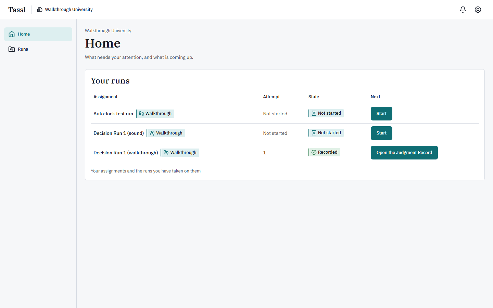

Two empty states can stand in its place:

| What you see | When |
|---|---|
| **Nothing to do yet** — "When a course assigns you a run, or a run is waiting for your review, it appears here." | You belong to an institution but nothing has been assigned yet |
| **Waiting for an invitation** — "An institution adds you by an invitation email; once you accept it, your courses and runs appear here." | Your account belongs to no institution yet |

The same screen works on a phone. The rail, the header and the table all stay; the table scrolls
sideways inside its own box rather than pushing the page wide.

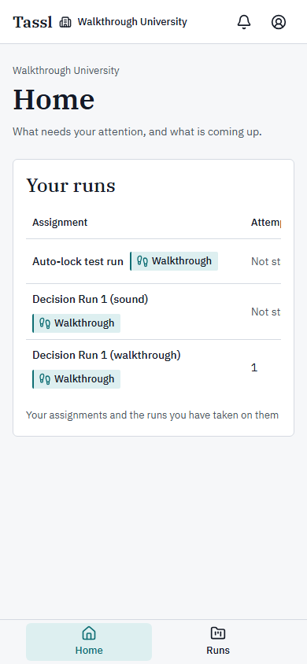

---

## 3. Navigation map

```
Tassl (wordmark, top left)      → Home
Header
  Institution <name>            → the institution this session is reading
  Notifications (bell)          → the notifications screen
  Account: <your name>          → the account menu
      Settings                  → Account settings · Profile
      Privacy                   → the Privacy page
      Terms                     → the Terms page
      Sign out                  → signs this device out, lands on Sign in
Rail (Primary navigation)
  Home                          → your home screen
  Runs                          → every assignment in your sections
Inside a run (reached from Runs, never from the rail)
  Before you begin              → the policy screen, the run's first step
  Readiness Check               → sixteen questions, eight minutes
  What the check read           → the reading the check closes with
  The scenario                  → brief, Evidence Room, frame, assistant, brief editor
  Decision locked               → your filed decision, the wait for the Turn, the addendum
  The Turn                      → what arrived, the claims it raised, your response
  The defense                   → the closing questions
  Run status                    → where the run has got to between stages
  Run Debrief                   → the twelve-section read-back of your run
  Judgment Record               → the four graphs, the confirmed bands, the download
Account settings (from the account menu)
  Profile                       → your name and your address
  Security                      → your password and your signed-in devices
  Data                          → download your data, delete your account
```

| Destination | Label you press | Where it goes |
|---|---|---|
| Skip link | **Skip to main content** | Jumps past the header and rail to the page body |
| Wordmark | **Tassl** | Home |
| Institution | **Institution** and its name | Names the institution this session reads; students belong to one |
| Bell | **Notifications: {n} unread** (or **Notifications: No unread notifications**) | The notifications list |
| Account button | **Account: {your name}** | Opens the account menu |
| Account menu | **Settings** / **Privacy** / **Terms** / **Sign out** | Account settings · the Privacy page · the Terms page · signs out |
| Rail | **Home** | Your home screen |
| Rail | **Runs** | Every assignment in your sections |
| Runs table | **Start** | Starts a run and opens **Before you begin** |
| Runs table | **Continue** | The step your run stopped at |
| Runs table | **Respond to the Turn** | The Turn screen |
| Runs table | **Defend the decision** | The defense |
| Runs table | **Open the run** | The run status screen |
| Runs table | **Read the debrief** | Your Run Debrief |
| Runs table | **Open the Judgment Record** | Your Judgment Record |
| Runs table | **Show more assignments** | Adds the next page of rows to the same table |
| Home panel | **All runs** | The Runs screen, when you have more than five rows |
| Run status | **All runs** | Back to the Runs table |
| Notifications | **Show more notifications** | Adds the next page of notices to the same list |
| Debrief | **Back to the run** / **Open the Judgment Record** | The run status screen · the record |
| Record | **Open the debrief** / **Back to the run** / **Download record** | The debrief · the status screen · a JSON file of the run |
| Settings tabs | **Profile** / **Security** / **Data** | The three settings screens |

The account menu shows your name and the address you sign in with above its four items.

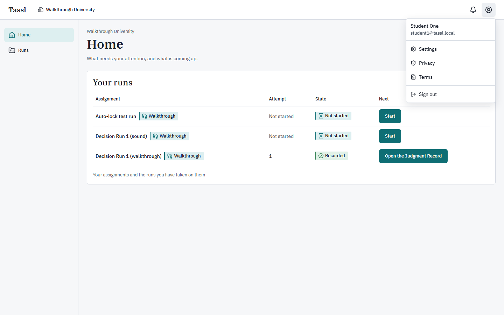

There is no **Courses**, **Review**, **Packages** or **Admin** item in your rail, and no search box
anywhere in the product.

---

## 4. Dashboards

Tassl shows you four sets of numbers about yourself, and only about yourself. Before you read any of
them, one rule holds everywhere: **there is no score, no rank and no percentile anywhere in Tassl.**
The policy screen says it in as many words — "There is no total score, no rank, and no percentile
anywhere in Tassl." Nothing on any screen compares you with another student, and no screen adds your
bands into a single number except the points arithmetic your own course asked for.

### Home

**Home** carries one panel, **Your runs**, and no counts of its own. It is a shortcut into the Runs
table, showing its first five rows. Everything on it is explained below.

### The Runs table

Four columns, one row per attempt plus one row for every assignment you have not started.

| Column | What it holds | How to read it |
|---|---|---|
| **Assignment** | The assignment's name, with a **Walkthrough** chip when it is a practice assignment. A voided attempt is struck through and carries "This attempt was voided." A run being read by hand carries "Your instructor is reviewing this run." | Names the thing, not your performance |
| **Attempt** | The attempt number, or **Not started** | A second number means your instructor re-offered the assignment after voiding the first attempt. It is not a retake you can ask for |
| **State** | Where the run has got to (the full list is in section 5.1) | Nothing here is a result. **Scored**, **Confirmed** and **Recorded** mean bands exist, not that they are good |
| **Next** | The single next thing to press | There is exactly one; Tassl never offers you a choice of where to go next |

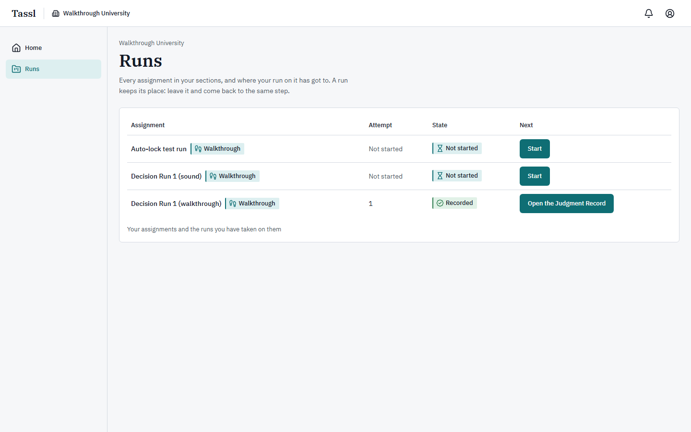

Drill down by pressing the button in **Next**. There is no other way in, and no row is clickable as
a whole.

### The seven dimensions, in the debrief

Your run is read on seven named aspects of judgment. Each one holds a **band** — one of **Novice**,
**Developing**, **Proficient**, **Professional**, or **Unassessed** — plus the recorded sentence
saying what in the run placed it, and links under **Read from** to the graphs it was read from.

| Dimension | What it reads | A lower band says | A higher band says |
|---|---|---|---|
| **Framing** | The frame you locked before the assistant unlocked, and what you had read by then | The frame was thin, or written before anything was read | The frame named a real decision and assumptions that carry weight |
| **Delegation** | How you used the assistant: how many requests, how many carried a stated reason, what you read first | You asked with no stated reason, or asked before reading anything | Your requests were purposeful and you said why you made them |
| **Verification** | The checks you ran, and on what | Claims were marked **Verify** with nothing behind the mark | Checks landed on load-bearing claims and on the ones that did not hold up |
| **Calibration** | Your confidence set against how well founded the claims under it were | Confidence rose while the claims under it were unchecked | Confidence tracked what you had actually established |
| **Decision Quality** | The brief as it was filed, against the positions the scenario's author marked defensible | The recommendation rested on superseded material | The recommendation is one the material supports, and the reasoning is on the page |
| **Adaptation** | The response you filed to the Turn, beside your frozen frame | The response ignored what arrived, or over-reacted to it | The response was proportionate and said which assumption moved |
| **Ownership** | The defense answers, taken with no assistant and no room | Answers carried no figure, source or reason | Answers stood on their own |

Two things are true of every band in this build. Each carries the chip **Uncalibrated**, and each
page repeats: "Every band in this build is a descriptive draft: the rubric has not been calibrated
against a pilot yet." And each starts as a **Draft** that your instructor confirms or changes before
it means anything.


### The four graphs

The same four graphs appear in your debrief and again on your Judgment Record. They are plotted from
your run's own record at scoring time, and each one sits under a title with a sentence describing it
in words.

| Graph | What it plots | What a reading means |
|---|---|---|
| **Confidence line** | The three confidence numbers you gave — at the frame, at the decision lock, and after the Turn — against how sound the claims you were relying on at each point actually were | A line that rises while the accuracy line stays low is confidence outrunning evidence. A line that falls after the Turn is a reading that moved with the news |
| **Clock timeline** | The working period and the Turn window, segmented by what you were doing, with claim-touching events and every credited pause marked | A long **Unattributed** stretch means time the run could not attribute to reading, delegating or checking |
| **Stance matrix** | One row per consequential claim: the stance you took against the stance the material warranted, plus a five-by-five summary grid | Numbers on the diagonal are matches. **False Challenge Rate** counts sound claims warranting **Accept** or **Verify** that you challenged or rejected, over all the consequential claims — a high rate means suspicion aimed at claims that held up. **Stances matching what was warranted** is the share on the diagonal |
| **Frame beside decision** | The frame you locked, set against the brief you filed and the Turn response, with the assumptions the Turn disrupted named | It shows which of your named assumptions the world actually tested, and which disruptions your frame never named at all |

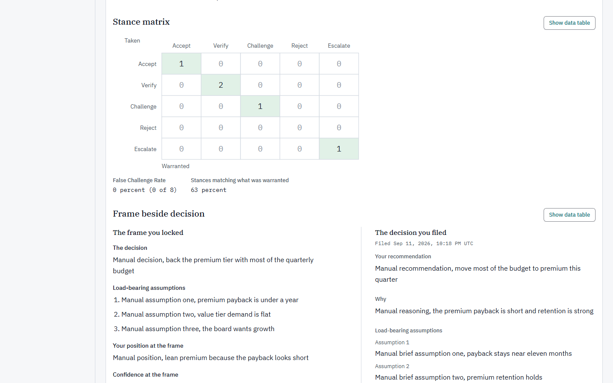

Every graph has a **Show data table** control. Opening it prints the same figures as a table you can
read line by line, which is also how the graphs are read by a screen reader.

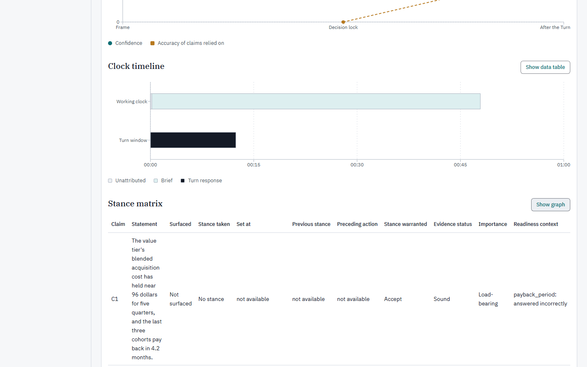

---

## 5. Features

A Decision Run is one long sequence. This section walks it in order. Each stage names what it is
for, everything on the screen, what you press, and what cannot be taken back.

If you would rather rehearse the whole thing once with someone reading over your shoulder, the
[student guide](../guides/learner-guide.md) walks the same sequence click by click on a seeded
practice assignment. Each stage below has a task there:

| Stage | Rehearse it |
|---|---|
| Your runs | [Task 1: Sign in and see your runs](../guides/learner-guide.md#task-1-sign-in-and-see-your-runs) |
| Before you begin | [Task 2: Start a run and read what it counts for](../guides/learner-guide.md#task-2-start-a-run-and-read-what-it-counts-for) |
| The Readiness Check | [Task 3: Take the Readiness Check](../guides/learner-guide.md#task-3-take-the-readiness-check) |
| The scenario and the Evidence Room | [Task 4: Read the brief and open the Evidence Room](../guides/learner-guide.md#task-4-read-the-brief-and-open-the-evidence-room) |
| Your frame | [Task 5: Lock your frame](../guides/learner-guide.md#task-5-lock-your-frame) |
| The assistant | [Task 6: Ask the assistant](../guides/learner-guide.md#task-6-ask-the-assistant) |
| Claims and stances | [Task 7: Take a stance on every claim](../guides/learner-guide.md#task-7-take-a-stance-on-every-claim) |
| Checking and escalating a claim | [Task 8: Check a claim and escalate one](../guides/learner-guide.md#task-8-check-a-claim-and-escalate-one) |
| Declaring outside-tool use | [Task 9: Declare outside-tool use](../guides/learner-guide.md#task-9-declare-outside-tool-use) |
| Your decision brief, and locking it | [Task 10: Write your decision brief and file it](../guides/learner-guide.md#task-10-write-your-decision-brief-and-file-it) |
| The Turn | [Task 11: Respond to the Turn](../guides/learner-guide.md#task-11-respond-to-the-turn) |
| The defense | [Task 12: Answer the defense](../guides/learner-guide.md#task-12-answer-the-defense) |
| Your result and your debrief | [Task 13: Read your result and your debrief](../guides/learner-guide.md#task-13-read-your-result-and-your-debrief) |
| Your Judgment Record | [Task 14: Open your Judgment Record](../guides/learner-guide.md#task-14-open-your-judgment-record) |
| An assistant that does not answer | [Task 15: Continue after an assistant outage](../guides/learner-guide.md#task-15-continue-after-an-assistant-outage) |
| Notifications, your account and signing out | [Task 16: Manage notifications, your account, and sign out](../guides/learner-guide.md#task-16-manage-notifications-your-account-and-sign-out) |

### Your runs

**Runs** is the list of every assignment in your sections and where your run on each has got to. The
description reads: "Every assignment in your sections, and where your run on it has got to. A run
keeps its place: leave it and come back to the same step."

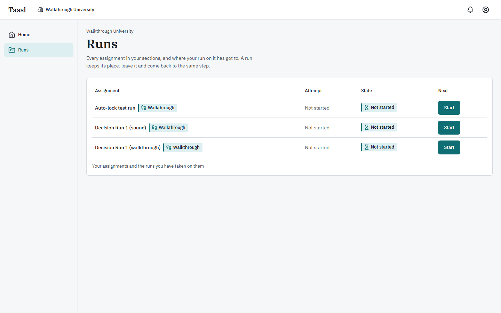

The table's four columns are **Assignment**, **Attempt**, **State** and **Next**. Oldest attempt
first, with a row for each assignment you have not begun.

Every state a run can be in, and what each means:

| **State** | What it means |
|---|---|
| **Not started** | The assignment is open and no run exists yet |
| **Readiness Check** | The check is open and its eight minutes are running |
| **Framing** | The scenario is open. You are reading and writing your frame. No clock is running |
| **Working** | Your frame is locked and the working clock is running |
| **Paused** | Something on Tassl's side failed. The clock is stopped and the time is credited back when you resume |
| **Decision locked** | Your brief is filed. You are waiting for the Turn |
| **Turn open** | The Turn has arrived and its twelve-minute window is running |
| **Turn locked** | Your response is filed and the defense is opening |
| **Defense** | The closing questions are waiting. There is no clock |
| **Defense complete** | Everything is in. Scoring starts on its own |
| **Scored** | The seven bands are drafted. Your debrief is open |
| **Confirmed** | Your instructor has decided every band. The Judgment Record opens |
| **Recorded** | You have filed the debrief's two answers. The run is closed |
| **Voided** | Your instructor ended the attempt. It is not scored and counts for nothing |
| **Under review** | Something in the run needs a person to read it before bands are set. This word replaces the state word rather than sitting beside it |

**Under appeal**, **Abandoned**, **Defense missed** and **Expired** exist in the vocabulary; no run
in this build reaches them.

The **Next** column holds exactly one action:

| State of the row | What **Next** says |
|---|---|
| No run yet, assignment open | **Start** |
| No run yet, not open yet | Plain text, **Opens {when}** — nothing to press |
| Not started | **Start** |
| Readiness Check, Framing, Working, Paused, Decision locked | **Continue** |
| Turn open | **Respond to the Turn** |
| Turn locked, Defense | **Defend the decision** |
| Defense complete | **Open the run** |
| Scored, Confirmed | **Read the debrief** |
| Recorded | **Open the Judgment Record** |
| Voided, with a later attempt | **Continue on attempt {number}** |
| Voided, no later attempt | Plain text: "Your instructor will say whether it is re-offered." |

Pressing **Start** creates the run and takes you straight to its first screen, **Before you begin**.
The button reads **Starting…** while it works. It can be refused three ways: "You already have a
run on this assignment.", "This assignment has not opened yet.", or "Only a student on this
assignment’s section can start a run." If the press fails for any other reason the banner reads
"The run could not be started. Try again."

One run per assignment. There is no second attempt you can start yourself; a new attempt exists only
when your instructor voids the first and re-offers it.

Later in the run's life the same table is how you get back to what came out of it — here, after an
instructor has confirmed the bands, the row reads **Confirmed** and offers **Read the debrief**.

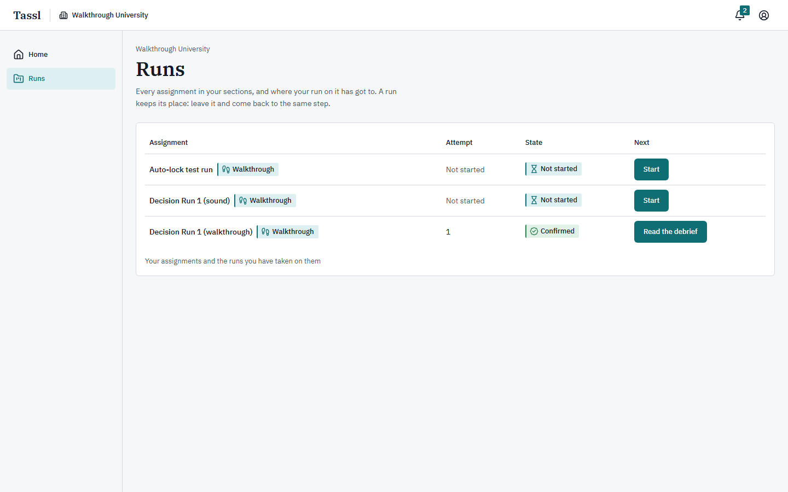

If the list is empty you see one of two things. With an institution but nothing assigned, **No
assignments yet** — "A Decision Run is one consequential business decision, taken with an AI
assistant in the room and under a clock you cannot pause. Tassl records what you did and your
instructor reads it back. When a course assigns you one, it appears here." With no institution at
all, **Waiting for an invitation** — "Runs belong to a course at an institution. Once you accept an
invitation, the assignments in your sections appear here." That is a different sentence from the one
**Home** shows in the same situation, because this screen is about assignments and **Home** is about
everything.

A long list pages rather than scrolling forever: **Show more assignments** at the foot adds the next
rows to the same table.

### Before you begin

This is the run's first screen and the only place the terms of the run are stated. The heading is
**Before you begin**, described as "What this run counts for, what you may use while you take it,
and how long the clock runs."

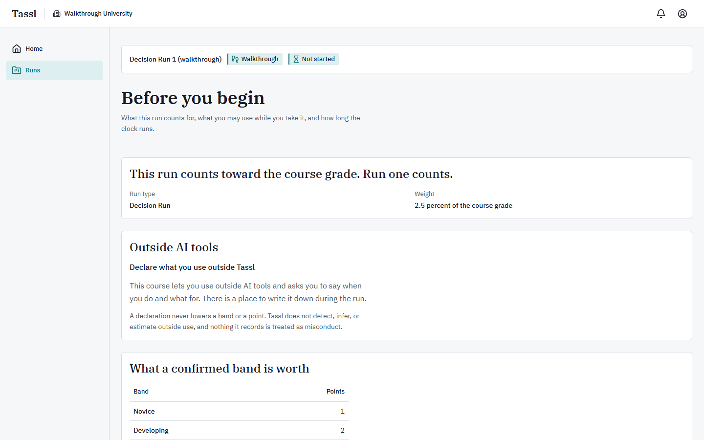

Read all five panels. They are the only thing standing between you and a run you cannot restart.

**1. What this run counts for.** The heading reads "This run counts toward the course grade. Run
one counts." Two facts sit under it: **Run type** — **Decision Run** (a **Critique Run** is the
shorter type; no screen in this build runs one) — and **Weight**, given as "{n} percent of the
course grade".

**2. Outside AI tools.** Your course sets one of three policies and this panel states which.

| Policy | What the panel says |
|---|---|
| Open | **You may use any AI tool** — "This course lets you use any AI tool you like, inside Tassl or outside it, and you do not have to say so." |
| Declared | **Declare what you use outside Tassl** — "This course lets you use outside AI tools and asks you to say when you do and what for. There is a place to write it down during the run." |
| In-environment only | **Work with the assistant inside Tassl** — "This course asks you to work only with the assistant inside Tassl. If you use something else, say so during the run." |

Whichever it is, the same promise follows: "A declaration never lowers a band or a point. Tassl
does not detect, infer, or estimate outside use, and nothing it records is treated as misconduct."


**3. What a confirmed band is worth.** A table captioned "Points per confirmed band in this course",
with columns **Band** and **Points** and the four bands in fixed order — **Novice**, **Developing**,
**Proficient**, **Professional** — against your course's numbers. Beneath it: "Your instructor
confirms a band on each dimension after the run. Your points are the mean over the dimensions
assessed; a dimension left unassessed is excluded, never counted as zero. There is no total score,
no rank, and no percentile anywhere in Tassl."


**4. The working clock.** The length of the clock, written out — in the walkthrough scenario, "25
minutes". Then the sentence that matters most on this screen: "The clock starts when you lock your
frame, not now. Reading the brief and the Evidence Room beforehand costs you nothing." The panel
also carries an **Uncalibrated** chip and the line "No cohort has run this scenario yet, so this
length is the author’s estimate rather than a calibrated one."

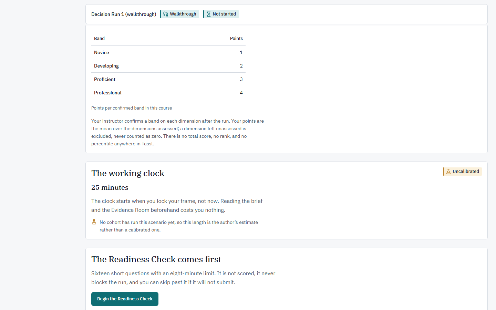

**5. The Readiness Check comes first.** "Sixteen short questions with an eight-minute limit. It is
not scored, it never blocks the run, and you can skip past it if it will not submit." The button
beneath it is **Begin the Readiness Check** (**Beginning…** while it works).


**What is irreversible from here.** Pressing **Begin the Readiness Check** moves the run out of
**Not started** for good. You can never see this screen again, and the eight-minute check clock
starts the moment you press it. Nothing else on this screen commits you: the run's working clock is
still stopped, and it stays stopped until you lock your frame. If the press fails you see "The run
could not be opened. Try again."

### The Readiness Check

Sixteen four-option questions in eight minutes, about the ideas the scenario turns on. **It is not
scored.** No screen, now or later, tells you how many you got right, and nothing about it reaches
your bands or your instructor as a result. It exists to close with a short reading of which ideas
look solid and which look thin, so you know where you stand before you start.

The description says it in full: "Sixteen questions in eight minutes. Answer them in any order, and
change any answer while the clock runs. The check is not scored and it never blocks the run; it
closes with a short reading of the ideas the scenario turns on."

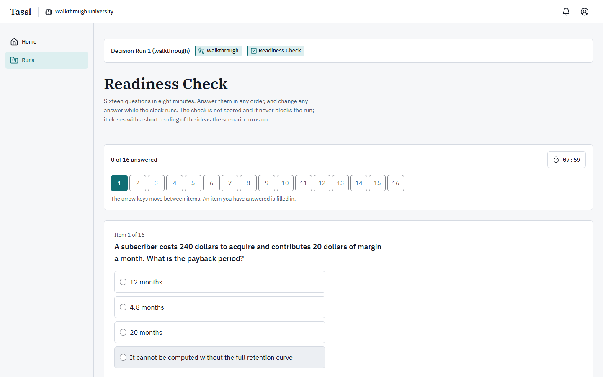

On the screen:

- A progress line, "{n} of 16 answered", and the clock beside it, labeled **Readiness Check
  clock**, counting down from 08:00. It turns red in the last minute.
- A toolbar named **Items** holding sixteen numbered buttons. Arrow keys move between them; Home and
  End reach the ends. Each button is named for a screen reader as "Item {n}, answered" or
  "Item {n}, not answered". The hint under them: "The arrow keys move between items. An item you
  have answered is filled in."
- The item itself, headed "Item {n} of 16", then the question and four options. Nothing marks an
  option as right, and nothing says what category the question belongs to.
- **Previous item** and **Next item**, which stay on screen and go quiet at the two ends.
- **Submit the check** (**Submitting…** while it works).

To take it:

1. Read the item and choose one of the four options. It is written down the moment you choose it;
   there is nothing to save.
2. Press **Next item**, or press a number in the **Items** toolbar to jump anywhere.
3. Change any answer you like while the clock runs. The counter and the filled-in numbers follow.
4. Press **Submit the check** when you are done, or when you want to move on.

An answered item fills its number in and the counter moves.

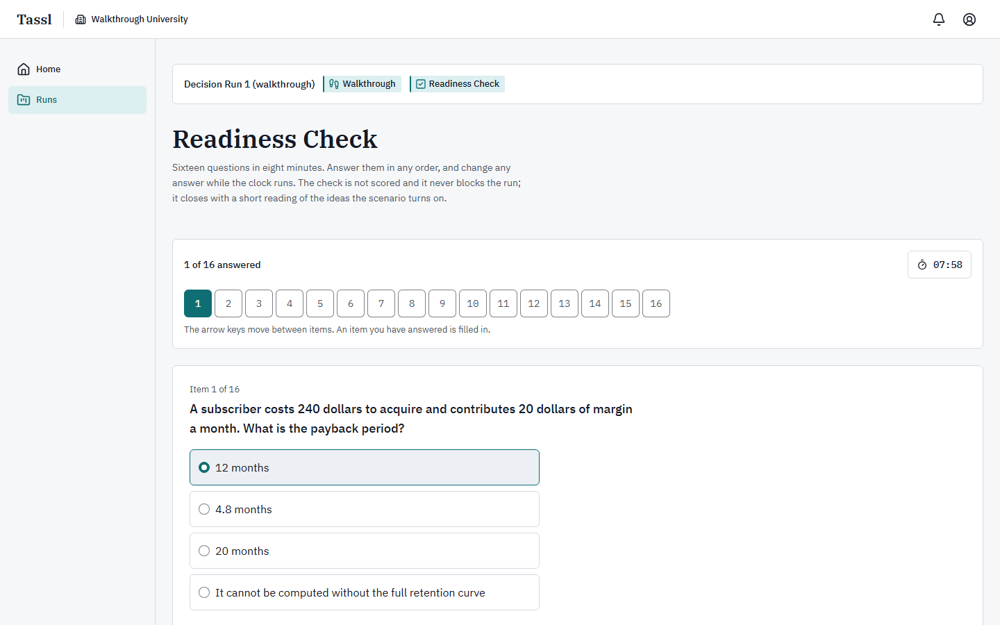

Leaving items blank is allowed. Nothing forces an answer and nothing marks a blank item as a
problem.

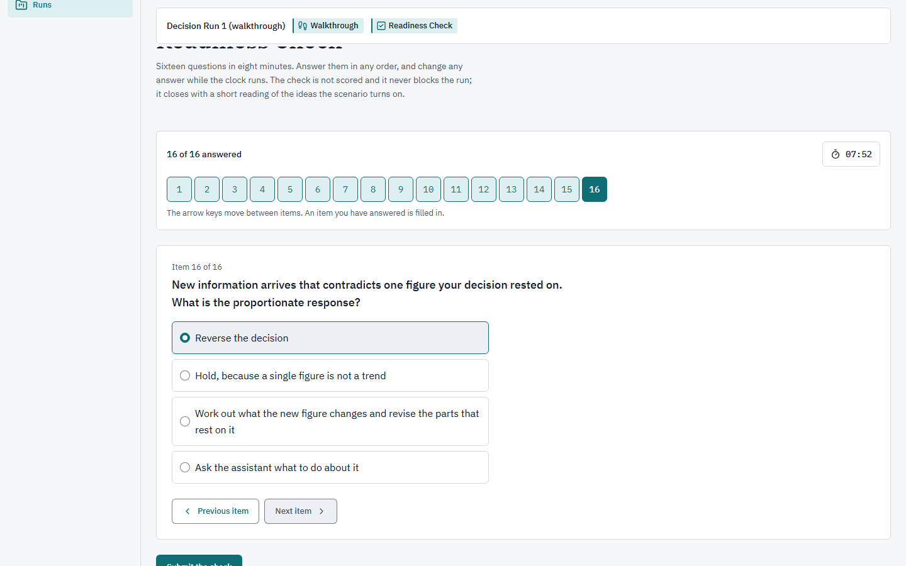

**The confirmation dialog.** **Submit the check** always asks first. The dialog is titled **Submit
the Readiness Check?** and its body depends on what is blank:

| What is blank | What the dialog says |
|---|---|
| Nothing | "Every item has an answer. Submitting closes the check and opens the scenario." |
| One item | "One item has no answer. Submitting closes the check and opens the scenario; an item left blank simply leaves its idea unread." |
| Two or more | "{n} items have no answer. Submitting closes the check and opens the scenario; an item left blank simply leaves its idea unread." |

The buttons are **Keep answering** and **Submit**.

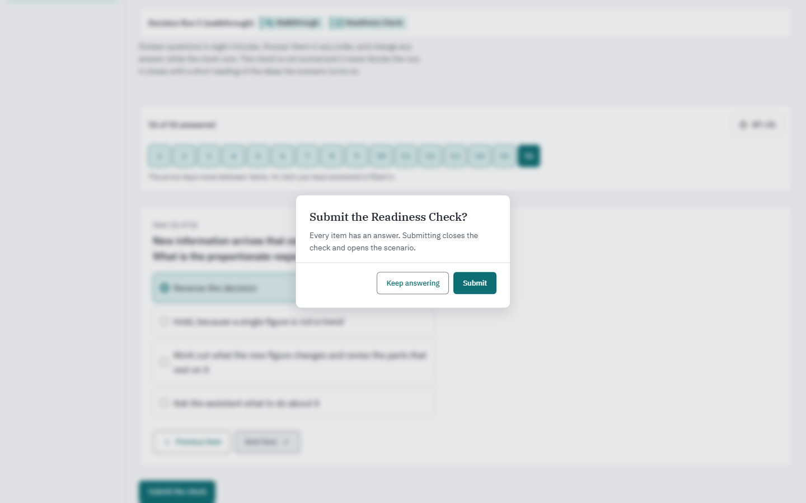

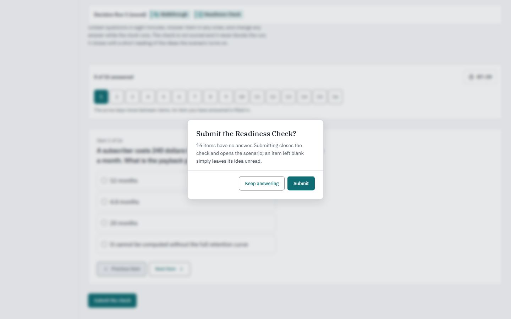

If the clock runs out, the check submits itself with whatever you had answered and the screen says
**Time is up** — "The check submitted itself with the answers you had given. The reading it produced
is on its way."

If a submission fails on Tassl's side, a panel appears: **If the check will not submit** — "That
failure was ours, not yours. Try the submit once more; if it fails again, you can skip the check and
go straight to the scenario. Skipping costs you nothing — the check is not scored, and every idea it
asked about is simply left unread." — with a **Skip the check** button. The skip only exists after a
submission has failed; asking for it earlier is refused with "The check can only be skipped after a
submission has failed."

**The result screen.** Submitting or skipping opens **What the check read**: "One line for each idea
the sixteen questions asked about. There is no score here, no total and no comparison with anyone
else, and nothing on this page counts toward your grade. The run ahead is what counts."

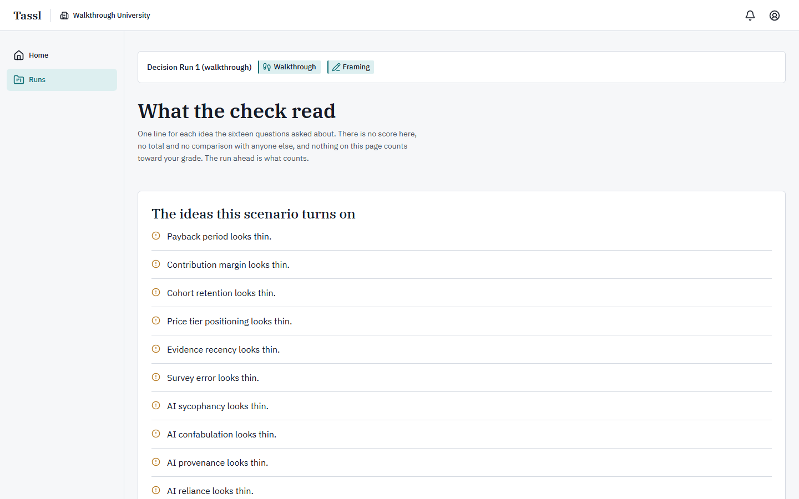

The panel **The ideas this scenario turns on** holds one sentence per idea, in the order the check
asked about them, never sorted by how you did:

| Sentence | What it means |
|---|---|
| **You showed a working grasp of {idea}.** | Every item on that idea was answered correctly |
| **{Idea} looks thin.** | At least one item on it was not |
| **We could not tell about {idea}.** | The check could not read that idea — usually because its items were left blank |

There are no counts, no totals and no percentages anywhere on this page.


If the check did not finish — it expired with blanks, or you skipped it — a panel appears first:
**The check did not finish** — "It closed before every item was answered, so the ideas it could not
read are marked as such below. Nothing follows from that: the scenario opens exactly as it would
have." Below it, every line reads "We could not tell about…".

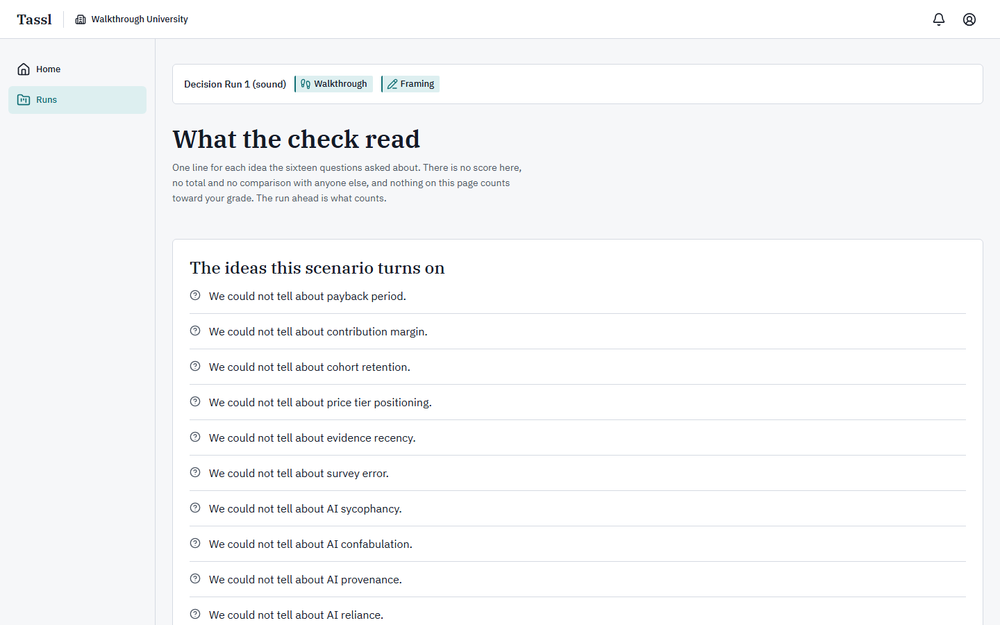

If the check recorded no ideas at all, the panel says so instead: "This check recorded no ideas to
report. The scenario opens all the same."

The button at the foot is **Open the scenario**.

**What is irreversible.** Submitting or skipping closes the check permanently. It never reopens, and
there is no way back to the questions.

### The scenario and the Evidence Room

**The scenario** is where the run happens. While your frame is unlocked the description reads: "Read
the brief and as much of the Evidence Room as you want to. The working clock starts when you lock
your frame, so reading now costs you nothing."

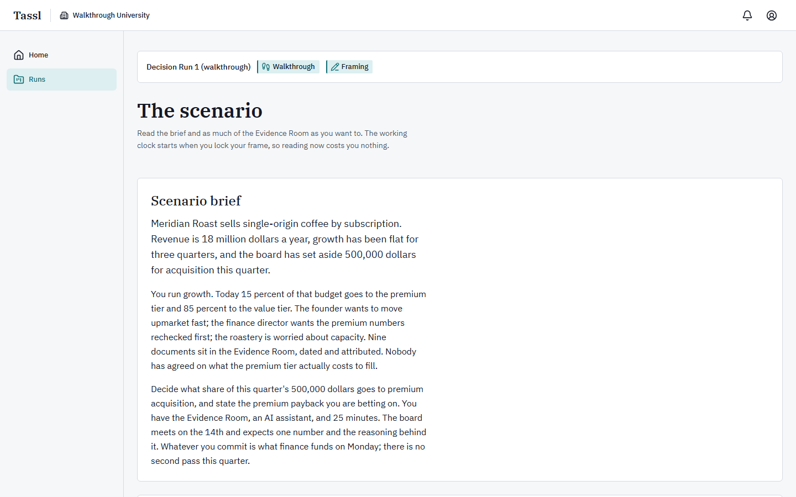

**Scenario brief.** The author's own prose, at most 200 words, in the world's voice. Nothing in it
is highlighted, summarized or flagged. It names the decision, the money, the people who disagree,
and the deadline. If a scenario carries none you see "This scenario has no brief."

Two students on the same assignment can be given different readings of the same scenario. Nothing on
screen says which you drew, and the brief is identical either way — the difference lives in the
claims, and you are not told about it until your Judgment Record opens.

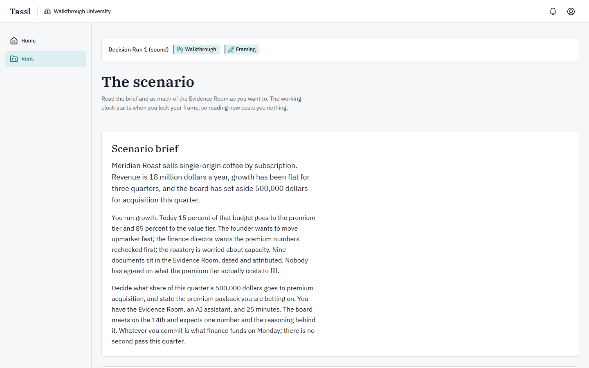

**Evidence Room.** Every document the scenario carries — six to twelve of them, nine in the
walkthrough case. The description: "Every document in this scenario. All of them are open to you, in
any order, for as long as you like. Tassl records which ones you open and how long each stays open;
it draws no conclusion from that."

Each row shows the document's title, then its author and date ("{author} · {date}"; a document
with no author reads **No attribution**), and one button, **Open**. There is no unread mark, no
length, no reading time, no sort, no filter and no recommendation. Nothing tells you which document
matters.

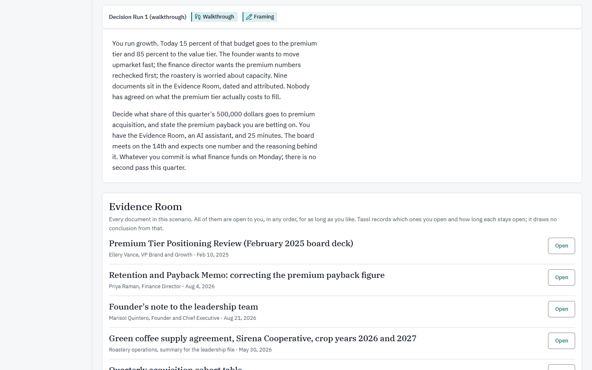

To read one:

1. Press **Open** on the row. The document's text expands under its own heading; nothing is hidden
   while it is open.
2. Read it. Only one document is open at a time — opening a second closes the first.
3. Press **Close** on the same row when you are done.

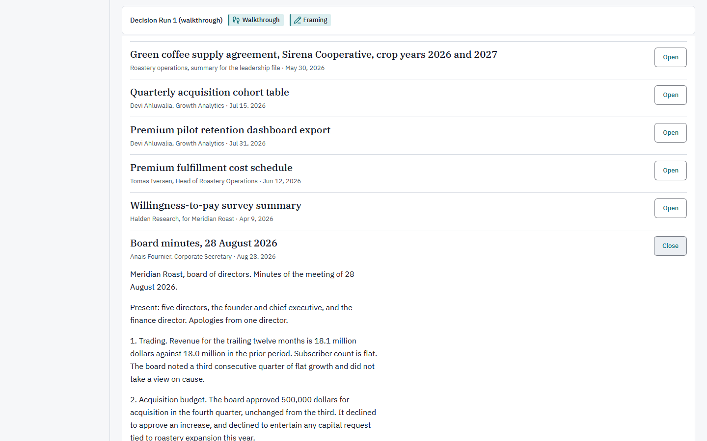

**Opening a document is recorded.** The run writes down which document you opened and how long it
stayed open, and says so on the panel. Switching away to another browser tab ends the reading;
coming back starts a new one. Nothing is concluded from any of it — the record exists so your
instructor can read what you had in front of you when you decided, not to measure you.

While the run is paused the buttons stay where they are and say "A document cannot be opened while
the run is paused." If an open fails: "That document did not open. Try it again."

### Your frame

Your frame is your position before the assistant is in the room. Its description says what it is
for: "What you are deciding, what you are taking as given, and where you stand — written before the
assistant is in the room. Tassl locks it without evaluating it or commenting on it."

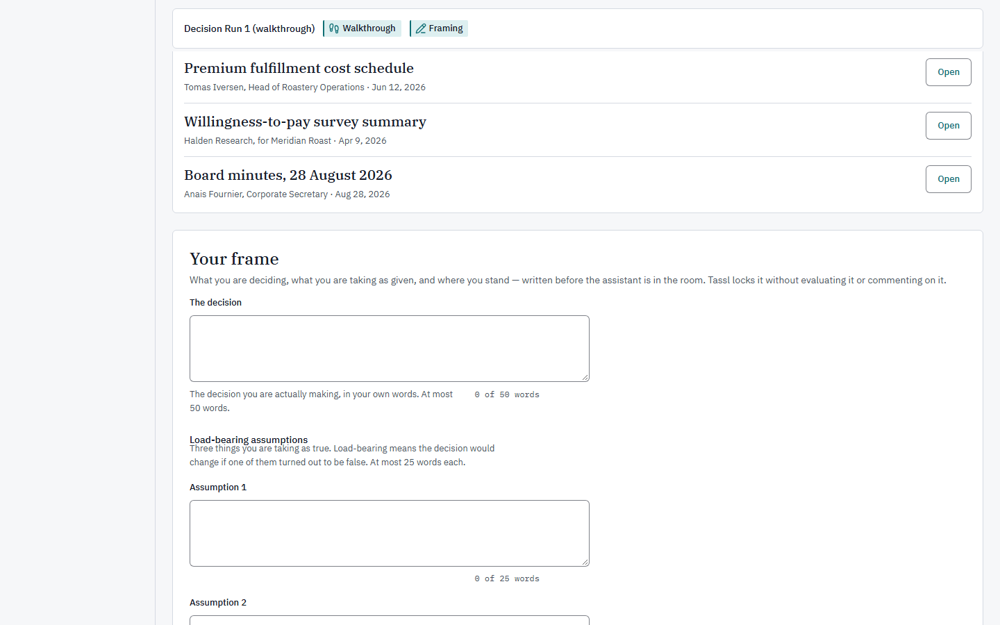

| Field | Hint on screen | Limit | Required |
|---|---|---|---|
| **The decision** | "The decision you are actually making, in your own words. At most 50 words." | 50 words | Yes |
| **Assumption 1**, **Assumption 2**, **Assumption 3**, under the legend **Load-bearing assumptions** | "Three things you are taking as true. Load-bearing means the decision would change if one of them turned out to be false. At most 25 words each." | 25 words each | All three |
| **Your position now** | "Where you stand before you have used the assistant. A lean is a position; say what it rests on. At most 100 words." | 100 words | Yes |
| **Confidence** | "How sure you are of that position, from 0 to 100. A low number with a reason behind it reads better than a confident guess." | Whole number 0 to 100 | Yes |

The **Confidence** control is a slider with a number box beside it; the two move together. It starts
at 50.

Each text field carries a live counter — "{n} of 50 words", and so on — which turns red over the
limit. A word is any run of characters with no spaces in it; pasting formatted text buys you
nothing, because Tassl strips the markup before counting. The browser and the server count with the
same rule, so the counter and the refusal can never disagree.

Two messages can appear under a field: "This is over the limit. Cut it back to {n} words to lock
the frame." and "This is part of the frame. Write something in it." A confidence outside the
range gives "Confidence is a whole number from 0 to 100."

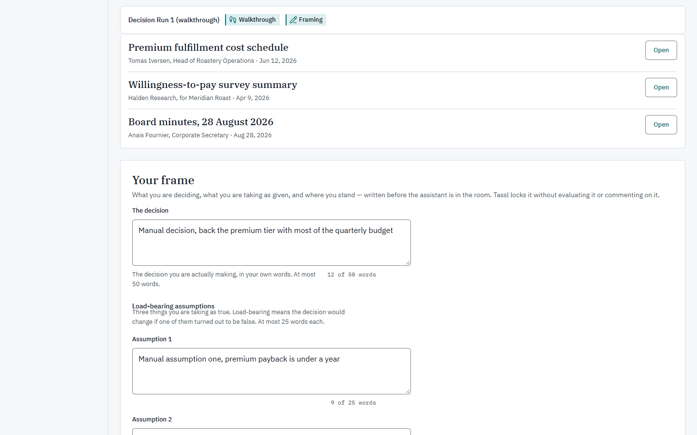

To lock it:

1. Fill in all five controls.
2. Press **Lock the frame**.
3. Read the dialog. It is titled **Lock the frame permanently?** and says: "A locked frame is never
   edited, replaced, or restored — not by you, and not by your instructor. Locking it unlocks the
   assistant and starts the working clock."
4. Press **Lock it** to go ahead, or **Keep writing** to go back.

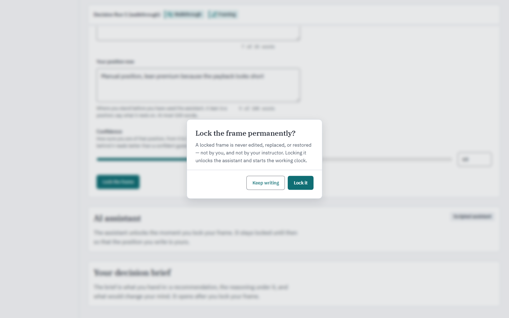

Nothing is ever locked without that dialog. If it fails to load you see "The confirmation could not
be loaded, so nothing was locked. Your frame is as you left it. Press "Lock the frame" again."

**What changes the moment you lock.** Four things, all at once:

1. **The working clock starts** and appears in the band at the top of every run screen, labeled
   **Working clock**. It counts down. It cannot be paused by you; only a failure on Tassl's side
   stops it.
2. The **AI assistant** unlocks.
3. **Your decision brief** opens for writing.
4. The frame becomes read-only for good. It reappears as a panel called **Your frame**, showing
   **The decision**, **Load-bearing assumptions**, **Your position at the frame** and **Confidence
   at the frame** as "{n} of 100", footed with "Locked {when}" and "This is what you locked. It is
   not edited again, and the rest of the run is read against it."

The page's description changes too: "Your frame is locked and the working clock is running. The
Evidence Room stays open for the rest of the decision."

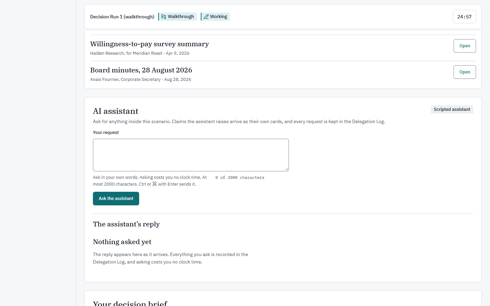

**This is irreversible.** Nobody — not you, not your instructor — can edit, replace or restore a
locked frame.

### The AI assistant

The assistant unlocks with your frame and closes when you lock your decision, then opens again for
the Turn window. Everything about it — what to ask, what comes back, what it refuses, and what
happens when it does not answer — is in [section 6](#6-the-ai-assistant).

### Claims and stances

A **claim** is something consequential the assistant states: a figure, a comparison, a conclusion,
carried word for word as the scenario's author wrote it. Claims do not arrive as prose you have to
pick apart. Each one arrives as its own card, headed **Claim {key}** — **Claim C3**, for example —
with the claim's text beneath it and nothing else. No card ever says where the claim came from, how
reliable it is, or what it deserves.


Under the legend **Your stance** sit five choices, always in this order, offered on every claim:

| Stance | What it means |
|---|---|
| **Accept** | You are taking the claim as it stands and will use it |
| **Verify** | You want it established before you lean on it |
| **Challenge** | You think it is wrong, or wrong as stated |
| **Reject** | You are not using it |
| **Escalate** | It is not yours to settle; someone else should read it |

To take one, press the chip. The arrow keys move through the five and select as they go; Home and
End reach the ends. There is no default and no recommendation: until you press something, nothing is
recorded.

The hint under the control reads: "It costs no clock time, and you can change it while the run is
open; both are kept." That is the whole rule. Taking a stance is free. Changing your mind is free.
When you change one, the card says "Changed from {stance}." and both the old stance and the new
one stay on the record — the change is part of what your run shows, not something to hide.

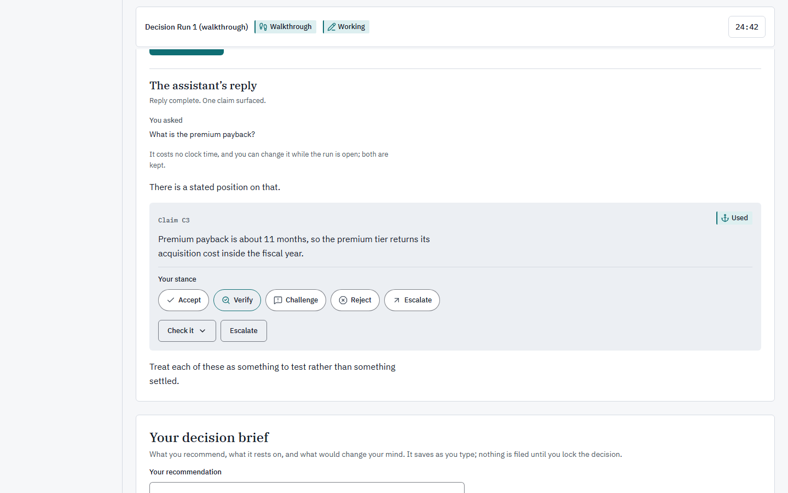

A card can also wear:

- **Used**, once you have marked the claim used in the Delegation Log, with the note "You marked this
  claim used in the Delegation Log."
- **No stance yet**, in amber, when the run has recorded that you leaned on the claim and you have
  not taken a position on it: "The run has recorded that you leaned on this claim. Filing the
  decision asks for a stance on it."

If the assistant's live reply is holding a claim on screen, the copy of that claim in the Delegation
Log says "You are taking a position on this claim in the reply above." and drops its controls. A
claim is worked in exactly one place at a time.

**What a stance is read for later.** After the run is scored, the debrief shows every consequential
claim beside the stance the material actually warranted, and the **Stance matrix** graph counts the
matches. That reading feeds **Calibration** and **Verification**. It is not a right-answer test: a
**Verify** with a check behind it and a **Verify** with nothing behind it read differently, and a
challenge aimed at a claim that held up is counted in the **False Challenge Rate**. Stances are
yours to set only while the run is open; afterwards the control says "Stances are yours to set while
the working clock runs."

If a stance does not record, you see "That stance was not recorded. Try it again." Press it
again.

### Checking a claim

A check is the way to establish a claim instead of guessing about it. Each claim card carries a
**Check it** menu button. The menu lists only the checks this scenario's author wrote a result for,
cheapest first, with the cost beside each as "{n} min".

| Check | What it returns | Cost |
|---|---|---|
| **Source Trace** | Where the claim came from: the document, its date, its author, and the passage itself | **1 min** |
| **Replication Check** | The figure recomputed from the documents, with the steps | **3 min** |
| **Decomposition Check** | The claim broken into its parts, with each part's result | **4 min** |

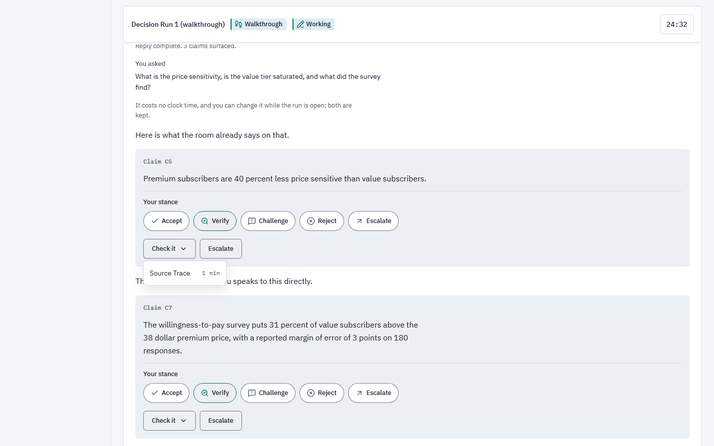

If a claim offers none, the card says "This claim offers no checks."

To run one:

1. Press **Check it** on the claim.
2. Choose a check from the menu. The button reads **Running the check…** while it works.
3. Read the result, then press **Close**.

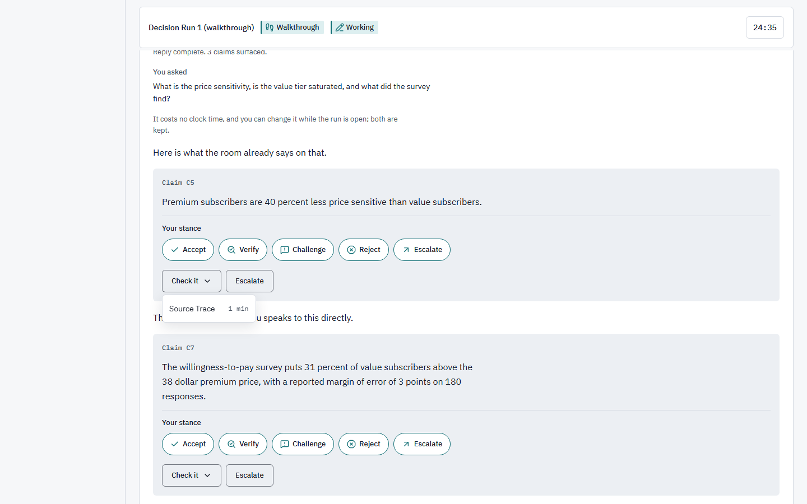

The result opens in a panel beside the run, titled **{check} on claim {key}** — for example **Source
Trace on claim C5** — described as: "What the author of this scenario wrote for this check, as they
wrote it. Tassl adds nothing to it and draws no conclusion from it."

Inside it, the author's own fields are labeled **Document**, **Passage**, **Date**, **Author**,
**Result**, **Steps**, **Method** and **Note**, and any other field the author wrote appears under
the name they gave it. A Source Trace names the document as "{key} · {title}" so you can find it
in the Evidence Room. At the foot: "This check cost one minute of your working clock." (or "cost
{n} minutes"). If the author wrote nothing, the panel says "The check returned nothing."

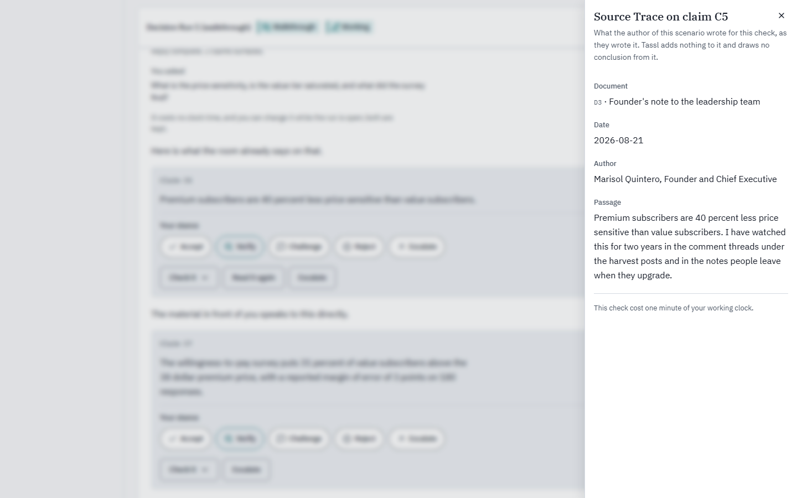

Once a check has run, its button gains **Read it again**. Reopening a stored result is free — the
clock is charged once, when the check starts.

**When checking is worth it.** A check is the only thing in the run that turns a claim from something
stated into something established. A Source Trace costs one minute and tells you the date on the
figure, which is often the whole question — a number correctly read off a superseded document is
still wrong to bet on. The cost is real: four checks and an escalation is nine minutes of a
twenty-five-minute clock. The judgment the run is asking for is which claims your decision actually
rests on, and spending the clock there rather than everywhere.

One rule about the charge: the cost is taken when the check **starts**. A check begun with less time
left than it costs still finishes, and only what was left is taken — the clock lands on zero and
your decision files itself as it stands.

Refusals you can meet: "This claim does not offer that check. The ones it does offer are on the
claim card.", "That claim has not come up in this run yet, so there is nothing to take a position
on.", "The working clock has run out.", and "That check did not run. Try it again."

### Escalating a claim

Escalation is for a claim that is not yours to settle — a methodological question, a figure whose
provenance turns on expertise you do not have, something a colleague can answer in a sentence and
you cannot answer at all in the time you have. It is a real move, not an admission.

**You get two escalations per run, whichever claims they land on, and each costs five minutes of
your working clock.**

Press **Escalate** on a claim card. The dialog is titled **Escalate to a colleague** and says: "Say
in one sentence what you cannot settle yourself. A colleague reads the claim and answers you. It
costs five minutes of your working clock."

The one field is **What you cannot settle**, hinted "One sentence, at least three words, at most 280
characters", with a counter reading "{n} of 280 characters". The dialog also states what you have
left: "You have 2 escalations left in this run.", then "You have one escalation left in this run."
once you have spent one. The buttons are **Send it** (**Sending…**) and **Cancel**.

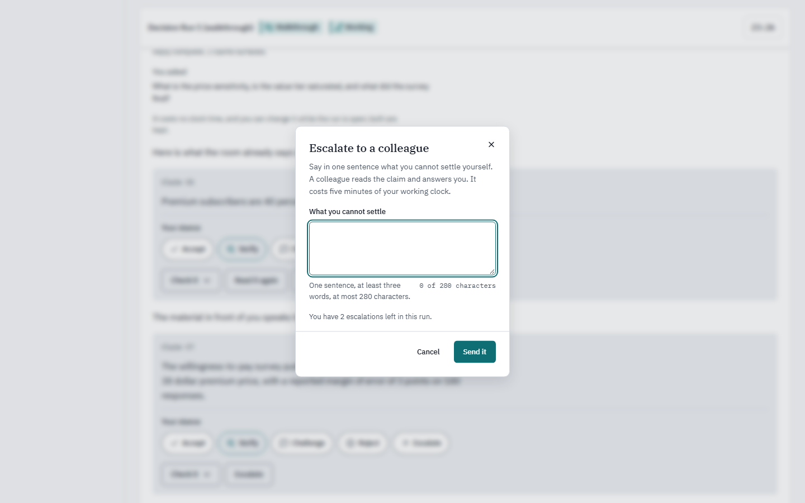

To escalate:

1. Press **Escalate** on the claim.
2. Write one sentence saying what you cannot settle.
3. Press **Send it**.

What comes back is a section on the card headed **The colleague’s reply**, with **You wrote** (your
own sentence, as you wrote it), **They answered** (a named colleague answering in their own voice),
and the cost line "This escalation cost 5 minutes of your working clock." If under a minute was
left, the line reads "This escalation cost what was left of your working clock, which was under a
minute."

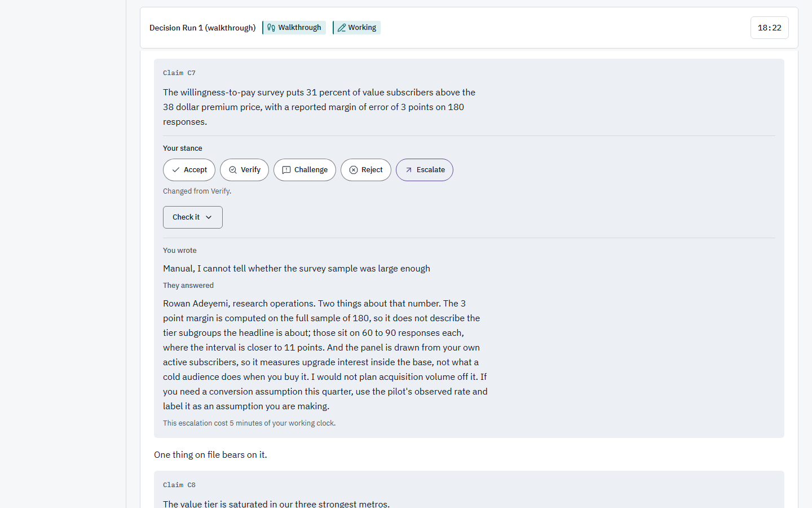

Escalating also sets that claim's stance to **Escalate**, if you had not already set one.

When they run out, the count in the dialog reads "You have used both escalations in this run.", and
that is the same sentence a further attempt is refused with. There is no way to earn another, and
nothing in the product grants one. Refusals inside the dialog: "Write at least three words.", "This is
over the limit. Cut it back to 280 characters to send it.", "The escalation did not go through.
Try it again."

### The Delegation Log and marking a claim used

The **Delegation Log** is the running record of your work with the assistant: "What you asked, what
came back, and what you did with it. Your instructor reads this beside the rest of the run."

Before you ask anything it says **Nothing delegated yet** — "Each request you make to the assistant
is listed here with the claims it raised."


Every request becomes one entry, headed **Delegation 1**, **Delegation 2** and so on in the order
you made them. Each entry holds:

| Part | What it holds |
|---|---|
| **You asked** | Your request, as it was stored |
| **The assistant answered** | The reply as you saw it. A request the assistant never answered reads "No answer came back. The run paused, your clock stopped, and the time was given back when you resumed." |
| **Claims in this reply** | Each claim the reply raised, with its text. If there were none: "No claim came back with this reply." |
| **In the Turn window** | A badge on any request you made during the Turn |
| **Why you asked** | Your own one-line note (below) |

Two sentences stand at the head of the panel and do not move: "Marking a claim used records that
you leaned on it. A mark stays on the record." and the stance hint.

**Marking a claim used.** Each claim row in the log carries a **Mark as used** button until you press
it, and then shows the chip **Used** in its place. Pressing it records that you leaned on the claim.

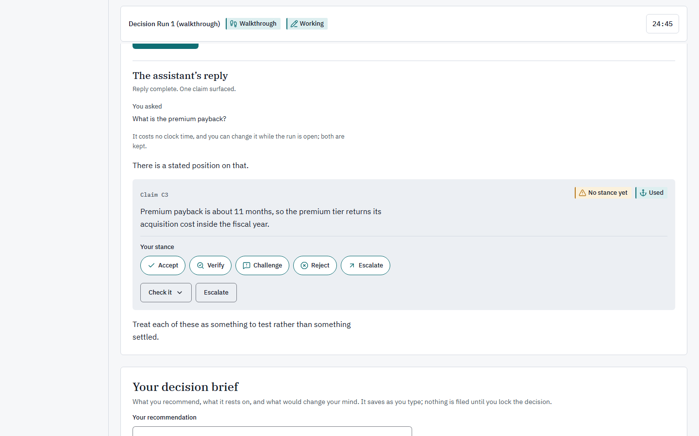

Three things about the mark:

- **It is a press, not a toggle.** There is no unmark. The record that you leaned on the claim is
  never taken back.
- It changes what the Decision Lock asks of you. A claim you leaned on must carry a stance before
  your decision will file, and until it does the card wears the amber **No stance yet** chip.
- It is not a judgment about the claim, and nothing about it is held against you. It is how the run
  knows what your decision actually rested on.

Two other things record that you leaned on a claim without a press: typing its figure into one of
the numeric fields under **The figures you are betting on** in your brief, and a claim the Turn
window puts in front of you.

**Why you asked.** Each entry has a field labeled **Why you asked**, hinted "One line in your own
words, if you want one. You can change it while the run is open. At most 200 characters", with a
counter and a **Save** button. Saving shows **Saved.** The line is optional, changes nothing else in
the run, and can be rewritten as often as you like while the run is open. Your instructor reads it,
and the **Delegation** dimension counts how many of your requests carried one — a request with a
stated purpose reads differently from one without.

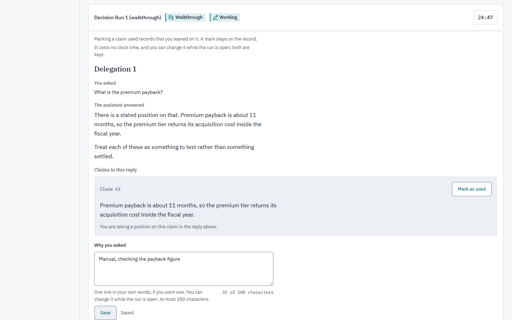

Over the limit: "This is over the limit. Cut it back to 200 characters to save it." On failure:
"That did not save. Try it again." While the run is paused: "The log cannot be written to while the
run is paused."

### Declaring outside-tool use

If you used something outside Tassl during the run — another AI tool, a spreadsheet, a calculator,
anything — this is where you say so. The panel is **Declare outside-tool use**: "Say what you used
outside Tassl and what for. It is recorded with your run and has no other effect."

Standing in front of the control, on screen the whole time, is the promise: "A declaration never
lowers a band or a point. Tassl does not detect, infer, or estimate outside use, and nothing it
records is treated as misconduct."

That sentence is literally true. A declaration writes one line into your run's record and does
nothing else: no flag, no counter, no branch, and nothing that scoring reads. Tassl does not detect
outside use, does not infer it, does not estimate it, and has no proctoring or similarity checking
anywhere in it.

To declare:

1. Press **Declare outside-tool use**. A short form opens in place.
2. Write what you used and what for in the field **What you used, and what for** — hinted "One
   sentence is enough. At most 500 characters", with a counter.
3. Press **Record it** (**Recording…**), or **Cancel** to close without recording.

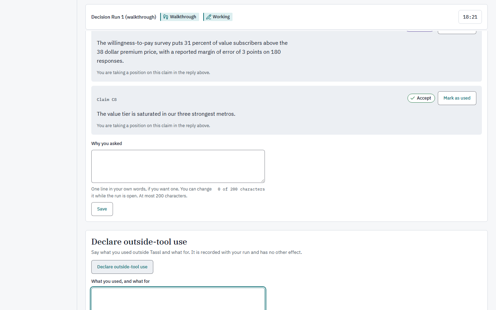

On success the form closes and empties and the line "Recorded. It sits with the run and changes
nothing about it." appears. You can declare more than once. Nothing asks whether the tool was
allowed, and nothing branches on your course's policy — the declaration is the same act under all
three policies.

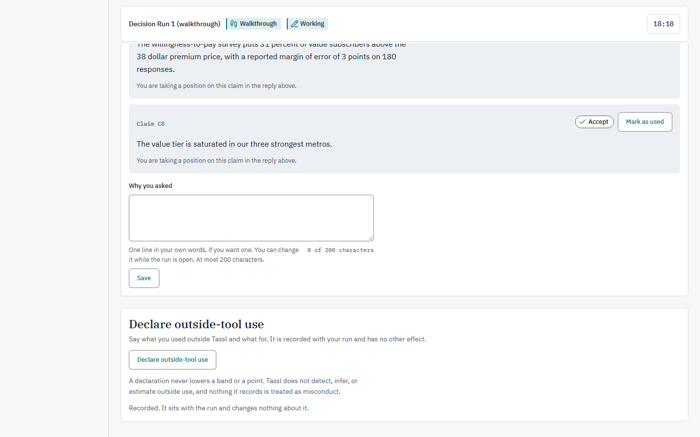

Refusals: "Write what you used it for." · "This is over the limit. Cut it back to 500 characters to
record it." · "That was not recorded. Try it again."

The same control is on the Turn screen.

### Your decision brief and locking the decision

**Your decision brief** is what you hand in: "What you recommend, what it rests on, and what would
change your mind. It saves as you type; nothing is filed until you lock the decision."

Before your frame is locked the panel is present but closed, saying "The brief is what you hand in:
a recommendation, the reasoning under it, and what would change your mind. It opens after you lock
your frame."

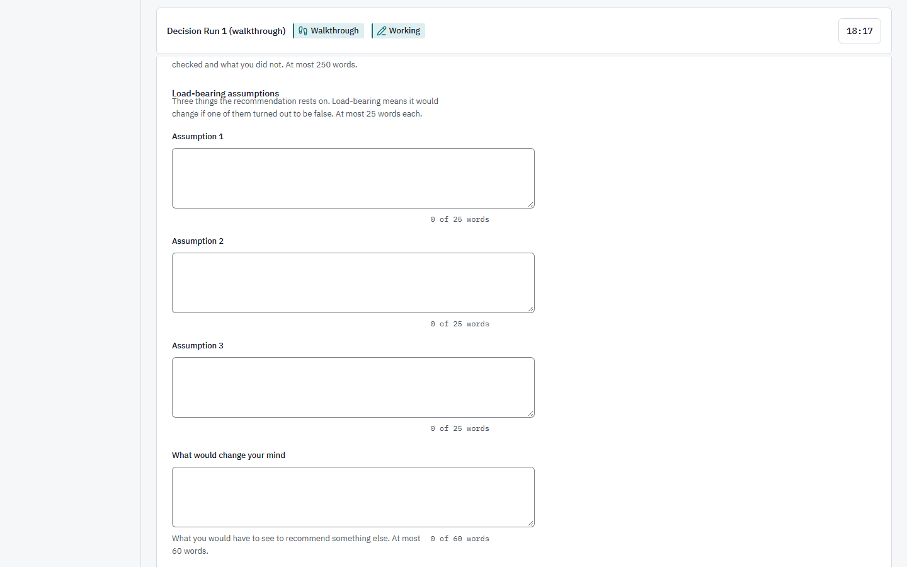

| Field | Hint on screen | Limit |
|---|---|---|
| **Your recommendation** | "The decision you are actually recommending, in your own words. At most 120 words." | 120 words |
| **Why** | "The reasoning under the recommendation, including what you checked and what you did not. At most 250 words." | 250 words |
| **Assumption 1**, **Assumption 2**, **Assumption 3**, under **Load-bearing assumptions** | "Three things the recommendation rests on. Load-bearing means it would change if one of them turned out to be false. At most 25 words each." | 25 words each |
| **What would change your mind** | "What you would have to see to recommend something else. At most 60 words." | 60 words |
| The named figures, under **The figures you are betting on** | "The numbers this decision rests on. Numbers only: digits, a decimal point and a minus sign." | Numbers only |
| **Confidence** | "How sure you are of the recommendation, from 0 to 100. A low number with a reason behind it reads better than a confident guess." | Whole number 0 to 100 |

The figures under that legend are set by the scenario's author, and each is labeled with its own unit — in
the walkthrough case, **Share of the quarter's acquisition budget going to premium, in percent** and
**Premium payback you are betting on, in months**. Units are written out in words: percent, a ratio,
months, dollars, a count, or the scenario's own unit. These are the numbers you are betting the
decision on, and typing a figure that matches a claim's figure records that you leaned on that
claim.

**It saves as you type.** A status line beside the lock button reads **Saving…** then **Saved.** A
failed save says "The last change did not save. What is on screen is not lost; it saves again as you
type." Saving a draft files nothing and commits nothing.

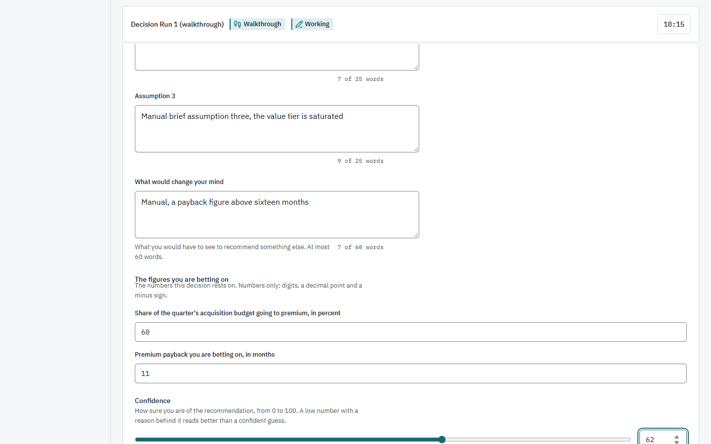

If the run has recorded that you leaned on a claim you have not taken a position on, a line appears
above the lock button: "One claim you leaned on has no stance yet. Filing asks for one on it."
or "{n} claims you leaned on have no stance yet. Filing asks for one on each." It names no claim,
because each one already wears the **No stance yet** chip on its own card.

To file:

1. Press **Lock the decision** (**Filing…** while it works).
2. Read the dialog, titled **File this decision?**: "Filing is irreversible. The brief is frozen as
   it stands, the working clock ends, the assistant and the Evidence Room close, and the Turn
   follows. You may add one short addendum afterwards, which is kept apart from the decision."
3. Read the scrollable read-back inside it, headed **What will be filed** — every field with its
   value and its word count, confidence as "Confidence {n} of 100", each named figure, and any
   field you left blank shown as "Left empty." Nothing in it is marked short or weak.
4. Press **File it**, or **Keep working** to go back.

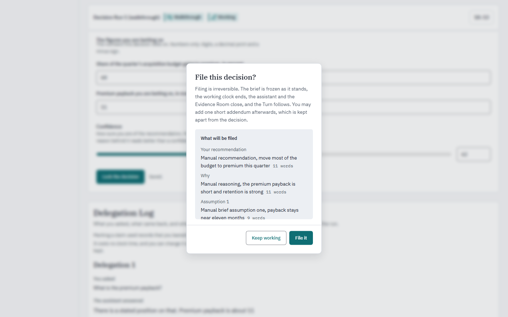

**The refusal you can meet.** If a claim you leaned on has no stance, nothing files. The dialog
changes to **A claim you leaned on has no stance** — "You leaned on this claim and you have not taken
a position on it. Take one, then file the decision." — showing the claim in the author's own words
under **The claim**, with two buttons: **Go to the claim**, which scrolls that card into view and
focuses it, and **Back to the brief**. Beneath: "The claim is in the Delegation Log, under the
request that raised it."

To clear it: press **Go to the claim**, choose one of the five stances on the card, and press **Lock
the decision** again. Nothing was written by the refusal and your brief is exactly as you left it.

A field that breaks a limit refuses the same way, under the title **One field is not ready** —
"Nothing was filed and nothing was lost. The field is marked in the brief behind this dialog, and the
rest is exactly as you left it." — with **Go to the field** and **Back to the brief**.

**Filing is irreversible.** The moment you press **File it**:

1. The brief is frozen exactly as it stands.
2. The working clock ends.
3. The assistant closes and the Evidence Room closes.
4. The Turn is scheduled, and you land on **Decision locked**.

If the clock reaches zero first, Tassl files the draft as it stands — empty fields recorded
empty, no validation, no refusal — and moves you on without your pressing anything. Running the clock
out is as final as pressing the button.

The screen you land on is **Decision locked**: "Your decision is filed and cannot be changed. The
next thing that happens is the Turn: a message from the world, arriving on its own." It holds a
countdown labeled **Time until the Turn** — plain, with no amber or red, because nothing is being
lost — under the panel **The Turn**: "A message from the world arrives shortly, and the run reopens
for 12 minutes so you can hold, revise or reverse. You do not need to do anything until then; this
page moves on by itself."

Below it, **The decision you filed** reads back everything, footed "Filed {when}", and **The frame
you locked** sits under that: "What you wrote before the assistant was in the room. It is here so the
decision above can be read beside the position you started from."

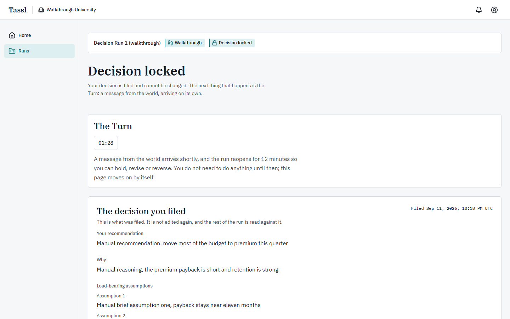

Nothing on this screen evaluates the decision. There is no mark, no summary and no edit control
anywhere on it.

### Adding an addendum

An addendum is one short note beside the filed decision — something you meant to say, or something
you noticed as the clock ended. The panel says what it is for: "One short note beside the filed
decision — something you meant to say, or something you noticed as the clock ended. Your instructor
reads it with the run. It is never folded into the decision itself, and you may add one."

**You can add one from the moment your decision is locked until the Turn is over** — that is, until
you file your Turn response or the Turn window closes. Outside that window the panel says "An
addendum can be added from the lock until the Turn is over. That window has closed."

To add it:

1. Press **Add an addendum**.
2. Read the dialog, titled **Add an addendum**: "Up to fifty words, added once. It sits beside the
   decision you filed and never becomes part of it; reviewers see it marked as an addendum, with the
   time you wrote it."
3. Write it in **Your addendum**, hinted "At most 50 words. You can add one addendum per run", with
   a counter reading "{n} of 50 words".
4. Press **Add it** (**Adding…**), or **Cancel**.

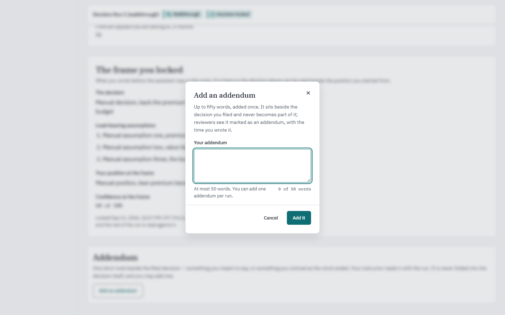

On success: "Added. It sits beside the decision and changes nothing about it." The button
disappears and the panel becomes **Your addendum**, holding the text, "Added {when}", and the line
"One addendum per run, and this run has its one. It is kept apart from the decision above."

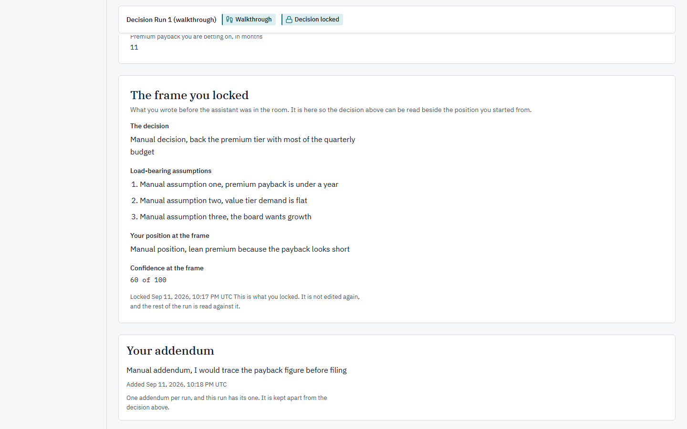

**What an addendum does not do.** It does not change the decision, it is never folded into it, and
it is not a second chance at the brief. Your instructor reads it beside the run, marked as an
addendum, with the time you wrote it. One per run, and it cannot be edited afterwards.

Refusals: "Write the addendum before adding it." · "This is over the limit. Cut it back to 50 words
to add it." · "This run already has its addendum." · "The addendum was not added. Try it again."

### The Turn

The Turn is a message from the world, arriving after you have already committed. It is the part of
the run that asks what you do when the ground moves.

It arrives on its own, a short while after your decision locks, and the **Decision locked** screen
opens it for you without your pressing anything. When it lands you hear "The Turn has arrived and
the window is open." and the run reopens for twelve minutes. The window clock sits in the band at
the top of every run screen, labeled **Turn window**, amber in the last five minutes and red in the
last one.

The screen is **The Turn**: "Something has arrived from the world since you filed. The run is open
again for the length of the window: work with it, then say what you are doing about the decision."

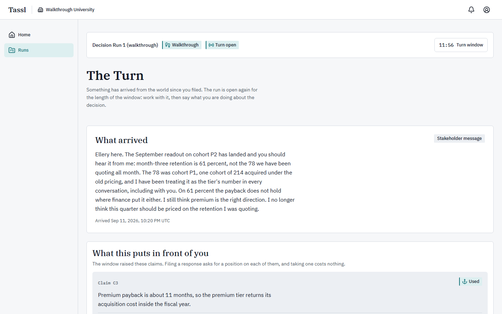

**What arrived.** The message itself, word for word, with a badge naming its kind — **Stakeholder
message**, **Corrected number**, **Supplier notice**, **Competitor move**, **Retracted source** or
**Regulatory note** — and "Arrived {when}". Nothing frames it, summarizes it, or tells you what it
means. Reading it is the work.


**What this puts in front of you.** "The window raised these claims. Filing a response asks for a
position on each of them, and taking one costs nothing." Under it sit claim cards with the full
instrument on them: the five stances, **Check it**, and **Escalate**. If the Turn raised none, the
panel says **The window raised no claims** — "Nothing on this Turn needs a position of its own. Read
it, use the room if you want it, and file your response."


Take a stance on each of them the same way you did before — press a chip. A claim you had already
taken a position on keeps it, and changing it says "Changed from {stance}."

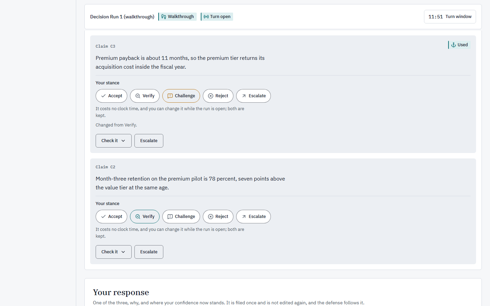

Beside the main column, under **What you can work with**, sits everything you can use: "The
assistant and the Evidence Room are open again until the window closes. Checks and escalations cost
window time exactly as they cost clock time before the lock." There you find **What you filed before
this arrived** (your locked frame and filed decision, unchangeable), the **Evidence Room**, the **AI
assistant**, and **Declare outside-tool use**.

**Your response.** "One of the three, why, and where your confidence now stands. It is filed once and
is not edited again, and the defense follows it."

Under the legend **What you are doing about the decision**, three choices, and none of them is chosen for you:

| Option | What it says |
|---|---|
| **Hold** | "The decision you filed stands as it is." |
| **Revise** | "The decision holds in direction, and something inside it changes." |
| **Reverse** | "The decision you filed no longer holds, and you are taking a different one." |

Nothing on the screen says which one the news calls for. All three are real answers; a hold with a
stated reason and a warranted revision are read the same way.

Then two required fields: **Why**, hinted "At most 150 words", with a counter; and **Confidence as a
number**, hinted "Where you stand now, 0 to 100", with the suffix "of 100" beside the box.

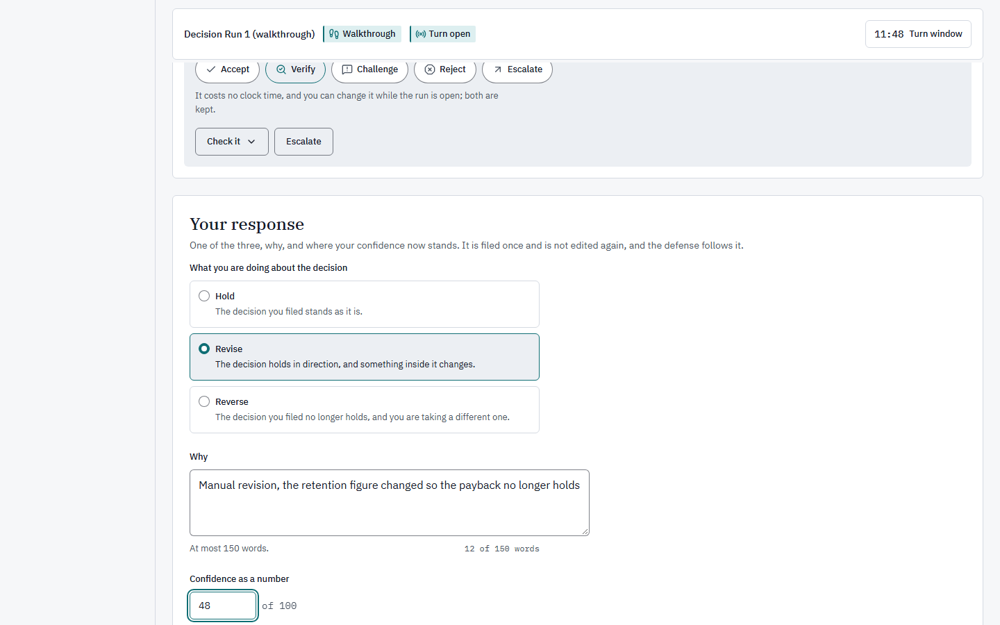

To file it:

1. Choose **Hold**, **Revise** or **Reverse**.
2. Write **Why** in at most 150 words.
3. Give your confidence, 0 to 100.
4. Press **File the response** (**Filing…**).

Beside the button: "If the window closes before you file, the decision you already filed stands and
the defense opens next."

Filing sends you straight to the defense. It is irreversible — the response is filed once and never
edited, the assistant and the Evidence Room close for good, and the addendum window closes with
them.

Refusals: "Choose one of the three." · "Say why. This is part of the response." · "This is over the
limit. Cut it back to 150 words to file it." · "A whole number from 0 to 100." · and, if a claim the
Turn raised has no stance, "A claim the Turn put in front of you has no stance yet: "{text}" Take
one on it and file again." with a **Go to the claim** button. Nothing is written by a refusal.

If the window closes with nothing filed, Tassl records a hold and moves on. Nothing is lost: the
decision you already filed stands.

If you type into the form and the page reloads, what you had typed comes back with the line "What you
had entered here was put back from this browser tab. It is kept there only, it is not filed, and it
goes when the tab closes."

### The defense

The defense is the closing interview, and it is unaided. The description says so: "Questions about
the run you just made. There is no assistant here and no Evidence Room: this is what you can say
about your own decision with your own work in front of you."

**There is no assistant on this screen.** No Evidence Room, no claim cards, no Delegation Log. What
you have is your own filed work, in the panel on the right.

There is no clock either: "There is no clock on this stage; nothing runs out and nothing is taken
away. Answer in your own words; "I do not know" is an answer, and so is leaving one empty."

You get six to nine questions, chosen for your run from what you actually did. Every one is
listed. Each is captioned **Question 1**, **Question 2** and so on, with the question as a heading. A
question can earn a **Follow-up**, nested under its parent and never numbered; nothing on screen says
why one was asked.

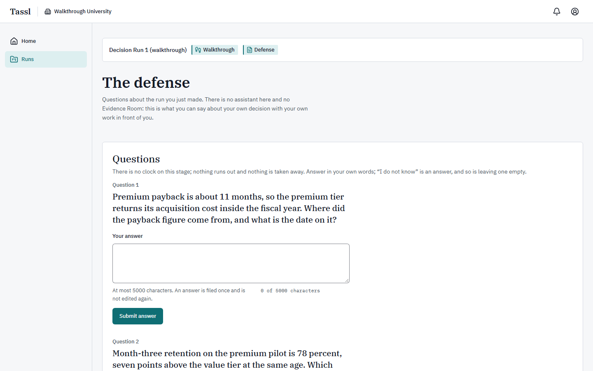

Only one question carries an answer box at a time — the first one with no answer yet. The field
is **Your answer**, hinted "At most 5000 characters. An answer is filed once and is not edited
again", with a counter.

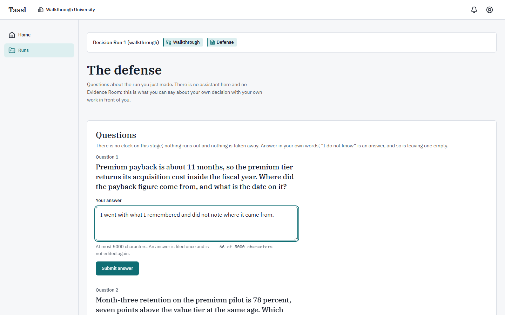

To answer:

1. Read the question.
2. Type your answer into **Your answer**.
3. Press **Submit answer** (**Submitting…**).

**Each answer is filed as you go.** Once submitted, it is quoted back under the question with
"Answered {when}" and the box moves to the next unanswered question. An answer is filed once and
never edited; a second attempt is refused with "That question has already been answered." A blank
answer is shown as "Nothing was written." — and it is a real, kept answer, not a gap.

If the answer earned a follow-up, the polite line reads "A follow-up was added under that question."
and the count in the footer grows with it.

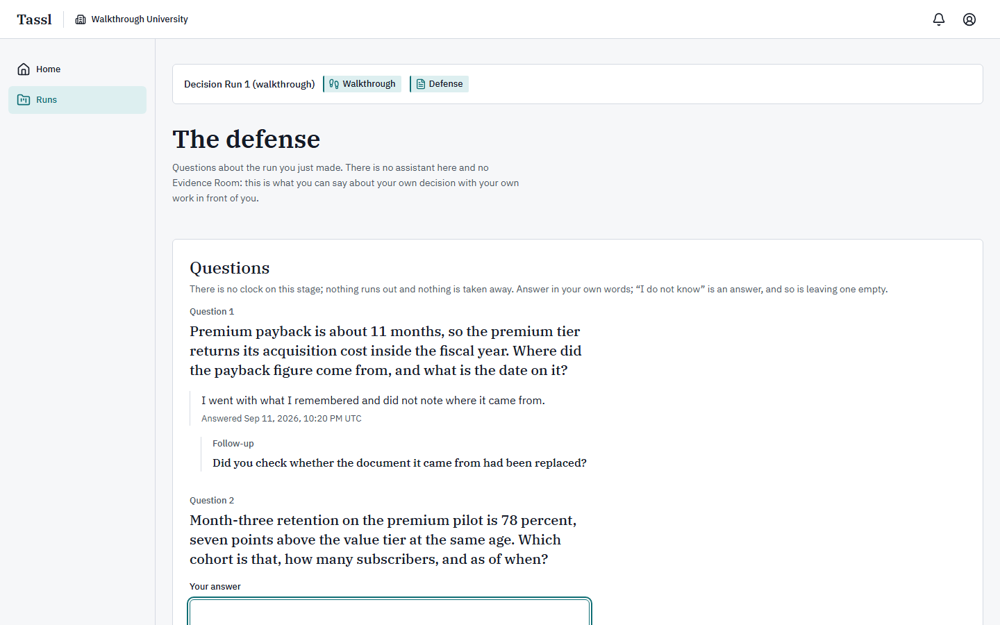

The footer bar carries **Finish the defense** beside "{n} of {total} answered". The button is
quiet while questions remain open and becomes the main action once everything is answered.

To finish:

1. Press **Finish the defense** (**Finishing…**).
2. Read the dialog, titled **Finish the defense?**. With everything answered it says: "The defense
   is filed once and is not reopened. Your run goes to scoring from here." With one question blank:
   "One question has no answer. Unanswered questions count as no answer, and are filed empty." With
   more: "{n} questions have no answer. Unanswered questions count as no answer, and are filed
   empty."
3. Press **Finish it**, or **Keep answering**.

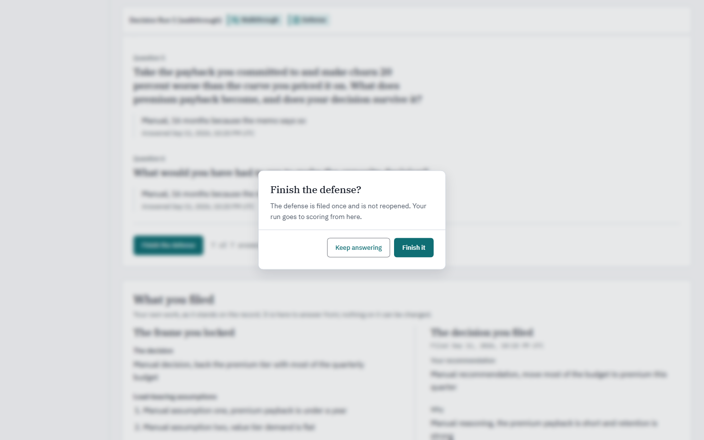

Finishing is irreversible. It files an empty answer on anything left unanswered, closes the defense
for good, and sends your run to scoring immediately. You land on the run status screen.

The panel on the right, **What you filed**, is there to answer from: "Your own work, as it stands on
the record. It is here to answer from; nothing on it can be changed." It holds your locked frame,
your filed decision brief, your addendum if you wrote one, and your Turn response — the category
word **Hold**, **Revise** or **Reverse**, then **Why**, **Confidence after the Turn** and "Filed
{when}". Nothing on it is marked or evaluated.

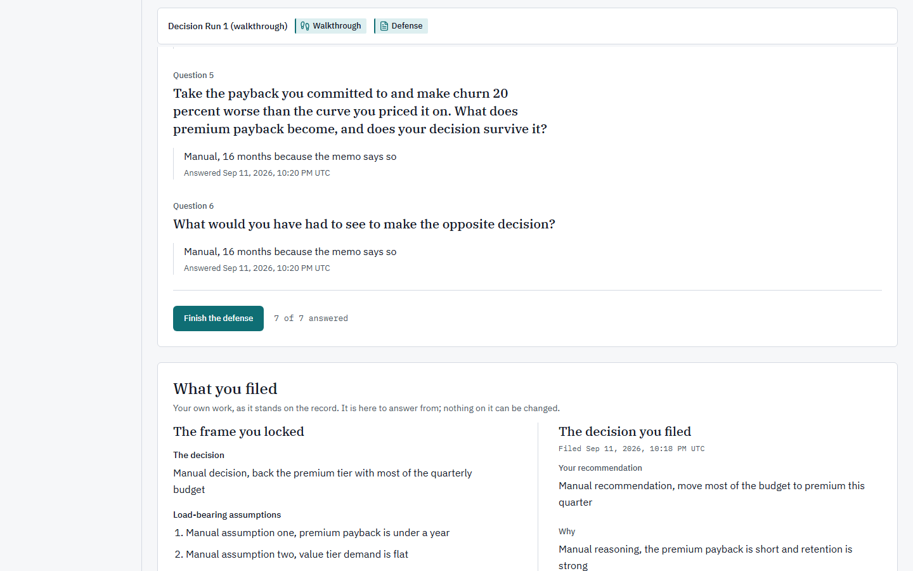

Refusals: "This is over the limit. Cut it back to 5000 characters to submit it." · "The answer was
not recorded. Try it again." · "The defense was not finished. Try it again." — and, if part of a
finish failed, "Some answers were filed before this stopped. Nothing you had already answered has
changed."

### Your result, your debrief and your Judgment Record

**While scoring runs.** The run status screen says **Your run is being scored** — "This takes a
moment. The page updates itself when your debrief is ready; you do not have to wait on it." There is
no progress bar, no estimate, no queue position and no number of any kind. The page changes by
itself when the bands are drafted.

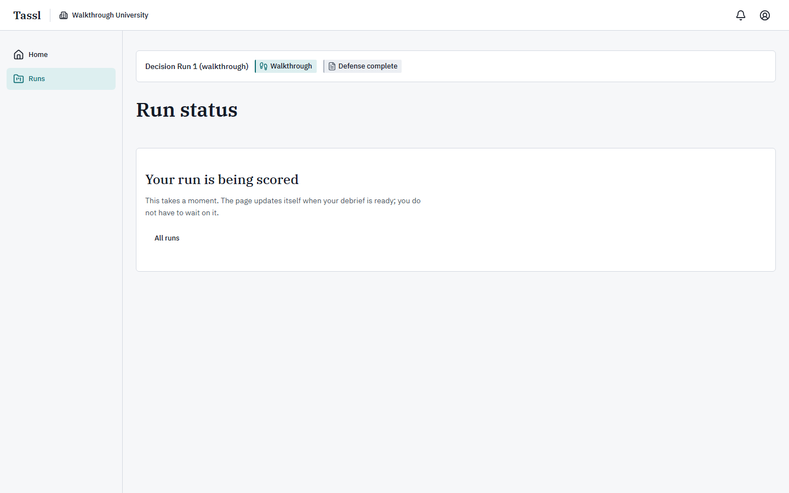

When they are, the screen becomes **Your debrief is ready** — "The bands in it are drafts until your
instructor confirms them, and each one is shown with the evidence it was read from." — with **Read
the debrief** and **All runs**.

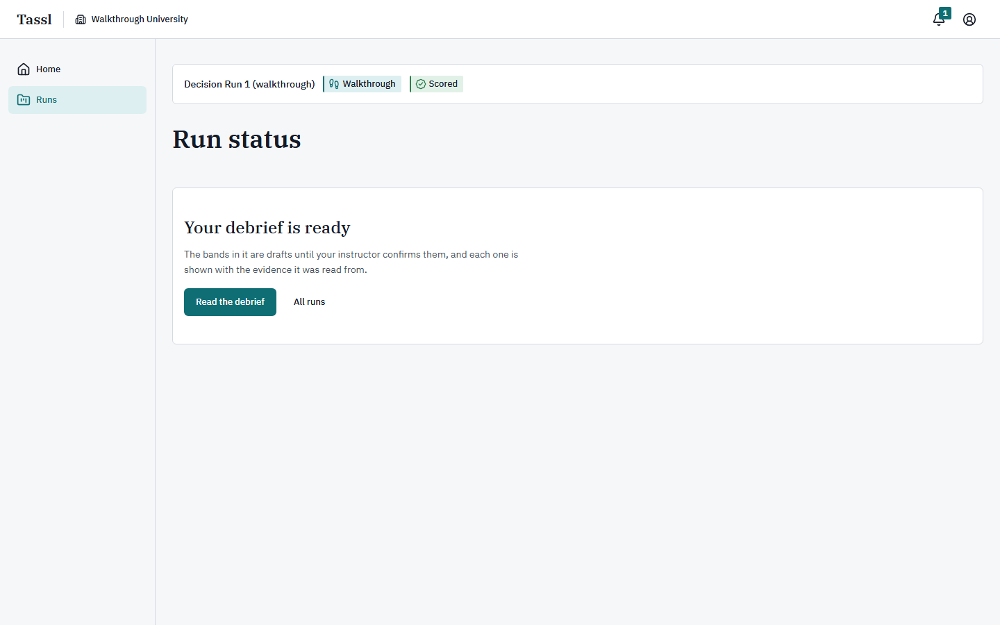

This one screen says whatever is true of your run at the time. Every message it can carry:

| Heading | What it says | When |
|---|---|---|
| **Your defense is in** | "Nothing more is asked of you. Scoring starts on its own and this page changes when it does." | The defense is finished and scoring has not begun |
| **Your run is being scored** | "This takes a moment. The page updates itself when your debrief is ready; you do not have to wait on it." | Scoring is running |
| **Your run is under review by your instructor** | "Something in this run needs a person to read it before the bands are set. Your instructor will confirm them; the debrief opens when they do." | Nothing could place the bands, so a person reads the run first |
| **Your debrief is ready** | "The bands in it are drafts until your instructor confirms them, and each one is shown with the evidence it was read from." | The seven bands are drafted |
| **Your instructor has confirmed the bands** | "The debrief now shows the confirmed bands and any note left with them." | Your instructor decided all seven |
| **Your Judgment Record is ready** | "The record holds the four graphs, the confirmed bands and the evidence behind them. It is yours to download." | You have filed the debrief's two answers |
| **This attempt was voided** | "A voided attempt is not scored and counts for nothing. If your instructor re-offers the assignment, the new attempt appears in your runs." | Your instructor ended the attempt |
| **This run has ended** | "It did not reach a debrief. Your instructor can say what happens next on this assignment." | The run stopped without a debrief |
| **This run is under appeal** | "Your instructor is looking at it again. Nothing is asked of you." | Your instructor reopened the reading |

This is also where you land, rather than on an error, if you open your debrief or your record before
they exist: the screen tells you what you are waiting for.

#### The debrief before your instructor has confirmed anything

**Run Debrief**: "Your run, walked in the order it happened: what you framed, what you did with every
claim, where the clock went, and where each of the seven dimensions sits."

At this stage it wears a **Draft** chip and says: "Every band below is a draft. Your instructor reads
the run and confirms or changes each one; when they do, this page shows what they decided in place of
the draft." Alongside it, always: "Every band in this build is a descriptive draft: the rubric has
not been calibrated against a pilot yet."

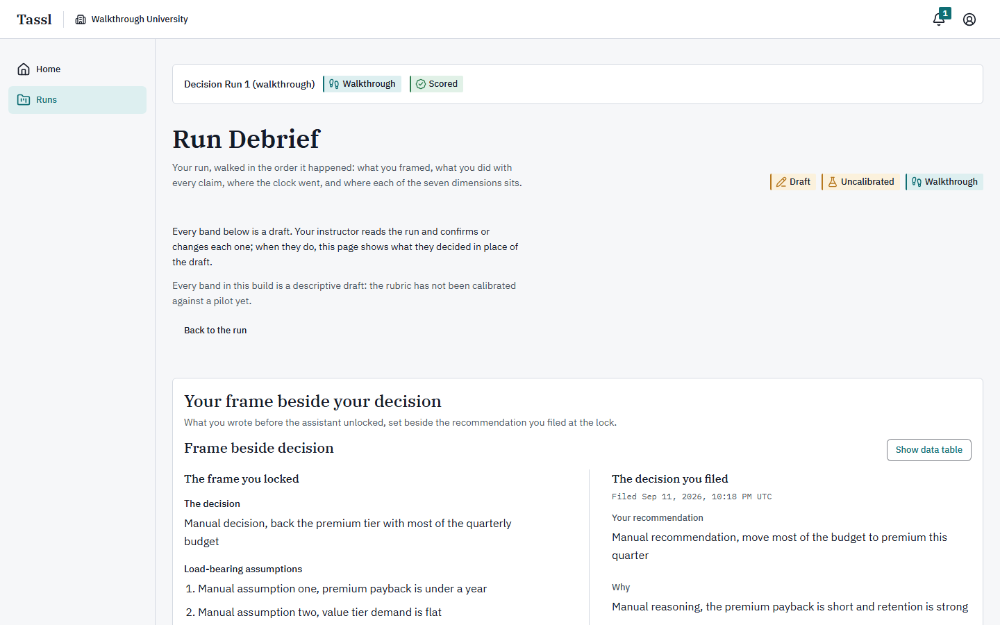

Twelve sections, in this order, always all twelve:

| Section | What it shows |
|---|---|
| **Your frame beside your decision** | The frame you locked set against the recommendation you filed |
| **Claim by claim** | Every consequential claim: the stance you took, the stance the material warranted, and the reason the author wrote for it |
| **Defects the decision rested on** | Any claim this reading of the scenario authored as defective that your filed decision still rested on, with the document behind it and the check that would have shown it |
| **Where the assistant changed its position** | The reversal, word for word, if the assistant reversed itself after you pushed back |
| **Your confidence through the run** | Your three confidence readings against how sound the claims under them were |
| **The Turn beside your frozen frame** | What arrived, which framed assumptions it disturbed, and the response you filed |
| **Where the clock went** | Reading, delegating and checking across the working clock, with every paused span credited back |
| **How this run could have gone** | Three sentences the author wrote about this scenario, the same for everyone |
| **The seven dimensions** | A band per dimension with the recorded reason it sits there |
| **What your course does with the bands** | Your course's mapping, this run's weight, and the arithmetic |
| **One thing this run did** | One sentence taken from the run's own record |
| **Two questions** | The two answers that close the run |

A section your run cannot support is never dropped. It is labeled **Not drawn for this run** with
the reason — for example "Your filed decision rested on no claim this variant authored as defective."
or "The assistant held its position throughout this run, so there is nothing to replay here."

In **Claim by claim**, each row names the claim, whether it was **Load-bearing** or **Supporting**,
**Your stance**, **Warranted**, and whether the two are **Same** or **Different**, followed by plain
sentences: "You took the stance Verify." · "You took the stance Challenge, having first taken
Verify." · "This claim never came up in your run." · "The material warranted Accept." · "Your filed
decision rested on this claim." · "You ran a Source Trace on this claim." — and then **What the
author wrote**, the author's own reasoning for why that stance was the right one.

**What your course does with the bands** is the money section: "Tassl places bands. Converting them
into gradebook points is your course’s arithmetic, under the mapping your instructor set." It shows
your course's mapping (**Band** / **Worth**), **What this run is worth in the course** as "{n}
percent of the course grade", and the arithmetic in words: "Each assessed dimension is worth what
the mapping gives its band. Those values are added and divided by {n}, the number of dimensions this
run was assessed on. A dimension recorded as unassessed is left out entirely and is never counted as
nothing."

Before confirmation the number is labeled **Provisional points, draft**, with the chip
**Provisional** and the caveat "Provisional and drawn from draft bands. No draft band reaches a
gradebook, and this number is in no export." After confirmation it becomes **Confirmed points** —
"Drawn from the bands your instructor confirmed, under your course’s mapping. This is the number your
course’s export carries."

Either way the section closes with: "Tassl holds no grade. Your instructor enters the bands, the
mapping and the points in the gradebook of record."

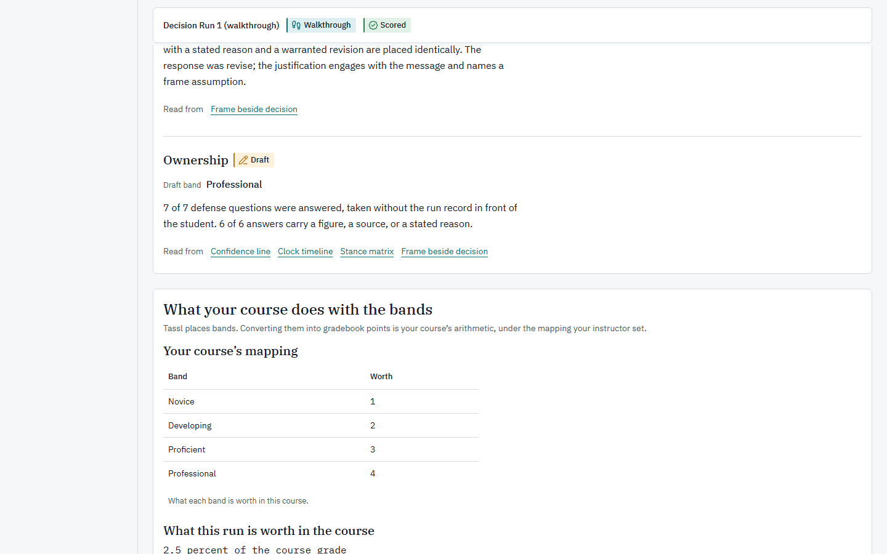

#### The debrief after your instructor has confirmed

The chip changes from **Draft** to **Confirmed** and the note becomes: "Your instructor has read this
run. Each band below is what they decided, with any note they wrote."

Each dimension now reads **Confirmed band {name}** with one of three sentences under it — "Your
instructor confirmed the draft." · "Your instructor decided this dimension differently." · "Your
instructor recorded this dimension as unassessed, so it is left out of the arithmetic." — and a box
headed **Your instructor wrote**, holding their note or the line "Your instructor wrote no note on
this dimension." A link to **Open the Judgment Record** appears at the top.

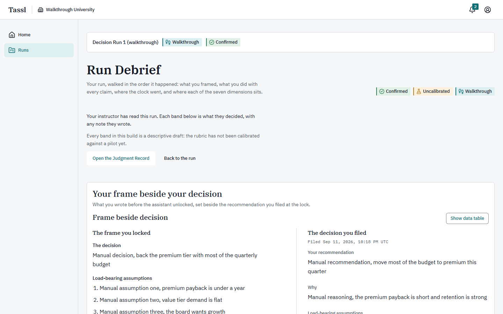

#### The two questions

The last section is **Two questions**: "Answering them closes the run. Nobody marks these answers;
they are yours, and your instructor can read them."

| Question | Limit |
|---|---|
| **Which single stance would you change, and to what?** | Up to 100 words |
| **What will you do differently in the next run like this?** | Up to 100 words |

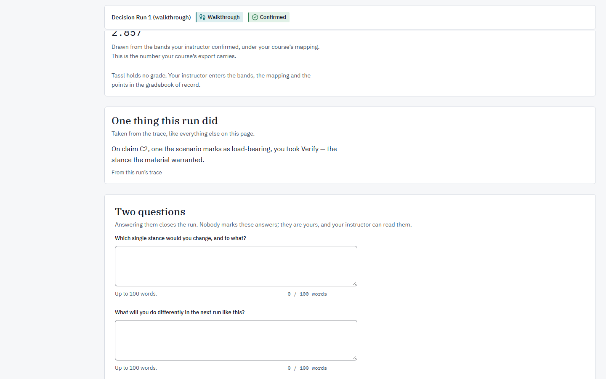

Both are required. The counter reads "{n} / 100 words"; over the limit it says "This answer runs past
100 words."; leaving either blank gives "Write something in both boxes before filing."

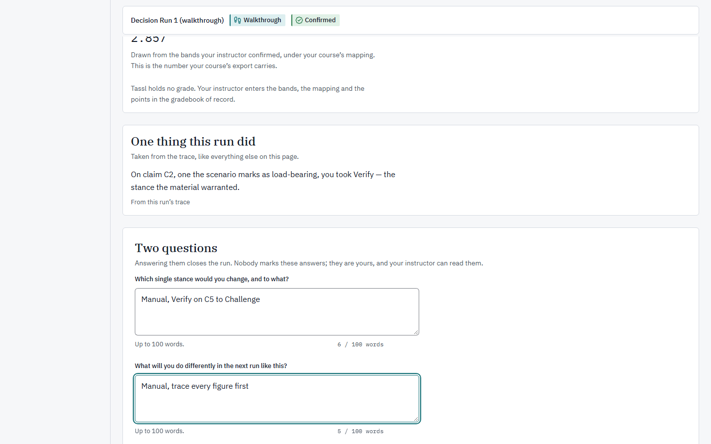

Press **File both answers** (**Filing…**). A toast reads "Both answers are filed." The two
questions are then shown as headings with your answers beneath, "Answered {when}", and the closing
line: "Both answers are filed and this run is closed. In this build there is no next run to unlock."
They are filed once; a second attempt is refused with "The two questions on this run have already
been answered."

Filing them on a confirmed run is what moves it to **Recorded** and opens your Judgment Record.

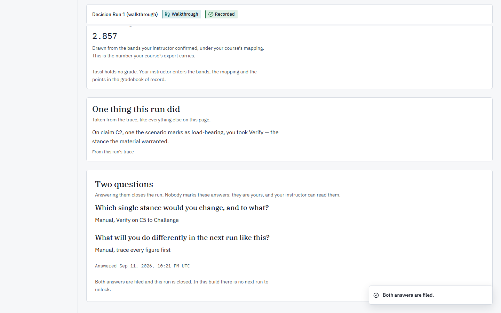

#### Your Judgment Record

**Judgment Record**: "What this run stands on: the four graphs plotted from its trace, the band your
instructor decided on each dimension, and the scenario it was taken under." It opens once your
instructor has confirmed the bands, and it is yours alone — no instructor reads this page.

The header carries **Uncalibrated**, a **Walkthrough** chip where it applies, "Bands confirmed
{when}", and, after a correction, "Adjusted after a correction {when}".

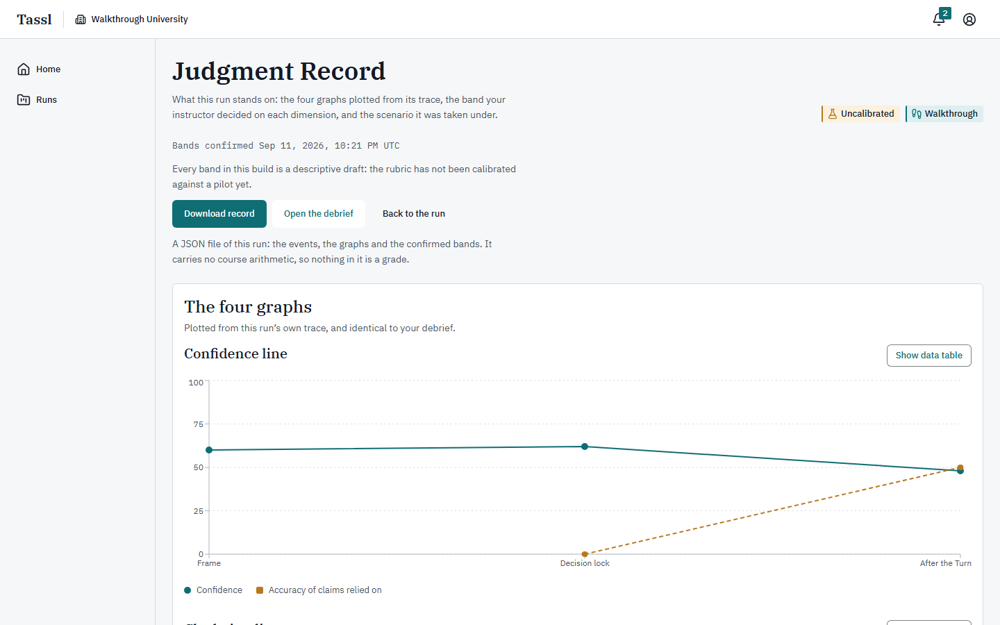

Three controls sit at the top: **Download record**, **Open the debrief** and **Back to the run**.

**Download record** gives you a JSON file of the run, named for the run. The note beneath says what
is in it: "A JSON file of this run: the events, the graphs and the confirmed bands. It carries no
course arithmetic, so nothing in it is a grade." That is exact — the record deliberately carries no
weight, no mapping and no points at any depth. The arithmetic lives on the debrief; the record is the
evidence.

**The four graphs** — "Plotted from this run’s own trace, and identical to your debrief." — are the
same **Confidence line**, **Clock timeline**, **Stance matrix** and **Frame beside decision** you
read in the debrief, each with its own description and its own **Show data table**.

**The seven dimensions** — "Each band is your instructor’s decision, with the recorded reason it sits
there and any note they wrote." — repeats the band cards in their confirmed form.

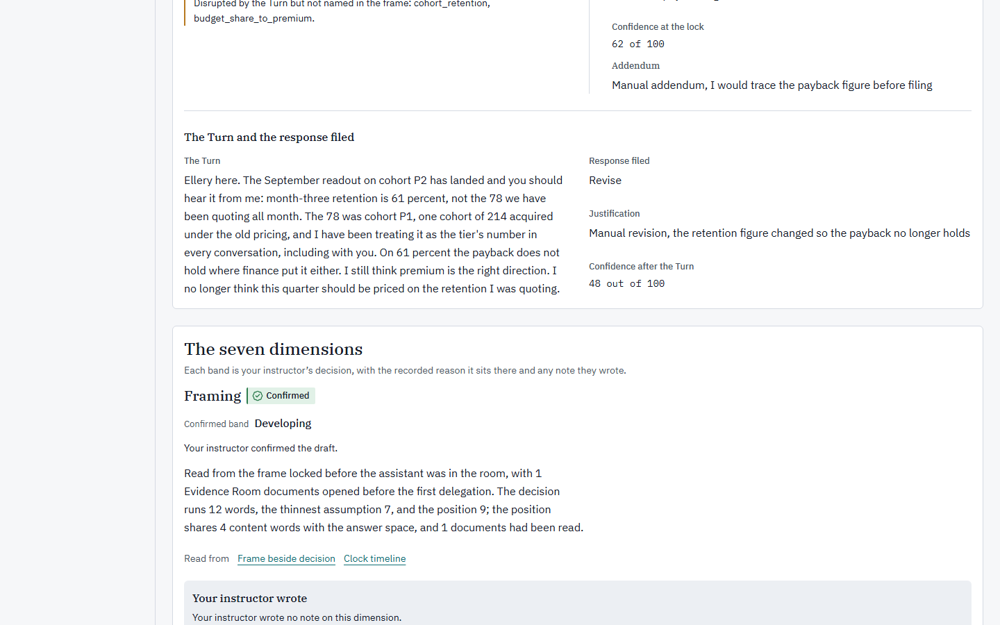

**How this run was set up** — "The mode it ran in and the variant of the scenario it drew." — gives
**Mode** (**Guided**, **Standard** or **Open**) and **Variant** (**Defective** or **Sound**).

**This is the first place you are told which reading of the scenario you took.** A defective variant
plants exactly one consequential claim that does not hold up; a sound one plants none. You could not
see it during the run, and you could not see it in the debrief's header; it is here, after everything
is decided, because knowing it earlier would have been the answer to the question the run was asking.


**Four-run trajectory** sits at the foot, inside a wrapper marked **Illustrative sample data**, and
carries this note: "These four runs are invented and describe no student, including you. They show
the shape a term of runs takes; Tassl plots one run at a time, and everything above this panel is
yours."

It is labeled illustrative because it is invented. The numbers in it were written to show what a
term of runs tends to look like — challenges landing more accurately, confidence coming down as
verification goes up — and they are not a projection of you, a comparison with your classmates, or a
target. Tassl plots one run at a time and holds no trajectory of anyone. Everything above that panel
is your own run; everything in it is a drawing.

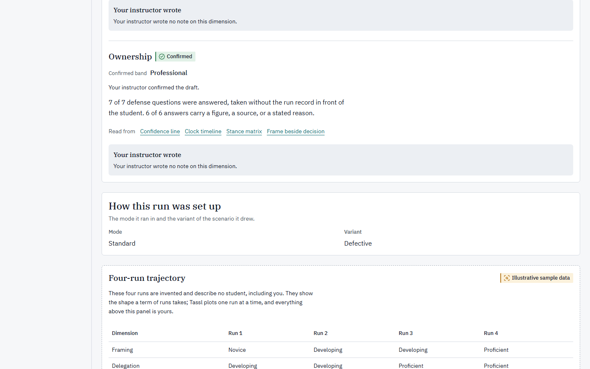

---

## 6. The AI assistant

The assistant is in the room with you from the moment you lock your frame until the moment you lock
your decision, and again for the length of the Turn window. Its panel is titled **AI assistant** and
described: "Ask for anything inside this scenario. Claims the assistant raises arrive as their own
cards, and every request is kept in the Delegation Log."

Before your frame is locked the panel is there but closed, saying: "The assistant unlocks the
moment you lock your frame. It stays locked until then so that the position you write is yours."

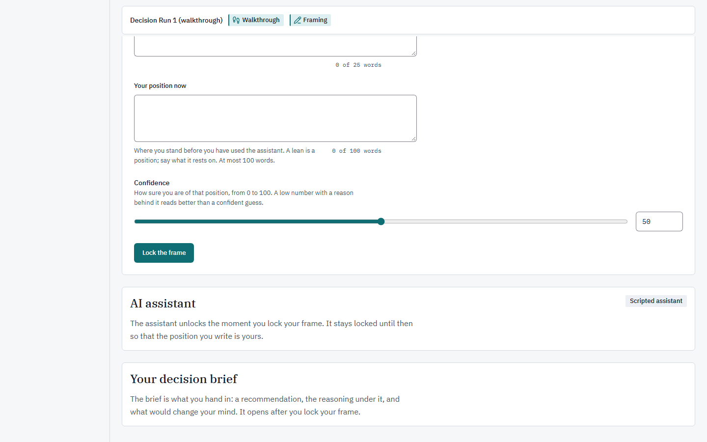

### What to ask it

Ask it anything inside the scenario, in your own words. It answers questions about the figures, the
documents, the positions people have taken, and your own decision brief. It answers whole questions
with whole answers and self-audit questions with an audit. It does not refuse things that belong in
the room, and it does not tell you how you ought to be working.

The field is **Your request**, hinted "Ask in your own words. Asking costs you no clock time. At
most 2000 characters. Ctrl or ⌘ with Enter sends it." with a counter reading "{n} of 2000
characters". The button is **Ask the assistant** (**Asking…**).

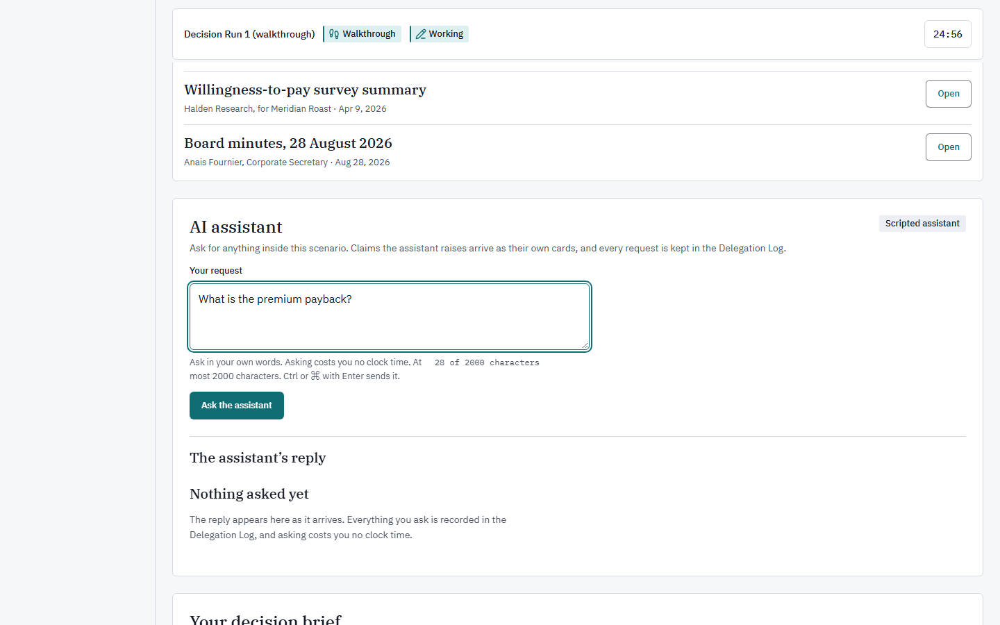

1. Type your request.
2. Press **Ask the assistant**, or hold Ctrl (⌘ on a Mac) and press Enter.
3. Read the reply as it arrives.

**Asking costs you no clock time.** Not a second, however long the reply is and however many
requests you make. The clock is spent by checks and escalations, never by asking. What you type stays
in the box until the reply finishes, so a failed request is not lost.

There is one limit: **ten requests a minute.** Past it you see "That is a lot of requests in a short
time. Try again in {n} seconds." — the run keeps going and nothing is paused.

### What it returns

A reply is the assistant's own prose with claim cards set in it. The status line says "The
assistant is answering…" while it streams, then "Reply complete. No claims surfaced.",
"Reply complete. One claim surfaced." or "Reply complete. {n} claims surfaced." Your own
request is echoed above the reply under **You asked**.

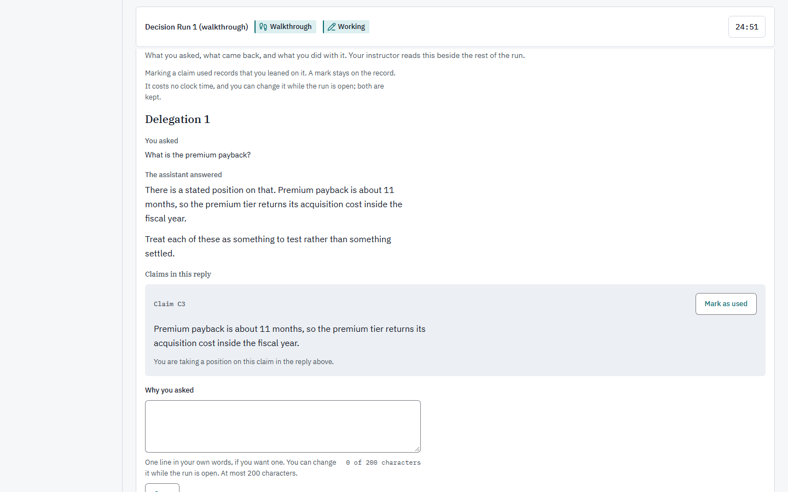

Before you ask anything: **Nothing asked yet** — "The reply appears here as it arrives. Everything
you ask is recorded in the Delegation Log, and asking costs you no clock time."

Which claims come up is decided by what you ask. Ask about one thing and one card arrives; ask about
three and three do.

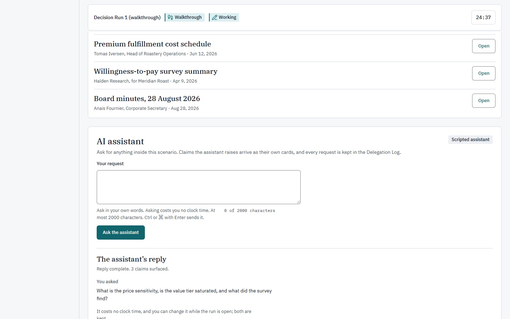

Every claim is carried word for word as the scenario's author wrote it. The assistant does not
compose them, cannot change them, and presents every one of them in the same voice. The prose around
them differs from run to run; the cards do not.

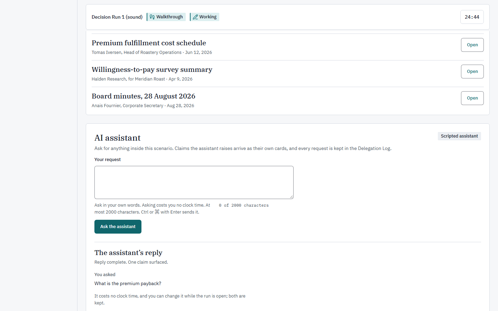

Sometimes a number in the assistant's own prose is wrapped in an amber mark. That means the figure is
not in any claim and not in any document you have opened. The line beneath the reply explains it:
"This figure is not in a claim or in a document you have opened. That says where it came from, not
whether it is right." It is a note about provenance, not about truth.

### Some claims are wrong on purpose

In some scenarios, one of the consequential claims does not hold up. It was written that way on
purpose, by the person who wrote the case.

**The assistant is never told which, and it never tells you.** It has no access to that mark at all,
so there is nothing for it to leak: it presents a claim that does not hold up in exactly the same
voice, at exactly the same length, with exactly the same closing offer to check, as one that does.
There is no hint to read in its wording, its hedging, or which claims it puts first.

The only way to tell is to do the work: trace the figure to its source, look at the date on it, check
whether a later document replaced it, recompute it, or escalate it to someone who can settle it. That
is what the run is asking you to do.

### What it refuses

The assistant will not do four things, and one of them is quiet.

1. **It never says whether a claim is reliable.** It will not call a claim sound, defective, stale,
   planted, correct or wrong, will not rank claims by how far they can be trusted, and will not say
   one is safer than another.
2. **It never discusses scoring.** Bands, levels, rubrics, grades and how the session is assessed do
   not exist in the room as far as it is concerned.
3. **It never invents a number, date or name.** Every figure, date and name it states is already in
   the claims, in the documents quoted to it, or in your own words.
4. **Anything that is not in the room, it leaves out.** Ask it for a grade, a ranking of the
   claims, or which claim is the planted one, and it answers whatever part of your request does
   belong in the scenario and writes nothing at all about the rest — it will not announce the
   refusal, name it, or repeat your words back. It looks like an answer to a shorter question. If
   none of your request belongs in the room, it says what it does have on file and offers to take a
   question about it.

The one refusal sentence you can actually read is "The assistant could not add commentary on this
request." It appears when the reply carried claims but no prose of the assistant's own. The claims
still arrive.

### When the assistant does not answer

If the provider fails, the run does not carry on without it. Your clock stops and a message that
cannot be dismissed covers the screen. There is no Escape, no click outside, and no close button —
the only way out is the button on it.

The title is **The run is paused**. The body is one cause sentence plus one fixed sentence:

| Cause sentence | When |
|---|---|
| **The assistant did not answer.** | The assistant failed to reply |
| **A document did not open.** | An Evidence Room document failed |
| **A check you asked for did not finish.** | A check failed |
| **The connection to Tassl dropped.** | The connection was lost |

Then, always: "Your clock stopped when it happened, and the time this pause takes is given back to
you when you resume. Nothing you have done is lost."

One button: **Resume the run** (**Resuming…**).

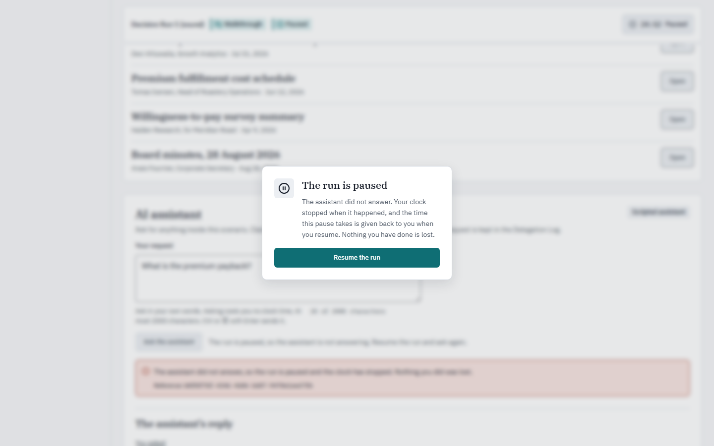

Inside the panel, the error alert reads "The assistant did not answer, so the run is paused and the
clock has stopped. Nothing you did was lost." If the failure was a spent usage limit rather than an
outage, the sentence is "The assistant is unavailable: usage limit reached. Your clock stopped, and
the run is paused."

While paused, the brief says "The brief cannot be written while the run is paused.", the log says
"The log cannot be written to while the run is paused.", the assistant says "The run is paused, so
the assistant is not answering. Resume the run and ask again.", and the Evidence Room says "A
document cannot be opened while the run is paused." above the line "The run is paused and the clock
is stopped. Nothing is lost; the room opens again when the run resumes."

**Your clock stops and the time is given back.** Press **Resume the run** and the whole span the
pause took is credited back to your working clock (or, inside the Turn window, the window's end is
pushed out by the same amount), plus the cost of whatever failed. You are not charged for a failure
on Tassl's side. The run picks up exactly where it was.

The failed request stays in the Delegation Log, marked: "No answer came back. The run paused, your
clock stopped, and the time was given back when you resumed."

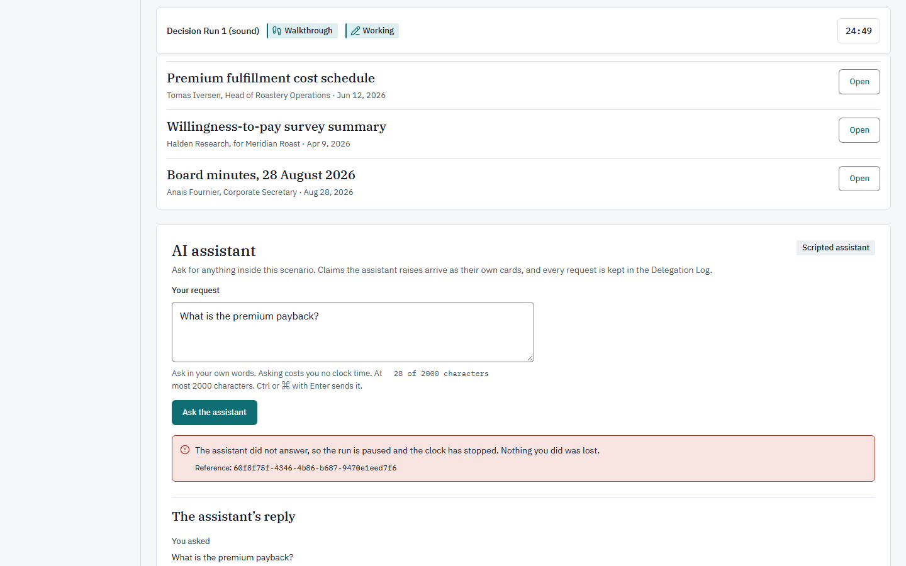

If resuming fails: "The run did not resume. Try it again."

Two other failures do not pause anything. A dropped connection mid-reply gives "The assistant did
not answer. Try the request again." — ask again. And a reply that comes back after your run has
moved on is discarded, with the line "No answer reached you. The run had moved on by the time the
assistant replied, so the reply was discarded and nothing from it was recorded against your run."

### The scripted assistant

A chip at the top of the panel always says which assistant you are talking to: **Live model** or
**Scripted assistant**. It is a plain fact about the installation, not a warning, and there is
nothing you can do about it from your side.

**Scripted assistant** means the replies are written by a built-in fixture rather than a language
model. It is used when an installation is running without a model provider, or when an operator
switches to it. Two things are worth knowing about it:

- **The product is whole either way.** Every screen, every control and every claim card is the same.
  The claim cards in particular are identical, because which claims come up is decided by the
  scenario's authored trigger phrases, not by the model.
- **Only the connective prose differs.** The scripted assistant writes one short lead-in per claim
  and one closing sentence, rotating through a small set of them, and it never writes a number of its
  own. Its replies arrive instantly; a live model takes a few seconds.

If a request matches nothing in the scenario, the scripted assistant says so plainly and tells you
what would let it answer — for example, "I have nothing on file for that request. The Evidence Room
is where the answer would be, and I can read from it if you tell me what you need."

---

## 7. Notifications, settings, and account

### The bell

Every signed-in screen carries a bell in the header. Its name is **Notifications: {n} unread**, or
**Notifications: No unread notifications** when nothing is waiting. The badge shows the number, and
99+ once the count passes ninety-nine. It re-reads the count once a minute while the tab is in
front of you, and immediately when you come back to it. Pressing it opens the notifications screen.

### The notifications screen

**Notifications**: "What Tassl has told you, newest first." Above the list is **Mark all read**,
which goes quiet when nothing is unread.

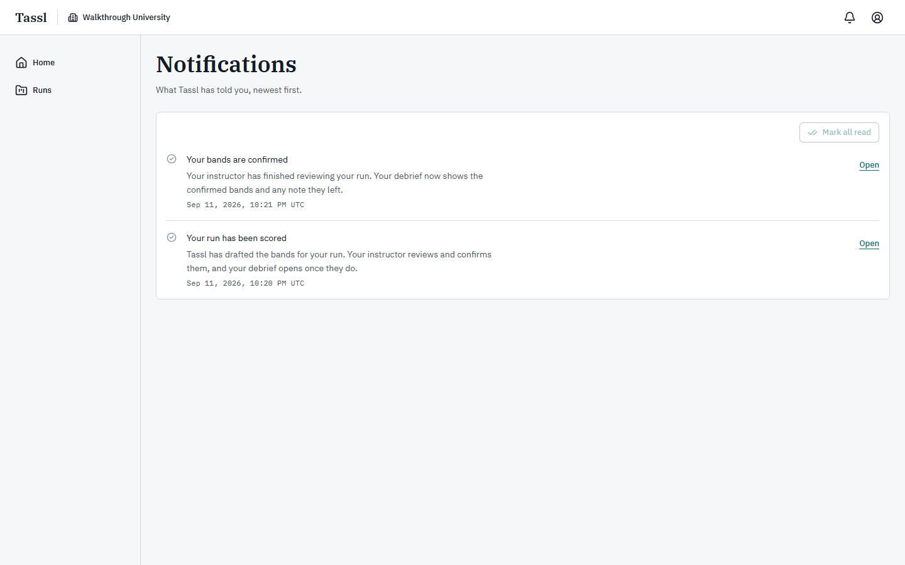

Each row shows the kind of notice, its title, its body, the time in UTC, and — when the notice points
somewhere — an **Open** link. An unread row is bolder, carries a colored rule down its left edge,
the word **Unread** for screen readers, and its own **Mark read** button.

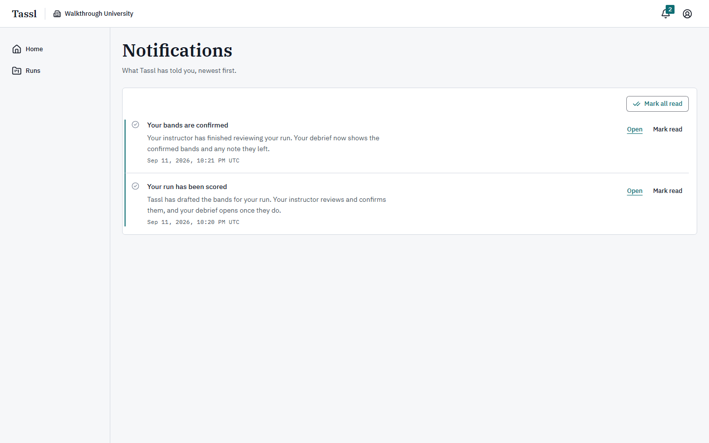

Three kinds of notification reach a student. The rest go to instructors and authors.

| Kind | Title | Body | What triggers it | Where **Open** goes |
|---|---|---|---|---|
| **Run scored** | **Your run has been scored** | "Tassl has drafted the bands for your run. Your instructor reviews and confirms them, and your debrief opens once they do." | Scoring finished on your run | The run status screen |
| **Bands confirmed** | **Your bands are confirmed** | "Your instructor has finished reviewing your run. Your debrief now shows the confirmed bands and any note they left." | Your instructor decided the last of the seven bands, the first time | Your debrief |
| **Invitation** | — | — | Declared in the product but never written today; invitations arrive by email only | — |

A run that is held for a person to read by hand sends you nothing at all, on purpose. What you see
instead is **Under review** on the run and the status screen's own sentence.

No notification ever carries a band, a placement, a count or a rate — they are also delivered by
email, and none of that belongs in an inbox.

A long list pages: **Show more notifications** at the foot adds the next notices to the same list.

To clear them: press **Mark read** on a row, or **Mark all read** above the list. A toast confirms:
"Everything is marked read." Marking read is not undoable and not important — nothing is deleted.

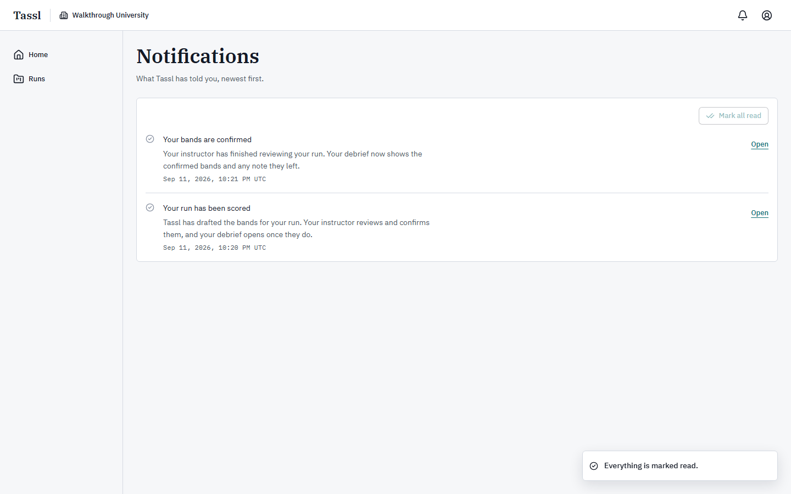

If nothing has ever arrived: **Nothing yet** — "Tassl writes here when a run is scored, a package
finishes generating, or an instructor confirms your bands."

Some notices are copied to you by email — the run-scored and bands-confirmed ones among them —
depending on how your installation is configured. **There is no per-person email setting.** The email
footer says so: the copies are switched on or off for the whole installation by whoever runs it, and
there is no unsubscribe link.

### Settings

Reach **Account settings** from the account menu → **Settings**. Three tabs, three real pages:
**Profile**, **Security**, **Data**. All three are headed "Your profile, your password and devices,
and your data."

**Profile** — "The name your instructors and classmates see beside your work."

| Control | What it does |
|---|---|
| **Your name** | Editable. Empty gives "Enter your name."; over 120 characters gives "Use 120 characters or fewer." |
| **Email address** | Shown, and disabled. The note reads: "Your institution knows you by this address, so it is not editable here. Ask your program lead if it needs to change." |
| **Save changes** | Saves the name. The toast reads "Your name is saved." |

There is no way to change your email address anywhere in Tassl.

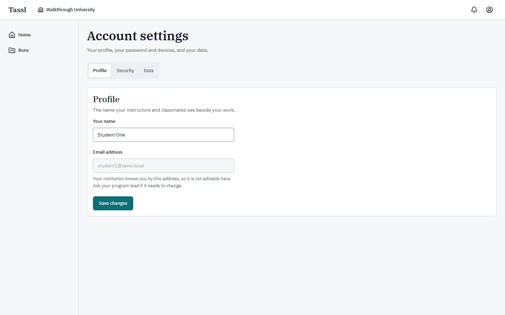

**Security** — two panels.

**Password**, described "Choosing a new password signs out every other device straight away." Fill in
**Current password**, **New password** and **New password again**, then press **Change password**.
The toast reads "Your password is changed. Other devices are signed out." The description is literal:
every other session ends, and the one you are using survives.

| Refusal | When |
|---|---|
| **That is not your current password.** | The first box is wrong |
| **Use between 12 and 128 characters.** | The new password is outside the range |
| **Both passwords must be the same.** | The two new boxes differ |
| **Too many attempts. Wait a minute and try again.** | Too many tries in a minute |

**Signed-in devices**, described "Every device holding a live session. Sign out any you do not
recognise." Each row names the browser and platform (**Chrome on Windows**, **Safari on macOS**, or
**Unknown device**), then the network address and "Signed in {when}". The row you are reading from
carries the badge **This device** and deliberately has no sign-out button — signing this device out
is the account menu's job. Every other row has **Sign out**, and below the list is **Sign out every
other device**. If nothing else is signed in, that button is replaced by "No other device is signed
in."

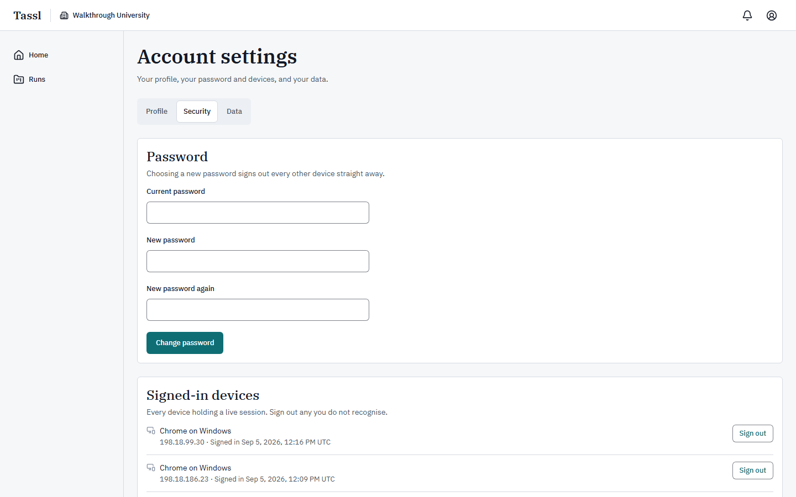

**Data** — two panels, the download offered first on purpose.

**Download my data** — "A JSON file holding your profile, your memberships, your runs, your
notifications, and the actions you took. Twice an hour." Press **Download my data** and the toast
reads "Your file is downloading." The limit is two downloads an hour; a third gives "You can download
your data twice an hour. Try again shortly."

One thing to know: your run content is not in that file yet. Each run's own record, with its full
event trace, downloads from the run's own record page with **Download record**, once its bands are
confirmed.

**Delete account** — "Your account closes immediately and is deleted 30 days later. Course records
keep a pseudonymous copy of your runs so your institution can keep its grades; that copy carries no
name and no email address."

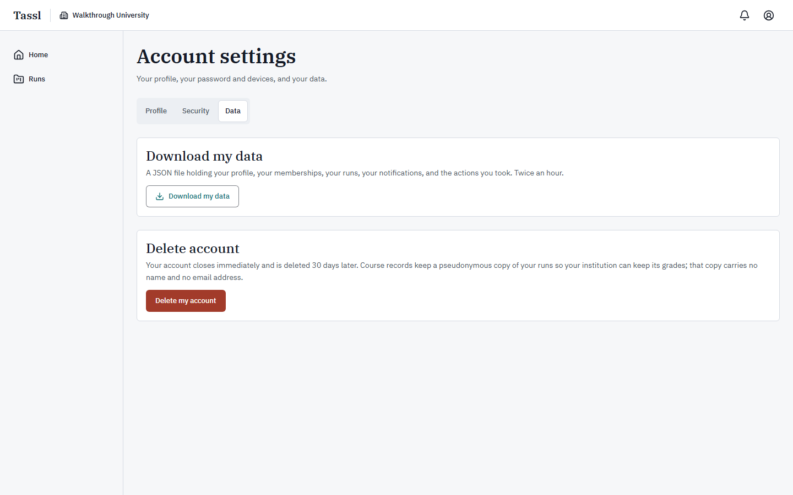

To close your account:

1. Press **Delete my account**.
2. Read the dialog, **Delete your account?**: "You are signed out straight away and cannot sign in
   again. After 30 days everything Tassl holds about you is deleted; the pseudonymous course record
   of your runs stays with your institution."
3. Type your own address into the field labeled **Type {your address} to confirm**. The confirm
   button stays disabled until it matches.
4. Press **Delete my account**, or **Keep my account** to stop.

Your account stops working at once, your memberships and any pending invitations go, you are signed
out everywhere, and thirty days later everything personal is removed. Your runs stay with the course
under a placeholder account so the course record survives with no name on it. If the delete fails:
"The account was not deleted. Try again."

### Signing out

Account menu → **Sign out**. The session ends and you land on the sign-in screen. If it fails, the
page stays and a toast reads "Signing out did not work. Try again."

---

## 8. Common situations

**I want to start my first run.** **Runs** → find the assignment → **Start** → read **Before you
begin** → **Begin the Readiness Check**.

**I want to get back into a run I left halfway.** **Runs** → the row for that assignment →
**Continue**. A run keeps its place; you return to the exact step you stopped at, and the working
clock is exactly where you left it.

**I want to read the documents before the clock starts.** **Runs** → **Continue** → **The scenario**
→ **Evidence Room** → **Open** on any document. Reading before you lock your frame costs nothing at
all. This is the only free reading time in the run.

**I want to change my mind about a claim.** On the claim's card, press a different stance chip. It
costs no clock time, the card says "Changed from {stance}.", and both readings stay on the
record.

**I want to know where a figure actually came from.** On the claim's card → **Check it** → **Source
Trace** (1 min) → read the **Document**, **Date**, **Author** and **Passage** → **Close**. The date
is usually the thing worth knowing.

**I want to ask someone who actually knows.** On the claim's card → **Escalate** → write one sentence
in **What you cannot settle** → **Send it**. Two per run, five minutes each.

**I used ChatGPT on my own laptop and want to say so.** **Declare outside-tool use** → **Declare
outside-tool use** → write what you used and what for → **Record it**. It never lowers a band or a
point.

**I want to file my decision.** **Your decision brief** → fill in every field and the figures you
are betting on → **Lock the decision** → read **What will be filed** → **File it**. It is
irreversible. If it refuses because a claim you leaned on has no stance, read the dialog **A claim
you leaned on has no stance** → **Go to the claim** → press one of the five stances → **Lock the
decision** again.

**I thought of something after I filed.** **Decision locked** → **Add an addendum** → up to fifty
words → **Add it**. One per run, and only until the Turn is over.

**The assistant stopped answering.** Read the overlay **The run is paused** → **Resume the run**.
Your clock was stopped when it happened and the time is credited back. Nothing is lost, and nothing
about it counts against you.

**I want to answer the Turn.** **Runs** → **Respond to the Turn** → take a stance on each claim the
window raised → choose **Hold**, **Revise** or **Reverse** → write **Why** → give your confidence →
**File the response**.

**I want to finish the defense.** **Runs** → **Defend the decision** → answer each question →
**Submit answer** → when you are done, **Finish the defense** → **Finish it**.

**I want to know how my run went, and to say so if I disagree with a band.** **Runs** → **Read the
debrief**, or the bell → the **Your run has been scored** notice → **Open**. Read **The seven
dimensions** and **Claim by claim** first. If a band reads wrong to you, read its recorded reason and
the note under **Your instructor wrote**, then talk to your instructor: every band is theirs to
change, and there is nothing in the product a person cannot overrule.

**I want to close the run and get my record.** Debrief → **Two questions** → answer both → **File
both answers**. The run becomes **Recorded** and the Judgment Record opens; from there,
**Runs** → **Open the Judgment Record** → **Download record** gives you the file of the run.

**I want to sign out a laptop I no longer use.** Account menu → **Settings** → **Security** →
**Signed-in devices** → **Sign out** on that row, or **Sign out every other device**.

---

## 9. Error messages and what they mean

### Signing in and your account

| Message | When it appears | Why | What to do |
|---|---|---|---|
| **That email address and password do not match an account.** | Signing in | Either the address or the password is wrong; Tassl does not say which | Check both and try again |
| **Enter a valid email address.** / **Enter your password.** / **Enter your name.** | Before a form is sent | A field is empty or malformed | Fill the marked field |
| **Use between 12 and 128 characters.** | Creating or changing a password | Outside the allowed length. There are no other composition rules | Choose a password in range |
| **Both passwords must be the same.** | Resetting or changing a password | The two new boxes differ | Retype the second |
| **Confirm your email address before you sign in.** | Signing in | Your address is not confirmed yet | Press **Resend verification** and open the link |
| **Too many attempts. Try again in {n} seconds.** | Signing in | Too many failed attempts on this account in a minute | Wait the stated time |
| **Too many attempts. Wait a minute and try again.** | Signing in | The same, when the wait is not given | Wait a minute |
| **Use 120 characters or fewer.** | Settings → **Profile** | The name is too long | Shorten it |
| **That link has expired or has already been used.** | Following a link | Confirmation links last 24 hours; reset links last one hour; both work once | Ask for a new one |
| **That did not work. Try again.** | Any auth action | Something else failed, including a lost connection | Try again |
| **Too many requests. Try again shortly.** | Any screen, after a burst of activity | Tassl caps how many requests one account makes in a minute | Wait a moment; nothing is lost |
| **That is not your current password.** | Changing a password | The current-password box is wrong | Retype it |
| **You can download your data twice an hour. Try again shortly.** | Settings → Data | A third download inside an hour | Wait |
| **Type the email address of this account to confirm.** | Deleting an account | The typed address does not match | Type your own address exactly |
| **This account no longer exists.** | Any signed-in action | The account has been closed | Sign in again, or ask your institution |
| **The account was not deleted. Try again.** | **Delete my account** | The request failed | Press it again |
| **Signing out did not work. Try again.** | Signing out | The request failed | Press **Sign out** again |

### Accepting an invitation

An institution adds you by an invitation email. The link can refuse in four ways.

| Message | When it appears | Why | What to do |
|---|---|---|---|
| **This invitation has expired or has already been used.** | Opening the link | Invitations last seven days and work once | Ask whoever invited you to send a new one |
| **This invitation no longer works** — "Invitations last seven days and work once. Ask whoever invited you to send a new one." | Opening a spent link | The same, as a whole page | **Go home**, and ask for a new invitation |
| **This invitation is for another address** | Opening the link while signed in as someone else | The invitation names one address | **Sign out and use another account**, then open the link again |
| **Confirm your email address before accepting this invitation.** | **Accept the invitation** | Your own address is not confirmed yet | Open the confirmation link first |
| **The invitation was not accepted. Try again.** | **Accept the invitation** | The request failed | Press it again |

### Starting and moving through a run

| Message | When it appears | Why | What to do |
|---|---|---|---|
| **You already have a run on this assignment.** | Pressing **Start** | One run per assignment | Press **Continue** on the existing row |
| **This assignment has not opened yet.** | Pressing **Start** | The assignment's opening time is in the future | The row shows **Opens {when}** |
| **Only a student on this assignment’s section can start a run.** | Pressing **Start** | You are not a student on that section | Ask your instructor to add you to the roster |
| **The run could not be started. Try again.** | Pressing **Start** | The request failed | Press it again |
| **The run could not be opened. Try again.** | **Begin the Readiness Check** | The request failed | Press it again |
| **This run has already moved past that step.** | Any run action | The run has moved on, usually in another tab | Reload; the run sends you where it now is |
| **That run no longer exists.** | Opening a run address | The run is not yours, or does not exist. The sentence is the same either way | Go back to **Runs** |
| **That assignment no longer exists.** | Opening a run on an assignment outside your institutions | The assignment is not one of yours | Go back to **Runs** |
| **This run is not in the workspace.** | Opening the scenario outside framing or working | The run has moved past the scenario, or has not reached it | The run sends you to the step you are on |
| **The Evidence Room is not open on this run yet.** | Opening a document too early | The room opens with the scenario | Continue the run from **Runs** |
| **The Readiness Check is not open on this run.** | Opening the check | It has not been reached, or it has closed | You land on the reading the check produced |
| **This run has not filed a decision yet.** | Opening the **Decision locked** screen early | Nothing is filed | Continue the run |
| **The Turn is not open on this run.** | Opening the Turn early or late | The window is not running | The run sends you where it now is |
| **Not found** — "There is nothing at this address. It may have moved, or the link may be wrong." | Any address your seat cannot reach | The page belongs to another seat | **Go home** |

### The Readiness Check

| Message | When it appears | Why | What to do |
|---|---|---|---|
| **That answer was not recorded. Choose it again.** | Choosing an option | The write failed; the previous answer is put back | Choose it again |
| **The check was not submitted. Try again.** | **Submit the check** | The submit failed | Try once more; then **Skip the check** appears |
| **The check was not skipped. Try again.** | **Skip the check** | The skip failed | Press it again |
| **The check can only be skipped after a submission has failed.** | **Skip the check** | The skip is only offered after a failure | Press **Submit the check** first |
| **The Readiness Check has closed.** | Answering after time | The eight minutes ran out and the check submitted itself | Nothing; the run opens the scenario |
| **This run’s scenario has no confirmed Readiness Check.** | Opening the check | The scenario carries no check | Tell your instructor; the run is not blocked |

### The scenario, the frame and the claims

| Message | When it appears | Why | What to do |
|---|---|---|---|
| **This is part of the frame. Write something in it.** | Locking the frame | A frame field is empty | Fill the marked field |
| **This is over the limit. Cut it back to {n} words to lock the frame.** | Locking the frame | A field is over its word limit | Cut it back |
| **Confidence is a whole number from 0 to 100.** | Frame or brief | The confidence value is not a whole number in range | Enter one |
| **The frame is not ready to lock.** | **Lock it** | A frame rule is broken; the field is marked behind the dialog | Fix the marked field |
| **The frame was not locked. Try again.** | **Lock it** | The request failed | Press **Lock the frame** again |
| **This run has already moved on. The screen is catching up.** | **Lock it** or **File it** | Another tab locked first | Let the page catch up |
| "The confirmation could not be loaded, so nothing was locked. Your frame is as you left it. Press “Lock the frame” again." | **Lock the frame** | The dialog failed to download. Nothing locks without it | Press the button again |
| **That document did not open. Try it again.** | **Open** in the Evidence Room | The request failed | Press **Open** again |
| **A document cannot be opened while the run is paused.** | **Open** while paused | The run is paused | **Resume the run** |
| "Tassl is no longer recording this reading." followed by the reason | A document is open and its reading stops being recorded | The reading record was lost | Close the document and open it again to start a new reading; the text stays readable |
| **That stance was not recorded. Try it again.** | Choosing a stance | The write failed | Press the chip again |
| **Stances are yours to set while the working clock runs.** | A stance after the lock | The claims closed with the decision | Nothing; the record stands |
| "Claims are yours to work on from the moment your frame is locked until you lock your decision, and again during the Turn." | Working a claim outside those windows | The claims are closed | Continue the run from **Runs** |
| **This claim does not offer that check. The ones it does offer are on the claim card.** | Running a check | The author wrote no result for that check | Use a check the card offers |
| **That check did not run. Try it again.** | Running a check | The request failed | Press **Check it** again |
| **The working clock has run out.** | Any timed act | There is no time left | Nothing; your decision files itself |
| **That claim has not come up in this run yet, so there is nothing to take a position on.** | Acting on a claim | The claim has not surfaced in your run | Nothing to do |
| **Write at least three words.** | Escalating | The sentence is too short | Rewrite it |
| **This is over the limit. Cut it back to 280 characters to send it.** | Escalating | The sentence is too long | Cut it back |
| **You have used both escalations in this run.** | Escalating | Both are spent. The dialog shows the same sentence in place of the remaining count | Nothing; two per run is the budget |
| **The escalation did not go through. Try it again.** | **Send it** | The request failed | Press **Send it** again |
| **That did not save. Try it again.** | **Why you asked** | The write failed | Press **Save** again |
| **The log cannot be written to while the run is paused.** | The log while paused | The run is paused | **Resume the run** |
| **Write what you used it for.** / **This is over the limit. Cut it back to 500 characters to record it.** / **That was not recorded. Try it again.** | Declaring outside-tool use | The field is empty, too long, or the write failed | Fix and press **Record it** |
| **The form could not be loaded. Close this and open it again.** | A form inside a dialog | The form did not download | Close the dialog and open it again |
| **The menu could not be loaded. Try again.** | **Check it** | The menu did not download | Press **Check it** again |
| **That could not be opened. Try the button again.** | Any button that opens a dialog | The dialog did not download | Press the button again |

### The assistant

| Message | When it appears | Why | What to do |
|---|---|---|---|
| **Write a request before sending it.** | **Ask the assistant** | The box is empty | Write something |
| **This is over the limit. Cut it back to 2000 characters to send it.** | **Ask the assistant** | The request is too long | Cut it back |
| **That is a lot of requests in a short time. Try again in {n} seconds.** | **Ask the assistant** | More than ten requests in a minute. Nothing pauses | Wait the stated seconds |
| **The assistant did not answer. Try the request again.** | Mid-reply | The connection dropped. What you typed is still in the box | Press **Ask the assistant** again |
| **The assistant did not answer, so the run is paused and the clock has stopped. Nothing you did was lost.** | A failed reply | The provider failed. Your clock is stopped | **Resume the run**; the time is credited back |
| **The assistant is unavailable: usage limit reached. Your clock stopped, and the run is paused.** | A failed reply | The installation's model usage limit is spent | **Resume the run** and tell your instructor |
| **The run is paused, so the assistant is not answering. Resume the run and ask again.** | Asking while paused | The run is paused | **Resume the run** |
| **The assistant unlocks when you lock your frame, and closes again when you lock your decision.** | Asking too early or too late | The assistant is only open between the two locks, and in the Turn window | Lock your frame first |
| **The assistant could not add commentary on this request.** | After a reply | The reply carried claims and no prose of the assistant's own | Read the claims; ask again differently |
| "No answer reached you. The run had moved on by the time the assistant replied, so the reply was discarded and nothing from it was recorded against your run." | In the log | The reply came back too late to be used | Nothing; nothing was recorded |
| **The assistant is temporarily unavailable.** | **Ask the assistant** | Too many model calls failed in a row, so Tassl stopped trying for a moment | Wait a moment and ask again |
| **The run did not resume. Try it again.** | **Resume the run** | The request failed | Press it again |

### Filing, the Turn and the defense

| Message | When it appears | Why | What to do |
|---|---|---|---|
| **This is part of the brief. Write something in it.** | **File it** | A brief field is empty | Fill the marked field |
| **This is over the limit. Cut it back to {n} words to file the decision.** | **File it** | A field is over its limit | Cut it back |
| **This field takes a number. Digits, a decimal point, a minus sign.** | **File it** | A named figure is not a number | Enter a number |
| **You leaned on a claim you have not taken a position on. Take one, then file the decision.** | **File it** | A claim you leaned on has no stance | **Go to the claim**, take one, file again |
| **The last change did not save. What is on screen is not lost; it saves again as you type.** | Writing the brief | An autosave failed | Keep typing |
| **The brief is not ready to file.** | **File it** | A brief rule is broken; the field is named behind the dialog | Press **Go to the field** and fix it |
| **The brief is yours to write while the working clock runs.** | Writing the brief before the frame is locked | The brief opens at the frame lock | Lock your frame first |
| **The decision was not filed. Try it again.** | **File it** | The request failed | Press **Lock the decision** again |
| "The confirmation could not be loaded, so nothing was filed. Your brief is as you left it. Press “Lock the decision” again." | **Lock the decision** | The dialog failed to download. Nothing files without it | Press the button again |
| **The brief cannot be written while the run is paused.** | Writing while paused | The run is paused | **Resume the run** |
| **Your decision is already filed, so the brief can no longer change.** | Writing after the lock | The decision is filed | Nothing; move on to the Turn |
| **An addendum can be added after the decision is locked and before the defense opens.** | **Add it** | Outside the addendum window | Nothing; the window has closed |
| **This run already has its addendum.** | **Add it** | One per run | Nothing; it is on the record |
| **Write the addendum before adding it.** / **This is over the limit. Cut it back to 50 words to add it.** | **Add it** | Empty or too long | Fix it |
| **An addendum is up to fifty words, and it cannot be empty.** | **Add it** | The addendum broke a rule the form did not catch | Fix it and press **Add it** again |
| "The addendum form could not be loaded, so nothing was added. Press “Add an addendum” again." | **Add an addendum** | The form failed to download | Press the button again |
| **Choose one of the three.** | **File the response** | No response chosen | Choose **Hold**, **Revise** or **Reverse** |
| **Say why. This is part of the response.** | **File the response** | The justification is empty | Write it |
| "A claim the Turn put in front of you has no stance yet: “{text}” Take one on it and file again." | **File the response** | A claim the window raised has no stance | **Go to the claim**, take one, file again |
| **The Turn window has closed.** | Acting after the window | The twelve minutes ran out | Nothing; the decision you filed stands |
| **The response was not filed. Try it again.** | **File the response** | The request failed | Press it again |
| "Choose hold, revise or reverse, say why in up to 150 words, and give your confidence." | **File the response** | The response broke a rule the form did not catch | Fix the marked field and file again |
| **This is over the limit. Cut it back to 5000 characters to submit it.** | **Submit answer** | The answer is too long | Cut it back |
| **That question has already been answered.** | **Submit answer** | An answer is filed once | Nothing; the answer stands |
| **The answer was not recorded. Try it again.** | **Submit answer** | The request failed | Press it again |
| **The defense was not finished. Try it again.** | **Finish it** | The request failed | Press **Finish the defense** again |
| **Some answers were filed before this stopped. Nothing you had already answered has changed.** | **Finish it** | The finish failed part way | Press **Finish the defense** again |

### After the run

| Message | When it appears | Why | What to do |
|---|---|---|---|
| **This run’s debrief opens once its bands have been drafted.** | Opening the debrief early | Scoring has not finished | You land on the run status screen, which says what you are waiting for |
| **This run’s record opens once its bands are confirmed.** | Opening the record early | Your instructor has not confirmed the bands | Wait; you are sent to the run status screen |
| **The two questions on this run have already been answered.** | **File both answers** | One set per run | Nothing; they stand |
| **Write something in both boxes before filing.** / **This answer runs past 100 words.** | **File both answers** | A box is empty or too long | Fix both boxes |
| **The two answers were not filed. Try again.** | **File both answers** | The request failed | Press it again |
| **That notification no longer exists.** | **Mark read** | The notice is gone | Reload the list |

### Empty states you may meet

| Where | What it says |
|---|---|
| Home, no assignments | **Nothing to do yet** — "When a course assigns you a run, or a run is waiting for your review, it appears here." |
| Home, no institution | **Waiting for an invitation** — "An institution adds you by an invitation email; once you accept it, your courses and runs appear here." |
| Runs, no institution | **Waiting for an invitation** — "Runs belong to a course at an institution. Once you accept an invitation, the assignments in your sections appear here." |
| Runs, no assignments | **No assignments yet** — with a paragraph explaining what a Decision Run is |
| A scenario with no brief | "This scenario has no brief." |
| A Readiness Check that read no ideas | "This check recorded no ideas to report. The scenario opens all the same." |
| Evidence Room, no documents | **Nothing to read here** — "This scenario carries no documents. The brief above is the whole of what you have been given." |
| Assistant, before the first request | **Nothing asked yet** |
| Delegation Log, before the first request | **Nothing delegated yet** |
| A reply that raised nothing | "No claim came back with this reply." |
| A claim with no checks | "This claim offers no checks." |
| A check with no author content | "The check returned nothing." |
| The Turn raised nothing | **The window raised no claims** — "Nothing on this Turn needs a position of its own. Read it, use the room if you want it, and file your response." |
| The defense has no questions | **There is nothing to answer** — "This run has no defense questions on it. Your instructor can say what happens next on this assignment." |
| A brief field the auto-lock left blank | "Left empty." and, for a figure, "No figure." |
| Nothing written in the brief at all | **Nothing was filed in the brief** — "The working clock ended before anything was written, so the decision was filed as it stood. The frame you locked is below." |
| A defense answer left blank | "Nothing was written." |
| A debrief section the run cannot support | **Not drawn for this run**, with the reason |
| A claim you never met | "This claim never came up in your run." |
| A claim you took no position on | "No stance was recorded on this claim." (**None recorded** in the short column) |
| A claim you ran no check on | "No interrogation action was run on this claim." |
| A claim the author wrote no reason for | "The author wrote no reason for this claim." |
| A dimension your instructor left a note off | "Your instructor wrote no note on this dimension." |
| A graph the trace cannot support | "This graph is not available for this run." with "Missing events: {kinds}." |
| A graph's data table with nothing in it | "This graph has no rows." |
| Notifications, nothing yet | **Nothing yet** — "Tassl writes here when a run is scored, a package finishes generating, or an instructor confirms your bands." |

### Two error pages

**Something went wrong** — "The problem has been recorded. If it continues, quote the reference
below." with a **Reference** in mono type and a **Try again** button. Quote that reference if you
report it. Where there is no reference to quote, the second sentence reads "The problem has been
recorded. Try again, or come back in a moment." instead. The header and the rail stay in place, so
**Home** and **Runs** still work.

**Not found** — "There is nothing at this address. It may have moved, or the link may be wrong." with
**Go home**.

---

## 10. Glossary

**Addendum** — One note of up to fifty words placed beside your filed decision, between the lock and
the end of the Turn. One per run, never folded into the decision.

**Assignment** — One section's pointer at one confirmed scenario, carrying the clock, the weight and
the opening time your run is taken under.

**Attempt** — Your numbered try at an assignment. A second attempt exists only when an instructor
voids the first and re-offers it.

**Band** — The placement one dimension holds: **Novice**, **Developing**, **Proficient**,
**Professional** or **Unassessed**.

**Check** — One of three authored checks you can run on a claim, each costing working-clock minutes:
**Source Trace** (1 min), **Replication Check** (3 min), **Decomposition Check** (4 min). The
debrief's graphs call one of these an interrogation action.

**Claim** — Something consequential the assistant states, carried word for word as the scenario's
author wrote it, that you must take a position on.

**Claim card** — The card one claim arrives on, holding its text, the five stances, and the check and
escalate controls, and saying nothing about the claim itself.

**Confidence** — A whole number from 0 to 100 that you give three times: at the frame, at the
decision lock, and after the Turn.

**Confirmed band** — The band your instructor decided on a dimension, with any note they wrote.

**Your decision brief** — What you hand in: a recommendation, the reasoning under it, three
load-bearing assumptions, what would change your mind, the figures you are betting on, and a
confidence.

**Decision Lock** — The irreversible filing of your brief. The clock ends, the assistant and the
Evidence Room close, and the Turn follows.

**Decision Run** — One consequential business decision taken with an AI assistant in the room, under
a clock you cannot pause.

**Defense** — The closing interview: six to nine typed questions about your run, with no assistant,
no Evidence Room and no clock.

**Delegation** — One request to the assistant and its reply, kept in the Delegation Log with the
claims it raised.

**Delegation Log** — The running record of what you asked, what came back, and what you did with
it. Your instructor reads the same record on their own screen, where the panel is titled
**Delegation log** with a small l; it is one record under two spellings.

**Dimension** — One of the seven aspects of judgment a run is read on: **Framing**, **Delegation**,
**Verification**, **Calibration**, **Decision Quality**, **Adaptation**, **Ownership**.

**Draft band** — The band Tassl placed from your run before your instructor decided anything.

**Evidence Room** — Every document in the scenario, all open in any order, with your reading recorded
and nothing inferred from it.

**The figures you are betting on** — The legend over the numbers your decision rests on, each
entered in the unit the scenario's author declared.

**Follow-up** — A second question added under a defense question. Nothing on screen says why it was
asked.

**Frame** — Your four-field position written before the assistant unlocks: the decision, three
load-bearing assumptions, where you stand, and how sure you are. Locked once, never edited.

**Hold** — The first answer to the Turn: the decision you filed stands as it is.

**Judgment Record** — Your own permanent artifact: the four graphs, the confirmed bands with their
reasons, the mode and the variant, downloadable as a file. It carries no points.

**Load-bearing assumption** — Something you are taking as true such that the decision would change if
it turned out to be false.

**Outside-tool declaration** — Your own statement of what you used outside Tassl and what for.
Recorded, never penalized, never detected.

**Paused** — What a failure on Tassl's side does to the run. The clock stops and the time is credited
back when you resume.

**Readiness Check** — Sixteen four-option questions in eight minutes, unscored, closing with a
reading of which ideas look solid and which look thin.

**Reverse** — The third answer to the Turn: the decision you filed no longer holds, and you are
taking a different one.

**Revise** — The second answer to the Turn: the decision holds in direction, and something inside it
changes.

**Run** — Your single attempt at one assignment, kept as a resumable record of everything you did.

**Run Debrief** — The twelve-section read-back of your run, in the order it happened.

**Scenario brief** — The authored document you read first, in the world's own voice.

**Stance** — Your position on one claim: **Accept**, **Verify**, **Challenge**, **Reject** or
**Escalate**. Free, and free to change while the run is open.

**The Turn** — A message from the world arriving after your decision is filed, reopening the run for
twelve minutes.

**Turn window** — The Turn's own twelve-minute clock, drawn in the same band as the working clock.

**Used** — Your own mark saying you leaned on a claim. A press, not a toggle, and it stays on the
record. A run records that you leaned on a claim three ways: this mark, typing the claim's figure
into one of the figures you are betting on, and the Turn window putting the claim in front of you.

**Variant** — Which reading of the scenario your run drew. **Defective** plants exactly one
consequential claim that does not hold up; **Sound** plants none. First disclosed on your Judgment
Record.

**Walkthrough** — A practice assignment. A run on it can be deleted outright; a run that counts is
voided instead.

**Warranted stance** — The stance the material actually deserved on a claim. Hidden until your run is
scored, then shown in the debrief beside your own.

**Weight** — What one run is worth as a percentage of the course grade.

**Working clock** — The countdown that starts when you lock your frame and ends when you lock your
decision. Checks and escalations spend it; asking the assistant does not.
