# Platform administrator manual

This file is for the person who runs the Tassl installation itself: the account that holds the
platform role **Platform admin**. After reading it you can find and change anyone's platform role,
read what this deployment is running with, switch the assistant between the live model and the
scripted one, prove that error reporting works, read how much the deployment has spent with a model
provider, and answer "who changed this, and when" from the audit log. You will also know, precisely,
the things this role cannot do — because it is deliberately not a master key over anyone's teaching.

If you have not met the product before, read [what Tassl is](00-what-tassl-is.md) first.

---

## 1. Who you are in Tassl

Tassl keeps three kinds of role, and they are independent of each other:

| Kind of role | What it is | Where it is set |
|---|---|---|
| Platform role | A right over Tassl itself. One value per account: **None**, **Scenario editor** or **Platform admin**. | The **Users** screen in the admin area |
| Institution role | A seat in one institution — student, instructor, teaching assistant, scenario author or program lead. | An invitation sent from an institution's section roster |
| Section role | A seat on one section of one course — student, instructor or teaching assistant. | That section's roster |

You hold the platform role **Platform admin**. In the seeded installation you hold no institution
role and no section role at all, and the header says so: it reads **No institution yet** where other
people see the name of their institution.

### You can

- Open the admin area and its three screens: **Users**, **Flags** and **Audit log**.
- See every account on the platform, search it by the start of an email address, and see when each
  account joined.
- Change any other account's platform role. Doing so signs that person out of every device at once
  and writes a row to the audit log.
- Read the deployment's flags, and the model provider the run loop would actually call right now.
- Switch **Assistant mode** between **Live model** and **Scripted assistant**. This is the only
  setting in the whole product that changes at once, without a redeploy.
- Send one test event to the error reporting service, to prove the connection from this deployment.
- Read how many model calls this deployment has made today and this month, how many tokens they
  used, and what they are estimated to have cost.
- Read the audit log for every institution on the platform, and filter it to one of them.
- Manage your own account: your name, your password, your signed-in devices, your data export and
  your account closure.

### You cannot

- Start, take, read or review a run — your own or anyone else's.
- Open a course, a section, a roster, an assignment or a review queue.
- Confirm, override or set a band unassessed; void a run; enter a correction; write or download a
  course export.
- Open a scenario package, a package version, or the seed record behind one.
- Confirm a scenario package version. Holding **any** platform role removes that right: only an
  account whose platform role is **None** may sign for a package.
- Invite anyone to an institution, or add anyone to a section roster.
- Change your **own** platform role. Another platform admin has to do it.
- Change **FEATURE_AI**, **FEATURE_SAMPLE_DATA**, **FEATURE_TEST_CONTROLS** or **DEMO_MODE** from
  this screen or any other. Those four come from the deployment's environment; changing one is a
  deploy.
- Edit or delete anything in the audit log. Nothing there can be changed once it is written.
- See a composite score, a rank or a percentile. None exists anywhere in Tassl, for anyone.

### How this role sits beside the others

Tassl separates the platform from the institutions that teach on it. A course, a run, a review
queue, a roster and a scenario package all belong to an institution, and the only way into one of
them is a seat in that institution. Being a platform admin does not create that seat and is not
accepted in place of it. The rule is deliberate: an operator who could read any student's run would
be an operator every institution had to trust with its students' work, and Tassl is built so that
they do not have to.

What you do hold is the layer underneath: who may do what to Tassl itself, what this deployment is
running with, which assistant answers, and the permanent record of every consequential act. Three
institution capabilities are open to you without a seat — creating an institution with its first
program lead, reading and writing an institution's settings, and reading and writing its data
agreements — and none of the three has a screen in this build. On this installation, an institution
is created for you before you sign in.

### What you meet when you open a page you are not allowed to open

There are two different answers, and the difference matters.

| Address you type | What answers |
|---|---|
| **Review**, and any single run, course, section roster, assignment, export history or scenario package version | The in-shell **Not found** page |
| **Courses**, **Packages**, **Runs** — the three list screens open to any signed-in account | The screen itself, drawing its own empty state |

**Review** is closed to you outright. Tassl does not tell you that a thing exists and is refused; it
tells you there is nothing there. The page header and the rail stay where they are, and the page
reads **Not found**, "There is nothing at this address. It may have moved, or the link may be
wrong.", with a **Go home** link.

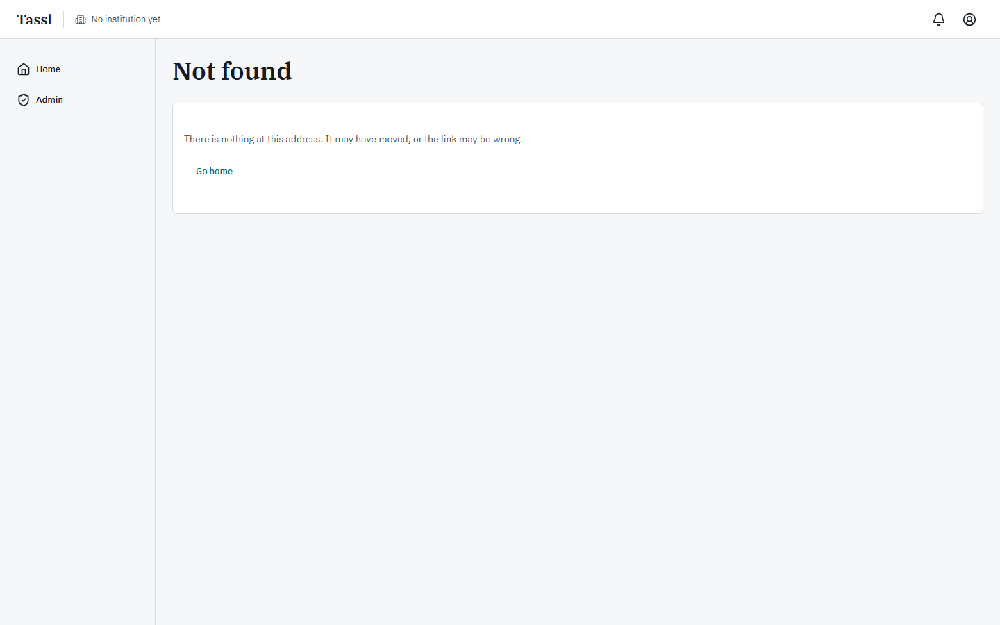

**Courses**, **Packages** and **Runs** answer differently, because they are open to any signed-in
account — they simply have nothing in them for someone who belongs to no institution. Each draws its
own empty state.

Courses reads **No institution yet**: "Courses belong to an institution. Once you accept an
invitation, the courses you teach appear here."

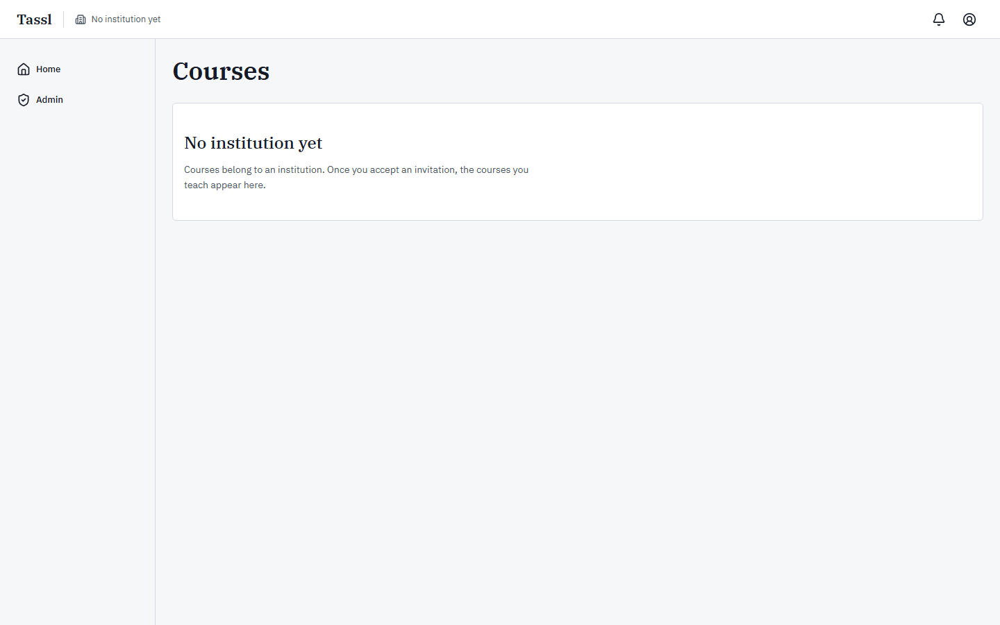

Packages reads **No institution yet**: "Packages belong to an institution. Once you accept an
invitation to one, the packages you may author appear here."

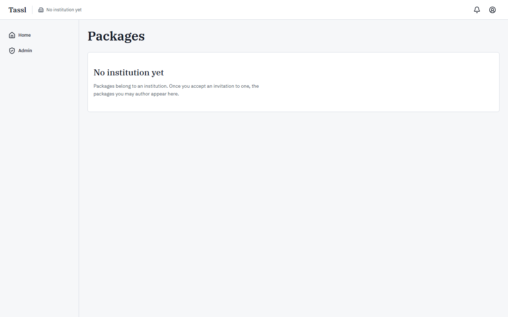

Runs reads **Waiting for an invitation**: "Runs belong to a course at an institution. Once you
accept an invitation, the assignments in your sections appear here."

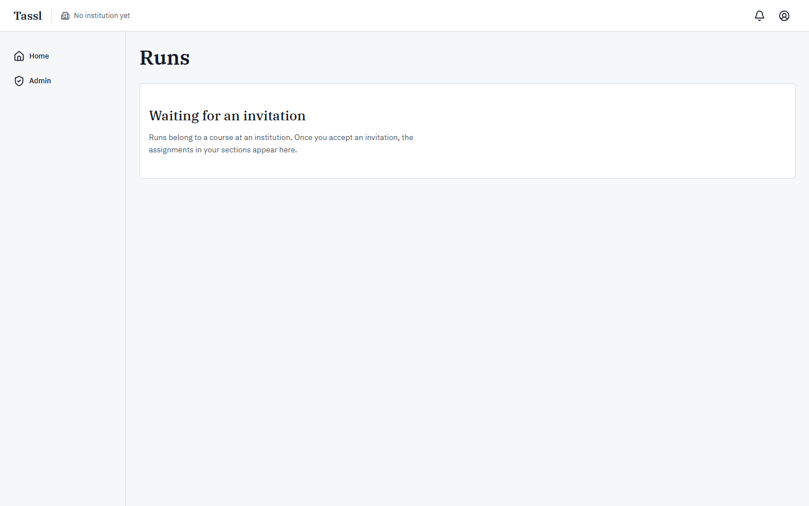

None of these three appears in your left rail, because the rail only offers what your seats allow.
You reach them only by typing the address. An account that did hold an institution seat as well as
the platform role would see real content on them; the platform role alone puts nothing there.

The polite empty state stops at the list. Type the address of one particular thing inside an
institution — a run, a course, a section roster, an assignment, an export history, or a scenario
package version — and you get **Not found**, with no explanation and no hint that the thing exists.
A package version is the one worth knowing by heart, because **Packages** was courteous and the
version behind it is not: the list says "Packages belong to an institution", the version says there
is nothing at this address at all.

The same rule runs the other way. If somebody who is not a platform admin types the address of any
admin screen, they get the same **Not found** page you see above. Hiding the **Admin** rail item
from them is only a courtesy; the refusal is made on the server, on every request, whether or not
the screen was ever drawn.

---

## 2. Signing in and your home screen

### Signing in

The sign-in screen, the sign-up screen, the password-reset screens and the confirmation screens are
the same for every role. They are described once, element by element, in
[the learner manual](02-learner.md).

In the demo installation you sign in as:

| Email | Name shown in the header |
|---|---|
| admin@tassl.local | Platform Admin |

The password is the one this installation was seeded with. Locally that is `Walkthrough-Pass-2026`.

### The home screen

Signing in lands you on **Home**.

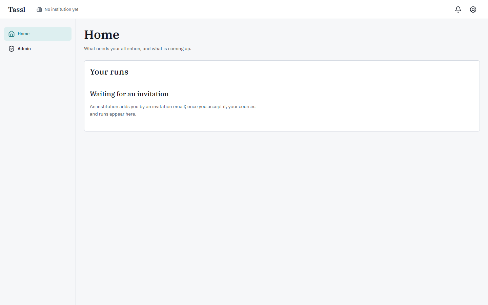

| Region | What it holds |
|---|---|
| The header bar | The **Tassl** wordmark on the left, which goes back to **Home**. Then the words **No institution yet**, which is a statement about your account and not a control. Then the notifications bell, whose accessible name is **Notifications: No unread notifications** while nothing is unread. Then the account button, whose accessible name is **Account: Platform Admin**. |
| The left rail | Two items only: **Home** and **Admin**. The rail's accessible name is **Primary**. |
| The page heading | **Home**, with the line "What needs your attention, and what is coming up." |
| **Your runs** | The one panel your account has. Because you belong to no institution, it draws its empty state: **Waiting for an invitation**, with "An institution adds you by an invitation email; once you accept it, your courses and runs appear here." |

Home is built out of one panel per seat, and it draws only the panels a seat has data behind. An
instructor sees a review panel and a courses panel here; you see neither, because you hold neither
seat. Nothing is missing or broken — there is simply nothing of yours to show, and Tassl draws no
empty box for a panel you have no claim on.

At a narrow window the same page stacks into one column and keeps everything: the header, the rail
items, the heading and the panel.

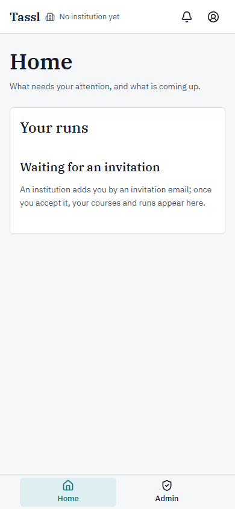

---

## 3. Navigation map

```
Header
├── Tassl (wordmark)            → Home
├── No institution yet          (a statement about your account; not a control)
├── Notifications (bell)        → Notifications
└── Account: Platform Admin     (menu)
    ├── Settings                → Account settings → Profile
    ├── Privacy                 → the privacy document
    ├── Terms                   → the terms document
    └── Sign out                → signs you out, lands on the sign-in screen

Primary (the left rail)
├── Home                        → Home
└── Admin                       → the admin area, landing on Users
    │
    └── Admin sections (the strip under the page heading)
        ├── Users               → Users
        ├── Flags               → Flags
        └── Audit log           → Audit log

Account settings sections (the strip under the settings heading)
├── Profile                     → your name and email address
├── Security                    → password and signed-in devices
└── Data                        → download your data, delete your account
```

| Destination | How you get there | Address in the browser | What it is |
|---|---|---|---|
| **Home** | Rail item, or the **Tassl** wordmark | `/home` | Your own landing page |
| **Admin** | Rail item | `/admin/users` | The admin area; the rail item stays highlighted on all three of its screens |
| **Users** | **Admin**, then the **Users** tab | `/admin/users` | Every account on the platform, and the control that sets a platform role |
| **Flags** | **Admin**, then the **Flags** tab | `/admin/flags` | What this deployment is running with, the assistant switch, the error-reporting test and the model spend |
| **Audit log** | **Admin**, then the **Audit log** tab | `/admin/audit` | One row for each consequential act, on every institution |
| **Notifications** | The bell in the header | `/notifications` | What Tassl has told you |
| **Account settings** | Account menu, then **Settings** | `/settings` | Profile, Security and Data |
| **Security** | Account settings, then the **Security** tab | `/settings/security` | Password, and every device holding a live session |
| **Data** | Account settings, then the **Data** tab | `/settings/data` | Download your data; close your account |
| **Privacy** / **Terms** | Account menu | `/privacy`, `/terms` | The two legal documents |

The three admin tabs are real links, not a tab widget: each has its own address, each can be
bookmarked, and the back button moves between them. The same is true of the three settings tabs.

---

## 4. Dashboards

You read numbers off three places: your home screen (which holds none), the flags screen read as a
status board, and the model-usage table.

### Home

Home carries no counts for this role. It has one panel, **Your runs**, and it is empty for the
reason given in section 2. There is nothing here to act on and nothing here that changes.

### The flags screen as a status board

The whole of **Flags** is a status board. Nothing on it except **Assistant mode** is a control; it
is there to be read, and to be read quickly, because the questions it answers are the ones asked
five minutes before a class.

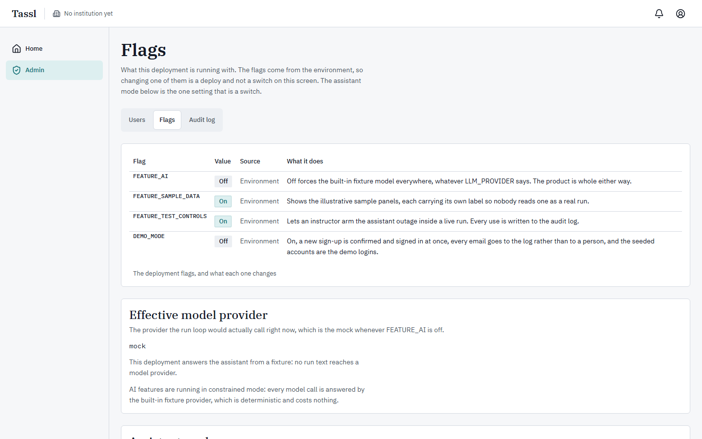

A deployment meant to run on the live model reads like this:

| What you read | Where on the screen | The healthy reading |
|---|---|---|
| **FEATURE_AI** | Row 1 of the flag table | **On** |
| **FEATURE_TEST_CONTROLS** | Row 3 of the flag table | **On**, if an instructor needs the armed-outage control during a class |
| **Effective model provider** | The panel under the table | A network provider — `openai-compatible` or `anthropic`, not `mock` |
| **Effective mode** | The line above the **Assistant mode** radios | **Live model** |
| **Estimated cost** and the month sentence | The **Model usage** table and the line under it | A share of the monthly budget well short of the whole |
| **Send a test event to Sentry** | The **Sentry** panel | Pressable, meaning an error-reporting address is configured |

A deployment running without a model key reads differently and is not broken: **FEATURE_AI** shows
**Off** and **Effective model provider** shows `mock`. The product is whole in that state. Every
screen behaves the same; the assistant's prose is written by the built-in fixture instead of a
model, and the students taking runs are never told that anything is different.

The screen captured above is exactly that case: **FEATURE_AI** is **Off**, the provider is `mock`,
and the provider panel carries the extra sentence "AI features are running in constrained mode:
every model call is answered by the built-in fixture provider, which is deterministic and costs
nothing." That sentence appears on this screen and nowhere else in Tassl. No student surface ever
says the assistant is degraded.

### The model-usage table

Three numbers, in two columns, and they are the deployment's real spend with a model provider.

| Row | What it counts |
|---|---|
| **Calls** | How many requests a model provider answered |
| **Tokens** | The input and output tokens of those calls, added together |
| **Estimated cost** | Those tokens priced at the rates this deployment is configured with |

| Column | The window it covers |
|---|---|
| **Today (UTC)** | From midnight UTC today. Not your local midnight — every time in Tassl is UTC |
| **This month** | From the first instant of this calendar month, UTC. Not a rolling thirty days |

A high monthly figure is only a problem against the budget, and the sentence under the table states
the budget in words, so the two can never disagree. A **Today (UTC)** figure of zero next to a large
monthly figure is normal: it means nothing has been asked of a model provider since midnight UTC,
not that anything has stopped. Section 5 explains every part of the table, including why calls the
built-in fixture answered are not in it.

### The audit log is a record, not a dashboard

The audit log counts nothing and totals nothing. It answers one question — what happened, when, to
what, by whom, in which request — and it answers it for every institution at once. Read it when you
need to establish a fact, not to watch a number.

---

## 5. Features

### The admin area

**What it is for.** Everything a platform administrator does lives here. It is three screens behind
one rail item.

**Where to find it.** The **Admin** item in the left rail. It is offered only to an account whose
platform role is **Platform admin**, and pressing it takes you to **Users**.

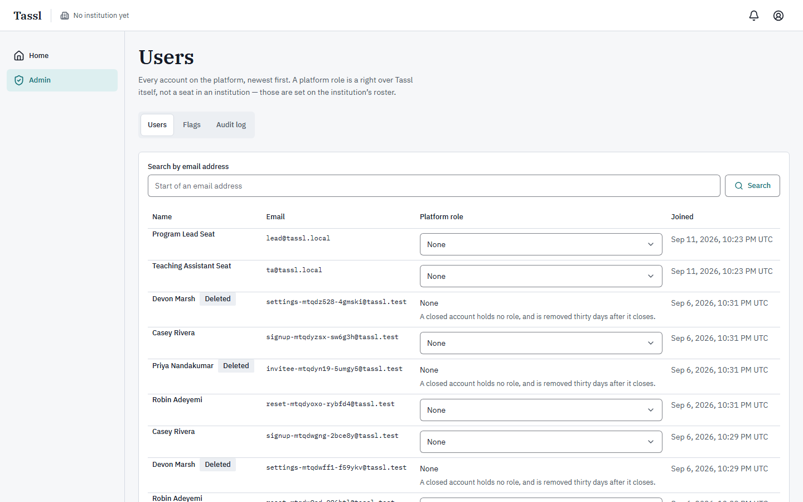

Under the page heading sits a strip of three links, whose accessible name is **Admin sections**:

| Tab | What is on it |
|---|---|
| **Users** | Every account on the platform, and the control that sets a platform role |
| **Flags** | What this deployment runs with, the assistant switch, the error-reporting test, the model spend |
| **Audit log** | One row for each consequential act |

The tab you are on is marked as the current page, so a screen reader announces which of the three
you are reading.

**What happens to anyone else.** Every other account — a student, an instructor, a teaching
assistant, a program lead, and a **Scenario editor** too — gets the **Not found** page shown in
section 1, inside the app shell, on all three addresses. They are not told that the admin area
exists and is refused to them. A visitor who is not signed in at all is sent to the sign-in screen
first, and returned to the address they asked for afterwards, where they then meet the same **Not
found** page unless they signed in as a platform admin.

There is no admin walkthrough guide. The two step-by-step guides cover the seats you cannot hold:
[the student guide](../guides/learner-guide.md) and
[the instructor guide](../guides/instructor-guide.md). What the accounts you promote go on to do is
described in [the scenario author manual](04-scenario-author.md) and
[the program lead manual](06-program-lead.md).

---

### Users

**What it is for.** Seeing who has an account, and setting what each account may do to Tassl itself.

**Where to find it.** **Admin** → **Users**.

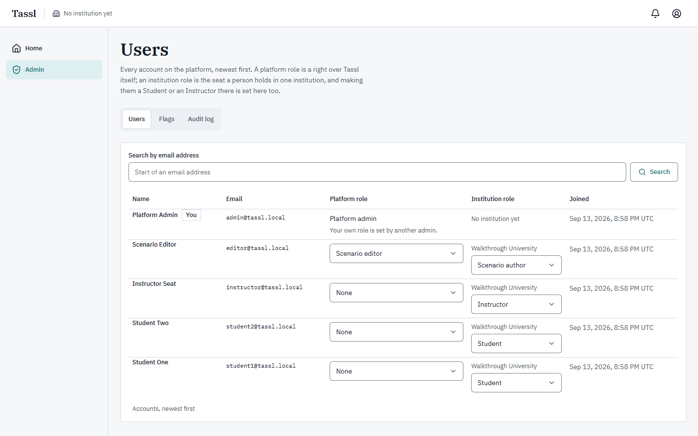

The heading is **Users** and the line under it states the rule the whole screen turns on: "Every
account on the platform, newest first. A platform role is a right over Tassl itself, not a seat in
an institution — those are set on the institution's roster."

#### The table

The caption reads **Accounts, newest first**. Twenty rows at a time, newest account first.

| Column | What the cell holds |
|---|---|
| **Name** | The name on the account. It is the row's heading, and it carries the row's chips. |
| **Email** | The address the account signs in with, in a monospace face so lookalike characters can be told apart. |
| **Platform role** | Either a dropdown holding the account's current role, or — on two kinds of row — the role as plain text with a note. |
| **Joined** | When the account was created, as `Sep 11, 2026, 10:23 PM UTC`. Every time in Tassl is UTC. |

Two chips can appear beside a name:

| Chip | When it appears |
|---|---|
| **Deleted** | The account has been closed. It is grey, not red: a closed account is a fact, not a fault. |
| **You** | The row is your own account. |

A closed account stays in the list. It shows the **Deleted** chip, its role as plain text, and no
control at all, with the note "A closed account holds no role, and is removed thirty days after it
closes." You cannot set a role on it; the thirty days is real, and after them the account row itself
is removed.

Your own row also shows its role as plain text and no control, with the note "Your own role is set
by another admin." This is not a display quirk. Changing your own platform role would sign you out
of the only seat that could change it back, so Tassl refuses the act and does not draw the control
that would attempt it.

#### The search

| Element | What it does |
|---|---|
| **Search by email address** | The box. Its placeholder reads "Start of an email address". |
| **Search** | Runs the search. |
| **Clear** | Goes back to the whole list. It appears only when the box has something in it. |

The match is on the **start** of the email address and nothing else. It ignores capitals, and a
`%` or an `_` typed into the box is matched as the character itself rather than as a wildcard. It
does not search names, and it does not match the middle of an address — which is exactly what the
capture below shows: a search for `tassl.local` finds nothing, because no address *starts* with it.

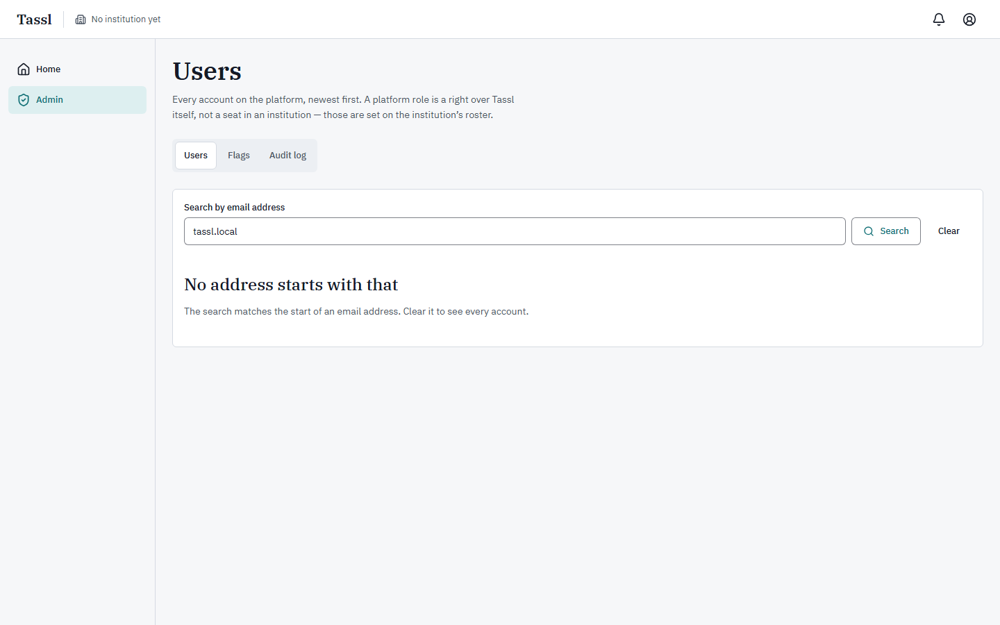

The empty result reads "No address starts with that", with "The search matches the start of an
email address. Clear it to see every account."

The search text stays in the address bar, so a filtered list can be bookmarked, reloaded and backed
out of like any other page. **Show more accounts**, at the foot of the table, adds the next twenty
rows and keeps the search you are in.

#### What a platform role is, and what each one lets someone do

A platform role is a right over Tassl itself. It grants nothing inside any institution: it does not
add a course, a section, a roster place or a run to anybody. There are three values.

| Role | What it lets the account do |
|---|---|
| **None** | Nothing at the platform layer. Everything the person can do comes from their institution and section seats. This is what every new account gets, and it is the **only** value that may confirm a scenario package version. |
| **Scenario editor** | Author scenario packages wherever the person also holds a scenario-author seat in an institution: build one from a seed case, import one, run generation, edit drafts, read the seed record. It opens no screen on its own, adds no rail item, and does not open the admin area. |
| **Platform admin** | The admin area and everything in this manual: platform roles, the flags screen and its one switch, the error-reporting test event, and the audit log for every institution. |

Two consequences are worth knowing before you change anything.

- **Giving somebody a platform role takes away their right to confirm a package version.** The
  account that signs for a scenario package must be **None**. Promote an instructor to **Scenario
  editor** or **Platform admin** and they can still write and generate packages, but the Confirm
  step closes to them. It is deliberate: nobody who works on Tassl can sign a package on a faculty
  member's behalf.
- **A platform role is not a seat.** Making somebody **Platform admin** does not let them into a
  course, a run or a review queue, and taking the role away does not remove them from one.

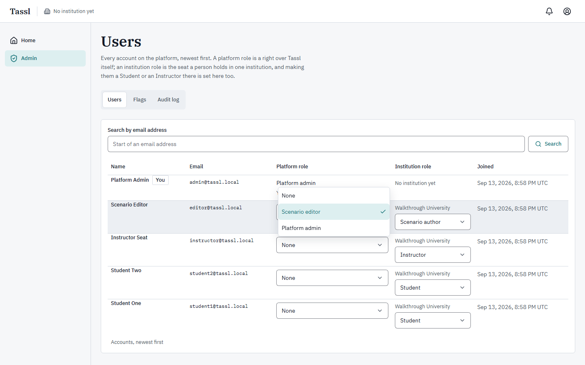

#### Changing someone's platform role

1. Find the account. Type the start of its email address into **Search by email address** and press
   **Search**, or press **Show more accounts** until the row appears.
2. Open the dropdown in that row's **Platform role** cell. Its accessible name is "Platform role
   for" followed by the account's name, so a screen reader says whose role is being changed. The
   three options are listed least-privileged first: **None**, **Scenario editor**, **Platform
   admin**.
3. Choose the new role. **Nothing is saved yet.** A dialog opens, titled "Change this platform
   role?", saying: the person "goes from" their current role "to" the chosen role "on the platform.
   This signs them out of every device straight away, and the change is written to the audit log
   with your name on it."
4. Press "Change the role" to make the change, or "Leave it as it is" to abandon it. While the
   change is saving, the dialog cannot be dismissed.

**What happens after.** The row updates where it stands — you keep your place in the list — and a
message confirms it: the person "is now" the new role "on the platform, and is signed out
everywhere."

Three things happen together, or not at all:

| What changes | Detail |
|---|---|
| The platform role | Set to the value you chose. |
| Every session that account holds | Deleted. They are signed out of every device immediately, not at the end of a session or after a cache expires. |
| The audit log | One new row, recording the change from the old role to the new one, and how many sessions were ended. |

**What the person on the other end sees.** Their next action finds them signed out, and they are
sent to the sign-in screen. Nothing tells them why, and nothing tells them who did it. When they
sign in again they hold the new role.

**What does not change.** Their institution memberships, their section rosters, their runs and their
courses are untouched. A platform role change moves no one in or out of a class.

**What other roles see change.** Nothing on any course, run or review screen. The only visible
effect elsewhere is what the person themselves can now reach: the **Admin** rail item appears for a
new **Platform admin**, and disappears from someone whose role you take away.

---

### Flags

**What it is for.** Answering "what is this deployment actually running with?" in one screen.

**Where to find it.** **Admin** → **Flags**.

The heading is **Flags**, and the line under it states the whole screen's terms: "What this
deployment is running with. The flags come from the environment, so changing one of them is a deploy
and not a switch on this screen. The assistant mode below is the one setting that is a switch."

#### The flag table


The caption reads **The deployment flags, and what each one changes**. Four columns — **Flag**,
**Value**, **Source**, **What it does** — and four rows. The **Value** cell is a badge reading
**On** or **Off**. The **Source** cell is the word **Environment** on every row, without exception.

| Flag | What it changes when it is **On** | What it changes when it is **Off** |
|---|---|---|
| **FEATURE_AI** | Model calls may go to the configured provider, subject to the assistant mode below and the token budgets. | The built-in fixture answers every model call, everywhere, whatever the deployment's configured provider says. The on-screen wording is: "Off forces the built-in fixture model everywhere, whatever LLM_PROVIDER says. The product is whole either way." |
| **FEATURE_SAMPLE_DATA** | The illustrative sample panels are shown, each carrying its own label "so nobody reads one as a real run". | Those panels are absent. |
| **FEATURE_TEST_CONTROLS** | An instructor can arm a single assistant outage inside a student's live run, for the walkthrough. "Every use is written to the audit log." | The control is refused. An instructor who presses it is told "Test controls are switched off in this environment, so nothing was armed." |
| **DEMO_MODE** | "On, a new sign-up is confirmed and signed in at once, every email goes to the log rather than to a person, and the seeded accounts are the demo logins." | Sign-up sends a confirmation email and the address must be confirmed before the person can sign in; email is delivered for real. |

#### "From the environment" — what that means for you

These four values are set where the application is deployed, not in the application. There is no
control on this screen, and there is none on any other. To change one of them, somebody with access
to the hosting environment changes the value there and redeploys the app; the new value is what this
table shows afterwards.

Practically: **changing a flag is a deploy, and it takes minutes.** If you need the assistant off
*now*, do not go looking for a flag — use **Assistant mode** below, which takes effect on the next
request with no deploy at all.

#### Effective model provider


The panel **Effective model provider** answers a question the flag table alone cannot: "The provider
the run loop would actually call right now, which is the mock whenever FEATURE_AI is off." The value
under it is one word, in a monospace face:

| Value | What it means |
|---|---|
| `mock` | The built-in fixture answers. The panel adds: "This deployment answers the assistant from a fixture: no run text reaches a model provider." |
| `openai-compatible` | The network model this deployment is configured with answers. This is the normal reading for a deployment running on the live model. |
| `anthropic` | The Anthropic model this deployment is configured with answers. It is the fallback provider of the two network ones. |

One more sentence appears here, and only when **FEATURE_AI** is **Off**: "AI features are running in
constrained mode: every model call is answered by the built-in fixture provider, which is
deterministic and costs nothing." The two sentences answer different questions on purpose — the
first follows the provider, the second follows the flag — so a deployment configured for the fixture
while the flag is on shows the first and not the second.

---

### Assistant mode

**What it is for.** Changing which assistant answers students, right now, without a deploy. It is
the one control on the flags screen and the only runtime setting in the product.

**Where to find it.** **Admin** → **Flags** → the **Assistant mode** panel.

The panel's description states its own terms: "Which assistant answers the next request. Saving
takes effect on the next model call, with no redeploy. FEATURE_AI=false overrides it: with the flag
off, the assistant is scripted whatever is chosen here."

#### The two modes

| Option | Hint under it | What it does |
|---|---|---|
| **Live model** | "Requests go to the configured model provider, within the token budgets." | Every assistant request goes to the network model this deployment is configured with, and is counted in **Model usage**. |
| **Scripted assistant** | "Requests are answered by the built-in fixture: deterministic, free, and no run text leaves Tassl." | Every assistant request is answered by the built-in fixture. The same request always gets the same reply, nothing is billed, and no text a student wrote leaves the deployment. |

#### The Effective mode line, and why you trust it over the radios

Above the two options is a line reading **Effective mode:** followed by **Live model** or **Scripted
assistant**. Read this line, not the radio buttons, to know what students are getting.

The two can disagree, and when they do the line is right. The radios say what this switch is asking
for; the line says what the deployment will actually do, because it is worked out from the
**Effective model provider** first and this switch only afterwards. So a deployment whose effective
provider is `mock` reads **Effective mode: Scripted assistant** however the radios are set, and no
save will change that.

The capture below is exactly that disagreement. **FEATURE_AI** is **On**, so the switch is live and
pressable and **Live model** is the chosen radio — but this deployment's configured provider is the
fixture, so **Effective model provider** reads `mock` and the line above the radios reads **Effective
mode: Scripted assistant**. Nothing is wrong with the screen. The line is telling you the truth the
radios cannot.

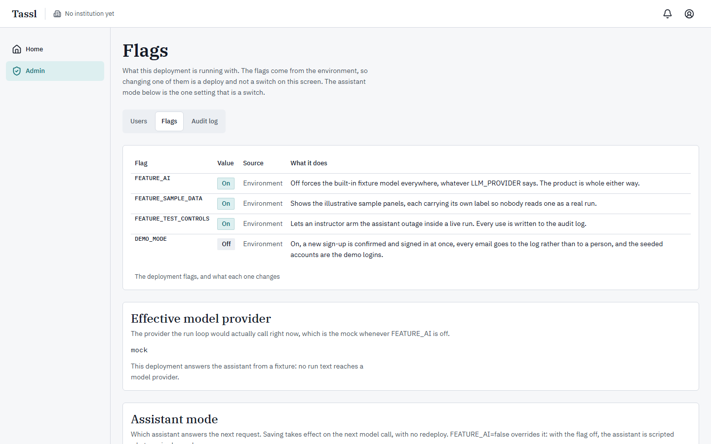

The same wording appears in three places and they cannot disagree, because all three read the same
answer: this line, the deployment's own health check that an operator polls, and the chip in the
**AI assistant** panel header that a student sees inside a run, which also reads **Live model** or
**Scripted assistant**.

#### Using it

1. Go to **Admin** → **Flags** and find the **Assistant mode** panel.
2. Choose **Live model** or **Scripted assistant**.
3. Press **Save assistant mode**. While it saves, the button reads "Saving".
4. A message confirms it: "Assistant mode saved." The line above the radios updates.

**When it takes effect.** On the next model call. There is no cache, no restart and no redeploy. A
student in the middle of a run gets the new assistant on their next request to it; nothing about
their run changes, and they are not told. Every save writes a row to the audit log recording what
the mode was and what it became.

This is the fastest way to take a misbehaving or expensive model out of the path, and
[the demo runbook](../guides/demo-runbook.md) treats it as the first line of recovery: under a
minute, against about four minutes for a change to the environment and a redeploy.

#### When the switch is disabled

If **FEATURE_AI** is **Off**, there is nothing for this switch to change: the fixture is already
answering everything, unconditionally. So the two options and the **Save assistant mode** button are
disabled, and a sentence appears beside the button: "FEATURE_AI is off in this environment, so the
assistant is scripted whatever is chosen here. Turn the flag on and redeploy to make this switch
live." This is the state the seeded installation starts in.

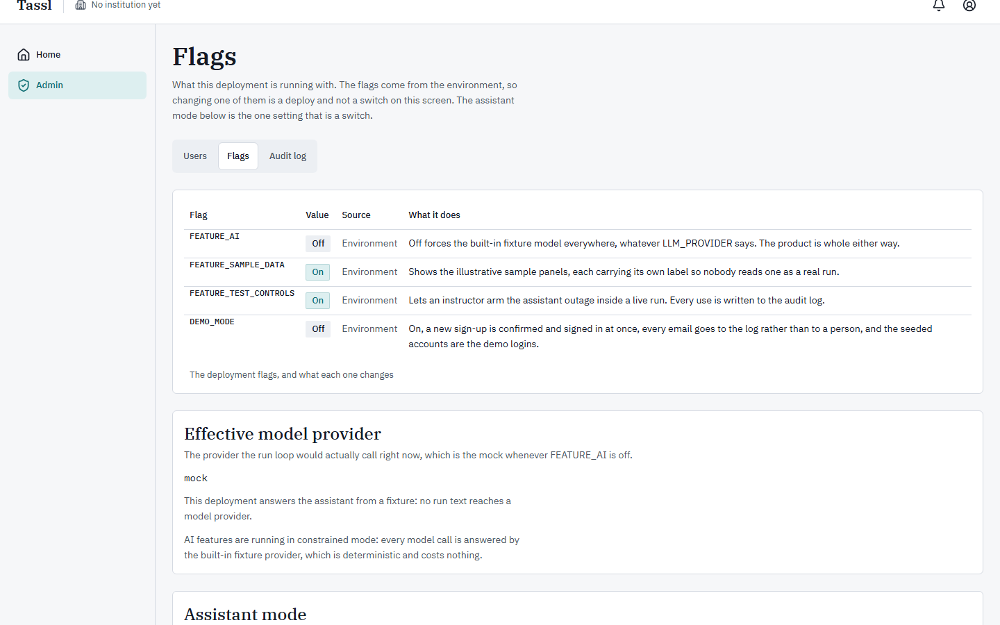

The button is disabled in a way that keeps it reachable by keyboard, so a screen reader reads the
reason along with it rather than skipping past a dead control. If a save is somehow attempted in
this state it is refused with: "FEATURE_AI is off in this environment, so the assistant is already
scripted and this switch cannot change it."

The order of precedence is fixed, and it only ever narrows: the environment's flag beats this
switch, and this switch beats the deployment's configured provider. You can always switch a
deployment off a live model; you can never switch a deployment that has no model onto one.

---

### Model usage

**What it is for.** Seeing what this deployment has spent with a model provider, against the budgets
that will refuse a call when they are reached.

**Where to find it.** **Admin** → **Flags** → the **Model usage** panel, at the foot of the screen.

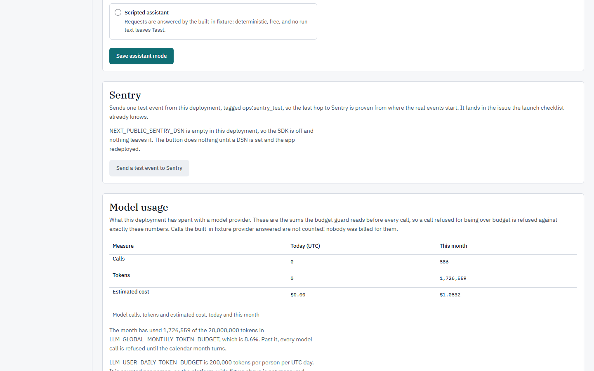

The panel's description says what the numbers are: "What this deployment has spent with a model
provider. These are the sums the budget guard reads before every call, so a call refused for being
over budget is refused against exactly these numbers. Calls the built-in fixture provider answered
are not counted: nobody was billed for them."

The table's caption reads **Model calls, tokens and estimated cost, today and this month**. Three
columns — **Measure**, **Today (UTC)**, **This month** — and three rows.

| Row | What it is |
|---|---|
| **Calls** | How many requests a model provider answered in the window. |
| **Tokens** | The input and output tokens of those calls, added together. |
| **Estimated cost** | Those tokens priced at the rates this deployment is configured with, printed as dollars to two to four decimal places. It is an estimate, and it is labeled as one; the provider's own invoice is the authority. |

**Today (UTC)** starts at midnight UTC — not at your local midnight. **This month** starts at the
first instant of this calendar month in UTC, and it resets when the month turns; it is not a rolling
thirty days.

Two sentences sit under the table and state the budgets in words. In the capture they read:

> "The month has used 1,726,559 of the 20,000,000 tokens in LLM_GLOBAL_MONTHLY_TOKEN_BUDGET, which
> is 8.6%. Past it, every model call is refused until the calendar month turns."

> "LLM_USER_DAILY_TOKEN_BUDGET is 200,000 tokens per person per UTC day. It is counted per person,
> so the platform-wide figure above is not measured against it."

The first names the platform's monthly ceiling and what share of it has gone. The second names the
per-person daily ceiling and warns you not to compare it against the table: the daily budget is
counted against each person separately, so the platform total above says nothing about whether any
individual is near their own limit.

**What you read these numbers for.**

- Before a class or a demo: is the month's share small enough that the session will not hit the
  ceiling partway through?
- After a change: did the switch to **Scripted assistant** actually stop the spend? **Today (UTC)**
  stops rising if it did.
- When a student reports the assistant is unavailable: if the month's share has reached the whole,
  the refusal is a spent budget rather than a broken provider, and the student's screen will have
  said "The assistant is unavailable: usage limit reached. Your clock stopped, and the run is
  paused."

**Why fixture-answered calls are not counted.** Nothing was billed for them. Counting them would
make the table say a deployment is spending money it is not, and it would make the number disagree
with the guard that refuses calls — which reads exactly these sums. A deployment running entirely on
the fixture shows zeroes here, and the zero is the truth. It follows that a monthly figure can stay
put while students keep using the assistant, if the assistant they are using is the scripted one:
the capture above shows a month with 586 real calls on it and nothing today, on a deployment now
answering from the fixture.

This panel is the only place in Tassl where budget consumption can be read without a separate
analytics account.

---

### Sentry

**What it is for.** Proving, from inside this deployment, that an error raised here reaches the
error-reporting service — the last hop that nothing else tests.

**Where to find it.** **Admin** → **Flags** → the **Sentry** panel.

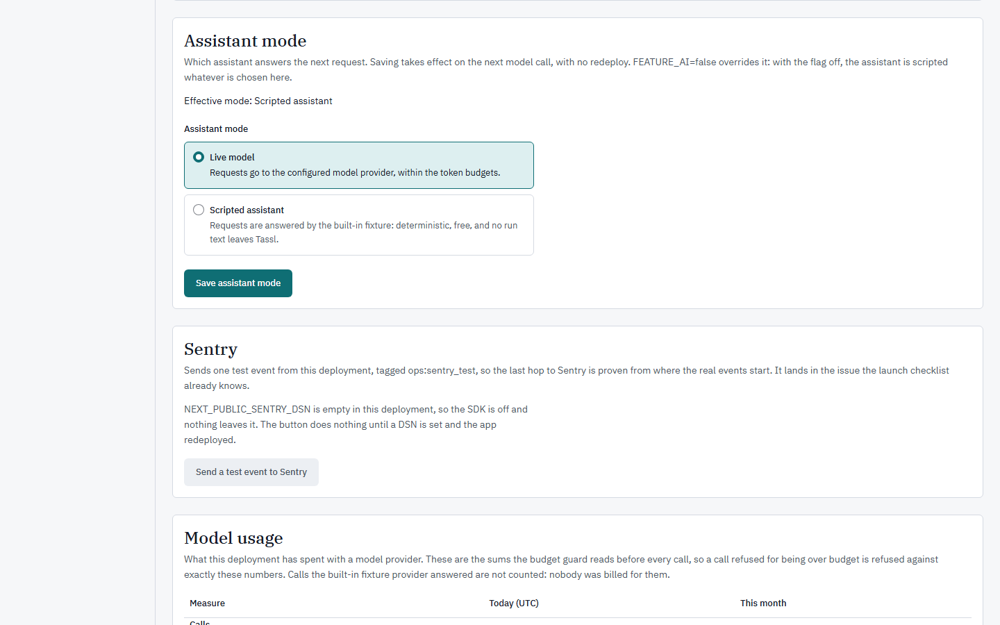

The description reads: "Sends one test event from this deployment, tagged ops:sentry_test, so the
last hop to Sentry is proven from where the real events start. It lands in the issue the launch
checklist already knows."

**How to use it.** Press **Send a test event to Sentry**. While it is in flight the button reads
"Sending…". When it returns, a line and a message report it: "Test event", then the event's
identifier, then "sent to Sentry", then the name of the deployment it came from in brackets — for
example `production`.

**What it proves.** That a real error raised by this deployment, on this day, with this
configuration, would arrive. Every earlier link in the chain can be tested from a developer's
machine; this one cannot, because the thing being tested is the network path out of the running
deployment. Quote the event identifier to whoever is watching the error dashboard and they can
confirm the far end.

**What it sends.** One event carrying a fixed message, a fixed tag and the deployment's name. No
personal data, no run text, no account identifier. It is given the same tag and fingerprint every
time, so every test event collects into one issue rather than filling the dashboard with new ones.

**When it is disabled.** When this deployment has no error-reporting address configured. The button
is then unpressable and a sentence sits above it: "NEXT_PUBLIC_SENTRY_DSN is empty in this
deployment, so the SDK is off and nothing leaves it. The button does nothing until a DSN is set and
the app redeployed." As with the assistant switch, the button stays reachable by keyboard so the
reason is read with it. Setting that address is an environment change and a deploy, the same as a
flag.

---

### Audit log

**What it is for.** Answering "who changed this, and when" — for every institution on the platform,
from one screen.

**Where to find it.** **Admin** → **Audit log**.

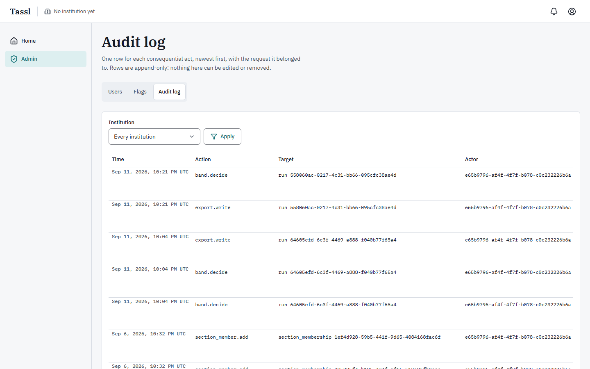

The heading is **Audit log** and the line under it is the promise the screen keeps: "One row for
each consequential act, newest first, with the request it belonged to. Rows are append-only:
nothing here can be edited or removed."

#### The columns

The caption reads **Audit rows, newest first**. Twenty rows at a time.

| Column | What the cell holds |
|---|---|
| **Time** | When the act happened, as `Sep 11, 2026, 10:21 PM UTC`. The row's heading, in a monospace face with aligned digits so a column of times can be scanned. |
| **Action** | What was done, as a short code — `band.decide`, `role.set`, `export.write`, `section_member.add`, and so on. The table below lists every one. |
| **Target** | What it was done to: the kind of thing, then its identifier — for example `run` followed by the run's id. |
| **Actor** | The account that did it, by identifier. When nothing was acting — a scheduled job, a script, the seed — the cell reads **System** instead. |
| **Institution** | The institution the act belonged to, by identifier. When the act belonged to the platform rather than to any institution — a role change, an assistant-mode save — the cell reads **Platform**. |
| **Request** | The request the act belonged to, as an identifier. Acts done by a background job carry `job:` and the job's id; acts done by a script or by the seed carry the word `system`. |
| **Record** | A collapsed disclosure reading **Open the record**. Opening it shows what was recorded alongside the act. When nothing was recorded, the cell reads "No record" and there is nothing to open. |

**Identifiers are shown as identifiers, deliberately.** An audit row is read beside a server log
line, and resolving an identifier to a name here would be a second lookup that could disagree with
what the row actually recorded. It follows that these screens will not turn an **Actor** identifier
into a person for you: the **Users** table lists names and addresses, not identifiers. What the log
does give you is the **Request** column, which ties every row written by the same request together,
and the **Record**, which carries the specifics of the change.

#### The institution filter

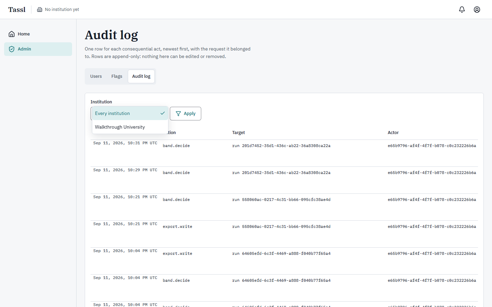

| Element | What it does |
|---|---|
| **Institution** | A dropdown. The first option is **Every institution**, which is where the screen starts. Under it, every institution on the platform by name, A to Z. |
| **Apply** | Applies the choice. |

1. Open the **Institution** dropdown.
2. Choose an institution, or **Every institution** to go back to the whole log.
3. Press **Apply**.

The choice lands in the address bar, so a filtered log can be bookmarked and reloaded. The list
offers every institution on the platform, not just ones you belong to — you belong to none. It is
capped at two hundred names; on a deployment with more than that, a line appears under the dropdown
reading "The first 200 institutions by name. A deployment with more than that has institutions this
filter does not offer."

**Show more rows**, at the foot of the table, adds the next twenty rows and keeps the institution
you filtered to.

If the institution you picked has nothing audited, the screen says so — "Nothing audited for that
institution", with "Nothing has been audited for the institution this filter names. The whole log
may still have rows in it." — and offers a "Show every institution" action back to the unfiltered
log. On a platform where nothing at all has been audited yet, the screen reads "Nothing audited yet"
with "A role change, a band decision, an export or a deletion writes the first row here."

#### What is recorded

Every row is written in the same transaction as the change it records, so a change that happened has
a row and a change that was rolled back has none.

| **Action** | Written when | What the record carries |
|---|---|---|
| `role.set` | A platform role is changed | The role it was, the role it became, and how many sessions were ended |
| `ai_mode.set` | The assistant mode is saved | The mode it was and the mode it became |
| `band.decide` | A band is confirmed, overridden or set unassessed | The dimension, the decision, the band, whether a note was written, and whether it differed from the draft |
| `run.void` | A run is voided | The reason, the state the run was in, and whether a replacement was offered |
| `run.reoffer` | A replacement run is issued | Which run it replaces, and which variant it uses |
| `claim.neutralize` | An instructor enters a correction on a claim | The claim, the reason, whether the student's challenge was credited, the dimensions affected |
| `export.write` | A course export is filed | The version number and why it was written |
| `account.delete` | Somebody closes their own account | How many days until it is purged |
| `agreement.upsert` | A data agreement is created or changed | Its purposes, roles, retention and end date |
| `package.confirm` | A scenario package version is confirmed | The package, the version and how many elements it holds |
| `package.regenerate` | A version is regenerated into a new one | Which version it came from, the new version, and the reason |
| `mapping.change` | A course changes its band-to-points mapping | The old and new mapping, and how many runs were affected |
| `test_control.force_failure` | An instructor arms an assistant outage | That it was armed |
| `invitation.create` | Somebody is invited to an institution | The role they were invited at — never the address |
| `section_member.add` | Somebody is added to a section roster | The section, the role, and the account |
| `run.delete` | A walkthrough run is deleted | The assignment, the section, the attempt number and the run's state |

#### What is not recorded

The audit log is a record of consequential acts, not a surveillance trail. It does not carry:

- Sign-ins, sign-outs, page views or any read. Opening a screen writes nothing.
- Anything a student typed: no frame, no brief, no request to the assistant, no reply, no defense
  answer. Those live with the run, and the run is not yours to open.
- The note an instructor wrote on a band. The record says a note exists, never what it says.
- The email address an invitation was sent to.
- Any secret, key or password.

#### Using it to answer "who changed this"

1. Go to **Admin** → **Audit log**.
2. If you know which institution the thing belongs to, choose it in **Institution** and press
   **Apply**. Platform acts — role changes, assistant-mode saves — are not in any institution; leave
   the filter on **Every institution** for those, and look for **Platform** in the institution
   column.
3. Scan the **Action** column for the kind of act — `band.decide` for a band, `mapping.change` for a
   course's arithmetic, `role.set` for a platform role, `run.void` for a voided run.
4. Match the **Target** against the identifier of the thing you are asking about.
5. Press **Open the record** on that row to see exactly what changed.
6. Note the **Time**, the **Actor** and the **Request**. The request identifier is what ties this row
   to every other row of the same request and to the server's own log of it, and it is the reference
   to quote to whoever is investigating.
7. Press **Show more rows** if the act is older than the rows on screen.

#### Editing and removing

Neither is possible, for anybody, including you. There is no edit control, no delete control, and no
process behind the screen that removes a row. Rows outlive the accounts they name: when somebody
closes their account and it is purged, the audit rows they wrote stay, carrying the identifier they
had.

---

## 6. The AI assistant

**You never use the assistant.** It exists inside a Decision Run — a student's run — and you cannot
start a run or open one. There is no assistant panel on any screen this role can reach, and no way
for you to send it a request.

What you hold is everything around it.

**What you control.**

| Control | Where | Effect |
|---|---|---|
| **Assistant mode** | **Admin** → **Flags** | Switches every student on this deployment between the live model and the scripted assistant, on the next request. See section 5. |
| **FEATURE_AI** | The deployment's environment; you read it on **Flags** | When **Off**, the scripted assistant answers everything and the switch above is disabled. Changing it is a deploy. |

**What you can see of its use.**

| What you see | Where |
|---|---|
| How many calls a model provider answered, their tokens, and the estimated cost | The **Model usage** table |
| Which assistant is answering right now | **Effective mode** on the **Flags** screen |
| Which provider the run loop would call | **Effective model provider** |
| That an assistant outage was armed inside a run, and by which account | The `test_control.force_failure` rows in the audit log |
| That the assistant mode was changed, from what to what, by which account | The `ai_mode.set` rows in the audit log |

**What you cannot see.** Any request a student made, any reply that came back, which claims were
raised, or anything a student wrote. None of it is in the audit log or in the model-usage table by
design — what is kept per call is the shape of the call, never its text — and the run that holds it
is not open to you.

**What the assistant does and refuses** is described for the person who meets it in
[the learner manual](02-learner.md). Two of its rules matter to you as an operator:

- It never says whether a claim is sound or defective, ranks claims by reliability, or mentions
  scoring, bands or grades. This is enforced, not merely requested.
- **A scripted assistant is not a degraded product.** The scripted assistant answers with the same
  claim cards, the same panel and the same behavior; only the connective prose differs, and it is
  deterministic and free. The only place in Tassl that says a deployment is running constrained is
  the **Effective model provider** panel on your own **Flags** screen. No student is ever shown a
  banner saying the assistant is degraded, and you should not add one by telling a class.

---

## 7. Notifications, settings, and account

### The bell and the notifications screen

The bell sits in the header on every signed-in screen. Its accessible name states the count —
**Notifications: No unread notifications** when nothing is unread, and the number when there is. The
count re-checks itself about once a minute while the tab is in front, and immediately when you come
back to the tab.

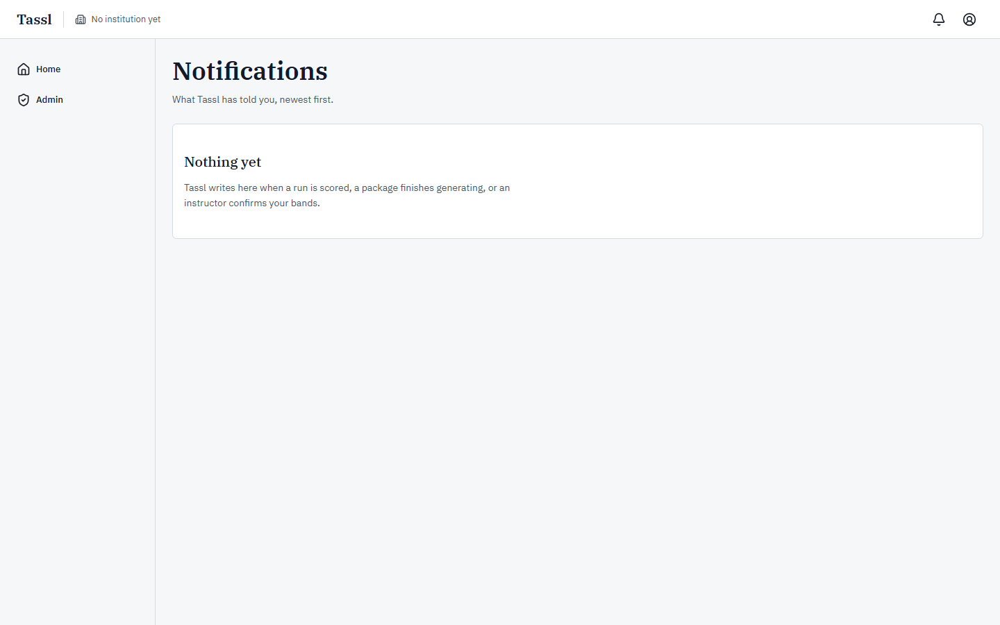

The screen is headed **Notifications**, with "What Tassl has told you, newest first." Yours is
normally empty, and reads "Nothing yet": "Tassl writes here when a run is scored, a package finishes
generating, or an instructor confirms your bands."

That is not a fault. Every notification Tassl writes belongs to a run, a section or a scenario
package, and this role holds none of them. There are eight kinds. Each kind's name is read out by a
screen reader before the row's title rather than printed on the screen, so the names below are what
you hear, not what you see:

| Kind | Written when | Who receives it |
|---|---|---|
| **Package generated** | Every generation step on a package version finishes | The author of that package |
| **Generation stopped** | A generation step fails the scenario rules a second time and stops | The author of that package |
| **Run scored** | Tassl has drafted a run's bands | The student who took the run, and every instructor and teaching assistant of the section |
| **Run held for review** | Nothing could place a run's bands | The section's instructors and teaching assistants; never the student |
| **Bands confirmed** | An instructor confirms a run's bands for the first time | The student of that run |
| **Invitation** | Never. The kind exists but nothing in Tassl writes one | Nobody; an invitation arrives by email instead |
| **Export ready** | A course export is filed for a run | The section's instructors and teaching assistants |
| **Package confirmed** | A package version is confirmed and frozen | Everyone in the institution who may author packages, except the person who confirmed it |

Nothing on this list is addressed to a platform role. If your list ever does fill, it is because your
account also holds a seat in an institution.

Where there are notifications, each row shows its title, its body and its time; an unread row is bold
with a colored rule down its left edge and the word **Unread** for a screen reader. **Mark read**
clears one row, **Mark all read** clears every one and confirms with "Everything is marked read.",
**Open** goes to the thing the row is about when it names one, and **Show more notifications** at the
foot of the list fetches the next twenty. No notification ever carries a band, a count, a rate or
anything a student wrote — they are also delivered by email, and email is not a safe place for any of
that.

### Account settings

Reach them from the account menu in the header, then **Settings**. There is no rail item. All three
screens are headed **Account settings**, with "Your profile, your password and devices, and your
data.", and a strip of three links whose accessible name is **Account settings sections**.

#### Profile

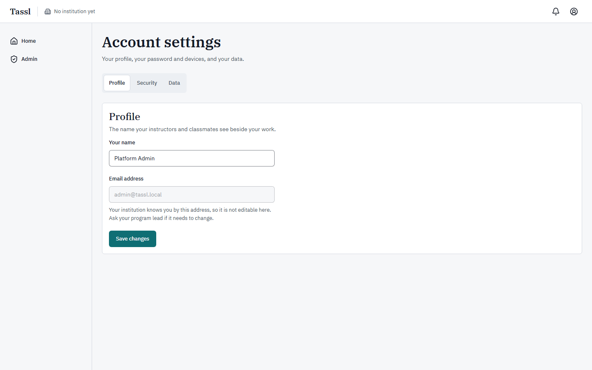

| Element | What it does |
|---|---|
| **Profile** | The panel, with "The name your instructors and classmates see beside your work." |
| **Your name** | Editable. It must not be empty and must be 120 characters or fewer. |
| **Email address** | Shown, and not editable. The note under it reads "Your institution knows you by this address, so it is not editable here. Ask your program lead if it needs to change." |
| **Save changes** | Saves the name, and confirms with "Your name is saved." |

There is no way to change an email address anywhere in Tassl, for any role, including this one.

#### Security

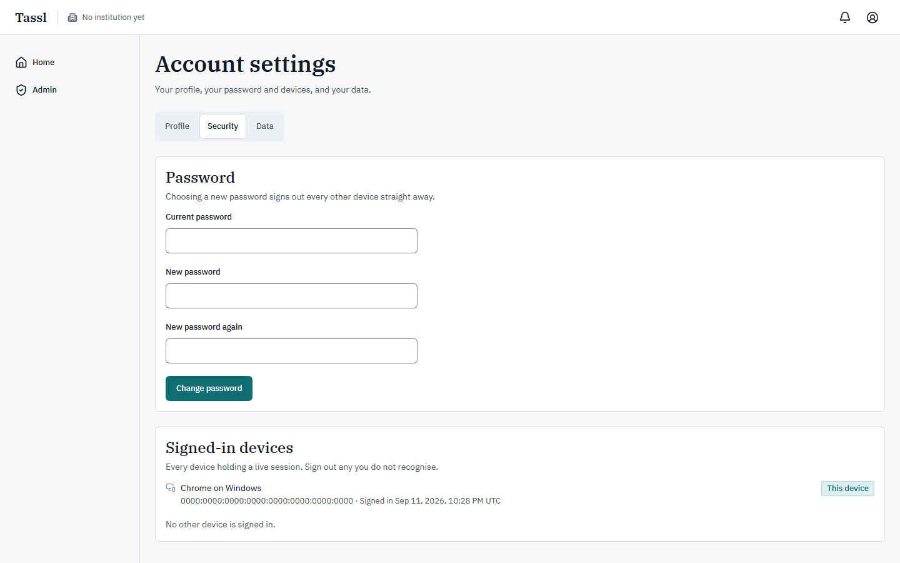

| Panel | Elements |
|---|---|
| **Password** | "Choosing a new password signs out every other device straight away." Three fields — **Current password**, **New password**, **New password again** — and **Change password**. A password is 12 to 128 characters, with no composition rules. Success reads "Your password is changed. Other devices are signed out." |
| **Signed-in devices** | "Every device holding a live session. Sign out any you do not recognise." One row per session, showing the browser and platform — for example **Chrome on Windows** — and under it the address it signed in from and when. The row you are reading on is marked **This device** and has no sign-out button; signing this one out is the account menu's job. |

Every other row carries a **Sign out** button that ends that one session, and under the list sits
**Sign out every other device**, which ends all of them at once and leaves only the one you are
reading on. Neither appears when there is nothing else to end: the panel then reads **No other device
is signed in.** instead, which is what the capture above shows.

This panel is worth a habit for an operator account: an administrator's session is the one on the
platform that is worth the most to somebody else, and this is where you end one you did not
recognize.

#### Data

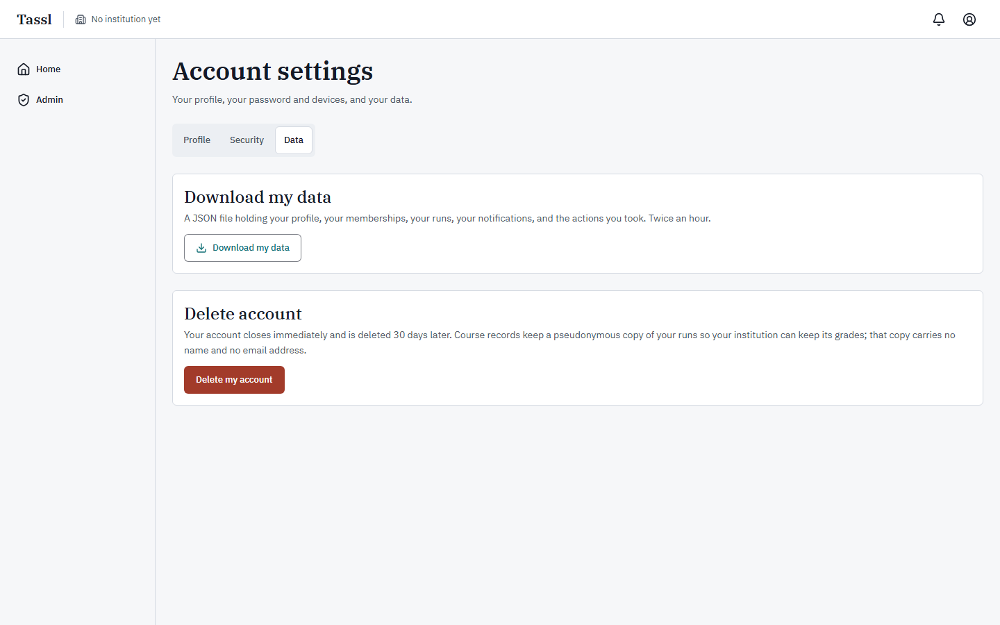

| Panel | What it does |
|---|---|
| **Download my data** | "A JSON file holding your profile, your memberships, your runs, your notifications, and the actions you took. Twice an hour." Press **Download my data**. For this account the file carries your profile, an empty membership list, your notifications, and the audit rows where you were the actor — including every platform role you changed. The twice-an-hour limit is counted per account. |
| **Delete account** | "Your account closes immediately and is deleted 30 days later. Course records keep a pseudonymous copy of your runs so your institution can keep its grades; that copy carries no name and no email address." Press **Delete my account**, which opens a dialog. |

The dialog is titled "Delete your account?" and says: "You are signed out straight away and cannot
sign in again. After 30 days everything Tassl holds about you is deleted; the pseudonymous course
record of your runs stays with your institution." Under that sits a field labeled "Type" followed by
this account's own email address "to confirm"; the second **Delete my account** button stays
unpressable until you type that address exactly. **Keep my account** closes the dialog and changes
nothing.

**Before you close a platform admin account, read this.** The act is immediate and cannot be undone.
Your session ends, you cannot sign in again, and after thirty days the account is removed. Your rows
in the audit log stay, because the log outlives the accounts it names. Crucially, nobody can change
their *own* platform role — so if this is the last **Platform admin** on the deployment, closing it
leaves the platform with no one who can promote a replacement. Make somebody else a **Platform
admin** first.

### The account menu and signing out

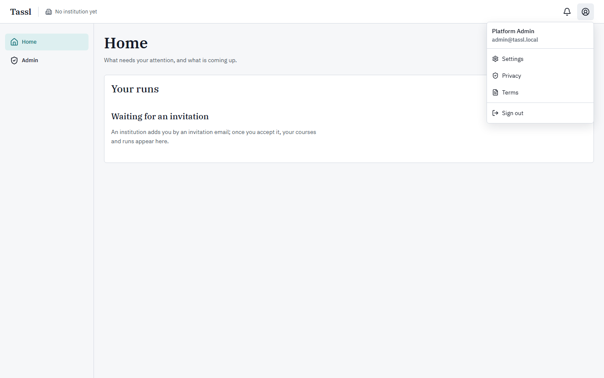

The trigger is the person icon in the header; its accessible name is **Account: Platform Admin**.
The menu shows your name and your email address, then:

| Item | Where it goes |
|---|---|
| **Settings** | Account settings, on the **Profile** tab |
| **Privacy** | The privacy document |
| **Terms** | The terms document |
| **Sign out** | Ends this session and lands on the sign-in screen |

If signing out fails, the page stays where it is and reports "Signing out did not work. Try again."

---

## 8. Common situations

**I want to make somebody a platform admin.**
**Admin** → **Users** → type the start of their address into **Search by email address** → **Search**
→ the **Platform role** dropdown on their row → **Platform admin** → "Change the role" in the dialog.

**I want to take somebody's platform role away.**
**Admin** → **Users** → find their row → the **Platform role** dropdown → **None** → "Change the
role". They are signed out of every device at once and hold no platform right when they sign back
in. Their institution seats are untouched.

**I want to let somebody build scenario packages for Tassl.**
**Admin** → **Users** → their row → **Scenario editor** → "Change the role". Then ask an instructor
or program lead of the institution they will work in to invite them at a scenario-author seat: the
platform role alone opens nothing. Remember that this also closes the Confirm step to them.

**I want to change my own platform role.**
You cannot. Your own row shows its role as plain text, and the screen says "Your own role is set by
another admin." Ask another platform admin.

**I want to stop the assistant calling a model right now.**
**Admin** → **Flags** → **Assistant mode** → **Scripted assistant** → **Save assistant mode**. It
takes effect on the next request, with no deploy. Students already in a run carry on; their next
assistant reply comes from the fixture.

**I want to put the live model back.**
**Admin** → **Flags** → **Assistant mode** → **Live model** → **Save assistant mode**. Then check
the **Effective mode** line reads **Live model**. If it still reads **Scripted assistant**, look at
**FEATURE_AI** and at **Effective model provider**: the environment is overruling the switch, and
that is an environment change and a deploy.

**I want to check this deployment before a class or a demo.**
**Admin** → **Flags**. Read, in order: **FEATURE_AI** **On**; **FEATURE_TEST_CONTROLS** **On** if an
instructor will use the armed outage; **Effective model provider** a network provider rather than
`mock`; **Effective mode** **Live model**; and the month sentence under **Model usage** well short
of the whole budget.

**I want to know what the assistant has cost this month.**
**Admin** → **Flags** → **Model usage** → the **This month** column, and the sentence under the
table for the share of the budget it represents.

**A student says the assistant is unavailable.**
**Admin** → **Flags** → **Model usage**. If the month sentence says the budget is spent, that is the
cause and no amount of retrying will help until the calendar month turns. If the budget is fine,
switch **Assistant mode** to **Scripted assistant** to get the class moving, then investigate the
provider.

**I want to prove errors from this deployment are reaching the dashboard.**
**Admin** → **Flags** → **Sentry** → **Send a test event to Sentry**. Quote the identifier it
reports to whoever is watching. If the button will not press, this deployment has no reporting
address configured, and the sentence above the button says so.

**I want to know who changed a band on a run.**
**Admin** → **Audit log** → choose the institution in **Institution** → **Apply** → find the
`band.decide` rows whose **Target** is that run → **Open the record** on the one you want. It names
the dimension, the decision and the band. The **Actor** is the account's identifier, and the
**Request** ties it to the rest of that request.

**I want to know who changed a course's band-to-points mapping.**
**Admin** → **Audit log** → **Institution** → **Apply** → look for `mapping.change` → **Open the
record**, which carries the old mapping, the new one, and how many runs were affected.

**I want to see every platform role change ever made.**
**Admin** → **Audit log** → leave the filter on **Every institution** → look for `role.set` rows,
whose **Institution** column reads **Platform** → **Open the record** for the role it was, the role
it became, and how many sessions were ended.

**I want to see a course, a run or a review queue.**
You cannot, and no setting on any screen will change that. Those belong to an institution and need a
seat in it. If the work genuinely requires it, an instructor or program lead of that institution can
invite your account to a seat — which is a decision for them, not a right of yours.

**I want to read a student's run to settle a dispute.**
You cannot. The run is open to the student who took it and to the instructors and teaching
assistants of their section, and to nobody else. Refer the dispute to the instructor of that
section.

**I want to hand the platform over to somebody else.**
**Admin** → **Users** → their row → **Platform admin** → "Change the role". Confirm the change shows
in the audit log as a `role.set` row. Only then consider removing your own role — which another
admin has to do for you — or closing your account.

---

## 9. Error messages and what they mean

### Refusals and failures

| Message on screen | When it appears | Why | What to do |
|---|---|---|---|
| **Not found** — "There is nothing at this address. It may have moved, or the link may be wrong." with **Go home** | Opening a screen this account may not open, such as **Review** | Tassl does not confirm that a thing exists and is refused to you | Press **Go home**. Nothing here is reachable from your seat |
| "Sign in to continue." | A request made after the session ended | The session expired, or it was ended elsewhere | Sign in again |
| "You do not have permission to do this." | The answer somebody who is not a platform admin gets when their request reaches an admin capability | The seat does not allow the act | Nothing on your side; it is the correct refusal |
| "You cannot change your own platform role: the change would sign you out of the seat that is the only way back. Another admin can do it." | An attempt to change your own role | Deliberate: the change would lock you out of the seat that could undo it | Ask another platform admin |
| "That account no longer exists." | Setting a role on a closed account, or on one that has been removed since the page was drawn | The account is gone | Reload the list |
| "That is not a platform role that can be set here." | A role value outside the three | Only **None**, **Scenario editor** and **Platform admin** exist | Choose one of the three offered |
| "FEATURE_AI is off in this environment, so the assistant is already scripted and this switch cannot change it." | Saving **Assistant mode** while **FEATURE_AI** is **Off** | The environment has already forced the fixture; the switch can only narrow, never widen | Nothing on this screen. Turning the flag on is an environment change and a deploy |
| "Too many requests. Try again shortly." | Many actions in quick succession | A rate limit — six hundred reads and sixty writes a minute per account | Wait a few seconds and repeat the action |
| "Something went wrong" — "The problem has been recorded. If it continues, quote the reference below.", with **Reference** and **Try again** | An unexpected failure on the server | A defect | Press **Try again**. If it repeats, quote the reference shown |
| "Invalid cursor." | Only after editing the address bar of a paged list by hand | The paging marker in the address is not one Tassl wrote | Go back to the screen without the edited address |

### Account and settings messages

| Message | When | What to do |
|---|---|---|
| "That is not your current password." | Changing your password with the wrong current one | Retype the current password |
| "Use between 12 and 128 characters." | A new password outside that range | Choose one inside it |
| "Both passwords must be the same." | The two new-password fields differ | Retype them to match |
| "Enter your name." / "Use 120 characters or fewer." | Saving an empty or over-long name | Correct the field |
| "The device list could not be loaded." | The signed-in devices panel could not read the list | Reload the screen |
| "You can download your data twice an hour. Try again shortly." | A third data download inside an hour | Wait, then download again |
| "The download did not start. Try again in a moment." | A data download that failed | Try again |
| "Type the email address of this account to confirm." | Confirming account deletion with a different address typed | Type this account's own address exactly |
| "The account was not deleted. Try again." | Account closure failed | Try again |
| "That notification no longer exists." | Marking a notification that has since gone | Reload the notifications screen |
| "Signing out did not work. Try again." | Sign-out failed | Press **Sign out** again |

### Empty states and disabled controls

| What you see | What it means |
|---|---|
| "No accounts yet" — "The first account will appear here as soon as somebody signs up." | The platform has no accounts at all |
| **No address starts with that** — "The search matches the start of an email address. Clear it to see every account." | The search text is not the beginning of any address. Press **Clear** |
| "A closed account holds no role, and is removed thirty days after it closes." | The row is a closed account; it has no role and no control |
| "Your own role is set by another admin." | The row is yours; only another platform admin can change it |
| "Nothing audited yet" — "A role change, a band decision, an export or a deletion writes the first row here." | Nothing consequential has happened on this platform yet |
| "Nothing audited for that institution" — "Nothing has been audited for the institution this filter names. The whole log may still have rows in it." | The filter matched no rows. Use "Show every institution" |
| "No record" in the **Record** column | That act recorded nothing beyond the row itself |
| "FEATURE_AI is off in this environment, so the assistant is scripted whatever is chosen here. Turn the flag on and redeploy to make this switch live." | Why **Save assistant mode** is disabled |
| "NEXT_PUBLIC_SENTRY_DSN is empty in this deployment, so the SDK is off and nothing leaves it. The button does nothing until a DSN is set and the app redeployed." | Why **Send a test event to Sentry** is disabled |
| **Nothing yet** — "Tassl writes here when a run is scored, a package finishes generating, or an instructor confirms your bands." | You have no notifications, which is normal for this role |
| **Waiting for an invitation** / **No institution yet** | You belong to no institution — expected for the seeded platform admin |
| **No other device is signed in.** | This is the only live session on your account |

---

## 10. Glossary

**Account** — One person's sign-in to Tassl: a name, an email address, a password, and exactly one
platform role.

**Admin area** — The three screens behind the **Admin** rail item: **Users**, **Flags** and **Audit
log**. Open only to a platform admin.

**Assistant** — The AI in the room during a student's run. It answers requests inside the scenario
and raises claims, and it never says whether a claim is sound.

**Assistant mode** — The runtime switch on the **Flags** screen choosing between **Live model** and
**Scripted assistant**. The only setting in Tassl that changes without a deploy.

**Audit log** — The append-only record of every consequential act on the platform. Nothing in it can
be edited or removed.

**Band** — The placement one of the seven dimensions of a run holds: Novice, Developing, Proficient,
Professional, or Unassessed. Drafted by Tassl, decided by an instructor.

**Closed account** — An account whose owner deleted it. It stops working at once, shows the
**Deleted** chip in the users table, holds no role, and is removed thirty days later.

**Course export** — The versioned document a reviewer files for one run so the institution can enter
a result in its own gradebook.

**Deployment** — One running installation of Tassl, with its own environment, its own database and
its own flags. The **Flags** screen describes the deployment you are signed in to.

**Data agreement** — An institution's record of what its data may be used for, by which roles, for
how long. A platform admin may read and write one without a seat in that institution; there is no
screen for it in this build, and a change to one writes a row to the audit log.

**Effective model provider** — The provider the run loop would actually call right now, once the
flags and the assistant mode have both been read.

**Estimated cost** — The model spend implied by the tokens counted, at this deployment's configured
rates. An estimate; the provider's invoice is the authority.

**Fixture** — The built-in scripted assistant. Deterministic, free, and nothing a student writes
leaves the deployment when it is answering.

**Flag** — One of four settings that come from the deployment's environment: **FEATURE_AI**,
**FEATURE_SAMPLE_DATA**, **FEATURE_TEST_CONTROLS**, **DEMO_MODE**. Changing one is a deploy.

**Institution** — The tenant an account can belong to. It owns courses, sections, rosters,
assignments, packages and runs. A platform admin belongs to none by default.

**Judgment Record** — The permanent artifact a student can download once their bands are confirmed.

**Platform role** — A right over Tassl itself: **None**, **Scenario editor** or **Platform admin**.
One per account, set on the **Users** screen, and never a seat in an institution.

**Program lead** — An institution seat that can read every course in its institution and invite
people to it. It is the institution's own administrator, and it is not a platform role.

**Request identifier** — The value in the audit log's **Request** column, tying together every row
written by one request and matching the deployment's own server log.

**Review queue** — An instructor's or teaching assistant's list of runs with bands to decide. Not
open to a platform admin.

**Run** — One student's single attempt at one assignment, kept as a full record of everything they
did. Not open to a platform admin.

**Scenario package** — One authored decision case: the brief, the documents, the claims the
assistant states, the Turn and the questions. A version of one is confirmed and frozen before an
assignment can run on it, and only an account whose platform role is **None** may confirm it.

**Scenario editor** — The platform role that lets somebody author scenario packages wherever they
also hold a scenario-author seat. It opens no screen on its own and cannot confirm a version.

**Section** — One division of a course, with its own roster. Every assignment belongs to one.

**Seed record** — The licensed published case a scenario package was adapted from. Kept with the
package, shown to no student, and not open to a platform admin.

**Session** — One signed-in device. Changing a platform role deletes every session the affected
account holds.

**Token** — The unit a model provider bills by. The **Model usage** table counts the input and
output tokens of every call a provider answered.

**Token budget** — The ceiling past which model calls are refused: one per person per UTC day, and
one for the whole platform per calendar month. Both are stated in words under the **Model usage**
table.
