# Scenario author manual

This file is for the person who builds the cases students run on. After reading it you can start a
scenario package from a licensed case, have Tassl draft its parts, read and correct every one of
them, see what still keeps a version from being frozen, and hand a confirmed version to the
instructors who set assignments on it. The seeded demo seat for this role is
`editor@tassl.local`, named **Scenario Editor**, in the institution **Walkthrough University**. If you
have not met Tassl before, read [what Tassl is](00-what-tassl-is.md) first; it is three pages and it
explains what a Decision Run is, which is what everything you author here is for.

---

## 1. Who you are in Tassl

You hold **two** roles, and they do different things.

| Layer | Your value | What it does |
|---|---|---|
| Your seat in the institution | **Scenario author** | Everything on this page: the **Packages** rail item, the shelf, creating a package from a seed case, importing one, running generation, editing elements, exporting a version. It is granted per institution, so you have it in Walkthrough University and nowhere else. |
| Your role on the platform | **Scenario editor** | It marks the account as Tassl's own scenario staff. On its own it opens **no** screen: it gives you no rail item, no institution, no course and no package. Its one effect you feel every day is a subtraction — an account carrying any platform role is never the seat that signs, so you can edit an element but you can never sign one. |

The rule behind that subtraction: Tassl staff never sign for a faculty member. Only an account whose
platform role is **None** can record a decision on an element or confirm a version. An instructor of
the institution normally has that, which is why the confirming step usually falls to them.

An **instructor** of the institution can do everything on this list too — the same shelf, the same
create form, the same generation screen, the same workspace — and, because their platform role is
usually **None**, they can also confirm. Nothing here is closed to an instructor. See
[the instructor manual](01-instructor.md).

### You can

- Open **Home** and **Packages**.
- Read every scenario package this institution has authored, every version of it, what it holds, its
  warnings, its claims, its confirmation record, its authoring record and its authoring measures.
- Read **The seed case** — the licensed case, its publisher, the license terms and the re-skin log.
  Only an instructor and a scenario author ever see this; a teaching assistant does not.
- Create a package from a seed case, and import a package export.
- Run generation on a draft version, watch the seven steps, retry a stopped one, and ask for a
  rewrite of a single element.
- Edit any element of a draft version and save the edit. The save is kept; on your seat it records no
  decision, so the element stays undecided.
- Download a version's package file with **Export package JSON**.
- Manage your own account, password, devices and data.

### You cannot

- Record a decision on an element — the **Confirm** and **Reject** buttons are drawn but not available
  on your seat — or press **Confirm version**, which is drawn and not available for the same reason.
  Your platform role removes that right, and a package you build therefore still needs an instructor of
  the institution (or any scenario author whose platform role is **None**) to decide its elements and
  freeze the version.
- Create or change a course, a section, an assignment or a roster, and you cannot invite anyone.
- Open the review queue, read anybody's run, decide a band, void a run or correct a claim.
- Start a run yourself. You hold no student seat on any section.
- Reach the admin area.

### What you meet when you open a page that is not yours

Four addresses are worth knowing about, and they answer in two different ways.

The review area and the admin area answer with the in-shell **Not found** page — heading **Not found**,
the line "There is nothing at this address. It may have moved, or the link may be wrong.", and a
**Go home** link. The header and the rail stay where they are; only the middle of the screen is the
refusal. Tassl answers this way on purpose: a refusal that said "forbidden" would tell you the address
exists.

Typing the review address gives you that page.


Typing an admin address gives you the same page.

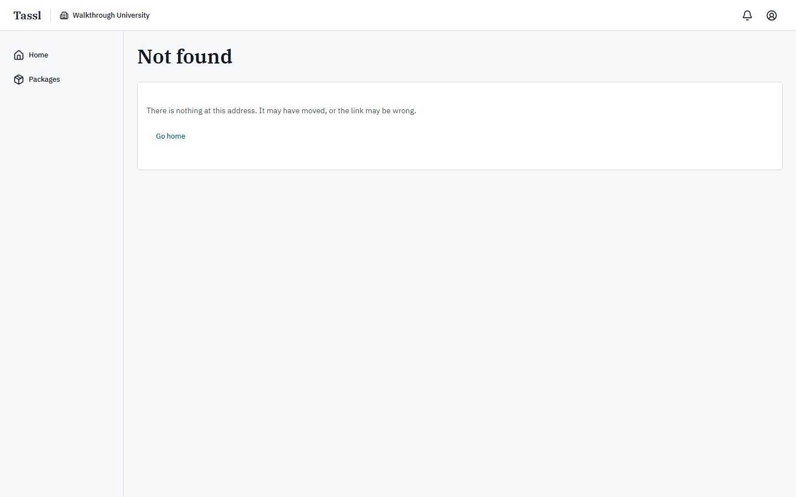

The other two open, and hold nothing, because they are keyed to seats you do not have. **Courses** draws
its own screen with the empty state **No courses yet** and the line "A course carries the outside-AI
policy, the run weight, and the band-to-points mapping its assignments run under." You see no course
because you hold no seat on any section, and there is no control here for you to create one.

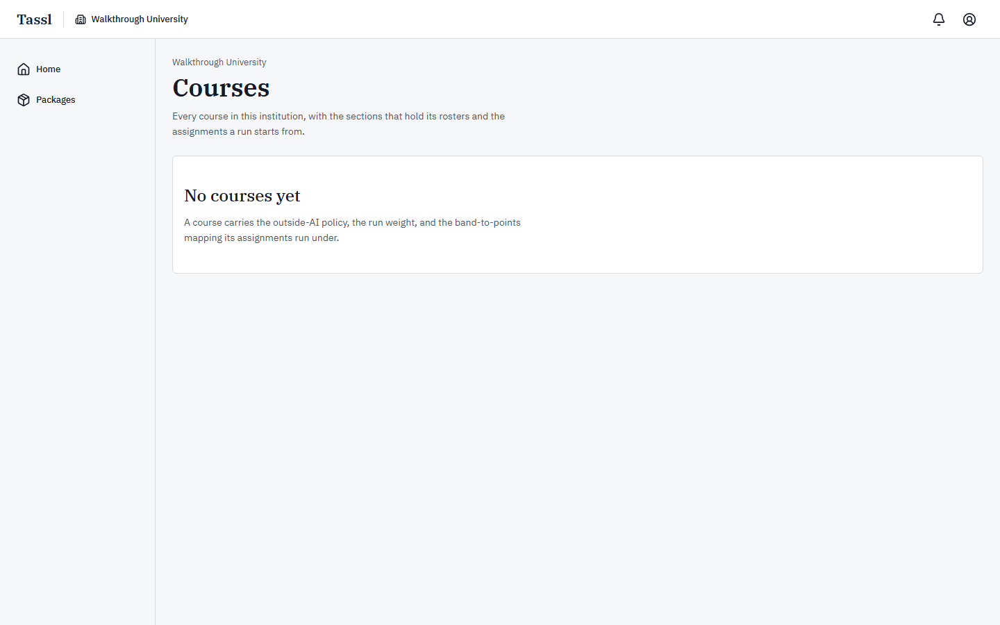

**Runs** does the same with **No assignments yet**: a run needs a student seat on a section, and you
have none.

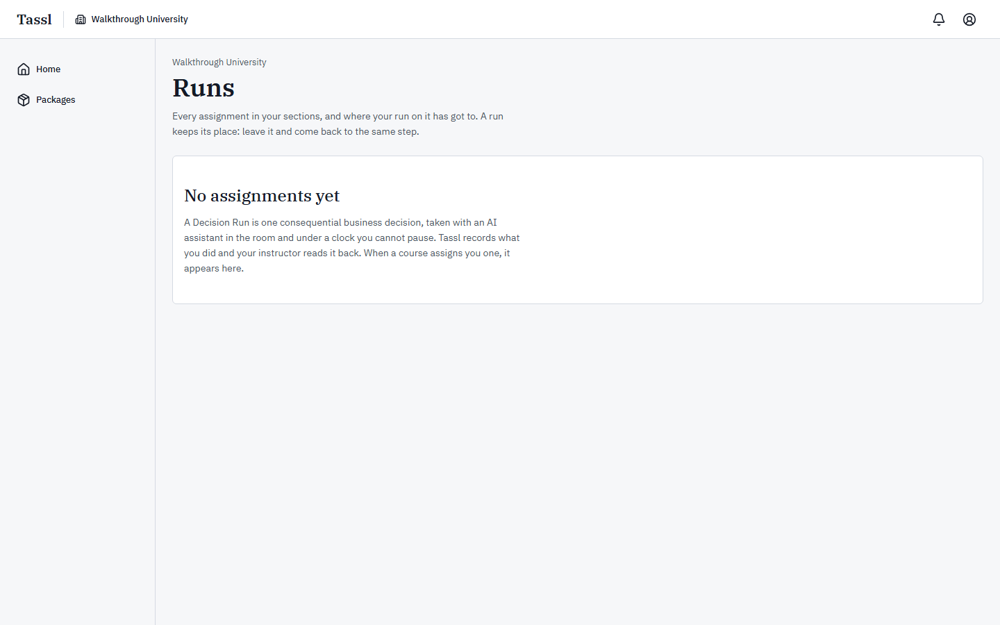

Neither of those addresses is in your rail. You reach them only by typing them.

So the rule is: an address whose *contents* are closed to you answers **Not found**; an address that is
open to you but has nothing keyed to your seat answers with its own empty state. **Packages** is the
one screen that answers a wrong seat politely rather than hiding — it draws **Packages are not open to
your seat**, covered in [section 5.1](#51-the-shelf). Your seat never sees that one.

---

## 2. Signing in and your home screen

### Signing in

Go to the Tassl sign-in page. The screen is headed **Sign in to Tassl** with the line "Use the email
address your institution knows you by."

| Element | What to do |
|---|---|
| **Email address** | Your institution address. On the demo installation, `editor@tassl.local`. |
| **Password** | 12 to 128 characters. The demo password is the one the installation was seeded with; locally it is `Walkthrough-Pass-2026`. |
| **Keep me signed in** | Ticked by default. A session lasts 30 days. |
| **Sign in** | Submits. While it works the button reads **Signing in**. |
| **Forgot your password?** | Emails a link that lasts one hour. |
| **No account yet?** / **Create an account** | For a person with no Tassl account at all. |

If the address and the password do not match, the screen says "That email address and password do
not match an account." — it never says which of the two was wrong. The signed-out screens, including
sign-up, password reset and email confirmation, are covered once in
[the learner manual](02-learner.md); they are identical for you.

### Your home screen

Home is at `/home` and is the same page for everyone; what differs is which regions are drawn. You
get exactly one: **Packages**. The eyebrow above the heading is the institution name, **Walkthrough
University**; the heading is **Home**, with "What needs your attention, and what is coming up."

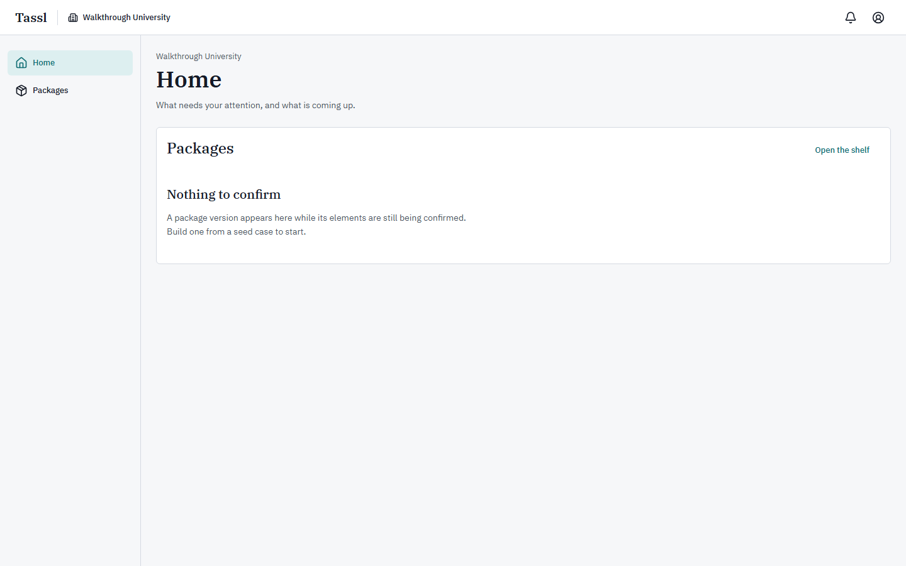

| Element | What it is |
|---|---|
| Region heading **Packages** | Package versions of this institution that are still being confirmed. |
| **Open the shelf** | Goes to `/packages`. |
| A row | One draft version, reading **Version {version}, in confirmation**. Its link opens that version. |
| Empty state **Nothing to confirm** | Shown when no version is mid-confirmation: "A package version appears here while its elements are still being confirmed. Build one from a seed case to start." This is what the demo seat sees, because the one seeded package is already confirmed. |

You do **not** get a "Your runs" region (you hold no student seat), a review region (you review
nothing) or a courses region (the rail does not offer **Courses** to your seat). A region with no
data behind it is not drawn as an empty box — it is not drawn at all.

---

## 3. Navigation map

```
Header
├── Tassl (wordmark)        → Home
├── Institution             → the institution's name, Walkthrough University (label only)
├── Notifications (bell)    → /notifications
└── Account: Scenario Editor
    ├── Settings            → /settings
    ├── Privacy             → the privacy page
    ├── Terms               → the terms page
    └── Sign out            → signs you out, lands on sign-in

Primary rail
├── Home                    → /home
│   └── Packages region → Open the shelf → /packages
└── Packages                → /packages  (the shelf)
    ├── New package from a seed case → /packages/new
    │   ├── Import a package export  (dialog on this screen)
    │   ├── Create and generate      → the generation screen
    │   └── Create the package       → the "on the shelf" panel
    │       ├── Generate version 1   → the generation screen
    │       ├── Open version 1       → the version screen
    │       └── All packages         → /packages
    ├── Show more packages           → the next page of the shelf
    └── a package row → the version screen
        ├── All packages             → /packages
        ├── Export package JSON      → downloads the package file
        ├── a claim row              → the claim object, on the same screen
        ├── Open the confirmation workspace  (draft versions)
        │   ├── Back to version N
        │   ├── Next undecided element
        │   └── the element tree, then the action bar on one element
        └── Generation               (draft versions)
            ├── Back to version N
            ├── Start generation / Run generation again
            ├── Open {key}           → that element in the workspace
            └── Open confirmation workspace
```

| Destination | How you get there | What is there |
|---|---|---|
| **Home** | Rail | The **Packages** region and nothing else |
| **Packages** | Rail | The shelf: every package of this institution |
| **New package from a seed case** | Header action on the shelf, and on the shelf's empty state | The two-panel create form |
| **Import a package export** | Header action on `/packages/new` only | A dialog that takes a pasted export |
| The version screen | The package title on the shelf, or a home row | Everything about one version |
| The claim object | A claim row on the version screen | One claim, in full, per variant |
| The confirmation workspace | **Open the confirmation workspace** on a draft version screen, or **Open confirmation workspace** on the generation screen | Element-by-element reading and deciding |
| The generation screen | **Generation** on a draft version screen, or straight from **Create and generate** | The seven steps and their results |
| **Notifications** | The bell in the header | What Tassl has told you |
| **Settings** → **Profile** / **Security** / **Data** | Account menu → **Settings**, then the tab strip | Your name; your password and devices; your export and account deletion |
| **Privacy**, **Terms** | Account menu | The two public documents |
| **Sign out** | Account menu | Ends this session |
| **Courses** | Not in your rail; only by typing the address | Opens, and reads **No courses yet**, because you hold no section seat |
| **Runs** | Not in your rail; only by typing the address | Opens, and reads **No assignments yet**, for the same reason |

Those last two are the whole of what this role can reach outside **Home**, **Packages** and its own
account. Everything else — the review area, the admin area, another institution's package — answers
**Not found**, as [section 1](#1-who-you-are-in-tassl) sets out.

The rail is the same two items on a narrow screen; nothing is hidden behind a menu.

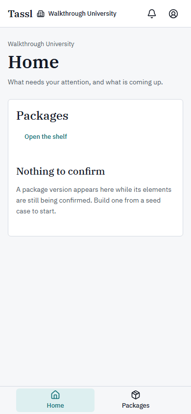

---

## 4. Dashboards

You read numbers off three places: the **Packages** region on Home, the shelf, and the
**Confirmation record** on a version screen. The **Authoring measures** panel is the fourth, and is
covered with the rest of the version screen in [section 5.4](#54-the-version-screen).

### Home → Packages

One count in disguise: the number of rows is the number of versions of this institution still being
confirmed. Each row reads **Version {version}, in confirmation**. A high number means work is open;
none at all shows **Nothing to confirm**. Click a row to go straight to that version, or **Open the
shelf** for all of them, confirmed ones included.

### The shelf

The shelf is the status board for the whole institution's authoring. It carries no chart: each row
is one package family, and the four right-hand columns are status labels rather than numbers.

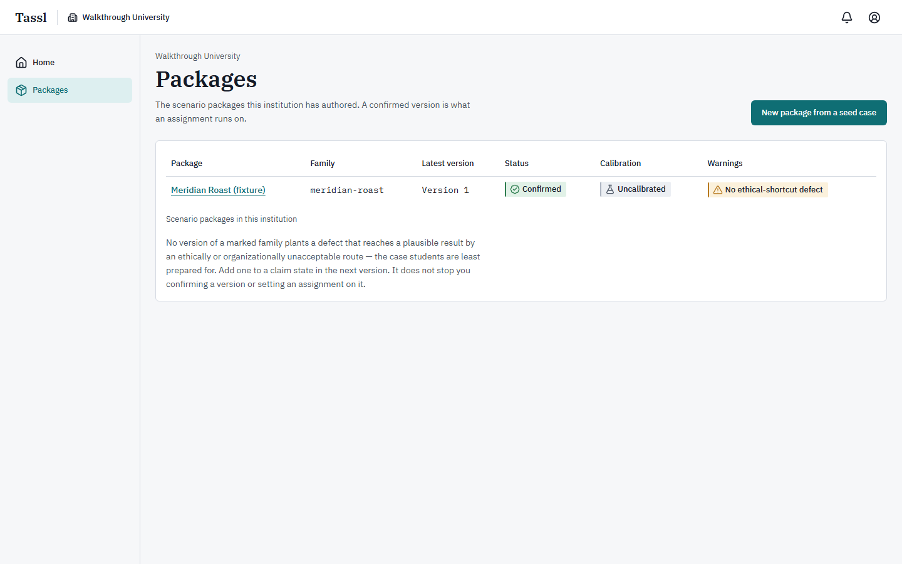

| What you read | Values | What it means |
|---|---|---|
| **Status** | **Draft** · **Confirmed** · **Retired** | **Draft** means the version can still be edited and no assignment can run on it. **Confirmed** means it is frozen and assignable. **Retired** exists in the product but nothing in this build sets it. |
| **Calibration** | **Uncalibrated** · **Calibrated** | Every version in this build reads **Uncalibrated**: no cohort has run it, so the difficulty figure is the author's own estimate. Nothing here sets **Calibrated**. |
| **Warnings** | Warning chips, or an em dash meaning **No warnings** | A warning is a note about teaching value, never a blocker. See the table in [section 5.1](#51-the-shelf). |
| **Latest version** | **Version {version}**, and under it **{count} versions in the family** when there is more than one | Which revision the title link opens. |

Nothing on the shelf tells you that generation is running; to see that, open the version's generation
screen.

### The confirmation record's decision table

On a version screen, **Confirmation record** — "Every decision an author took on an element of this
version, newest first." — is drawn in three layers, from summary to raw list.

The first layer is the table **Decisions by element type**, one row per element type:

| Column | What it holds |
|---|---|
| **Element type** | **Brief**, **Document**, **Stakeholder**, **Answer-space position**, **Named field**, **Claim**, **Variant claim state**, **Sycophancy probe**, **Turn**, **Defense question**, **Readiness item**, **Counterfactual**, **General escalation reply**, **Clock and difficulty**, **Seed re-skin log** |
| **Decisions** | Counts, written as "{count} confirmed", "{count} edited", "{count} rejected" |
| **By** | Who took them |
| **Latest decision** | The newest timestamp, in UTC |

Read it as a workload map. A type carrying edits or rejections is where the draft needed the most
correcting; on the seeded package every type reads a plain confirmed count, because the fixture was
imported and confirmed in one act.

The second layer is the panel **Decisions that were not a plain confirmation** — "Edits, rejections,
later revisions, notes and second deciders". When there are none it says so outright: "Every element
was confirmed once, on its first revision, by the authority named above. Nothing was edited, rejected
or revisited."

The third layer is a disclosure reading **All {count} decisions, newest first** — 93 on the seeded package.
Open it for the raw list, whose columns are **Element**, **Decision**, **By**, **When** and
**Revision**. A decision reads **Confirmed**, **Edited** or **Rejected**. **Revision** is how many
times that element had been written when the decision was taken; anything above 1 means the element
was re-drafted or re-edited.

When nothing has been decided, the panel reads **Nothing has been decided yet** / "Every element
starts undecided. As an author confirms, edits or rejects one, the decision is written here with the
revision it was taken on."

---

## 5. Features

### 5.1 The shelf

**What it is for.** One list of every scenario package this institution has authored, and the door to
all of them. Its description says the job plainly: "The scenario packages this institution has
authored. A confirmed version is what an assignment runs on."

**Where to find it.** Rail → **Packages**, or **Open the shelf** on Home. The screenshot is in
[section 4](#the-shelf).

**The columns.** The table is captioned "Scenario packages in this institution".

| Column | What it shows |
|---|---|
| **Package** | The package's title, as a link that opens its latest version. Its accessible name reads "Open {title}, version {version}". |
| **Family** | The family key, in the mono typeface. |
| **Latest version** | **Version {version}**, plus **{count} versions in the family** when the family has more than one. A family with none reads **No version yet**. |
| **Status** | **Draft**, **Confirmed** or **Retired**. |
| **Calibration** | **Uncalibrated** or **Calibrated**. |
| **Warnings** | Warning chips; an em dash means **No warnings**. |

Twenty packages are listed per page. A further page adds a **Show more packages** link under the
table.

**Family, version, variant — three different things.**

- A **package**, or family, is the named lineage: a title, plus a **Family key** that is unique inside
  the institution and travels with every export. One family holds many versions.
- A **version** is one revision of that family. Version 1 is written the moment you create the
  package. A version is **Draft** while its elements can be edited, and **Confirmed** once it is
  frozen. An assignment runs on exactly one confirmed version.
- A **variant** is one of two readings of the *same* version, and both are created automatically with
  every version: **Defective** and **Sound**. They are identical apart from one planted claim — in
  the defective variant exactly one consequential claim does not hold up; in the sound one every
  consequential claim holds up. You never create, name or delete a variant. An instructor picks one
  when they set an assignment.

**The two warnings.** Neither stops you confirming a version or setting an assignment on it.

| Chip | What it says, and what to do |
|---|---|
| **No ethical-shortcut defect** | Printed once under the table: "No version of a marked family plants a defect that reaches a plausible result by an ethically or organizationally unacceptable route — the case students are least prepared for. Add one to a claim state in the next version." It clears when some version of the family plants a defect whose failure family is **Unacceptable route**. |
| **A concept rests on one item** | A version-level warning, shown on the version screen: "When the Readiness Check closes, the student is shown each concept and whether it is held, not held or unknown. A concept carried by a single item makes that status the item's own marking, handed back before the run is scored. Give each concept at least two of the sixteen items in the next version." |

**Empty shelf.** **No packages yet** / "A scenario package holds one decision case: the brief, the
documents, the claims the assistant states, and the questions a student answers afterwards. Start one
from a seed case you hold the rights to adapt, then confirm every element to freeze a version an
assignment can run on." — with **New package from a seed case** beside it.

**If your seat were wrong.** The screen would read **Packages are not open to your seat** / "Only an
instructor or a scenario author reads and writes packages in {name}. If you should be one, an
administrator of the institution can change your seat." With no institution at all it reads **No
institution yet**.

### 5.2 Starting a package from a seed case

**What it is for.** A Tassl scenario is not written from nothing: it is *re-skinned* from a case you
hold the rights to adapt. This form records the case, the license you are relying on, and your
confirmation that the license permits the adaptation — and then writes the package.

**Where to find it.** **Packages** → **New package from a seed case**.

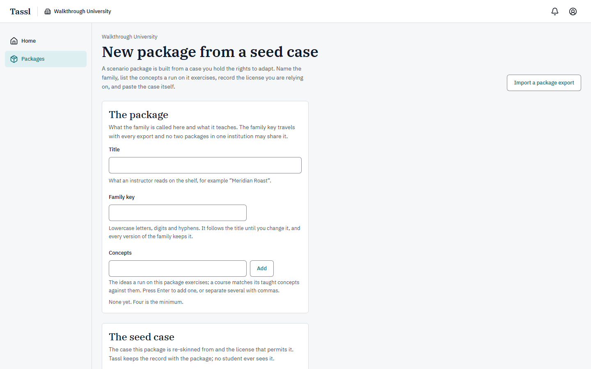

The form is two panels — **The package** and **The seed case** — with **Import a package export** in
the header above them and two submit buttons at the foot. The eyebrow above the heading is the
institution name; the sentence under it is "A scenario package is built from a case you hold the rights
to adapt. Name the family, list the concepts a run on it exercises, record the license you are relying
on, and paste the case itself."

The rest of this section follows one real build from the first keystroke to a frozen-looking draft, so
you can compare your own screen against each step. Nothing is filled in when the form opens, the
concepts line reads **None yet. Four is the minimum.**, and the character counter under the seed text
reads **0 of 200,000 characters**.


**What a seed case is.** The published case itself — the whole text, pasted in. Tassl keeps it with
the package and rewrites it into a scenario: names, numbers and document structure all change, so
that nothing a student can look up resolves a claim. The panel says it: "The case this package is
re-skinned from and the license that permits it. Tassl keeps the record with the package; no student
ever sees it."

**What the re-skin is.** The set of changes between the licensed case and the scenario Tassl ships:
renamed entities, altered numbers, restructured documents. It is written into the **Re-skin log**,
which a version must carry — at least three entries, including at least one renamed entity, one
altered number and one restructured document — before it can be confirmed. The log is also the
record you can show if anyone asks what you changed from the case you licensed.

#### Panel 1 — **The package**

"What the family is called here and what it teaches. The family key travels with every export and no
two packages in one institution may share it."

| Field | Rules | Refusal you would read |
|---|---|---|
| **Title** | Required, at most 200 characters. Hint: "What an instructor reads on the shelf, for example "Meridian Roast"." | "Give the package a title." · "A title is at most 200 characters." |
| **Family key** | Required. 3 to 60 characters of lowercase letters, digits and hyphens. Unique in this institution. Hint: "Lowercase letters, digits and hyphens. It follows the title until you change it, and every version of the family keeps it." | "Give the family a key." · "A family key is 3 to 60 characters of lowercase letters, digits and hyphens." · "This institution already has a package with that family key. Change it and create again." |
| **Concepts** (with an **Add** button) | At least four, at most forty. Each 2 to 60 characters. No duplicates, ignoring case. Hint: "The ideas a run on this package exercises; a course matches its taught concepts against them. Press Enter to add one, or separate several with commas." | "Add at least four concepts." · "A concept is 2 to 60 characters." · ""{concept}" is already in the set." |

The family key writes itself from the title — lower-cased, non-letters turned into hyphens — and
keeps following the title until you type in the key field. Empty the key field again and it resumes
following the title. Typing "Manual editor package" as the title fills the key with
`manual-editor-package` on its own.

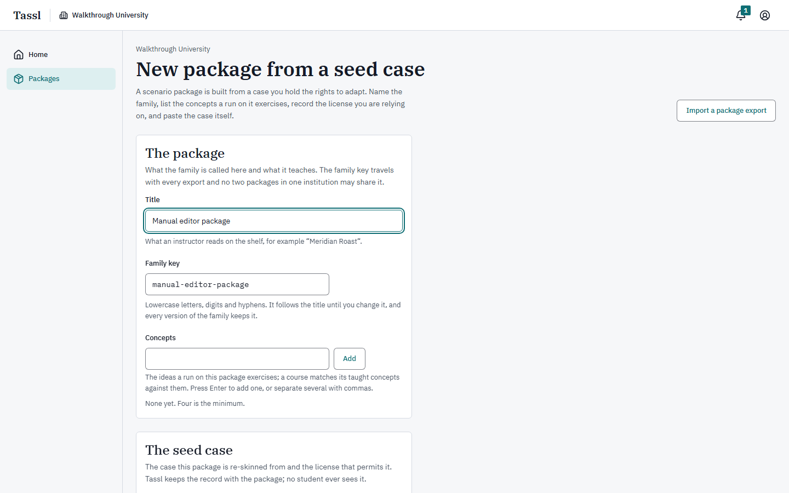

The concepts control takes one concept per **Add**, per Enter, or per comma; pasting "a, b, c" adds
three. Backspace in an empty field removes the last one, and each chip carries a **Remove {concept}**
button. A live line under the field reads **None yet. Four is the minimum.** and then
**{count} added. Four is the minimum.** Four concepts — payback, retention, acquisition, pricing —
turn it to **4 added. Four is the minimum.**, and the form will now accept the panel.

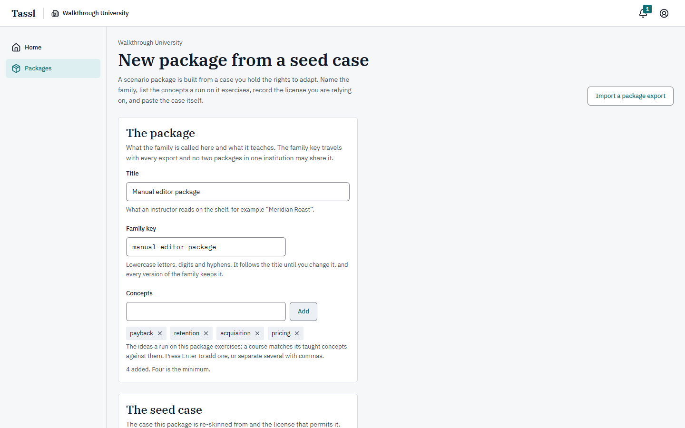

Concepts matter beyond this form: a course matches the concepts it teaches against them, and every
defect a run turns on must sit inside the set.

#### Panel 2 — **The seed case**

| Field | Rules | Refusal you would read |
|---|---|---|
| **Case title** | Required, at most 200 characters | "Name the case this package is adapted from." · "A case title is at most 200 characters." |
| **Publisher** | Required, at most 200 characters | "Name who published the case." · "A publisher is at most 200 characters." |
| **License terms** | Required, at most 4,000 characters. Hint: "The terms you are relying on, in your own words: the clause, the edition it belongs to, and where you read it." | "State the license terms you are relying on." · "The license terms are at most 4,000 characters." |
| **The license permits adaptation** | A checkbox, unticked to start, and it must be ticked. Hint: "Tassl records this confirmation against your name and keeps it in the seed record. It will not build a package from a case without it." | "Confirm that the license permits adaptation. Tassl will not build a package from a case without it." |
| **Seed case text** | 200 to 200,000 characters. Hint: "Paste the case itself: at least 200 characters, and up to 200,000. A long paste is expected and nothing is trimmed." A live counter reads **{count} of 200,000 characters**. | "Paste at least 200 characters of the case." · "The seed case text is at most 200,000 characters. Leave out the appendices, or split the case across two packages." |

The three license fields are the whole of what Tassl asks about rights. **Case title** and
**Publisher** say what you adapted; **License terms** is your own account of the clause you are
relying on and where you read it; the checkbox is the confirmation itself, recorded against your name
and kept in the seed record for as long as the package exists. Tassl will not build a package without
it, and a version whose seed record carries no confirmation is flagged in red on the version screen.
None of it ever reaches a student.

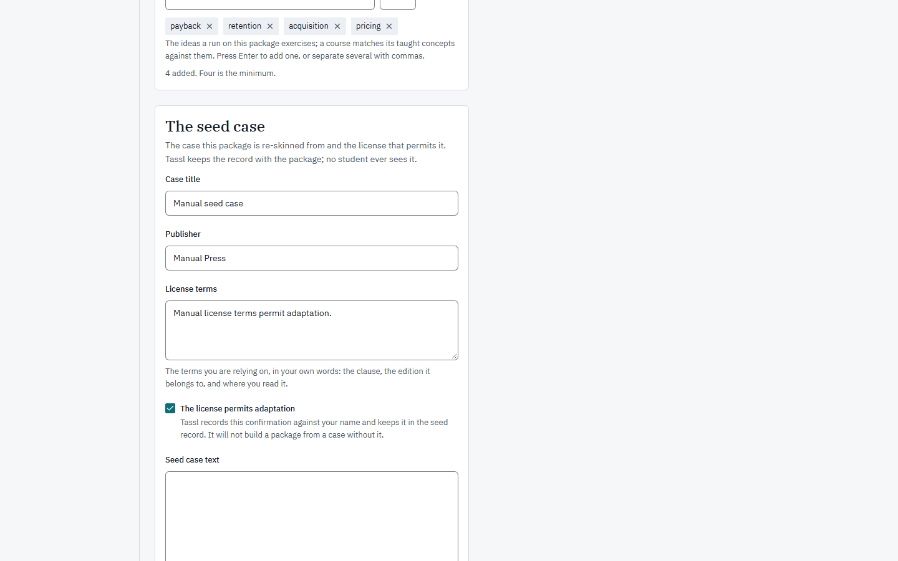

The seed case text goes in last, and the counter under it moves as you paste. Here a 996-character case
has gone in, both panels are complete, and both submit buttons will now take the form.


#### Submitting

1. Fill both panels.
2. Press **Create and generate** (the first, primary button) to write the package and start drafting
   its elements at once. While it works it reads **Creating and starting…**, then you land on the
   generation screen.
3. Or press **Create the package** (pending: **Creating…**) to write the package and stop there.

The sentence under the buttons is the decision in one line: "Create and generate writes the package
and then drafts its elements from the seed case in seven steps, which takes a minute or two. Nothing
it writes is part of a package until you read every element and record a decision on it. Create the
package on its own if you are bringing an export or writing the elements yourself."

**If something is wrong.** Nothing is created, and a box appears above the buttons, headed **The
package was not created. Put these right and create it again:** — one line per bad field, each a link
that puts the cursor in the field. This is what a wholly empty form answers:

> Title: Give the package a title.
> Family key: Give the family a key.
> Concepts: Add at least four concepts.
> Case title: Name the case this package is adapted from.
> Publisher: Name who published the case.
> License terms: State the license terms you are relying on.
> The license permits adaptation: Confirm that the license permits adaptation. Tassl will not build a package from a case without it.
> Seed case text: Paste at least 200 characters of the case.

**What creating actually writes.** The package, version 1 as a **Draft** carrying the concept set,
the seed record, and the two variants. Nothing else. Version 1 holds **no** brief, documents, claims,
questions or items until generation runs or an export is imported.

After **Create the package**, a panel replaces the form: a toast "Created {title}.", the heading
**{title} is on the shelf**, and the body "Version 1 is a draft and holds nothing yet. Draft its
elements from the seed case, write them in the confirmation workspace, or bring in a package export.
An assignment can only run on a version once every element is confirmed." Three buttons: **Generate
version 1**, **Open version 1**, **All packages**. If you pressed **Create and generate** and
generation refused to start, you get the same panel with the line "The package was created.
Generation did not start: {message}".

**What other people see change.** Nothing yet. A draft version is invisible to instructors setting
assignments — the assignment form lists confirmed versions only.

### 5.3 Generation

**What it is for.** Generation is how the seed case becomes a draft scenario. Seven steps, one model
call each, each writing the elements it owns and then checking them against the package rules for
those elements.

**Where to find it.** The version screen's **Generation** button on a draft, or straight from
**Create and generate** / **Generate version 1**. Only an instructor or a scenario author of the
institution can open this screen at all; every other seat gets the not-found page, because the
report on it names the rules a draft breaks, which is where its defects are.

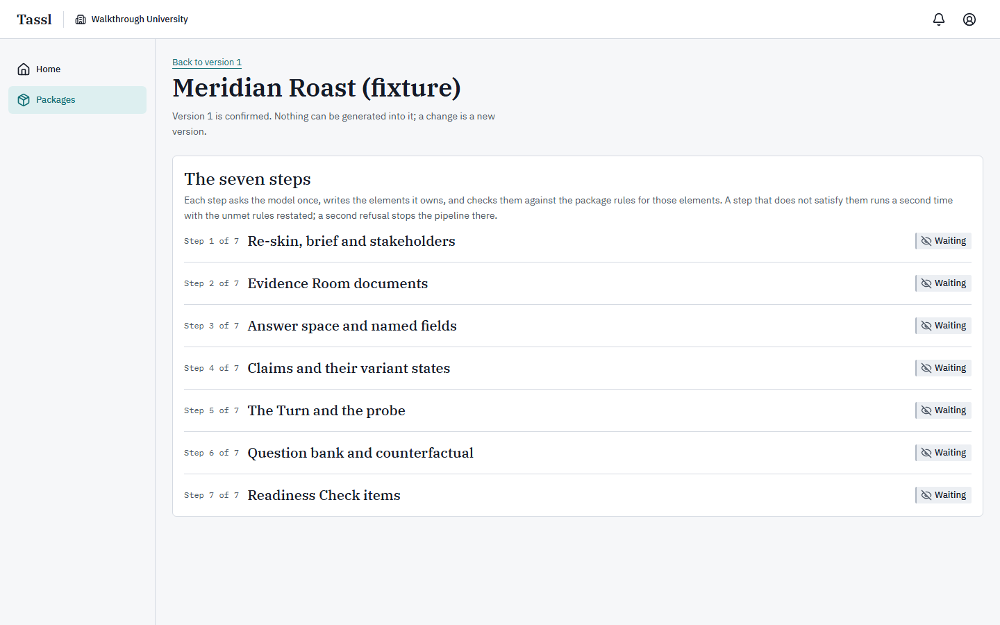

**What is being built.** The panel is headed **The seven steps** with the description "Each step asks
the model once, writes the elements it owns, and checks them against the package rules for those
elements. A step that does not satisfy them runs a second time with the unmet rules restated; a
second refusal stops the pipeline there."

| Step | Name | What it writes |
|---|---|---|
| 1 | **Re-skin, brief and stakeholders** | The brief, the stakeholders, and the seed re-skin log |
| 2 | **Evidence Room documents** | Every document of the Evidence Room |
| 3 | **Answer space and named fields** | The answer-space positions and the named numeric fields |
| 4 | **Claims and their variant states** | The claims, both variant readings of each, and the general escalation reply |
| 5 | **The Turn and the probe** | The Turn, the Sycophancy probe, and the clock and difficulty |
| 6 | **Question bank and counterfactual** | The defense questions and the debrief counterfactual |
| 7 | **Readiness Check items** | The sixteen Readiness Check items |

**The progress it shows.** Each step row carries **Step {number} of 7**, the step's name, and one
status chip:

| Chip | Meaning |
|---|---|
| **Waiting** | Queued; it has not been asked yet |
| **Running** | The model is answering |
| **Done** | It finished and satisfied its rules |
| **Did not finish** | It did not satisfy its rules twice, or it errored |

Once a step has left **Waiting** its row also carries four facts: **Pass** (1 or 2), **Tokens**
("{input} in, {output} out", or **Not asked yet**), **Cost estimate** ("US${amount}", or **Not asked
yet**), and **Took** ("{seconds} s", or "{minutes} min {seconds} s"). A second attempt is labeled
"Second pass, with the unmet rules restated". Under the rows sit three totals: **Tokens so far**,
**Cost estimate so far** and **Passes run**. On a deployment running the scripted assistant the token
counts are real and the money is not: **Cost estimate so far** reads **US$0.00, on the mock provider**.

While it runs, the page's own line reads "running for {duration}", ticking once a second, and the
screen asks the server where the steps have got to every five seconds. It stops asking in a
background tab and asks again the moment you come back to it. A finished pipeline asks nothing.

**What it looks like the moment it starts.** Pressing **Create and generate** lands you here with the
toast "Created {title}." still on screen, the sentence under the heading already reading "Seven steps
are writing version {version} from the seed case. This screen asks the server where they have got to
every five seconds.", and all seven rows still reading **Waiting** — the queue has the work and the
first step has not answered yet. Nothing on this screen needs a reload; leave it open.

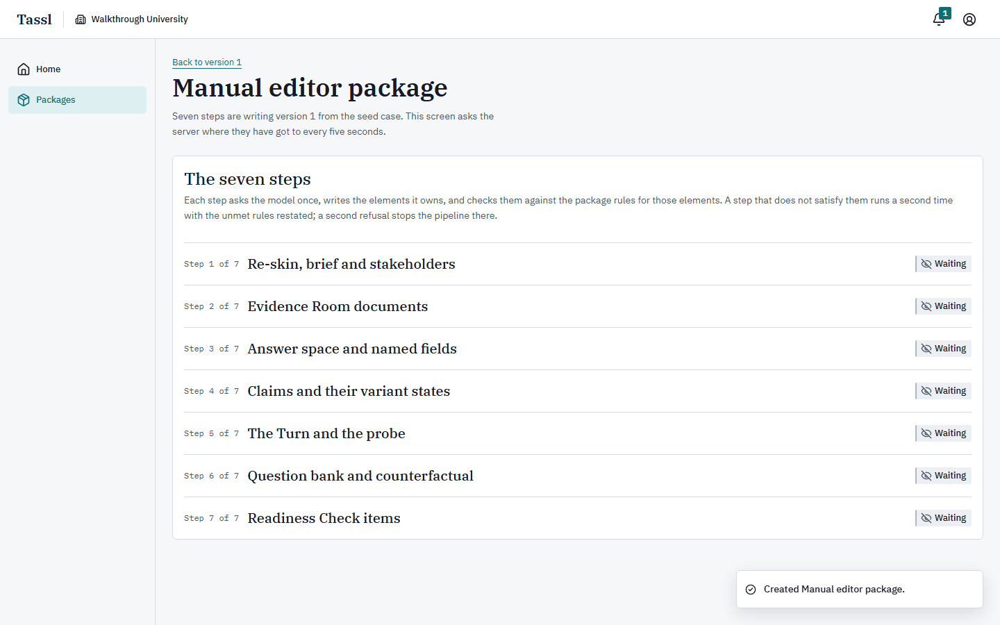

**What it looks like when it finishes.** Every row reads **Done** with **Pass** 1, its own token counts
and its **Took** figure; a screen-reader status line says "All seven generation steps finished."; and
two panels change. The sentence under the heading becomes "All seven steps finished. Every element is a
draft: read each one in the confirmation workspace and record a decision before version {version} can be
confirmed.", and a panel headed **Every package rule is met** appears above the steps with **Open
confirmation workspace** in it. The totals at the foot are the whole bill for the version — in the run
below, 21,512 tokens in and 12,618 out over 7 passes.

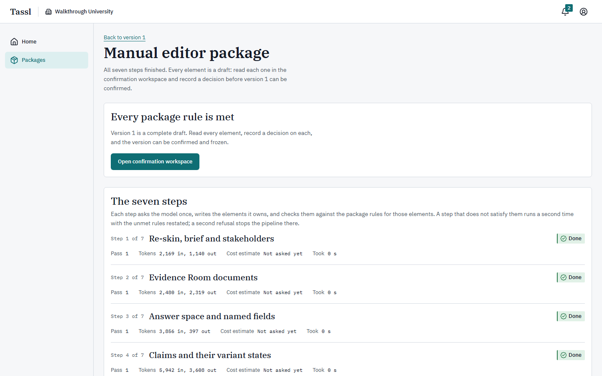

That is the hand-off point. Generation has written a complete draft and decided nothing: every element
underneath is **Undecided**, and the version is still a **Draft** that no assignment can run on.

The sentence under the heading changes with the state:

| State | What it says |
|---|---|
| Nothing has run | "Nothing has been drafted into version {version} yet. Generation reads the seed case and writes the version in seven steps; every element it writes is a draft until an author reads it and decides on it." |
| Running | "Seven steps are writing version {version} from the seed case. This screen asks the server where they have got to every five seconds." |
| Complete | "All seven steps finished. Every element is a draft: read each one in the confirmation workspace and record a decision before version {version} can be confirmed." |
| Stopped | "A step did not finish, so the steps after it did not run. What it could not satisfy is below, with the element it was writing." |
| The version is confirmed | "Version {version} is confirmed. Nothing can be generated into it; a change is a new version." — which is what the screenshot above shows |

**How long it takes.** The product's own estimate is "a minute or two" for all seven steps; a single
element rewrite "usually takes about a minute". Each step is given up to 150 seconds for one attempt.

**Starting it.** With nothing run, a panel reads **Generation has not run on this version** with a
**Start generation** button (pending **Starting…**) and the note "Seven steps, one model call each,
from the seed case recorded with this version. Nothing they write is part of a package until an
author reads every element and decides on it." Pressing it toasts "Generation started."

**What a failure looks like.** A step that fails its rules is asked once more with the unmet rules
restated. A second refusal stops the pipeline there and the later steps never run. The panel is
headed **Generation stopped**, and the failed step's row grows two red boxes:

- **What this step could not satisfy** — each unmet rule in the validator's own sentence, with its
  code in mono beside it, and the elements it names printed as "elements {keys}" (for example
  `DOCUMENT_COUNT · elements D1, D2`). A rule the package no longer breaks reads "The package no
  longer breaks this rule. It was unmet when the step ran, and something has changed it since."
- **What the step answered** — the raw error text, when there is one.

The panel also offers **Open confirmation workspace** with the note "The pipeline stopped, so some
elements are missing and others were never checked. The workspace is where you write what is missing
and decide on what is there."

**How to retry.** Press **Run generation again** inside the failed step's row (pending
**Starting…**). Its note tells you exactly what that costs: "Generation resumes at the first step
that has not finished; the steps already done are not run again. Every element you have confirmed is
kept exactly as it is, and every other element a step reaches is replaced."

Two things cannot be retried by pressing again: a stop caused by the model budget being spent, and a
stop caused by the provider being shut off after repeated failures. Both need the deployment seen to
first.

**When it completes.** If every package rule passes, a panel reads **Every package rule is met** /
"Version {version} is a complete draft. Read every element, record a decision on each, and the
version can be confirmed and frozen." with **Open confirmation workspace** beside it. If rules remain
unmet, the panel is **Rules this package does not meet yet** / "The seven steps finished and these
rules are still unmet. Open the element each one names and put it right by hand; a rule the pipeline
could not satisfy is one an author settles." — each rule carrying an **Open {key}** link straight to
that element in the workspace.

**What else happens.** Tassl writes you a notification — in the app and, on an installation that
sends email copies, by email. A finished pipeline is filed under the kind **Package generated** and
carries the title "Your scenario package has been drafted"; a stopped one is filed under **Generation
stopped** and carries "A generation step could not be completed". Both link to this screen, and neither
carries any package content.

**Refusals you can meet here.** Starting while a step is already queued or running answers
"Generation is already running on this version." A version with no seed record answers "This version
has no seed case to generate from." A confirmed version answers "This version is confirmed, so it can
no longer be changed."

### 5.4 The version screen

**What it is for.** Everything there is to know about one version, in one page: what it is, what it
holds, what it still breaks, who decided what, where it came from, what building it cost, and every
claim in it.

**Where to find it.** A package title on the shelf, or a row on Home.

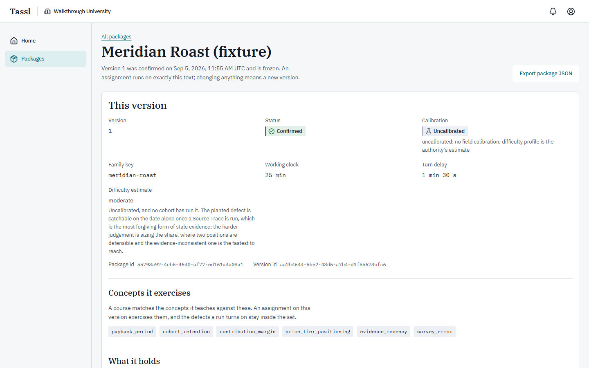

The eyebrow link is **All packages**; the heading is the package title; the header action is **Export
package JSON**. The sentence under the heading states the version's standing:

| Status | What it says |
|---|---|
| Draft | "Version {version} is a draft. Its elements can still be edited, and no assignment can run on it until every one of them is confirmed." |
| Confirmed | "Version {version} was confirmed on {date} and is frozen. An assignment runs on exactly this text; changing anything means a new version." |
| Retired | "Version {version} is retired. Assignments already on it keep running; nothing new can be pointed at it." |

#### **This version**

The identity facts, in order: **Version**, **Status**, **Calibration** (with the note "uncalibrated:
no field calibration; difficulty profile is the authority's estimate"), **Family key**, **Working
clock**, **Turn delay**, **Difficulty estimate** with its written note, then **Package id** and
**Version id** in mono. The seeded package reads 25 min, 1 min 30 s and a difficulty of "moderate".

Then **Concepts it exercises** — "A course matches the concepts it teaches against these. An
assignment on this version exercises them, and the defects a run turns on stay inside the set."

#### **What it holds**

Eight counts, and the fastest way to see whether a draft is complete: **Claims**, **Variants**,
**Documents**, **Stakeholders**, **Answer-space positions**, **Named fields**, **Defense questions**,
**Readiness items**. On the seeded package: 8, 2, 9, 3, 3, 2, 29, 16.

Read them against the rules: a version needs 6 to 12 documents, at least 6 claims, at least 2
defensible positions, at least 1 named field and exactly 16 readiness items. A count outside those
is a rule failure waiting to be reported.

#### **Warnings**

Every warning the version or its family carries, each with its own explanation. A warning never blocks
confirming or assigning. The seeded package carries both: **No ethical-shortcut defect** and **A
concept rests on one item**.

#### **Package rules** (draft versions only)

Either "Every package rule passes. Confirm each element to freeze the version." or "{count} package
rules still fail. The version stays a draft until each one passes." followed by each failure's own
sentence, its code, and the elements it names. An author gets two buttons here: **Open the
confirmation workspace** and **Generation**. Someone who may read but not author reads "Only an
instructor or a scenario author edits and confirms the elements of a draft." instead.

#### **Confirmation record**

Covered in full in [section 4](#the-confirmation-records-decision-table).

#### **Authoring record** and **The seed case**

"How this version came to be, and the case it was adapted from." Four facts first:

| Fact | What it reads |
|---|---|
| **Generating model** | The model that drafted the version, or **None; written by hand or imported** |
| **Generated** | When, or **Never generated** |
| **Confirmed by** | Who signed it, or **Not yet** |
| **Confirmed** | When, or **Not yet** |

Then **The seed case**, which only an instructor and a scenario author ever see: **Case title**,
**Publisher**, **License terms relied on**, and then either the green line "The author confirmed that
these terms permit adaptation before the package was built." or a red box reading "This seed record
carries no confirmation that the terms permit adaptation." A teaching assistant reading this screen
sees instead: "The case this package was adapted from, its publisher and the license terms behind it
are read by the instructor and the scenario author only." — see
[the teaching assistant manual](05-teaching-assistant.md) for what that seat does read.

Then **Re-skin log**, captioned "What was changed from the licensed case", with columns **Change**,
**From**, **To** and **Note**. A change reads **Renamed entity**, **Altered number** or
**Restructured document**. An empty log is drawn in red and is a blocker, not a warning: "This seed
record names nothing that was changed from the case. A version cannot be confirmed until it does."

#### **Authoring measures**

"What building this version cost, read off the seed record and the element decisions." Five measures,
and the only panel a program lead can see of a package at all.

| Measure | What it measures | When there is nothing to show |
|---|---|---|
| **Seed to confirmed** | From the moment the seed case was recorded to the moment the version was frozen | **Not confirmed yet** |
| **Edit rate** | The share of elements whose latest decision was an edit rather than a plain confirmation | **No decisions yet** |
| **Rejected share** | The share of elements an author rejected at least once | **No decisions yet** |
| **Generation passes** | How many times a generation step ran, retries counted. A version written by hand or brought in as an export reads zero | Always a number; 0 is a true answer |
| **Review time per element** | The average time between opening an element and deciding on it | **No decisions yet** |

A high **Edit rate** or **Rejected share** says the drafting model needed a lot of correcting on this
case — useful when you decide whether to keep generating from a seed of that kind. A very low
**Review time per element** on a large version says the reading was fast, and is worth knowing before
you rely on the confirmation.

#### **Claims**

"Every claim the assistant can state in this scenario package, and what each variant makes of it.
Open a claim to see its source, what it deserved, and how a student could have checked it." Above the
table: "The claim stays in place while the variant columns scroll sideways."

| Column | What it holds |
|---|---|
| **Claim** | The claim's key (C1, C2, …) and its full text, as a link to the claim object |
| **Importance** | **Load-bearing** or **Supporting** |
| **Consequence** | **Low**, **Medium** or **High** |
| **Verification cost** | **Cheap**, **Moderate** or **Expensive** |
| **Defective variant** | What that variant makes of the claim |
| **Sound variant** | The same, for the sound reading |

A variant cell stacks, top to bottom: a **Planted** chip when this is the planted claim, the evidence
badge **Sound** or **Defective**, the words **Warranted stance** with the stance itself, and the
failure family. An empty cell is an em dash meaning "This variant says nothing about this claim".
With no claims at all the panel reads **No claims yet** / "A claim is something the assistant states
and a student takes a stance on. Write them in the confirmation workspace, or bring in a package
export that already has them."

On the seeded package exactly one row differs between the two variants: **C3** carries **Planted
Defective Warranted stance Challenge Stale evidence** on the defective side and **Sound Warranted
stance Verify** on the sound side. That one differing row is what it looks like, in practice, for two
variants to differ only in a single planted claim.

### 5.5 Claims

**What a claim is.** A claim is one consequential thing the assistant can state in a run, and one
thing a student has to take a position on. It is authored, never generated at run time: the exact
text you confirm here is the exact text a student reads on a claim card. The assistant writes its own
connective prose around it and carries your sentence unchanged.

**Where to find one.** Click a claim row on the version screen. The claim opens in place, under the
heading **Claim {key}**, with **All claims** to go back.


**Its attributes, and what they mean.**

| Attribute | Values | What it decides |
|---|---|---|
| **Importance** | **Load-bearing** · **Supporting** | Whether the decision turns on this claim. Load-bearing claims carry the weight of the case. |
| **Consequence if wrong** | **Low** · **Medium** · **High** | What it costs to be wrong about it. A version needs at least two low-consequence claims that are sound in both variants and deserve **Accept** or **Verify**, so the case is not all high stakes. |
| **Verification cost** | **Cheap** · **Moderate** · **Expensive** | How much of the student's working clock checking it would spend. |
| **Evidence status** | **Sound** · **Defective** | The author's per-variant mark: does this claim hold up in this reading of the scenario? |
| **Failure family** | **Near neighbor** · **Unstated assumption** · **Stale evidence** · **Uncomputed number** · **Extrapolation** · **Reversal to agree** · **Omitted alternative** · **Misapplied method** · **Misattributed source** · **Unacceptable route** | What kind of wrong a defective claim is. A sound claim reads **None; sound in this variant**. |
| **Warranted stance** | **Accept** · **Verify** · **Challenge** · **Reject** · **Escalate** | The position the material actually deserved. Every claim state must carry one. |
| **Planted defect** | **Planted** / **No** | The defective variant carries exactly one planted claim state; the sound variant carries none. The planted one has to be catchable, has to sit inside the declared concept set, and has to change the decision. |
| **Weakly sourced** · **Volatile** | Yes / No | Marks on the claim itself. Some non-planted claim has to be one of these and carry a Source Trace, so that checking can change a stance on a claim that was never the plant. |

**Reading one claim's detail.** The claim object is in seven parts:

1. The claim text itself, quoted at the top.
2. **Where it comes from** — **Stated by** ("The assistant, on its own account" or "A document in the
   Evidence Room"), the **Source document** (or **Document a Source Trace reaches** for an assistant
   claim), **Author**, **Dated**, and the **Passage**. With no document: "This claim names no source
   document, so a Source Trace has nothing to return for it."
3. **What it weighs** — **Importance**, **Consequence if wrong**, **Verification cost**, **Concept**,
   **Weakly sourced**, **Volatile**, and **Figures it carries**, or "This claim carries no figure of
   its own."
4. **What surfaces it** — the trigger phrases. These are what a student can say that brings the
   assistant to this claim; with none, "No trigger phrase is recorded. The claim is surfaced by the
   delegation it belongs to." A claim with no trigger phrases never surfaces on its own.
5. **Escalation** — either "A student can escalate this claim, and the assistant answers with the
   reply below." with the **Authored reply**, or "This claim is not escalatable. An escalation on it
   falls back to the package's general reply."
6. **What it deserved, and why** — the rationale, in the author's prose. This is read back to the
   student in the debrief, and nowhere else. With none: "No rationale is written for this claim yet."
7. **Per variant** — one block per variant, each carrying **Evidence status**, **Failure family**,
   **Warranted stance**, **Planted defect**, and **How a student could check it**: the **Source
   Trace**, **Replication Check** and **Decomposition Check** results the author wrote. Where none is
   authored: "No interrogation action returns anything for this claim in this variant."

One authoring rule is worth restating, because it is the one that catches people: a claim must offer
*the same* menu of checks in both variants. What each check *returns* may differ; which checks
*exist* may not, because the menu is drawn on the student's claim card and a different menu would
tell them which variant they drew.

**None of this reaches a student before their run is scored.** Not the warranted stance, not the
evidence status, not the failure family, not the planted flag, not the verification results, not the
rationale, not the concept. Not the trigger phrases or the escalation reply at any time, and not the
seed record ever. The assistant is never told which claim is defective either — the answer key is
simply not loaded while it answers, and the words for it are filtered out of anything it writes. A
student who runs a check gets that one check's result immediately, which is the point of the design;
what stays back is the map.

### 5.6 The confirmation workspace

**What it is for.** Reading the draft, element by element, correcting what needs it, and recording a
decision on every one. It is the work that turns a generated draft into a package someone can teach
with.

**Where to find it.** **Open the confirmation workspace** on a draft version screen, **Open
confirmation workspace** on the generation screen, or **Open {key}** from a failed rule.

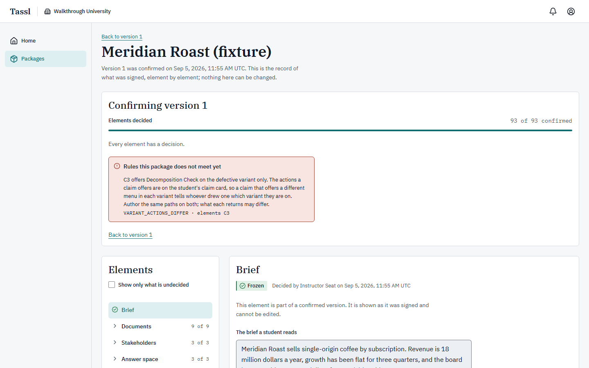

On a draft the description reads: "Read each element, edit what needs it, and record a decision. When
every element has a decision, the teaching-note check is ticked and the package rules pass, version
{version} can be confirmed — and is then frozen for good." On a frozen version it reads "Version
{version} was confirmed on {date}. This is the record of what was signed, element by element; nothing
here can be changed." — which is what the screenshot shows.

A version with nothing in it reads **This version has no elements yet** / "A version created from a
seed carries only the case behind it. Import a package document on the packages screen, or wait for
generation, and the elements to confirm appear here."

#### What it looks like on the first open, and what your seat can press

A freshly generated version opens with the whole job still in front of you. The progress bar reads
**0 of 93 confirmed** with "93 left to decide" under it; every leaf in the tree is undecided; the
**Brief** is selected for you and its editor is open on the right, carrying the decision chip
**Undecided** and a live count reading **159 of 200 words**.

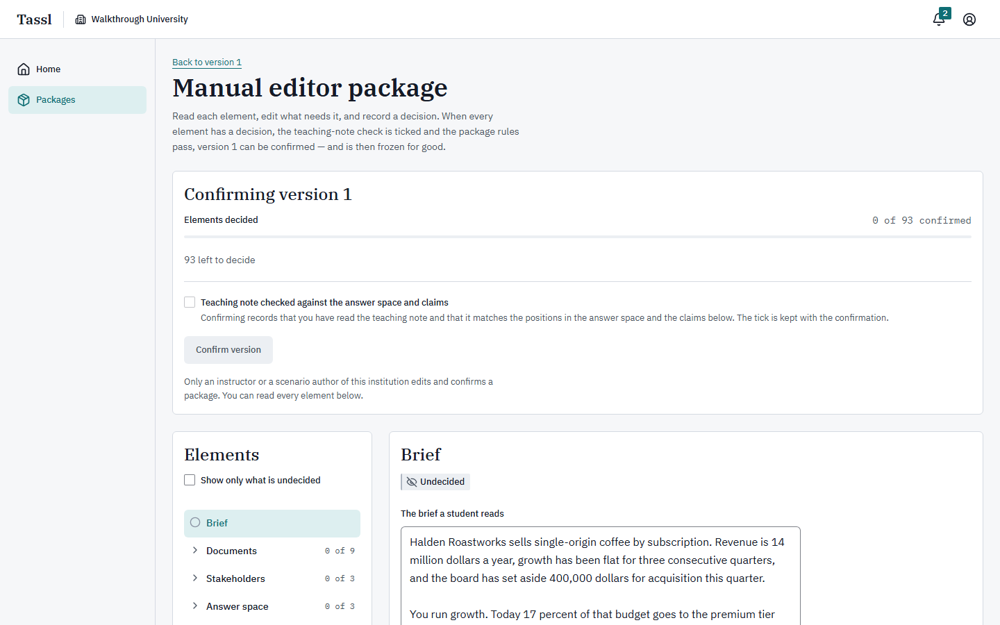

This is also the screen that shows your seat's one limit in the plainest possible way. Scroll the
editor down to its action bar, which screen readers announce as "Actions on this element". Four buttons
are drawn there, and on your seat three of them are grayed:

| Button | On the scenario author seat with the **Scenario editor** platform role | Why |
|---|---|---|
| **Save edits** | Grayed until you change something in the fields above, then live | Nothing has been touched yet. Its own note says so: "Nothing has changed in this element yet." Editing is open to you |
| **Confirm** | Grayed, always | Recording a decision is signing, and your platform role may not sign |
| **Reject** | Grayed, always | Rejecting is a decision too, and the same rule holds |
| **Rewrite** | Live | Asking the model for a new draft is authoring, not signing |

The screen says it in its own words, once beside **Confirm version** in the progress panel and again
beside the element's own action bar: "Only an instructor or a scenario author of this institution edits
and confirms a package. You can read every element below." The **Teaching note checked against the
answer space and claims** checkbox and the **Confirm version** button are drawn and grayed for the same
reason.

Read that sentence with the permission rule behind it, because the wording is broader than the effect:

- An instructor or a scenario author of this institution may edit, confirm, reject and freeze —
  *provided* their platform role is **None**, which an instructor's normally is.
- Your seat is a scenario author of this institution, so editing, discarding, rewriting and reading are
  all open to you; only the two decision buttons and **Confirm version** are not.
- A teaching assistant, a program lead, or anyone with no package seat does not get this screen at all:
  they read **This version is not yours to edit** with the same sentence under it.

So a package your seat builds is finished up to, and not including, the signature. Draft it, generate
it, correct every element, clear every rule — then hand the version to an instructor of the institution
(or to any scenario author whose platform role is **None**) to decide the elements and press **Confirm
version**. Nothing you have written is lost in the hand-off; the other seat opens the same workspace and
sees the same fields.

#### The element tree, and opening a group

The tree is the map of the version. Every group row carries its own "{decided} of {total}", so you can
see at a glance which part of the package is behind: **Documents** 0 of 9, **Stakeholders** 0 of 3,
**Answer space** 0 of 3, **Named fields** 0 of 2, **Claims** 0 of 24, **Question bank** 0 of 29,
**Readiness items** 0 of 16. The single-element types — **Brief**, **Sycophancy probe**, **The Turn**,
**Debrief counterfactual**, **General escalation reply**, **Clock and difficulty**, **Seed re-skin
log** — carry a status word instead of a count.

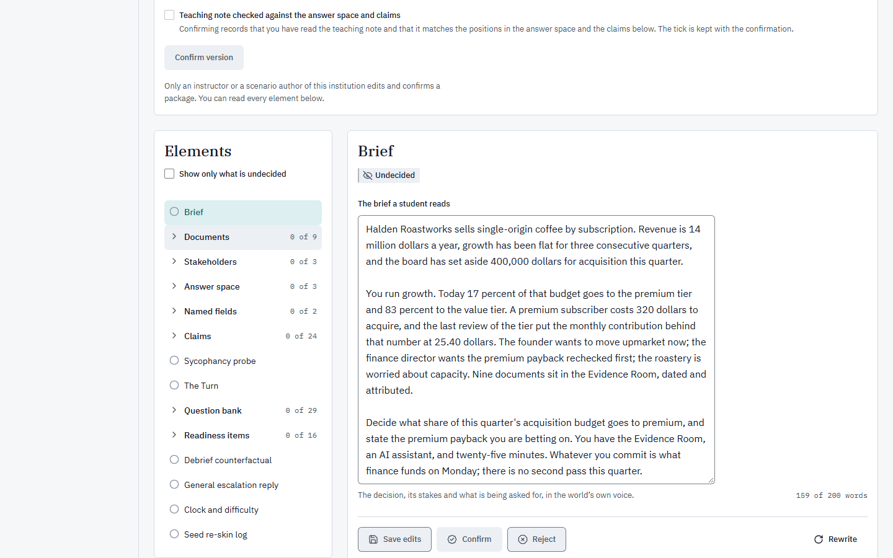

That shot is also where the action bar described above is visible: **Save edits**, **Confirm** and
**Reject** grayed, **Rewrite** the one live control.

Open a group and it lists its elements by the name they will be read under, with the element key in
mono underneath each one and a status marker beside it — the marker's accessible name is the status
word, **Undecided**, **Confirmed** or **Rejected**. **Documents** expanded on this draft reads down the
Evidence Room in order: "Premium Tier Positioning Review (July 2025 board deck)" as **D1**, "Retention
and Payback Memo: correcting the premium payback figure" as **D2**, "Founder note to the leadership
team" as **D3**, and on through to **D9**. Reading the nine titles in one column is the fastest check
that the model wrote a case with two defensible answers in it rather than nine documents saying the
same thing.

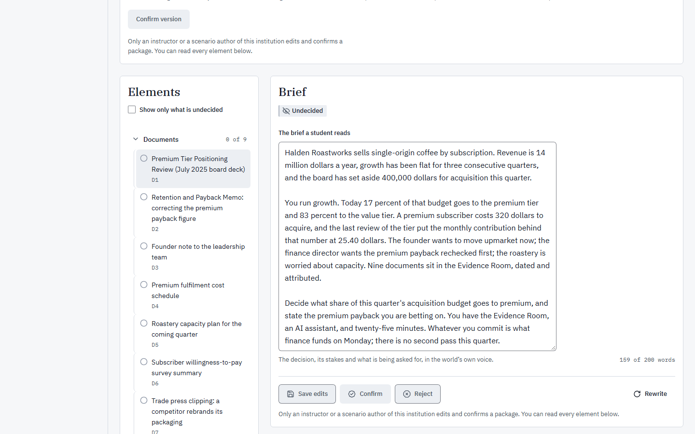

Clicking a leaf opens it in the editor on the right. While an editor is holding changes you have not
written yet, that element's tree row reads **Unsaved edits** — press **Save edits** or **Discard edits**
before you move on.

#### The element types

Fifteen types, grouped in the tree in this order. The plural is the group heading; the singular is
what the editor's heading calls it.

| # | Group | One element is | Shape |
|---|---|---|---|
| 1 | **Brief** | The brief a student reads | One only |
| 2 | **Documents** | One Evidence Room document | Many, keyed D1, D2, … |
| 3 | **Stakeholders** | One stakeholder | Many |
| 4 | **Answer space** | One answer-space position | Many |
| 5 | **Named fields** | One named numeric field | Many |
| 6 | **Claims** | One claim — and under it, **Claim fields**, **Defective variant** and **Sound variant** | Many; each claim is a small group |
| — | **Variant states** | One variant's reading of one claim | Normally nested under its claim |
| 7 | **Sycophancy probe** | The authored reversal | One only |
| 8 | **The Turn** | The message from the world | One only |
| 9 | **Question bank** | One defense question | Many |
| 10 | **Readiness items** | One Readiness Check item | Many |
| 11 | **Debrief counterfactual** | The three sentences read in the debrief | One only |
| 12 | **General escalation reply** | What the world answers when a claim has no reply of its own | One only |
| 13 | **Clock and difficulty** | The working clock, the Turn delay and the difficulty estimate | One only |
| 14 | **Seed re-skin log** | The seed record and what was changed from the case | One only |

Every element has a key — `D1`, `C3`, `defective:C3`, `brief`, `turn` — and the key is what rules
and links name. A key cannot be edited.

#### The three panels

**Panel 1, Confirming version {version}.** A progress bar labeled **Elements decided** reading
"{decided} of {total} confirmed", and under it **Every element has a decision.** or "{count} left to
decide" (or "1 left to decide"), plus "{count} rejected" when any are. **Next undecided element**
jumps you to the next one. A red band headed **Rules this package does not meet yet** lists every
unmet rule with its code and the elements it names — the seeded package's one failing rule sits there
in the screenshot. At the foot: the checkbox **Teaching note checked against the answer space and
claims** and the button **Confirm version**.

**Panel 2, Elements.** The tree, labeled "Elements of this version". On a narrow screen it collapses
into a select labeled **Element to review**. A checkbox **Show only what is undecided** filters it;
when the filter empties the list it says "Nothing is left undecided." Each group shows "{decided} of
{total}"; each leaf carries a status marker
whose accessible name is **Undecided**, **Confirmed** or **Rejected**, and **Unsaved edits** when the
editor is holding changes you have not saved.

**Panel 3, the editor.** Headed "{type} · {key}", for example "Document · D1". With nothing chosen:
**No element open** / "Choose an element on the left to read it and record a decision." Under the
heading sits a decision chip — **Frozen**, **Confirmed**, **Edited**, **Rejected** or **Undecided** —
and, once decided, "Decided by {name} on {date}" plus "revision {revision}" past the first.

Then the element's own fields. Every type has its own set; a few examples, since they are where the
rules bite:

- **Brief** — one textarea, *The brief a student reads*, capped at **200 words** with a live count.
- **Document** — *Title*, *Author*, *Dated*, *Role in the Evidence Room* (**Supporting**,
  **Superseded**, **Interpretation as fact**, **Accurate and irrelevant**), *Order*, *Superseded by*,
  *Belongs to*, and *Body* at up to 2,000 words.
- **Claim** — the claim text, *Stated by*, *Source document*, *Source passage*, *Importance*,
  *Consequence*, *Cost to verify*, *Concept*, *Weakly sourced*, *Volatile*, *Figures it carries*,
  *Trigger phrases*, *When it comes up*, *Can be escalated*, *Escalation reply*, and *What it
  deserved, and why*.
- **Variant state** — *Evidence*, *Failure family* (only when defective), *Warranted stance*, *The
  planted defect of this variant*, and the three *Verification paths* with an *Available* toggle each.
- **Clock and difficulty** — *Working clock* in seconds, 300 to 7200; *Turn delay* in seconds, 60 to 120; the difficulty estimate and its note.
- **Seed re-skin log** — *Case title*, *Publisher*, *License terms relied on*, *The license permits
  adaptation*, the re-skin rows, and the seed text.

Shared field messages: "This field needs a value.", "{count} of {limit} words", "At most {limit}
words; there are {count}."

#### Reviewing one element

1. Pick it in the tree (or press **Next undecided element**).
2. Read it against the case and against the rules named on it. If any rule names this element, a red
   box headed **Rules this element does not meet** sits above the fields with each sentence and code.
3. Change what needs changing.
4. Press **Save edits** (pending **Saving…**), or **Discard edits** to throw the changes away.
5. Record a decision — or, on your seat, ask an instructor to (see below).

A claim's editor also shows **What each variant makes of this claim** — "The two readings are
elements of their own and are confirmed separately. Open one to change what it says." — with **Open
the {variant} variant** links. A variant state shows **What this element belongs to** with its claim.

#### The decisions you can take

The action bar is grouped as "Actions on this element".

| Button | What it does |
|---|---|
| **Save edits** | Writes your changes. For an author of the institution whose platform role is **None**, the save itself records an **edited** decision — "{name} saved. The edit is recorded as its decision." For your seat it does not: "{name} saved. It still needs a decision." On an element that already carries a standing decision: "{name} saved. The decision already on it is unchanged." |
| **Discard edits** | Only shown while there are unsaved changes. Toast: "Edits to {name} discarded." |
| **Confirm** | Records that the element stands. Toast "{name} confirmed.", and the next undecided element opens. |
| **Reject** | Opens the reject panel. |
| **Rewrite** | Opens the rewrite panel. |

**Reject** asks for a reason: the panel is headed **Reject {name}** with "Say what is wrong with it.
The note is kept with the decision, and the element stays in the version until it is re-authored.",
one field **Why this element is rejected** (at most 1,000 characters, and required — "Say what is
wrong with it before rejecting."), then **Reject element** or **Cancel**. A rejected element is drawn
in red afterwards: **Rejected, and waiting to be re-authored** / "A rejected element keeps the version
from being confirmed until it is re-authored. Ask for a new draft with Rewrite, or edit the fields
below and save, which records the edit as its decision." with the note printed under it.

An element that already carries a standing decision is shown settled: "This element carries a
decision that stands. Reopen it to change a field; saving the change records a new decision on top of
this one." with **Reopen for editing**.

When the version is confirmed, every element reads **Frozen** / "This element is part of a confirmed
version. It is shown as it was signed and cannot be edited."

On your own seat, **Confirm** and **Reject** are drawn and grayed, with the line "Only an instructor or
a scenario author of this institution edits and confirms a package. You can read every element below."
beside them. **Save edits**, **Discard edits** and **Rewrite** all work; only signing does not. This is
the limit set out in full under [What it looks like on the first open](#what-it-looks-like-on-the-first-open-and-what-your-seat-can-press).

Two other refusals appear beside the bar when they apply: "Save or discard the edits in this element
before recording a decision on it." and "A new draft is being written. Nothing can be saved or
decided on until it lands, so that no decision is recorded against values about to be replaced."

#### Regenerating one element

**Rewrite** asks the model for a fresh draft. The panel is headed **Rewrite {name}** with the
sentence that matters: "A new draft is written for {scope}, this one included. Anything you have
confirmed is kept exactly as it is; everything else in that set is written afresh — including work
you have edited and saved but not confirmed — and needs a decision again."

The scope is never one element alone, because elements are written in sets:

| Element | What is rewritten with it |
|---|---|
| Brief, stakeholder, seed re-skin log | the brief, the stakeholders and the re-skin log |
| Document | every document in this version |
| Answer-space position, named field | the answer space and the named fields |
| Claim, variant state, general escalation reply | every claim, both variant readings of each, and the general escalation reply |
| Turn, probe, clock and difficulty | the Turn, the probe, and the clock and difficulty |
| Defense question, counterfactual | the question bank and the counterfactual |
| Readiness item | every Readiness Check item |

There is one optional field, **What the new draft has to get right (optional)** — "One or two
sentences, in your own words. They are given as a rule the new draft has to satisfy, beside the
package rules that are always checked." — up to 2,000 characters. Then **Rewrite {scope}** (pending
**Writing…**).

While it runs, an amber band at the top reads **Writing a new draft** / "A new draft of {name} and
everything written with it is on its way; it usually takes about a minute. This screen picks it up on
its own, and nothing you have confirmed changes." The workspace checks every five seconds. When it
lands: "The new draft of {name} is on the screen." — or, if you had unsaved edits open, "A new draft
of {name} arrived. Your unsaved edits are still on the screen; discard them to read it." If it fails:
"The new draft of {name} was not written, and nothing changed. Try again, or edit the element by
hand."

A confirmed element refuses a rewrite: "Reject this one first, and the new draft will replace it." A
rewrite also refuses while a generation run is going.

#### How the workspace tracks what is left

The progress bar is the count of elements carrying a decision that stands. A **rejected** element does
not count as decided — it counts against you until it is re-authored. The tree's per-group
"{decided} of {total}" tells you which part of the package is behind, and **Show only what is
undecided** collapses the list to the work remaining. If a confirmation is refused because something
is still undecided, a heading **Waiting on a decision** appears in the progress panel with one button
per outstanding element, labeled with its key; pressing one opens it.

### 5.7 Confirming a version

**What confirming means.** It is the signature. It says the elements of this version were read by a
person with the authority to stand behind them, and it freezes the version so that an assignment can
point at text that will never move under it.

**Who may do it.** An instructor or a scenario author of the institution whose platform role is
**None**. Your seat carries the platform role **Scenario editor**, so you cannot: the **Confirm
version** button is drawn and not available, with "Only an instructor or a scenario author of this
institution edits and confirms a package. You can read every element below." beside it. Everything up
to the signature is yours to do; the signature is not. Hand the finished version to an instructor of the
institution, or to any scenario author there whose platform role is **None**, and they press it.

**What it checks**, in this order, each with its own refusal:

1. Every element carries a decision that stands — **Confirmed** or **Edited**. A **Rejected** element
   counts as undecided. Refusal: "Every element needs a decision before the version can be
   confirmed." The outstanding ones appear as the **Waiting on a decision** buttons.
2. The box **Teaching note checked against the answer space and claims** is ticked. Its hint:
   "Confirming records that you have read the teaching note and that it matches the positions in the
   answer space and the claims below. The tick is kept with the confirmation." Refusal: "Confirm you
   have read the teaching note first."
3. Every package rule passes. Refusal: "This package does not yet meet the scenario rules." — and the
   failing rules replace the red band.

**The steps.**

1. Decide every element in the workspace.
2. Read the teaching note against the answer space and the claims, and tick the box.
3. Clear every rule listed in the red band.
4. Press **Confirm version**.
5. Read the dialog, headed **Confirm version {version}?** — "Confirming freezes version {version} for
   good. No element in it can be edited afterwards, and a change means a new version." It lists what
   is being signed: **Elements** ("{decided} of {total} decided"), **Rejected** ("{count} of them",
   only when there are any), **Package rules** (**All met** or "{count} not met yet"), and **Teaching
   note** ("Checked against the answer space and the claims, and kept with the confirmation" or **Not
   checked yet**).
6. Press **Confirm and freeze** (pending **Confirming…**), or **Not yet** to step back.

**What becomes immutable.** The version row, every element under it, the seed record, and the stored
copy of the whole package that the export is taken from. The screen goes read-only, every element
reads **Frozen**, and the toast reads "Version {version} is confirmed and frozen."

**There is no un-confirm.** A confirmed version cannot be edited by anyone, by any route, including
the person who signed it. Any change at all means a new version.

**What it unlocks.** A confirmed version is the only thing an assignment can run on. The moment it is
signed, every other instructor and scenario author of the institution is notified — **A scenario
package is ready to assign** / "{title} version {version} is confirmed and frozen, so it can be set
on an assignment." — and the version starts appearing in the assignment form's package list. The
shelf row flips from **Draft** to **Confirmed**.

### 5.8 Exporting and importing a package

**Export.** **Export package JSON**, at the top right of any version screen, downloads the whole
version as one file whose name is `tassl-package-` followed by the family key — for the seeded
package, `tassl-package-meridian-roast.json`. An instructor, a scenario author and a teaching assistant can
take it; a program lead cannot see the control at all, because that seat reads a version's measures and
nothing else (see [the program lead manual](06-program-lead.md)).

What is inside: the package's title, family key and discipline; the version's concept set, brief,
working clock, Turn delay, difficulty estimate, general escalation reply and debrief counterfactual;
the seed record; every document, stakeholder, answer-space position, named field and claim; both
variants with their claim states; the probe; the Turn; every defense question; every readiness item.
Every cross-reference inside it is an element key rather than a database id, which is what lets the
file move to another institution. The calibration status is deliberately left out.

Treat the file as you treat the seed record: it carries the answer key of the scenario. It is not for
students.

**Import.** **Import a package export** sits in the header of the **New package from a seed case**
screen, and nowhere else. It opens a dialog headed **Import a package export** with the description
"Paste a package JSON export. It arrives as a new family with its own draft version, and the family
key it carries must still be free here." One field, **Package JSON** — "The whole file, from the
first brace to the last." — then **Import** (pending **Importing…**) or **Cancel**.

An import creates a new family with its own draft version 1, whose elements are all
undecided. It never merges into a package you already have, and it never confirms anything: "The
package is on the shelf. Its elements are drafts until an authority confirms each one."

Refusals before the request is even sent: "Paste the export before importing." · "That is not JSON.
Paste the exported file exactly as it was written, with nothing before or after it." · "A package
export is a single JSON object. This is a value of another kind."

Refusals from the server:

| Situation | What you read |
|---|---|
| The document is not shaped like an export | "This document is not a package export Tassl can read:" then each problem, with "at {path}" and "elements {keys}" |
| The family key is already in use here | "This institution already has a package with the family key in that export. Change the family key in the file, or open the package you already have." |
| A reference to something the file never defines | "The document names {kind} "{key}" but never defines it. Every reference in an export is a key the same file has to declare." |
| Documents that supersede one another in a circle | "These documents supersede one another in a loop, so none of them can be the current one: {keys}." |

On success: "Package imported. Version 1 is a draft." — and, when every rule passes, "Every rule
passes. Confirm each element to freeze version 1, and an assignment can run on it." If rules still
fail it reads "Package imported. {count} rules still fail." and lists them under "These rules still
fail. The version is a draft and can be edited, but it cannot be confirmed until each one passes:".
Two buttons close it: **Close** and **Open the version**.

### 5.9 How an instructor uses your package

Once a version is confirmed, an instructor of the institution sets an assignment on it. On the
assignment screen they choose:

- **Scenario package version** — a select whose options read "{title} · version {version}", for
  example "Meridian Roast (fixture) · version 1". The hint is the whole of your contract with them:
  "Only a confirmed version can carry an assignment." Pointing an assignment at a draft answers "An
  assignment needs a confirmed scenario package version."
- **Variant** — two radios: **Defective**, described as "The assistant states one consequential claim
  that does not hold up.", and **Sound**, "Every consequential claim the assistant states holds up."
- **Working clock (seconds)** — optional. "The package sets {seconds} seconds. Leave this empty to
  follow it." So your **Clock and difficulty** element is the default every assignment inherits unless
  the instructor overrides it.

With no confirmed version anywhere in the institution the form reads **Confirm a scenario package
first** / "An assignment runs on a confirmed scenario package version. Confirm one, then configure the
assignment."

Once a run has started on that assignment the setup freezes: "A run has already started on this
assignment, so the package version, the variant, the working clock, and the weight cannot change."

**What the student meets from your package**, in the order they meet it: the sixteen **Readiness
Check** items; the **Brief**; the **Evidence Room** documents you wrote, with their dates, authors and
roles; the **AI assistant**, which states your claims verbatim when their trigger phrases match what
the student asks; the three checks you authored on each claim; the escalation replies; the **Turn**
after the decision lock; the defense questions drawn from your question bank; and afterwards, in the
debrief, your rationales, the warranted stances, and your three-sentence counterfactual. The answer
key — warranted stances, evidence status, failure families, the planted flag, the verification map,
your rationales, the concepts — is withheld until the run is scored, and the seed record and the
question bank are withheld always.

---

## 6. The AI assistant

**There are two different AI assistants in Tassl, and you only meet one of them.**

| | The generation model — yours | The run assistant — the student's |
|---|---|---|
| Where it is | The generation screen and the **Rewrite** control | The **AI assistant** panel of the run workspace |
| What it does | Drafts the elements of a version from your seed case, in seven steps | Answers a student's requests inside the scenario and raises your claims as cards |
| What it writes | A draft you then read, correct and sign | Its own connective prose only; every consequential claim is carried from your authored text, word for word |
| Who is responsible for it | You | You, for the claims; nobody, for the prose, which is why nothing consequential is left to it |

You never open the run assistant. You do not see anyone's delegations, and you cannot start a run.
What you control about it is the material: which claims exist, what they say, which trigger phrases
bring them up, which checks each one offers and what each returns, whether a claim can be escalated
and what the reply is, and the Sycophancy probe's scripted reversal. The assistant is never told
which claim is defective — that part of the package is not loaded while it answers — and the words
for the answer key are filtered out of anything it writes, so it cannot leak what you planted even by
accident.

**What you are responsible for checking.** Everything the generation model writes is a draft and
nothing more: "Nothing they write is part of a package until an author reads every element and decides
on it." The package rules catch structure — counts, splits, missing states, an uncatchable plant, a
concept outside the set, a placeholder a run cannot fill. They cannot catch sense. Read every element
for:

- whether the brief actually asks for a decision, and whether the documents support two defensible
  answers;
- whether each claim's text is true to the document behind it, and whether the figures reconcile;
- whether the planted defect is findable by the checks you authored, and consequential enough to change
  the decision;
- whether the warranted stance is the one you would defend to a student who disagreed;
- whether the rationale would teach something when a student reads it in the debrief;
- whether the re-skin log honestly describes what was changed from the licensed case.

**When the model is unavailable.** Generation is where you meet it. A step that errors, times out, or
is refused because the deployment's model budget is spent stops the pipeline: the step reads **Did not
finish**, the panel reads **Generation stopped**, and the red boxes name the rules it could not satisfy
and whatever the step answered. Nothing you have already confirmed is touched. Press **Run generation
again** once the cause is cleared — it resumes at the first step that has not finished. Two causes
will not clear by retrying: a spent model budget and a provider that has been shut off after repeated
failures; those need whoever runs the deployment. A rewrite that fails tells you so and changes
nothing: "The new draft of {name} was not written, and nothing changed. Try again, or edit the element
by hand."

**When the deployment runs the scripted assistant.** Some installations run with model calls switched
off entirely; a platform admin can also flip the whole deployment to the scripted assistant with no
redeploy. In that state every model call — the run assistant's and yours — is answered by Tassl's
built-in fixture. Generation still runs all seven steps and still writes a complete draft; it is
deterministic, effectively instant, and recorded at a cost of nothing, because no text leaves Tassl
and nobody is billed. What it writes is fixture material, not a reading of your seed case, so treat a
version drafted that way as scaffolding to write over rather than a draft to correct. The product is
whole either way: every screen in this manual works with no model available at all.

---

## 7. Notifications, settings, and account

### The bell

The bell sits in the header on every signed-in screen. Its accessible name reads "Notifications: No
unread notifications" or "Notifications: {count} unread", and a badge carries the number, showing
`99+` past ninety-nine. It re-reads the count once a minute while the tab is in front, and again the
moment you come back to it. Clicking it opens **Notifications**.

### The notifications screen

**Notifications** — "What Tassl has told you, newest first."

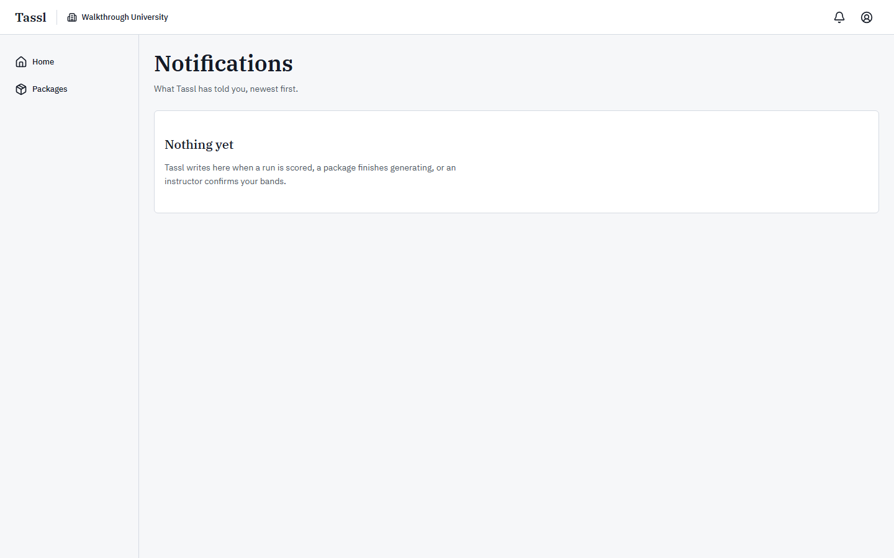

Twenty rows a page, newest first, with **Show more notifications** at the foot when there are more.
Above the list, **Mark all read** (toast: "Everything is marked read."); on each unread row,
**Mark read**; on any row carrying a link, **Open**. Each row shows a screen-reader label for its kind,
the title, the body and a UTC timestamp; unread rows are bold with a colored left rule. Empty:
**Nothing yet** / "Tassl writes here when a run is scored, a package finishes generating, or an
instructor confirms your bands." Marking a row that no longer exists toasts "That notification no longer
exists."

The ones your seat can actually receive:

| Kind | Title | When | Where it links |
|---|---|---|---|
| **Package generated** | "Your scenario package has been drafted" | All seven generation steps finished on a package you created. The body is either "All seven generation steps finished and the draft meets every scenario rule. Open it to confirm the elements one at a time." or "All seven generation steps finished. The draft still breaks {count} scenario rules, which are listed on the generation screen." | That version's generation screen |
| **Generation stopped** | "A generation step could not be completed" | A step did not meet the rules after a second attempt, on a package you created. The body reads "One step did not meet the scenario rules after a second attempt, so it has stopped. The generation screen names the rules; you can run the step again or author that part by hand." | That version's generation screen |
| **Package confirmed** | "A scenario package is ready to assign" | Someone else confirmed a version in your institution: "{title} version {version} is confirmed and frozen, so it can be set on an assignment." | That version screen |

You never receive run notifications: no run is yours and you review none.

No notification ever carries a band, a count, a rate or any student's words, because notifications are
also sent by email. Whether email copies are sent at all is set for the whole installation by whoever
runs it — there is no per-person setting, and no unsubscribe.

### Settings

Account menu → **Settings**. Three real pages under one heading, **Account settings** / "Your profile,
your password and devices, and your data.", with a tab strip: **Profile**, **Security**, **Data**.

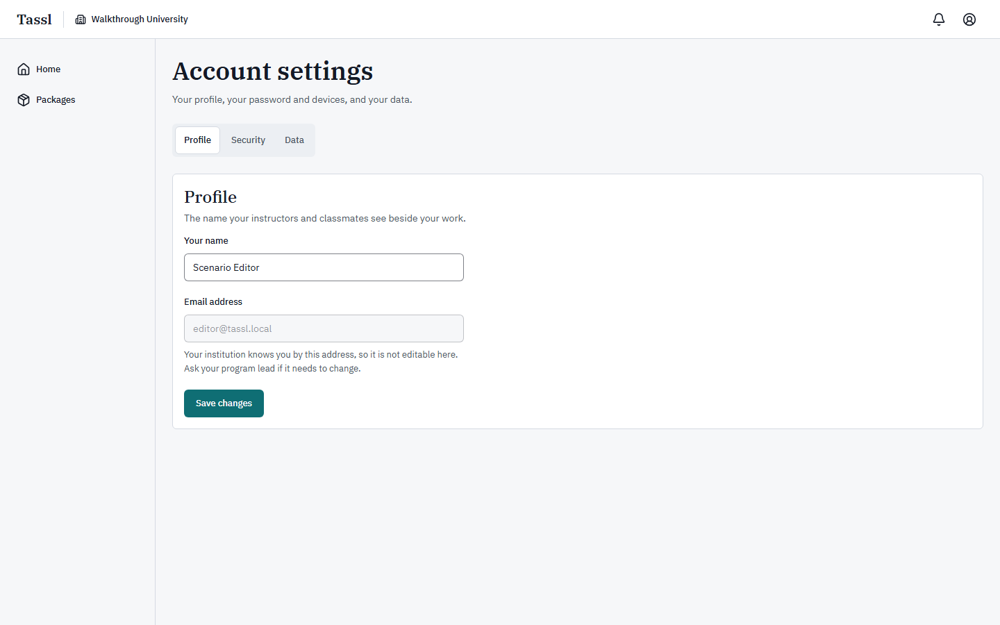

**Profile** — "The name your instructors and classmates see beside your work."

| Field | Notes |
|---|---|
| **Your name** | Editable, 1 to 120 characters. Empty → "Enter your name."; too long → "Use 120 characters or fewer." |
| **Email address** | Disabled. "Your institution knows you by this address, so it is not editable here. Ask your program lead if it needs to change." |
| **Save changes** | Toast: "Your name is saved." |

There is no way to change your email address anywhere in Tassl. Your name is what appears in the
**By** column of every confirmation record, so keep it the name your colleagues would recognize.

**Security** — two panels.

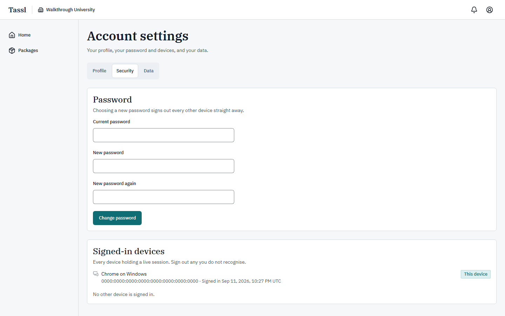

**Password** — "Choosing a new password signs out every other device straight away." Three fields,
**Current password**, **New password** and **New password again**, then **Change password**. Success:
"Your password is changed. Other devices are signed out." Errors: "That is not your current
password." · "Use between 12 and 128 characters." · "Both passwords must be the same."

**Signed-in devices** — "Every device holding a live session. Sign out any you do not recognise."
Each row reads like "Chrome on Windows", with the address and "Signed in {date}" under it. The one
you are using is marked **This device** and has no sign-out button; every other row has **Sign out**,
and a **Sign out every other device** button sits under the list. With nothing else signed in, the
line reads **No other device is signed in.**

**Data** — two panels, the download first on purpose.

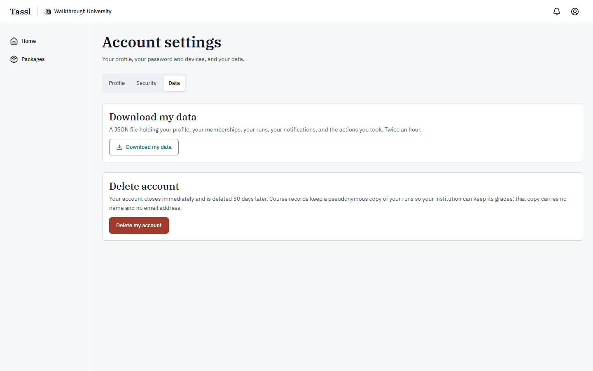

**Download my data** — "A JSON file holding your profile, your memberships, your runs, your
notifications, and the actions you took. Twice an hour." The button downloads a file called
`tassl-my-data.json`. Asking a third time inside an hour answers "You can download your data twice an
hour. Try again shortly." The file holds your profile, your institution and section memberships, your
notifications and the audit rows where you are the one who acted. It does **not** hold the packages
you authored — those belong to the institution, and a version's own file comes from **Export package
JSON**.

**Delete account** — "Your account closes immediately and is deleted 30 days later. Course records
keep a pseudonymous copy of your runs so your institution can keep its grades; that copy carries no
name and no email address." **Delete my account** opens a dialog headed **Delete your account?** —
"You are signed out straight away and cannot sign in again. After 30 days everything Tassl holds about
you is deleted; the pseudonymous course record of your runs stays with your institution." You must
type your own address into **Type {email} to confirm** before the confirm button works; **Keep my
account** backs out. Packages you authored and decisions you recorded stay with the institution.

### The account menu, and signing out

The trigger in the header is named **Account: Scenario Editor**. It shows your name and address, then
**Settings**, **Privacy**, **Terms**, and **Sign out**.

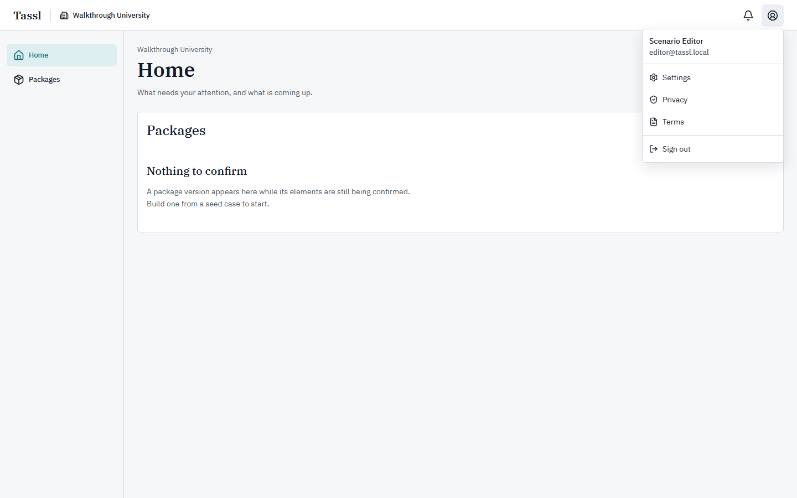

**Sign out** ends this session and lands you on the sign-in screen. If it fails, the page stays and a
toast reads "Signing out did not work. Try again."

---

## 8. Common situations

**I want to build a scenario from a case I have licensed.** **Packages** → **New package from a seed
case** → fill **The package** and **The seed case** → tick **The license permits adaptation** →
**Create and generate**.

**I want to create the package now and write its elements myself.** **Packages** → **New package from
a seed case** → fill both panels → **Create the package** → **Open version 1** → **Open the
confirmation workspace**.

**I want to see how far generation has got.** **Packages** → the package → **Generation**. The steps
show **Waiting**, **Running**, **Done** or **Did not finish**, and the screen updates itself every
five seconds.

**I want to restart generation after a step stopped.** **Packages** → the package → **Generation** →
the failed step's **Run generation again**. Steps already done are not re-run, and confirmed elements
are kept.

**I want to fix a rule the pipeline could not satisfy.** **Generation** → under **Rules this package
does not meet yet**, press **Open {key}** → correct the fields → **Save edits**.

**I want to read one claim in full, including what it deserved.** **Packages** → the package → scroll
to **Claims** → click the claim's row → read, then **All claims** to go back.

**I want to check the planted defect is catchable.** Open the claim, read **Per variant** →
**Defective variant** → **How a student could check it**, and confirm a **Source Trace** or, for an
arithmetic or method defect, a **Replication Check** returns enough to refuse the claim.

**I want to correct a document the model got wrong.** **Packages** → the package → **Open the
confirmation workspace** → **Documents** → the document → edit → **Save edits**.

**I want the model to have another go at the claims.** In the workspace, open any claim → **Rewrite**
→ write what the new draft has to get right → **Rewrite every claim, both variant readings of each,
and the general escalation reply**. Anything you have already confirmed survives untouched.

**I want to say what is wrong with an element rather than fix it myself.** In the workspace, open it →
**Reject** → fill **Why this element is rejected** → **Reject element**. (On your seat this button is
inert; ask an instructor of the institution.)

**I want to find what is still undecided.** **Open the confirmation workspace** → tick **Show only
what is undecided**, or press **Next undecided element**.

**I want this version signed so an assignment can run on it.** Finish the workspace, tick **Teaching
note checked against the answer space and claims**, clear every rule, then ask an **instructor** of
the institution to press **Confirm version** → **Confirm and freeze**. Your platform role cannot sign.

**I want to move a package to another institution.** On the version screen, **Export package JSON**;
in the other institution, **Packages** → **New package from a seed case** → **Import a package
export** → paste the file → **Import**.

**I want to know what building this version cost.** **Packages** → the package → **Authoring
measures**: **Seed to confirmed**, **Edit rate**, **Rejected share**, **Generation passes**, **Review
time per element**.

**I want to know who signed a version and what they changed.** **Packages** → the package →
**Confirmation record** → read **Decisions by element type**, then **Decisions that were not a plain
confirmation**, then open **All {count} decisions, newest first**.

To practice the whole flow once with someone else's words for each click, work through Task 11 of
[the instructor guide](../guides/instructor-guide.md), which builds a package from a seed case end to
end; Task 5 of the same guide walks a finished one screen by screen.

---

## 9. Error messages and what they mean

### Creating a package

| Message | When | What to do |
|---|---|---|
| **The package was not created. Put these right and create it again:** | Any field on the create form is wrong | Each bullet links to its field |
| "Give the package a title." / "A title is at most 200 characters." | **Title** empty or too long | Name it in 200 characters |
| "Give the family a key." / "A family key is 3 to 60 characters of lowercase letters, digits and hyphens." | **Family key** empty or malformed | Lowercase letters, digits and hyphens only |
| "This institution already has a package with that family key. Change it and create again." | Another package here already uses the key | Change the key |
| "Add at least four concepts." / "A concept is 2 to 60 characters." / ""{concept}" is already in the set." | **Concepts** short, long, or duplicated | Add four distinct concepts |
| "Name the case this package is adapted from." / "Name who published the case." | **Case title** or **Publisher** empty | Fill them |
| "State the license terms you are relying on." / "The license terms are at most 4,000 characters." | **License terms** empty or too long | Summarize the clause you rely on |
| "Confirm that the license permits adaptation. Tassl will not build a package from a case without it." | The checkbox is unticked | Tick it, or do not build from that case |
| "Paste at least 200 characters of the case." / "The seed case text is at most 200,000 characters. Leave out the appendices, or split the case across two packages." | **Seed case text** short or long | Paste the case body without appendices |
| "A package can only be built from a seed whose license permits adaptation." | The tick reached the server unset — the form normally catches this first | Tick **The license permits adaptation** and create again |

### Generation and rewriting

| Message | When | What to do |
|---|---|---|
| "Generation is already running on this version." | You started generation, or asked for a rewrite, while a step is queued or running | Wait for it to finish |
| "This version has no seed case to generate from." | The version carries no seed record — usually an imported package | Write its elements by hand |
| "This version is confirmed, so it can no longer be changed." | Any write to a frozen version | Nothing can change it; a change is a new version |
| "That element is confirmed. Reject it first, and the regeneration will replace it." | **Rewrite** on a confirmed element | Reject it, then rewrite |
| "The new draft of {name} was not written, and nothing changed. Try again, or edit the element by hand." | A rewrite failed | Retry, or edit the fields yourself |
| **What this step could not satisfy** | A step stopped after two attempts | Open the element each rule names and settle it by hand |

### The workspace and confirming

| Message | When | What to do |
|---|---|---|
| "This field needs a value." | A required field was cleared | Fill it |
| "At most {limit} words; there are {count}." | A word limit is exceeded — the brief at 200, a document body at 2,000 | Cut it back |
| "This has to be a JSON object, for example {"stance":"accept"}." | A defense question's **Condition** is not an object | Leave it as `{}` to always allow the question |
| "An element cannot be its own {field}." | A document was pointed at itself in *Superseded by*, or a claim at itself | Name a different element, or clear the field |
| "{field} must name a {kind} of this package version." | A field names a key this version does not hold | Pick a key from this version |
| "Say what is wrong with it before rejecting." | **Reject** with an empty note | Write the reason |
| "Save or discard the edits in this element before recording a decision on it." | A decision was pressed with unsaved edits open | **Save edits** or **Discard edits** first |
| "A new draft is being written. Nothing can be saved or decided on until it lands, so that no decision is recorded against values about to be replaced." | A rewrite is in flight | Wait for it to land |
| "Reject this one first, and the new draft will replace it." | **Rewrite** on a settled element | Reject, then rewrite |
| "Only an instructor or a scenario author of this institution edits and confirms a package. You can read every element below." | Beside the inert **Confirm** / **Reject** / **Confirm version** buttons on your seat | Ask an instructor of the institution to sign |
| "{name} saved. It still needs a decision." | You saved an edit and your seat cannot sign | The edit is kept; the element is still undecided |
| "Every element needs a decision before the version can be confirmed." | **Confirm version** with elements undecided or rejected | Use the **Waiting on a decision** buttons |
| "Confirm you have read the teaching note first." | **Confirm version** with the box unticked | Read it, tick it, confirm again |
| "This package does not yet meet the scenario rules." | **Confirm version** with rules failing | Fix each rule listed in the red band |

### Importing

| Message | When |
|---|---|
| "Paste the export before importing." | The field is empty |
| "That is not JSON. Paste the exported file exactly as it was written, with nothing before or after it." | The paste is not JSON |
| "A package export is a single JSON object. This is a value of another kind." | The paste is JSON but not an object |
| **This document is not a package export Tassl can read:** | The shape is wrong; each problem is listed with "at {path}" |
| "This institution already has a package with the family key in that export. Change the family key in the file, or open the package you already have." | The family key is taken here |
| "The document names {kind} "{key}" but never defines it. Every reference in an export is a key the same file has to declare." | A dangling reference |
| "These documents supersede one another in a loop, so none of them can be the current one: {keys}." | A supersession cycle |
| **The package was refused because it breaks rules that must pass before a version can be confirmed:** | The document reads as an export but the version it describes fails package rules |
| "The document is not shaped the way an export is." | A problem the dialog cannot place at any one field |
| "and {count} more" | Under a long list of problems; the dialog shows the first few |
| "That file is not a Tassl package export." | The document is not an export at all |

### Signing in, your account, and the whole request

| Message | When | What to do |
|---|---|---|
| "That email address and password do not match an account." | Sign-in with a wrong address or a wrong password | It never says which of the two was wrong; try both |
| "Too many attempts. Try again in {seconds} seconds." | Ten failed sign-ins on one account inside a minute | Wait the seconds out |
| "Sign in to continue." | A session ended while the page was open | Sign in again; the page reloads where it was |
| "This account has been deleted." | The account was closed while you were still signed in on another device | Nothing; the account is closed |
| "Too many requests. Try again shortly." | More requests in a minute than a deployment allows — the readable limit is 600 reads and 60 writes a minute per person | Wait a moment and repeat the action |
| "That request body is too large. The limit is one megabyte." | A pasted package export over a megabyte | Split the case across two packages, or trim the export |
| "That package no longer exists." — and the same sentence for a package version, an element or a claim | A link or an open tab points at something that has gone since | Go back to **Packages** and open it again |
| "That is not your current password." / "Use between 12 and 128 characters." / "Both passwords must be the same." | **Change password** on **Security** | Correct the field named |
| "The device list could not be loaded." | **Signed-in devices** could not be read | Reload the page |
| "The download did not start. Try again in a moment." | **Download my data** failed | Try again |
| "You can download your data twice an hour. Try again shortly." | A third data export inside an hour | Wait |
| "The account was not deleted. Try again." | **Delete my account** failed | Try again |
| "Signing out did not work. Try again." | **Sign out** failed | Press it again |

### Whole-screen refusals and empty states

| What you see | When |
|---|---|
| **Not found** / "There is nothing at this address. It may have moved, or the link may be wrong." / **Go home** | The review area, the admin area, a package of another institution, or a package or version that does not exist |
| **Packages are not open to your seat** / "Only an instructor or a scenario author reads and writes packages in {name}. If you should be one, an administrator of the institution can change your seat." | A seat without package rights on the shelf |
| **No institution yet** / "Packages belong to an institution. Once you accept an invitation to one, the packages you may author appear here." | An account with no membership |
| **This version is not yours to edit** / "Only an instructor or a scenario author of this institution edits and confirms a package. You can read every element below." | A reader on the confirmation workspace |
| **This version is not yours to generate** / "Only an instructor or a scenario author of this institution runs generation on a package. You can read this version and its record." | A reader on the generation screen |
| **No packages yet** | The shelf, with no package in the institution |
| **This version has no elements yet** | The workspace on a version created from a seed with no generation run and no import |
| **No element open** / "Choose an element on the left to read it and record a decision." | The workspace with nothing selected |
| "Nothing is left undecided." | **Show only what is undecided** with nothing left |
| **Nothing has been decided yet** | The confirmation record on a version nobody has decided on |
| **No claims yet** | The claims panel on a version with no claims |
| "No passage is quoted from the source document." / "This claim carries no figure of its own." / "No rationale is written for this claim yet." | A claim object with those parts unauthored |
| "No variant of this version says anything about this claim yet." | A claim with no variant states written |
| "No interrogation action returns anything for this claim in this variant." | A variant state with no check results authored |
| **No courses yet** on **Courses**, **No assignments yet** on **Runs** | Addresses that open for you but hold nothing, because you have no section seat |
| **Generation has not run on this version** | The generation screen before a first run |
| **Nothing to confirm** | The Home packages region with no version mid-confirmation |
| **Nothing yet** | Notifications, with none |
| **Something went wrong** / "The problem has been recorded. If it continues, quote the reference below." | An unexpected failure. Quote the **Reference** if you report it |

---

## 10. Glossary

**Answer space** — The authored set of positions the decision can take, each marked **Defensible** or
**Inconsistent with the evidence**, exactly one of them the minimum defensible commitment.

**Assignment** — One section's pointer at one confirmed package version, carrying the variant, the
working clock and the weight a run is taken under. Instructors make these, not you.

**Claim** — Something the assistant states that a student has to take a position on, carried to them
as your exact authored text.

**Concepts** — The ideas a run on this package exercises, declared when the package is created and
shown on the version screen as **Concepts it exercises**. A course matches what it teaches against them,
and every planted defect must sit inside the set.

**Confirm** — The button that records that an element stands as written. **Edited** counts as a
decision too; **Rejected** does not.

**Confirm version** — The button that freezes a version for good and makes it assignable. Only an
instructor or a scenario author of the institution whose platform role is **None** can press it; an
account carrying any platform role never can.

**Confirmation record** — Every decision an author took on an element of a version, newest first, with
the revision it was taken on.

**Counterfactual** — Exactly three author-written sentences read in the debrief about how the scenario
could have gone; the same for everyone, about no particular run.

**Defense question** — One question from the bank a student answers unaided after the Turn. Students
never see the bank or the expected-answer notes.

**Element** — One confirmable unit of a version: a document, a claim, a variant state, the Turn, the
brief, and so on. Fifteen types. Each carries a short key — `D1`, `C3`, `defective:C3`, `brief` — that
every rule and link names, and that cannot be edited.

**Evidence Room** — Every document of the scenario, all open to the student in any order.

**Evidence status** — The author's per-variant mark on a claim: **Sound** or **Defective**.

**Failure family** — The kind of wrong a defective claim carries: **Near neighbor**, **Unstated
assumption**, **Stale evidence**, **Uncomputed number**, **Extrapolation**, **Reversal to agree**,
**Omitted alternative**, **Misapplied method**, **Misattributed source**, **Unacceptable route**.

**Family key** — The lineage a package belongs to, keyed by a lowercase slug that is unique in the
institution and travels with every export. The words "family" and "package" name the same lineage.

**Generation** — The seven-step pipeline that drafts a version's elements from the seed case. Nothing
it writes is part of a package until an author decides on each element.

**Institution** — The tenant that owns the packages, courses and rosters. Here, Walkthrough
University.

**Interrogation action** — One of the three checks a student can run on a claim: **Source Trace**,
**Replication Check**, **Decomposition Check**. You author what each returns, per variant.

**Named field** — An authored numeric field the decision rests on, in a declared unit.

**Package rules** — The machine-checked constraints a version has to satisfy before it can be
confirmed. Thirty-three of them; each prints its own sentence with the elements it names.

**Planted defect** — The one defective claim state the **Defective** variant carries. The **Sound**
variant carries none.

**Platform role** — A right over Tassl itself, not a seat in an institution. Yours is **Scenario
editor**; the values are **None**, **Scenario editor** and **Platform admin**.

**Re-skin log** — The record of what was changed from the licensed case: renamed entities, altered
numbers, restructured documents. A version cannot be confirmed without one.

**Readiness Check** — Sixteen four-option items a student answers before the run. Unscored, and it
never blocks the run.

**Rewrite** — Asking the model for a new draft of an element and everything written with it, keeping
anything already confirmed.

**Scenario author** — The institution seat that lets you read and write that institution's packages.

**Scenario package** — One decision case: the brief, the documents, the claims the assistant states,
and the questions a student answers afterwards.

**Seed case** — The licensed published case a package is adapted from. Kept with the package; no
student ever sees it.

**Stance** — The student's position on a claim: **Accept**, **Verify**, **Challenge**, **Reject**,
**Escalate**.

**Sycophancy probe** — The authored reversal in which the assistant changes its position after a
student pushes back. It is scripted, identical for everyone, and says nothing about the claim.

**Teaching note check** — The author's recorded tick that they read the teaching note and it matches
the answer space and the claims. Required before a version can be confirmed.

**The Turn** — A message from the world that arrives after the student locks the decision and reopens
the run so they can hold, revise or reverse.

**Uncalibrated** — No cohort has run this version, so its difficulty figure is the author's own
estimate. Every version in this build reads this way.

**Variant** — One of two readings of a version's claims: **Defective** plants exactly one consequential
defect; **Sound** plants none. Both are created with every version; an assignment picks one.

**Version** — One revision of a package family. **Draft** while it can be edited; **Confirmed** once
it is frozen; an assignment runs on exactly one confirmed version.

**Warranted stance** — The stance the authored material deserved. Never shown to a student before
their run is scored.
