# Teaching assistant manual

This file is for the person who holds a teaching-assistant seat on a section: the seat that reads
runs beside the instructor. After reading it you can sign in, work the review queue, read any run of
your section end to end — its graphs, its bands, its trace, its scenario package and its delegation
log — decide the bands the instructor has not decided, mark a delegation as outside the scenario,
download a course export, and hand the instructor what you found. It also tells you, exactly, where
your seat stops.

---

## 1. Who you are in Tassl

Tassl gives you three separate seats, and they do different jobs:

| Seat | Yours | What it decides |
|---|---|---|
| Platform role | None | Rights over Tassl itself. Yours grants nothing beyond your own account. |
| Institution role | **Teaching assistant** | What you may do across the institution: for you, read a course you hold a section seat in, and nothing more. |
| Section role | **Teaching assistant** | What you may do with the runs of one section: read them and decide bands. |

The section seat is the one that matters. Everything in this manual is available to you because
an instructor put you on the roster of a section as a **Teaching assistant** — from the section's
**Add member** panel, with **Role in this section** set to **Teaching assistant**, or by an
invitation carrying that seat. You have it on one section at a time; a second section needs a second
roster row. The instructor manual describes the panel under
[Adding someone](01-instructor.md#adding-someone).

### You can

- Open **Review**, the queue of runs in your own sections that have bands to decide.
- Open the replay of any run in those sections and read all five views — **Overview**, **Bands**,
  **Trace**, **Package**, **Actions**.
- Read everything a reviewer reads: the four graphs, the defense transcript with the author's
  **Expected-answer notes**, the Readiness Check reading, the outside-tool declarations, the
  delegation log with its guard marks, the claim table with each claim's **Evidence on this variant**
  and **Warranted stance on this variant**, and the run's whole trace.
- Decide a band on a run whose state is **Scored** — confirm the draft, record a different band, or
  record the dimension as **Unassessed** — on any dimension the instructor has not already decided.
- Press **Confirm the remaining drafts**, which takes the drafts on every dimension nobody has
  decided.
- Set all seven bands by hand on a run nothing could place (**Band this run by hand**).
- Press **Mark as outside the scenario** on a delegation.
- Read an assignment's course-export history and download any filed export.
- Open the package version a run was drawn from, in full, minus the seed record.
- Manage your own account: name, password, devices, data download, account closure.

### You cannot

- Change a band the instructor decided. The control is replaced by a sentence saying so.
- Decide any band once the run is **Confirmed** or **Recorded** — from that point only the
  instructor can change one.
- Void a run, offer another in its place, or enter a correction on a claim.
- Arm the assistant-outage test control.
- Create or edit a course, a section, an assignment, a roster or a band mapping.
- Invite anyone to the institution, or add anyone to a section.
- Read the seed record — the licensed case a scenario package was adapted from.
- Take a run yourself, or reach the **Admin** area or the **Packages** shelf.
- See another section's runs, or any run of a course you hold no seat in. Those answer as though
  they do not exist.

### How your seat sits beside the others

The instructor of the section owns the run: they decide bands, they may re-decide after
confirmation, and voiding, re-offering and corrections are theirs alone. Your seat exists so that a
second pair of eyes can read the evidence and put a decision on the record, and so that the
instructor's decision is always the last word. The student sees none of what you read until their
run is scored, and never sees the answer key material at all. A program lead reads courses and
rosters but no runs. A scenario author writes packages and reads no runs. A platform admin runs
Tassl itself and, holding no seat in your institution, sees none of this.

### What happens when you open something your seat does not hold

There are three different answers, and it is worth knowing which is which.

**The Admin area answers "Not found".** Tassl does not say "you are not allowed"; an address you
have no business at is simply nothing. You get **Not found**, "There is nothing at this address. It
may have moved, or the link may be wrong.", and a **Go home** link.

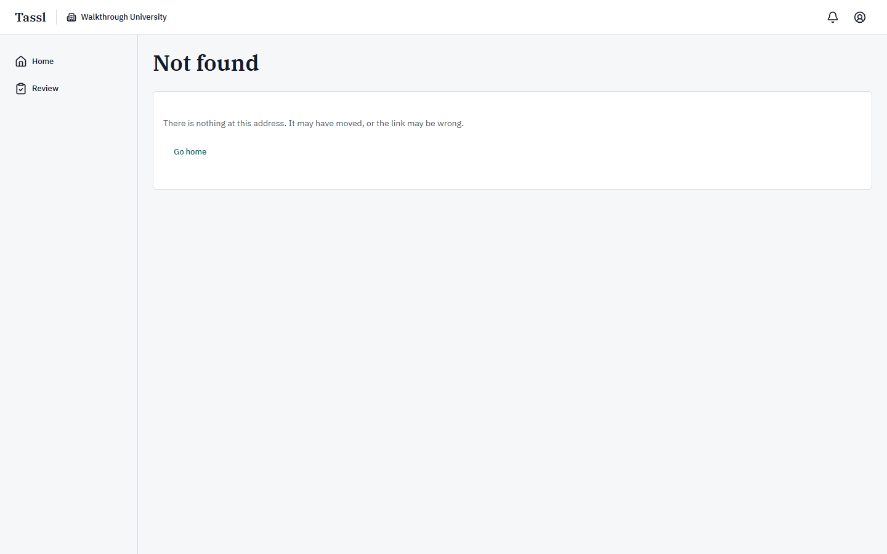

The same **Not found** page answers an assignment's own screen, a section roster, a student's run
screens, and any run outside your sections. Note this one trap: the replay's eyebrow link **Back to
the assignment** points at that assignment screen, which your seat does not hold — so following it
lands you on **Not found**. Go back to **Review** instead.

**Packages says so in words.** The shelf explains rather than hides: "Packages are not open to your
seat" and "Only an instructor or a scenario author reads and writes packages in Walkthrough
University. If you should be one, an administrator of the institution can change your seat."

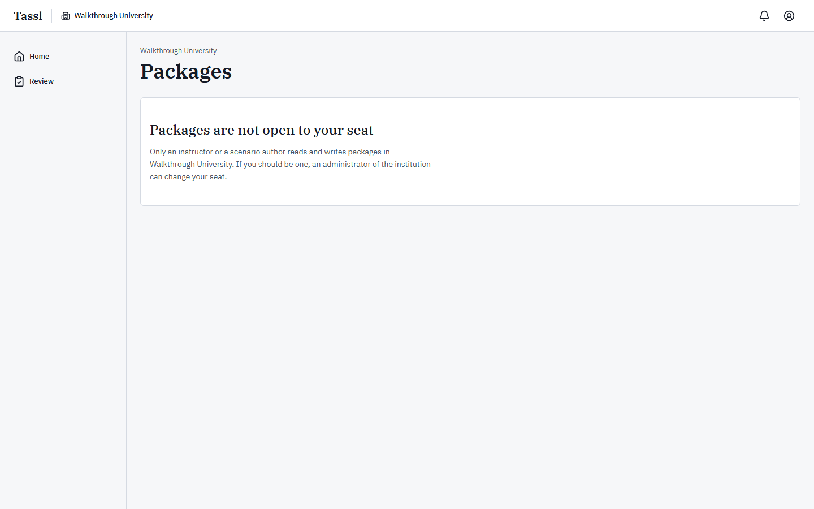

One exception, and it is deliberate: the **Open the package version** link on a replay's **Package**
view does work. You may read the version a run was drawn from; you may not browse the shelf.

**Courses opens, read-only.** There is no **Courses** item in your rail, but the screen still
answers, and it lists the courses you hold a section seat in — here, one row. It is headed
**Courses** / "Every course in this institution, with the sections that hold its rosters and the
assignments a run starts from.", and the table **Courses in this institution** carries **Course**,
**Term**, **Sections** and **Assignments**. The course name is a link, **Open {name}**, and the
course behind it opens read-only: none of the instructor's controls for sections, assignments,
policy or mapping is drawn for your seat.

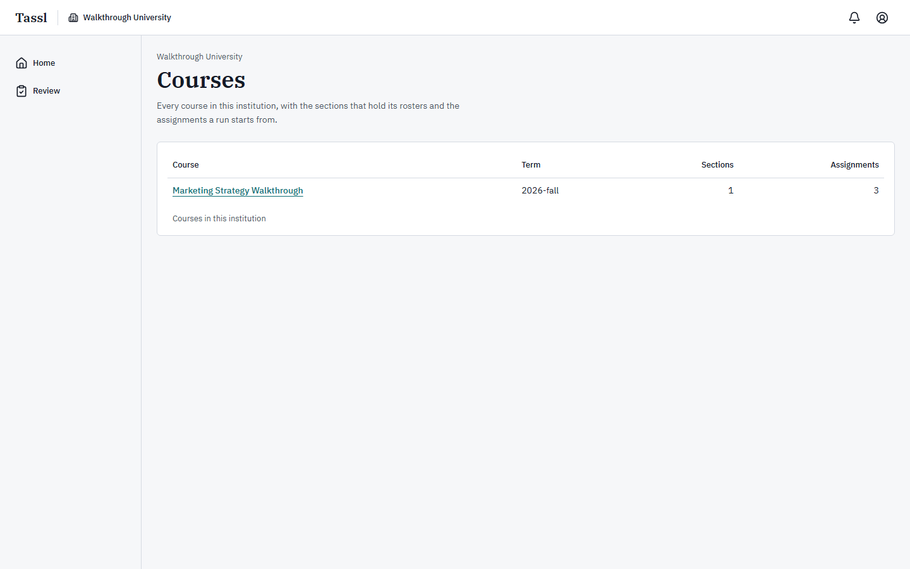

**Runs opens, and its buttons refuse.** The same is true of the student's own **Runs** screen: your
section seat puts the section's assignments on it under **Assignment**, **Attempt**, **State** and
**Next**, each row reading **Not started** and carrying a **Start** button. Pressing one is refused
with "Only a student on this assignment’s section can start a run." Nothing is created.

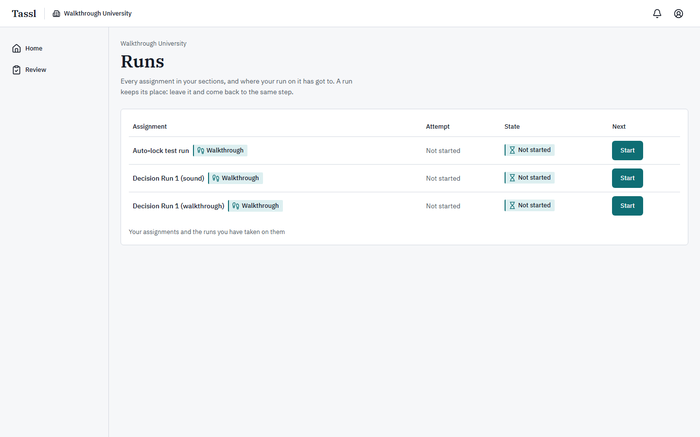

---

## 2. Signing in and your home screen

### Signing in

Go to the Tassl address your institution gave you and sign in at **Sign in to Tassl**. The screen
carries the description "Use the email address your institution knows you by.", an **Email address**
field, a **Password** field, a **Keep me signed in** checkbox (ticked for you), the **Sign in**
button, a **Forgot your password?** link, and "No account yet?" with **Create an account**. Under
them sit **Privacy** and **Terms**.

A teaching-assistant seat is not one of the accounts a seeded installation comes with. The seed
writes five: the instructor, two students, a scenario editor and a platform administrator. The
screenshots in this file were taken on a teaching-assistant seat added to the seeded institution
**Walkthrough University** the ordinary way — an instructor added the address to section A with
**Role in this section** set to **Teaching assistant** — and on that installation it signs in as
ta@tassl.local. To follow along, ask whoever administers your installation to add such a seat for
you.

The sign-in, sign-up, password-reset and email-confirmation screens are the same for every seat and
are covered screen by screen in [the learner manual](02-learner.md); this file does not repeat them.

Three rules worth carrying:

- A password is between 12 and 128 characters, with no other composition rule.
- Changing your password signs out every other device at once.
- If your session has expired, opening any Tassl address sends you to the sign-in screen and brings
  you back to the address you asked for once you are in.

### Your home screen

Home says what needs your attention. The header carries the **Tassl** wordmark, the institution name
(**Walkthrough University**), the notifications bell, and your account button. The rail down the
left side holds exactly two items — **Home** and **Review**.

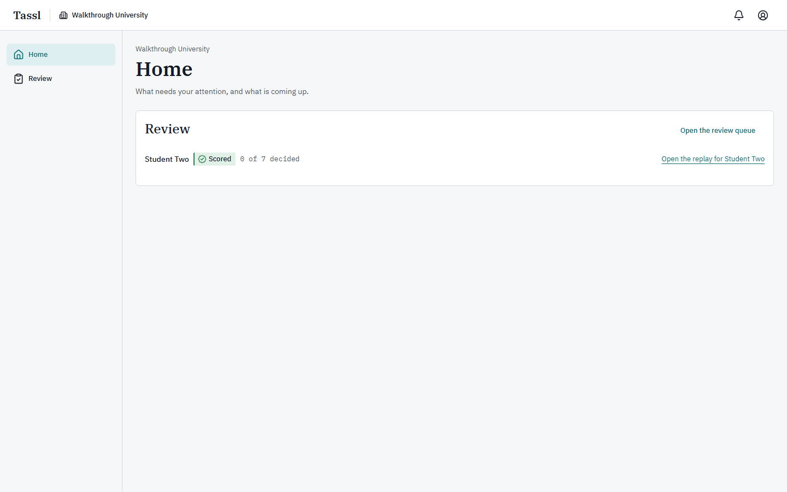

| Region | What it holds |
|---|---|
| Page heading | **Home**, with "What needs your attention, and what is coming up." |
| **Review** panel | Every run of your sections that has bands to decide, most recent first |
| **Open the review queue** | Link to the full queue at **Review** |
| A row in the panel | The student's name, the run's state chip, the progress line "{n} of 7 decided", and the link **Open the replay for {student}** |

A run whose bands could not be placed at all carries the amber chip **Needs a hand** instead of a
state word. Open it and set the seven by hand from **Actions**.

When nothing is waiting, the panel reads **Nothing waiting** / "A run appears here once its bands
have been drafted, or when nothing could place them and it needs a hand." If you hold no section
seat anywhere, the whole page reads **Nothing to do yet** / "When a course assigns you a run, or a
run is waiting for your review, it appears here." — and if you belong to no institution at all,
**Waiting for an invitation** / "An institution adds you by an invitation email; once you accept it,
your courses and runs appear here."

The page is the same on a narrow window: the rail moves to a bar along the bottom of the screen,
still holding **Home** and **Review**, and the panel fills the width.

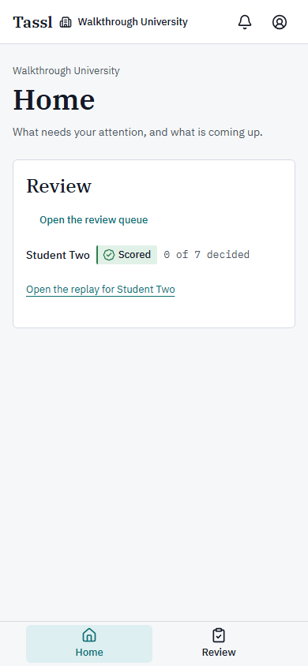

There is no **Your runs** panel on your home screen, because you take no runs; and no **Courses** or
**Packages** panel, because your seat does not hold them. A panel you cannot use is never drawn
empty.

---

## 3. Navigation map

```
Tassl (header wordmark)  → Home
Institution name          (which institution you are reading; yours is Walkthrough University)
Notifications (bell)      → Notifications
Account: {your name}      → Settings · Privacy · Terms · Sign out

Rail
├── Home                  → your Review panel
└── Review                → the review queue
                            └── Open the replay for {student}   → the replay
                                ├── Overview   (conditions · four graphs · defense · readiness ·
                                │               declarations · delegation log · unsourced figures)
                                ├── Bands      (the seven bands · points · course exports)
                                ├── Trace      (every event, filterable)
                                ├── Package    (the version, its confirmation record, its claims)
                                │               └── Open the package version → the version screen
                                └── Actions    (what this seat can do; hand-banding on a held run)
                                Back to the assignment → Not found for this seat
```

| Destination | How you get there | What is there |
|---|---|---|
| **Home** | Rail | Your **Review** panel |
| **Review** | Rail, or **Open the review queue** on Home | The illustrative panel and **Runs waiting for you** |
| The replay | **Open the replay for {student}** on Home or in the queue | Five views of one run |
| **Overview** | Replay view | Everything the run recorded, in the order it happened |
| **Bands** | Replay view | The seven drafts and decisions, the points arithmetic, the exports |
| **Trace** | Replay view | Every event in the order it was written |
| **Package** | Replay view | The scenario version, who confirmed it, and every claim on both variants |
| **Actions** | Replay view | **What this seat can do**; hand-banding when a run is held |
| **Open the package version** | **Package** view | The confirmed version in full, minus the seed record |
| An assignment's export history | The **Open** link on an **A course export is ready** notification | **Course exports**: every version written for a run on that assignment, with **Download version {n}** |
| **Notifications** | Bell in the header | What Tassl has told you, newest first |
| **Settings** | Account menu | **Profile**, **Security**, **Data** |
| **Privacy** / **Terms** | Account menu | The two legal documents |
| **Sign out** | Account menu | Ends this session and returns you to sign-in |

Notifications and Settings are not rail items; they live in the bell and the account menu.

---

## 4. Dashboards

You read numbers off three screens: Home, the review queue, and the replay's graphs.

### Home

One panel, one number per row: the state chip and "{n} of 7 decided". Seven is always the
denominator, because a run is confirmed only when all seven dimensions carry a decision. A row
sitting at 0 of 7 has had nothing decided by anyone; a row at 4 of 7 has three dimensions left, by
you or by the instructor. Click **Open the replay for {student}** to drill in.

### The review queue

The page is headed **Review** with "Runs of your own sections that are waiting for a decision, and
the shapes a queue takes once a course has run for a term." Two panels sit under it, and they are
never the same thing: the dashed illustrative one first, your own runs below it.

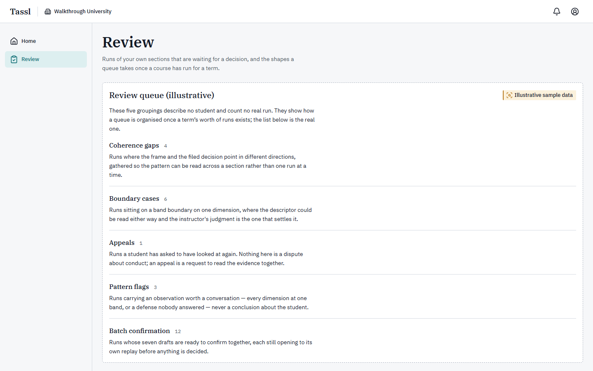

**The top panel is not your data.** It is labelled **Review queue (illustrative)** and carries the
amber chip **Illustrative sample data** and the note "These five groupings describe no student and
count no real run. They show how a queue is organised once a term’s worth of runs exists; the list
below is the real one." Its five groupings — **Coherence gaps** (4), **Boundary cases** (6),
**Appeals** (1), **Pattern flags** (3), **Batch confirmation** (12) — describe shapes a queue takes,
not runs you have. Never quote those counts to anyone as a measure of your section.

**The bottom panel is the real one.** **Runs waiting for you** / "Every run of a section you review
that has bands to decide, newest first."

| Column | What it means | How to read it |
|---|---|---|
| **Student** | The student's display name | Your section's roster name for them |
| **Attempt** | Which try at the assignment this is | 2 or higher means an earlier attempt was voided and another offered |
| **State** | The run's state chip | See the table below |
| **Bands decided** | "{n} of 7" | How many dimensions carry a decision from anybody |
| **Export** | **None**, or the version number written as **v{n}** | **None** means no course export has been written for this run yet |
| **Replay** | **Open the replay for {student}** | Opens the run |

State chips you meet here and on a replay header:

| Chip | What it means for you |
|---|---|
| **Scored** | The seven drafts are written and waiting. This is the state in which your seat may decide. |
| **Under review** | Nothing could place this run's bands. The seven are yours to set by hand from **Actions**. |
| **Confirmed** | All seven carry a decision and a course export exists. Your seat can no longer change a band. |
| **Recorded** | Confirmed, and the student has since answered their two debrief questions. |
| **Voided** | The instructor ended the run. It carries no partial result and reaches no export. |

There is no filter, no sort, no ranking and no queue position — the list is newest first and that is
all. The note under the table says why one column is missing: "Which variant a student drew is on
the replay rather than in this list, so this screen can be shown to a room."

An empty queue reads **Nothing waiting** / "A run appears here once its bands have been drafted.
Until then there is nothing on it to decide."

**How to pick what to look at.** Take the oldest waiting run first; a student is waiting on every
row. Prefer a row marked **Under review** over a **Scored** one, because nothing at all has been
placed on it. Where a row shows some dimensions decided and some not, open it and read what the
instructor has already put on the record before you touch the rest.

### The replay's graphs

The four graphs sit on **Overview**, under the heading **The four graphs** / "What this run plotted.
Each band on the Bands view names the graphs it was read from."

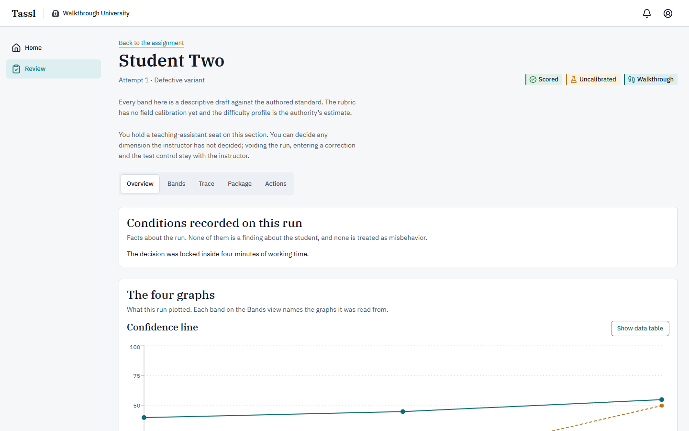

Every graph carries a **Show data table** button that swaps the drawing for its numbers, and a
**Show graph** button to swap back. A graph that could not be drawn loses the toggle, opens in its
table, and says "This graph is not available for this run." with "Missing events: {types}." under
it. An empty cell in a table reads "not available", and a table with nothing in it reads "This
graph has no rows."

The figures to read off them:

| Figure | Where | What it measures |
|---|---|---|
| **Confidence** at three points | Confidence line | The student's own 0–100 number at **Frame**, **Decision lock** and **After the Turn** |
| **Accuracy of claims relied on** | Confidence line | The share of the claims they were leaning on at that point that were sound, or that they had checked before it |
| Segment lengths | Clock timeline | How the working period and the Turn window were actually spent |
| **False Challenge Rate** | Stance matrix | "{n} percent ({a} of {b})" — sound claims warranting accept or verify that were challenged or rejected, over every consequential claim in the variant |
| **Stances matching what was warranted** | Stance matrix | The share of consequential claims whose stance matched |
| The prose paragraph under each graph | All four | The graph's own description, written when the run was scored and identical in the student's debrief |

Section 5 explains each graph in full.

On **Bands**, one more set of numbers: **Points under this course’s mapping** prints the mapping
(**Novice = 1**, **Developing = 2**, **Proficient = 3**, **Professional = 4** by default), a table of
**Dimension**, **Band** and **Points**, a total row **Total over the assessed dimensions ({n})** to
three decimals, and the division written out, for example "(3 + 1 + 1 + 1 + 2 + 3 + 4) / 7 = 2.143".
While the run is undecided the heading reads **From the seven draft bands** and a line adds "The
confirmed figure is written once all seven dimensions carry a decision. Until then this is what the
drafts come to." A dimension marked not assessed shows **Not counted** and is left out of the
division, never counted as zero. There is no total score, no rank and no percentile anywhere in
Tassl.

---

## 5. Features

### The review queue

**What it is for.** The list of runs in your sections that have bands to decide. It is the only
list of other people's runs your seat has, and the only way in to a replay.

**Where to find it.** Rail → **Review**; or **Open the review queue** on Home.

**How to use it.**

1. Open **Review**.
2. Skip the dashed **Review queue (illustrative)** panel. It counts no real run.
3. Read **Runs waiting for you** from the top — newest first, no other order.
4. Pick a row by its **State** and its **Bands decided** count (see [Dashboards](#4-dashboards)).
5. Click **Open the replay for {student}** in the last column.

**What happens after.** The first time anybody opens a replay, Tassl stamps the run with the moment
it was first opened; that is what the instructor's review time is measured from later. Nothing else
changes, and the student is told nothing. A run leaves the queue when all seven of its dimensions
carry a decision — at that moment the run becomes **Confirmed**, the first course export is written,
the student is notified that their bands are confirmed, and every reviewer of the section except the
student is told a course export is ready.

**What the queue will not tell you.** Which variant the student drew. That is on the replay,
deliberately, so this screen can be put on a projector.

### Reading a replay

**What it is for.** One run, read whole. The replay is the reviewer's view of everything a run
recorded, plus the authored material it was taken against.

**Where to find it.** **Open the replay for {student}**, from Home or the queue.

**The header.** The student's name; under it "Attempt {n} · Defective variant" or "…· Sound variant";
then the state chip, the chip **Uncalibrated**, and **Walkthrough** when the assignment is a practice
one. Two standing paragraphs follow. The first is true of every run in this build:

> "Every band here is a descriptive draft against the authored standard. The rubric has no field
> calibration yet and the difficulty profile is the authority’s estimate."

The second is drawn for your seat alone, and is the shortest statement of what you may do:

> "You hold a teaching-assistant seat on this section. You can decide any dimension the instructor
> has not decided; voiding the run, entering a correction and the test control stay with the
> instructor."

A voided run adds a red banner: "This run is voided. It carries no partial result, and no export
written afterwards names it."

The five views look like tabs and are links: each has its own address, so you can send one to the
instructor.

| View | What it holds | What you are looking for |
|---|---|---|
| **Overview** | **Conditions recorded on this run** · **The four graphs** · **Defense transcript** · **Readiness Check** · **Outside-tool declarations** · **Delegation log** · **Figures with nothing behind them** | Whether the shape of the run matches the drafts: did confidence rise on unchecked claims, was any evidence read before the assistant was used, does the defense answer from the student's own record or from what the assistant said |
| **Bands** | **The seven bands** · **Points under this course’s mapping** · **Course exports** | Whether each draft's rationale is actually supported by what the run recorded; the boundary cases where a descriptor could be read either way |
| **Trace** | **The run’s trace** | The order of events: what came before the lock, what the clock stood at, what one filtered kind of event looks like across the whole run |
| **Package** | "The package this run was drawn from" · **Confirmation record** · **Authoring measures** · **Claims** | What the material actually warranted — including which claim was the planted one, and what the *other* variant makes of the same claim |
| **Actions** | **What this seat can do**; **Band this run by hand** on a held run | Whether this run needs something only the instructor can do |

**Overview, panel by panel.**

- **Conditions recorded on this run** — "Facts about the run. None of them is a finding about the
  student, and none is treated as misbehavior." Six sentences are possible; a run may record none
  ("This run recorded none of these conditions.") or several: the defense filed with every answer
  empty; all seven drafts on **Novice**; all seven on **Professional**; "The decision was locked
  inside four minutes of working time."; the Readiness Check failing to submit so the skip was
  opened; an assistant outage armed for the next request. Read them as context, never as a charge.
- **The four graphs** — see the next section. Empty before scoring: **No graphs yet** / "The four
  graphs are plotted when the run’s bands are drafted. This run has not reached that point."
- **Defense transcript** — "The interview as it happened, with the notes the package author wrote
  for each question.", under the standing line "The defense is taken with the run record closed: the
  student answered from memory." Each question is **Question {n}** (or "**Question {n}, a
  follow-up**"), then **Answer**, then how long it took ("Written in 1s."), then
  **Expected-answer notes**. Those notes are the author's, they are reviewer-only in every state,
  and they are the single most useful thing on this screen: they tell you what the question exists
  to surface.
- **Readiness Check** — the concept map the check closed with, one sentence per idea ("You showed a
  working grasp of {concept}." / "{concept} looks thin." / "We could not tell about {concept}.").
  There is no score and no count. If it never closed: **The check did not close**.
- **Outside-tool declarations** — what the student said they used, the course's policy sentence, and
  the standing line "A declaration never changes how a run is banded."
- **Delegation log** — every request and reply. See [The AI assistant](#6-the-ai-assistant).
- **Figures with nothing behind them** — "Numbers the assistant asserted that no document in the
  Evidence Room supports." This is provenance, not correctness.

**Package.** The panel names the **Package**, the **Version**, its **Status** and the **Variant on
this run**, and links to **Open the package version**. Under it, **Confirmation record** shows who
signed off on each element type and when, and **Authoring measures** shows what building the version
cost. Then **Claims** — "Every consequential claim of this package, with what each variant makes of
it. The variant this run drew is marked." — with the columns **Key**, **Claim**, **Evidence on this
variant** (**Sound** or **Defective**), **Warranted stance on this variant**, and a link **Open
{key}**.

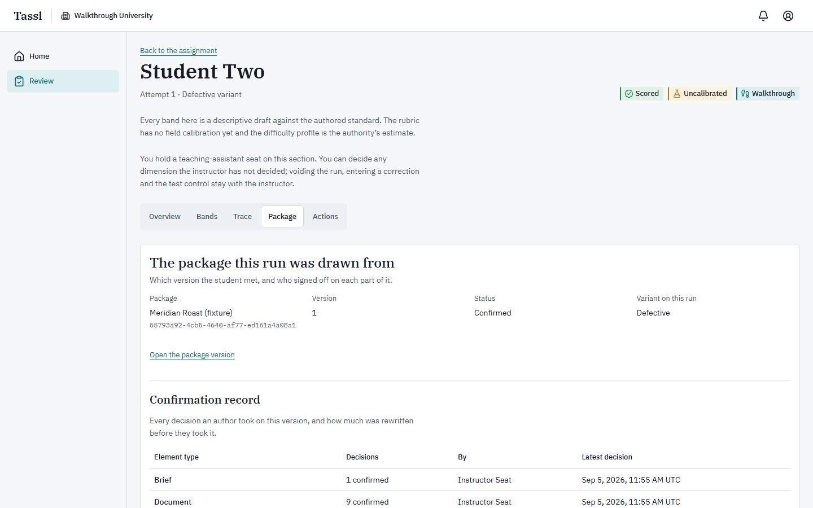

This view carries both variants' readings of the same claim side by side. That difference *is* the
planted defect, and you need the sound reading beside the defective one to judge what a stance was
worth. If you follow a claim link from the delegation log and the key no longer exists, the panel
says "No claim of this package version carries the key {key}. The claims of the version are below."

**Actions.** For your seat this view holds one panel and, on a held run, one form.

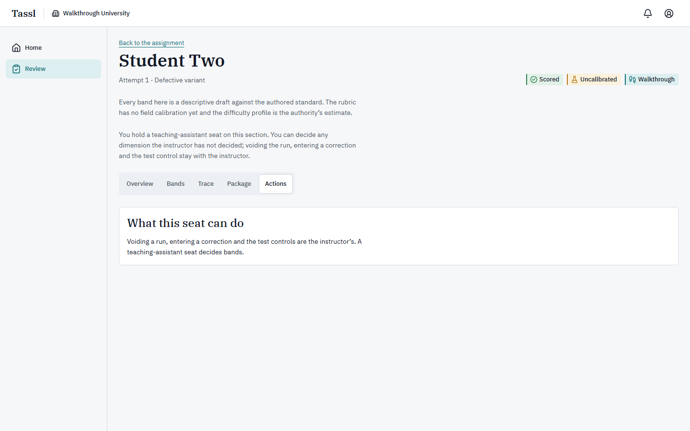

**What this seat can do** reads: "Voiding a run, entering a correction and the test controls are the
instructor’s. A teaching-assistant seat decides bands." Nothing is hidden from you here — the
instructor's controls are simply not drawn, so there is no button to press by mistake.

**Every action on the replay, and whether your seat can take it.**

| Action | Where | Your seat |
|---|---|---|
| Open the replay | Queue or Home | Yes, for any run of a section you hold a seat on |
| **Show data table** / **Show graph** | Each graph | Yes |
| **Show the evidence behind this band** | Each band card | Yes |
| Follow an evidence event into the trace | Evidence drawer | Yes |
| **Show one kind of event** → **Show** | **Trace** | Yes |
| **Show the record** on a trace row | **Trace** | Yes |
| **Open {key}** / claim links | **Package**, delegation log | Yes |
| **Open the package version** | **Package** | Yes — the version opens in full, minus the seed record |
| **Mark as outside the scenario** | **Overview**, under a delegation | Yes, on any run that is not voided |
| Confirm, override or unassess a band | **Bands** | Yes — while the run is **Scored**, and only on a dimension the instructor has not decided |
| **Confirm the remaining drafts** | **Bands** | Yes — it takes the drafts on the dimensions nobody has decided, and silently skips the instructor's |
| **Band this run by hand** | **Actions**, held runs only | Yes |
| **Download version {n}** | **Bands** → **Course exports** | Yes |
| Enter a correction on a claim | **Actions** | No — instructor only |
| **Void this run…** and offering another run | **Actions** | No — instructor only |
| **Arm the outage** (test control) | **Actions** | No — instructor only |
| **Back to the assignment** | Header eyebrow | The link is drawn, but the assignment page answers **Not found** to your seat |

### The four graphs

All four are plotted from the run's own trace when its bands are drafted, and the student sees the
identical four in their debrief. Each band on **Bands** names the graphs it was read from.

**Confidence line.** Two series over three points — **Frame**, **Decision lock**, **After the
Turn** — on a 0-to-100 scale. The solid line is **Confidence**, the student's own number. The dashed
line is **Accuracy of claims relied on**: the share of the claims they were leaning on at that moment
that were sound, or that they had run a check on before that moment. Accuracy at the frame is always
"not available" — nothing is relied on before the assistant is in the room. Its data table has
the columns **Point**, **Confidence**, **Accuracy**, **Claims relied on**, **Sound or verified**.

*How to read it.* A line that climbs while accuracy stays low is the pattern the rubric cares about:
confidence rising on claims nobody checked. It is what blocks the top band on Calibration. A line
that never moves — flat at 50, or flat at 100 — says nothing useful about the student's judgment and
holds Calibration at **Developing**. Nothing else about the shape is read.

**Clock timeline.** Two horizontal strips, **Working clock** and **Turn window**, each cut into
segments so that every millisecond belongs to exactly one activity: **Reading**, **Delegation**,
**Interrogation action**, **Escalation**, **Brief**, **Unattributed**, **Turn response**, **Paused**.
Its data table has the columns **Clock**, **Activity**, **From**, **To**, **Length**, **Detail**, and
carries four kinds of mark that are not drawn on the strip: **Claim touched**, **Clock credit**,
**Decision lock**, **Turn delivered**.

*How to read it.* Time is attributed backwards to the act it ended in — the stretch before a
delegation is the time spent composing it. A large **Unattributed** block means the run's events are
spread thinly, not that the student did nothing. The one thing the band rules take from this graph is
how many distinct Evidence Room documents were opened before the assistant was first used: zero of
those holds Framing below the top band. A delegation a reviewer has marked outside the scenario
claims no segment; its time falls into **Unattributed**.

**Stance matrix.** A five-by-five grid of counts: the rows are the stance **Taken**, the columns the
stance **Warranted**, in the order **Accept**, **Verify**, **Challenge**, **Reject**, **Escalate**.
The diagonal is tinted where it is non-zero; everything else is plain. There is no good-to-bad color
scale — the diagonal is the only thing the drawing says. Beneath it sit **False Challenge Rate** and
**Stances matching what was warranted**. The data table gives one row per consequential claim, with
fourteen columns including **Stance taken**, **Previous stance**, **Preceding action**, **Stance
warranted**, **Evidence status**, **Importance**, **Readiness context**, **Relied on**,
**Corrected** and **Match**.

*How to read it.* The **False Challenge Rate** counts only sound claims that warranted accept or
verify and were challenged or rejected; escalating is never a false challenge, and the denominator is
every consequential claim in the variant, not only the ones the student met. So a run that met few
claims cannot inflate the rate by challenging one of them. A claim the instructor has corrected
leaves the summary and the rate but keeps its row. High matching with a low false-challenge rate is
the shape the rubric rewards; accepting everything on a variant that plants a defect is the shape it
does not.

**Frame beside decision.** Not a plot: the student's own words, twice. **The frame you locked** —
the decision, the three load-bearing assumptions, the position and the confidence, written before the
assistant was in the room — beside **The decision you filed**: **Your recommendation**, **Why**, the
three assumptions, **What would change your mind**, **Confidence at the lock**, and any **Addendum**.
Below them, **The Turn and the response filed**: the Turn's message, **Response filed** (**Hold**,
**Revise**, **Reverse**, or "Hold, filed by the window closing"), **Justification** and **Confidence
after the Turn**. Its data table has the columns **Field**, **Frame**, **Decision**.

*How to read it.* Two lines under the frame do most of the work. "Disrupted by the Turn: assumption
1, 2." says how much of what the student said would matter actually moved. "Disrupted by the Turn but
not named in the frame: {key}." says the opposite, and is a finding in itself: the thing that changed
the decision was never in the frame. Matching is done on the words, so treat a near miss as a
conversation rather than a verdict.

### The seven bands, and what a teaching-assistant seat may decide

**What it is for.** Putting a band on the record for each of the seven dimensions a run is read on.
Tassl drafts all seven; a person decides them.

**Where to find it.** The replay's **Bands** view.

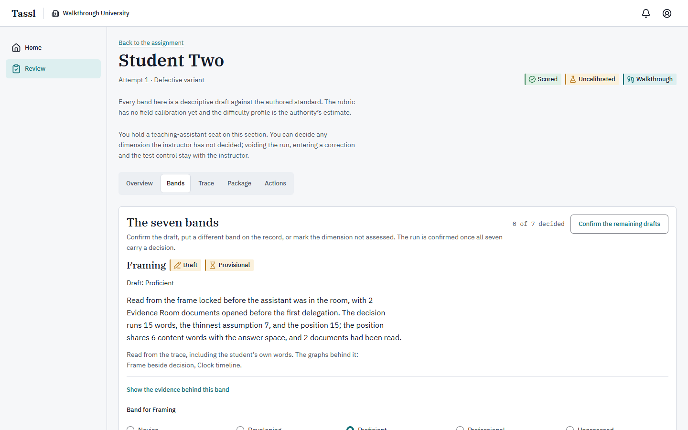

The panel is headed **The seven bands** / "Confirm the draft, put a different band on the record, or
mark the dimension not assessed. The run is confirmed once all seven carry a decision.", with the
counter "{n} of 7 decided" beside it and, when anything is left, the button **Confirm the remaining
drafts**.

**The seven dimensions, in the order they appear.**

| # | Dimension | What it measures | Drawn from |
|---|---|---|---|
| 1 | **Framing** | The frame locked before the assistant was in the room: is the decision the one the brief owns, are the three assumptions load-bearing and traceable, is the position inside the answer space, does the confidence have a stated reason | Frame beside decision, Clock timeline |
| 2 | **Delegation** | What was handed to the assistant and what was kept: production work delegated, the decision and the claim evaluation retained, reasons stated, evidence read before the first request | Clock timeline |
| 3 | **Verification** | Whether checks landed on the claims the decision rested on, and whether their results were read correctly; on a defect-free variant, whether checks were confined to claims that warranted one | Clock timeline, Stance matrix |
| 4 | **Calibration** | Whether reliance was proportionate to claim quality and stakes: defects kept out of the decision, false challenges few and defensible, escalations naming real limits, confidence tracking checked claims | Stance matrix, Confidence line |
| 5 | **Decision Quality** | The filed brief against the authored answer space: is the recommendation defensible, is the rationale on current rather than superseded evidence, is "what would change my mind" testable | Frame beside decision |
| 6 | **Adaptation** | The response to the Turn: hold, revise or reverse matching what the Turn warranted, the size of the change matching the new information, the justification tying the Turn to a named frame assumption | Frame beside decision |
| 7 | **Ownership** | The unaided defense: explaining provenance, verification choices and assumptions from the student's own record, without that record in front of them | All four |

**The levels.** Four bands, plus one non-band. What earns each band is written per dimension — the
rubric asks different things of Framing and of Ownership — so the ladder below says where a band
sits and what the default mapping pays for it, and the rationale on the card says why this run
landed there.

| Band | Where it sits on the ladder | Points under the default mapping |
|---|---|---|
| **Novice** | The lowest band in the rubric. The run missed the dimension's first condition — no interrogation action ran at all, say, or a frame field held a single word | 1 |
| **Developing** | The second band. The dimension's first condition was met and the ones above it were not — at least one check ran, or a flat confidence line holds Calibration here whatever else the run did | 2 |
| **Proficient** | The third band. The dimension's descriptor was met — a check landed on a load-bearing claim and nothing was misread, or the response to the Turn matched what it warranted | 3 |
| **Professional** | The highest band in the rubric. The descriptor's strictest condition was met too — every planted defect surfaced by a check, or evidence read before the assistant was first used | 4 |
| **Unassessed** | Not a low band at all. The run holds nothing that places this dimension | Nothing. The row reads **Not counted** and is left out of the division rather than counted as zero |

**What a draft is.** Tassl reads the run and writes a placement for each dimension, labelled with the
chip **Draft** and the line "Draft: {band}". A draft decides nothing. Where the placement turns on
free text a model read, the card also carries the chip **Provisional** — "This band turns on free
text a model read, so it is shown provisional until a reviewer confirms it." **Verification** and
**Calibration** are counted from the trace and are never provisional.

**What one band card shows**, in order: the dimension name; **Draft** or **Confirmed**; **Provisional**
where it applies; the band line ("Draft: Proficient", or "On the record: Proficient · Confirmed" once
decided); "Decided by {name}, {date}." once decided; the rationale paragraph, which always states the
counted facts first and the model's reading after; one of four basis sentences — "Read from the
trace, including the student’s own words." / "Read from the defense answers alone." / "Read from the
counted facts of the run alone, without a reading of the student’s words." / "Nothing in this run
placed this dimension."; "The graphs behind it: {graphs}."; any **Note to the student:**; the
disclosure **Show the evidence behind this band**; and the decision control.

Open **Show the evidence behind this band** and you get three lists — "Graphs it was read from",
"Trace events it was read from" (each **Event {n}** links straight into the **Trace** view at that
event), and **Quoted from the run’s own words**. A band that names nothing beyond its rationale says
"This band names no evidence beyond its rationale." All three lists are reviewer-only; no student
ever sees them.

A dimension the run could not place shows **Unassessed** with one short sentence saying why:
"The graphs this dimension is read from could not be drawn from this run’s trace." / "This run holds
nothing that places this dimension." / "The record of what this run did with its claims was lost, so
it cannot be read either way." / "The reading of this run’s free text did not come back, and the
recorded events alone do not place this dimension."

**What your seat can do on this view.**

You may decide a dimension when **both** of these are true:

1. the run's state is **Scored** — not **Confirmed**, not **Recorded**; and
2. the instructor of this section has not already decided that dimension.

A dimension another teaching assistant decided you may decide again. A dimension the instructor
decided shows no control at all; in its place sits: "The instructor decided this dimension. A
teaching-assistant seat cannot change it: the band it stands on is above, and the instructor for this
section can."

**To decide one dimension:**

1. Read the rationale, then open **Show the evidence behind this band** and follow at least one of
   its trace events.
2. In **Band for {dimension}**, choose one of **Novice**, **Developing**, **Proficient**,
   **Professional**, **Unassessed**. The draft band opens selected; opening the control submits
   nothing.
3. Optionally write in **Note for the student (optional)** — "The student reads this beside the band.
   It is optional: an override needs no justification." Up to 1,000 characters.
4. Press the button, whose label follows your choice:

| Your choice | Button |
|---|---|
| The drafted band | **Confirm the draft: {band}** |
| Any other band | **Record {band} instead** |
| **Unassessed** | **Record this dimension as Unassessed** |
| Nothing selected | **Record this decision** — which refuses with "Choose a band, or mark the dimension not assessed." |

When your selection has moved off the draft, a second button appears beside the first — **Confirm the
draft: {band}** — so you can always take the draft in one press. While saving, the labels read
**Saving…** and **Confirming…**; on success a toast reads "The decision is on the record."

**To take every remaining draft at once:** press **Confirm the remaining drafts**. The dialog
**Confirm the remaining drafts?** says "These are the dimensions nobody has decided. Each takes the
band drafted for it, and the last of the seven confirms the run.", lists each undecided dimension
with the band it would take, adds "Confirming these writes course export version {n}.", and offers
**Leave them undecided** or **Put the remaining drafts on the record**. While it saves, the button
reads **Confirming…**; afterwards a toast reads "The remaining drafts are on the record." It touches
only what nobody has decided; anything the instructor decided is skipped, not refused.

When the seventh dimension gets a decision, all of this happens in one step: the run becomes
**Confirmed**, the points are priced from the bands on the record, the first course export is written, the student is
notified that their bands are confirmed and their debrief switches from drafts to decisions, and
every reviewer of the section is told an export is ready. From that moment your seat can no longer
change a band on that run: an attempt answers "The bands on this run are confirmed, so only the
instructor can change one now. Ask the instructor for this section if a band should be decided
again."

**Two things to know before you decide the last one.** First, that seventh decision is what sends the
student their result — so if anything on the run needs the instructor (a claim that looks wrong, a
run that should be voided), leave a dimension undecided and say so. Second, on a run that already
carries an export, a warning appears above the buttons: "This run is already exported. A decision
changed here writes a new export version." — that warning is for the instructor, since your seat
cannot decide on a confirmed run at all.

**A run nothing could place.** When a run is held — chip **Under review**, or **Needs a hand** on
Home — the **Bands** view is empty: **No draft bands yet** / "Nothing could place this run’s bands,
so there are no drafts to decide. The seven are yours to set by hand." with a button that takes you
to **Actions**. There, **Band this run by hand** — "Nothing could place this run’s bands, so the
seven are yours to set. All seven are recorded together: every dimension needs a band, or Unassessed
where the run holds nothing to place it." Nothing opens selected, because there is no draft and a
pre-selection would be the screen guessing. Choose all seven, then press **Put these seven on the
record**. A partial answer is refused with "These still need a band or the word not assessed:
{dimensions}." On success — "The seven bands are on the record." — the run goes straight to
**Confirmed**, with an export and the student's notification, exactly as a seventh decision would.

**Course exports.** At the foot of **Bands**, **Course exports** / "Every version written for this
run, newest first." lists **Version**, **Why it was written**, **Written** and **File**, with a
**Download version {n}** link. Your seat may download any of them; it never writes one. Before the
first: **No export yet** / "The first export is written when all seven bands carry a decision. Every
correction after that writes another." The reasons a version carries are "The bands were confirmed",
"A band was decided again", "A correction was entered", "The course changed its mapping" and "A
dimension was marked not assessed". A voided run has no export history at all.

**Every export on one assignment.** The **Open** link on an **A course export is ready**
notification opens the assignment's whole history: a screen headed **Course exports** / "Every
export written for a run on this assignment, newest first.", carrying the sentence "Enter bands,
mapping, and points in the gradebook of record; Tassl holds no grade." above a table of **Student**,
**Version**, **Why it was written**, **Written**, **Run** and **File**, each row offering **Open the
replay** and **Download version {n}**. Its own eyebrow link, **Back to the assignment**, goes to the
assignment screen your seat does not hold, so it answers **Not found**. Empty, the screen reads **No
export yet** / "The first export for a run is written when all seven of its bands carry a decision.
Every correction after that writes another."

### The trace

**What it is for.** The run's raw record: every event in the order it was written, with the clock as
it stood. It is where you settle a question the panels only summarise — what came before what.

**Where to find it.** The replay's **Trace** view.

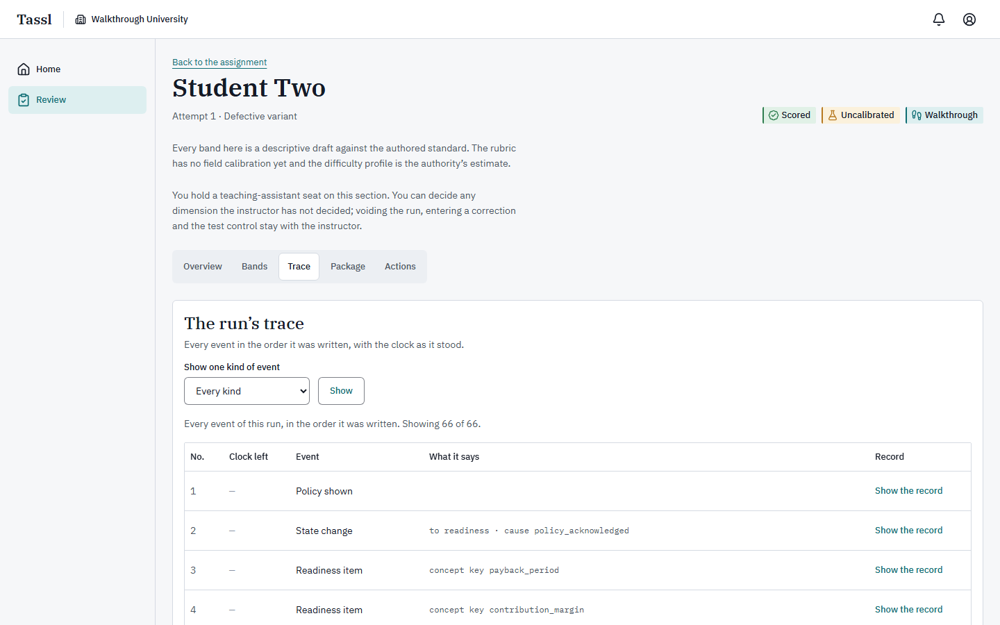

The panel is headed **The run’s trace** / "Every event in the order it was written, with the clock as
it stood."

| Column | What it holds |
|---|---|
| **No.** | The event's sequence number in this run |
| **Clock left** | The working or Turn clock as it stood, as minutes and seconds; a dash where no clock was running, reading "No clock was running when this event was written." |
| **Event** | The kind of event, in words — **Frame locked**, **Delegation**, **Stance set**, **Interrogation action**, **Escalation**, **Decision locked**, **Turn delivered**, **Defense answer**, **Band drafted**, **Band decided**, and so on |
| **What it says** | Up to three details lifted out of the event, written as words, for example "to readiness · cause policy_acknowledged" |
| **Record** | The disclosure **Show the record**, which opens the event's full stored record |

**To read it:**

1. Open **Trace**. The caption says "Every event of this run, in the order it was written." and the
   count line reads "Showing {n} of {n}."
2. To follow one thread, choose a kind in **Show one kind of event** and press **Show**. The list
   offers only the kinds this run actually wrote, plus **Every kind**. A filtered trace has its own
   address, so you can send it to the instructor; **Show every kind again** clears it.
3. Open **Show the record** on any row you want the detail of. An event with no detail says "This
   event carries nothing beyond its type."

**What to look for.** The order around three moments answers most questions: what was opened before
**Frame locked**; what happened between the first **Delegation** and **Decision locked**; and whether
a **Stance set** came before or after the **Interrogation action** on the same claim. The **Clock
left** column tells you what the student could still see of their own time. A **Run paused** followed
by **Run resumed** is a Tassl-side failure with the time credited back, never something the student
did.

Empty states: **No events** / "This run has written nothing to its trace yet."; and after a filter,
**No events of that kind** / "This run wrote no event of the kind you asked for."

### Working with the instructor

Your seat is built so that two people can read one run without either one's work being lost. What is
useful before the instructor decides:

1. **Clear the easy dimensions.** Where the rationale and the evidence plainly agree, confirm the
   draft. That leaves the instructor the dimensions that need judgment rather than seven of
   everything.
2. **Leave the boundary cases undecided.** A dimension whose descriptor could be read either way is
   the instructor's to settle. Say which ones you left, and why.
3. **Do not decide the seventh.** Not while anything is unresolved. The seventh decision confirms
   the run, writes the export and tells the student. Once it is taken, your seat cannot change a
   band.
4. **Mark what the scenario does not cover.** If a delegation was about something outside the
   scenario, press **Mark as outside the scenario** on it. On a run whose bands are already drafted,
   the screen warns you that the mark does not move them — so tell the instructor, because only a
   band decision changes a placement.
5. **Collect what only the instructor can act on.** A claim Tassl appears to have got wrong, a run
   that cannot be banded at all, a run that should be voided: none of these is yours. Note the claim
   key, or the dimension, and hand it over.
6. **Hand over addresses, not descriptions.** Every view of a replay has its own address, including
   a filtered trace and a single claim. Send the instructor the exact screen you are talking about.
7. **Say what you did in the note, not in the margin.** A **Note for the student (optional)** is read
   by the student beside the band. Anything meant for the instructor belongs in your message to them,
   not in that field.

What the instructor sees of your work: each decided band carries "Decided by {your name}, {date}."
and the counter on the queue and on Home moves. Your notes reach the student when the run is
confirmed. Your delegation marks are recorded on the run and never reach the student at all.

---

## 6. The AI assistant

**You never use the assistant.** It exists inside a student's live run, on their workspace and during
their Turn window, and no reviewer screen carries it. There is no assistant on the queue, on the
replay, or anywhere else your seat can reach. Nothing you do in Tassl calls a model.

What you read instead is the record of the student's use of it, on the replay's **Overview** view.

**Delegation log** — "Every request the student made of the assistant, and what came back." One
entry per request, in order:

| Element | What it is |
|---|---|
| **Delegation {n}** | The entry heading; the number is the request's place in the run |
| **Made inside the Turn window** | Badge on a request made after the decision was locked, during the Turn |
| **The request** | The student's words, exactly |
| **What came back** | The reply as the student saw it, or "Nothing came back on this request." |
| "Why the student asked: {reason}" | The optional one-line reason, or "The student wrote no reason for this request." |
| **Claims raised** | The claims the reply carried, each a link into the **Package** view |
| Guard marks | One sentence per mark (below) |
| **Mark as outside the scenario** | Your one control here |

The guard marks, written as sentences:

| Sentence | What happened |
|---|---|
| "Tassl reassembled the reply so every claim of the scenario appeared." | The reply was rebuilt so no claim could be dropped |
| "The reply carried the claims and no words of the assistant’s own." | The assistant's prose was empty or withheld; the claims still arrived |
| "The Sycophancy probe fired on this request." | The authored reversal fired — the assistant changed its position after the student pushed back |
| "The reply came back after the run had left the state that asked for it, so it was not kept." | A late reply, discarded; nothing from it counted |
| "A reviewer marked this request as outside the scenario." | Somebody pressed the mark below |

Empty log: **The assistant was not used** / "This run holds no delegation. The Delegation band is
drafted from what the defense says about working without one."

**Figures with nothing behind them** — "Numbers the assistant asserted that no document in the
Evidence Room supports." — lists any figure the assistant's own prose stated that no claim and no
opened document carried, as "{value} — {context}". Empty: "The assistant asserted no figure without a
source."

### To mark a delegation as outside the scenario

1. Open **Overview** and find the exchange.
2. Read the explanation under it: "Marking says the exchange was about something this scenario does
   not cover, so the Delegation read is taken over the exchanges that remain. It is a note about the
   material. The student is not told, and nothing is taken away from them."
3. If the run's bands already exist, a second line appears: "The bands on this run were drafted
   before this mark, so the mark does not move them. It is recorded on the run, and a band placement
   is changed with the band decision."
4. Press **Mark as outside the scenario**. While it saves the label reads **Marking…**; afterwards
   the control becomes "This exchange is already marked, and a mark is recorded once." A failure
   reads "The mark was not recorded. Try again."

A mark excludes that exchange from the Delegation reading and from the clock timeline's attributed
segments. It is a note about the material, not about the student.

### What you must not conclude from the log

- **The assistant never says which claim is sound.** It is instructed never to rank claims by
  reliability, never to name an evidence status or a failure family, and to present every claim it
  was handed in the same voice. A confident-sounding reply says nothing at all about the claim in it.
- **A claim arriving in a reply is not the assistant's opinion.** Consequential claims are written by
  the package's author and carried through word for word; which ones surface is decided by the
  author's own trigger phrases, before any model is called. The same request surfaces the same claims
  every time.
- **A marked figure is provenance, never correctness.** "Figures with nothing behind them" says only
  that the number is in neither a claim nor a document the student opened.
- **The Sycophancy probe says nothing about the student or the claim.** The reversal is written into
  the scenario in advance and fires for everyone who pushes back in that place.
- **A failed delegation is Tassl's, not the student's.** When the assistant did not answer, the run
  paused, the clock stopped and the time was credited back. Some outages are armed deliberately by
  the instructor for the walkthrough; the student is never told that a control did it, and the log
  looks the same either way.
- **Nothing here is misconduct.** Not an outside-tool declaration, not a long log, not an empty one.
  Tassl does not detect, infer or estimate outside use, and nothing it records is treated as
  misbehavior.
- **Volume is not judgment.** Many delegations is not laziness and none is not virtue — the
  **Delegation** dimension reads what was handed over and what was kept, and on a run with no
  delegation at all it is drafted from what the defense says about working without one.

Whether the installation is answering with a live model or with the built-in scripted one is not
shown on any screen your seat can reach, and it changes nothing you read: the claim cards, the log
and every panel are the same.

---

## 7. Notifications, settings, and account

### The bell and the notifications screen

The bell sits in the header on every signed-in screen. Its accessible name reads "Notifications: {n}
unread", or "Notifications: No unread notifications" when there is nothing. The badge counts unread
items and shows 99+ past ninety-nine; it re-reads itself about once a minute while the tab is in
front. Clicking it opens **Notifications**.

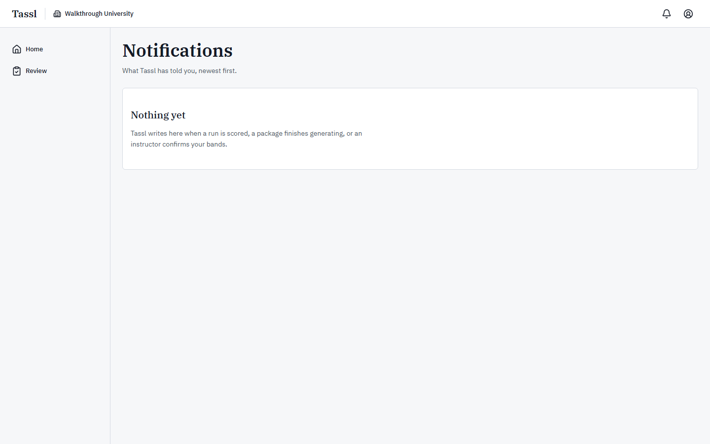

The page is headed **Notifications** / "What Tassl has told you, newest first." Each row carries a
title, a body, the time in UTC, **Mark read** while it is unread, and **Open** when it links
somewhere. Above the list sits **Mark all read**; at the foot, **Show more notifications** when there
is another page. Empty, it reads **Nothing yet** / "Tassl writes here when a run is scored, a
package finishes generating, or an instructor confirms your bands."

Three notifications reach a teaching-assistant seat, and all three are about your own sections:

| Title | Body | What triggered it | Where it goes |
|---|---|---|---|
| **A run is ready to review** | "A run in one of your sections has draft bands waiting for your decision. Open the replay to confirm, change, or set a dimension unassessed." | A run in your section was scored | That run's replay |
| **A run is held for review** | "Tassl could not draft the bands for a run in one of your sections, so nothing has been placed. Band it by hand from the replay, or void the run." | Nothing could place a run's bands | That run's replay |
| **A course export is ready** | "A run in one of your sections has a new course export. Open the assignment’s export history to download it and enter the result in your gradebook." | A run was confirmed, or an export was re-written | The assignment's export history |

You never receive a student's notifications, and no notification ever carries a band, a count, a rate
or any of a student's own words — they are also delivered by email, so they are deliberately
contentless. Whether email copies are sent at all is set for the whole installation by whoever runs
it; there is no per-person setting and no unsubscribe link.

If you press **Mark read** on something that has since gone, a toast reads "That notification no
longer exists."

### The account menu

The person icon in the header opens your account menu, headed by your name and the address you sign
in with.

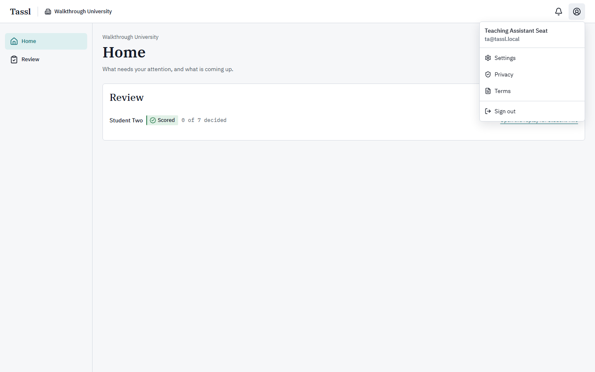

| Row | Where it goes |
|---|---|
| **Settings** | **Account settings** |
| **Privacy** | The privacy document |
| **Terms** | The terms document |
| **Sign out** | Ends this session and returns you to sign-in |

If signing out fails, the page stays and a toast reads "Signing out did not work. Try again."

### Settings

All three settings screens share the heading **Account settings** / "Your profile, your password and
devices, and your data." and a three-item strip: **Profile**, **Security**, **Data**. They are three
real pages, not tabs on one.

**Profile.**

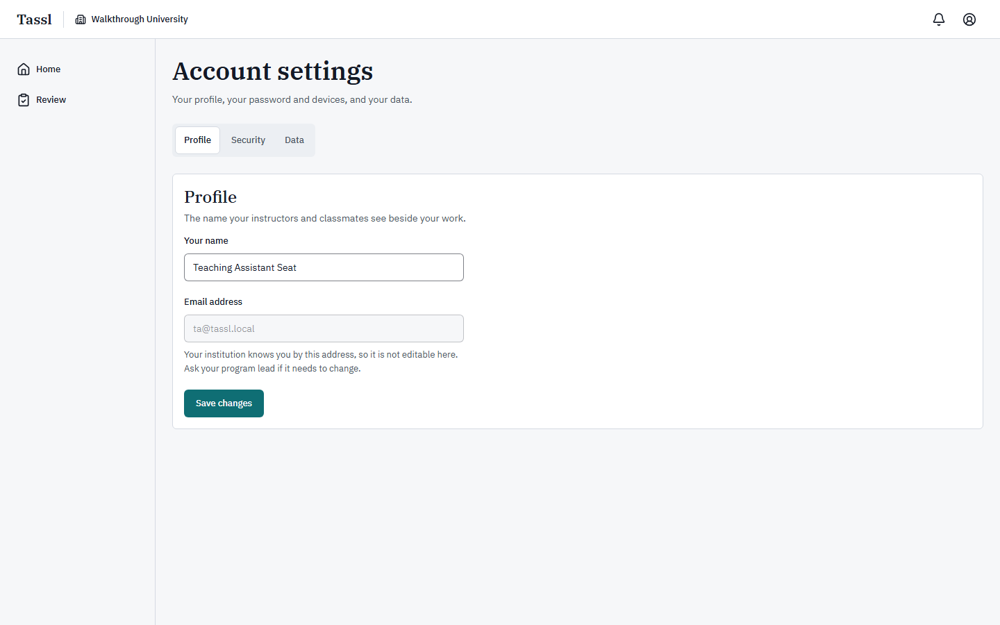

"The name your instructors and classmates see beside your work." Edit **Your name** — 1 to 120
characters — and press **Save changes**; a toast reads "Your name is saved." Your name is what shows
on a band you decided. **Email address** is shown but cannot be edited: "Your institution knows you
by this address, so it is not editable here. Ask your program lead if it needs to change." There is
no change-of-address flow anywhere in Tassl.

**Security.**

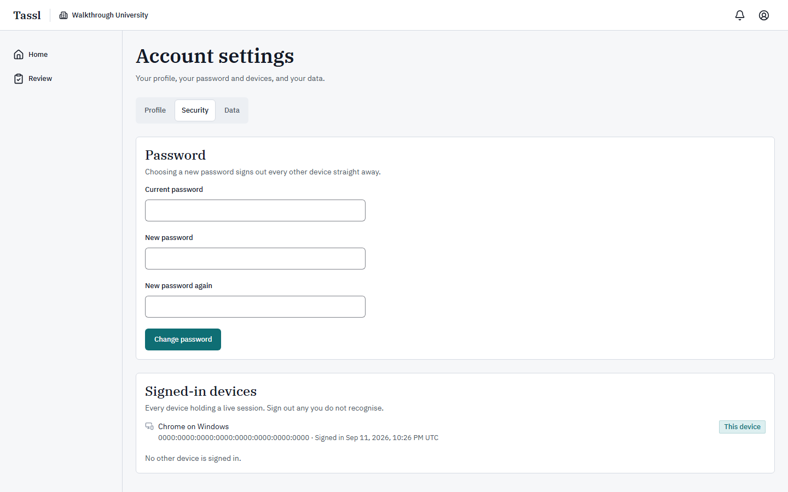

Two panels. **Password** — "Choosing a new password signs out every other device straight away." —
takes **Current password**, **New password** and **New password again**, then **Change password**;
on success, "Your password is changed. Other devices are signed out." **Signed-in devices** — "Every
device holding a live session. Sign out any you do not recognise." — lists each session as
"{browser} on {system}" with its address and sign-in time, badges the one you are using **This
device**, and offers **Sign out** on the others plus **Sign out every other device** below. With
nothing else signed in it reads "No other device is signed in."

**Data.**

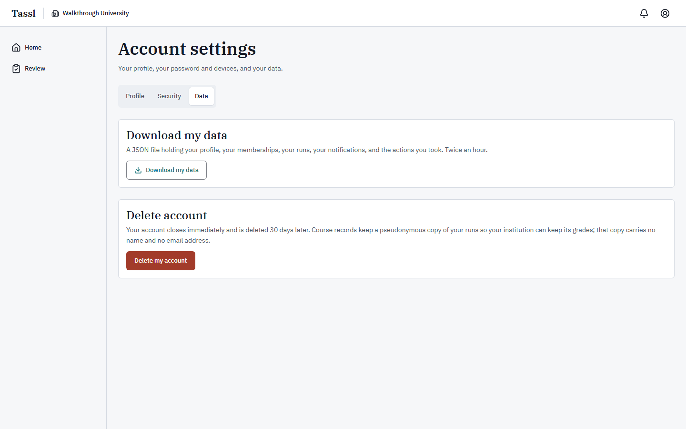

**Download my data** — "A JSON file holding your profile, your memberships, your runs, your
notifications, and the actions you took. Twice an hour." Press the button and the file downloads; a
toast reads "Your file is downloading." A third attempt inside an hour answers "You can download your
data twice an hour. Try again shortly." The file does not contain students' runs — it is your own
record, including the audit rows where you are the one who acted.

**Delete account** — "Your account closes immediately and is deleted 30 days later. Course records
keep a pseudonymous copy of your runs so your institution can keep its grades; that copy carries no
name and no email address." Press **Delete my account** and a dialog asks you to type your own
address into **Type {email} to confirm**; the confirm button stays disabled until it matches, and
**Keep my account** cancels. Deleting signs you out at once, removes you from every section and
institution, and cannot be undone. The bands you decided stay on the runs they were decided on.

---

## 8. Common situations

**I want to see what is waiting for me.** **Home** → the **Review** panel → **Open the review
queue**.

**I want to read one run from the top.** **Home** → **Review** → the student's row → **Open the
replay for {student}** → **Overview**.

**I want to know which variant this student drew.** Open the replay and read the line under their
name: "Attempt {n} · Defective variant" or "…· Sound variant". It is not in the queue.

**I want to see the numbers behind a graph.** **Review** → the run → **Overview** → the graph →
**Show data table** (and **Show graph** to go back).

**I want to check what a draft band was read from.** **Review** → the run → **Bands** → the
dimension → **Show the evidence behind this band** → an **Event {n}** link, which opens the
**Trace** at that event.

**I want to confirm the drafts that are plainly right.** **Review** → the run → **Bands** → the
dimension → leave the drafted band selected → **Confirm the draft: {band}**. Repeat, and leave the
ones you are unsure of undecided.

**I want to put a different band on the record.** **Review** → the run → **Bands** → the dimension →
choose the band → optionally write a **Note for the student (optional)** → **Record {band}
instead**.

**I want to record a dimension as not assessed.** **Review** → the run → **Bands** → the dimension →
**Unassessed** → **Record this dimension as Unassessed**. It is left out of the points division, not
counted as zero.

**I want to take every remaining draft at once.** **Review** → the run → **Bands** → **Confirm the
remaining drafts** → read the list → **Put the remaining drafts on the record**. It skips anything
the instructor decided.

**I want to band a run nothing could place.** **Review** → the row marked **Under review** → the
replay → **Actions** → **Band this run by hand** → a band or **Unassessed** on all seven → **Put
these seven on the record**.

**I want to say an exchange was outside the scenario.** **Review** → the run → **Overview** → the
**Delegation log** entry → **Mark as outside the scenario**. Then tell the instructor, because on an
already-drafted run the mark does not move a band.

**I want to look up what a claim was actually worth.** **Review** → the run → **Package** → the
claim's row → **Open {key}**; or click the claim key under a delegation in the log, which lands on
the same place.

**I want to download the course export for a run.** **Review** → the run → **Bands** → **Course
exports** → **Download version {n}**. For a whole assignment at once, open the export history from
the **A course export is ready** notification.

**I tried to change a band and could not.** Read the sentence where the control should be. "The
instructor decided this dimension…" means that one is theirs; "The bands on this run are confirmed…"
means the whole run is now theirs. Ask the instructor for this section.

**I clicked Back to the assignment and got Not found.** That link goes to the assignment screen,
which a teaching-assistant seat does not hold. Use the browser's back button, or go to **Review**.

**I want to change my display name.** Account menu → **Settings** → **Your name** → **Save
changes**.

---

## 9. Error messages and what they mean

### Refusals your seat can meet

| What you see | Where | Why | What to do |
|---|---|---|---|
| "The instructor decided this dimension. A teaching-assistant seat cannot change it: the band it stands on is above, and the instructor for this section can." | In place of a band's control | The instructor decided that dimension; their decision is final | Read the band above the sentence. Ask the instructor if it should change |
| "The instructor has decided this dimension." | On submitting a band | Same rule, caught by the server | Reload the replay; the control will have gone |
| "The bands on this run are confirmed, so only the instructor can change one now. Ask the instructor for this section if a band should be decided again." | On submitting a band | The run reached **Confirmed** or **Recorded** | Nothing. Take it to the instructor |
| "Choose a band, or mark the dimension not assessed." | Under a band's control | You pressed **Record this decision** with nothing selected | Choose one of the five options |
| "This run has no drafted bands to decide yet." | Band decision | The run is not yet **Scored** | Wait for the drafts; the queue will show it |
| "These still need a band or the word not assessed: {dimensions}." | Hand-banding | All seven go on together | Fill the dimensions it names |
| "This run is not at a point where it can be scored." | Hand-banding | The run is not held | Nothing to do by hand; go back to **Bands** |
| "The mark was not recorded. Try again." | Delegation log | The mark did not save | Press **Mark as outside the scenario** again |
| "This exchange is already marked, and a mark is recorded once." | Delegation log | Somebody marked it already | Nothing; a mark is recorded once |
| "That export version does not exist for this run." | An export download | The version never existed, or the run has been voided | Reload **Bands** and take a version that is listed |
| "This run has no course export yet; its bands are not confirmed." | Export history | Nothing has been confirmed on this run, or it is voided | Wait for the run to be confirmed |
| "No claim of this package version carries the key {key}. The claims of the version are below." | **Package** | You followed a stale claim link | Use the claim table below the message |
| "Only a student on this assignment’s section can start a run." | The **Runs** screen | You pressed **Start** on an assignment | Nothing was created. Your seat reviews runs; it does not take them |
| **Packages are not open to your seat** / "Only an instructor or a scenario author reads and writes packages in Walkthrough University. If you should be one, an administrator of the institution can change your seat." | **Packages** | Your institution seat does not hold the shelf | Open a version from a run's **Package** view instead |
| **Not found** / "There is nothing at this address. It may have moved, or the link may be wrong." | Admin, an assignment page, a roster, a student's run screens, any run outside your sections | The address is not yours to hold, or does not exist | **Go home**. Tassl never confirms that another section's run exists |
| **Something went wrong** / "The problem has been recorded. If it continues, quote the reference below." | Anywhere | An unexpected failure; the **Reference** below it identifies the request | Press **Try again**; if it repeats, send the reference to whoever runs your installation |
| "Sign in to continue." | Anywhere | Your session has ended | Sign in again; you land back where you were going |

### Account and sign-in messages

| What you see | When |
|---|---|
| "That email address and password do not match an account." | Either the address or the password is wrong; Tassl does not say which |
| "Confirm your email address before you sign in." | Your address has not been confirmed. Press **Resend verification** |
| "Use between 12 and 128 characters." | A password outside the allowed length |
| "Both passwords must be the same." | The two new-password fields differ |
| "That is not your current password." | The current-password field is wrong |
| "Too many attempts. Try again in {seconds} seconds." | Too many failed sign-ins on this account in a minute |
| "You can download your data twice an hour. Try again shortly." | A third data download inside the hour |
| "The device list could not be loaded." | The signed-in devices list could not be read |
| "That notification no longer exists." | Marking a notification that has gone |
| "The form could not be loaded. Close this and open it again." | A dialog's form did not download; nothing was submitted |

### Empty states

| Where | What it says |
|---|---|
| Home, nothing waiting | **Nothing waiting** / "A run appears here once its bands have been drafted, or when nothing could place them and it needs a hand." |
| Home, no section seat at all | **Nothing to do yet** / "When a course assigns you a run, or a run is waiting for your review, it appears here." |
| Home, no institution | **Waiting for an invitation** / "An institution adds you by an invitation email; once you accept it, your courses and runs appear here." |
| Review queue, empty | **Nothing waiting** / "A run appears here once its bands have been drafted. Until then there is nothing on it to decide." |
| Replay, conditions | "This run recorded none of these conditions." |
| Replay, graphs | **No graphs yet** / "The four graphs are plotted when the run’s bands are drafted. This run has not reached that point." |
| One graph that cannot be drawn | "This graph is not available for this run." with "Missing events: {types}." |
| Replay, defense | **No interview yet** / "The transcript appears once the student has taken the defense." |
| One unanswered question | "No answer was filed for this question." |
| One question with no author notes | "The author wrote no notes for this question." |
| Replay, readiness | **The check did not close** / "This run has no concept map: the Readiness Check was skipped, or it never finished." |
| Replay, declarations | "This run carries no outside-tool declaration." |
| Replay, delegation log | **The assistant was not used** / "This run holds no delegation. The Delegation band is drafted from what the defense says about working without one." |
| Replay, unsourced figures | "The assistant asserted no figure without a source." |
| Replay, bands not yet drafted | **No draft bands yet** / "The seven drafts are written after the defense is filed and the run has been read." |
| Replay, bands on a held run | **No draft bands yet** / "Nothing could place this run’s bands, so there are no drafts to decide. The seven are yours to set by hand." |
| Replay, bands read-only | "This run is not open for decisions. The seven bands below are on the record as they stand." |
| Replay, trace | **No events** / "This run has written nothing to its trace yet." |
| Replay, trace filtered | **No events of that kind** / "This run wrote no event of the kind you asked for." |
| Replay, package record | **No confirmation record** / "Nothing has been confirmed on this version yet." |
| Replay, claims | **No claims** / "This version carries no consequential claim." |
| Replay, exports | **No export yet** / "The first export is written when all seven bands carry a decision. Every correction after that writes another." |
| An assignment's export history, empty | **No export yet** / "The first export for a run is written when all seven of its bands carry a decision. Every correction after that writes another." |
| Notifications | **Nothing yet** / "Tassl writes here when a run is scored, a package finishes generating, or an instructor confirms your bands." |
| Signed-in devices | "No other device is signed in." |

---

## 10. Glossary

**Assignment** — one section's pointer at one confirmed scenario package version, carrying the clock,
the variant and the weight a run is taken under.

**Attempt** — the numbered try at an assignment. A second attempt exists because an earlier one was
voided and another offered.

**Band** — the placement one dimension holds: **Novice**, **Developing**, **Proficient**,
**Professional**, or **Unassessed**.

**Claim** — something the assistant states, or a document carries, that the student has to take a
position on. Consequential claims are written by the package's author, never generated.

**Claim key** — the author's short label for a claim, such as C3; the link between the delegation
log, the stance matrix and the **Package** view.

**Confirmation record** — every decision an author took on the elements of a package version, and how
much was rewritten before they took it.

**Confirmed (run)** — all seven dimensions carry a decision; a course export exists and the student's
debrief shows decisions instead of drafts.

**Corrected** — the column name, in the stance matrix data table, for a claim a correction has taken
out of a run's arithmetic.

**Correction** — the instructor's act of taking one claim out of one run's arithmetic when Tassl got
it wrong. It can raise a band and never lowers one. Not available to a teaching-assistant seat.

**Course export** — the versioned gradebook document written for one run when its seven bands are
decided, and re-written by every correction after that.

**Defect / defective variant** — the defective variant of a scenario plants exactly one consequential
claim that does not hold up; the sound variant plants none.

**Defense** — the closing interview taken with the run record closed, no assistant and no Evidence
Room: what the student can say about their own decision from memory.

**Delegation** — one request to the assistant and its reply. Asking costs the student no clock time.

**Dimension** — one of the seven named aspects of judgment a run is read on: **Framing**,
**Delegation**, **Verification**, **Calibration**, **Decision Quality**, **Adaptation**,
**Ownership**.

**Draft band** — the placement Tassl wrote from the trace before a person decided it. A draft decides
nothing.

**Escalation** — the student raising a claim to a colleague in one sentence; two per run, five
minutes of working clock each.

**Evidence status** — the author's per-variant mark on a claim: **Sound** or **Defective**. Never
shown to a student before their run is scored.

**Expected-answer notes** — what the package's author wrote about what a defense question exists to
surface. Reviewer-only in every state.

**False Challenge Rate** — sound claims warranting accept or verify that were challenged or rejected,
over every consequential claim in the variant, as a percentage.

**Frame** — the student's pre-assistant position: the decision, three load-bearing assumptions, their
stance and their confidence, locked before the assistant unlocks and never edited again.

**Held run** — a run nothing could place. It shows as **Under review**, or **Needs a hand** on Home,
and its seven bands are set by hand.

**Interrogation action** — one of three authored checks a student can run on a claim — Source Trace,
Replication Check, Decomposition Check — each costing working-clock minutes.

**Judgment Record** — the student's own downloadable record of their run. No reviewer screen serves
it.

**Load-bearing** — a claim or an assumption the decision would change without.

**Mapping** — the four numbers that say what one confirmed band is worth in this course's gradebook.

**Points** — the mean of the mapping's value over the dimensions a run was assessed on, to three
decimals. An unassessed dimension is excluded from the division. Tassl holds no grade.

**Provisional** — a band that turns on free text a model read, shown as such until a reviewer
confirms it.

**Rationale** — the paragraph a band carries: the counted facts of the run first, the model's reading
after.

**Replay** — the reviewer's five-view reading of one run: **Overview**, **Bands**, **Trace**,
**Package**, **Actions**.

**Review queue** — your list of runs in your own sections that have bands to decide.

**Run** — one student's single attempt at one assignment, kept whole as a resumable record.

**Scored** — Tassl has drafted the seven bands and they are waiting for a decision. The one state in
which a teaching-assistant seat may decide.

**Section** — the division of a course that holds a roster. Your seat is a row on one.

**Seed record** — the licensed published case a scenario package was adapted from. Never open to a
teaching-assistant seat, and never to a student.

**Stance** — the student's position on one claim, chosen from **Accept**, **Verify**, **Challenge**,
**Reject**, **Escalate**.

**Sycophancy probe** — the authored reversal in which the assistant changes its position after a
student pushes back. It is the same for everyone and says nothing about the claim.

**Trace** — every event of a run in the order it was written, with the clock as it stood.

**Turn** — the message from the world that arrives after the decision is locked and reopens the run
for twelve minutes so the student can hold, revise or reverse.

**Unassessed** — a dimension the run holds nothing to place. Reported as such, left out of the
arithmetic, never estimated and never counted as zero.

**Uncalibrated** — the state of every band and every difficulty figure in this build: no cohort has
run the rubric yet, so the standard is the authority's estimate.

**Variant** — which reading of a package's claims a run drew: **Defective** or **Sound**.

**Void** — the instructor's act of ending a run with no partial result. Not available to a
teaching-assistant seat.

**Walkthrough** — a practice assignment. Its runs can be deleted outright; a run that counts is
voided instead.

**Warranted stance** — the stance the authored material deserved. Open to you on the **Package**
view; hidden from the student until their run is scored.

---

Related reading: [the instructor manual](01-instructor.md) for the acts that stay with the
instructor — corrections, voiding, re-offers, band mappings and the test control — and
[the learner manual](02-learner.md) for what the student sees before, during and after a run. For a
guided practice pass through a whole review, follow
[the instructor guide](../guides/instructor-guide.md) on the seeded walkthrough assignment, stopping
short of the acts your seat does not hold.
