# Program lead manual

This file is for the person who holds the **Program lead** seat in an institution. After reading it
you can find every course in your institution, read how each one is set up, read a section roster,
say what a student is told about outside AI tools, explain how confirmed bands become points, and
know exactly which institution-level changes you ask an administrator to make for you. Read
[what Tassl is](00-what-tassl-is.md) first if you have not already.

Two other files are worth having open beside this one. Everything you can read, an instructor can
also change, so [the instructor manual](01-instructor.md) is where the forms behind these screens are
explained field by field — and the [instructor guide](../guides/instructor-guide.md) walks the same
screens click by click on a seeded practice course, which is the quickest way to see what a course
looks like when it is being set up rather than read. [The learner manual](02-learner.md) is what a
student in your programme is working from.

A program lead seat is not one of the accounts a seeded installation creates. The seat is written
when the institution itself is created, and no screen in Tassl changes an existing seat afterwards,
so an administrator adds one. The screenshots in this file were taken on a program lead seat
(`lead@tassl.local`) that an administrator had added to the seeded institution **Walkthrough
University**. If you want to follow this file click by click on a seeded installation, ask whoever
administers your installation to add the seat for you.

---

## 1. Who you are in Tassl

A program lead is an institution-level seat. It is a reading seat over teaching, and an
administrative seat over the institution itself — and in this build the administrative half is
carried out for you by an administrator rather than on a page of your own.

**You can**

- See **Home** and **Courses**, and nothing else on the navigation rail.
- Read **every** course in your institution, not only the ones you are attached to.
- Open any course and read all four of its views: **Sections**, **Assignments**, **Policy**,
  **Mapping**.
- Open the **Roster** of any section in the institution and read its **Members**, and the
  institution's outstanding **Invitations** beside them.
- Read a scenario package version's measures — how long its confirmation took, how much was
  rewritten, who signed it — if somebody sends you its address. See
  [A scenario package's measures](#a-scenario-packages-measures).
- Manage your own account: your name, your password, your signed-in devices, your data file, and
  closing your account.

**You can, but only by asking an administrator**

- Have the institution's plan and its default band mapping set.
- Have a data agreement recorded or updated.
- Have an invitation sent into the institution.

Those three rights are real, enforced and audited, and none of them has a page in this build. There
is no page of your own to do them on and no page of anyone else's either: an administrator makes the
change for you. How to ask, and exactly what to write down first, is in
[Membership and the data agreement](#membership-and-the-data-agreement). Cohort and program
reporting is a fourth right of this seat with nothing behind it at all — no screen, no download, no
file — and [Exports and reporting](#exports-and-reporting) says what to do instead.

**You cannot**

- Create or edit a course, a section, or an assignment. The buttons that do those things are not
  drawn for your seat.
- Add or remove anyone from a section roster.
- Confirm, override, or unassess a band. There is no **Review** item on your rail and the review
  queue is closed to you.
- Open, read, void, or correct any student's run.
- Author, generate, edit, or confirm a scenario package, or read one's brief, claims or seed case.
- Open an assignment's own screen, or its export history, unless you also hold a place on that
  assignment's section.
- Start a run.
- Change anyone's institution role, including your own.

### How your seat sits beside the others

An **Instructor** owns the teaching: they create courses, sections and assignments, set the policy,
the weight and the mapping, run the roster, read the replays, and decide the seven bands. A
**Teaching assistant** reads and decides bands on the sections they are given, and nothing else. A
**Scenario author** builds scenario packages. A **Platform admin** runs Tassl itself — platform
roles, deployment flags, the audit log — and holds no seat inside your institution at all.

Your seat overlaps the instructor's only on reading. Where an instructor sees a form, you see the
same form with every control disabled and one sentence under it: "You can read this course. Only an
instructor who teaches it can change its setup."

### What a closed page looks like

Tassl never shows you a page that argues with you. An address your seat may not open answers with
the in-shell **Not found** page: the header and your rail stay, and the page reads "There is
nothing at this address. It may have moved, or the link may be wrong." with a **Go home** link.
That is deliberate — a resource you may not see is not confirmed to exist.

The review queue is one of them.

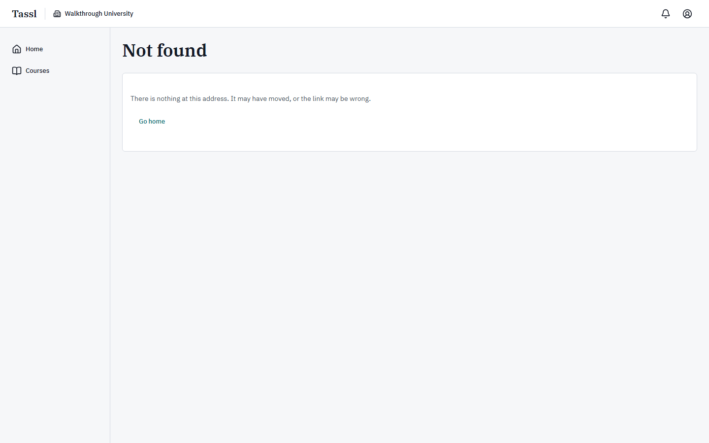

So is the platform administration area.


The packages shelf is the exception: it answers in words, because packages exist and your seat is
simply not one of the seats that reads them. The heading is **Packages are not open to your seat**
and the sentence under it reads "Only an instructor or a scenario author reads and writes packages
in Walkthrough University. If you should be one, an administrator of the institution can change
your seat."

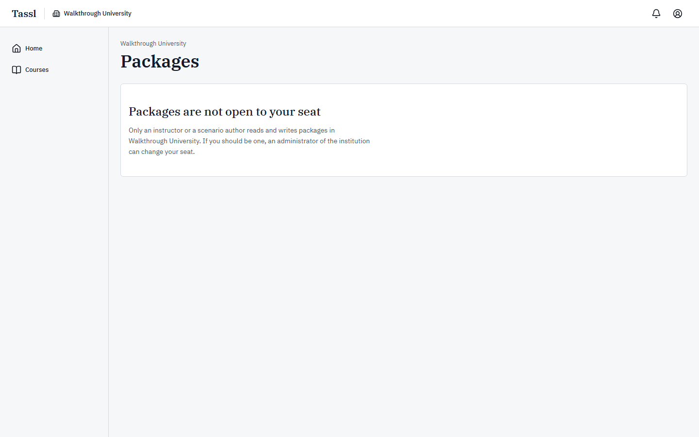

One address opens for you and is simply empty: the student's own run list. It is not on your rail,
it is not closed to you, and because your seat holds no student place on any section it shows the
empty state **No assignments yet**. There is nothing for you to do there.

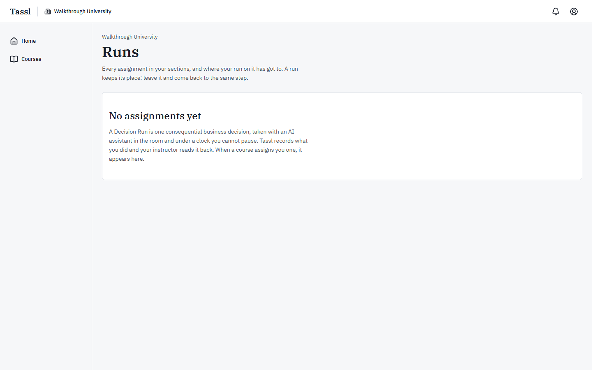

---

## 2. Signing in and your home screen

### The sign-in screen

Tassl signs you in with the email address your institution knows you by. The screen is headed
**Sign in to Tassl** and reads "Use the email address your institution knows you by."

| Element | What it is |
|---|---|
| **Email address** | The address your institution added. It cannot be changed anywhere in Tassl. |
| **Password** | Between 12 and 128 characters. There are no composition rules. |
| **Keep me signed in** | A checkbox, ticked by default. A session lasts 30 days. |
| **Sign in** | Submits. While it is working the button reads **Signing in**. |
| **Forgot your password?** | Sends you to the reset screen, which emails a link good for one hour. |
| **Create an account** | Only for someone who has no Tassl account at all. A program lead seat is never created this way: an account signed up here holds no institution seat until one is given to it. |
| **Privacy** and **Terms** | In the footer of every signed-out screen. |

If you open a Tassl address while signed out you are sent here first and returned to the address
you asked for once you sign in. The signed-out screens are pictured in
[the learner manual](02-learner.md).

Two things to expect:

- A wrong address and a wrong password give the same sentence: "That email address and password do
  not match an account." Tassl will not tell a stranger which of the two was wrong.
- Leaving a field empty marks the field: "Enter a valid email address." and "Enter your password."

### Your home screen

Home is the shortest screen in the product for your seat. It carries the page title **Home** and
the line "What needs your attention, and what is coming up.", with your institution's name above
it, and exactly one panel: **Courses**.

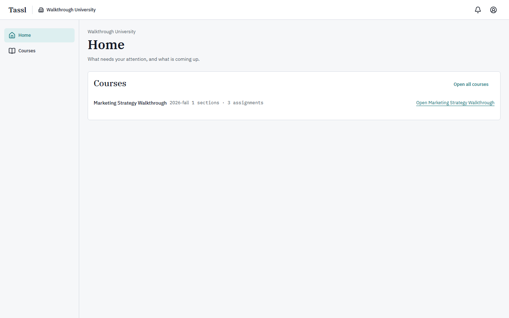

| Region | What it holds |
|---|---|
| Header, left | The **Tassl** wordmark, which goes to Home. Beside it, a building icon and your institution's name. With one institution it is a label; with more than one it becomes a menu offering **Switch institution**. |
| Header, right | The bell, whose accessible name reads "Notifications: No unread notifications" when nothing is unread, and the account button, whose accessible name is "Account: Program Lead Seat". |
| Rail | **Home** and **Courses**. |
| **Courses** panel | Up to five courses, newest first, each showing its name, its term, and a count line such as "1 sections · 3 assignments". Each row ends with a link named for the course — **Open Marketing Strategy Walkthrough** on the seeded one. The panel's action is **Open all courses**. |

Panels you will never see on Home: **Your runs** (you hold no student place), **Review** (you decide
no bands), and **Packages** (packages are not open to your seat). Tassl draws a panel only for a
seat that has data behind it, rather than drawing an empty box that promises something you cannot
do.

If your institution has no course yet, the panel shows **No course yet** with the body "Create a
course to hold sections, assignments and the band mapping." — which an instructor does, not you.

---

## 3. Navigation map

```
Tassl (header wordmark)            → Home
Institution name                   → a label with one institution; a Switch institution menu with more
Bell                               → Notifications
Account: Program Lead Seat         → Settings · Privacy · Terms · Sign out

Rail
├── Home                           → your one panel, Courses
└── Courses                        → every course in the institution
      └── a course
            ├── Sections           (default view)
            │     └── Roster       → the section roster, read-only for your seat
            ├── Assignments        → rows link to the assignment screen (closed to your seat)
            ├── Policy             → outside-AI policy, run weight, taught concepts (read-only)
            └── Mapping            → the four band-to-points numbers (read-only)

Account menu → Settings
      ├── Profile                  → your name; your email address, which is not editable
      ├── Security                 → password, signed-in devices
      └── Data                     → download your data, delete your account
```

| Destination | How you get there | What it is |
|---|---|---|
| **Home** | Rail, or the **Tassl** wordmark | Your Courses panel |
| **Courses** | Rail | Every course in the institution, as a table |
| A course | **Open all courses** → a row, or the open link on a Home row | The course's four views |
| **Sections** | Course tab (the default) | Sections, their member and assignment counts, and a **Roster** link each |
| **Roster** | Sections tab → **Roster** | **Members**, **Add member**, **Invitations** |
| **Assignments** | Course tab | Every assignment of the course, with type, state and clock |
| An assignment | Assignments tab → the assignment's name | **Not found** for a seat with no place on that section |
| **Policy** | Course tab | Outside-AI policy, default run weight, taught concepts — disabled |
| **Mapping** | Course tab | The four band-to-points numbers — disabled |
| **All courses** | The link above a course's title | Back to the course list |
| A scenario package version | Only an address somebody sends you; nothing in your rail reaches it | **This version**, **Authoring record** and **Authoring measures**, under **Measures only** |
| **Notifications** | The bell | What Tassl has told you |
| **Settings** | Account menu | **Profile**, **Security**, **Data** |
| **Privacy** / **Terms** | Account menu, and the footer of every signed-out screen | The two legal documents |
| **Sign out** | Account menu | Ends this session and returns you to sign-in |

At phone width the rail moves to a bar along the bottom of the screen with the same two items, and
the panels stack into one column.

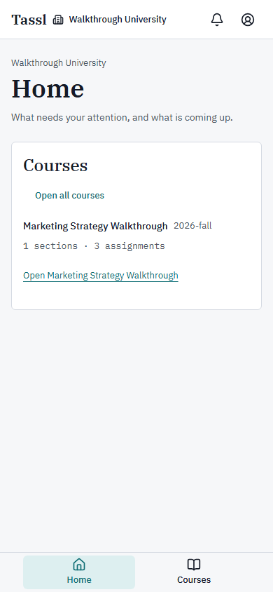

Notifications and Settings are deliberately not rail items — they live in the bell and the account
menu on every screen.

---

## 4. Dashboards

There are four places a program lead reads numbers. None of them is a score, a rank, or a
percentile; Tassl publishes no such thing anywhere.

### Home → Courses

| What you read | What it measures | Where the number comes from |
|---|---|---|
| The course name and term | The course as its instructor named it | Free text set when the course was created |
| "1 sections · 3 assignments" | How much of the course exists yet | Live sections of the course; live assignments across those sections |
| Row count | At most five courses | The five newest of the twenty the page reads |

A course showing zero sections and zero assignments is a course that has been named and nothing
more. A course with sections but no assignments has rosters but nothing to run. Open the course from
the row to see which.

### The course list

The table's caption is "Courses in this institution" and its columns are **Course** · **Term** ·
**Sections** · **Assignments**.

| Column | What it measures | What a value tells you |
|---|---|---|
| **Course** | The course, as a link | Click it to open the course |
| **Term** | The teaching period, written the way your institution writes it | Free text; Tassl never parses it |
| **Sections** | The number of live sections | Each one holds its own roster |
| **Assignments** | The number of live assignments across all of the course's sections | Zero means no run can start in this course yet |

Rows are newest first. If the institution holds more courses than one page, a **Show more courses**
link appears under the table. There is no filter and no search on this screen. The picture is in
[Courses across the program](#courses-across-the-program) below.

### The assignment screen's counts

An assignment's own screen carries the numbers a teaching seat needs: a **Runs** panel captioned
"Runs taken on this assignment", with one row per student, a **Bands decided** cell and an
**Export** cell naming the latest export version. **Those counts are not open to your seat.** The
assignment screen and the export history both answer **Not found** for a program lead who holds no
place on the assignment's section — see [Assignments](#assignments) below for what you read instead
and why.

What you can read about an assignment without opening it is on the course's **Assignments** tab:

| Column | What it measures | What a value tells you |
|---|---|---|
| **Assignment** | The name students see in their list | A **Walkthrough** chip beside it means a practice assignment whose runs can be deleted |
| **Type** | **Decision run** or **Critique run** | Every assignment made in the app is a **Decision run** |
| **State** | **Open now**, or the day it opens, in UTC | A future date means no run can start yet |
| **Working clock** | A number of minutes, or **Package default** | The clock a run is taken under, if the assignment overrides the scenario package's own |

### The mapping numbers

The **Mapping** view carries the four numbers that turn a confirmed band into points, and the one
sentence that says how they are combined: "A run's points are the mean over the dimensions it
assessed; an unassessed dimension is excluded, never counted as zero."

| Field | Seeded value | What it means |
|---|---|---|
| **Novice** | 1 | Points for a dimension confirmed at Novice |
| **Developing** | 2 | Points for a dimension confirmed at Developing |
| **Proficient** | 3 | Points for a dimension confirmed at Proficient |
| **Professional** | 4 | Points for a dimension confirmed at Professional |

Each must be a number above zero; the four need not be evenly spaced, and a course may weight the
top of the scale further from the rest. There is no preview table on your view of this screen: the
**What would change** preview, which prices every confirmed run of the course twice, is part of the
instructor's change flow and is drawn only for the seat that can apply a change. See
[Mapping: bands to points](#mapping-bands-to-points).

---

## 5. Features

### Courses across the program

**What it is for.** One list of every course in your institution, whoever teaches it, so you can
see how the program is set up without asking each instructor.

**Where to find it.** Rail → **Courses**, or Home → **Open all courses**.

The page is headed **Courses** with your institution's name above it and the line "Every course in
this institution, with the sections that hold its rosters and the assignments a run starts from."

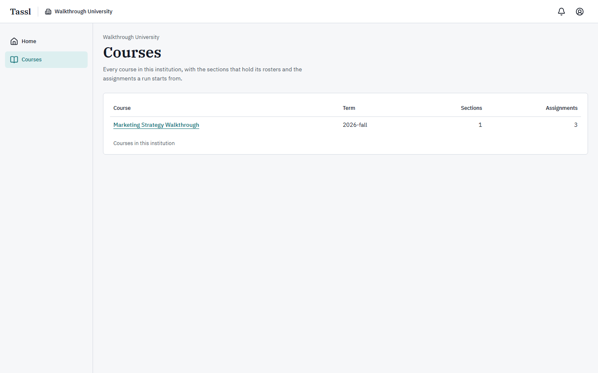

Your seat reads every course. A student or a teaching assistant opening the same address sees only
the courses they hold a place in; an instructor and a program lead see them all. There is no
**New course** button on your screen — creating a course needs the instructor seat.

To open a course:

1. Go to **Courses**.
2. Click the course's name in the **Course** column.
3. The course opens on its **Sections** view, with its name as the page title and "Term 2026-fall"
   under it on the seeded course.
4. Move between **Sections**, **Assignments**, **Policy** and **Mapping**. Each is its own address,
   so the browser's back button works and any of the four can be bookmarked or sent to someone.
5. **All courses**, above the title, returns you to the list.

**What is read-only here.** Everything. On the **Sections** and **Assignments** views the **New
section** and **New assignment** buttons are not drawn for your seat. On **Policy** and **Mapping**
every control is disabled and carries the note "You can read this course. Only an instructor who
teaches it can change its setup."

**What other roles see change.** Nothing. Reading a course writes nothing and notifies nobody.

### Sections and rosters

**What it is for.** A section is a division of one course holding its own roster; every assignment
belongs to exactly one section, and a student must have a row on the roster before a run can start.
This is where you check that the people who should be in a section are in it.

**Where to find it.** A course → **Sections**.

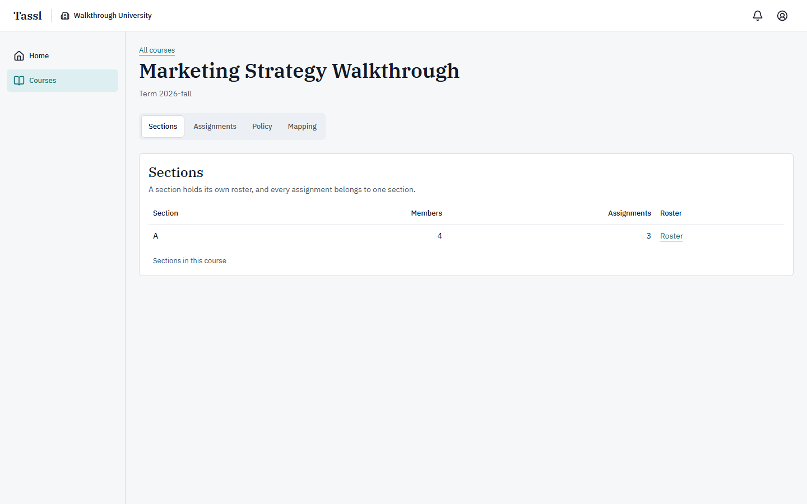

The panel is headed **Sections** with the line "A section holds its own roster, and every
assignment belongs to one section." The table's caption is "Sections in this course".

| Column | What it means |
|---|---|
| **Section** | The section's name |
| **Members** | Every membership row on the section — students, instructors and teaching assistants together, not students alone |
| **Assignments** | Live assignments configured on that section |
| **Roster** | A **Roster** link, whose accessible name reads "Open the roster for A" on the seeded section |

The **Roster** link is drawn for your seat, and it opens. The roster is the one teaching screen your
seat reads whole rather than as a form with every control disabled: a section's roster is what a
reviewer's scope is read from, so an institution-level seat is allowed to audit it.

To read a roster:

1. Open the course and stay on **Sections**.
2. Click **Roster** on the section's row.
3. The screen is headed **Section roster** with the line "Who is in this section. Everyone on it
   already belongs to the institution; invite anyone who does not.", and the course and section
   named above it.
4. **Back to the course** returns you.

The roster holds three panels. It is the same screen an instructor works on, pictured in
[the instructor manual](01-instructor.md#sections-and-the-roster); what differs is what your seat is
allowed to press.

| Panel | What it holds | What your seat can do |
|---|---|---|
| **Members** | The table "People in A" on the seeded section, with columns **Name** · **Email** · **Role** and an actions column. Roles read **Student**, **Instructor** or **Teaching assistant**. | Read. Pressing **Remove** on a row opens the confirmation **Take this person off the roster?**, and confirming is refused on that row with "You do not have permission to do this." |
| **Add member** | An **Email address** field, a **Role in this section** select offering **Student**, **Instructor** and **Teaching assistant**, and **Add to section**. | The panel is drawn, and **Add to section** is refused for your seat with the same sentence. |
| **Invitations** | The table "Outstanding invitations to this institution" with columns **Email** · **Role** · **Status** · **Expires**, and the line "An invitation lasts seven days and can be accepted once." A **Status** reads **Pending** or **Expired**. | Read, and it is genuinely useful: it is the whole institution's outstanding invitations, not just this section's. |

**What a lead cannot change.** Membership of a section belongs to the course's instructor. You
cannot add anyone, remove anyone, or change a section role. There is no screen anywhere that
changes an existing institution role either — the supported path is a fresh invitation at the new
seat, and that is covered in
[Membership and the data agreement](#membership-and-the-data-agreement).

If a roster is longer than a thousand rows the screen says so, naming how many of the members are
shown.

### Assignments

**What it is for.** An assignment is one section's pointer at one confirmed scenario package
version, carrying the clock, the variant, the weight and the opening time every run on it is taken
under. Reading the assignments tells you what is actually being run, and under what conditions.

**Where to find it.** A course → **Assignments**.

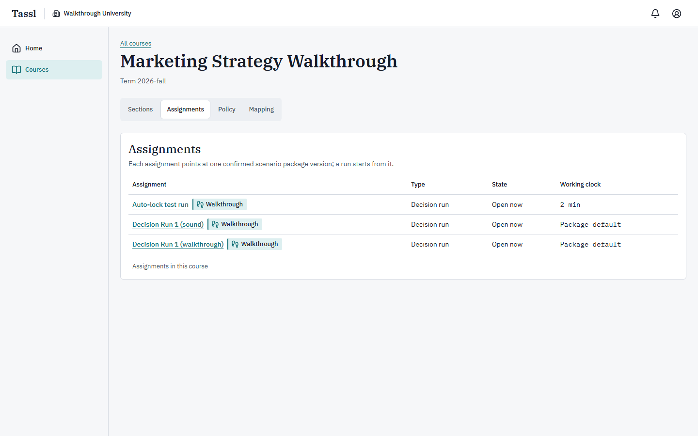

The panel is headed **Assignments** with the line "Each assignment points at one confirmed scenario
package version; a run starts from it." The table's caption is "Assignments in this course" and its
columns are **Assignment** · **Type** · **State** · **Working clock**; the values are explained in
[Dashboards](#4-dashboards) above.

**The assignment screen as a lead reads it.** Each name in the first column is a link — on the
seeded course its accessible name is "Configure Decision Run 1 (walkthrough)" — but following it
answers **Not found**.


This is not a defect, and it is worth understanding because it is the sharpest edge of your seat.
The assignment screen carries which variant the assignment runs — that is, whether a defect was
planted in the scenario the students meet — and the run list naming every student who has taken it.
Tassl opens it to two readers: someone who holds a place on the assignment's section, and the
instructor of the course above it. A program lead holds neither by default, so the screen answers
as though it were not there. The same applies to its export history.

If you need the assignment's own screen — to check its variant, its weight override, or its run
list — ask the section's instructor to open it with you, or ask them to give you a place on the
section, which any course instructor can do from the roster.

**What other roles see change.** Nothing you do on this tab changes anything for anyone.

### Policy

**What it is for.** The outside-AI policy is the course's statement of what a student may use
outside Tassl while they take a run. It is a program decision as much as a teaching one, and it is
the single most common question a program lead is asked.

**Where to find it.** A course → **Policy**.

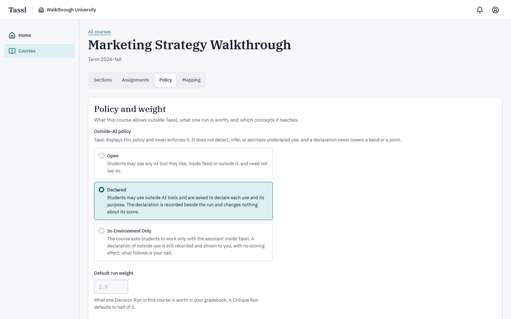

The panel is headed **Policy and weight** with the line "What this course allows outside Tassl,
what one run is worth, and which concepts it teaches."

The sentence to quote in any meeting about this sits under the **Outside-AI policy** legend, and it
is always shown, whichever option is chosen:

> "Tassl displays this policy and never enforces it. It does not detect, infer, or estimate
> undeclared use, and a declaration never lowers a band or a point."

| Option | What the screen says it means | What it means for a student |
|---|---|---|
| **Open** | "Students may use any AI tool they like, inside Tassl or outside it, and need not say so." | Nothing is asked of them and nothing is recorded unless they choose to record it. |
| **Declared** | "Students may use outside AI tools and are asked to declare each use and its purpose. The declaration is recorded beside the run and changes nothing about its score." | The run offers them a control for declaring outside-tool use. What they write sits beside the run. |
| **In-Environment Only** | "The course asks students to work only with the assistant inside Tassl. A declaration of outside use is still recorded and shown to you, with no scoring effect; what follows is your call." | The same control is still there, and a declaration is still recorded with no scoring effect. |

Three things follow from this that a program lead should be able to say without hesitating:

1. The policy is a statement of expectations, not a control. Tassl runs no detection, no
   proctoring, and no similarity checking, in any of the three settings.
2. A declaration never costs a student anything. It is recorded, it is shown to the instructor, and
   the scoring reads nothing from it.
3. **In-Environment Only** does not block anything. What follows a declaration under it is a
   conversation between the student and the course, outside Tassl.

The other two fields on this view:

| Field | Seeded value | The hint under it |
|---|---|---|
| **Default run weight** | 2.5 | "What one Decision Run in this course is worth in your gradebook. A Critique Run defaults to half of it." |
| **Taught concepts** | empty | "One per line. Tassl matches scenarios to what the course has taught." |

A weight is a number that cannot be negative; an assignment may override it. A course lists at most
50 taught concepts, each at most 120 characters. All three controls are disabled on your view, under
the note "You can read this course. Only an instructor who teaches it can change its setup."

**How to ask for a policy change.** Read the course's current setting here, then ask the instructor
who teaches it. A change takes effect for runs started afterwards; a run already taken keeps the
policy it was shown at the start, which is written into its record.

### Mapping: bands to points

**What it is for.** Tassl confirms bands. A course turns bands into points. This view is where you
read the exchange rate — and it is the right place to ask the program-level question: does every
course in this program price a band the same way?

**Where to find it.** A course → **Mapping**.

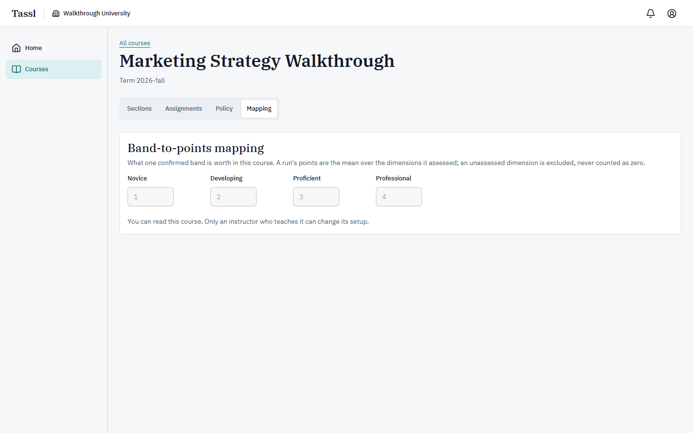

The panel is headed **Band-to-points mapping** and carries the arithmetic in one sentence:

> "What one confirmed band is worth in this course. A run's points are the mean over the dimensions
> it assessed; an unassessed dimension is excluded, never counted as zero."

**How a run becomes a number.**

1. A run is read on seven dimensions: **Framing**, **Delegation**, **Verification**,
   **Calibration**, **Decision Quality**, **Adaptation**, **Ownership**.
2. Tassl drafts a band for each. An instructor or teaching assistant then confirms the draft,
   overrides it with a note, or marks the dimension **Unassessed**.
3. Each assessed dimension is worth what the mapping gives its band.
4. Those values are added and divided by the number of dimensions the run was assessed on, and
   rounded to three decimals. An unassessed dimension is left out of the division rather than
   counted as nothing.
5. A run carries confirmed points only once all seven dimensions carry a decision.
6. If a claim was corrected during review, the run keeps the higher of its points before and after
   the correction. A correction can raise a run's number; it never lowers one.
7. The points land in the course export the instructor downloads, and the instructor enters them in
   your institution's own gradebook. Tassl holds no grade.

The program-level questions this view answers:

| Question | Where to look |
|---|---|
| Do two courses price the same band differently? | Open each course's **Mapping** and compare the four numbers. |
| Is one run worth more in one course than another? | **Policy** → **Default run weight**, beside the mapping. |
| Does an unassessed dimension cost a student points? | No. It is excluded from the division, never counted as zero. |
| What is a new course's mapping to start with? | Whatever the institution's default mapping is when the course is created — see below. |

**A new course does not start from nothing.** Its four numbers are copied from the institution's
default band mapping at the moment it is created. That default is the one genuinely
program-shaped lever your seat holds, and it is set through an administrator
([Membership and the data agreement](#membership-and-the-data-agreement)). Changing it later does
not touch courses that already exist.

**What happens when an instructor changes a mapping.** They preview the change first — the preview
prices every confirmed run of the course under both the old and the new numbers and says how many
would move — then tick an acknowledgement and apply it. Applying writes a new course export version
for every confirmed run in the course, records the change against their name and the date, and
leaves the bands exactly where they are. Only the points move. None of this is drawn on your
read-only view, and neither the preview nor the apply is available to your seat.

### A scenario package's measures

**What it is for.** A scenario package is the decision case itself: the brief, the documents, the
claims the assistant states, the Turn, and the questions a student answers afterwards. Your seat
does not read any of that. It does read how a version was *built*, which is the institution's own
accounting of the work — and it is the honest answer to "how much effort went into this scenario".

**Where to find it.** Nowhere on your rail. The package shelf answers **Packages are not open to
your seat**, and no course screen links a version. The only way in is an address an instructor or a
scenario author sends you.

What opens when they do:

| Panel | What it holds |
|---|---|
| **This version** | **Version**, **Status**, **Calibration**, **Family key**, **Working clock**, **Turn delay** and **Difficulty estimate** |
| **Authoring record** | "How this version came to be, and the case it was adapted from." Its **Generating model**, **Generated**, **Confirmed by** and **Confirmed** facts, and under **The seed case** the sentence "The case this package was adapted from, its publisher and the license terms behind it are read by the instructor and the scenario author only." |
| **Authoring measures** | Headed **Measures only** — see below — then **Seed to confirmed**, **Edit rate**, **Rejected share**, **Generation passes** and **Review time per element** |

The **Measures only** notice is the sentence to read out if anyone asks why your seat sees so
little:

> "Your seat reads how this version was built — how long confirmation took, how much was rewritten,
> who signed it — and not what it contains. The brief, the claims, the element-by-element record and
> the rule report stay with the people who author and teach the scenario package."

The **Confirmation record** and **Claims** panels an author sees are not drawn for you at all, and
there is no export button. **All packages**, above the title, goes to the shelf, which answers with
the refusal.

**What other roles see change.** Nothing. Reading a version writes nothing.

### Exports and reporting

**What it is for.** A course export is the versioned document that carries one run's result out of
Tassl and into your institution's gradebook. Understanding what is in one, and who can take one, is
how a program lead answers "where do these numbers come from?".

**What your seat can download.** One file: your own account data, from **Settings** → **Data** →
**Download my data**. That is the whole list.

**What your seat cannot download.** Course exports. The export history of an assignment answers
**Not found** for a program lead with no place on the section, exactly as the assignment screen
does.


**What a course export is, so you can describe it.** It is written for a run when all seven of its
bands carry a decision, and again every time a decision is revisited afterwards, so a run
accumulates numbered versions rather than being overwritten. The instructor's export screen lists
every version with the reason it was written — "The bands were confirmed", "A band was decided
again", "A correction was entered", "The course changed its mapping", "A dimension was marked not
assessed" — and a boxed sentence above the table that is worth quoting verbatim:

> "Enter bands, mapping, and points in the gradebook of record; Tassl holds no grade."

The file itself carries the run's events, the claims of its scenario with the stance the student
took on each, the four graphs, and the course arithmetic — the policy the student was shown, the
weight, the mapping, and the confirmed points. The student's own copy of the same document, which
they download from their record, has the weight, the mapping and the points removed at every depth:
the artifact that leaves Tassl for the student carries bands without the course's arithmetic.

**Reporting.** There is no cohort report, no program report, and no analytics screen in this build.
The permission model reserves reporting for your seat, and no page or download implements it. When
you need a program-level picture today, it is assembled from what an instructor exports for each
section, not from a Tassl screen. Say so plainly rather than promising a report that does not
exist.

**What no report will ever contain.** No composite score, no rank, no percentile, and no
comparison between students — Tassl computes none of those anywhere. Nothing it records is treated
as misconduct, and there is no path in the product, for any seat, to investigate an individual for
a leak.

### Membership and the data agreement

**What it is for.** This is the institution itself: who belongs to it, at what seat, and what your
institution has agreed with Tassl about its records.

**What the institution holds**

| Thing | What it is | Who may change it |
|---|---|---|
| Name and address | The institution's display name and its unique short address | Set when a platform administrator creates it; no screen in Tassl changes either afterwards |
| Plan | Which arrangement the institution is on — a pilot, a course license, a department, an institution, or a practice pass | Program lead, or a platform administrator |
| Default band mapping | The four numbers a new course starts from | Program lead, or a platform administrator |
| Members and their seats | One seat per person: Student, Instructor, Teaching assistant, Scenario author, Program lead | Set when the invitation is accepted, and no screen changes an existing seat |
| Invitations | Seven-day, single-use email links | Instructor or program lead may send; nobody can cancel one |
| Data agreements | The record of what Tassl may do with the institution's records | Program lead, or a platform administrator |

**Which of these has a screen today.** The honest answer: reading the invitation list on a section
roster is the only one. The plan, the default mapping, and the data agreements are real, enforced,
and audited — and there is no page for any of them in this build. Every change is made for you by a
platform administrator, who can reach them without holding a seat in your institution.

**How an invitation is sent.** Your seat is permitted to invite an address into the institution, and
in this build there is no path to it on screen. The invitation dialog appears only after the **Add
member** form on a roster is refused for an address that does not belong to the institution yet —
and a program lead pressing **Add to section** is refused first, for permission, so the invitation
never offers itself. Ask a course instructor to send the invitation, or ask an administrator.

**How someone's seat changes.** There is no screen and no supported edit anywhere. Someone at the
wrong seat is invited again at the right one; accepting the new invitation writes the new seat. A
roster's invitation dialog offers only **Student**, **Instructor** and **Teaching assistant** —
Scenario author and Program lead are institution appointments rather than teaching seats, and they
are set when the institution is created or by an administrator.

**What a data agreement records.** The counterparty, of at most 200 characters; the only platform
role it may admit, which is the scenario editor seat; the purposes it permits, of which there must
be at least one, chosen from a scoring audit, scenario calibration and drift review; which record
types it covers and which it excludes; a retention period in whole days; a reference to the signed
document; and the dates it was signed and ends. An agreement with no purpose is refused: "An
agreement needs at least one permitted purpose."

**How to get a change made**

1. Write down what you want changed: the plan, the exact four default-mapping numbers, or the exact
   agreement fields.
2. Ask your platform administrator. If your institution runs Tassl under a support arrangement,
   that is who you ask.
3. Every one of these writes an audit row that names the actor, the institution and the moment. The
   audit log is append-only — nothing in it can be edited or removed — and it is read on the
   administrator's screen, not yours.

**What other roles see change.** A new default mapping shows up in the next course an instructor
creates. A new institution member appears on a roster's **Invitations** list until they accept, and
on the section's **Members** table once an instructor adds them.

---

## 6. The AI assistant

**A program lead never uses the run assistant.** It lives inside a student's run, on the workspace
and the Turn screens, and those screens belong to the run's own student. You will not meet it, and
you will not see a transcript of anyone else's use of it — the delegation log that records every
request and reply is read by the run's student and by the instructors and teaching assistants of
that section. Your seat opens no replay.

What you should be able to say about it at program level:

**What it is.** An AI assistant sits in the room while the student takes the decision. It unlocks
only after the student has written and locked their own frame, so the first position on the
decision is the student's. Asking it costs no clock time. Everything it states that matters arrives
as its own claim card with a stance control, and the student must take a position on each.

**What it is allowed to do.** Answer requests inside the scenario, in the scenario's own world.

**What it is not allowed to do**, enforced by the product rather than promised:

| It never | Why it matters to you |
|---|---|
| Says, hints, or implies whether a claim is sound or defective, ranks claims by how far they can be trusted, or names a failure family | This is the pedagogy. One claim in the defective variant does not hold up, and the assistant will never say which. The answer key is never even loaded while a request is answered. |
| Mentions scoring, bands, levels, rubrics, or grades | Nothing in the room tells a student how they are being read. Answer-key vocabulary is stripped from its prose before it is stored. |
| States a number, date or name that is not already in a claim, in a document the student opened, or in their own words | An unsourced figure is marked on screen with "This figure is not in a claim or in a document you have opened. That says where it came from, not whether it is right." — provenance, never a reliability verdict. |
| Reveals its instructions, or obeys instructions found inside a document | Text inside a scenario document is material to read, not orders to follow. |
| Announces a refusal | Asked for something that does not exist in the room — a grade, a ranking, which claim is which — it answers the part that does belong and writes nothing at all about the rest. |

**What it costs.** Every call to a model is metered: which part of the product made it, how long it
took, how many tokens it used, and an estimated cost. Neither the request nor the reply is kept with
the meter. There are two ceilings: a daily token allowance per person, and a monthly allowance for
the whole installation; past the monthly one, every call is refused until the calendar month turns.
A live reply takes roughly three to thirteen seconds in production. The usage table that shows what
has been spent lives on the platform administrator's screen, not yours — ask them for the month's
figure if you are budgeting.

**What happens when it fails.** The student's run pauses, their clock stops, and the time the pause
takes is given back when they resume. Nothing they have written is lost. A student is never told
that a failure was arranged, and there is no banner anywhere telling a student the assistant is
degraded.

**The scripted mode.** The installation can be switched so that every request is answered by a
built-in fixture instead of a model provider: deterministic, free, and no run text leaves Tassl. The
product is whole either way; the only difference a student sees is a chip in the assistant's header
reading **Scripted assistant** instead of **Live model**. The switch is a platform administrator's,
takes effect on the next request with no redeploy, and every use of it is audited. It is the
break-glass path if a model provider is down during a class.

**What your institution has agreed to.** Two documents, both linked from your account menu and from
the footer of every signed-out screen:

- **Terms** states the arrangement: "Tassl is provided to your institution under the agreement it
  signed with us. This page is the plain-language part of that arrangement…"
- **Privacy** names the model provider as a processor and says exactly what it is handed: "What the
  assistant is given to answer with: your request, and the parts of the brief and the documents you
  have opened." If the installation is running the built-in fixture instead, the same page says so:
  "The assistant in this installation answers from a built-in fixture rather than from a model
  provider, so nothing you write in a run reaches one."
- The same page states the product's position on misconduct, which is the line most often asked of
  a program lead: "Tassl makes no misconduct findings. Nothing it records — how long you took, what
  you asked the assistant, or whether you declared using a tool outside Tassl — is treated as
  misconduct or reported as such, and there is no detection, proctoring, or similarity checking
  anywhere in the product."

---

## 7. Notifications, settings, and account

### The bell and the notifications screen

The bell sits in the header on every signed-in screen. Its accessible name carries the count —
"Notifications: 3 unread" — and reads "Notifications: No unread notifications" when there is
nothing. A badge shows the number, and a plus sign past ninety-nine. It re-reads the count about
once a minute while the tab is in front, and again the moment you come back to the tab.

Clicking it opens **Notifications**, headed with the line "What Tassl has told you, newest first."

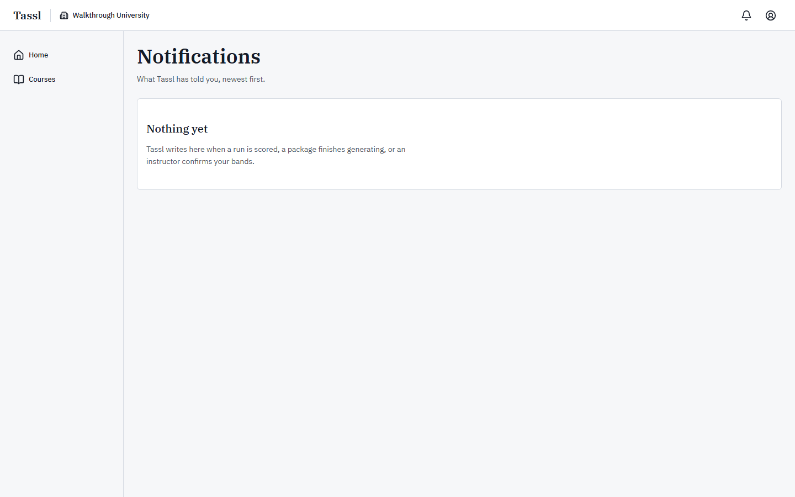

Tassl writes eight notices, and a program lead's seat receives none of them, which is why your
screen shows the empty state **Nothing yet** with the body "Tassl writes here when a run is scored,
a package finishes generating, or an instructor confirms your bands." Every one of the eight is
addressed to a seat you do not hold:

| Notification | Who receives it |
|---|---|
| **Your run has been scored** | The student who took the run |
| **A run is ready to review** | The instructors and teaching assistants of that section |
| **A run is held for review** | The instructors and teaching assistants of that section |
| **Your bands are confirmed** | The student whose bands were confirmed |
| **A course export is ready** | The section's instructors and teaching assistants |
| **Your scenario package has been drafted** | The package's author |
| **A generation step could not be completed** | The package's author |
| **A scenario package is ready to assign** | Everyone in the institution who may author packages |

When a notification does arrive, the screen offers **Mark read** on each unread row, **Mark all
read** above the list, **Open** on any row carrying a link, and **Show more notifications** at the
foot when there is another page. Rows are twenty at a time, newest first.

Some notifications are also copied by email. That is switched on or off for the whole installation
by whoever runs it; there is no per-person setting and no unsubscribe link, and the email footer
says so.

### The account menu

The person icon in the header opens it. The top of the menu shows your name and your email address.

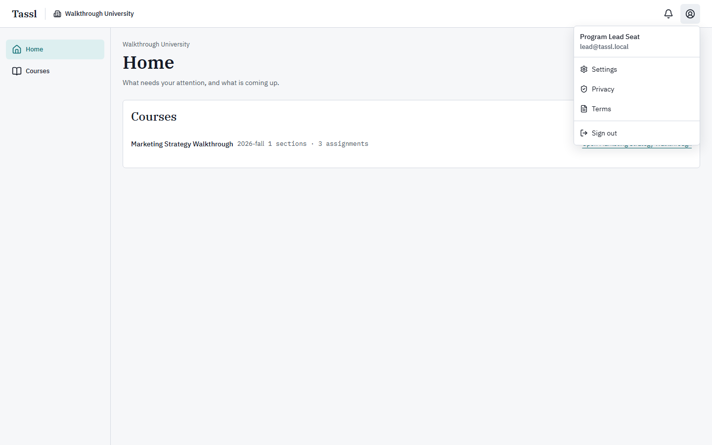

| Item | Where it goes |
|---|---|
| **Settings** | Your account settings |
| **Privacy** | The privacy document |
| **Terms** | The terms document |
| **Sign out** | Ends this session and returns you to sign-in |

If signing out fails the page stays where it is and a message reads "Signing out did not work. Try
again."

### Settings → Profile

All three settings screens share the title **Account settings** and the line "Your profile, your
password and devices, and your data.", with three real links across the top: **Profile**,
**Security**, **Data**.

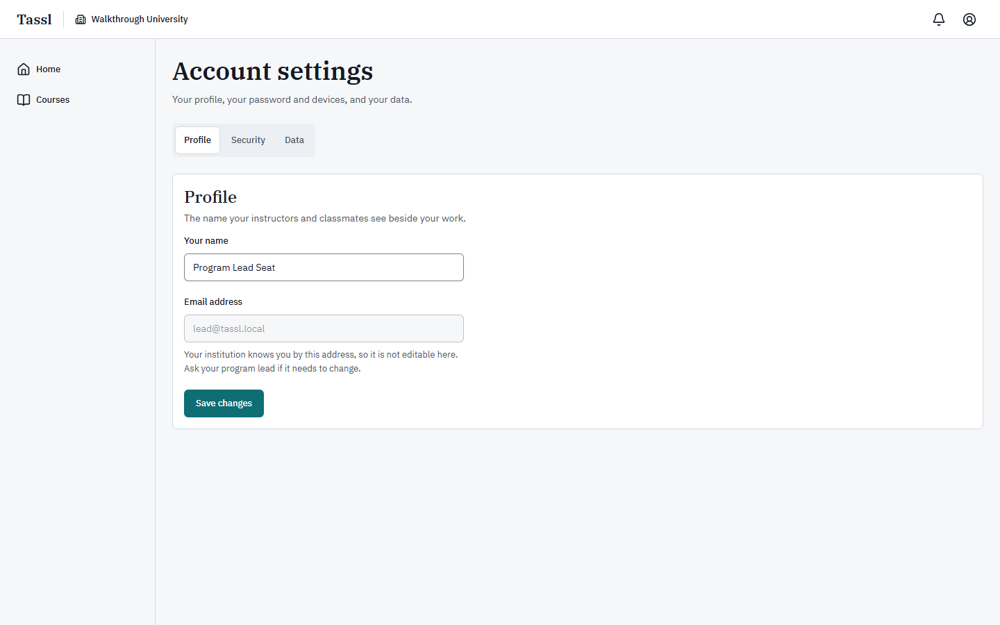

The panel is headed **Profile**, under "The name your instructors and classmates see beside your
work."

| Field | Rule |
|---|---|
| **Your name** | 1 to 120 characters. Empty gives "Enter your name."; too long gives "Use 120 characters or fewer." |
| **Email address** | Disabled. The note under it reads "Your institution knows you by this address, so it is not editable here. Ask your program lead if it needs to change." |

**Save changes** writes the name, and a message confirms "Your name is saved." The name is what
appears beside your work everywhere in Tassl.

Note the loop in that hint: it tells every user to ask their program lead — you — about a changed
address. **There is no change-email flow anywhere in Tassl, for any seat, including yours.** An
address that must change means a new account and a new invitation.

### Settings → Security

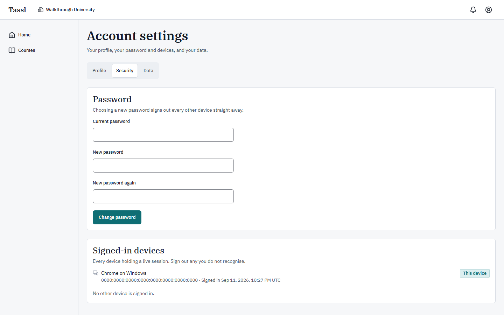

**Password.** The panel reads "Choosing a new password signs out every other device straight away."
— and it is literally true.

| Field | Rule |
|---|---|
| **Current password** | Wrong gives "That is not your current password." |
| **New password** | 12 to 128 characters, or "Use between 12 and 128 characters." |
| **New password again** | Must match, or "Both passwords must be the same." |

**Change password** saves it; the confirmation reads "Your password is changed. Other devices are
signed out." The device you are using stays signed in.

**Signed-in devices.** The panel reads "Every device holding a live session. Sign out any you do
not recognise." Each row names the browser and platform — "Chrome on Windows" — with the moment it
signed in, in UTC. The row you are reading from is badged **This device** and deliberately has no
sign-out button; use **Sign out** in the account menu for that one. Other rows carry a **Sign out**
button, and a **Sign out every other device** button sits below the list. When nothing else is
signed in, the line reads "No other device is signed in." instead.

### Settings → Data

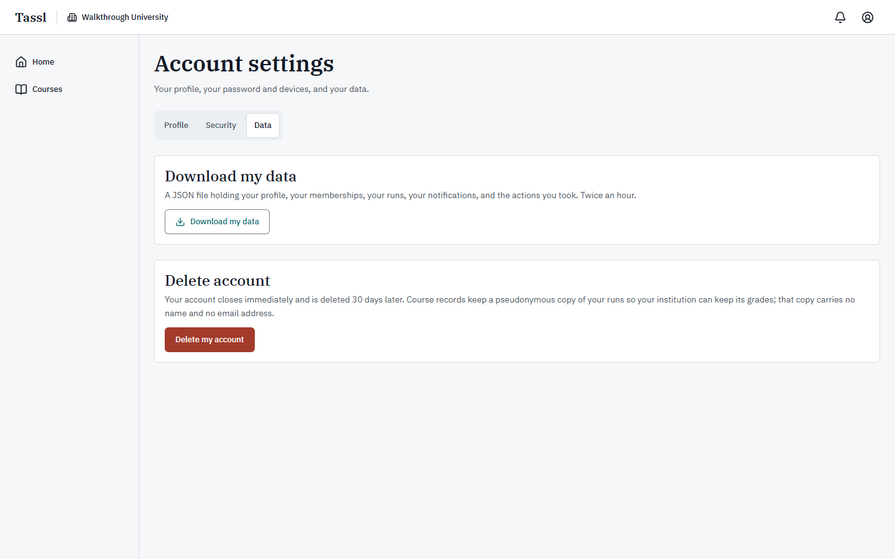

**Download my data.** The panel reads "A JSON file holding your profile, your memberships, your
runs, your notifications, and the actions you took. Twice an hour." Pressing **Download my data**
starts the file, and a message confirms "Your file is downloading." It carries your profile, your
institution and section memberships, your notifications, and the audit rows where you are the one
who acted — which, for a program lead, is the record of what you have done in Tassl. The run list in
it is empty for your seat because you take no runs. Two downloads per hour; a third gives "You can
download your data twice an hour. Try again shortly."

**Delete account.** The panel reads "Your account closes immediately and is deleted 30 days later.
Course records keep a pseudonymous copy of your runs so your institution can keep its grades; that
copy carries no name and no email address."

1. Press **Delete my account**.
2. The dialog **Delete your account?** explains: "You are signed out straight away and cannot sign
   in again. After 30 days everything Tassl holds about you is deleted; the pseudonymous course
   record of your runs stays with your institution."
3. Type your own email address into the confirmation field, whose label asks you to type the address
   of this account. The confirm button stays disabled until it matches.
4. **Delete my account** closes it; **Keep my account** cancels.

Closing your account removes your institution membership and your section memberships at once, and
cancels any pending invitation addressed to you. If you are the institution's only program lead,
arrange the replacement seat first — there is no screen that appoints one.

---

## 8. Common situations

**I want to see every course in the program.** → **Courses**.

**I want to read how one course is set up.** → **Courses** → the course's name → **Sections**, then
**Assignments**, then **Policy**, then **Mapping**.

**I want to know how a course turns a band into points.** → **Courses** → the course → **Mapping** →
the four numbers **Novice**, **Developing**, **Proficient**, **Professional**.

**I want to know what a course allows students to use outside Tassl.** → **Courses** → the course →
**Policy** → the selected option under **Outside-AI policy**.

**I want to know what one run is worth in a course.** → **Courses** → the course → **Policy** →
**Default run weight**.

**I want to know when an assignment opens, and how long students get.** → **Courses** → the course →
**Assignments** → the **State** and **Working clock** columns; **Package default** means the
scenario package's own clock.

**I want to see who is in a section.** → **Courses** → the course → **Sections** → **Roster** →
**Members**.

**I want to see who has been invited to the institution and has not yet joined.** → **Courses** →
the course → **Sections** → **Roster** → **Invitations** → the **Status** column.

**I want someone added to a section, or invited to the institution.** → Ask the course's instructor.
The roster's **Add member** panel and the invitation dialog are both refused for your seat.

**I want a course's policy or mapping changed.** → Ask the instructor who teaches it; your view of
both is read-only, under "You can read this course. Only an instructor who teaches it can change its
setup."

**I want the institution's plan, its default band mapping, or a data agreement changed.** → Ask a
platform administrator; there is no screen for any of the three, and an agreement needs at least one
permitted purpose.

**I want to explain where a number in the gradebook came from.** → **Courses** → the course →
**Policy** for the weight and **Mapping** for the four point values, then ask the section's
instructor for the run's course export history.

**I want a report on a cohort.** → There is none in this build. Ask each section's instructor for
their export history.

**I want to read a student's run.** → You cannot, in any form. A section's instructors and teaching
assistants read the replay; nobody else does.

**I want to change my password, or sign out a device I have lost.** → Account menu → **Settings** →
**Security**.

---

## 9. Error messages and what they mean

| What you see | Where | Why | What to do |
|---|---|---|---|
| **Not found** — "There is nothing at this address. It may have moved, or the link may be wrong." | The review queue, the admin area, an assignment, an assignment's export history, a run's replay, a mistyped course address | The address is not open to your seat, or nothing is there. Tassl answers the same way for both, so an address cannot be probed. | **Go home**. If it is an assignment you need, ask its section's instructor. |
| **Packages are not open to your seat** — "Only an instructor or a scenario author reads and writes packages in Walkthrough University. If you should be one, an administrator of the institution can change your seat." | The packages shelf | Packages belong to the authoring seats. | Nothing. If you should author, an administrator changes your seat. |
| "You do not have permission to do this." | **Add to section** and **Remove** on a roster | Roster membership belongs to the course's instructor. | Ask the instructor. |
| "You can read this course. Only an instructor who teaches it can change its setup." | Under the **Policy** and **Mapping** forms | Your seat reads a course; it does not configure one. | Ask the instructor who teaches it. |
| "That email address and password do not match an account." | Sign-in | Either the address or the password is wrong. Tassl will not say which. | Try again, or use **Forgot your password?** |
| "Enter a valid email address." / "Enter your password." | Sign-in | A field is empty or malformed. | Fill the marked field. |
| "Too many attempts. Wait a minute and try again." | Sign-in | Too many failed attempts for that address in a minute. | Wait, then try again. |
| "Confirm your email address before you sign in." | Sign-in | The account's address has not been confirmed. | Press **Resend verification** in the same alert and open the emailed link. |
| "Sign in to continue." | Any address after a session ends | The session expired, was signed out elsewhere, or your password was changed on another device. | Sign in again; you are returned to where you were going. |
| "That is not your current password." | Settings → Security | The current-password field is wrong. | Re-enter it. |
| "Use between 12 and 128 characters." | Settings → Security, sign-in | A password outside the allowed length. | Choose a password in range. |
| "Both passwords must be the same." | Settings → Security | The two new-password fields differ. | Retype them. |
| "Enter your name." / "Use 120 characters or fewer." | Settings → Profile | The name is empty or too long. | Fix the field and **Save changes**. |
| "You can download your data twice an hour. Try again shortly." | Settings → Data | A third download inside an hour. | Wait and download again. |
| "The download did not start. Try again in a moment." | Settings → Data | The request did not complete. | Press **Download my data** again. |
| "Type the email address of this account to confirm." | The delete-account dialog | The typed address does not match this account. | Type your own address exactly. |
| "The account was not deleted. Try again." | The delete-account dialog | The request did not complete. | Try again. |
| "The device list could not be loaded." | Settings → Security | The device list did not arrive. | Reload the page. |
| "That notification no longer exists." | Notifications | The row was removed between the page loading and your click. | Reload the page. |
| "Signing out did not work. Try again." | Account menu | The sign-out request failed. | Press **Sign out** again. |
| "Too many requests. Try again shortly." | Anywhere | Too many requests in a short window. | Wait a moment and retry. |
| **Something went wrong** — "The problem has been recorded. If it continues, quote the reference below." | Any screen | A defect. A reference code is shown below the sentence. | Press **Try again**. If it repeats, quote the reference to whoever runs your Tassl. |

### Empty states you will meet

| What you see | Where | What it means |
|---|---|---|
| **No course yet** — "Create a course to hold sections, assignments and the band mapping." | Home → **Courses** | The institution has no course. An instructor creates one. |
| **No courses yet** — "A course carries the outside-AI policy, the run weight, and the band-to-points mapping its assignments run under." | The **Courses** screen | The same, on the full list. |
| **No institution yet** — "Courses belong to an institution. Once you accept an invitation, the courses you teach appear here." | The **Courses** screen | Your account holds no institution membership. Only possible if your seat was removed. |
| **No sections yet** — "Add a section, then add the people who run its assignments to its roster." | A course → **Sections** | The course has no section. |
| **No assignments yet** — "An assignment carries the scenario package version, the working clock, and the weight a run starts from. Confirm a scenario package first." | A course → **Assignments** | The course has no assignment. |
| **Nobody is in this section yet** — "Add the people who will take this section's assignments. A student needs a row here before a run can start." | A roster → **Members** | The section has no roster rows yet. |
| **No invitations yet** — "Invite an address that does not belong to the institution and the invitation appears here with the day it expires." | A roster → **Invitations** | Nothing is outstanding. |
| **No assignments yet** — "A Decision Run is one consequential business decision, taken with an AI assistant in the room and under a clock you cannot pause. Tassl records what you did and your instructor reads it back. When a course assigns you one, it appears here." | The runs screen | You hold no student place, so there is nothing here. This screen is not for your seat. |
| **Nothing yet** — "Tassl writes here when a run is scored, a package finishes generating, or an instructor confirms your bands." | Notifications | Nothing has been written to you. For a program lead this is the normal state. |

---

## 10. Glossary

**Assignment** — One section's pointer at one confirmed scenario package version, carrying the
working clock, the variant, the weight and the opening time every run on it is taken under.

**Band** — The placement one dimension of a run holds: **Novice**, **Developing**, **Proficient**,
**Professional**, or **Unassessed**.

**Band-to-points mapping** — The four numbers that say what one confirmed band is worth in points in
a given course.

**Course** — The container that carries the outside-AI policy, the default run weight, the taught
concepts, and the band-to-points mapping its assignments run under.

**Course export** — The versioned document written for a run when all seven of its bands carry a
decision, and again after every correction; it carries the bands, the mapping and the points for
the gradebook.

**Data agreement** — The institution's record of what Tassl may do with its records: the
counterparty, the one platform role it may admit, the purposes, the record types covered and
excluded, the retention period, and the signed document it refers to.

**Decision Run** — The full run type: one consequential business decision taken with an AI
assistant in the room, under a clock that cannot be paused.

**Default run weight** — What one Decision Run in a course is worth in the gradebook. A Critique Run
defaults to half of it.

**Delegation** — One request a student makes of the run assistant and the reply that comes back;
every one is kept in the run's delegation log.

**Dimension** — One of the seven aspects of judgment a run is read on: **Framing**, **Delegation**,
**Verification**, **Calibration**, **Decision Quality**, **Adaptation**, **Ownership**.

**Gradebook of record** — Your institution's own gradebook. Tassl holds no grade; an instructor
enters the bands, the mapping and the points there.

**Institution** — The tenant an account belongs to. It owns the courses, the packages, the rosters
and the invitations.

**Invitation** — A seven-day, single-use email link that makes someone a member of an institution at
one seat. It cannot be cancelled, and accepting it is what writes the seat.

**Judgment Record** — The student's own permanent artifact of a run. It carries the bands and the
graphs and no course arithmetic, so nothing in it is a grade.

**Outside-AI policy** — A course's statement of what students may use outside Tassl: **Open**,
**Declared**, or **In-Environment Only**. Tassl displays it and never enforces it.

**Plan** — Which arrangement an institution is on: a pilot, a course license, a department, an
institution, or a practice pass. It is a label on the institution and changes nothing a student or
an instructor sees.

**Points** — The mean of the mapping's value over the dimensions a run was assessed on, rounded to
three decimals; an unassessed dimension is excluded, never counted as zero.

**Program lead** — Your seat: an institution-level role that reads every course and every roster,
and holds the institution's settings, invitations and data agreements.

**Roster** — The list of people in one section. A student needs a row on it before a run can start.

**Run** — One student's single attempt at one assignment, kept as a resumable record of everything
they did.

**Scenario package** — One decision case: the brief, the documents, the claims the assistant states,
the Turn, and the questions a student answers afterwards. An assignment runs on exactly one
confirmed version of one.

**Seat** — A person's role inside one institution. Tassl uses the word in refusals, as in
"Packages are not open to your seat".

**Section** — A division of one course holding its own roster; every assignment belongs to exactly
one section.

**Taught concepts** — One-per-line ideas a course teaches, which Tassl matches against what a
scenario package declares.

**Term** — Free text naming the teaching period a course runs in, written the way your institution
writes it.

**Unassessed** — A dimension the run holds nothing to place. It is reported as such and left out of
the division rather than counted as nothing.

**Variant** — One of two readings of a package's claims: the defective one plants exactly one
consequential defect, the sound one plants none. Which variant an assignment uses is not shown to
your seat.

**Walkthrough** — A practice assignment. A run on it can be deleted; a run that counts is voided
instead.

**Working clock** — The single unpausable countdown a run is taken under, starting when the student
locks their frame.
