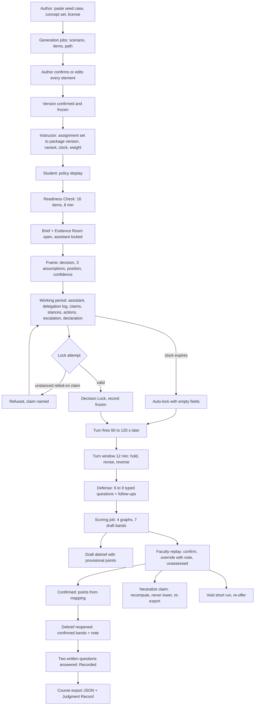
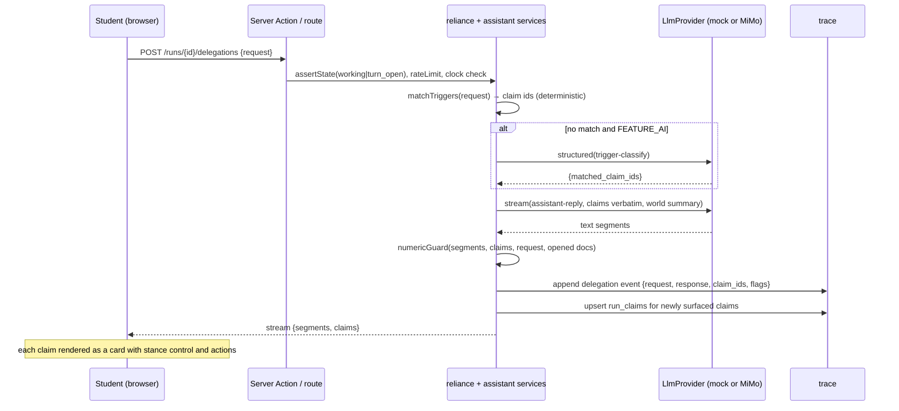
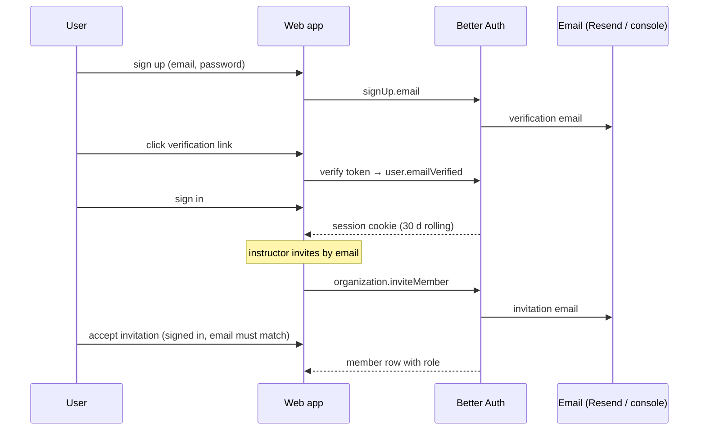

# 01 — PRD Analysis

**Purpose / Read this when:** you need the authoritative list of what Tassl must do, with one ID per requirement, before touching any spec or build step. Every other file in `docs/tech/` cites these IDs. Read this first in any session that adds scope, a screen, an entity, or a test.

**Requirements covered:** defines every `FR-`, `NFR-`, `UI-`, `DATA-`, `INT-`, `AI-`, `AN-`, and `SYS-` ID used in the documentation set.

**Source:** `docs/prd/Tassl-PRD.md` (canonical copy of `Tassl PRD.md`, 878 lines, unmodified). Section numbers below (for example "7.8") refer to that file. "Build" means the one-month deliverable accepted by the walkthrough in PRD §12; "future-state" means specified in the PRD but explicitly not a build commitment.

---

## 1. Product summary (as the PRD states it)

Tassl is a practice environment where students in professional degree programs make consequential decisions with an AI assistant in the room and remain accountable for them. A student enters a realistic business situation with incomplete information, disagreeing stakeholders, an assistant that is useful but not uniformly reliable, and conditions that change partway through. They state the decision before AI enters, choose what to delegate, take a position on each consequential claim (accept, verify, challenge, reject, escalate), commit under a clock, respond when conditions shift, and defend the result without AI assistance. Tassl assesses the decision process, not the deliverable. It records a run as instrument traces, plots them as four graphs against an authored standard, reads seven draft bands off the graphs, and hands graphs and bands to an instructor who debriefs from them and confirms or changes the bands. Tassl pronounces no verdict about the person; the course's points are the instructor's mapping of confirmed bands.

**Immediate objective (the build):** one working vertical slice of one Decision Run, accepted when the builder and the editor walk through it together on synthetic records, on both scenario variants, with no students and no institutional approvals (PRD §12, Definition of done). The stage after the build is a controlled GW pilot; the build proves the loop works, the pilot tests what it measures.

## 2. Personas

| Persona | PRD source | Role in the build | Role in the pilot and after |
|---|---|---|---|
| Student in a professional degree program (3rd/4th-year undergraduate, MBA; marketing and strategy) | §3 | Seat account played by the builder or editor ("student seat") | Takes runs, reads debriefs, controls the Judgment Record |
| Course instructor (buyer and enabler) | §3, §8 Roles | Seat account played by the builder or editor ("faculty seat") | Configures courses, reviews and confirms bands, decides appeals |
| Teaching assistant | §8 Roles | Not used (future-state) | Reviews and scores runs in assigned sections |
| Scenario author (faculty or Tassl scenario editor acting as disciplinary authority) | §7.18, §8 Roles | The builder: supplies the seed case, confirms or edits every generated element | Faculty author for their course |
| Program lead (associate dean, chair, chief AI officer) | §3, §8 Roles | Not used (future-state) | Sees aggregate reporting, manages plan and roster capacity |
| Tassl Scenario Editor (Tassl-side) | §8 Roles | The editor: runs AI generation from the seed case | Runs generation, calibration, drift audit under the written data agreement |
| Individual student outside an adopting course (Practice Pass) | §3, §8 Pricing | Not used (future-state) | Buys for themselves, library scenarios |
| Admin (Tassl operations) | Not in PRD (`SYS`) | Support and operations account | Same |

The two people in the walkthrough are **the builder** (PRD author, teaches the pilot course, disciplinary authority) and **the editor** (the AI collaborator that generated the scenario content). They swap the student and faculty seats between the two variant sessions (PRD §12, Who is in the room).

## 3. Jobs to be done

| Persona | Job | PRD source |
|---|---|---|
| Student | Answer the follow-up question without losing ownership of the work; practice consequential decisions with AI before the consequences are real | §3, §1 |
| Student | See, claim by claim, what they accepted, what each claim warranted, and how their confidence tracked the accuracy of what they relied on | §7.14 |
| Instructor | Get interpretable, evidence-linked diagnostics of student reasoning that reduce, not add, assessment burden | §3, §4 |
| Instructor | Read a run the way a flight instructor reads a simulator trace, confirm or override bands, and export points to the gradebook of record | §5, §7.17, §7.19 |
| Scenario author | Turn one published case into a confirmed, versioned, two-variant scenario package without writing it from a blank page | §7.18, §12 |
| Tassl Scenario Editor | Generate scenario content from a seed and (later) calibrate and audit it | §8 Roles |
| Builder and editor | Walk through the slice end to end and accept the build | §12 |

## 4. Success metrics exactly as the PRD states them

Every metric is measured in the pilot or later; the build produces no success metric. The only measures recorded from the build onward are the authoring operating measures.

| Metric | Statement | Status |
|---|---|---|
| Calibration Gain (primary) | Change from an early run to a later comparable run in the share of consequential claims on which the stance taken matched the stance warranted (from the stance matrix). Baseline near 55 percent, target near 73 percent, four-run horizon, 18-point gain | Planning hypotheses; pilot |
| False Challenge Rate (counter-metric) | Sound claims whose warranted stance is Accept or Verify that the student stanced Challenge or Reject, divided by all consequential claims in the run; professional reference band below 15 percent | Hypothesis; computed per run from the build onward |
| Other counter-metrics | Indiscriminate verification, blanket escalation, passive acceptance, median run duration | Pilot |
| Activation | Configured pilot within 14 days of instructor access; setup under 25 minutes; 85 percent first-run completion; 92 percent second-run continuation | Directional thresholds; pilot |
| Authoring operating measures | Time from seed case to confirmed scenario; edit rate at confirmation; review hours per generated element; share of generated elements rejected or edited; number of generation passes needed to satisfy §7.18 rules | Recorded from the build onward; not targets |
| Engagement | Completed Decision and Critique Runs, interrogation behavior, Evidence Room use before delegation, defense completion, debrief engagement | Pilot |
| Retention | 70 percent re-adoption, expansion to three courses, 15 percent voluntary use, 12 then 6 minutes from opening a run's graphs to confirming its bands, 10-to-25 percent override range | Business hypotheses; pilot |
| Outcomes | Change in coherence between recorded decisions and defense, proportional adaptation, confidence calibration, appropriate verification and escalation, transfer to a novel scenario | Placeholders pending pilot evidence |

## 5. Requirements register

Conventions: `Priority` is MoSCoW for the build: **M** must, **S** should, **C** could, **W** won't (future-state by PRD §12, kept for traceability and to prevent designs that preclude it). Acceptance criteria are written by the architect where the PRD gives none. `PRD` cites the section. IDs are stable; never renumber.

### 5.1 Standing rules (PRD §7 introduction)

| ID | Type | Description | PRD | Priority | Acceptance criteria | Notes |
|---|---|---|---|---|---|---|
| FR-001 | FR | When the assistant, a document, or an interrogation action fails to return, the run enters Paused, the working clock (or Turn window) stops, and the cost charged for the failed action is credited back on resume | §7 intro, §8 lifecycle | M | A forced assistant failure moves the run to `paused`; `clock_remaining_ms` is unchanged while paused; on resume a `resume` event carries `clock_credited_ms` equal to the failed action's cost; the debrief clock timeline shows the credit mark | Test control for the forced failure: FR-118 |
| FR-002 | FR | A run that cannot be scored is voided and re-offered on a fresh variant at no cost, with no partial score and no points recorded | §7 intro, §8 lifecycle | M | Voiding writes `run_voided`; the run's bands are absent from any export; a new run in state `assigned` exists on the other variant (or a fresh copy of the same variant when the family has two) with `re_offered_from_run_id` set | Faculty seat action in the build (FR-008) |
| FR-003 | FR | A claim found defective by accident (unintended defect, wrong verification result, misbehaving authored material) is neutralized in both directions and the scenario is routed for review; a genuine unintended inconsistency the student identifies is credited as a correct challenge | §7 intro, §7.2, §7.15 | M | `claim_neutralized` event; the claim's row is excluded from the stance matrix summary and from Verification and Calibration; the package version gets `review_requested_at`; a challenge on a claim later marked `inconsistency_credited` counts as matched | Credit-as-correct-challenge is applied by the faculty seat choosing "credit challenge" on neutralization |
| FR-004 | FR | A dimension that cannot be assessed is reported unassessed, never estimated; a graph whose trace events are missing is shown unavailable with the missing events named, never reconstructed | §7 intro, §7.13 | M | `run_bands.status = 'unassessed'` with `reason`; graph payload carries `available: false, missing_event_types: [...]`; UI renders the unavailable state and names the gap | |
| FR-005 | FR | A correction for Tassl's own error can raise a band or neutralize a dimension and never lowers a band or the points computed from it; after any correction each dimension keeps the higher of its pre- and post-correction band and the run exports the higher of its pre- and post-correction points, both recorded | §7 intro, §7.19 | M | Recompute after neutralization stores `band_before`, `band_after`, `band_effective = max`, `points_before`, `points_after`, `points_effective = max`; export carries all six | Band order Novice < Developing < Proficient < Professional; unassessed is excluded from the mean |
| FR-006 | FR | Nothing Tassl observes about a student is treated as misconduct or reported as such; no AI detection, proctoring, similarity checks, or misconduct findings exist anywhere in the product | §5, §7 intro, §7.21 | M | No code path, screen, export field, or event type expresses a misconduct finding; declaration of outside-tool use has no scoring effect (FR-060) | Reviewed in the security threat model and the copy review |
| FR-007 | FR | Every stage writes timestamped events to one append-only run trace; the four graphs, the draft bands, the debrief, and the faculty replay are built from the trace and nothing else | §7 intro, §7.13, §9, §12 | M | Every mutation of a run writes at least one `run_events` row in the same transaction; graph builders take only the event list and the package as input (pure functions); a property test regenerates the graphs from the export file and gets identical output | DATA-029 |
| FR-008 | FR | Void, re-offer, and claim neutralization are actions on the faculty seat inside the replay, each writing an event; no rule is applied by editing stored data outside the interface | §7 intro, §7.17 | M | Endpoints exist for all three; each writes `run_voided`, `run_reoffered` or `claim_neutralized`; audit log rows exist | |

### 5.2 Readiness Check and run modes (PRD §7.1)

| ID | Type | Description | PRD | Priority | Acceptance criteria | Notes |
|---|---|---|---|---|---|---|
| FR-010 | FR | A Readiness Check opens at the start of every run: 16 items in 8 minutes, six on disciplinary foundations, four on the concepts the scenario's defects turn on, six on AI behavior | §7.1, §12 step 3 | M | The check screen shows 16 items from the confirmed set with the 6/4/6 category split; an 8-minute server-authoritative timer runs; items are answered one at a time or in any order; submission before expiry records all answers | Timer expiry auto-submits what exists |
| FR-011 | FR | Items are drawn only from the scenario's confirmed 16-item set; an unconfirmed item is never drawn | §7.1 Rules | M | Drawing from a version with any unconfirmed item fails with `PACKAGE_NOT_CONFIRMED`; the confirmed version cannot be edited | Element confirmation: FR-150 |
| FR-012 | FR | The result maps named concepts (held, not held, unknown) in plain language, with no total score, no threshold placement, and no rank | §7.1, §12 step 3 | M | Result screen lists concepts with a plain-language sentence each; no numeric total appears in UI, trace header, or export except per-item correctness in `readiness_item` events | Thresholds below 50/50-80/above 80 are future-state |
| FR-013 | FR | The result never blocks entry; every build run opens in Standard Mode | §7.1, §12 | M | After submit or skip the run is in `framing` with `mode = 'standard'` | Guided and Open Modes: FR-019 |
| FR-014 | FR | The concept map is written to the run trace (header list and one `readiness_item` event per item), shown to the student in plain language, and shown to the faculty reviewer in the replay | §7.1, §12 trace | M | Export header carries `readiness: [{concept, status}]`; replay renders the concept map | |
| FR-015 | FR | The concept-level result on the concept a claim turns on is shown beside that claim's row in the stance matrix as context, never as an input to the warranted stance | §7.1, §7.8, §7.13 | M | Stance matrix rows carry `readiness_context: held/not_held/unknown` from the claim's `concept_key`; the warranted stance comes only from the variant claim state | |
| FR-016 | FR | The check is never graded and never enters the band-to-points mapping | §7.1 Rules | M | Points computation reads only `run_bands`; the readiness result has no field in the points record | |
| FR-017 | FR | An abandoned check resumes at the same item | §7.1 edge | M | Reopening a run in `readiness` shows the first unanswered item with earlier answers preserved | Discard after 48 hours is future-state (FR-019) |
| FR-018 | FR | If the check cannot be completed (timer expiry with unanswered items, or the student skips after a failure), the run proceeds in Standard Mode with unanswered concepts marked unknown | §7.1 edge, §8 lifecycle | M | Skip is offered only after a failed submit or after expiry; unanswered concepts are `unknown` in the header; a `readiness_skipped` event is written | "Escalation band widened" has no scoring effect in the build; recorded as the `unknown` status |
| FR-019 | FR | Future-state: 21-day suppression window, retakes with new items, mode placement from thresholds, Guided and Open Modes, harder-variant offer at ceiling, course-wide mode floor, coaching flag on twice-diverging readiness and behavior, generated-item exclusion after use, accommodation extra time, 48-hour discard | §7.1 | W | Data model carries `runs.mode` enum (`guided`, `standard`, `open`) and `readiness_results.expires_at` so these can be added without migration of existing rows | Deferred by PRD §12 |

### 5.3 Scenario Brief and Evidence Room (PRD §7.2)

| ID | Type | Description | PRD | Priority | Acceptance criteria | Notes |
|---|---|---|---|---|---|---|
| FR-020 | FR | The Scenario Brief (at most 200 words) and the Evidence Room (6 to 12 dated, attributed documents) open when the Readiness Check closes, with the assistant still locked | §7.2, §12 step 4 | M | Run in `framing` shows brief and document list; assistant endpoints return `ASSISTANT_LOCKED` until frame lock | Brief word limit enforced at package confirmation (FR-151) |
| FR-021 | FR | Each document has a title, date, author or attribution, a body of at most 4 pages, and a role: supporting, superseded by a named later document, stakeholder interpretation presented as fact, or accurate and irrelevant; at least one of each of the last three exists in the room | §7.2, §7.18 (4) | M | Package confirmation rejects a version without all three special roles; a superseded document references its superseding document id | "4 pages" is enforced as 2,000 words per document (DECISIONS D-081) |
| FR-022 | FR | Tassl records which documents were opened, in what order, for how long, and whether each open preceded the first use of the assistant; each open and close is a trace event with document id, duration, and the before-first-delegation flag | §7.2, §12 trace | M | `document_open` and `document_close` events with `document_id`, `duration_ms`, `before_first_delegation`; the clock timeline's reading segment is built from them | Client sends close on navigation and on tab hide; server caps duration at the clock |
| FR-023 | FR | No hints, highlighting, recommended order, or summary are shown in the room; nothing is hidden or locked | §7.2 | M | Evidence Room UI has no annotation affordances; all documents are readable at any time the room is open | |
| FR-024 | FR | Never opening the room is permitted; four-second opens are reported as skimming against document length with no inference about intent | §7.2 edge | M | Clock timeline marks opens shorter than `min(4 s, words/40 s)` as `skim: true`; the debrief text says "opened briefly" and never characterizes intent | Words per second = 4 as a reading-rate constant (DECISIONS D-082) |
| FR-025 | FR | Imported outside facts, or a figure carried over from the recognized seed case, are not penalized and become assumptions to defend; the defense asks where they came from | §7.2 edge | M | A brief numeric field value that matches no claim and no document triggers the provenance question in the defense selection (FR-101) | |
| FR-026 | FR | If a carried-over figure or the teaching note's conclusion resolves a consequential claim, the claim is neutralized and the scenario returned for a deeper re-skin | §7.2 edge, §7.18 edge | M | Faculty neutralization with reason `adaptation_failed` sets the package version's `review_requested_at` and `review_reason` | Manual judgment by the faculty seat; FR-003 |
| FR-027 | FR | Re-skin rule: fictional company, market, and people; altered figures so no number in the published case or teaching note resolves a consequential claim; restructured evidence so documents do not mirror the case's exhibits; the disciplinary authority checks the teaching note against the confirmed answer space and claims before confirming | §7.2 Rules, §7.18 | M | Seed record holds a re-skin log (renamed entity, altered number, restructured document entries); package confirmation requires the authority to tick "teaching note checked against answer space and claims" | AI-001 |
| FR-028 | FR | Any attribution the seed case's license requires appears only in instructor-facing material (authoring record, package view), never in student-facing screens or the record export | §7.2 Rules, §7.18 | M | Seed record fields render on package view (author/instructor roles) and are absent from every student route and from the trace export | |

### 5.4 Stakeholders (PRD §7.3)

| ID | Type | Description | PRD | Priority | Acceptance criteria | Notes |
|---|---|---|---|---|---|---|
| FR-030 | FR | Each stakeholder's position, incentives, and blind spots are defined in the confirmed package and reach the student as at least one dated, attributed Evidence Room document, and through the Turn where the Turn is a stakeholder message; two stakeholders contradict each other across their documents | §7.3, §7.18 (5) | M | Package confirmation rejects a version where any stakeholder has no document or where no contradiction pair is declared | |
| FR-031 | FR | A stakeholder claim read from a document requires a stance like any other (Evidence Room stance) | §7.3, §7.8 | M | Claims with `source_kind = 'document'` appear in the claims panel once the student opens the source document and can carry a stance | |
| FR-032 | FR | Future-state: live Stakeholder Interview action, 4-minute clock cost, three-exchange cap, in-voice answers | §7.3, §12 | W | `run_actions.type` enum includes `stakeholder_interview`; not offered in the build UI | Deferred by PRD §12 |

### 5.5 Framing (PRD §7.4)

| ID | Type | Description | PRD | Priority | Acceptance criteria | Notes |
|---|---|---|---|---|---|---|
| FR-040 | FR | Framing is mandatory once the Evidence Room opens and before the assistant unlocks: the real decision (at most 50 words), three load-bearing assumptions (25 words each), an initial position (at most 100 words), and a confidence number 0 to 100 | §7.4, §12 step 5 | M | Server rejects a frame with any empty field, any field over its word limit, or confidence outside 0-100 with `FRAME_INVALID` naming the field; word counting is whitespace-token based | |
| FR-041 | FR | Locking the frame is permanent; Tassl unlocks the assistant without evaluating or commenting; the frame stays visible for the rest of the run | §7.4 | M | `frame_locked` event; `run_frames` has no update path (DB grant revoked and no service function); run state becomes `working`; the frame panel is rendered on every later run screen | NFR-004 |
| FR-042 | FR | One word per field passes the gate | §7.4 edge | M | A one-token field is accepted | The cost lands in Framing (rubric) and in the defense |
| FR-043 | FR | An unlocked frame lost before locking is re-entered; a locked frame is never restored, edited, or replaced, including by an instructor | §7.4 edge | M | Draft frame is client-held only; no endpoint edits a locked frame; admin has no override | |
| FR-044 | FR | The frame is the baseline for Adaptation scoring and the left panel of the frame-beside-decision graph | §7.4 Rules, §7.13 | M | Graph builder reads `frame_locked` payload as the left column | |

### 5.6 The AI assistant (PRD §7.5)

| ID | Type | Description | PRD | Priority | Acceptance criteria | Notes |
|---|---|---|---|---|---|---|
| FR-050 | FR | The assistant is available from frame lock to Decision Lock and again during the Turn window, never during the defense or before frame lock | §7.5, §7.12 | M | Delegation endpoint returns `ASSISTANT_LOCKED` outside `working` and `turn_open` states | |
| FR-051 | FR | Consequential claims are versioned claim objects with authored evidence status and acceptable verification paths; when a delegation matches a claim's trigger, the response carries the claim text verbatim and the interface presents it as a discrete item with its stance control, Source Trace, and other available actions; surrounding generative text carries no stance and is never scored | §7.5, §12 step 6 | M | Delegation response payload is `{ text_segments: [...], claims: [{claim_id, version, text}] }`; the UI renders each claim as a card with stance control; only `claims` create `run_claims` rows | AI-002, AI-004 |
| FR-052 | FR | The assistant cannot introduce a consequential claim that is not in the confirmed scenario; generative text runs around the controlled claim layer using frozen or constrained responses at measurement moments | §7.5 | M | Generative text is produced with the numeric guard (AI-002): any number token not present in surfaced claims, the request, or opened documents is flagged `unverified_number` in the delegation event and rendered with a marker; the faculty replay lists flagged numbers | Neutralization of such a claim is FR-003 |
| FR-053 | FR | A Sycophancy Probe is an authored claim object with a scripted reversal, included only if the confirmed package contains one; the walkthrough does not require it | §7.5, §7.18 (10) | S | If the package has a probe and the student challenges the probe claim, the assistant returns the scripted reversal verbatim and writes `probe_fired`; the debrief shows the transcript | |
| FR-054 | FR | Delegation is scored on whether not using the assistant was reasoned and stated | §7.5 edge, §7.13 edge | M | A run with zero delegations drafts Delegation from the defense answers and any stated reason (rubric A.2) | Scoring FR-130 |
| FR-055 | FR | Attempts to extract defect locations, invented information, or another language are answered in-scenario and recorded neutrally; offensive or out-of-scenario content is flagged in one action and excluded from scoring | §7.5 edge | S | Delegation event supports `flags: ['out_of_scenario']` set by the faculty seat from the replay; flagged delegations are excluded from the clock timeline's scored segments and from Delegation reads | Repeated extraction attempts surfacing to the instructor is future-state (FR-058) |
| FR-056 | FR | The assistant is labeled "AI assistant" and never reveals defect locations or scores | §7.5 Rules | M | UI label; system prompt and mock provider never reference evidence status; a test asserts no response contains the words "defective", "planted", or any band name | |
| FR-057 | FR | Ten failure families are the taxonomy for authored defects: near-neighbor question, unstated assumption, stale evidence, uncomputed number, extrapolation beyond evidence, reversal to agree without evidence, omitted better alternative, misapplied method, misattributed source, ethically unacceptable route | §7.5 Rules | M | `failure_family` enum with exactly these ten values | |
| FR-058 | FR | Future-state: per-scenario reliability calibration, live Sycophancy Probe frequency, instructor surfacing of repeated extraction attempts | §7.5 | W | | Deferred by PRD §12 |

### 5.7 Delegation Log and outside-tool declaration (PRD §7.6)

| ID | Type | Description | PRD | Priority | Acceptance criteria | Notes |
|---|---|---|---|---|---|---|
| FR-060 | FR | The Delegation Log records each delegation as a unit of work: what was asked, what came back, which claims resulted, which the student marked as used, and the stance each carried; an optional one-line "why" | §7.6, §12 step 6 | M | `delegation` event with `request_text`, `response_text`, `claim_ids`, `why`; `claim_used` event on marking used; the log screen lists delegations in order with their claims and stances | Guided-Mode required why line is future-state |
| FR-061 | FR | A standing control lets the student declare outside-tool use and its purpose; it is a text field that writes one `outside_tool_declared` event and has no scoring effect; the interface states that declaring never lowers a band or a point | §7.6 | M | Control visible on every working-period screen; event payload `{purpose}`; the no-penalty sentence is rendered next to it; scoring code has no reference to the event | |
| FR-062 | FR | Tassl does not detect, infer, or estimate undeclared use; course policy (Open, Declared, In-Environment Only) is displayed and not enforced; a declaration inside an In-Environment Only course is surfaced to the instructor with no scoring effect | §7.6, §7.19 | M | Replay shows declarations with the course policy beside them; no enforcement branch exists | |
| FR-063 | FR | Each delegation appears as a segment on the clock timeline and the claims it produced as rows in the stance matrix | §7.6, §7.13 | M | Timeline segment type `delegation` with the delegation id; matrix rows carry `surfaced_by_delegation_id` | |
| FR-064 | FR | An incomplete log (delegations missing response text or claims) scores Delegation from the defense alone | §7.6 edge | M | Scoring marks Delegation `provisional` with basis `defense_only` when any delegation event lacks `response_text` | |

### 5.8 Interrogation actions (PRD §7.7)

| ID | Type | Description | PRD | Priority | Acceptance criteria | Notes |
|---|---|---|---|---|---|---|
| FR-070 | FR | Source Trace (1 minute) is available on every sourced claim from its creation until Decision Lock and during the Turn window; it shows the document, the passage, the document's date and author, as authored on the claim object | §7.7, §12 step 6 | M | `action` event `{type:'source_trace', claim_id, clock_cost_ms: 60000, result}`; result is the claim's `verification_paths.source_trace` payload verbatim | |
| FR-071 | FR | Replication Check (3 minutes) and Decomposition Check (4 minutes) are offered only on claims whose confirmed path names them; otherwise they are not offered and the debrief names only the actions that were available | §7.7 | M | Action buttons render only when `verification_paths.replication_check` or `.decomposition_check` exists on the claim; results returned verbatim; the debrief's "action that would have surfaced it" names only authored paths | |
| FR-072 | FR | Every action's clock cost is charged at the moment the action starts; an action once started completes even if the clock expires mid-action; actions cannot be undone | §7.7 | M | Clock deduction is written before the result; a request arriving with `clock_remaining_ms <= 0` is refused with `CLOCK_EXPIRED` but an action started before expiry returns its result | |
| FR-073 | FR | Tassl never says a claim is wrong; it shows what the action produced and records the action, cost, and result on the clock timeline and in the stance matrix | §7.7 | M | Action result UI contains only the authored result; matrix rows list preceding actions; timeline segments carry the cost | |
| FR-074 | FR | The working clock is the only constraint on Source Trace, Replication Check, and Decomposition Check (no quota); escalations carry their own cap | §7.7 Rules | M | No count limit exists in the service for the three checks | FR-092 for the escalation cap |
| FR-075 | FR | Right action with wrong conclusion (traced the claim, misread the date) is separated in the debrief from the missing action | §7.7 edge | M | Debrief per-claim text distinguishes "traced, then accepted" from "not traced" using the action list and the final stance | |

### 5.9 Reliance stances and confidence (PRD §7.8)

| ID | Type | Description | PRD | Priority | Acceptance criteria | Notes |
|---|---|---|---|---|---|---|
| FR-080 | FR | Five stances on any surfaced claim: Accept, Verify, Challenge, Reject, Escalate; a claim may come from the assistant, a document, or student-supplied material | §7.8, §12 step 6 | M | `stance` enum; stance control on every claim card; `stance_set` event `{claim_id, stance, previous_stance, action_ids}` | Escalate also triggers FR-090 |
| FR-081 | FR | Tassl records stance, timing, evidence available, verification cost, claim importance, learner readiness, and consequence level for each stance | §7.8 | M | `stance_set` payload plus the claim table row carry all seven | |
| FR-082 | FR | The warranted stance is a fixed attribute of each claim object per variant, the same for every student; the stance matrix compares stance taken with stance warranted | §7.8, §7.18 (8) | M | `variant_claim_states.warranted_stance` is read-only after confirmation; matrix row = `{taken, warranted}` | |
| FR-083 | FR | Confidence is captured at three points: in the frame, at Decision Lock, and after the Turn; these form the confidence line plotted against the authored accuracy of the claims relied on at each point | §7.8, §7.13 | M | Three integers 0-100 in `frame_locked`, `decision_locked`, `turn_response_locked`; graph builder computes accuracy = sound-or-verified relied-on claims / relied-on claims at each point | |
| FR-084 | FR | Lock gate: a relied-on consequential claim without a stance prevents Decision Lock and the refusal names the first such claim; relied-on means marked used in the log, a number it carries entered in a named numeric field, or surfaced in the Turn window | §7.8 Rules, §7.10, §12 step 8 | M | `POST /runs/{id}/lock` returns `LOCK_REFUSED_UNSTANCED_CLAIM` with `claim_id`; `lock_refused` event written; claims surfaced but not relied on may stay unstanced and are listed as such in the replay | |
| FR-085 | FR | Both stances are kept when a stance changes after an action | §7.8 edge, §12 step 6 | M | `stance_set` carries `previous_stance`; the matrix row shows both with the action between them | |
| FR-086 | FR | Constant or flat confidence is not blocked; the debrief shows the student their own confidence line | §7.8 edge | M | No validation beyond 0-100; the confidence line renders three points regardless | Scoring treats flat 50 as uninformative (rubric A.4) |
| FR-087 | FR | If more than a third of consequential claims lose their stance record the run is voided and re-offered; if a third or fewer, the run stands and Calibration and Verification are unassessed and excluded from points | §7.8 edge | M | Scoring counts claims with `stance_record_lost = true` (set by neutralization reason `record_lost`); > 1/3 raises `RUN_UNSCOREABLE` and the faculty seat is prompted to void; ≤ 1/3 marks the two dimensions unassessed | Stance records are never lost by normal operation; this path is exercised through neutralization with that reason |

### 5.10 Escalation (PRD §7.9)

| ID | Type | Description | PRD | Priority | Acceptance criteria | Notes |
|---|---|---|---|---|---|---|
| FR-090 | FR | Escalate on any claim before Decision Lock and during the Turn window: the student states in one sentence what they cannot evaluate; the authored per-claim colleague reply returns verbatim at a cost of 5 minutes | §7.9, §12 step 6 | M | `escalation` event `{claim_id, statement, response_id, clock_cost_ms: 300000}`; statement limited to 280 characters; reply text is `scenario_claims.escalation_reply` | |
| FR-091 | FR | An escalation on a claim with no authored reply returns the path's general reply, is charged 5 minutes, and does not count against the limit | §7.9 | M | `response_id = 'general'`; `counts_against_limit = false` | |
| FR-092 | FR | Two escalations per run count against the limit; a third authored-reply escalation is refused; a reply that fails to arrive does not count | §7.9 Rules, §7.8 edge | M | `ESCALATION_LIMIT_REACHED`; failed replies (Paused path) are not counted | |
| FR-093 | FR | The colleague never decides or reveals defect status; replies are authored, hedged, explicitly incomplete | §7.9 Rules | M | Package confirmation shows the reply beside the claim's evidence status for the authority to check; no generated reply is used at run time | AI-001 generates replies at authoring time only |
| FR-094 | FR | Future-state: generative colleague answering arbitrary requests | §7.9 | W | | Deferred by PRD §12 |

### 5.11 Decision Brief and Decision Lock (PRD §7.10)

| ID | Type | Description | PRD | Priority | Acceptance criteria | Notes |
|---|---|---|---|---|---|---|
| FR-100 | FR | The Decision Brief holds a recommendation (120 words), a rationale (250), three assumptions (25 each), what would change their mind (60), a confidence number, and the scenario's named numeric fields typed as numbers; it is openable at any time during the working period and filed before the clock expires | §7.10, §12 step 8 | M | Draft saved on every change (`brief_opened`/`brief_closed` events with duration); server validates limits on lock with `BRIEF_INVALID` naming the field; numeric fields accept numbers only | Named fields come from the package (FR-158) |
| FR-101 | FR | A value entered in a named numeric field that matches a value carried by a claim object marks that claim as relied on | §7.10, §7.8 | M | Matching is exact after normalizing to the claim's declared unit and 2 significant decimals; `claim_used` event `{via:'named_field', field_key}` | |
| FR-102 | FR | Decision Lock freezes the brief, frame, delegation log, stance record, and interrogation history as an immutable pre-Turn record; the lock is irreversible; the pre-Turn record is the left side of the frame-beside-decision graph | §7.10 | M | `decision_locked` event; run state `decision_locked`; all write endpoints for the working period return `RUN_LOCKED` | NFR-004 |
| FR-103 | FR | No attachments, images, tables, formatting, or links; word limits are hard | §7.10 Rules | M | Fields are plain textareas; pasted markup is stripped to text; server rejects over-limit text | |
| FR-104 | FR | The working clock runs from frame lock to Decision Lock; its length is a package field marked uncalibrated (default 25 minutes) and can be overridden per assignment | §7.10, §7.18 (15), §12 step 8 | M | `assignments.working_clock_seconds` overrides `package.working_clock_seconds`; the run header records the length and `uncalibrated: true` | |
| FR-105 | FR | Clock expiry auto-locks whatever exists: empty fields recorded empty, relied-on claims without a stance recorded unstanced (not Accept); the run continues to the Turn and defense | §7.10 edge, §12 step 8 | M | Any read of a run past expiry materializes `decision_locked` with `auto: true` and the expiry timestamp; the claim table marks `stance: null, relied_on: true` | |
| FR-106 | FR | A lock under 4 minutes after frame lock is flagged as a speed outlier, a signal not a penalty | §7.10 edge | M | `decision_locked.speed_outlier = true` when elapsed working time < 240 s; replay shows the flag; scoring ignores it | |
| FR-107 | FR | A post-lock edit is refused; a 50-word timestamped Addendum is offered, visible to the student and every reviewer and never part of the original decision | §7.10 edge, §12 step 8 | M | `addendum` event `{text, timestamp}`; at most 50 words; one addendum per run; rendered separately from the brief on every screen | |
| FR-108 | FR | A failed lock returns the student to the brief with content preserved | §7.10 edge | M | The refusal response leaves the draft untouched | |
| FR-109 | FR | Recommendation outside the answer space is bottom of Decision Quality with the debrief naming the evidence it ignores; a recommendation identical to the assistant's is not penalized; declining to recommend is assessed against the minimum defensible commitment | §7.10 edge | M | Scoring reads the recommendation against `answer_space.positions` and `evidence_inconsistent_positions` (AI-003); debrief names the ignored evidence from the matched inconsistent position | |

### 5.12 The Turn and adaptation (PRD §7.11)

| ID | Type | Description | PRD | Priority | Acceptance criteria | Notes |
|---|---|---|---|---|---|---|
| FR-110 | FR | The Turn fires automatically 60 to 120 seconds after Decision Lock (the delay is a package field), once per run, with one piece of new information in the voice of the world | §7.11, §12 step 9 | M | `turn_due_at = decision_locked_at + delay`; `turn_delivered` event materialized on the first read at or after `turn_due_at` with `occurred_at = turn_due_at`; the client polls every 5 s | NFR-002 |
| FR-111 | FR | The assistant, Evidence Room, and interrogation actions reopen for 12 minutes; any new claim surfaced in the window requires a stance | §7.11 | M | Run state `turn_open` with `turn_window_ends_at`; claims surfaced in the window are `relied_on = true` by rule; the Turn response lock is refused while any is unstanced | |
| FR-112 | FR | The student responds hold, revise, or reverse with at most 150 words of justification and an updated confidence, with the frozen pre-Turn record shown alongside in the frame-beside-decision layout | §7.11, §12 step 9 | M | `turn_response_locked` event `{response, justification, confidence}`; UI shows frame, locked brief, and response side by side | |
| FR-113 | FR | No response in the window auto-locks the original as an implicit hold with no justification | §7.11 edge | M | Read past `turn_window_ends_at` materializes `turn_response_locked {response:'hold', implicit:true, justification:null, confidence:null}` | |
| FR-114 | FR | Whether the Turn warrants hold, revise, or reverse and the proportionate response are declared in the confirmed package; Adaptation is drafted against that declaration and the frozen frame | §7.11 Rules, §7.18 (11) | M | `turns.warrants_change`, `turns.proportionate_response`, `turns.evidence`; scoring compares response category with `proportionate_response` | |
| FR-115 | FR | Offline when the Turn fires: delivered on next entry with the full 12 minutes | §7.11 edge | M | The window starts at the first read after `turn_due_at` when that read is more than 12 minutes after `turn_due_at` | Implemented by starting `turn_window_ends_at` at delivery-read time, never earlier than `turn_due_at + 12 min` |
| FR-116 | FR | Future-state: library-level one-in-three ratio, re-authoring on miscalibration with Adaptation neutralization across runs | §7.11 | W | Neutralize-dimension path exists for a single run (FR-005) | Deferred by PRD §12 |
| FR-117 | FR | The Turn window and the working clock run only while the run is open; a closed run does not consume its clock | §7.10 | M | Clock is computed from `working_started_at`, paused intervals, and charged costs; browser closure while `working` does not stop the clock (PRD: the clock runs while the run is open, that is, until lock); the Turn window counts from delivery | The 72-hour Abandoned state is future-state |
| FR-118 | FR | A build-phase test control on the faculty seat forces one assistant call to fail, exercising Paused | §12 step 7, Definition of done | M | `POST /review/runs/{id}/test-controls/force-assistant-failure` sets a one-shot flag; the next delegation fails with a simulated provider error, the run enters `paused`, and the credit path runs (FR-001); the control is behind `FEATURE_TEST_CONTROLS` | SYS-013 |

### 5.13 The defense (PRD §7.12)

| ID | Type | Description | PRD | Priority | Acceptance criteria | Notes |
|---|---|---|---|---|---|---|
| FR-120 | FR | The defense opens after the Turn response locks; it is typed; the assistant and Evidence Room are unavailable; the locked brief, frozen frame, and Turn response remain visible | §7.12, §12 step 10 | M | Run state `defense_pending`; defense screen has no assistant or documents; the three artifacts render read-only | 48-hour window and Defense Missed are future-state (FR-127) |
| FR-121 | FR | Six to nine questions are selected from the confirmed question bank by run-record conditions: provenance for a consequential claim relied on without a Source Trace; verification for a claim whose stance changed after an action; assumption for a frame assumption the brief or Turn response departs from; confidence when confidence at lock exceeds confidence at frame; frame-versus-response after any Turn response; default questions fill to six; at most nine | §7.12, §12 step 10 | M | Selection is a pure function of the event list and the bank; each `defense_question` event carries `question_id, selecting_event_id`; test fixtures cover each condition and the fill rule | The "assumption departed from" test: the assumption text does not appear (normalized) in the brief assumptions and the Turn justification, or the response is `reverse` |
| FR-122 | FR | Run-time selection fills in the student's own claims, figures, and stances into the question templates | §7.12 | M | Templates use `{claim_text}`, `{figure}`, `{stance}`, `{document_title}` placeholders replaced from the run record | |
| FR-123 | FR | Each question carries one authored follow-up, asked when the typed answer names no source, number, or reason; expected-answer notes are shown to the faculty seat | §7.12, §12 step 10 | M | Follow-up trigger is deterministic: the answer contains no digit, no document title token, and no reason marker ("because", "since", "so that", "given"); follow-up is written as a `defense_question` event with `follow_up_of`; notes render only on the faculty replay | DECISIONS D-031 |
| FR-124 | FR | Each answer is recorded with its text and duration | §12 trace | M | `defense_answer` event `{question_id, text, duration_ms}` | |
| FR-125 | FR | "I do not know" is credited when accurate and paired with what they would do; a brief read aloud verbatim triggers a follow-up; nothing answered is low Ownership and an instructor flag; second language scored on content alone | §7.12 edge | M | Rubric A.7 reads; an answer whose normalized text is contained in the brief triggers the follow-up regardless of the deterministic trigger; all-empty answers set `flags.nothing_answered` on the run for the replay | AI-003 |
| FR-126 | FR | A dropped connection resumes at the same question | §7.12 edge | M | Unanswered questions persist server-side; reopening the defense shows the first unanswered question | Reschedule with new questions after 10 minutes is future-state |
| FR-127 | FR | Future-state: spoken pathway, 48-hour window, Defense Missed with Ownership at Novice, reschedule, deeper follow-ups, comparability study | §7.12, §12 | W | `runs.state` enum includes `defense_missed`; scoring has a branch for it that is unreachable in the build | Deferred by PRD §12 |

### 5.14 Judgment scoring and the graph set (PRD §7.13, Appendix A)

| ID | Type | Description | PRD | Priority | Acceptance criteria | Notes |
|---|---|---|---|---|---|---|
| FR-130 | FR | After the defense, Tassl plots the four graphs and drafts seven provisional bands (Novice, Developing, Proficient, Professional) for Framing, Delegation, Verification, Calibration, Decision Quality, Adaptation, Ownership, each citing the graph it was read from and the trace event ids behind it | §7.13, §12 step 11 | M | `draft_band` event per dimension `{dimension, band|unassessed, evidence_event_ids, graph_keys, quoted_text?, provisional}`; run state `scored` | |
| FR-131 | FR | Tassl produces no composite judgment score, rank, percentile, or trait claim; its output for a run is the bands with their evidence | §7.13, §7.16, §7.19 | M | No field named score/rank/percentile exists on run tables, events, or exports except `points` (FR-190) and `false_challenge_rate`; a grep-based test enforces the field-name rule | |
| FR-132 | FR | Confidence line: confidence at frame, lock, and after the Turn against the share of relied-on consequential claims at each point that were sound or verified under the authored conditions | §7.13 | M | Graph payload `{points: [{at:'frame'|'lock'|'turn', confidence, accuracy, relied_on_claim_ids}], data_table, description}` | "Verified" means a Source Trace, Replication Check, or Decomposition Check ran on the claim before that point |
| FR-133 | FR | Clock timeline: working clock and Turn window segmented by activity (reading by document, delegations, each action, each escalation, time in the brief, unattributed time, Turn response) with claim-touching events and clock-stop credits marked | §7.13 | M | Graph payload `{segments: [{type, start_ms, end_ms, ref_id, claim_ids}], marks: [...], data_table, description}` | |
| FR-134 | FR | Stance matrix: one row per consequential claim with stance taken vs warranted, when set, preceding action, evidence status, importance, load-bearing mark, readiness context; a 5×5 summary; False Challenge Rate = sound claims warranted Accept or Verify that were stanced Challenge or Reject, over all consequential claims | §7.13, §10 | M | Payload `{rows, summary[5][5], false_challenge_rate}`; unit test reproduces 8/11 = 0.727 | Neutralized rows are excluded from summary and FCR and shown struck through |
| FR-135 | FR | Frame beside decision: frozen frame, locked brief, Turn response side by side with the assumptions the Turn disrupted marked | §7.13 | M | Payload `{frame, brief, turn_response, disrupted_assumption_indexes}`; disruption = the Turn's `disrupted_assumption_keys` from the package intersected with a token match on the frame assumptions | |
| FR-136 | FR | Every graph carries its underlying data table and a text description; a dimension that reads from more than one graph is unassessed when any of its graphs is unavailable and cites every graph it reads from | §7.13, §7.20 | M | Each payload has `data_table` (columns, rows) and `description`; dimension→graph map is fixed: Framing {frame, clock}, Delegation {clock}, Verification {clock, matrix}, Calibration {matrix, confidence}, Decision Quality {frame}, Adaptation {frame}, Ownership {defense against all four} | |
| FR-137 | FR | Bands are drafted against the Appendix A descriptors from a categorical part computed from events and authored attributes, and a free-text part the model reads and quotes: frame text (Framing), why lines and reasons for not delegating (Delegation), recommendation and rationale against the answer space (Decision Quality), Turn justification against the frozen frame (Adaptation), typed defense answers against expected-answer notes (Ownership); Verification and Calibration are computed throughout | §7.13 Rules | M | Scoring pipeline = `categorical(events, package) → reads(llm) → band per dimension`; each read returns `{band, quotes: [{event_id, text}], rationale}` validated by Zod; a free-text band is `provisional: true` | AI-003; rubric versioned in code (DECISIONS D-033) |
| FR-138 | FR | A free-text read the run cannot support (for example Delegation on an incomplete log) is drafted from the defense answers instead and marked provisional on that basis; a dimension with no evidence is unassessed | §7.13 Rules | M | `basis` field on the band: `trace`, `defense_only`, or `none` | |
| FR-139 | FR | The rubric's fixed placements are honored: accept-everything is bottom of Calibration in a two-defect run and top in a defect-free run; both consequential defects escalated (or kept from the decision by challenge, rejection, or verification) is top of Calibration; recommendation outside the answer space is bottom of Decision Quality; over-adaptation scores as poorly as failing to adapt; holding with a reason scores as highly as warranted revision; implicit hold where no change was warranted is Developing; Defense Missed caps Ownership at Novice; nothing to catch and nothing caught is high Calibration | §7.8, §7.9, §7.10, §7.11, §7.12, §7.13, Appendix A | M | Golden fixtures in `evals/scoring/` for each placement pass against the mock provider | |
| FR-140 | FR | Draft scoring that cannot complete with an intact record holds the run pending and notifies the instructor with the raw trace and whichever graphs could be plotted, who may band manually with unassessed dimensions; the student sees "under review"; no points export until confirmed | §7.13 edge | M | Scoring job failure after retries sets `runs.scoring_status = 'held'`, creates a notification, and the replay allows manual banding; the student run page shows the under-review state | |
| FR-141 | FR | Novice across every dimension raises an instructor flag and a recommendation to revisit foundations; Professional across all seven shows the harder variant coming next (illustrative in the build) and the action closest to a mistake | §7.13 edge, §7.14 edge | S | `run_scores.flags` includes `all_novice` or `all_professional`; the debrief leads with the two underlying concepts (from the missed claims' `concept_key`) or the closest-to-mistake row | |
| FR-142 | FR | The seven dimension rubric (four descriptors per dimension and the 21 `[EDIT]` boundary sentences) is a versioned artifact; the build scores against version 1, copied verbatim from Appendix A, and the builder's edit produces version 2 without changing scored runs | §7.13, Appendix A.0 | M | `src/server/modules/scoring/rubric/v1.ts` exports the descriptors and boundaries; `run_scores.rubric_version` recorded; changing the rubric requires a new file and a bump | DECISIONS D-033 |
| FR-143 | FR | The 7.13 "Interpretation to confirm" reading (four graphs, bands read off graphs, instructor debriefs from graphs) is the implemented model | §7.13 | M | The four graph builders exist exactly as named | DECISIONS D-034 |
| FR-144 | FR | Future-state: inter-rater measurement, override statistics, risk-based queue and batch confirmation, calibrated boundaries, cross-run trajectory as live data | §7.13, §7.17 | W | | Deferred by PRD §12; illustrative trajectory is FR-171 |

### 5.15 The Run Debrief (PRD §7.14)

| ID | Type | Description | PRD | Priority | Acceptance criteria | Notes |
|---|---|---|---|---|---|---|
| FR-150 | FR | The debrief is available within 10 minutes of draft scoring with every band marked draft; confirmed bands and any instructor note replace the draft in place | §7.14, §12 steps 11, 13 | M | Debrief route renders as soon as `runs.state = 'scored'`; band cards show `draft` or `confirmed` with the note; the same route is used before and after confirmation | NFR-001 |
| FR-151 | FR | The debrief walks the run in order: frame beside decision; stance matrix claim by claim with what the student did, what it warranted, and why (per-claim authored rationale); missed defects with the document, the action that would have surfaced each, and its clock cost; the Sycophancy Probe verbatim if it fired; the confidence line; the Turn beside the frozen frame; the clock timeline; a three-sentence authored counterfactual; then the seven bands with evidence, the mapping, this run's weight, and provisional points labeled draft; then two written questions | §7.14 | M | Section order is fixed in the component tree; sections a run cannot support render "not available for this run" with the reason; the counterfactual and per-claim rationale come from the package | |
| FR-152 | FR | The two questions (which single stance they would change; what they will do differently) are recorded as a `debrief_answer` event; answering them with confirmation complete moves the run to Recorded; in the build there is no next run to lock | §7.14, §12 step 13 | M | `debrief_opened` on first render; `debrief_answer` on submit; state transition `confirmed → recorded` when both exist | |
| FR-153 | FR | The debrief never uses the word "cheating", never characterizes motives, attributes failures to specific actions and omissions, and always names at least one thing done well | §7.14 Rules | M | Copy review checklist; a unit test asserts the "done well" section is non-empty for every fixture and that generated text is drawn only from authored rationale plus fixed templates | |
| FR-154 | FR | The debrief is permanently available to the student and to the course's reviewers, never to other students; student and instructor see identical graphs from the same trace | §7.14 Rules | M | Authorization: run owner, section instructors, TAs; graph payloads are the same objects served to both routes | |
| FR-155 | FR | A partial debrief delivers what exists with missing sections and unavailable graphs named | §7.14 edge | M | Same as FR-004 rendering | |
| FR-156 | FR | Future-state: next-run lock until the debrief is answered, answers shown back at the next run, harder-variant offer, in-debrief appeal | §7.14 | W | | Deferred by PRD §12 |

### 5.16 Critique Run (PRD §7.15)

| ID | Type | Description | PRD | Priority | Acceptance criteria | Notes |
|---|---|---|---|---|---|---|
| FR-160 | FR | Future-state: Critique Runs (25-minute package review, three scored dimensions, half weight); may appear only as labeled illustrative sample data | §7.15, §12 | W | `courses.critique_weight_factor` (default 0.5) exists; no Critique Run UI | Deferred by PRD §12 |

### 5.17 Judgment Record (PRD §7.16)

| ID | Type | Description | PRD | Priority | Acceptance criteria | Notes |
|---|---|---|---|---|---|---|
| FR-170 | FR | The single-run Judgment Record holds the four graphs, the confirmed bands with evidence and any override note, the mode and variant, and the run's trace as held for the record (events and claim table, never the weight, mapping, or points) | §7.16, §12 step 14 | M | Record route renders those parts; `GET /runs/{id}/record/export` returns the trace without `weight`, `mapping`, `points` keys; a test diff-checks the two export forms | |
| FR-171 | FR | The cross-run trajectory (bands per run, calibration curve, FCR trend, confidence vs accuracy across runs, escalation history) is shown only as illustrative sample data labeled "Illustrative sample data" on every screen where it appears, never mixed with walkthrough records | §7.16, §12 | S | A static fixture renders under the label; the component refuses to render without the label prop | FEATURE_SAMPLE_DATA |
| FR-172 | FR | Tassl issues no certificate, badge, percentile, or composite score; the record carries bands and never course points | §7.16 Rules | M | Same enforcement as FR-131 and FR-170 | |
| FR-173 | FR | Future-state: multi-run record, two-page summary export, verification link, hide from export, delete, transfer, 5-year retention floor, employer access rules | §7.16 | W | `run_records.hidden_from_export` column exists, unused | Deferred by PRD §12 |

### 5.18 Faculty Console and replay (PRD §7.17)

| ID | Type | Description | PRD | Priority | Acceptance criteria | Notes |
|---|---|---|---|---|---|---|
| FR-180 | FR | The single-run faculty replay shows the event trace in order against the clock, the four graphs with the defense transcript beneath them, the seven draft bands each with its graph and evidence events one click away, the Readiness concept map, a package view (package id, version, the builder's element-by-element confirmation record), and a claim object view (evidence status, source document and passage, failure family, warranted stance, verification result, confirmation) | §7.17, §12 steps 1, 12 | M | Replay route sections exist and are populated from the trace and package; evidence events open in a drawer listing the raw events | |
| FR-181 | FR | Per dimension, a confirm or override control offers the four bands or unassessed with an optional note the student sees; confirmation of all seven (or unassessed) moves the run from Scored to Confirmed and releases bands and points for export | §7.17, §12 steps 12, 17 | M | `band_decision` event `{dimension, decision: confirmed|overridden, band|unassessed, note}`; transition when every dimension has a decision; export refused before that with `RUN_NOT_CONFIRMED` | |
| FR-182 | FR | An override requires no justification; instructor decisions are final for their students; Tassl never overrides an instructor or re-scores a confirmed run except under a Tassl-side correction | §7.17 Rules | M | Note optional; no code path changes a confirmed band except neutralization recompute (FR-005) | |
| FR-183 | FR | The replay carries void and re-offer, and neutralize a claim in both directions, as faculty-seat actions | §7.17, §12 step 15 | M | Buttons with confirmation dialogs; FR-002, FR-003, FR-008 | |
| FR-184 | FR | A correction after export (override, neutralization) recomputes and re-exports the run; the export file records a new export version | §7.17 Rules, §7.19 | M | `course_exports` rows are append-only with `version`; the latest is served; the replay shows what changed | |
| FR-185 | FR | The replay shows the uncalibrated labels: scenario uncalibrated, difficulty profile an estimate, band boundaries drafts | §7.18, §12 | M | Label component rendered from `package_versions.calibration_status = 'uncalibrated'` | |
| FR-186 | FR | Future-state: review queue ordered by consequence, batch confirmation with the batch-confirmed label, spot-reading sample, cohort view, appeals, pattern flags, TA role, queue cap at 40 | §7.17 | W | The queue screen renders illustrative sample data only (FR-171) | Deferred by PRD §12 |

### 5.19 Scenario authoring, calibration, and refresh (PRD §7.18)

| ID | Type | Description | PRD | Priority | Acceptance criteria | Notes |
|---|---|---|---|---|---|---|
| FR-190 | FR | AI-assisted authoring starts from one published case the builder provides as text; the disciplinary authority declares the prerequisite concept set and confirms that the case's license permits adaptation before generation begins | §7.18, §12 | M | "New package from seed" form requires seed text (≤ 200,000 characters), title, publisher, license terms relied on, concept set (≥ 4 concepts), and a license-permits-adaptation checkbox; generation cannot start without them | AI-001 |
| FR-191 | FR | Generation covers the adapted scenario (brief; 6-12 documents with the three special roles; stakeholder profiles), the 16 Readiness Check items, and the path (answer space with ≥ 2 defensible and ≥ 1 evidence-inconsistent position and the minimum defensible commitment; named numeric fields; versioned claim objects; planted defect; optional probe; Turn with warrant; defense question bank with follow-ups and notes; three-sentence counterfactual; per-claim rationale; working clock and difficulty profile marked uncalibrated) | §7.18, §12 | M | Generation pipeline steps produce each element as draft rows; a version cannot be confirmed until every element type is present and valid | AI-001, AI-005 |
| FR-192 | FR | The disciplinary authority confirms, edits, or rejects each element; a rejected element is regenerated or written by hand; nothing generated reaches a run before confirmation; confirming the version freezes it | §7.18, §5 | M | `element_confirmations` per element with `confirmed`, `edited`, `rejected`; version confirmation requires all elements confirmed or edited and writes `confirmed_at`, `confirmed_by`; a confirmed version rejects every edit endpoint with `VERSION_FROZEN` | |
| FR-193 | FR | Both variants share the brief, room, answer space, claim ids, Turn, and question bank and differ only in the planted claim's evidence status and verification results; the defective variant carries one consequential defect and the sound variant none; both carry at least six consequential claims including: the planted claim with Source Trace as its path (or Replication Check when the seed yields an analytical defect), at least one further claim whose Source Trace result would change a reasonable stance, at least one escalatable claim with an authored reply, at least two low-stakes sound claims whose Challenge or Reject counts as a false challenge, and at least one sound consequential claim whose warranted stance is Accept | §7.18 (9), §12 | M | Version validation (`validatePackage`) enforces each rule and names the failing rule; the fixture package passes | |
| FR-194 | FR | Authoring rules apply to generated content: one defensible position is rejected and regenerated with the constraint restated; a defect depending on knowledge outside the declared concept set is rejected; a defect that does not change the decision is rejected; a family includes at least one ethical-shortcut defect; median completion above 90 minutes is returned for compression (future-state, needs a cohort) | §7.18 Rules | M | Validation rules with codes `ANSWER_SPACE_SINGLE`, `DEFECT_OUTSIDE_CONCEPTS`, `DEFECT_NOT_CONSEQUENTIAL`; the generation prompt for a second pass carries the failed rule text; ethical-shortcut check is a family-level warning shown on the package list | The ethical-shortcut requirement is per family, and the build family has one defect; recorded as a warning, not a block (DECISIONS D-083) |
| FR-195 | FR | Every scenario carries an authoring record: seed case and license terms, generating model and date, the version of each generated element, who confirmed each element and when, and the edits made; regeneration or edit after confirmation produces a new version; a version in use is never altered in place | §7.18 | M | Authoring record view lists the fields from `generation_runs`, `element_confirmations`, and element `revision` numbers; `POST /package-versions/{id}/regenerate` creates version n+1 as draft | |
| FR-196 | FR | The build scenario is labeled uncalibrated everywhere a difficulty or detection figure would appear; it is not published to any library; a difficulty profile is the authority's estimate labeled as such | §7.18, §12 | M | `calibration_status` is `uncalibrated` and cannot be changed in the build; no publish endpoint exists | |
| FR-197 | FR | Generation runs at authoring time only; no element is generated during a run; a model update produces only a candidate new version | §7.18 Rules, §5 | M | Run-time code paths never import the authoring pipeline; the assistant reads claim objects only | |
| FR-198 | FR | The review measures are recorded from the build onward: review hours per generated element, share of elements rejected or edited, generation passes needed | §8, §10, §12 | M | `element_confirmations.opened_at`/`decided_at`; `generation_runs.pass_number`; a package "authoring measures" panel and AN-001 events | |
| FR-199 | FR | Future-state: human authoring path from a blank page, faculty authoring interface beyond confirmation, field calibration, library publication, additional variants, quarterly review, prerequisite-block on assignment | §7.18, §12 | W | Package JSON import exists so a hand-authored package can be loaded (SYS-026) | Deferred by PRD §12 |

### 5.20 Course setup and policy controls (PRD §7.19)

| ID | Type | Description | PRD | Priority | Acceptance criteria | Notes |
|---|---|---|---|---|---|---|
| FR-200 | FR | One run is configured from one pre-configured course and assignment by setting the scenario package version, the working clock, the run weight, the band-to-points mapping, and the outside-AI policy before the walkthrough | §7.19, §12 steps 2, 8 | M | Assignment configuration screen (instructor) edits `package_version_id`, `variant_id`, `working_clock_seconds`, `weight`, and reads the course's `mapping` and `policy`; the faculty seat can create the two-minute third run configuration | UI-032 |
| FR-201 | FR | The policy display at run start shows the outside-AI policy, the run's weight, the band-to-points mapping, and the statement that this run counts toward the grade, run one included | §7.19, §12 step 2 | M | Run start screen renders the four items from the course and assignment; the run cannot begin until the student clicks "Begin" on it; `policy_displayed` event | |
| FR-202 | FR | Grading model: every run counts from run one at equal weight; a run's points are the mean over assessed dimensions under the course mapping (default Novice 1, Developing 2, Proficient 3, Professional 4); unassessed and neutralized dimensions are excluded, never zero; Critique Runs default to half weight | §7.19, §7.13 | M | `computePoints(bands, mapping)` returns `null` when no dimension is assessed and otherwise the arithmetic mean of assessed bands' points; property tests; `courses.mapping` JSON validated as four positive numbers | |
| FR-203 | FR | Only confirmed bands enter the mapping; draft bands appear labeled draft in the debrief and the trace; no points are computed from a draft band for export | §7.19, §7.13 | M | Export refuses unconfirmed runs; the debrief shows "provisional points (draft)" from draft bands as a separate field | |
| FR-204 | FR | Points, bands, and the mapping export as one file the instructor enters into the gradebook of record; Tassl holds no grade | §7.19 Rules, §12 | M | Course export JSON carries `weight`, `mapping`, `points`, `bands`; no gradebook table exists | FR-220 |
| FR-205 | FR | Policy, mapping, weight, and the "this run counts" statement are per course, never per student, and displayed at the start of every run | §7.19 Rules | M | These columns live on `courses` and `assignments` only | |
| FR-206 | FR | Mapping changed after confirmation recomputes points for every confirmed run in the course and re-exports them after showing the instructor which exported points will change; the change is recorded as instructor-set with its date | §7.19 edge | S | `PATCH /courses/{id}` with a new mapping returns a preview diff and requires `confirm: true`; `course_mapping_changes` audit rows; affected exports get new versions | |
| FR-207 | FR | Defense Missed is the one capped outcome that counts (Ownership at Novice); unreachable in the build | §7.19, §7.12 | W | Points code has the branch; not reachable | Deferred by PRD §12 |
| FR-208 | FR | Future-state: setup interface (25-minute flow), roster load and join codes, scheduling and spacing warnings, gradebook integration, team scenarios, cohort minimum group, prerequisite block and override, instructor-set exemptions and unequal weights | §7.19, §12 | W | `courses.policy_overrides` JSON column exists for instructor-set policies | Deferred by PRD §12 |

### 5.21 Accessibility and accommodations (PRD §7.20)

| ID | Type | Description | PRD | Priority | Acceptance criteria | Notes |
|---|---|---|---|---|---|---|
| FR-210 | FR | Every run screen is operable by keyboard alone so the whole run completes in text | §7.20, §12 step 17 | M | Playwright keyboard-only E2E completes a run from start to debrief without pointer events | NFR-006 |
| FR-211 | FR | Evidence Room documents, the frame, the brief, the claim items, and the defense are delivered as text readable by a native screen reader | §7.20 | M | Semantic HTML (`article`, headings, lists), no text in images; axe checks pass on every run screen | |
| FR-212 | FR | Each of the four graphs opens to its data table and a text description; scenario charts (none in the build; documents are text) would carry data and descriptions | §7.20, §12 step 17 | M | Graph component renders a "Data table" toggle and a visually hidden description; both are present in the DOM | |
| FR-213 | FR | No timed element that cannot be paused under the standing rules; time pressure is an intentional variable of the working clock only | §7.20 | M | The Paused state stops the clock; the Readiness timer and Turn window are server timers with the same pause path on component failure | |
| FR-214 | FR | The typed defense is the modality; the question set is fixed by run-record conditions and never by answer speed; the 8-minute target is not a cut-off | §7.20 edge | M | No timer on the defense screen; durations are recorded, not enforced | |
| FR-215 | FR | Accommodation information is minimized, role-restricted, excluded from exports and cohort views | §7.20 Rules | W | No accommodation table in the build; the design note records where it would attach (`runs.accommodation_applied` boolean only) | Deferred by PRD §12 |
| FR-216 | FR | Future-state: accommodation workflow, spoken pathway and captions, segmented defense, institutional time adjustments, WCAG conformance review | §7.20, §12 | W | | Deferred by PRD §12 |

### 5.22 Integrity and leak response (PRD §7.21)

| ID | Type | Description | PRD | Priority | Acceptance criteria | Notes |
|---|---|---|---|---|---|---|
| FR-220 | FR | Future-state: variant-level leak monitoring, same-day retirement, neutralization of Verification and Calibration on affected runs, replacement variant issuance, term rotation, four active plus two reserve variants per family | §7.21, §12 | W | `scenario_variants.retired_at` column exists | Deferred by PRD §12; nothing in this section runs in the build |
| FR-221 | FR | No individual is identified, investigated, or scored differently because of leak monitoring; the data agreement's identified access does not extend to leak investigation | §7.21 Rules | M | Data agreement purposes enum excludes any integrity purpose (DATA-052) | |

### 5.23 Business and operational logic (PRD §8)

| ID | Type | Description | PRD | Priority | Acceptance criteria | Notes |
|---|---|---|---|---|---|---|
| FR-230 | FR | Roles: Student, Instructor, Teaching Assistant, Scenario Author, Program Lead, Tassl Scenario Editor, with the "can do / cannot do" boundaries of the PRD roles table; plus `admin` (SYS) | §8 Roles | M | Permission matrix in `08-auth-authz.md` implements every row; integration tests assert each "cannot do" | |
| FR-231 | FR | Run lifecycle states and transitions: Assigned, Readiness, Framing, Working, Paused, Decision Locked, Turn Open, Turn Locked, Defense Pending, Defense Complete, Scored, Confirmed, Recorded, Voided, Adjusted (as a label), with the irreversibility rules; Abandoned, Defense Missed, Confirmed (unreviewed), Under Appeal, Expired exist in the enum and are unreachable in the build | §8 lifecycle, §12 | M | A state machine module with a transition table; illegal transitions throw `ILLEGAL_TRANSITION`; each transition writes a `lifecycle` event; a test enumerates the build path Assigned → Recorded and the void path from every state | |
| FR-232 | FR | Confirmed or Recorded → Adjusted is live: neutralizing a claim on a confirmed, recorded, exported run recomputes the affected dimension without that claim, raises or leaves the band, and re-exports | §8 lifecycle, §12 step 15 | M | `adjusted_at` set; new export version; FR-005 floor | |
| FR-233 | FR | Limits: two escalations per run, one Turn, working clock per package or assignment, 12-minute Turn window, 8-minute readiness timer; each a configuration constant marked pilot parameter | §8 Limits | M | Constants in `src/server/modules/runs/limits.ts` with a `pilot_parameter: true` annotation and displayed in the replay header | |
| FR-234 | FR | The written data agreement's terms (parties, permitted Tassl roles, the three purposes, record types covered and excluded, retention, end-of-pilot obligation) are held per institution and enforced as role access: a platform Tassl Scenario Editor may read identified run records of an institution only when an active agreement row names the role and purpose | §8, §9 | S | `data_agreements` table; authorization check `canReadIdentifiedRecords(user, institution)`; the walkthrough institution has no agreement and the editor seat is a course role, so no agreement is needed for the walkthrough | DATA-052 |
| FR-235 | FR | Walkthrough records are labeled walkthrough records, kept or deleted at the builder's discretion, and never enter a pilot dataset | §12 Data | M | `runs.is_walkthrough` boolean set from the assignment's `is_walkthrough`; label rendered on run, replay, record, export; instructors can delete walkthrough runs | |
| FR-236 | FR | Pricing tiers and plans are hypotheses; no row describes the build; `plan` is a stored label defaulting to `pilot` with no billing | §8 Pricing | C | `institution_settings.plan` enum with the five tiers, default `pilot` | DECISIONS D-011 |

### 5.24 Exportable event trace (PRD §12)

| ID | Type | Description | PRD | Priority | Acceptance criteria | Notes |
|---|---|---|---|---|---|---|
| FR-240 | FR | The trace exports as one JSON file per run with three parts: run header (run id, package id and version, variant, mode, package confirmation record, policy displayed, working clock length marked uncalibrated, readiness concept list, timestamps of every lifecycle transition), ordered events (sequence number, wall-clock timestamp, clock remaining, payload) of the types the PRD lists, and a claim table (id and version, evidence status, failure family, importance, consequence level, warranted stance, stance taken and when, actions run, relied on, neutralized) plus computed confidence at three points, per-run points under the displayed mapping, and False Challenge Rate | §12 trace | M | Zod schema `TraceExportSchema` in `src/server/modules/trace/export-schema.ts` matches the field list exactly; an integration test exports a fixture run and validates | |
| FR-241 | FR | Event types: readiness_item, document_open, document_close, frame_locked, delegation, claim_used, stance_set, action, escalation, outside_tool_declared, pause, resume, lock_refused, decision_locked, brief_opened, brief_closed, addendum, turn_delivered, turn_response_locked, defense_question, defense_answer, draft_band, band_decision, claim_neutralized, run_voided, debrief_opened, debrief_answer; plus `lifecycle`, `policy_displayed`, `readiness_skipped`, `probe_fired`, `run_reoffered` as build additions documented in the export | §12 trace | M | `RunEventType` enum exactly; additions are listed under `x-tassl-extensions` in the export header | |
| FR-242 | FR | Nothing in the trace is inferred: every field is an action the student took, a value typed, a faculty decision, an authored attribute, or a draft band with its evidence and quoted text | §12 trace | M | Event writers are the only producers; no batch job rewrites events; scoring writes only `draft_band` | |
| FR-243 | FR | Two forms: the course export carries weight, mapping, and points; the Judgment Record copy omits those three | §12, §7.16 | M | Two functions share one builder with a `form` parameter; a test asserts the key difference | FR-170 |

### 5.25 Walkthrough (PRD §12, The walkthrough) — acceptance requirements

| ID | Type | Description | PRD | Priority | Acceptance criteria | Notes |
|---|---|---|---|---|---|---|
| FR-250 | FR | Every walkthrough step 1 to 17 works live on the running slice without a code change, restart, stored-data edit, or any action a student or instructor could not take from the interface (except the step 7 test control) | §12 Definition of done | M | `tests/e2e/walkthrough/*.spec.ts` automates steps 1-17 on the fixture package against the mock provider; a manual script `docs/tech/build-plan/phase-15-release.md` §Walkthrough lists the same steps | |
| FR-251 | FR | Both variants load and run end to end; steps 2-14 run on both; steps 1, 7, 15, 17 once; the auto-lock branch of step 8 runs on a short third run with a two-minute clock that step 15 voids | §12 | M | E2E covers the defective variant session, the sound variant session with seats swapped, and the third run | |
| FR-252 | FR | The walkthrough shows: accepting a stale figure (Accept row against warranted Verify), a confidence rise at lock with no verification action, struggling to explain the number in the typed defense, and a sound claim appropriately accepted (Accept against warranted Accept) scored as such | §12 What the walkthrough must show | M | E2E assertions on the stance matrix rows, the confidence line, and the debrief text for those claims | |
| FR-253 | FR | The faculty replay shows for at least one claim object its evidence status, source passage, failure family, verification result, and the builder's confirmation | §12 | M | E2E asserts the claim object view fields | |
| FR-254 | FR | Illustrative material carries the label "Illustrative sample data" on every screen where it appears and is never mixed with walkthrough records; the four per-run graphs are never illustrative | §12 | M | Sample-data components require the label; graph components have no sample-data input | |

### 5.26 Non-functional requirements

| ID | Type | Description | PRD | Priority | Acceptance criteria | Notes |
|---|---|---|---|---|---|---|
| NFR-001 | NFR | Draft scoring completes and the debrief is available within 10 minutes of the defense completing; target p95 under 3 minutes with the real provider, under 5 seconds with the mock provider | §7.14 | M | Scoring job latency is logged and alerted at 8 minutes | |
| NFR-002 | NFR | The Turn is delivered 60-120 s after Decision Lock as authored; the recorded `turn_delivered` timestamp equals `decision_locked_at + delay` exactly; the client observes it within 5 s of that | §7.11 | M | Unit test on materialization; E2E measures observed delay ≤ delay + 6 s | |
| NFR-003 | NFR | The clock is server-authoritative; client display drift ≤ 1 s; every cost deduction is a server write | §7.7, §7.10 | M | Client re-syncs on every response; unit tests on clock arithmetic | |
| NFR-004 | NFR | Locked frames, briefs, Turn responses, and confirmed package versions are immutable: no update path in code, DB role `tassl_app` has no UPDATE on `run_frames`, `run_briefs`, `run_turn_responses`, and package element tables carry a trigger refusing updates once `confirmed_at` is set | §7.4, §7.10, §7.18 | M | Integration test attempts each update and expects a database error | |
| NFR-005 | NFR | The trace is append-only with a gapless per-run sequence; events are never updated or deleted; a run's export regenerates identical graphs | §7 intro, §12 | M | Unique `(run_id, seq)`; no UPDATE/DELETE grants on `run_events`; property test | |
| NFR-006 | NFR | WCAG 2.2 AA on all run screens and faculty replay: keyboard operability, focus visibility, contrast ≥ 4.5:1, semantic structure, data tables for graphs; axe has zero serious or critical violations on every screen | §7.20 | M | `@axe-core/playwright` in every screen's E2E; Lighthouse accessibility ≥ 95 | |
| NFR-007 | NFR | Availability 99.5 percent monthly for production (Vercel and Neon managed availability); no single-instance state | Architect | M | Health checks; alerting on 5xx rate | Number set by architect (DECISIONS D-084) |
| NFR-008 | NFR | Latency: p95 under 400 ms for read endpoints and 800 ms for write endpoints excluding LLM calls; assistant first token under 3 s with the real provider and under 300 ms with mock; page LCP under 2.5 s | Architect | M | Sentry performance; Lighthouse CI budgets in `16-performance-a11y-budgets.md` | |
| NFR-009 | NFR | Retention: business data indefinite; application logs 30 days; deleted accounts soft-deleted immediately and purged after 30 days; users can export their data as JSON | Decision policy | M | Purge job; export endpoint | SYS-004 |
| NFR-010 | NFR | Browser support: last two major versions of Chrome, Edge, Firefox, and Safari (desktop and iOS Safari); no Internet Explorer | Architect | M | Playwright projects for chromium, firefox, webkit | |
| NFR-011 | NFR | Security: OWASP Top 10 controls, secrets never logged, PII redacted in logs, CSP and HSTS set, rate limits on auth and LLM endpoints | Decision policy | M | `12-security.md` checklist; CI secret scanning | |
| NFR-012 | NFR | Determinism: the mock provider is deterministic for identical inputs; confirmed package versions are immutable; evals pass at 100 percent on mock | §5, §7.18 | M | Eval suite | |
| NFR-013 | NFR | Low bandwidth: the whole run completes in text; each run route ships under 250 KB of JavaScript (gzip) and no images required for scored content | §7.20 edge | M | Lighthouse CI bundle budget | |
| NFR-014 | NFR | Concurrency: 60 students in one section running simultaneously with p95 latency within NFR-008 | §8 Pilot cap | S | Load test in the release phase with k6 script `scripts/load/run-loop.js` | |
| NFR-015 | NFR | Backups: Neon point-in-time restore window plus a nightly logical dump kept 30 days; weekly restore drill; RPO 24 h for the dump, RTO 1 h | Decision policy | M | `backup.yml` workflow; restore runbook | SYS-016 |
| NFR-016 | NFR | Observability: every request carries a request id in logs and error responses; errors go to Sentry with release tags; every LLM call is logged with model, prompt version, latency, tokens, cost estimate, and outcome, never raw PII | Decision policy, §8 | M | `13-observability-ops.md` | |
| NFR-017 | NFR | Locale en-US only; every UI string lives in `src/lib/i18n/en-US.ts` so locales can be added later | Fixed input | M | ESLint rule forbids JSX string literals outside the i18n module (see `04-repo-structure.md`) | SYS-021 |

### 5.27 Screens (UI)

| ID | Type | Description | PRD | Priority | Acceptance criteria | Notes |
|---|---|---|---|---|---|---|
| UI-001 | UI | Sign-in (email and password; Google) | SYS | M | Per `09-frontend-spec-screens.md` §UI-001 | SYS-001 |
| UI-002 | UI | Sign-up | SYS | M | | SYS-001 |
| UI-003 | UI | Verify email (sent, verified, expired states) | SYS | M | | SYS-001 |
| UI-004 | UI | Forgot password and reset password | SYS | M | | SYS-001 |
| UI-005 | UI | Accept invitation | SYS | M | | SYS-005 |
| UI-006 | UI | Privacy policy and Terms | SYS | M | | SYS-007 |
| UI-007 | UI | Not found (404) and error (500, global error) pages | SYS | M | | SYS-008 |
| UI-008 | UI | App shell: navigation, institution switcher, notifications bell, account menu | SYS | M | | SYS-010 |
| UI-009 | UI | Home (role-aware: student runs, instructor courses, author packages, editor generation queue) | §3 | M | | |
| UI-010 | UI | Account settings: profile, password, sessions, data export, delete account | SYS | M | | SYS-003, SYS-004 |
| UI-011 | UI | Notifications center | SYS | M | | SYS-010 |
| UI-020 | UI | Student: assignments and runs list (with walkthrough labels) | §12 | M | | FR-235 |
| UI-021 | UI | Run start: policy display | §7.19, §12 step 2 | M | | FR-201 |
| UI-022 | UI | Readiness Check (items, timer, submit, skip after failure) and result (concept map) | §7.1 | M | | FR-010 to FR-018 |
| UI-023 | UI | Run workspace: brief, Evidence Room (document list and reader), frame form, frame panel, assistant, delegation log, claims panel with stance controls and actions, escalation dialog, outside-tool declaration, brief editor, clock, paused overlay | §7.2, §7.4 to §7.10 | M | The largest screen; sub-states per `09-frontend-spec-screens.md` | |
| UI-024 | UI | Lock refusal and lock confirmation; addendum dialog | §7.10 | M | | FR-084, FR-107 |
| UI-025 | UI | Turn window (turn message, reopened assistant and room, response form, frozen record beside) | §7.11 | M | | FR-110 to FR-115 |
| UI-026 | UI | Defense (question list, answer editor, follow-up, artifacts panel, completion) | §7.12 | M | | FR-120 to FR-126 |
| UI-027 | UI | Run status: pending scoring, under review, scored | §7.13 | M | | FR-140 |
| UI-028 | UI | Run Debrief (all sections, bands, provisional points, two questions) | §7.14 | M | | FR-150 to FR-155 |
| UI-029 | UI | Judgment Record (single run; illustrative trajectory) and record export | §7.16 | M | | FR-170 to FR-172 |
| UI-030 | UI | Instructor: courses list and course detail (sections, assignments, policy, mapping, weights) | §7.19 | M | | FR-200, FR-205, FR-206 |
| UI-031 | UI | Section roster (members and roles; add by email; invitations) | SYS | M | | SYS-005 |
| UI-032 | UI | Assignment configuration (package version, variant, clock, weight, walkthrough flag) and runs list | §7.19, §12 step 8 | M | | FR-200 |
| UI-033 | UI | Faculty replay (trace, four graphs, defense transcript, bands with evidence drawer, readiness map, package view, claim object view, confirm/override, void, re-offer, neutralize, test control, export) | §7.17, §12 | M | | FR-180 to FR-185, FR-118 |
| UI-034 | UI | Review queue (illustrative sample data) | §7.17 | S | | FR-186, FR-254 |
| UI-035 | UI | Course export download and export history | §7.19, §12 step 14 | M | | FR-204, FR-184 |
| UI-040 | UI | Author: scenario packages list | §7.18 | M | | |
| UI-041 | UI | New package from seed (seed text, metadata, license confirmation, concept set) | §7.18 | M | | FR-190 |
| UI-042 | UI | Generation progress (steps, passes, failures, retry) | §7.18 | M | | FR-191, FR-198 |
| UI-043 | UI | Element confirmation workspace (documents, stakeholders, answer space, named fields, claims per variant, probe, Turn, question bank, counterfactual, readiness items, clock and difficulty), with edit, confirm, reject, regenerate per element | §7.18 | M | | FR-192 |
| UI-044 | UI | Package version view (package id, version, status, confirmation record, authoring record, measures, package JSON export, regenerate) | §7.17, §7.18, §12 step 1 | M | | FR-180, FR-195, FR-198 |
| UI-050 | UI | Admin: users and roles, feature flags view, audit log | SYS | M | | SYS-006 |
| UI-060 | UI | Dev-only component gallery `/dev/components` | Fixed input | M | | SYS-018 |

### 5.28 Entities (DATA)

| ID | Type | Description | PRD | Priority | Acceptance criteria | Notes |
|---|---|---|---|---|---|---|
| DATA-001 | DATA | User (Better Auth `user` plus `platform_role`, `deleted_at`) | SYS | M | Table per `06-data-model.md` | |
| DATA-002 | DATA | Session | SYS | M | | |
| DATA-003 | DATA | Account (OAuth and credential) | SYS | M | | |
| DATA-004 | DATA | Verification (email and reset tokens) | SYS | M | | |
| DATA-005 | DATA | Institution = Better Auth `organization`, plus `institution_settings` (plan, defaults) | §3, §8 | M | | Tenant |
| DATA-006 | DATA | Member (organization membership with role) | §8 Roles | M | | |
| DATA-007 | DATA | Invitation | SYS | M | | |
| DATA-008 | DATA | Course (policy, mapping, weights, taught concepts) | §7.19 | M | | |
| DATA-009 | DATA | Section | §8 Roles | M | | |
| DATA-010 | DATA | Section membership (student, instructor, TA) | §8 Roles | M | | |
| DATA-011 | DATA | Assignment (package version, variant, clock, weight, walkthrough flag) | §7.19 | M | | |
| DATA-012 | DATA | Scenario package (family) | §7.18 | M | | |
| DATA-013 | DATA | Scenario package version (status, calibration status, confirmation, working clock, difficulty profile, snapshot) | §7.18 | M | | |
| DATA-014 | DATA | Seed record and re-skin log | §7.18 (1) | M | | |
| DATA-015 | DATA | Scenario document | §7.2, §7.18 (4) | M | | |
| DATA-016 | DATA | Stakeholder | §7.3, §7.18 (5) | M | | |
| DATA-017 | DATA | Answer space position (defensible, evidence-inconsistent, minimum commitment) | §7.18 (6) | M | | |
| DATA-018 | DATA | Named numeric field | §7.10, §7.18 (7) | M | | |
| DATA-019 | DATA | Claim object (text, source, importance, consequence, verification cost, triggers, verification paths, escalation reply, concept key, rationale) | §7.5, §7.18 (8) | M | | |
| DATA-020 | DATA | Variant (defective, sound) | §7.18 (9) | M | | |
| DATA-021 | DATA | Variant claim state (evidence status, failure family, warranted stance, verification results per variant) | §7.18 (9) | M | | |
| DATA-022 | DATA | Sycophancy Probe | §7.18 (10) | S | | |
| DATA-023 | DATA | Turn (text, delay, warrants change, proportionate response, evidence, disrupted assumptions, window claims) | §7.18 (11) | M | | |
| DATA-024 | DATA | Defense question (kind, template, condition, follow-up, expected-answer notes, default flag) | §7.18 (12) | M | | |
| DATA-025 | DATA | Readiness item (stem, options, key, category, concept) | §7.18 (14) | M | | |
| DATA-026 | DATA | Element confirmation (element type and id, decision, edits, who, when, opened at) | §7.18 authoring record | M | | |
| DATA-027 | DATA | Generation run (model, date, pass number, step, status, failed rules, token usage) | §7.18 authoring record | M | | |
| DATA-028 | DATA | Run (state, mode, variant, clock fields, transition timestamps, confidence points, flags, walkthrough label, re-offer link) | §8 lifecycle | M | | |
| DATA-029 | DATA | Run event (append-only trace) | §12 trace | M | | |
| DATA-030 | DATA | Run readiness result and item answers | §7.1 | M | | |
| DATA-031 | DATA | Run document open | §7.2 | M | | Read model of events |
| DATA-032 | DATA | Run frame | §7.4 | M | | Immutable |
| DATA-033 | DATA | Run delegation | §7.6 | M | | |
| DATA-034 | DATA | Run claim state (surfaced, stance, previous stance, relied-on via, actions, neutralized) | §7.8 | M | | |
| DATA-035 | DATA | Run interrogation action | §7.7 | M | | |
| DATA-036 | DATA | Run escalation | §7.9 | M | | |
| DATA-037 | DATA | Run brief (draft then locked) and addendum | §7.10 | M | | |
| DATA-038 | DATA | Run Turn response | §7.11 | M | | Immutable |
| DATA-039 | DATA | Run defense question instance and answer | §7.12 | M | | |
| DATA-040 | DATA | Run pause | §7 intro | M | | |
| DATA-041 | DATA | Run band (dimension, draft, decision, effective, evidence, note, basis, provisional, before/after on correction) | §7.13, §7.17 | M | | |
| DATA-042 | DATA | Run score (graph cache, points before/after/effective, FCR, flags, rubric version) | §7.13, §7.19 | M | | |
| DATA-043 | DATA | Run debrief answers | §7.14 | M | | |
| DATA-044 | DATA | Claim neutralization | §7 intro | M | | |
| DATA-045 | DATA | Judgment record (single-run snapshot) | §7.16 | M | | |
| DATA-046 | DATA | Course export (versioned file records) | §7.19, §12 | M | | |
| DATA-047 | DATA | Notification | SYS | M | | |
| DATA-048 | DATA | Audit log | SYS | M | | |
| DATA-049 | DATA | LLM call log | Fixed input §8 | M | | |
| DATA-050 | DATA | Rate limit bucket | Decision policy | M | | |
| DATA-051 | DATA | Job (pg-boss schema `pgboss`, managed by the library) | Decision policy | M | | |
| DATA-052 | DATA | Data agreement (institution, roles, purposes, record types, retention, signed at, ends at) | §8, §9 | S | | |
| DATA-053 | DATA | Rubric version (code artifact `rubric/v1.ts`, referenced by `run_scores.rubric_version`) | Appendix A | M | | Not a table |
| DATA-054 | DATA | Illustrative sample data (static JSON fixture) | §12 | S | | Not a table |
| DATA-055 | DATA | Course mapping change (audit of mapping edits) | §7.19 edge | S | | |

### 5.29 Integrations (INT)

| ID | Type | Description | PRD | Priority | Acceptance criteria | Notes |
|---|---|---|---|---|---|---|
| INT-001 | INT | Neon Postgres (production, previews) and Docker Compose Postgres (local), Postgres service container (CI) | Fixed input | M | `05-environment-config.md`, `15-cicd-deployment.md` | |
| INT-002 | INT | Vercel hosting via CLI in GitHub Actions; Vercel Cron; Vercel logs | Fixed input | M | | |
| INT-003 | INT | Resend transactional email with react-email templates; console transport locally | Decision policy | M | | |
| INT-004 | INT | Google OAuth via Better Auth | Decision policy | M | | |
| INT-005 | INT | PostHog product analytics (client and server) | Fixed input | M | `17-analytics-events.md` | |
| INT-006 | INT | Sentry errors and tracing with release tagging | Fixed input | M | | |
| INT-007 | INT | Xiaomi MiMo-V2.5-Pro via OpenAI-compatible chat completions (`https://api.xiaomimimo.com/v1`) | Fixed input | M | `11-llm-integration.md` | Last build phase before release |
| INT-008 | INT | Anthropic as the fallback LLM provider | Fixed input §8 | M | | |
| INT-009 | INT | GitHub (repository, Actions, branch protection) via `gh` | Fixed input | M | | |
| INT-010 | INT | pg-boss job queue on Postgres | Decision policy | M | | |
| INT-011 | INT | Impeccable design skill and detector (development and CI) | Fixed input | M | | |

### 5.30 AI capabilities (AI)

| ID | Type | Description | PRD | Priority | Acceptance criteria | Notes |
|---|---|---|---|---|---|---|
| AI-001 | AI | Scenario package generation from a seed case: input = seed text, concept set, license terms; output = a draft package version (brief, documents, stakeholders, answer space, named fields, claims with per-variant states and verification results, planted defect, optional probe, Turn, question bank, counterfactual, per-claim rationale, re-skin log, difficulty estimate) as validated JSON per step; UI surface = generation progress and element confirmation; failure = the failed step is retried once with the failed rule restated, then the element is left for hand authoring and the version stays draft | §7.18, §12 | M | Steps and schemas in `11-llm-integration.md` §AI-001; evals in `evals/authoring/` | Runs as pg-boss jobs |
| AI-002 | AI | In-run assistant: input = delegation request, opened documents, surfaced claim objects for matched triggers, scenario world summary; output = connective text segments around the verbatim claim texts, streamed; UI surface = assistant panel; failure = the delegation fails, the run enters Paused with clock credit, the student retries; guard = numeric leak check flags unauthored numbers | §7.5, §7.11 | M | Prompt `assistant-reply` v1; mock returns deterministic connective text; evals in `evals/assistant/` | |
| AI-003 | AI | Free-text band reads for Framing, Delegation, Decision Quality, Adaptation, Ownership: input = the free text, the rubric descriptors, the answer space or expected-answer notes; output = `{band, quotes[], rationale}` validated by Zod with one repair retry; UI surface = band cards (provisional, quoted evidence); failure = the dimension is marked provisional with basis `categorical_only` when the categorical part suffices, otherwise unassessed with reason `read_failed` and the run is held for manual banding (FR-140) | §7.13 | M | Prompt `band-read-<dimension>` v1; evals in `evals/scoring/` | |
| AI-004 | AI | Delegation intent classification: input = the request text and the list of authored trigger descriptions; output = `{matched_claim_ids[]}`; used only when deterministic phrase matching finds no match and `FEATURE_AI` is on; failure = no match (the assistant answers without surfacing a claim) | §7.5 | S | Prompt `trigger-classify` v1; evals in `evals/assistant/` | |
| AI-005 | AI | Readiness item generation (a step of AI-001): input = concept set, defect concepts, failure families; output = 16 keyed items with category and concept, 6/4/6; failure = items regenerated once, then hand-authored; no item may name a defect or its location (checked by a string test against claim texts) | §7.1, §7.18 (14) | M | Prompt `readiness-items` v1 | |

### 5.31 Analytics (AN)

| ID | Type | Description | PRD | Priority | Acceptance criteria | Notes |
|---|---|---|---|---|---|---|
| AN-001 | AN | Authoring operating measures: time from seed to confirmed scenario; edit rate at confirmation; review time per element; share rejected or edited; generation passes | §8, §10, §12 | M | Events in `17-analytics-events.md` | Recorded from the build onward |
| AN-002 | AN | Activation: sign-up, email verified, first run started, run completed through defense, second run started; instructor: course created, assignment configured, time from first sign-in to configured assignment | §10 | M | | |
| AN-003 | AN | Engagement per run: documents opened before first delegation, delegation count, interrogation actions by type, escalations, defense completed, debrief opened, debrief answered | §10 | M | | |
| AN-004 | AN | Faculty review: replay opened to all bands decided (duration), override count per run, unassessed count | §10 | M | | |
| AN-005 | AN | Per-run product measures at scoring: False Challenge Rate, share of matched stances (Calibration Gain component), run duration, mode, variant, rubric version | §10 | M | Properties on `run_scored` | |
| AN-006 | AN | Pilot-only metrics (re-adoption, expansion, voluntary use, appeals) | §10 | W | | Deferred |

### 5.32 Production necessities not in the PRD (SYS)

| ID | Type | Description | PRD | Priority | Acceptance criteria | Notes |
|---|---|---|---|---|---|---|
| SYS-001 | SYS | Email and password sign-up with required email verification, sign-in, sign-out, password reset | Decision policy | M | `08-auth-authz.md` | |
| SYS-002 | SYS | Google OAuth sign-in | Decision policy | M | | |
| SYS-003 | SYS | Account settings: profile, change password, active sessions and revoke | Decision policy | M | | |
| SYS-004 | SYS | Data export as JSON and account deletion (soft delete, purge after 30 days) | Decision policy | M | | |
| SYS-005 | SYS | Institution invitations (email) and section roster management | Decision policy | M | | |
| SYS-006 | SYS | Admin area: users and roles, feature flags view, audit log | Decision policy | M | | |
| SYS-007 | SYS | Privacy policy and Terms pages generated from the data model and integrations; human review on the launch checklist | Decision policy | M | | |
| SYS-008 | SYS | 404, 500, and global error pages | Decision policy | M | | |
| SYS-009 | SYS | `/api/health` liveness and `/api/ready` readiness (DB check) | Fixed input | M | | |
| SYS-010 | SYS | In-app notification center with email copies for run and scenario events | Decision policy | M | | |
| SYS-011 | SYS | Audit log of sensitive actions (role changes, band decisions, void, neutralize, exports, deletions) | Decision policy | M | | |
| SYS-012 | SYS | Rate limiting: Postgres sliding window (60 writes/min, 600 reads/min per user; 10/min auth and LLM; 300/min run-event writes) | Decision policy | M | | DECISIONS D-026 |
| SYS-013 | SYS | Typed feature flags from env: `FEATURE_AI`, `FEATURE_SAMPLE_DATA`, `FEATURE_TEST_CONTROLS` | Fixed input | M | | |
| SYS-014 | SYS | Observability: Sentry, pino JSON logs, request ids | Fixed input | M | | |
| SYS-015 | SYS | Security headers (CSP, HSTS, and the rest of `12-security.md`) and cookie settings | Decision policy | M | | |
| SYS-016 | SYS | Nightly logical backup workflow and weekly restore drill runbook | Fixed input | M | | |
| SYS-017 | SYS | CI/CD: PR workflow and production workflow with the fixed gate order; branch protection | Fixed input | M | | |
| SYS-018 | SYS | Dev-only component gallery route | Fixed input | M | | |
| SYS-019 | SYS | OpenAPI 3.1 generated from Zod, served at `/api/v1/openapi.yaml`, committed at `docs/tech/openapi.yaml` | Fixed input | M | | |
| SYS-020 | SYS | Job queue (pg-boss) with a serverless drain endpoint, local worker, and daily cron sweep | Decision policy | M | | |
| SYS-021 | SYS | Centralized en-US strings | Fixed input | M | | |
| SYS-022 | SYS | Shared error envelope `{ error: { code, message, details?, requestId } }` and request context | Fixed input | M | | |
| SYS-023 | SYS | Config loading with Zod validation at startup, fail fast | Fixed input | M | | |
| SYS-024 | SYS | Seed data: walkthrough institution, course, section, seat accounts, assignment on the fixture package | §12 | M | | |
| SYS-025 | SYS | PII redaction in logs and before LLM calls | Decision policy | M | | |
| SYS-026 | SYS | Scenario package JSON import and export (fixture loading, hand authoring path) | §7.18 | M | | |
| SYS-027 | SYS | Data retention purge job (deleted accounts after 30 days) and log retention | Decision policy | M | | |
| SYS-028 | SYS | Data agreement record per institution (`data_agreements`) | §8, §9 | S | | FR-234 |

## 6. User flows

### 6.1 The build walkthrough (PRD §12), end to end



### 6.2 Run lifecycle (PRD §8), build path and future-state states

```mermaid
stateDiagram-v2
  [*] --> assigned
  assigned --> readiness: student opens run
  readiness --> framing: check submitted or skipped
  framing --> working: frame locked (irreversible)
  working --> paused: component failure
  paused --> working: resume, clock credited
  working --> decision_locked: brief filed or clock expires (irreversible)
  decision_locked --> turn_open: 60 to 120 s elapse
  turn_open --> turn_locked: response filed or 12 min expire (irreversible)
  turn_locked --> defense_pending: automatic
  defense_pending --> defense_complete: defense completed
  defense_complete --> scored: graphs plotted, bands drafted
  scored --> confirmed: every dimension decided
  confirmed --> recorded: debrief answered
  confirmed --> confirmed: adjusted (neutralization, never lowers)
  recorded --> recorded: adjusted
  assigned --> voided
  readiness --> voided
  framing --> voided
  working --> voided
  decision_locked --> voided
  turn_open --> voided
  turn_locked --> voided
  defense_pending --> voided
  scored --> voided
  confirmed --> voided
  recorded --> voided
  voided --> [*]: re-offered as a new run
  note right of working: future-state: abandoned after 72 h
  note right of defense_pending: future-state: defense_missed after 48 h
  note right of scored: future-state: confirmed (unreviewed) after 14 d
  note right of confirmed: future-state: under_appeal within 7 d
```

### 6.3 Delegation with claim surfacing (PRD §7.5, §7.6)



### 6.4 Decision Lock gate (PRD §7.8, §7.10)

```mermaid
sequenceDiagram
  participant S as Student
  participant A as POST /runs/{id}/lock
  participant R as runs service
  participant T as trace
  S->>A: brief fields + named numeric values + confidence
  A->>R: validateBrief (limits, numbers)
  R->>R: reliedOnClaims = used marks ∪ named-field matches ∪ turn-window claims
  alt any relied-on claim without stance
    R->>T: lock_refused {claim_id}
    R-->>S: 409 LOCK_REFUSED_UNSTANCED_CLAIM {claim_id, claim_text}
  else all stanced
    R->>T: decision_locked {brief, named fields, confidence, speed_outlier}
    R->>R: state → decision_locked; turn_due_at = now + delay
    R-->>S: 200 {locked_at, turn_due_at}
  end
```

### 6.5 Scoring and confirmation (PRD §7.13, §7.17, §7.19)

```mermaid
sequenceDiagram
  participant D as defense complete
  participant J as pg-boss score_run job
  participant G as graph builders (pure)
  participant B as band drafter
  participant L as LlmProvider
  participant T as trace
  participant F as Faculty seat
  D->>J: enqueue score_run {run_id}
  J->>T: read all events + package version
  J->>G: confidenceLine, clockTimeline, stanceMatrix, frameBesideDecision
  J->>B: categorical bands (Verification, Calibration, parts of others)
  B->>L: structured(band-read-framing | delegation | decision-quality | adaptation | ownership)
  L-->>B: {band, quotes, rationale}
  B->>T: draft_band × 7 (or unassessed)
  J->>J: run.state = scored; notify student + instructors
  F->>T: band_decision × 7 (confirm / override + note / unassessed)
  F->>F: state = confirmed; points = mean over assessed dims under mapping
  F->>F: course export v1 written
```

### 6.6 Authoring from a seed case (PRD §7.18)

```mermaid
flowchart LR
  S[Seed text + concept set + license confirmed] --> G1[Step 1: re-skin plan + brief + stakeholders]
  G1 --> G2[Step 2: Evidence Room documents with roles]
  G2 --> G3[Step 3: answer space + named fields]
  G3 --> G4[Step 4: claim objects + per-variant states + verification results + escalation replies]
  G4 --> G5[Step 5: Turn + optional probe]
  G5 --> G6[Step 6: question bank + counterfactual + per-claim rationale]
  G6 --> G7[Step 7: readiness items 6/4/6]
  G7 --> V[validatePackage: rules of 7.18]
  V -->|fails| G4r[Regenerate failing element with rule restated, one retry]
  V -->|passes| C[Element confirmation workspace]
  C --> F[Confirm version: frozen, calibration_status = uncalibrated]
```



### 6.7 Authentication and invitation (SYS)



## 7. Screen inventory

The full per-screen specification is in `09-frontend-spec-screens.md`. Summary with the requirement IDs each serves:

| Screen | Route | Roles | Serves |
|---|---|---|---|
| UI-001 Sign-in | `/sign-in` | public | SYS-001, SYS-002 |
| UI-002 Sign-up | `/sign-up` | public | SYS-001 |
| UI-003 Verify email | `/verify-email` | public | SYS-001 |
| UI-004 Forgot / reset password | `/forgot-password`, `/reset-password` | public | SYS-001 |
| UI-005 Accept invitation | `/invitations/[id]` | signed in | SYS-005 |
| UI-006 Privacy, Terms | `/privacy`, `/terms` | public | SYS-007 |
| UI-007 Not found, error | `not-found.tsx`, `error.tsx`, `global-error.tsx` | public | SYS-008 |
| UI-008 App shell | `(app)/layout.tsx` | signed in | SYS-010, UI-008 |
| UI-009 Home | `/home` | signed in | FR-235 |
| UI-010 Account settings | `/settings/*` | signed in | SYS-003, SYS-004 |
| UI-011 Notifications | `/notifications` | signed in | SYS-010 |
| UI-020 Runs list | `/runs` | student | FR-235 |
| UI-021 Policy display | `/runs/[runId]/start` | student | FR-201 |
| UI-022 Readiness Check + result | `/runs/[runId]/readiness`, `/runs/[runId]/readiness/result` | student | FR-010 to FR-018 |
| UI-023 Run workspace | `/runs/[runId]/work` | student | FR-020 to FR-108 |
| UI-024 Lock dialogs, addendum | inside UI-023 and `/runs/[runId]/locked` | student | FR-084, FR-102, FR-107 |
| UI-025 Turn window | `/runs/[runId]/turn` | student | FR-110 to FR-115 |
| UI-026 Defense | `/runs/[runId]/defense` | student | FR-120 to FR-126 |
| UI-027 Run status | `/runs/[runId]` | student | FR-140 |
| UI-028 Debrief | `/runs/[runId]/debrief` | student, reviewers | FR-150 to FR-155 |
| UI-029 Judgment Record | `/records/[runId]` | student | FR-170 to FR-172 |
| UI-030 Courses | `/courses`, `/courses/[courseId]` | instructor, program lead | FR-200, FR-205, FR-206 |
| UI-031 Section roster | `/courses/[courseId]/sections/[sectionId]/roster` | instructor | SYS-005 |
| UI-032 Assignment configuration + runs | `/assignments/[assignmentId]` | instructor | FR-200 |
| UI-033 Faculty replay | `/review/runs/[runId]` | instructor, TA | FR-180 to FR-185, FR-118 |
| UI-034 Review queue (illustrative) | `/review` | instructor | FR-186, FR-254 |
| UI-035 Course export | `/assignments/[assignmentId]/exports` | instructor | FR-204, FR-184 |
| UI-040 Packages list | `/packages` | author, editor | FR-190 |
| UI-041 New package from seed | `/packages/new` | author, editor | FR-190 |
| UI-042 Generation progress | `/packages/[packageId]/versions/[versionId]/generation` | author, editor | FR-191 |
| UI-043 Element confirmation | `/packages/[packageId]/versions/[versionId]/confirm` | author | FR-192 |
| UI-044 Package version view | `/packages/[packageId]/versions/[versionId]` | author, editor, instructor | FR-180, FR-195 |
| UI-050 Admin | `/admin/users`, `/admin/flags`, `/admin/audit` | admin | SYS-006 |
| UI-060 Component gallery | `/dev/components` | development only | SYS-018 |

## 8. Entity inventory

| Entity | Owner | Key relationships |
|---|---|---|
| user | identity | has many sessions, accounts, members, section_memberships, runs |
| organization (institution), institution_settings, data_agreements | tenancy | has many members, courses, scenario_packages |
| member, invitation | tenancy | user × organization with role |
| course, section, section_membership, assignment, course_mapping_change | courses | course → sections → memberships; assignment → package_version + variant |
| scenario_package, scenario_package_version, seed_record, reskin_log_entry | scenarios | package → versions (immutable once confirmed) |
| scenario_document, stakeholder, answer_space_position, named_field, scenario_claim, scenario_variant, variant_claim_state, sycophancy_probe, scenario_turn, defense_question, readiness_item | scenarios | all keyed by package_version_id |
| element_confirmation, generation_run | authoring | keyed by package_version_id |
| run, run_event | runs, trace | run → events (append-only) |
| run_readiness_result, run_readiness_answer, run_document_open, run_frame, run_delegation, run_claim, run_action, run_escalation, run_brief, run_addendum, run_turn_response, run_defense_question, run_defense_answer, run_pause | runs, assistant, reliance, defense | read models written in the same transaction as their events |
| run_band, run_score, claim_neutralization, run_debrief_answer, run_record, course_export | scoring, review, debrief, records | keyed by run_id |
| notification, audit_log, llm_call, rate_limit_bucket | notifications, admin, llm, rate-limit | keyed by user or key |
| pgboss.* | jobs | library-managed |

Full column definitions: `06-data-model.md`.

## 9. Integration inventory

| System | Purpose | Env vars | Local default |
|---|---|---|---|
| Neon Postgres | Production and preview databases | `DATABASE_URL`, `DATABASE_URL_UNPOOLED` | Docker Compose Postgres |
| Vercel | Hosting, cron, logs | `VERCEL_TOKEN`, `VERCEL_ORG_ID`, `VERCEL_PROJECT_ID`, `CRON_SECRET` | not needed locally |
| Resend | Transactional email | `RESEND_API_KEY`, `EMAIL_FROM` | `EMAIL_TRANSPORT=console` |
| Google OAuth | Social sign-in | `GOOGLE_CLIENT_ID`, `GOOGLE_CLIENT_SECRET` | empty = button hidden |
| PostHog | Product analytics | `NEXT_PUBLIC_POSTHOG_KEY`, `NEXT_PUBLIC_POSTHOG_HOST` | empty = disabled |
| Sentry | Errors and tracing | `NEXT_PUBLIC_SENTRY_DSN`, `SENTRY_AUTH_TOKEN`, `SENTRY_ORG`, `SENTRY_PROJECT` | empty = disabled |
| MiMo (OpenAI-compatible) | LLM provider | `LLM_PROVIDER`, `LLM_BASE_URL`, `LLM_MODEL`, `LLM_API_KEY`, `LLM_TIMEOUT_MS`, `LLM_MAX_OUTPUT_TOKENS` | `LLM_PROVIDER=mock` |
| Anthropic | Fallback LLM provider | `LLM_FALLBACK_PROVIDER`, `LLM_FALLBACK_MODEL`, `ANTHROPIC_API_KEY` | empty = no fallback |
| GitHub | Repo, Actions, branch protection | `GITHUB_TOKEN` (Actions-provided) | `gh auth login` once |
| pg-boss | Jobs on Postgres | same `DATABASE_URL` | local worker |
| Impeccable | Design skill and detector | none | `npx impeccable` |

## 10. Out of scope for the build (explicit)

Everything the PRD marks future-state or deferred (register rows with priority **W**): Guided and Open Modes and readiness thresholds; 21-day refresh and retakes; live stakeholder interviews; generative escalation colleague; live Sycophancy Probe beyond an authored one; Replication and Decomposition Checks beyond authored paths; spoken defense; 48-hour defense window, Defense Missed, reschedule; 14-day auto-confirmation; Abandoned and Expired states; appeals; review queue, batch confirmation, spot-reading, cohort view, pattern flags, TA operations; Critique Runs; multi-run Judgment Record, two-page summary, verification link, hide, delete, transfer, retention floor; course setup flow, roster load, join codes, scheduling, spacing warnings, gradebook and roster integration, team scenarios, prerequisite block; leak monitoring and variant rotation; accommodation workflow, captions, segmented defense; human authoring interface from a blank page, field calibration, library publication, additional variants, quarterly review; additional disciplines; employer verification; Practice Pass, billing, and every pricing tier; program reporting. Also out of scope by decision: binary file uploads (DECISIONS D-010), payments (D-011), real-time transport (D-013), search (D-014).

## 11. PRD gaps and how each was resolved

Every gap is resolved; the decision record is `DECISIONS.md`. Cross-reference:

| Gap | Resolution | Decision |
|---|---|---|
| Node line vs the machine's Node 25 | Pin Node 24 LTS; Phase 0 installs it | D-002 |
| TypeScript 7 vs typescript-eslint peer range | Pin TypeScript 6.0.3 | D-003 |
| Impeccable `init` has no product/brand lanes and does not write DESIGN.md | DESIGN.md is authored from `09-frontend-spec.md` §Design system, then reconciled with `/impeccable document` | D-005 |
| Tenant model | Institution = organization; `tenant_id` on tenant-scoped tables | D-006 |
| Roles beyond the PRD table | `admin` platform role; course-level roles on section membership | D-007 |
| Seed case input format | Pasted text; no file storage | D-010 |
| Payments for pricing tiers | None in the build; `plan` label | D-011 |
| Background work on Vercel | pg-boss with a drain endpoint, `after()` kick, daily cron sweep, local worker | D-012 |
| Turn timing and auto-lock without a scheduler | Lazy materialization on read with exact authored timestamps | D-043, D-044 |
| Realtime | Polling every 5 s | D-013 |
| "4 pages" per document | 2,000 words | D-081 |
| Skim threshold | min(4 s, words / 4 words per second) | D-082 |
| Ethical-shortcut defect per family with one defect in the build | Warning, not a block | D-083 |
| Availability and latency targets | 99.5 percent; p95 400/800 ms | D-084 |
| Warranted stance derivation | Rule table proposes, authority confirms | D-032 |
| Rubric ownership and the 21 `[EDIT]` sentences | Versioned code artifact, v1 verbatim from Appendix A | D-033 |
| 7.13 "Interpretation to confirm" | Implemented as written | D-034 |
| Appendix A.8 tension (accept-everything vs verify-warranted) | Warranted stance is per claim and authored; the rubric follows the fixed placements | D-032 |
| Follow-up trigger ("names no source, number, or reason") | Deterministic heuristic | D-031 |
| Delegation trigger matching | Deterministic phrases, LLM fallback only with `FEATURE_AI` | D-030 |
| `FEATURE_AI` meaning for a product whose core loop uses AI | False forces the mock provider | D-029 |
| MiMo endpoint | Official base URL verified; `api-key` header; JSON via `json_object`; thinking disabled for structured calls | D-028 |
| Preview database branch creation | Neon GitHub Action in the PR workflow, migrations before deploy | D-071 |
| Seat accounts for the walkthrough | Six seed accounts by seat | D-040 |
| Multiple runs per assignment | `attempt_no` on runs | D-041 |
| Illustrative sample data | Static fixture behind `FEATURE_SAMPLE_DATA` | D-035 |
| Export format | JSON only | D-048 |
| Notifications | In-app center plus email copies | D-015 |
| Consent and accommodation tables | Not in the build; attachment points recorded | D-056, D-057 |
| Data agreement enforcement | `data_agreements` table gating platform-role reads | D-055 |
| Rate limit for high-frequency trace writes | Separate 300/min bucket | D-026 |
| Backups on Neon | PITR plus nightly `pg_dump` artifact | D-069 |
| Cron frequency on Vercel Hobby | Daily sweep; immediacy via `after()` | D-012 |
