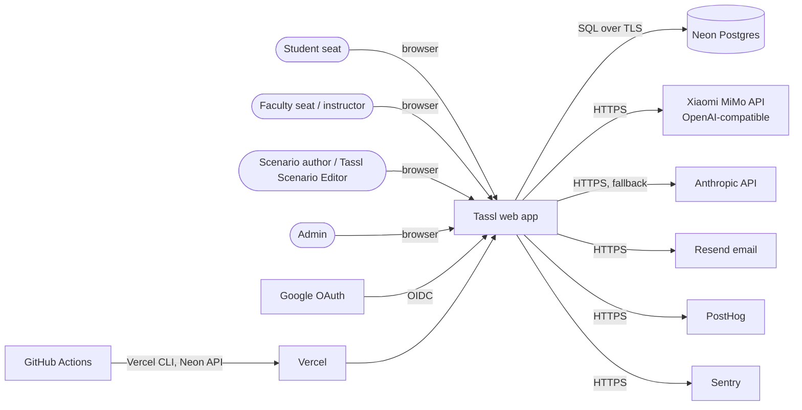
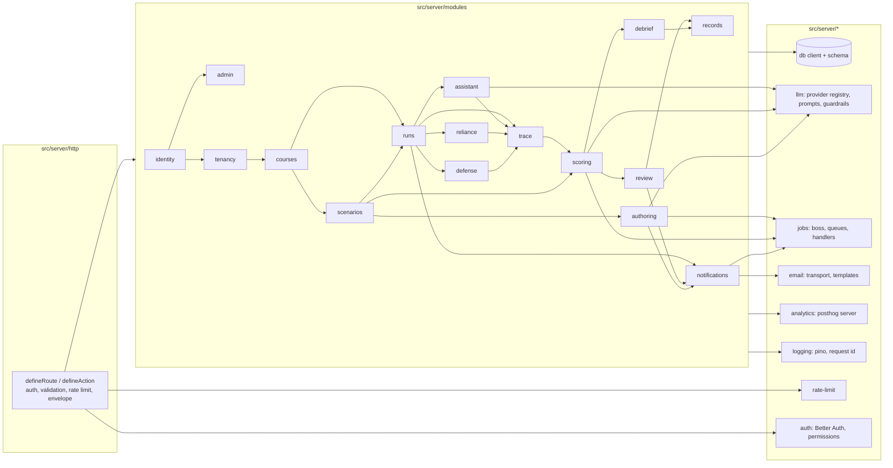

# 02 — Architecture

**Purpose / Read this when:** you need the shape of the system: what talks to what, how a request flows, where a module's boundary is, and which cross-cutting rules every module obeys.

**Requirements covered:** NFR-001 to NFR-017, SYS-009, SYS-012 to SYS-014, SYS-020, SYS-022, SYS-023; structural support for every FR.

## 1. System context (C4 level 1)



## 2. Containers (C4 level 2)

```mermaid
flowchart TB
  subgraph vercel[Vercel project tassl]
    web[Next.js 16 app<br/>RSC pages + Server Actions<br/>Node runtime]
    api[Route handlers /api/v1<br/>same process]
    drain[/api/internal/jobs/drain<br/>cron + after() kick]
    proxy[proxy.ts<br/>request id, optimistic auth redirect, security headers]
  end
  subgraph neon[Neon]
    pg[(Postgres 17<br/>app schema + pgboss schema)]
  end
  subgraph local[Local only]
    compose[(Docker Compose Postgres 17)]
    worker[pnpm jobs:worker<br/>boss.work]
  end
  browser[Browser<br/>React 19, posthog-js, Sentry client] --> proxy --> web
  browser --> api
  web --> pg
  api --> pg
  drain --> pg
  worker --> compose
  web -->|AI SDK 7| llm[LLM providers: mock | openai-compatible (MiMo) | anthropic]
  drain --> llm
```

Runtime facts: all server code runs on the Node.js runtime (no Edge). Fluid compute is enabled by default; `maxDuration` 300 s on the drain, generation, and delegation routes, 60 s elsewhere. Jobs are pg-boss rows in the `pgboss` schema; processed by the drain endpoint (production) or the worker (local).

## 3. Backend components (C4 level 3)



Arrows mean "imports the public interface of". Cycles are forbidden by the boundaries lint (`04-repo-structure.md` §2); `trace` is imported by the run-side modules and read by `scoring`, never the reverse.

## 4. Frontend routing and layout tree

```mermaid
flowchart TB
  root[app/layout.tsx<br/>fonts, theme, FlagsProvider, Toaster] --> pub[(public)/layout.tsx<br/>centered card]
  root --> app[(app)/layout.tsx<br/>AppShell: nav, institution switcher, notifications, account menu<br/>requires session]
  root --> dev[dev/components<br/>404 unless APP_ENV=local]
  pub --> signin[sign-in] & signup[sign-up] & verify[verify-email] & forgot[forgot-password] & reset[reset-password] & legal[privacy, terms]
  app --> home[home]
  app --> settings[settings/{profile,security,data}]
  app --> notifications[notifications]
  app --> runs[runs] --> run[runs/[runId]/layout.tsx<br/>RunFrame: clock, state, frame panel, declaration control]
  run --> start[start] & readiness[readiness, readiness/result] & work[work] & locked[locked] & turn[turn] & defense[defense] & debrief[debrief] & status[page.tsx status]
  app --> records[records/[runId]]
  app --> courses[courses, courses/[courseId]] --> roster[sections/[sectionId]/roster]
  app --> assignments[assignments/[assignmentId], exports]
  app --> review[review, review/runs/[runId]]
  app --> packages[packages, packages/new, packages/[packageId]/versions/[versionId], generation, confirm]
  app --> invitations[invitations/[invitationId]]
  app --> adminr[admin/{users,flags,audit}<br/>requires platform admin]
```

Every segment has `loading.tsx` (skeleton) and `error.tsx` (boundary with request id and retry). Auth guards: `proxy.ts` redirects unauthenticated requests under `(app)` to `/sign-in` using the session cookie (optimistic); every page and action re-validates with `getSession()` and the permission helpers (`08-auth-authz.md`).

## 5. Request lifecycles

### 5.1 Typical read: student opens the run workspace

```mermaid
sequenceDiagram
  participant B as Browser
  participant P as proxy.ts
  participant PG as page.tsx (RSC)
  participant S as runs.service.getRunWorkspace
  participant R as runs.repository
  participant DB as Postgres
  participant L as pino
  B->>P: GET /runs/{id}/work (cookie)
  P->>P: request id; session cookie present? else redirect /sign-in
  P->>PG: forward with x-request-id
  PG->>PG: session = auth.api.getSession(headers)
  PG->>S: getRunWorkspace({ actor, runId })
  S->>S: assertCanViewRun(actor, run) (owner or section reviewer)
  S->>R: findRunWithPackage(tenantId, runId)
  R->>DB: SELECT run, frame, claims, delegations, documents…
  DB-->>R: rows
  S->>S: materializeTimers(run) → may append turn_delivered / auto-lock events (D-043, D-044)
  S->>L: info {requestId, actor, runId, durationMs}
  S-->>PG: workspace view model (no secrets, no warranted stances)
  PG-->>B: HTML + RSC payload; client polls GET /api/v1/runs/{id} every 5 s
```

### 5.2 Typical write: set a stance

```mermaid
sequenceDiagram
  participant B as Browser (claim card)
  participant A as reliance.actions.setStance ('use server')
  participant D as defineAction
  participant S as reliance.service.setStance
  participant RL as rate-limit
  participant T as trace.append
  participant DB as Postgres (transaction)
  participant L as pino
  B->>A: setStance({ runId, claimId, stance })
  A->>D: validate SetStanceSchema; getSession; requireRunOwner
  D->>RL: enforce('run-events:'+userId, 300/min)
  D->>S: setStance(actor, input)
  S->>DB: BEGIN
  S->>S: assertState(run, ['working','turn_open']); claim surfaced?
  S->>T: append stance_set {claim_id, stance, previous_stance, action_ids}
  T->>DB: INSERT run_events (seq = max+1)
  S->>DB: UPDATE run_claims SET stance, previous_stance
  S->>DB: COMMIT
  S->>L: info {requestId, event:'stance_set', runId, claimId}
  D-->>B: { ok: true, data: { claim } } ; revalidatePath('/runs/[runId]/work')
```

Both paths share: request id from proxy → logger child → error envelope; Zod validation once; authorization inside the service (never only in the UI); one transaction per service call that writes; trace append in the same transaction as read-model updates (ADR-017).

## 6. Module boundaries and public interfaces

| Module | Owns | Public interface (`index.ts`) |
|---|---|---|
| `identity` | users, sessions, account settings, data export, deletion | `getCurrentUser`, `requirePlatformRole`, `updateProfile`, `exportUserData`, `requestAccountDeletion`, `purgeDeletedAccounts` |
| `tenancy` | organizations (institutions), members, invitations, data agreements, institution settings | `listMyInstitutions`, `requireMembership`, `inviteMember`, `acceptInvitation`, `upsertDataAgreement`, `canReadIdentifiedRecords` |
| `courses` | courses, sections, section memberships, assignments, mapping changes | `createCourse`, `updateCoursePolicy`, `previewMappingChange`, `createSection`, `addSectionMember`, `createAssignment`, `updateAssignment`, `getPolicyDisplay`, `listAssignmentRuns` |
| `scenarios` | packages, versions, all elements, variants, confirmations, snapshots, import/export, validation | `createPackageFromSeed`, `getPackageVersion`, `getClaimObject`, `updateElement`, `decideElement`, `confirmVersion`, `regenerateVersion`, `importPackage`, `exportPackage`, `validatePackage` |
| `authoring` | generation runs and steps, warranted-stance table, re-skin log, measures | `startGeneration`, `getGenerationStatus`, `runGenerationStep` (job handler), `computeAuthoringMeasures` |
| `runs` | run lifecycle and state machine, clock, pauses, readiness taking, document opens, frame, brief and lock, addendum, Turn delivery and response, void, re-offer, test controls | `startRun`, `getRun`, `getRunWorkspace`, `submitReadiness`, `skipReadiness`, `openDocument`, `closeDocument`, `lockFrame`, `saveBriefDraft`, `lockDecision`, `addAddendum`, `getTurn`, `respondToTurn`, `voidRun`, `reofferRun`, `forceAssistantFailure`, `materializeTimers` |
| `assistant` | delegations, trigger matching, claim surfacing, connective text, numeric guard, used marks, outside-tool declaration, probe reversal | `delegate` (streams), `listDelegations`, `updateDelegation`, `declareOutsideTool` |
| `reliance` | stances, interrogation actions, escalations, relied-on detection, lock-gate check | `setStance`, `runAction`, `escalate`, `listRunClaims`, `findUnstancedReliedOn` |
| `defense` | question selection, follow-up trigger, answers, completion | `openDefense`, `answerQuestion`, `completeDefense` |
| `trace` | append-only events, sequencing, reading, export (two forms), claim table | `append`, `listEvents`, `buildExport`, `TraceExportSchema` |
| `scoring` | graphs, rubric, categorical facts, model reads, draft bands, points, FCR, neutralization recompute | `scoreRun` (job handler), `buildGraphs`, `computePoints`, `recomputeAfterNeutralization`, `rubric` |
| `review` | replay bundle, band decisions, confirm-all, neutralize, held-run manual banding, illustrative queue | `getReplay`, `decideBand`, `confirmRemaining`, `neutralizeClaim`, `getQueue` |
| `debrief` | debrief assembly, questions, recorded transition | `getDebrief`, `answerDebrief` |
| `records` | judgment record snapshot, record export, course exports, sample data | `getRecord`, `exportRecord`, `writeCourseExport`, `getCourseExport`, `sample` |
| `notifications` | in-app notifications, email copies | `notify`, `listNotifications`, `markRead` |
| `admin` | user list and roles, flags view, audit log | `listUsers`, `setPlatformRole`, `listAuditLog`, `audit` (write helper) |

Detailed signatures, rules, and error codes: `10-backend-spec-modules.md`.

## 7. Cross-cutting concerns

| Concern | Rule |
|---|---|
| Error model | `AppError(code, message, {status, details})`; envelope `{ error: { code, message, details?, requestId } }`; codes registered in `src/lib/errors.ts`; 4xx never reported to Sentry, 5xx always |
| Validation | Zod schemas in `schema.ts`, shared by forms, actions, and routes; word limits via `wordLimit(n)`; markup stripped before validation on free-text run fields |
| Authorization | Session from Better Auth; `requireMembership(orgId, roles)`, `requireSectionRole(sectionId, roles)`, `requireRunOwner(runId)`, `requireRunReviewer(runId)`, `requirePlatformRole(role)`; every service function that touches a resource calls one; the UI hides what the actor cannot do but the service enforces it |
| Tenancy | `organization_id` on tenant-scoped tables; repositories take `tenantId` first; platform roles cross tenants only through explicit helpers |
| Logging | pino JSON to stdout; child logger per request with `requestId`, `userId`, `orgId`, `route`; redaction of secrets and PII; levels `debug` locally, `info` elsewhere |
| Request context | `AsyncLocalStorage` store with `requestId`, `actor`, `logger`, `startedAt`; populated by `defineRoute`/`defineAction` and by the RSC layout |
| Config | `src/server/config.ts` validates at boot (fail fast); `effectiveLlmProvider()` applies `FEATURE_AI` |
| i18n readiness | All UI strings in `src/lib/i18n/en-US.ts`; `t(key, params)`; ESLint forbids literals in JSX |
| Feature flags | `flags.ai`, `flags.sampleData`, `flags.testControls`; AI features check `flags.ai` (D-029); the assistant, scoring reads, and generation always run, on mock when `ai` is false |
| Rate limiting | Postgres sliding window; keys per user and per IP; limits D-026 |
| Transactions | One `db.transaction` per writing service call; trace append and read-model writes inside it; jobs enqueued after commit (`enqueueAfterCommit`) |
| Jobs | pg-boss queues (ADR-007); idempotent handlers keyed by `singletonKey` (`score_run:<runId>`, `generate:<versionId>:<step>`) |
| Timers | Lazy materialization (ADR-019); every read of a run calls `materializeTimers` |
| Caching | None at the data layer (every run read is fresh); static assets and fonts cached immutable; RSC pages dynamic |
| Immutability | No update path for locked artifacts; DB grants and triggers (D-085) |
| Analytics | `track()` server-side for run events (identity = user id hashed by PostHog), `posthog-js` client for page views and UI events |
| Time | UTC in DB; `Intl` in the browser |

## 8. Non-functional targets (from NFR-###)

| NFR | Target | Measured by |
|---|---|---|
| NFR-001 | Debrief available ≤ 10 min after defense; p95 ≤ 3 min real, ≤ 5 s mock | `score_run` job latency metric; Sentry alert at 8 min |
| NFR-002 | Turn delivery timestamp exact; observed ≤ delay + 6 s | Unit test; E2E timing assertion |
| NFR-003 | Clock drift ≤ 1 s | Unit tests; client re-sync |
| NFR-004 | Locked artifacts immutable | Integration tests against DB grants |
| NFR-005 | Trace append-only, gapless | Constraint + property test |
| NFR-006 | WCAG 2.2 AA; axe zero serious/critical; Lighthouse a11y ≥ 95 | Playwright axe; LHCI |
| NFR-007 | 99.5 % monthly availability | Vercel + Neon status; health checks; Sentry alert on 5xx rate > 2 % over 5 min |
| NFR-008 | p95 read ≤ 400 ms, write ≤ 800 ms, first token ≤ 3 s real / ≤ 300 ms mock; LCP ≤ 2.5 s | Sentry performance; LHCI |
| NFR-009 | Retention rules | Purge job tests |
| NFR-010 | Last 2 versions of Chrome, Edge, Firefox, Safari | Playwright projects; browserslist `defaults and not IE 11` |
| NFR-011 | OWASP controls | `12-security.md` checklist; CI scanners |
| NFR-012 | Mock deterministic; versions immutable | Evals 100 % on mock; DB triggers |
| NFR-013 | ≤ 250 KB gzip JS per run route; text-only completion | LHCI budgets |
| NFR-014 | 60 concurrent students in a section | k6 load test in Phase 15 |
| NFR-015 | PITR + nightly dump, 30-day retention, weekly drill, RPO 24 h, RTO 1 h | `backup.yml`; drill runbook |
| NFR-016 | Request ids everywhere; LLM call log | Log assertions in integration tests |
| NFR-017 | en-US only, centralized strings | ESLint rule |
