# 06 — Data Model

**Purpose / Read this when:** you write a schema file, a migration, a repository function, or a query. Every persisted noun from the PRD is here with its columns, constraints, and the indexes that serve its queries.

**Requirements covered:** DATA-001 to DATA-055, NFR-004, NFR-005, NFR-009, NFR-015, FR-007, FR-240 to FR-243; column-level support for the FRs cited per table.

## 1. Conventions

- Postgres 17. Schema files in `src/server/db/schema/*.ts` (Drizzle), one file per module, re-exported from `schema/index.ts`.
- Our tables: `id uuid primary key default gen_random_uuid()`, `created_at timestamptz not null default now()`, `updated_at timestamptz not null default now()` (maintained by a trigger `set_updated_at()` created in migration `0001`), `deleted_at timestamptz null` on business entities (courses, sections, assignments, packages, agreements, users). Append-only tables (`run_events`, `audit_logs`, `llm_calls`, `course_exports`, `run_pauses`, `run_actions`, `run_escalations`) have no `updated_at` and no `deleted_at`.
- Better Auth tables (`user`, `session`, `account`, `verification`, `organization`, `member`, `invitation`, `rate_limit`) are generated by `npx auth generate` with `text` ids; ids are UUID strings produced by `advanced.database.generateId` (D-099). Our tables reference `user.id` and `organization.id` as `text`.
- Tenant column: `organization_id text not null references organization(id)` on every tenant-scoped table (marked **T** below). Repositories require it.
- Enums are Postgres enums created in migrations; TypeScript unions mirror them in `schema.ts`.
- Money and rates: `numeric`. Durations: `_ms bigint` or `_seconds integer`. Percentages 0–100 as `integer` (confidence).
- Text limits are enforced in Zod, not `varchar(n)`, except where a hard cap protects the database (`seed_text` 200,000 chars via a check constraint).

## 2. ERD

```mermaid
erDiagram
  user ||--o{ session : has
  user ||--o{ account : has
  user ||--o{ member : "belongs via"
  organization ||--o{ member : has
  organization ||--o{ invitation : has
  organization ||--|| institution_settings : has
  organization ||--o{ data_agreements : has
  organization ||--o{ courses : owns
  courses ||--o{ sections : has
  sections ||--o{ section_memberships : has
  user ||--o{ section_memberships : has
  sections ||--o{ assignments : has
  organization ||--o{ scenario_packages : owns
  scenario_packages ||--o{ scenario_package_versions : versions
  scenario_package_versions ||--o| seed_records : from
  scenario_package_versions ||--o{ scenario_documents : contains
  scenario_package_versions ||--o{ stakeholders : contains
  scenario_package_versions ||--o{ answer_space_positions : contains
  scenario_package_versions ||--o{ named_fields : contains
  scenario_package_versions ||--o{ scenario_claims : contains
  scenario_package_versions ||--o{ scenario_variants : contains
  scenario_variants ||--o{ variant_claim_states : states
  scenario_claims ||--o{ variant_claim_states : states
  scenario_package_versions ||--o| sycophancy_probes : may_have
  scenario_package_versions ||--|| scenario_turns : has
  scenario_package_versions ||--o{ defense_questions : bank
  scenario_package_versions ||--o{ readiness_items : items
  scenario_package_versions ||--o{ element_confirmations : record
  scenario_package_versions ||--o{ generation_runs : record
  assignments }o--|| scenario_package_versions : uses
  assignments }o--|| scenario_variants : uses
  assignments ||--o{ runs : has
  user ||--o{ runs : takes
  runs ||--o{ run_events : trace
  runs ||--o| run_readiness_results : has
  runs ||--o{ run_readiness_answers : has
  runs ||--o{ run_document_opens : has
  runs ||--o| run_frames : has
  runs ||--o{ run_delegations : has
  runs ||--o{ run_claims : has
  scenario_claims ||--o{ run_claims : instance
  runs ||--o{ run_actions : has
  runs ||--o{ run_escalations : has
  runs ||--o| run_briefs : has
  runs ||--o| run_addenda : has
  runs ||--o| run_turn_responses : has
  runs ||--o{ run_defense_questions : has
  run_defense_questions ||--o| run_defense_answers : has
  runs ||--o{ run_pauses : has
  runs ||--o{ run_bands : has
  runs ||--o| run_scores : has
  runs ||--o{ claim_neutralizations : has
  runs ||--o| run_debrief_answers : has
  runs ||--o| run_records : has
  runs ||--o{ course_exports : has
  user ||--o{ notifications : receives
  user ||--o{ audit_logs : acts
  runs ||--o{ llm_calls : may_log
```

## 3. Tables

Legend: **PK** primary key, **FK** foreign key, **T** tenant-scoped (has `organization_id`), **NN** not null. Every table has `created_at`; tables marked with `updated_at`/`deleted_at` have those too.

### 3.1 Identity and tenancy (Better Auth generated + extensions)

**`user`** (DATA-001) — generated; additional fields declared in Better Auth config:

| Column | Type | Constraints | Notes |
|---|---|---|---|
| id | text | PK | UUID string |
| name | text | NN | |
| email | text | NN, unique | lower-cased by Better Auth |
| email_verified | boolean | NN default false | |
| image | text | null | |
| platform_role | text | NN default 'none' | `none`, `tassl_scenario_editor`, `admin` (D-007) |
| deleted_at | timestamptz | null | soft delete; purge after 30 days |
| created_at, updated_at | timestamptz | NN | |

Indexes: `user_email_idx` unique on `(email)` (sign-in); `user_deleted_at_idx` on `(deleted_at) where deleted_at is not null` (purge job). The generator emits `timestamp` (without time zone) for every Better Auth table and only the single-column indexes it knows about; `user_deleted_at_idx`, the unique `(organization_id, user_id)` on `member`, and `(organization_id, status)` on `invitation` are created by the hand-written migration `extensions_and_triggers` (D-162).

**`session`** (DATA-002): id, expires_at, token (unique), created_at, updated_at, ip_address, user_agent, user_id FK user, active_organization_id text null. Index `session_user_id_idx` (list sessions), `session_token_idx` unique.

**`account`** (DATA-003): id, account_id, provider_id, user_id FK, access_token, refresh_token, id_token, access_token_expires_at, refresh_token_expires_at, scope, password (hashed; credential provider), created_at, updated_at. Index `account_user_id_idx`.

**`verification`** (DATA-004): id, identifier, value, expires_at, created_at, updated_at. Index `verification_identifier_idx`.

**`organization`** (DATA-005): id, name, slug (unique), logo, metadata, created_at. Index `organization_slug_idx` unique.

**`member`** (DATA-006): id, organization_id FK, user_id FK, role text NN (`student`, `instructor`, `teaching_assistant`, `scenario_author`, `program_lead`; owner/admin semantics per `08-auth-authz.md`), created_at. Unique `(organization_id, user_id)`; index `member_user_id_idx` (institution switcher).

**`invitation`** (DATA-007): id, organization_id FK, email, role, status, expires_at, inviter_id FK user. Index `(organization_id, status)`.

**`rate_limit`** (Better Auth's): id, key, count, last_request. Unique `(key)`.

**`institution_settings`** (DATA-005) **T**:

| Column | Type | Constraints |
|---|---|---|
| organization_id | text | PK, FK organization |
| plan | enum `plan_tier` (`pilot`,`course_license`,`department`,`institution`,`practice_pass`) | NN default 'pilot' |
| default_mapping | jsonb | NN default `{"novice":1,"developing":2,"proficient":3,"professional":4}` |
| created_at, updated_at | timestamptz | NN |

**`data_agreements`** (DATA-052) **T**:

| Column | Type | Constraints |
|---|---|---|
| id | uuid | PK |
| organization_id | text | NN FK |
| counterparty | text | NN (institution legal name) |
| permitted_platform_roles | text[] | NN (subset of `tassl_scenario_editor`) |
| purposes | enum `agreement_purpose`[] (`scoring_audit`,`scenario_calibration`,`drift_review`) | NN, check `array_length >= 1` |
| record_types_covered | text[] | NN default `{run_records,defense_transcripts,debriefs,instructor_decisions}` |
| record_types_excluded | text[] | NN default `{accommodation_information,diagnostic_information,defense_audio}` |
| retention_days | integer | NN check > 0 |
| document_reference | text | NN |
| signed_at | timestamptz | NN |
| ends_at | timestamptz | null |
| created_at, updated_at, deleted_at | timestamptz | |

Index `(organization_id) where deleted_at is null and (ends_at is null or ends_at > now())` — active-agreement lookup (`canReadIdentifiedRecords`).

### 3.2 Courses (DATA-008 to DATA-011, DATA-055)

**`courses`** **T**:

| Column | Type | Constraints |
|---|---|---|
| id | uuid | PK |
| organization_id | text | NN FK |
| name | text | NN |
| term | text | NN (e.g. `2026-fall`) |
| outside_ai_policy | enum `outside_ai_policy` (`open`,`declared`,`in_environment_only`) | NN default 'declared' |
| mapping | jsonb | NN default institution default; four positive numbers keyed by band |
| default_run_weight | numeric(6,3) | NN default 2.5 (percent of course grade; PRD §7.19 example) |
| critique_weight_factor | numeric(4,3) | NN default 0.5 |
| taught_concepts | text[] | NN default '{}' |
| policy_overrides | jsonb | NN default '{}' (instructor-set policies, future-state) |
| created_by | text | NN FK user |
| created_at, updated_at, deleted_at | | |

Indexes: `(organization_id) where deleted_at is null` (courses list).

**`sections`** **T**: id, organization_id, course_id FK courses, name NN, created_at, updated_at, deleted_at. Index `(course_id)`.

**`section_memberships`** **T**: id, organization_id, section_id FK sections, user_id FK user, role enum `section_role` (`student`,`instructor`,`ta`) NN, created_at, updated_at. Unique `(section_id, user_id)`; indexes `(user_id)` (my runs, my courses), `(section_id, role)` (roster, reviewer checks).

**`assignments`** **T**:

| Column | Type | Constraints |
|---|---|---|
| id | uuid | PK |
| organization_id | text | NN FK |
| section_id | uuid | NN FK sections |
| label | text | NN |
| run_type | enum `run_type` (`decision`,`critique`) | NN default 'decision' |
| package_version_id | uuid | NN FK scenario_package_versions |
| variant_id | uuid | NN FK scenario_variants |
| working_clock_seconds | integer | null (null = package value) check > 0 |
| weight | numeric(6,3) | null (null = course default) |
| is_walkthrough | boolean | NN default false |
| opens_at | timestamptz | null |
| created_at, updated_at, deleted_at | | |

Indexes: `(section_id) where deleted_at is null`; `(package_version_id)` (find assignments on a version before retirement).

Check: the referenced `variant_id` must belong to `package_version_id` (trigger `assignments_variant_matches_version`).

**`course_mapping_changes`** (DATA-055) **T**: id, organization_id, course_id FK, old_mapping jsonb, new_mapping jsonb, changed_by FK user, affected_run_ids uuid[], created_at. Index `(course_id)`.

### 3.3 Scenario packages (DATA-012 to DATA-027)

**`scenario_packages`** (DATA-012) **T**: id, organization_id, title NN, discipline text NN default 'marketing_strategy', family_key text NN (unique per org), created_by FK user, created_at, updated_at, deleted_at. Unique `(organization_id, family_key)`.

**`scenario_package_versions`** (DATA-013) **T**:

| Column | Type | Constraints |
|---|---|---|
| id | uuid | PK |
| organization_id | text | NN FK |
| package_id | uuid | NN FK scenario_packages |
| version | integer | NN check > 0 |
| status | enum `package_status` (`draft`,`confirmed`,`retired`) | NN default 'draft' |
| calibration_status | enum `calibration_status` (`uncalibrated`,`calibrated`) | NN default 'uncalibrated' |
| concept_set | text[] | NN check `array_length >= 4` |
| brief | text | NN default '' (≤ 200 words at confirmation) |
| working_clock_seconds | integer | NN default 1500 |
| turn_delay_seconds | integer | NN default 90 check between 60 and 120 |
| difficulty_profile | jsonb | NN default `{"estimate":"unknown","note":"","uncalibrated":true}` |
| general_escalation_reply | text | NN default '' |
| debrief_counterfactual | text | NN default '' (exactly three sentences at confirmation) |
| generation_model | text | null |
| generated_at | timestamptz | null |
| confirmed_at | timestamptz | null |
| confirmed_by | text | null FK user |
| teaching_note_checked | boolean | NN default false |
| review_requested_at | timestamptz | null |
| review_reason | text | null |
| snapshot | jsonb | null (written at confirmation; the export format) |
| created_at, updated_at | | |

Unique `(package_id, version)`. Index `(package_id, status)`. Trigger `package_version_frozen`: any UPDATE on a row with `confirmed_at not null` raises `VERSION_FROZEN` except for `status`, `review_requested_at`, `review_reason`, `updated_at`. The same trigger, installed on every element table below via `package_version_id`, refuses INSERT/UPDATE/DELETE when the parent is confirmed (NFR-004).

**`seed_records`** (DATA-014): id, package_version_id FK (unique), case_title NN, publisher NN, license_terms text NN, license_permits_adaptation boolean NN, seed_text text NN check `length(seed_text) <= 200000`, reskin_log jsonb NN default '[]' (array of `{kind: renamed_entity|altered_number|restructured_document, from, to, note}`), created_at, updated_at. Never returned by student routes.

**`scenario_documents`** (DATA-015):

| Column | Type | Constraints |
|---|---|---|
| id | uuid | PK |
| package_version_id | uuid | NN FK |
| key | text | NN (`D1`…); unique `(package_version_id, key)` |
| title | text | NN |
| author | text | NN (attribution) |
| dated_on | date | NN |
| body | text | NN |
| word_count | integer | NN (≤ 2000, D-081) |
| role | enum `document_role` (`supporting`,`superseded`,`interpretation_as_fact`,`irrelevant`) | NN |
| superseded_by_document_id | uuid | null FK scenario_documents; NN when role = superseded (check) |
| stakeholder_id | uuid | null FK stakeholders |
| position | integer | NN |
| created_at, updated_at | | |

Index `(package_version_id, position)`.

**`stakeholders`** (DATA-016): id, package_version_id FK, key, name, role_title, position_statement text, incentives text, blind_spots text, contradicts_stakeholder_id uuid null, contradiction_point text null, created_at, updated_at. Unique `(package_version_id, key)`.

**`answer_space_positions`** (DATA-017): id, package_version_id FK, key, kind enum `position_kind` (`defensible`,`evidence_inconsistent`), summary text NN, supporting_document_ids uuid[] NN default '{}', ignored_evidence text null (NN for evidence_inconsistent), is_minimum_commitment boolean NN default false, position integer. Unique `(package_version_id, key)`.

**`named_fields`** (DATA-018): id, package_version_id FK, key (snake_case), label, unit enum `value_unit` (`percent`,`ratio`,`months`,`usd`,`count`,`other`), position. Unique `(package_version_id, key)`.

**`scenario_claims`** (DATA-019):

| Column | Type | Constraints |
|---|---|---|
| id | uuid | PK (stable across the version; referenced by run_claims) |
| package_version_id | uuid | NN FK |
| key | text | NN (`C1`…); unique with version |
| text | text | NN (as the assistant states it) |
| source_kind | enum `claim_source` (`assistant`,`document`) | NN |
| source_document_id | uuid | null FK scenario_documents (NN when a Source Trace path exists) |
| source_passage | text | NN default '' |
| importance | enum `claim_importance` (`load_bearing`,`supporting`) | NN |
| consequence_level | enum `consequence_level` (`low`,`medium`,`high`) | NN |
| verification_cost | enum `verification_cost` (`cheap`,`moderate`,`expensive`) | NN |
| weakly_sourced | boolean | NN default false |
| volatile | boolean | NN default false |
| concept_key | text | NN (in the version's concept_set; check by trigger at confirmation) |
| carried_values | jsonb | NN default '[]' (`[{field_key?, value, unit}]`, D-076) |
| trigger_phrases | text[] | NN default '{}' |
| trigger_description | text | NN default '' (for AI-004) |
| escalatable | boolean | NN default false |
| escalation_reply | text | null (NN when escalatable) |
| rationale | text | NN default '' ("what it deserved and why", FR-151) |
| position | integer | NN |
| created_at, updated_at | | |

Index `(package_version_id, position)`.

**`scenario_variants`** (DATA-020): id, package_version_id FK, key enum `variant_key` (`defective`,`sound`), label text, retired_at timestamptz null, created_at, updated_at. Unique `(package_version_id, key)`.

**`variant_claim_states`** (DATA-021):

| Column | Type | Constraints |
|---|---|---|
| id | uuid | PK |
| variant_id | uuid | NN FK scenario_variants |
| claim_id | uuid | NN FK scenario_claims |
| evidence_status | enum `evidence_status` (`sound`,`defective`) | NN |
| failure_family | enum `failure_family` (`near_neighbor`,`unstated_assumption`,`stale_evidence`,`uncomputed_number`,`extrapolation`,`reversal_to_agree`,`omitted_alternative`,`misapplied_method`,`misattributed_source`,`unacceptable_route`) | null; NN when defective (check) |
| warranted_stance | enum `stance` (`accept`,`verify`,`challenge`,`reject`,`escalate`) | NN |
| verification_paths | jsonb | NN default '{}' (`{source_trace?: {document_id, passage, dated_on, author}, replication_check?: {result}, decomposition_check?: {steps:[{label,result}]}}`) |
| planted | boolean | NN default false (the consequential defect) |
| created_at, updated_at | | |

Unique `(variant_id, claim_id)`. Check at confirmation (`validatePackage`): the defective variant has exactly one `planted = true` with `evidence_status = defective`; the sound variant has zero defective; every claim appears in both variants.

**`sycophancy_probes`** (DATA-022): id, package_version_id FK (unique), claim_id FK, original_position text NN, scripted_reversal text NN.

**`scenario_turns`** (DATA-023): id, package_version_id FK (unique), text NN, voice enum `turn_voice` (`stakeholder_message`,`corrected_number`,`supplier_notice`,`competitor_move`,`retracted_source`,`regulatory_note`), stakeholder_id null FK, warrants_change boolean NN, proportionate_response enum `turn_response` (`hold`,`revise`,`reverse`) NN, evidence text NN, disrupted_assumption_keys text[] NN default '{}', window_claim_ids uuid[] NN default '{}', created_at, updated_at.

**`defense_questions`** (DATA-024): id, package_version_id FK, key, kind enum `question_kind` (`provenance`,`figure_provenance`,`verification`,`assumption`,`confidence`,`frame_vs_response`,`counterfactual`,`default`), claim_id null FK, assumption_index integer null (0–2), template text NN (placeholders `{claim_text}`, `{figure}`, `{stance}`, `{document_title}`, `{assumption}`), condition jsonb NN (see `10-backend-spec-modules.md` §defense), follow_up text NN, expected_answer_notes text NN, is_default boolean NN default false, position integer. Unique `(package_version_id, key)`. Index `(package_version_id, kind)`.

**`readiness_items`** (DATA-025): id, package_version_id FK, key, category enum `readiness_category` (`foundation`,`defect_concept`,`ai_behavior`), concept_key NN, stem text NN, options jsonb NN (`[{key:'a', text}]`, 4 options), answer_key text NN, position integer. Unique `(package_version_id, key)`. Check at confirmation: counts 6/4/6.

**`element_confirmations`** (DATA-026):

| Column | Type | Constraints |
|---|---|---|
| id | uuid | PK |
| package_version_id | uuid | NN FK |
| element_type | enum `element_type` (`brief`,`document`,`stakeholder`,`answer_space_position`,`named_field`,`claim`,`variant_claim_state`,`probe`,`turn`,`defense_question`,`readiness_item`,`counterfactual`,`general_escalation_reply`,`clock_and_difficulty`,`seed_reskin`) | NN |
| element_id | uuid | null (null for singleton elements) |
| revision | integer | NN default 1 |
| decision | enum `confirmation_decision` (`confirmed`,`edited`,`rejected`) | NN |
| edits | jsonb | NN default '{}' (field → {before, after}) |
| note | text | NN default '' |
| opened_at | timestamptz | NN |
| decided_at | timestamptz | NN |
| decided_by | text | NN FK user |
| created_at | | |

Unique `(package_version_id, element_type, element_id, revision)` (null element_id treated as '00000000-0000-0000-0000-000000000000' via generated column `element_key`). Index `(package_version_id, decision)` (measures).

**`generation_runs`** (DATA-027): id, package_version_id FK, step enum `generation_step` (`reskin_brief_stakeholders`,`documents`,`answer_space_fields`,`claims_and_states`,`turn_and_probe`,`question_bank_and_counterfactual`,`readiness_items`), pass_number integer NN default 1, status enum `job_status` (`queued`,`running`,`succeeded`,`failed`), provider text, model text, prompt_version text, input_tokens integer, output_tokens integer, cost_estimate_usd numeric(10,6), failed_rules text[] NN default '{}', error text null, started_at, finished_at, created_at. Index `(package_version_id, step, pass_number)`.

### 3.4 Runs (DATA-028 to DATA-040)

**`runs`** (DATA-028) **T**:

| Column | Type | Constraints |
|---|---|---|
| id | uuid | PK |
| organization_id | text | NN FK |
| assignment_id | uuid | NN FK assignments |
| student_id | text | NN FK user |
| package_version_id | uuid | NN FK |
| variant_id | uuid | NN FK |
| attempt_no | integer | NN default 1 |
| state | enum `run_state` (`assigned`,`readiness`,`framing`,`working`,`paused`,`decision_locked`,`turn_open`,`turn_locked`,`defense_pending`,`defense_complete`,`scored`,`confirmed`,`recorded`,`voided`,`abandoned`,`defense_missed`,`under_appeal`,`expired`) | NN default 'assigned' |
| mode | enum `run_mode` (`guided`,`standard`,`open`) | NN default 'standard' |
| is_walkthrough | boolean | NN default false |
| working_clock_seconds | integer | NN |
| turn_delay_seconds | integer | NN |
| policy_displayed_at | timestamptz | null |
| readiness_started_at | timestamptz | null |
| readiness_expires_at | timestamptz | null |
| working_started_at | timestamptz | null (frame lock) |
| first_delegation_at | timestamptz | null |
| paused_at | timestamptz | null |
| total_paused_ms | bigint | NN default 0 |
| credited_ms | bigint | NN default 0 |
| charged_ms | bigint | NN default 0 |
| decision_locked_at | timestamptz | null |
| turn_due_at | timestamptz | null |
| turn_delivered_at | timestamptz | null |
| turn_window_ends_at | timestamptz | null |
| turn_locked_at | timestamptz | null |
| defense_opened_at | timestamptz | null |
| defense_completed_at | timestamptz | null |
| scored_at | timestamptz | null |
| confirmed_at | timestamptz | null |
| recorded_at | timestamptz | null |
| adjusted_at | timestamptz | null |
| voided_at | timestamptz | null |
| void_reason | enum `void_reason` (`unscoreable`,`scoring_held`,`walkthrough`,`other`) | null (D-120; free text goes in the `run_voided` event `note`) |
| re_offered_from_run_id | uuid | null FK runs |
| re_offered_to_run_id | uuid | null FK runs |
| scoring_status | enum `scoring_status` (`idle`,`queued`,`running`,`held`,`done`) | NN default 'idle' |
| confidence_at_frame | integer | null check 0–100 |
| confidence_at_lock | integer | null |
| confidence_after_turn | integer | null |
| flags | jsonb | NN default '{}' (`nothing_answered`, `all_novice`, `all_professional`, `forced_failure_armed`, `readiness_submit_failed`, `replay_first_opened_at`) |
| accommodation_applied | boolean | NN default false |
| next_event_seq | integer | NN default 1 (sequence allocator, updated under row lock) |
| created_at, updated_at | | |

Unique `(assignment_id, student_id, attempt_no)`. Indexes: `(student_id, state)` (my runs), `(assignment_id)` (instructor list), `(state, scoring_status) where scoring_status = 'held'` (held queue), `(turn_due_at) where state = 'decision_locked'` (diagnostics).

Clock derivation (D-042): `remaining_ms = working_clock_seconds*1000 − (now − working_started_at) + total_paused_ms + (paused_at ? now − paused_at : 0) + credited_ms − charged_ms` while `state in ('working','paused')`.

**`run_events`** (DATA-029) — the trace:

| Column | Type | Constraints |
|---|---|---|
| id | bigint | PK generated always as identity |
| run_id | uuid | NN FK runs |
| seq | integer | NN |
| type | enum `run_event_type` (`policy_displayed`,`lifecycle`,`readiness_item`,`readiness_skipped`,`document_open`,`document_close`,`frame_locked`,`delegation`,`claim_used`,`stance_set`,`action`,`escalation`,`outside_tool_declared`,`pause`,`resume`,`lock_refused`,`decision_locked`,`brief_opened`,`brief_closed`,`addendum`,`turn_delivered`,`turn_response_locked`,`defense_question`,`defense_answer`,`draft_band`,`band_decision`,`claim_neutralized`,`run_voided`,`run_reoffered`,`debrief_opened`,`debrief_answer`,`probe_fired`) | NN |
| occurred_at | timestamptz | NN |
| clock_remaining_ms | integer | null (null outside the working period and Turn window) |
| actor_id | text | null FK user (student or faculty seat) |
| payload | jsonb | NN |
| created_at | timestamptz | NN default now() |

Unique `(run_id, seq)`. Index `(run_id, type)` (graph builders filter by type). Grants: role `tassl_app` has INSERT and SELECT only (migration `0002_immutability`). Payload shapes per type: `10-backend-spec-modules.md` §trace.

**`run_readiness_results`** (DATA-030): run_id PK FK, submitted_at null, skipped boolean NN default false, concepts jsonb NN (`[{concept_key, status: held|not_held|unknown, correct, total}]`).

**`run_readiness_answers`** (DATA-030): id, run_id FK, item_id FK readiness_items, answer_key text null, correct boolean null, answered_at. Unique `(run_id, item_id)`.

**`run_document_opens`** (DATA-031): id, run_id FK, document_id FK, opened_at NN, closed_at null, duration_ms integer null, before_first_delegation boolean NN, in_turn_window boolean NN default false, skim boolean null. Index `(run_id, opened_at)`.

**`run_frames`** (DATA-032): run_id PK FK, decision text NN, assumptions text[] NN check `array_length = 3`, position text NN, confidence integer NN check 0–100, locked_at NN. No `updated_at`; role `tassl_app` has no UPDATE/DELETE.

**`run_delegations`** (DATA-033): id, run_id FK, seq integer NN, request_text NN, response_text text NN default '' (empty until the stream completes; a failed stream leaves it empty and marks `failed = true`), failed boolean NN default false, why text null, claim_ids uuid[] NN default '{}', flags text[] NN default '{}', unverified_numbers jsonb NN default '[]', in_turn_window boolean NN default false, clock_remaining_ms integer null, created_at, updated_at. Unique `(run_id, seq)`.

**`run_claims`** (DATA-034):

| Column | Type | Constraints |
|---|---|---|
| id | uuid | PK |
| run_id | uuid | NN FK |
| claim_id | uuid | NN FK scenario_claims |
| surfaced_at | timestamptz | NN |
| surfaced_by | enum `surfaced_by` (`delegation`,`document`,`turn`,`student`) | NN |
| surfaced_by_id | uuid | null (delegation id, document id) |
| in_turn_window | boolean | NN default false |
| stance | enum `stance` | null |
| previous_stance | enum `stance` | null |
| stance_set_at | timestamptz | null |
| used_marked | boolean | NN default false |
| relied_on_via | text[] | NN default '{}' (`log_mark`,`named_field`,`turn_window`) |
| inconsistency_credited | boolean | NN default false |
| stance_record_lost | boolean | NN default false |
| neutralization_id | uuid | null FK claim_neutralizations |
| created_at, updated_at | | |

Unique `(run_id, claim_id)`. `relied_on` is a generated column: `cardinality(relied_on_via) > 0`. Index `(run_id) where stance is null` (lock gate).

**`run_actions`** (DATA-035): id, run_id FK, claim_id FK, type enum `action_type` (`source_trace`,`replication_check`,`decomposition_check`,`stakeholder_interview`), clock_cost_ms integer NN, result jsonb NN, started_at NN, completed_at NN, in_turn_window boolean NN default false, clock_remaining_ms integer. Index `(run_id, claim_id)`.

**`run_escalations`** (DATA-036): id, run_id FK, claim_id FK, statement text NN, response_id text NN (`claim` or `general`), response_text text NN, clock_cost_ms integer NN default 300000, counts_against_limit boolean NN, in_turn_window boolean NN default false, created_at. Index `(run_id) where counts_against_limit` (limit check).

**`run_briefs`** (DATA-037): run_id PK FK, recommendation text NN default '', rationale text NN default '', assumptions text[] NN default '{"","",""}', change_my_mind text NN default '', confidence integer null, named_values jsonb NN default '{}', draft_updated_at NN, locked_at null, auto_locked boolean NN default false, speed_outlier boolean NN default false. Trigger `run_briefs_locked`: UPDATE refused when `locked_at is not null`.

**`run_addenda`** (DATA-037): run_id PK FK, text text NN (≤ 50 words), created_at NN. No update.

**`run_turn_responses`** (DATA-038): run_id PK FK, response enum `turn_response` NN, justification text null, confidence integer null, implicit boolean NN default false, locked_at NN. No UPDATE/DELETE grant.

**`run_defense_questions`** (DATA-039): id, run_id FK, question_id FK defense_questions, seq integer NN, rendered_text text NN, follow_up_of uuid null FK run_defense_questions, selecting_event_seq integer null, asked_at NN. Unique `(run_id, seq)`.

**`run_defense_answers`** (DATA-039): id, run_id FK, run_defense_question_id FK (unique), text text NN, duration_ms integer NN, answered_at NN.

**`run_pauses`** (DATA-040): id, run_id FK, cause enum `pause_cause` (`assistant_failure`,`document_failure`,`action_failure`,`connection`), paused_at NN, resumed_at null, credited_ms integer NN default 0, related_delegation_id uuid null, created_at. Index `(run_id)`.

### 3.5 Scoring, review, records (DATA-041 to DATA-046)

**`run_bands`** (DATA-041):

| Column | Type | Constraints |
|---|---|---|
| id | uuid | PK |
| run_id | uuid | NN FK |
| dimension | enum `dimension` (`framing`,`delegation`,`verification`,`calibration`,`decision_quality`,`adaptation`,`ownership`) | NN |
| draft_band | enum `band` (`novice`,`developing`,`proficient`,`professional`) | null |
| draft_status | enum `draft_status` (`drafted`,`unassessed`) | NN |
| draft_reason | text | NN default '' (why unassessed / provisional) |
| basis | enum `band_basis` (`trace`,`defense_only`,`categorical_only`,`none`) | NN |
| provisional | boolean | NN default true |
| graph_keys | text[] | NN default '{}' |
| evidence_event_seqs | integer[] | NN default '{}' |
| quotes | jsonb | NN default '[]' (`[{event_seq, text}]`) |
| rationale | text | NN default '' |
| decision | enum `band_decision` (`confirmed`,`overridden`,`unassessed`) | null |
| decided_band | enum `band` | null |
| decided_by | text | null FK user |
| decided_at | timestamptz | null |
| note | text | null |
| band_before_correction | enum `band` | null |
| band_after_correction | enum `band` | null |
| created_at, updated_at | | |

Unique `(run_id, dimension)`. `effective_band` is computed in code: `max(band_before_correction, band_after_correction)` when a correction exists, else the decided band (or draft when not yet decided).

**`run_scores`** (DATA-042): run_id PK FK, rubric_version text NN, graphs jsonb NN (the four payloads), false_challenge_rate numeric(5,4) null, matched_stance_share numeric(5,4) null, points_draft numeric(6,3) null, points_confirmed numeric(6,3) null, points_before_correction numeric(6,3) null, points_after_correction numeric(6,3) null, points_effective numeric(6,3) null, flags text[] NN default '{}', scored_at NN, updated_at.

**`claim_neutralizations`** (DATA-044): id, run_id FK, claim_id FK, reason enum `neutralization_reason` (`unintended_defect`,`wrong_verification_result`,`misbehaving_material`,`adaptation_failed`,`record_lost`,`other`), credit_challenge boolean NN default false, note text NN default '', actor_id NN FK user, created_at. Index `(run_id)`.

**`run_debrief_answers`** (DATA-043): run_id PK FK, stance_to_change text NN, do_differently text NN, answered_at NN.

**`run_records`** (DATA-045): run_id PK FK, snapshot jsonb NN (graphs, bands with evidence and notes, mode, variant, trace without weight/mapping/points), hidden_from_export boolean NN default false, created_at, updated_at.

**`course_exports`** (DATA-046) **T**: id, organization_id, run_id FK, assignment_id FK, version integer NN, file jsonb NN (the course export form), reason enum `export_reason` (`initial`,`override`,`neutralization`,`mapping_change`,`unassessed`), created_by FK user, created_at. Unique `(run_id, version)`.

### 3.6 Platform (DATA-047 to DATA-050)

**`notifications`** (DATA-047): id, user_id FK, organization_id null, type enum `notification_type` (`generation_complete`,`generation_failed`,`run_scored`,`run_held`,`bands_confirmed`,`invitation`,`export_ready`), title text NN, body text NN, link text null, payload jsonb NN default '{}', read_at null, email_sent_at null, created_at. Index `(user_id, read_at)`.

**`audit_logs`** (DATA-048): id, organization_id null, actor_id text null, action text NN (`role.set`, `band.decide`, `run.void`, `run.reoffer`, `claim.neutralize`, `export.write`, `account.delete`, `agreement.upsert`, `package.confirm`, `mapping.change`, `test_control.force_failure`, `invitation.create`, `section_member.add`, `run.delete`), target_type text NN, target_id text NN, metadata jsonb NN default '{}', request_id text NN, created_at. Indexes `(organization_id, created_at desc)`, `(actor_id, created_at desc)`.

**`llm_calls`** (DATA-049): id, feature enum `llm_feature` (`assistant`,`band_read`,`generation`,`trigger_classify`,`eval`), prompt_name text NN, prompt_version integer NN, provider text NN, model text NN, input_tokens integer NN default 0, output_tokens integer NN default 0, latency_ms integer NN, cost_estimate_usd numeric(10,6) NN default 0, outcome enum `llm_outcome` (`ok`,`validation_failed`,`repaired`,`timeout`,`error`,`budget_exceeded`,`circuit_open`), user_id text null, run_id uuid null, package_version_id uuid null, request_id text, created_at. Indexes `(user_id, created_at)` (daily budget), `(created_at)` (monthly budget, dashboards).

**`rate_limit_buckets`** (DATA-050): key text, window_start timestamptz, count integer NN default 0; PK `(key, window_start)`. Rows older than 2 windows are deleted opportunistically on write.

**`pgboss.*`** (DATA-051): created by pg-boss; not modified by hand.

## 4. Migration policy

- Generate with `pnpm db:generate` (drizzle-kit) into `drizzle/NNNN_<slug>.sql`; review the SQL; commit it with the schema change.
- Apply with `pnpm db:migrate` locally, in CI (before integration tests), and in the production workflow (before deploy) against `DATABASE_URL_UNPOOLED`.
- Expand/contract: release 1 adds nullable columns or new tables and dual-writes; release 2 backfills and adds constraints; release 3 drops the old column. Never rename in place. Never drop in the same release as the code that stops using it.
- Hand-written migrations are created with `pnpm exec drizzle-kit generate --custom --name <slug>` (which registers a correctly numbered empty file in `drizzle/meta/_journal.json`) and then filled with SQL; a `.sql` file dropped into `drizzle/` by hand is never applied. They are used for: `0001_extensions_and_triggers` (`set_updated_at()`, `run_events` sequence helper), `0002_immutability` (role `tassl_app`, grants, `package_version_frozen` trigger family, `run_briefs_locked`), `0003_pgboss` is not needed (pg-boss migrates its own schema through `scripts/pgboss-migrate.ts`).
- Database roles: migrations run as the owner role (Neon default `neondb_owner`; local `tassl`). The app connects as `tassl_app` in preview and production (created in `0002` with `LOGIN` and a password from `TASSL_APP_DB_PASSWORD`, which is set in Vercel by the Phase 2 step); locally the app also uses `tassl` for simplicity, so immutability grants are verified in CI with `tassl_app`.
- Rollback: every migration file has a paired `drizzle/down/NNNN_<slug>.sql` written by hand for the contract step only; expand steps are safe to leave in place.

## 5. Seed data

`pnpm db:seed` (`src/server/db/seed.ts`) is idempotent (upserts by natural keys) and creates:

1. Organization `walkthrough` ("Walkthrough University"), `institution_settings` plan `pilot`.
2. Users (D-040): `student1@tassl.local`, `student2@tassl.local`, `instructor@tassl.local`, `editor@tassl.local`, `admin@tassl.local`; password `SEED_PASSWORD`; `email_verified = true`; `admin` has `platform_role = admin`; `editor` has `platform_role = tassl_scenario_editor`. Members: instructor (`instructor` + a second member row is not allowed, so the instructor's org role is `instructor` and their `scenario_author` right comes from the course-level and package-level checks, see `08-auth-authz.md` §4), editor (`scenario_author`), students (`student`).
3. Course "Marketing Strategy Walkthrough", term `2026-fall`, policy `declared`, default mapping, weight 2.5; section "A"; memberships: instructor as `instructor`, student1 and student2 as `student`.
4. Scenario package "Meridian Roast (fixture)" imported from `src/server/db/fixtures/meridian-roast.package.json` (the PRD §6 illustrative scenario written as a complete package that passes `validatePackage`; both variants), version 1 confirmed by `instructor@tassl.local` with confirmation rows for every element.
5. Assignment "Decision Run 1 (walkthrough)" on section A, defective variant, `is_walkthrough = true`; assignment "Decision Run 1 (sound)" on the sound variant; assignment "Auto-lock test run" on the defective variant with `working_clock_seconds = 120`.
6. No runs (runs are created through the interface in the walkthrough).

Test fixtures (`tests/factories/*`) build the same shapes with deterministic UUIDs (`uuidFrom('run-1')` = v5 UUID of the label) and frozen time (`2026-09-01T09:00:00Z`).

## 6. Backup and restore

- Neon retains point-in-time history for the project (default 1 day on the free plan; set to 7 days in Phase 0 via Console → Project settings → Storage → History retention).
- `.github/workflows/backup.yml` runs nightly at 03:30 UTC: `pg_dump -Fc "$PRODUCTION_DATABASE_URL_UNPOOLED"` → encrypted with `openssl enc -aes-256-cbc -pbkdf2 -k "$BACKUP_ENCRYPTION_KEY"` → uploaded as artifact `tassl-backup-<date>` with 30-day retention.
- Restore drill (weekly, runbook in `13-observability-ops.md`): create a Neon branch `restore-drill-<date>` from `main`, `pg_restore --clean --if-exists` the latest artifact into it, run `pnpm db:migrate` and `scripts/smoke.sh` against it, record the duration, delete the branch.
- Point-in-time restore for production incidents: `neon branches restore main ^self@<timestamp>` after confirming the timestamp in the incident channel (runbook).
