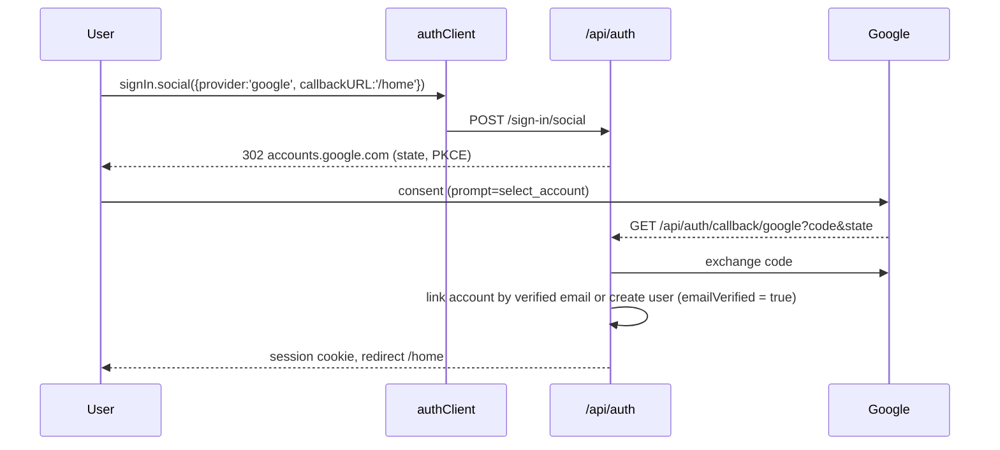

# 08 — Authentication and Authorization

**Purpose / Read this when:** you touch sign-in, sessions, roles, invitations, account deletion, data export, or any permission check. The matrix in §4 is the single source of truth for who may do what.

**Requirements covered:** SYS-001 to SYS-005, FR-230, FR-234, FR-154, FR-221, NFR-011, DATA-001 to DATA-007, DATA-052.

## 1. Library configuration

`src/server/auth/auth.ts`

```ts
import { betterAuth } from 'better-auth'
import { drizzleAdapter } from '@better-auth/drizzle-adapter'
import { nextCookies } from 'better-auth/next-js'
import { organization } from 'better-auth/plugins'
import { db } from '@/server/db/client'
import * as schema from '@/server/db/schema'
import { env } from '@/server/config'
import { sendEmail } from '@/server/email/send'
import { ac, roles } from './access-control'

export const auth = betterAuth({
  baseURL: env.NEXT_PUBLIC_APP_URL,
  secret: env.BETTER_AUTH_SECRET,
  database: drizzleAdapter(db, { provider: 'pg', schema }),
  advanced: {
    database: { generateId: () => crypto.randomUUID() },
    useSecureCookies: env.APP_ENV !== 'local' && env.APP_ENV !== 'test',
    defaultCookieAttributes: { sameSite: 'lax', httpOnly: true, path: '/' },
  },
  user: {
    additionalFields: {
      platformRole: { type: 'string', defaultValue: 'student', input: false, fieldName: 'platform_role' },
      deletedAt: { type: 'date', required: false, input: false, fieldName: 'deleted_at' },
    },
  },
  emailAndPassword: {
    enabled: true,
    requireEmailVerification: true,
    minPasswordLength: 12,
    maxPasswordLength: 128,
    autoSignIn: false,
    revokeSessionsOnPasswordReset: true,
    sendResetPassword: async ({ user, url }) => sendEmail({ to: user.email, template: 'reset-password', props: { url } }),
  },
  emailVerification: {
    sendOnSignUp: true,
    autoSignInAfterVerification: true,
    expiresIn: 60 * 60 * 24,
    sendVerificationEmail: async ({ user, url }) => sendEmail({ to: user.email, template: 'verify-email', props: { url } }),
  },
  socialProviders: env.GOOGLE_CLIENT_ID
    ? { google: { clientId: env.GOOGLE_CLIENT_ID, clientSecret: env.GOOGLE_CLIENT_SECRET, prompt: 'select_account' } }
    : {},
  session: {
    expiresIn: 60 * 60 * 24 * 30,
    updateAge: 60 * 60 * 24,
    freshAge: 60 * 10,
    cookieCache: { enabled: true, maxAge: 60 * 5 },
  },
  rateLimit: {
    enabled: true,
    storage: 'database',
    window: 60,
    max: 600, // per address; a section arrives from one campus address (D-712)
    customRules: {
      '/sign-in/email': { window: 60, max: 120 },
      '/sign-up/email': { window: 60, max: 60 },
      '/request-password-reset': { window: 60, max: 10 },
      '/send-verification-email': { window: 60, max: 10 },
    },
  },
  plugins: [
    organization({
      ac,
      roles, // one role, `member` (§3)
      creatorRole: 'member',
      allowUserToCreateOrganization: async (user) => user.platformRole === 'admin',
      sendInvitationEmail: async ({ id, email, organization, inviter }) =>
        sendEmail({ to: email, template: 'invitation', props: { url: `${env.NEXT_PUBLIC_APP_URL}/invitations/${id}`, organizationName: organization.name, inviterName: inviter.user.name } }),
    }),
    nextCookies(),
  ],
})
```

Route handler `src/app/api/auth/[...all]/route.ts`:

```ts
import { auth } from '@/server/auth/auth'
import { toNextJsHandler } from 'better-auth/next-js'
export const { GET, POST } = toNextJsHandler(auth)
```

Client `src/lib/auth-client.ts`:

```ts
import { createAuthClient } from 'better-auth/react'
import { organizationClient } from 'better-auth/client/plugins'
import { ac, roles } from '@/server/auth/access-control-shared'
export const authClient = createAuthClient({ plugins: [organizationClient({ ac, roles })] })
```

(The statement and roles live in `src/lib/auth/access-control.ts` so the browser client can import them without `src/lib` reaching into `src/server`; `src/server/auth/access-control-shared.ts` re-exports them for server code, D-170.)

Schema generation: `npx auth@1.7.2 generate --adapter drizzle --dialect pg --config src/server/auth/auth.ts --output src/server/db/schema/auth.ts -y`, then `pnpm db:generate`.

**Failed sign-ins per account (D-704).** Better Auth's limiter counts sign-ins per client address (120 a minute, sized for a section behind one campus address, D-712); a `before` hook on `/sign-in/email` also refuses the eleventh attempt in a minute for one email address after ten failures, from any address, with 429 and a retry-after, and an `after` hook records each failure. Successful sign-ins are never counted.

**Demo mode (D-692).** With `DEMO_MODE=true` the options are built by `authOptionsFor(env)` with `requireEmailVerification: false`, `autoSignIn: true` and `sendOnSignUp: false`, and the `before` hook on user creation marks the account verified; the sign-up form then lands on `/home`. The email transport is `console` in that mode whatever `EMAIL_TRANSPORT` says. Every other option is identical in both modes, which `tests/unit/auth/auth-options.test.ts` asserts.

## 2. Flows

### 2.1 Sign-up, verification, sign-in

```mermaid
sequenceDiagram
  participant U as User
  participant C as authClient
  participant BA as /api/auth
  participant E as email
  U->>C: signUp.email({name, email, password})
  C->>BA: POST /sign-up/email
  BA->>E: verify-email (link with token, 24 h)
  BA-->>C: 200 (no session; autoSignIn false)
  U->>BA: GET /verify-email?token=…
  BA->>BA: emailVerified = true; session created (autoSignInAfterVerification)
  BA-->>U: redirect callbackURL=/home
  U->>C: signIn.email({email, password})
  C->>BA: POST /sign-in/email
  BA-->>C: session cookie (30 d, rolling daily)
```

Unverified sign-in returns Better Auth's `EMAIL_NOT_VERIFIED`; the UI offers "resend verification" (`sendVerificationEmail`).

### 2.2 Sign-out

`authClient.signOut()` → `POST /sign-out` revokes the current session and clears the cookie. "Sign out other devices" → `revokeOtherSessions()`.

### 2.3 Password reset

`requestPasswordReset({ email, redirectTo: '/reset-password' })` → email with token (1 h) → `resetPassword({ newPassword, token })` → all sessions revoked (`revokeSessionsOnPasswordReset`) → sign in again. The response for an unknown email is identical to a known one (enumeration protection).

### 2.4 Google OAuth



Redirect URI registered in Google Cloud Console: `${NEXT_PUBLIC_APP_URL}/api/auth/callback/google` for local (`http://localhost:3000/...`) and production. The Google button renders only when `GOOGLE_CLIENT_ID` is set (D-097).

### 2.5 Invitation (institution membership)

An Instructor on the roster screen (or the Platform Admin) → `tenancy.inviteMember({ email })`, which calls the plugin with the membership role `member` (the admin, who belongs to no institution, has the invitation row written directly and the same email sent) → email with `/invitations/{id}` → invitee signs in or signs up with the same email → `organization.acceptInvitation({ invitationId })` → member row. The roster screen then adds the member to the section (`courses.addSectionMember`). Invitations expire after 7 days (Better Auth default 48 h overridden with `invitationExpiresIn: 60*60*24*7`).

### 2.6 Session handling

- Cookie: `httpOnly`, `sameSite=lax`, `secure` outside local/test, path `/`. 30-day expiry, refreshed daily on activity (`updateAge`). Cookie cache 5 minutes reduces DB reads; privilege changes call `auth.api.revokeOtherSessions` and re-issue.
- Server: `getSession()` in `src/server/auth/session.ts` wraps `auth.api.getSession({ headers: await headers() })` and returns `{ user, session, activeOrganizationId }` or null. Deleted users (`deleted_at` set) are treated as signed out and their sessions revoked by the deletion service.
- `proxy.ts`: for paths under `(app)` routes, if `getSessionCookie(request)` is absent → redirect to `/sign-in?next=<path>`. This is optimistic only; every page, action, and route re-validates with `getSession()`.
- Rotation on privilege change: `setPlatformRole` — the one role change there is (D-748) — deletes every session row of the affected user inside the transaction that changes the role (D-570), so they sign in again and the new role is what their next session reads.

### 2.7 CSRF posture

- Server Actions: Next.js enforces same-origin (`Origin`/`Host` check) on action POSTs; `sameSite=lax` cookies block cross-site POST bearing the session.
- `/api/v1` routes: cookie-authenticated requests must send `X-Requested-With: tassl` (checked in `defineRoute` for non-GET methods) or use a Bearer session token obtained from `authClient.getSession()` for scripts; CORS is not enabled (same-origin only, D-086, `12-security.md`).
- Better Auth endpoints use its built-in origin check (`trustedOrigins` = `NEXT_PUBLIC_APP_URL`).

### 2.8 Password policy

12–128 characters, no composition rules, hashed by Better Auth (scrypt). No breached-password check is available in the library; recorded in D-021. Change password requires the current password and revokes other sessions.

### 2.9 Account deletion and data export

- Export: `POST /api/v1/me/export` (and `/settings/data`) returns a JSON file with the user's profile, memberships, runs (with trace exports in the record form), notifications, and audit entries where they are the actor. Rate limit 2 per hour.
- Deletion: `DELETE /api/v1/me` sets `user.deleted_at`, revokes all sessions, removes memberships and invitations, and writes an audit row. The daily `purge_deleted_accounts` job (after 30 days) deletes the user row; runs are re-pointed to the per-organization placeholder user `deleted-user@<org-slug>.tassl.local` so course records survive (D-093). Walkthrough runs are deletable by instructors (D-104).

## 3. Roles

**One role per account (D-748).** Every account holds exactly one role, stored in `user.platform_role` and chosen by a Platform Admin on `/admin/users` (the **Platform role** picker). New accounts start as Student.

| Role | `user.platform_role` | What it is |
|---|---|---|
| Student | `student` | Takes the runs assigned on the sections whose roster they are on, and reads their own results |
| Scenario Editor | `tassl_scenario_editor` | A Student's access, plus authoring and publishing the scenario packages of their institution |
| Instructor | `instructor` | Runs courses, sections, rosters, invitations and assignments, and reviews learner results; reads packages to assign them |
| Platform Admin | `admin` | Full access, in every institution, without a membership |

There is no institution role and no section role. The two membership tables say *where* a person is, never *what* they may do:

| Table | Meaning |
|---|---|
| `member` (Better Auth) | The person belongs to the institution — the tenant every read is scoped to. Better Auth's organization plugin requires a `role` string on the row; it holds the plugin's own value `member` and a check constraint (`member_role_is_membership`, and `invitation_role_is_membership` on `invitation`) keeps it there |
| `section_memberships` | The person is on the section roster. For a Student or Scenario Editor the row is an enrolment; for an Instructor it is a section they teach. The row has no role column |

Better Auth access control (`src/lib/auth/access-control.ts`, re-exported by `src/server/auth/access-control-shared.ts`) knows one role, `member`, with `invitation: ['create', 'cancel']` — the plugin's precondition for the invitation calls Tassl makes through it. Who may invite is decided by `tenancy.inviteMember` (§4) before the plugin is reached. `creatorRole` is `member`.

## 4. Permission matrix

✓ = allowed; ✓* = allowed with the stated scope; — = denied. "Own run" = `runs.student_id` is the actor. "Runs the course" = an Instructor who created the course or is on the roster of one of its sections. Every row is tenant-scoped: a resource in an institution the actor does not belong to is denied to everyone but the Platform Admin, as NOT_FOUND (§5 "Cross-tenant").

| Action / resource | Student | Scenario Editor | Instructor | Platform Admin |
|---|---|---|---|---|
| Own account: profile, sessions, export, delete; notifications; my institutions; accept an invitation addressed to me | ✓ | ✓ | ✓ | ✓ |
| My assignments and my runs | ✓* sections I am on | ✓* sections I am on | — (empty) | ✓ |
| Read an assignment and its policy display | ✓* on the roster | ✓* on the roster | ✓* runs the course | ✓ |
| Start a run on an assignment | ✓* on the roster | ✓* on the roster | — | ✓ |
| Every in-run act (readiness, room, documents, frame, assistant, stances, actions, escalate, brief, lock, addendum, Turn, defense, debrief answers, resume, policy acknowledgement) | ✓* own run | ✓* own run | — | ✓ |
| Read own Judgment Record (`GET /runs/{runId}/record`) | ✓* own run | ✓* own run | — | ✓ |
| Read a run, its delegations, trace and debrief; download the record-form file | ✓* own run | ✓* own run | ✓* runs the course | ✓ |
| Read another learner's run | — | — | ✓* runs the course | ✓ |
| Institution settings (plan, default mapping), data agreements, create an institution | — | — | — | ✓ |
| Read an institution I belong to | ✓ | ✓ | ✓ | ✓ |
| Invite a person to my institution | — | — | ✓ | ✓ |
| List courses; create a course | — | — | ✓ | ✓ |
| Read a course; set policy, mapping, weights; change mapping after confirmations | — | — | ✓* read any course of the institution; change the ones they run | ✓ |
| Sections, rosters (list, add, remove), assignments (create, update), confirmed versions to choose from | — | — | ✓* runs the course | ✓ |
| Delete walkthrough runs | — | — | ✓* runs the course, `is_walkthrough` only | ✓ |
| Review: queue, section runs, replay, band decisions, confirm remaining, band a held run, flag a delegation | — | — | ✓* runs the course | ✓ |
| Void, re-offer, neutralize; force assistant failure (test control, flag on) | — | — | ✓* runs the course | ✓ |
| Course exports: write, list, download | — | — | ✓* runs the course | ✓ |
| Read packages: list, package, version, claim object, export | — | ✓* own institution | ✓* own institution | ✓ |
| Read the seed record (case title, license, re-skin log) | — | ✓* own institution | — | ✓ |
| Author packages: create from seed, import, edit elements, run generation, read generation status, regenerate | — | ✓* own institution | — | ✓ |
| Publish packages: decide elements, confirm a version, retire | — | ✓* own institution | — | ✓ |
| Platform roles, user list, flags, assistant mode, Sentry test event, audit log | — | — | — | ✓ |
| Edit a locked frame, brief, or Turn response | — | — | — | — |
| Investigate an individual for a leak | — | — | — | — |

**The Scenario Editor has a Student's access and nothing else beyond authoring** (D-748). Enrolled on a roster, a Scenario Editor takes the run like any Student; they never reach a course, a roster, another learner's run or the review surface. The Instructor reads packages because an assignment is pointed at a confirmed version and a replay reads the version back, but authoring and publishing belong to the Scenario Editor.

**The Platform Admin has full access** (D-748). Every guard in §5 admits the admin in every institution, without a `member` row; an id that does not exist is still NOT_FOUND. When the admin reads a learner's run, the services take the reviewer path, never the owner's: the admin gets the reviewer projection and never consumes the learner's first debrief open or the defense seal.

**The debrief and the Judgment Record are two rows, not one** (D-519). The Judgment Record is the learner's own (10 §14); reviewers read the run through the replay, and download the record-form file on its own row.

The record-form export is a learner view in the sense 12 §8 means. Its *contents* are gated by `trace/owner-view.ts` at the `scored` tier — the record carries the claim table whole, because 12 §8.2 names it as what reveals `warranted_stance`, `evidence_status` and `failure_family` after scoring, and it carries none of the fields §8.1 forbids in any state (D-370, D-420, D-421). The course form is the reviewer's document and carries everything; no learner-facing route reaches it.

"Runs the course" is `requireCourseInstructor` and, for a section, `canReviewSection` (§5): the course's creator — between creating a section and putting anyone on it, the only instructor who exists (D-062) — or an Instructor on the roster of one of its sections. The export history, the run list and every "Open run" link on them ask the same predicate (D-483, D-517).

Learners never see (at any time): the question bank, expected-answer notes, the seed record, the general escalation reply, trigger internals, stakeholder and Turn internals, probe internals, answer keys, instructor flags, other learners' runs, and weight, mapping, or points in the record form (any key whose name contains one of the three, at any depth - D-421). Learners do not see before their run is scored: warranted stances, evidence status, failure family, planted flags, verification results before running the action, per-claim rationale, concept keys, document roles, the answer space, the escalation response id, and the counterfactual; their own debrief and record reveal these after scoring (PRD §7.14, D-117). The learner view models omit these fields at the service layer (`toStudentClaimView` and the key sets in `src/server/auth/student-view.ts`), never only in the UI.

## 5. Enforcement

**Helpers** (`src/server/auth/permissions.ts`), each throwing `AppError('FORBIDDEN')` or `AppError('NOT_FOUND')` (or `UNAUTHENTICATED`). Every one admits the Platform Admin.

| Helper | Checks |
|---|---|
| `requireSession()` | session exists and user not deleted |
| `requirePlatformRole(role)` / `requireAnyRole(roles)` | `user.platform_role` is the role (one of the roles) |
| `requireMembership(orgId, roles?)` | a `member` row in the organization, and the actor's role in `roles` when given; the admin needs only that the organization exists |
| `requireSectionSeat(sectionId, roles)` | a roster row on the live section and the actor's role in `roles`; not a member of its institution → NOT_FOUND |
| `requireCourseInstructor(courseId)` | the actor is an Instructor who created the course or is on one of its section rosters; course outside the actor's institution → NOT_FOUND |
| `canReviewSection(courseId, sectionId)` / `requireSectionReviewer(...)` | an Instructor on that section's roster, **or** `requireCourseInstructor` on the course above it (D-483) |
| `requireRunOwner(runId)` | `runs.student_id === user.id`; anyone else → NOT_FOUND |
| `requireRunReviewer(runId)` = `requireRunInstructor` = `requireCourseExportReader` | `canReviewSection` on the run's course and section; the run's own learner → FORBIDDEN, anyone else → NOT_FOUND |
| `requireAuthorOnPackage(packageId)` | a Scenario Editor who belongs to the package's institution |
| `requirePackageReader(packageId)` | a Scenario Editor or Instructor who belongs to the package's institution |

Role sets used by the services: `LEARNER_ROLES` (`student`, `tassl_scenario_editor`), `TEACHING_ROLES` (`instructor`), `AUTHORING_ROLES` (`tassl_scenario_editor`), `PACKAGE_READER_ROLES` (`tassl_scenario_editor`, `instructor`).

**Route handlers:** `defineRoute({ auth: 'session' | 'cron' | 'public', ... })` calls `requireSession()` first; the handler calls the resource helper before the service (or the service calls it, which is the rule for anything that mutates). Every service function that reads or writes a run, package, course, or agreement calls the matching helper as its first statement, so a missed check in a handler cannot widen access.

**Server Actions:** `defineAction(schema, handler)` runs `requireSession()` then the handler, which calls the service. Actions never contain permission logic themselves.

**UI:** the rail and the home panels follow the role — Student: Home, Runs; Scenario Editor: Home, Runs, Packages; Instructor: Home, Courses, Review, Packages; Platform Admin: all of them and Admin. Pages receive `capabilities` objects from services and render controls conditionally. Hidden controls are a courtesy; the service check is the enforcement. `tests/integration/auth/matrix.test.ts` drives every registered operation as each of the four roles, plus an Instructor of another institution, through the real route handlers.

**Cross-tenant:** repositories require `tenantId`; a run, course, section or package id from another organization returns 404, not 403, to avoid existence leaks. The Platform Admin is the one exception, by design.

**Audit:** `admin.audit()` records role changes (`role.set`), band decisions, void, re-offer, neutralization, exports, deletions, agreement changes, package confirmations, mapping changes, and test-control use with the request id.
