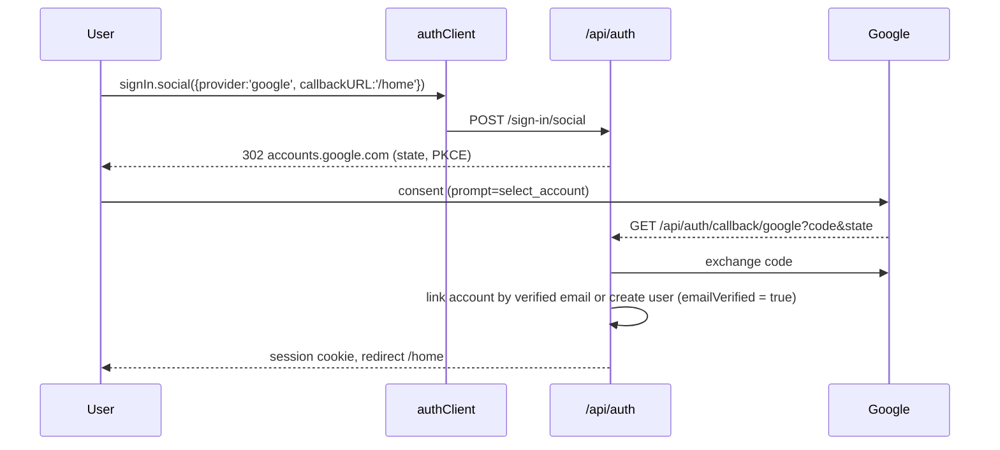

# 08 — Authentication and Authorization

**Purpose / Read this when:** you touch sign-in, sessions, roles, invitations, account deletion, data export, or any permission check. The matrix in §4 is the single source of truth for who may do what.

**Requirements covered:** SYS-001 to SYS-005, FR-230, FR-234, FR-154, FR-221, NFR-011, DATA-001 to DATA-007, DATA-052.

## 1. Library configuration

`src/server/auth/auth.ts`

```ts
import { betterAuth } from 'better-auth'
import { drizzleAdapter } from '@better-auth/drizzle-adapter'
import { nextCookies } from 'better-auth/next-js'
import { organization } from 'better-auth/plugins'
import { db } from '@/server/db/client'
import * as schema from '@/server/db/schema'
import { env } from '@/server/config'
import { sendEmail } from '@/server/email/send'
import { ac, roles } from './access-control'

export const auth = betterAuth({
  baseURL: env.NEXT_PUBLIC_APP_URL,
  secret: env.BETTER_AUTH_SECRET,
  database: drizzleAdapter(db, { provider: 'pg', schema }),
  advanced: {
    database: { generateId: () => crypto.randomUUID() },
    useSecureCookies: env.APP_ENV !== 'local' && env.APP_ENV !== 'test',
    defaultCookieAttributes: { sameSite: 'lax', httpOnly: true, path: '/' },
  },
  user: {
    additionalFields: {
      platformRole: { type: 'string', defaultValue: 'none', input: false, fieldName: 'platform_role' },
      deletedAt: { type: 'date', required: false, input: false, fieldName: 'deleted_at' },
    },
  },
  emailAndPassword: {
    enabled: true,
    requireEmailVerification: true,
    minPasswordLength: 12,
    maxPasswordLength: 128,
    autoSignIn: false,
    revokeSessionsOnPasswordReset: true,
    sendResetPassword: async ({ user, url }) => sendEmail({ to: user.email, template: 'reset-password', props: { url } }),
  },
  emailVerification: {
    sendOnSignUp: true,
    autoSignInAfterVerification: true,
    expiresIn: 60 * 60 * 24,
    sendVerificationEmail: async ({ user, url }) => sendEmail({ to: user.email, template: 'verify-email', props: { url } }),
  },
  socialProviders: env.GOOGLE_CLIENT_ID
    ? { google: { clientId: env.GOOGLE_CLIENT_ID, clientSecret: env.GOOGLE_CLIENT_SECRET, prompt: 'select_account' } }
    : {},
  session: {
    expiresIn: 60 * 60 * 24 * 30,
    updateAge: 60 * 60 * 24,
    freshAge: 60 * 10,
    cookieCache: { enabled: true, maxAge: 60 * 5 },
  },
  rateLimit: {
    enabled: true,
    storage: 'database',
    window: 60,
    max: 60,
    customRules: {
      '/sign-in/email': { window: 60, max: 10 },
      '/sign-up/email': { window: 60, max: 10 },
      '/request-password-reset': { window: 60, max: 10 },
      '/send-verification-email': { window: 60, max: 10 },
    },
  },
  plugins: [
    organization({
      ac,
      roles,
      allowUserToCreateOrganization: async (user) => user.platformRole === 'admin',
      sendInvitationEmail: async ({ id, email, organization, inviter }) =>
        sendEmail({ to: email, template: 'invitation', props: { url: `${env.NEXT_PUBLIC_APP_URL}/invitations/${id}`, organizationName: organization.name, inviterName: inviter.user.name } }),
    }),
    nextCookies(),
  ],
})
```

Route handler `src/app/api/auth/[...all]/route.ts`:

```ts
import { auth } from '@/server/auth/auth'
import { toNextJsHandler } from 'better-auth/next-js'
export const { GET, POST } = toNextJsHandler(auth)
```

Client `src/lib/auth-client.ts`:

```ts
import { createAuthClient } from 'better-auth/react'
import { organizationClient } from 'better-auth/client/plugins'
import { ac, roles } from '@/server/auth/access-control-shared'
export const authClient = createAuthClient({ plugins: [organizationClient({ ac, roles })] })
```

(The statement and roles live in `src/lib/auth/access-control.ts` so the browser client can import them without `src/lib` reaching into `src/server`; `src/server/auth/access-control-shared.ts` re-exports them for server code, D-170.)

Schema generation: `npx auth@1.7.2 generate --adapter drizzle --dialect pg --config src/server/auth/auth.ts --output src/server/db/schema/auth.ts -y`, then `pnpm db:generate`.

**Failed sign-ins per account (D-704).** Better Auth's limiter counts sign-ins per client address; a `before` hook on `/sign-in/email` also refuses the eleventh attempt in a minute for one email address after ten failures, from any address, with 429 and a retry-after, and an `after` hook records each failure. Successful sign-ins are never counted.

**Demo mode (D-692).** With `DEMO_MODE=true` the options are built by `authOptionsFor(env)` with `requireEmailVerification: false`, `autoSignIn: true` and `sendOnSignUp: false`, and the `before` hook on user creation marks the account verified; the sign-up form then lands on `/home`. The email transport is `console` in that mode whatever `EMAIL_TRANSPORT` says. Every other option is identical in both modes, which `tests/unit/auth/auth-options.test.ts` asserts.

## 2. Flows

### 2.1 Sign-up, verification, sign-in

```mermaid
sequenceDiagram
  participant U as User
  participant C as authClient
  participant BA as /api/auth
  participant E as email
  U->>C: signUp.email({name, email, password})
  C->>BA: POST /sign-up/email
  BA->>E: verify-email (link with token, 24 h)
  BA-->>C: 200 (no session; autoSignIn false)
  U->>BA: GET /verify-email?token=…
  BA->>BA: emailVerified = true; session created (autoSignInAfterVerification)
  BA-->>U: redirect callbackURL=/home
  U->>C: signIn.email({email, password})
  C->>BA: POST /sign-in/email
  BA-->>C: session cookie (30 d, rolling daily)
```

Unverified sign-in returns Better Auth's `EMAIL_NOT_VERIFIED`; the UI offers "resend verification" (`sendVerificationEmail`).

### 2.2 Sign-out

`authClient.signOut()` → `POST /sign-out` revokes the current session and clears the cookie. "Sign out other devices" → `revokeOtherSessions()`.

### 2.3 Password reset

`requestPasswordReset({ email, redirectTo: '/reset-password' })` → email with token (1 h) → `resetPassword({ newPassword, token })` → all sessions revoked (`revokeSessionsOnPasswordReset`) → sign in again. The response for an unknown email is identical to a known one (enumeration protection).

### 2.4 Google OAuth



Redirect URI registered in Google Cloud Console: `${NEXT_PUBLIC_APP_URL}/api/auth/callback/google` for local (`http://localhost:3000/...`) and production. The Google button renders only when `GOOGLE_CLIENT_ID` is set (D-097).

### 2.5 Invitation (institution membership)

Instructor or program lead on the roster screen → `organization.inviteMember({ email, role, organizationId })` → email with `/invitations/{id}` → invitee signs in or signs up with the same email → `organization.acceptInvitation({ invitationId })` → member row. The roster screen then adds the member to the section (`courses.addSectionMember`). Invitations expire after 7 days (Better Auth default 48 h overridden with `invitationExpiresIn: 60*60*24*7`).

### 2.6 Session handling

- Cookie: `httpOnly`, `sameSite=lax`, `secure` outside local/test, path `/`. 30-day expiry, refreshed daily on activity (`updateAge`). Cookie cache 5 minutes reduces DB reads; privilege changes call `auth.api.revokeOtherSessions` and re-issue.
- Server: `getSession()` in `src/server/auth/session.ts` wraps `auth.api.getSession({ headers: await headers() })` and returns `{ user, session, activeOrganizationId }` or null. Deleted users (`deleted_at` set) are treated as signed out and their sessions revoked by the deletion service.
- `proxy.ts`: for paths under `(app)` routes, if `getSessionCookie(request)` is absent → redirect to `/sign-in?next=<path>`. This is optimistic only; every page, action, and route re-validates with `getSession()`.
- Rotation on privilege change: `setPlatformRole` and organization role updates call `auth.api.revokeSessions({ userId })` for the affected user (they sign in again).

### 2.7 CSRF posture

- Server Actions: Next.js enforces same-origin (`Origin`/`Host` check) on action POSTs; `sameSite=lax` cookies block cross-site POST bearing the session.
- `/api/v1` routes: cookie-authenticated requests must send `X-Requested-With: tassl` (checked in `defineRoute` for non-GET methods) or use a Bearer session token obtained from `authClient.getSession()` for scripts; CORS is not enabled (same-origin only, D-086, `12-security.md`).
- Better Auth endpoints use its built-in origin check (`trustedOrigins` = `NEXT_PUBLIC_APP_URL`).

### 2.8 Password policy

12–128 characters, no composition rules, hashed by Better Auth (scrypt). No breached-password check is available in the library; recorded in D-021. Change password requires the current password and revokes other sessions.

### 2.9 Account deletion and data export

- Export: `POST /api/v1/me/export` (and `/settings/data`) returns a JSON file with the user's profile, memberships, runs (with trace exports in the record form), notifications, and audit entries where they are the actor. Rate limit 2 per hour.
- Deletion: `DELETE /api/v1/me` sets `user.deleted_at`, revokes all sessions, removes memberships and invitations, and writes an audit row. The daily `purge_deleted_accounts` job (after 30 days) deletes the user row; runs are re-pointed to the per-organization placeholder user `deleted-user@<org-slug>.tassl.local` so course records survive (D-093). Walkthrough runs are deletable by instructors (D-104).

## 3. Roles

| Layer | Values | Stored in |
|---|---|---|
| Platform | `none`, `tassl_scenario_editor`, `admin` | `user.platform_role` |
| Organization (institution) | `student`, `instructor`, `teaching_assistant`, `scenario_author`, `program_lead` | `member.role` (Better Auth), one row per user per organization |
| Section | `student`, `instructor`, `ta` | `section_memberships.role` |

Better Auth access control (`src/server/auth/access-control-shared.ts`):

```ts
import { createAccessControl } from 'better-auth/plugins/access'

export const statement = {
  organization: ['update', 'delete'],
  member: ['create', 'update', 'delete'],
  invitation: ['create', 'cancel'],
  course: ['create', 'update', 'read'],
  package: ['create', 'read', 'confirm', 'generate'],
  agreement: ['read', 'update'],
  report: ['read'],
} as const

export const ac = createAccessControl(statement)
export const roles = {
  student: ac.newRole({ course: ['read'] }),
  instructor: ac.newRole({ course: ['create', 'update', 'read'], invitation: ['create', 'cancel'], member: ['create'], package: ['create', 'read', 'confirm', 'generate'] }),
  teaching_assistant: ac.newRole({ course: ['read'] }),
  scenario_author: ac.newRole({ package: ['create', 'read', 'confirm', 'generate'], course: ['read'] }),
  program_lead: ac.newRole({ organization: ['update'], member: ['create', 'update', 'delete'], invitation: ['create', 'cancel'], agreement: ['read', 'update'], report: ['read'], course: ['read'] }),
}
```

The `owner` and `admin` built-in roles are not used for people; the seed's organization is created by the `admin` platform user through the admin API and the first `program_lead` is set explicitly.

## 4. Permission matrix

Resources and actions. ✓ = allowed; ✓* = allowed with the stated scope; — = denied. "Reviewer" = instructor or TA of the run's section. "Author" = organization `scenario_author` or `instructor`. "Editor" = platform `tassl_scenario_editor`.

| Action / resource | Student | Instructor | TA | Author | Program lead | Editor | Admin |
|---|---|---|---|---|---|---|---|
| Start a run on an assignment in own section | ✓* own section | — | — | — | — | — | — |
| Use every in-run capability (readiness, room, frame, assistant, stances, actions, escalate, brief, lock, addendum, turn, defense, debrief answers) | ✓* own run | — | — | — | — | — | — |
| Read own debrief and graphs (`GET /runs/{runId}/debrief`) | ✓* own | ✓* section | ✓* section | — | — | ✓* under agreement (FR-234) | — |
| Read the Judgment Record itself (`GET /runs/{runId}/record`) | ✓* own | — | — | — | — | — | — |
| Download the record-form trace file (`GET /runs/{runId}/record/export`) | ✓* own, from `confirmed` | ✓* section | ✓* section | — | — | — (the FR-234 path has no endpoint yet) | — |
| Download a filed course export (`GET /runs/{runId}/exports/{version}`); list an assignment's export history | — | ✓* section | ✓* section, read only | — | — | — | — |
| Read another student's run | — | ✓* section | ✓* section | — | — | ✓* under agreement | — |
| See answer space, defect placement, warranted stances, verification results (package view, claim object view, replay) | — | ✓* own courses | ✓* section, read only | ✓* own packages | — | ✓ | — |
| Edit a locked frame, brief, or Turn response | — | — | — | — | — | — | — |
| Change bands: confirm, override with note, set unassessed | — | ✓* section | ✓* section, not a band the instructor already decided | — | — | — | — |
| Void, re-offer, neutralize (from replay) | — | ✓* section | — | — | — | — | — |
| Force assistant failure (test control) | — | ✓* section, flag on | — | — | — | — | — |
| Write course export; view export history | — | ✓* section | ✓* view only | — | — | — | — |
| Create course, sections; set policy, mapping, weights | — | ✓ own | — | — | — | — | — |
| Change mapping after confirmations (recompute + re-export) | — | ✓ own course | — | — | — | — | — |
| Manage section roster; invite members | — | ✓ own sections | — | — | ✓ | — | — |
| Delete walkthrough runs | — | ✓* section, `is_walkthrough` only | — | — | — | — | — |
| Create package from seed; run generation | — | ✓ | — | ✓ | — | ✓* any org where the editor has a `scenario_author` membership | — |
| Read the generation status (steps, passes, failed rules) | — | ✓ | — | ✓ | — | ✓* the same membership | — |
| Confirm, edit, reject generated elements; confirm version | — | ✓ own | — | ✓ own | — | — (cannot confirm in place of the authority, PRD §8) | — |
| Read package view, authoring record, measures | — | ✓ org | ✓ section's package | ✓ org | ✓ org (measures only) | ✓ | ✓ |
| Read seed record (case title, license, re-skin log) | — | ✓ org | — | ✓ org | — | ✓ | ✓ |
| Read data agreement | — | — | — | — | ✓ | ✓* own org rows | ✓ |
| Upsert data agreement | — | — | — | — | ✓ | — | ✓ |
| Cohort or program reporting | — | — | — | — | ✓ (future-state; no build screen) | — | — |
| Investigate an individual for a leak | — | — | — | — | — | — | — |
| Platform roles, user list, flags view, audit log | — | — | — | — | — | — | ✓ |
| Create organization | — | — | — | — | — | — | ✓ |
| Own account settings, export, delete | ✓ | ✓ | ✓ | ✓ | ✓ | ✓ | ✓ |

**The generation status is its own row, and it is not the package view's** (Step 12.2). 07 §6 gives `GET /package-versions/{versionId}/generation` to "Auth, Editor" while "Read package view, authoring record, measures" admits a TA and a program lead as well, and the two really are different reads: the status reports which rules the draft still breaks and which elements are at fault, which is where the defects are. `authoring.getGenerationStatus` therefore takes the same guard as the start — `requireAuthorOnPackage` — and the three operations `startGeneration`, `getGenerationStatus` and `regenerateElement` all carry the cells of "Create package from seed; run generation". A platform editor reaches every one of them only through a `scenario_author` membership of the institution (§5), which `tests/integration/api/authoring.test.ts` proves by trying the same platform role twice, once with the membership and once without.

**The debrief and the Judgment Record are two rows, not one** (D-519). They were one — "Read own debrief, graphs, record; export record copy", with `✓* section` for both reviewers — and the code has never implemented it that way: `records.getRecord` is `requireRunOwner` and nothing else, deliberately, because a reviewer reads the run through the replay and what makes the record the *student's* is that it is theirs to keep (10 §14). `tests/integration/auth/matrix.json` records the code's rule, so the fixture and the document disagreed on a whole row, which is how the same edit that fixes a red row could ratify a widening nobody chose. The row is split so each half says what its endpoint does: the debrief to the owner and the section's reviewers (FR-154), the record to the owner alone. The record-form *file* keeps the reviewer grant on its own row below, which is what `records.exportRecord` implements.

The record-form export is a student view in the sense 12 §8 means, and its own row ("Download the record-form trace file") is the whole of its gate: a run's own student, or a reviewer of its section, and only from `confirmed`. Its *contents* are gated separately, by `trace/owner-view.ts` at the `scored` tier — the record carries the claim table whole, because 12 §8.2 names it as what reveals `warranted_stance`, `evidence_status` and `failure_family` after scoring, and it carries none of the fields §8.1 forbids in any state (D-370). §8.1's last row is applied to it by *name containment* rather than by exact name, so `points_before` and `points_effective` are refused the way `points` is (D-421), and the `claim_neutralized` event's two point totals sit at the top level of the payload where `owner-view.ts` can withhold them (D-420). The course form is the reviewer's document and carries everything; no student-facing route reaches it.

"Reviewer of the section" in the two export rows above is `canReviewSection` (§5), which admits an `instructor` or `ta` row on the section **and** the instructor of the course above it — the reading §5's `requireCourseInstructor` already gives "the section's instructor", and the one D-062 depends on: between creating a section and putting anyone in it, the course's creator is the only instructor who exists. The same predicate answers `courses.listAssignmentRuns` and `courses.getAssignment`'s `canViewExports`, so the "Course exports" link and the history behind it are one question rather than two guards kept in step by hand (D-483). It is not a widening of the matrix: the seat it admits is the one that *causes* exports through "Change mapping after confirmations", and it can add itself to any section of its own course in one press. `requireRunReviewer` is unchanged and is still a section row alone — a replay, a filed course export and a record-form download are about one student's run, not about the course's gradebook. Which means the two guards give different answers for one seat, and every screen that draws a link across the boundary has to ask both: the export history is `canViewExports` and the "Open run" link on each of its rows is `canOpenRuns`, the section row `requireRunReviewer` will ask for (D-517). A page whose link and endpoint answer different questions is the defect D-483 fixed, and drawing that link off `canViewExports` would have been the same defect one level down.

Students never see (at any time): the question bank, expected-answer notes, the seed record, the general escalation reply, trigger internals, stakeholder and Turn internals, probe internals, answer keys, instructor flags, other students' runs, and weight, mapping, or points in the record form (any key whose name contains one of the three, at any depth - D-421). Students do not see before their run is scored: warranted stances, evidence status, failure family, planted flags, verification results before running the action, per-claim rationale, concept keys, document roles, the answer space, the escalation response id, and the counterfactual; their own debrief and record reveal these after scoring (PRD §7.14, D-117). The student view models omit these fields at the service layer (`toStudentClaimView` and the key sets in `src/server/auth/student-view.ts`), never only in the UI.

## 5. Enforcement

**Helpers** (`src/server/auth/permissions.ts`), each throwing `AppError('FORBIDDEN')` or `AppError('UNAUTHENTICATED')`:

| Helper | Checks |
|---|---|
| `requireSession()` | session exists and user not deleted |
| `requirePlatformRole(role)` | `user.platform_role === role` (admin satisfies all) |
| `requireMembership(orgId, roles?)` | `member` row exists with a role in `roles` (or any) |
| `requireSectionRole(sectionId, roles)` | `section_memberships` row with role in `roles`, org matches |
| `requireRunOwner(runId)` | `runs.student_id === user.id` and run state allows the action |
| `requireRunReviewer(runId)` | section role `instructor` or `ta` on the run's section |
| `requireRunInstructor(runId)` | section role `instructor` |
| `requireAuthorOnPackage(packageId)` | org membership `instructor` or `scenario_author`, same org; or platform editor with `scenario_author` membership |
| `requireCourseInstructor(courseId)` | course created_by or any section instructor in the course |
| `canReviewSection(courseId, sectionId)` / `requireSectionReviewer(...)` | `instructor` or `ta` on the section, **or** `requireCourseInstructor` on the course above it — the assignment's export history and its run list (D-483) |
| `requireCourseExportReader(runId)` | `canReviewSection` on the run's course and section — the download beside each row of that history, which 08 §4 puts on the same matrix row (D-483) |
| `canReadIdentifiedRecords(orgId)` | platform editor and an active `data_agreements` row listing the role and at least one purpose |

**Route handlers:** `defineRoute({ auth: 'session' | 'cron' | 'public', ... })` calls `requireSession()` first; the handler calls the resource helper before the service (or the service calls it, which is the rule for anything that mutates). Every service function that reads or writes a run, package, course, or agreement calls the matching helper as its first statement, so a missed check in a handler cannot widen access.

**Server Actions:** `defineAction(schema, handler)` runs `requireSession()` then the handler, which calls the service. Actions never contain permission logic themselves.

**UI:** pages receive `capabilities` objects from services (`{ canDecideBands, canVoid, canNeutralize, canForceFailure, canExport, canConfirmPackage, ... }`) and render controls conditionally. Hidden controls are a courtesy; the service check is the enforcement. Integration tests in `tests/integration/auth/matrix.test.ts` assert every "—" cell returns 403 for at least one representative endpoint.

**Cross-tenant:** repositories require `tenantId`; a run or package id from another organization returns 404, not 403, to avoid existence leaks.

**Audit:** `admin.audit()` records role changes, band decisions, void, re-offer, neutralization, exports, deletions, agreement changes, package confirmations, mapping changes, and test-control use with the request id.
