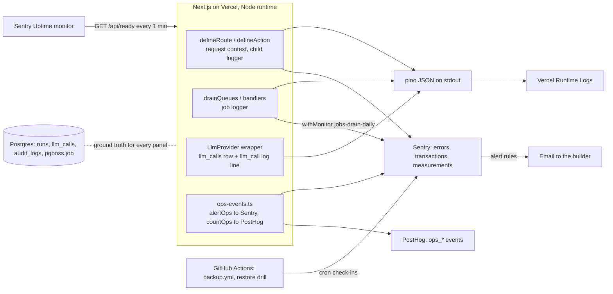

# 13 — Observability and Operations

**Purpose / Read this when:** you add a log line, wire Sentry or PostHog, touch `/api/health` or `/api/ready`, create a dashboard or alert, or operate production: deploy, roll back, migrate, restore, rotate a secret, handle an LLM outage, a held scoring run, or a stuck job. Every command here runs from the repo root on macOS or Linux with the CLIs pinned in `04-repo-structure.md` §8.

**Requirements covered:** NFR-001, NFR-007, NFR-008, NFR-009, NFR-011, NFR-015, NFR-016, SYS-009, SYS-014, SYS-016, SYS-020, SYS-025, SYS-027, INT-002, INT-005, INT-006, INT-010, DATA-049, DATA-051, FR-140; supports FR-001, FR-002, AI-001 to AI-003, D-012, D-018, D-027, D-047, D-065, D-066, D-069, D-070, D-084, D-086, D-098, D-101, D-103.

## 1. Signal map



Three sinks, one rule each: Sentry holds anything that must page someone; PostHog holds counters and distributions for dashboards and never alerts; the database tables are the ground truth when the two disagree. Everything degrades to a no-op when its key is empty (D-098).

## 2. Logging

### 2.1 Fixed field set

pino `10.3.1` writes one JSON object per line to stdout. Vercel captures stdout as Runtime Logs and parses the JSON fields. Every line carries exactly these keys; a key whose value is unknown is omitted, never set to `null`.

| Field | Type | Source | Present on |
|---|---|---|---|
| `level` | `"debug" \| "info" \| "warn" \| "error" \| "fatal"` | pino formatter (label, not number) | every line |
| `time` | ISO 8601 UTC string | `pino.stdTimeFunctions.isoTime` | every line |
| `msg` | string | the log call | every line |
| `requestId` | UUID string | `proxy.ts` (`x-request-id` honored if a UUID, else generated; D-086) | every request-scoped line |
| `userId` | 12 hex chars | `hashId(session.user.id)` = first 12 hex of SHA-256 of the user id | when a session exists |
| `orgId` | UUID string | active organization from the session | when an organization is active |
| `route` | string | the matched route pattern (`/api/v1/runs/[runId]/lock`, `/runs/[runId]/work`, action name for Server Actions) | request-scoped lines |
| `method` | string | HTTP method, or `ACTION` for Server Actions | request-scoped lines |
| `status` | integer | response status, or `200`/`500` for actions by outcome | the final `http_request` line |
| `durationMs` | integer | `Date.now() - startedAt` | the final `http_request`, `job`, and `llm_call` lines |
| `event` | string | one value from the catalogue in §2.6 | every line written by application code |
| `runId` | UUID string | the run being touched | run-scoped lines |
| `packageVersionId` | UUID string | the package version being touched | authoring and scoring lines |
| `jobId` | UUID string | pg-boss job id | job-scoped lines |

`base` is `null`, so `pid` and `hostname` never appear. `APP_ENV` and the release are not logged: Vercel scopes logs per deployment already.

### 2.2 Levels

| Level | Use it for | Examples |
|---|---|---|
| `trace` | never in committed code | |
| `debug` | detail useful only while developing; `LOG_LEVEL=debug` locally, `info` elsewhere (`05-environment-config.md`) | query timing, trigger-match candidates, clock arithmetic inputs |
| `info` | one line per unit of work that completed normally | `http_request`, `job`, `llm_call`, `run_transition`, `email`, `drain` |
| `warn` | a degraded path the system handled by itself | rate limit hit, circuit opened, provider fallback used, retry scheduled, run held, readiness check failing |
| `error` | a request or job that failed and was reported to Sentry | unhandled exception (`INTERNAL_ERROR`), job final failure, dead-letter |
| `fatal` | the process cannot serve traffic | `INVALID_SERVER_ENV` at boot |

4xx responses are `info` lines with `status` set; they are never `warn` and never go to Sentry (`02-architecture.md` §7).

### 2.3 Redaction (SYS-025, NFR-011)

Redaction runs inside pino (`redact.paths`), so nothing outside the logger can forget it. Paths, censored to `[REDACTED]`:

| Group | Paths |
|---|---|
| Credentials | `password`, `*.password`, `currentPassword`, `newPassword`, `*.currentPassword`, `*.newPassword`, `token`, `*.token`, `accessToken`, `refreshToken`, `*.accessToken`, `*.refreshToken` |
| Headers | `cookie`, `*.cookie`, `headers.cookie`, `headers["set-cookie"]`, `req.headers.cookie`, `res.headers["set-cookie"]`, `authorization`, `*.authorization`, `headers.authorization`, `req.headers.authorization`, `headers["api-key"]`, `req.headers["api-key"]`, `*["api-key"]` |
| Secret env values | `LLM_API_KEY`, `ANTHROPIC_API_KEY`, `RESEND_API_KEY`, `DATABASE_URL`, `DATABASE_URL_UNPOOLED`, `BETTER_AUTH_SECRET`, `CRON_SECRET`, `GOOGLE_CLIENT_SECRET`, `SEED_PASSWORD`, `SENTRY_AUTH_TOKEN`, and the same ten names under `*.` and `env.` |
| PII | `email`, `*.email`, `user.email`, `actor.email`, `name`, `user.name`, `ip`, `*.ip` |
| Delegation and defense bodies | `body`, `*.body`, `request_text`, `response_text`, `*.request_text`, `*.response_text`, `text_segments`, `*.text_segments`, `answer`, `*.answer`, `answers`, `justification`, `*.justification`, `statement`, `*.statement` |

Two more guards: (1) `hooks.logMethod` replaces every occurrence of a secret env value inside any string argument, so a connection string inside an error message cannot leak; (2) `defineRoute` and `defineAction` never attach request or response bodies to the logger for any route, and the delegation (`POST /api/v1/runs/[runId]/delegations`) and defense (`POST /api/v1/runs/[runId]/defense/answers`) handlers log only ids, lengths, and durations. Prompts and completions are never logged; `llm_calls` stores counts and a prompt hash (D-066).

### 2.4 Logger factory

`src/server/logging/logger.ts`

```ts
import { createHash } from 'node:crypto'
import pino, { type Logger, type LoggerOptions } from 'pino'
import { env } from '@/server/config'
import { REDACT_PATHS } from '@/server/logging/redaction'

export type RequestBindings = { requestId: string; userId?: string; orgId?: string; route: string; method: string }
export type JobBindings = { jobId: string; queue: string; runId?: string; packageVersionId?: string }

export const hashId = (id: string): string => createHash('sha256').update(id).digest('hex').slice(0, 12)

const SECRET_VALUES = [
  env.LLM_API_KEY, env.ANTHROPIC_API_KEY, env.RESEND_API_KEY, env.DATABASE_URL, env.DATABASE_URL_UNPOOLED ?? '',
  env.BETTER_AUTH_SECRET, env.CRON_SECRET, env.GOOGLE_CLIENT_SECRET, env.SEED_PASSWORD,
  process.env.SENTRY_AUTH_TOKEN ?? '',
].filter((v) => v.length >= 8)

export const scrubSecrets = (text: string): string =>
  SECRET_VALUES.reduce((acc, secret) => acc.split(secret).join('[REDACTED]'), text)

const options: LoggerOptions = {
  level: env.LOG_LEVEL,
  base: null,
  timestamp: pino.stdTimeFunctions.isoTime,
  messageKey: 'msg',
  formatters: { level: (label) => ({ level: label }) },
  redact: { paths: REDACT_PATHS, censor: '[REDACTED]' },
  serializers: {
    err: (err: Error) => ({ type: err.name, message: scrubSecrets(err.message), stack: scrubSecrets(err.stack ?? '') }),
  },
  hooks: {
    logMethod(args, method) {
      const scrubbed = args.map((a) => (typeof a === 'string' ? scrubSecrets(a) : a)) as typeof args
      method.apply(this, scrubbed)
    },
  },
}

// pino-pretty only in local (devDependency); JSON everywhere else, including tests.
export const rootLogger: Logger =
  env.APP_ENV === 'local'
    ? pino({ ...options, transport: { target: 'pino-pretty', options: { colorize: true, translateTime: 'HH:MM:ss.l', ignore: 'requestId,orgId' } } })
    : pino(options)

export const createRequestLogger = (b: RequestBindings): Logger => rootLogger.child(b)
export const createJobLogger = (b: JobBindings): Logger => rootLogger.child(b)
```

`src/server/logging/redaction.ts` exports `REDACT_PATHS: string[]` containing exactly the paths in §2.3. `src/server/logging/request-id.ts`:

```ts
const UUID = /^[0-9a-f]{8}-[0-9a-f]{4}-[0-9a-f]{4}-[0-9a-f]{4}-[0-9a-f]{12}$/i
export const getOrCreateRequestId = (headers: Headers): string => {
  const incoming = headers.get('x-request-id') ?? ''
  return UUID.test(incoming) ? incoming.toLowerCase() : crypto.randomUUID()
}
```

`proxy.ts` calls it, sets `x-request-id` on the forwarded request and on every response. `next.config.ts` lists `pino` and `pino-pretty` in `serverExternalPackages` so the pretty transport's worker thread resolves (§3.6).

### 2.5 Request-scoped and job-scoped child loggers

The request context (`02-architecture.md` §7) is an `AsyncLocalStorage` store in `src/server/http/request-context.ts` holding `{ requestId, actor, logger, startedAt }`. `defineRoute` and `defineAction` populate it:

```ts
// src/server/http/define-route.ts (excerpt)
const requestId = getOrCreateRequestId(request.headers)
const session = await getSession(request.headers)
const logger = createRequestLogger({
  requestId,
  ...(session ? { userId: hashId(session.user.id) } : {}),
  ...(session?.session.activeOrganizationId ? { orgId: session.session.activeOrganizationId } : {}),
  route: routePattern,
  method: request.method,
})
Sentry.setTag('request_id', requestId)
Sentry.setTag('route_group', routeGroup(routePattern, request.method))
if (session) Sentry.setUser({ id: hashId(session.user.id) })
return requestContext.run({ requestId, actor, logger, startedAt: Date.now() }, async () => {
  try {
    const response = await handler(input, ctx)
    logger.info({ event: 'http_request', status: response.status, durationMs: Date.now() - startedAt }, 'request completed')
    return response
  } catch (error) {
    const { status, code } = toEnvelope(error) // AppError keeps its status; anything else is 500 INTERNAL_ERROR
    if (status >= 500) {
      Sentry.captureException(error)
      logger.error({ event: 'http_request', status, code, err: error, durationMs: Date.now() - startedAt }, 'request failed')
    } else {
      logger.info({ event: 'http_request', status, code, durationMs: Date.now() - startedAt }, 'request rejected')
    }
    return envelopeResponse(status, code, requestId)
  }
})
```

`getLogger()` (exported from `src/server/http/request-context.ts`) returns the store's logger or `rootLogger`; services call `getLogger().info(...)` and never construct loggers. Job handlers run inside `requestContext.run({ requestId: job.id, logger: createJobLogger({ jobId: job.id, queue, runId, packageVersionId }), ... })`, so the same `getLogger()` works in both worlds. Route groups for the `route_group` tag: `api_read` (GET under `/api/v1`), `api_write` (other methods under `/api/v1`), `action` (Server Actions), `page` (RSC pages), `auth` (`/api/auth/*`), `internal` (`/api/health`, `/api/ready`, `/api/internal/*`, `/sentry-tunnel`).

### 2.6 Event catalogue (`event` field)

| `event` | Level | Written by | Extra fields |
|---|---|---|---|
| `http_request` | info / error | `defineRoute`, `defineAction` | `status`, `code`, `durationMs` |
| `run_transition` | info | `runs.service` state changes and `materializeTimers` | `runId`, `from`, `to`, `auto` |
| `turn_delivered` | info | `materializeTimers` | `runId`, `lagMs` (delivery read time minus `turn_due_at`) |
| `llm_call` | info / warn | `src/server/llm/calls.ts` after every provider call (NFR-016) | `feature`, `promptName`, `promptVersion`, `provider`, `model`, `latencyMs`, `inputTokens`, `outputTokens`, `costEstimateUsd`, `outcome`, `promptHash`, `runId`, `packageVersionId` |
| `llm_circuit` | warn | `src/server/llm/guardrails/circuit-breaker.ts` | `provider`, `state` (`open`, `half_open`, `closed`), `failures` |
| `llm_budget` | warn | `src/server/llm/guardrails/budgets.ts` | `scope` (`user_daily`, `global_monthly`), `used`, `limit` |
| `job` | info / error | `src/server/jobs/drain.ts` handler wrapper | `jobId`, `queue`, `outcome` (`completed`, `failed`, `dead_lettered`), `attempt`, `durationMs` |
| `drain` | info | `drainQueues()` | `trigger` (`after`, `cron`, `manual`, `worker`), `processed`, `durationMs`, `depth_<queue>` per queue |
| `scoring` | info / warn | `scoring.service.scoreRun` | `runId`, `phase` (`graphs`, `categorical`, `reads`, `bands`), `durationMs`, `held`, `reason` |
| `rate_limit` | warn | `src/server/rate-limit/enforce.ts` | `bucket`, `key` (hashed), `limit` |
| `auth` | info / warn | Better Auth `hooks.after` in `src/server/auth/auth.ts` | `path`, `outcome`, `code` |
| `email` | info / warn | `src/server/email/send.ts` | `template`, `transport`, `outcome` |
| `readiness` | warn | `src/server/http/readiness.ts` when a check fails | `db`, `jobs` |
| `boot` | info / fatal | `src/instrumentation.ts` | `release`, `appEnv` |

## 3. Sentry (`@sentry/nextjs` 10.73.0, manual setup, no wizard)

Rules: environment = `APP_ENV`; release = git SHA, injected at build by `withSentryConfig` (`release.name`) and read at runtime from `VERCEL_GIT_COMMIT_SHA`; tracing sample rate = `SENTRY_TRACES_SAMPLE_RATE` (`1.0` local and preview, `0.1` production; ADR-015); no session replay; `sendDefaultPii` off; the user context is the hashed id only; 4xx never captured. When `NEXT_PUBLIC_SENTRY_DSN` is empty every `Sentry.*` call is a no-op because `enabled` is `false` and `dsn` is `undefined` (D-098). The browser cannot read `APP_ENV` or `SENTRY_TRACES_SAMPLE_RATE` (neither is `NEXT_PUBLIC_`), so `next.config.ts` inlines those two non-secret values at build time under their own names (§3.6); no new variable is introduced.

### 3.1 `sentry.server.config.ts` (repo root)

```ts
import * as Sentry from '@sentry/nextjs'

const dsn = process.env.NEXT_PUBLIC_SENTRY_DSN ?? ''
const rate = Number(process.env.SENTRY_TRACES_SAMPLE_RATE ?? '1')
const NOISE = ['/api/health', '/api/ready', '/sentry-tunnel']

Sentry.init({
  dsn: dsn || undefined,
  enabled: dsn.length > 0,
  environment: process.env.APP_ENV ?? 'local',
  sendDefaultPii: false,
  tracesSampler: ({ name }) => (NOISE.some((p) => name.includes(p)) ? 0 : Number.isFinite(rate) ? rate : 0),
  beforeSend(event) {
    if (event.request) {
      delete event.request.cookies
      delete event.request.data
      if (event.request.headers) {
        delete event.request.headers.cookie
        delete event.request.headers.authorization
        delete event.request.headers['api-key']
      }
    }
    if (event.user) event.user = { id: event.user.id }
    return event
  },
})
```

### 3.2 `sentry.edge.config.ts` (repo root; no Edge runtime is used, the SDK requires the file to exist)

```ts
import * as Sentry from '@sentry/nextjs'

const dsn = process.env.NEXT_PUBLIC_SENTRY_DSN ?? ''

Sentry.init({
  dsn: dsn || undefined,
  enabled: dsn.length > 0,
  environment: process.env.APP_ENV ?? 'local',
  sendDefaultPii: false,
  tracesSampleRate: 0,
})
```

### 3.3 `src/instrumentation.ts`

```ts
import * as Sentry from '@sentry/nextjs'

export async function register() {
  if (process.env.NEXT_RUNTIME === 'nodejs') {
    await import('../sentry.server.config')
    // Fails fast on an invalid environment (05-environment-config.md §3); Sentry is already up to capture it.
    const { env } = await import('@/server/config')
    const { rootLogger } = await import('@/server/logging/logger')
    rootLogger.info({ event: 'boot', appEnv: env.APP_ENV, release: process.env.VERCEL_GIT_COMMIT_SHA ?? 'dev' }, 'server started')
  }
  if (process.env.NEXT_RUNTIME === 'edge') {
    await import('../sentry.edge.config')
  }
}

export const onRequestError = Sentry.captureRequestError
```

### 3.4 `src/instrumentation-client.ts` (Sentry client and PostHog init live here)

```ts
import * as Sentry from '@sentry/nextjs'
import posthog from 'posthog-js'
import { publicEnv } from '@/lib/env.public'

const dsn = publicEnv.NEXT_PUBLIC_SENTRY_DSN
const rate = Number(process.env.SENTRY_TRACES_SAMPLE_RATE ?? '1') // inlined by next.config.ts env

Sentry.init({
  dsn: dsn || undefined,
  enabled: dsn.length > 0,
  environment: process.env.APP_ENV ?? 'local', // inlined by next.config.ts env
  sendDefaultPii: false,
  tracesSampleRate: Number.isFinite(rate) ? rate : 0,
  integrations: [], // default integrations only: no replay, no feedback widget
  tunnel: '/sentry-tunnel',
})

if (publicEnv.NEXT_PUBLIC_POSTHOG_KEY) {
  posthog.init(publicEnv.NEXT_PUBLIC_POSTHOG_KEY, {
    api_host: '/ingest', // reverse proxy (D-115, D-119); connect-src stays 'self'
    ui_host: publicEnv.NEXT_PUBLIC_POSTHOG_HOST,
    defaults: '2025-05-24',
    capture_pageview: 'history_change',
    capture_pageleave: true,
    ip: false,
    person_profiles: 'identified_only',
    autocapture: false,
    disable_session_recording: true,
  })
}

export const onRouterTransitionStart = Sentry.captureRouterTransitionStart
```

### 3.5 `src/app/global-error.tsx`

```tsx
'use client'

import * as Sentry from '@sentry/nextjs'
import { useEffect } from 'react'
import { t } from '@/lib/i18n/t'

export default function GlobalError({ error, reset }: { error: Error & { digest?: string }; reset: () => void }) {
  useEffect(() => {
    Sentry.captureException(error)
  }, [error])
  return (
    <html lang="en-US">
      <body>
        <main>
          <h1>{t('errors.global.title')}</h1>
          <p>{t('errors.global.body')}</p>
          {error.digest ? <p><code>{error.digest}</code></p> : null}
          <button type="button" onClick={() => reset()}>{t('errors.global.retry')}</button>
        </main>
      </body>
    </html>
  )
}
```

Strings `errors.global.title`, `errors.global.body`, `errors.global.retry` live in `src/lib/i18n/en-US.ts` (D-105 copy: plain, non-blaming, no stack trace, the digest shown as the reference).

### 3.6 `next.config.ts`

The full `next.config.ts` is listed once, in `12-security.md` §4.3 (authoritative). The keys this document owns are `env` (inlining `APP_ENV` and `SENTRY_TRACES_SAMPLE_RATE` for the browser SDK), `serverExternalPackages: ['pino', 'pino-pretty']`, and the `withSentryConfig` options `org`, `project`, `authToken`, `silent: !process.env.CI`, `widenClientFileUpload: true`, `tunnelRoute: '/sentry-tunnel'`, `release: { name: process.env.SENTRY_RELEASE ?? process.env.VERCEL_GIT_COMMIT_SHA }`, `sourcemaps: { disable: !process.env.SENTRY_AUTH_TOKEN, deleteSourcemapsAfterUpload: true }`, `telemetry: false`.

Static security headers are set in `next.config.ts` `headers()`, the CSP and `x-request-id` in `proxy.ts` (`12-security.md` §4.1); `/sentry-tunnel` is same-origin, so `connect-src 'self'` covers it, and `proxy.ts` leaves it unauthenticated. With `SENTRY_AUTH_TOKEN` empty (local, preview) source maps are not uploaded and the build still succeeds. The production workflow exports `SENTRY_AUTH_TOKEN`, `SENTRY_ORG`, `SENTRY_PROJECT`, and `SENTRY_RELEASE=$GITHUB_SHA` on the `vercel build` step (`15-cicd-deployment.md` §7, D-121), so the release name is the merge commit SHA in the uploaded maps and in the runtime SDK. `vercel deploy` from a checked-out git repository attaches the commit metadata, and Vercel exposes it as `VERCEL_GIT_COMMIT_SHA` at runtime; `/api/health` reports the same value.

### 3.7 Operational events: `src/server/logging/ops-events.ts`

One module turns an operational condition into a log line, a Sentry event with a stable fingerprint (alert rules match the `ops` tag), and a PostHog counter.

```ts
import * as Sentry from '@sentry/nextjs'
import { getLogger } from '@/server/http/request-context'
import { track } from '@/server/analytics/track'

export type OpsAlert =
  | 'scoring_slow' | 'scoring_overdue' | 'run_held' | 'llm_error' | 'circuit_open' | 'budget_exceeded'
  | 'job_dead_lettered' | 'job_expired' | 'auth_rate_limited' | 'readiness_failed'

export type OpsCount =
  | 'ops_run_state_changed' | 'ops_turn_delivered' | 'ops_scoring_completed' | 'ops_run_held'
  | 'ops_llm_call' | 'ops_llm_circuit_opened' | 'ops_job_completed' | 'ops_job_failed' | 'ops_job_dead_lettered'
  | 'ops_queue_depth' | 'ops_drain_completed' | 'ops_sign_in_failed' | 'ops_rate_limit_hit'

type Attrs = Record<string, string | number | boolean | null | undefined>

// Alert-worthy: warn log + Sentry message tagged ops:<name>; one Sentry issue per name.
export function alertOps(name: OpsAlert, attrs: Attrs = {}): void {
  getLogger().warn({ event: `ops.${name}`, ...attrs }, `ops ${name}`)
  Sentry.withScope((scope) => {
    scope.setTag('ops', name)
    for (const [k, v] of Object.entries(attrs)) if (v !== undefined && v !== null) scope.setTag(k, String(v))
    scope.setFingerprint(['ops', name])
    Sentry.captureMessage(`ops.${name}`, 'warning')
  })
}

// Dashboard-worthy: info log + PostHog event; never alerts. distinctId is a hashed user id or 'system'.
export function countOps(event: OpsCount, props: Attrs = {}, distinctId = 'system'): void {
  getLogger().info({ event, distinctId, ...props }, event)
  track(event, props, distinctId) // wired in Phase 13; Phase 0 ships the log line only
}
```

`track(event, properties, distinctId)` is the server helper in `src/server/analytics/track.ts` (`17-analytics-events.md`); it is a no-op without `NEXT_PUBLIC_POSTHOG_KEY`. Property values are never PII: ids are hashed with `hashId`, texts are never attached.

## 4. Health and readiness endpoints (SYS-009)

`src/app/api/health/route.ts` answers without touching configuration or the database, so it is `200` whenever the process can run JavaScript:

```ts
export const dynamic = 'force-dynamic'
export const runtime = 'nodejs'

export function GET() {
  return Response.json(
    { status: 'ok', version: process.env.VERCEL_GIT_COMMIT_SHA ?? 'dev' },
    { headers: { 'cache-control': 'no-store' } },
  )
}
```

`src/server/http/readiness.ts` (a `server-lib` module, the only layer `src/app` may reach the database through; `04-repo-structure.md` §2):

```ts
import { sql } from 'drizzle-orm'
import { db } from '@/server/db/client'
import { rootLogger } from '@/server/logging/logger'

export type ReadinessReport = { status: 'ready' | 'not_ready'; checks: { db: string; jobs: string } }

const TIMEOUT_MS = 2000

function withTimeout<T>(promise: Promise<T>): Promise<T> {
  return Promise.race([
    promise,
    new Promise<T>((_, reject) => setTimeout(() => reject(new Error('timeout')), TIMEOUT_MS).unref()),
  ])
}

const outcome = (e: unknown): string => (e instanceof Error && e.message === 'timeout' ? 'timeout' : 'error')

export async function checkReadiness(): Promise<ReadinessReport> {
  const checks = { db: 'ok', jobs: 'ok' }
  try {
    await withTimeout(db.execute(sql`select 1`))
  } catch (e) {
    checks.db = outcome(e)
    checks.jobs = 'skipped'
  }
  if (checks.db === 'ok') {
    try {
      const rows = await withTimeout(db.execute(sql`select 1 from information_schema.schemata where schema_name = 'pgboss'`))
      if (rows.length === 0) checks.jobs = 'missing_schema'
    } catch (e) {
      checks.jobs = outcome(e)
    }
  }
  const status = checks.db === 'ok' && checks.jobs === 'ok' ? 'ready' : 'not_ready'
  if (status === 'not_ready') rootLogger.warn({ event: 'readiness', ...checks }, 'readiness check failed')
  return { status, checks }
}
```

`src/app/api/ready/route.ts`:

```ts
export const dynamic = 'force-dynamic'
export const runtime = 'nodejs'

const NO_STORE = { 'cache-control': 'no-store' }

export async function GET() {
  try {
    const { checkReadiness } = await import('@/server/http/readiness')
    const report = await checkReadiness()
    return Response.json(report, { status: report.status === 'ready' ? 200 : 503, headers: NO_STORE })
  } catch {
    // Module load failed: invalid environment (INVALID_SERVER_ENV) or driver failure.
    return Response.json({ status: 'not_ready', checks: { db: 'boot_error', jobs: 'skipped' } }, { status: 503, headers: NO_STORE })
  }
}
```

Responses: `200 {"status":"ready","checks":{"db":"ok","jobs":"ok"}}`; `503 {"status":"not_ready","checks":{"db":"timeout","jobs":"skipped"}}`; `503 {"status":"not_ready","checks":{"db":"ok","jobs":"missing_schema"}}`. Check values are fixed strings, never driver messages (no SQL or hosts leave the process; `04-repo-structure.md` §4). Both routes are public, rate-limited by the `internal` bucket only, and excluded from Sentry tracing by the `tracesSampler` in §3.1.

## 5. Instrumentation points

Every panel and alert below reads from one of these emitters. The builder adds each call at the named location; nothing else emits `ops_*` events or `ops:` tags.

| Location | Emit | Payload |
|---|---|---|
| `runs.service` after every state write and in `materializeTimers` | `countOps('ops_run_state_changed')` | `state`, `from_state`, `auto` |
| `materializeTimers` when it writes `turn_delivered` | `countOps('ops_turn_delivered')` | `lag_ms = deliveryReadTime - turn_due_at` |
| `scoring.service.scoreRun` on success | `countOps('ops_scoring_completed')`; `alertOps('scoring_slow')` when `duration_ms > 480000` (D-047) | `duration_ms`, `provider`, `provisional_dimensions`, `unassessed_dimensions` |
| `scoring.service.scoreRun` when it sets `runs.scoring_status = 'held'` (FR-140) | `countOps('ops_run_held')` and `alertOps('run_held')` | `reason` (`read_failed`, `budget_exceeded`, `provider_error`, `record_lost`), `run_id` |
| `drainQueues()` at the start of every drain | `alertOps('scoring_overdue')` per run where `scoring_status in ('queued','running') and defense_completed_at < now() - interval '8 minutes'` | `run_id`, `age_ms` |
| `src/server/llm/calls.ts` after writing the `llm_calls` row | `countOps('ops_llm_call')`; `alertOps('llm_error')` when `outcome in ('timeout','error')` | `feature`, `provider`, `model`, `prompt_name`, `prompt_version`, `outcome`, `latency_ms`, `input_tokens`, `output_tokens`, `cost_estimate_usd`, `user_daily_tokens_after`, `global_monthly_tokens_after` |
| `guardrails/circuit-breaker.ts` on open | `countOps('ops_llm_circuit_opened')` and `alertOps('circuit_open')` | `provider`, `failures`, `fallback` (`anthropic` or `none`) |
| `guardrails/budgets.ts` on a hard stop | `alertOps('budget_exceeded')` | `scope`, `used`, `limit` |
| `drain.ts` handler wrapper after each job | `countOps('ops_job_completed' or 'ops_job_failed')`; on the final failed attempt `countOps('ops_job_dead_lettered')` and `alertOps('job_dead_lettered')` | `queue`, `job_id`, `attempt`, `duration_ms` |
| `drain.ts` at the end of every drain | `countOps('ops_queue_depth')` once per queue, then `countOps('ops_drain_completed')` | per queue `queue`, `created`, `retry`, `active`, `failed`, `dead`; then `trigger`, `processed`, `duration_ms` |
| `scripts/jobs-retry.ts --expire-stuck` | `alertOps('job_expired')` per expired job | `queue`, `job_id`, `age_ms` |
| Better Auth `hooks.after` on `/sign-in/email` returning an `APIError` | `countOps('ops_sign_in_failed')` | `code` (`INVALID_EMAIL_OR_PASSWORD`, `EMAIL_NOT_VERIFIED`) |
| `rate-limit/enforce.ts` on refusal | `countOps('ops_rate_limit_hit')`; for `bucket = 'auth'` also `alertOps('auth_rate_limited')` | `bucket`, `limit` |
| `readiness.ts` when `not_ready` | `alertOps('readiness_failed')` | `db`, `jobs` |
| `assistant.service.delegate` on the first streamed token | `Sentry.setMeasurement('assistant_first_token', ms, 'millisecond')` and `Sentry.setTag('llm_provider', provider)` on the active transaction | |

Queue depth query used by the drain (pg-boss 12 keeps every queue in the partitioned table `pgboss.job`):

```sql
select name, state, count(*)::int as n
from pgboss.job
where state in ('created', 'retry', 'active', 'failed')
group by name, state;
```

## 6. Dashboards

Sentry panels are saved Discover queries (Sentry → Explore → Discover → Build a new query → Save), named exactly as below; on a plan with custom dashboards, pin them into a dashboard with the group name. PostHog panels are Trends insights on a dashboard with the group name (PostHog → Dashboards → New dashboard → Add insight). Vercel panels are the built-in views under the `tassl` project (Vercel → Project → Observability, and → Logs). The SQL column is the ground-truth check, run with `psql "$DATABASE_URL_UNPOOLED"` after `npx vercel@59.11.2 env pull --environment=production --yes --token "$VERCEL_TOKEN" .vercel/prod.env && set -a && source .vercel/prod.env && set +a && rm .vercel/prod.env`.

### 6.1 `Tassl API health` (NFR-007, NFR-008)

| Panel | Source | Query or view |
|---|---|---|
| 5xx rate | Sentry Discover, dataset Transactions | `event.type:transaction transaction.op:http.server`, y-axis `failure_rate()`, 5-minute interval |
| 5xx count by route | Vercel → Observability → Requests | filter `status >= 500`, group by path |
| p95 latency per route group | Sentry Discover | `event.type:transaction transaction.op:http.server !route_group:internal`, columns `route_group`, `p95(transaction.duration)`, `p50(transaction.duration)`, `count()` |
| Request volume | Sentry Discover | same filter, y-axis `count()` by `route_group`, 1-hour interval |
| Function duration and cold starts | Vercel → Observability → Functions | p75 / p95 duration by route, invocations, cold-start ratio |
| Error log lines | Vercel → Logs | query `level:error`, save the view as `errors` |

SQL check: none. Request timings are not stored in Postgres; the Sentry panel is the record for NFR-008.

### 6.2 `Tassl run pipeline` (NFR-001, NFR-002, FR-140)

| Panel | Source | Query or view |
|---|---|---|
| Runs by state (transitions per day) | PostHog Trends | event `ops_run_state_changed`, total count, breakdown by `state`, daily |
| Scoring latency p95 and max | PostHog Trends | event `ops_scoring_completed`, aggregations `p95` and `max` of `duration_ms`, hourly; reference lines at 180000 (target) and 600000 (limit) |
| Scoring latency by provider | PostHog Trends | same event, `p95(duration_ms)` broken down by `provider` |
| Held runs | PostHog Trends | event `ops_run_held`, total count, breakdown by `reason`, daily |
| Turn delivery lag | PostHog Trends | event `ops_turn_delivered`, `p95` and `max` of `lag_ms`, hourly; NFR-002 bound is 6000 ms for an online client |
| Overdue scoring right now | SQL | `select id, defense_completed_at, scoring_status from runs where scoring_status in ('queued','running') and defense_completed_at < now() - interval '8 minutes';` |
| Held queue right now | SQL | `select id, state, scoring_status, defense_completed_at from runs where scoring_status = 'held' order by defense_completed_at;` |

### 6.3 `Tassl LLM` (NFR-016, D-065, DATA-049)

| Panel | Source | Query or view |
|---|---|---|
| Calls per feature | PostHog Trends | event `ops_llm_call`, total count, breakdown by `feature`, daily |
| Error rate | PostHog Trends | formula: A = `ops_llm_call` where `outcome` is not `ok`, `repaired`; B = `ops_llm_call` all; `A / B`, hourly |
| p95 latency per feature | PostHog Trends | event `ops_llm_call`, `p95(latency_ms)`, breakdown by `feature` |
| Tokens per day | PostHog Trends | `sum(input_tokens)` and `sum(output_tokens)` of `ops_llm_call`, daily |
| Cost per day (USD estimate) | PostHog Trends | `sum(cost_estimate_usd)` of `ops_llm_call`, daily |
| Global monthly budget consumption | PostHog Trends | `max(global_monthly_tokens_after)` of `ops_llm_call`, daily, formula `A / 20000000` (the `LLM_GLOBAL_MONTHLY_TOKEN_BUDGET` default; edit the divisor when the env value changes) |
| Per-user daily budget consumption | PostHog Trends | `max(user_daily_tokens_after)` of `ops_llm_call`, breakdown by `distinct_id`, formula `A / 200000` (`LLM_USER_DAILY_TOKEN_BUDGET` default) |
| Circuit-breaker opens | PostHog Trends | event `ops_llm_circuit_opened`, total count, breakdown by `provider`, hourly |
| Ground truth: tokens and cost per day | SQL | `select date_trunc('day', created_at) d, feature, count(*) calls, sum(input_tokens) in_tok, sum(output_tokens) out_tok, sum(cost_estimate_usd) usd, sum((outcome not in ('ok','repaired'))::int) errors from llm_calls where created_at > now() - interval '30 days' group by 1, 2 order by 1 desc, 2;` |
| Ground truth: month-to-date budget | SQL | `select sum(input_tokens + output_tokens) as used_this_month from llm_calls where created_at >= date_trunc('month', now());` |

### 6.4 `Tassl jobs` (SYS-020, INT-010)

| Panel | Source | Query or view |
|---|---|---|
| Queue depth per queue | PostHog Trends | event `ops_queue_depth`, `max(created)`, `max(retry)`, `max(active)` broken down by `queue`, hourly |
| Failed jobs | PostHog Trends | event `ops_job_failed`, total count by `queue`, daily |
| Dead-letter count | PostHog Trends | event `ops_job_dead_lettered`, total count by `queue`, daily; and `max(dead)` of `ops_queue_depth` |
| Drain duration | PostHog Trends | event `ops_drain_completed`, `p95(duration_ms)` and `max(duration_ms)` broken down by `trigger`; the Vercel ceiling is 300000 ms (D-038) |
| Cron sweep health | Sentry → Crons → `jobs-drain-daily` | check-in history |
| Ground truth | SQL | the queue depth query in §5; dead letters: `select name, count(*) from pgboss.job where name like '%\_dead' and state = 'created' group by 1;` |

### 6.5 `Tassl auth` (NFR-011, D-021, D-026)

| Panel | Source | Query or view |
|---|---|---|
| Sign-in failures | PostHog Trends | event `ops_sign_in_failed`, total count, breakdown by `code`, hourly |
| Rate-limit hits per bucket | PostHog Trends | event `ops_rate_limit_hit`, total count, breakdown by `bucket` (`auth`, `llm`, `writes`, `reads`, `run_events`), hourly |
| Auth rate-limit alerts | Sentry → Issues | filter `ops:auth_rate_limited` |
| Ground truth: sensitive actions | SQL | `select action, count(*) from audit_logs where created_at > now() - interval '7 days' group by 1 order by 2 desc;` |

## 7. Alerts (Sentry only; email to the builder)

Destination for every rule: the Sentry account email of the builder (Sentry → Settings → Account → Notifications → Alerts: on). PostHog sends no alerts. GitHub sends its own failed-workflow email for `backup.yml` and `production.yml` (GitHub → Settings → Notifications → Actions → "Send notifications for failed workflows only"), which duplicates the Sentry cron alert on purpose. Create each rule at Sentry → Alerts → Create Alert.

| Name | NFR | Type | Condition | Window | Threshold |
|---|---|---|---|---|---|
| `NFR-007 5xx rate` | NFR-007 | Metric alert, Transactions | `failure_rate()` on `transaction.op:http.server !route_group:internal` | 5 min | critical above 2 %, warning above 1 % (`02-architecture.md` §8) |
| `NFR-007 readiness down` | NFR-007 | Uptime monitor | `GET {NEXT_PUBLIC_APP_URL}/api/ready`, interval 1 min, timeout 10 s | 3 consecutive failures | downtime issue created and emailed; recovery emailed |
| `NFR-007 error burst` | NFR-007 | Issue alert | filter "the event's tags match: `ops` is not set" (unhandled 5xx only) | 5 min | more than 10 events, or a new issue is created |
| `NFR-008 read latency` | NFR-008 | Metric alert, Transactions | `p95(transaction.duration)` on `route_group:api_read` | 10 min | critical above 400 ms, warning above 300 ms |
| `NFR-008 write latency` | NFR-008 | Metric alert, Transactions | `p95(transaction.duration)` on `route_group:api_write OR route_group:action` | 10 min | critical above 800 ms, warning above 600 ms |
| `NFR-008 page latency` | NFR-008 | Metric alert, Transactions | `p95(transaction.duration)` on `route_group:page` | 10 min | critical above 2500 ms |
| `NFR-008 assistant first token` | NFR-008 | Metric alert, Transactions | `p95(measurements.assistant_first_token)` on `llm_provider:openai-compatible OR llm_provider:anthropic` | 15 min | critical above 3000 ms |
| `NFR-001 scoring slow` | NFR-001 | Issue alert | events tagged `ops:scoring_slow` or `ops:scoring_overdue` | 1 hour | 1 or more (D-047: 8 minutes) |
| `NFR-001 run held` | NFR-001, FR-140 | Issue alert | `ops:run_held` | 1 hour | 1 or more |
| `NFR-015 nightly backup` | NFR-015 | Cron monitor `nightly-backup` | schedule `30 3 * * *` UTC, check-in margin 30 min, max runtime 60 min | per run | missed or failed check-in |
| `NFR-015 restore drill` | NFR-015 | Cron monitor `restore-drill` | schedule `0 6 * * 1` UTC, margin 120 min, max runtime 90 min | per run | missed or failed check-in |
| `NFR-015 daily sweep` | NFR-015, SYS-020 | Cron monitor `jobs-drain-daily` | schedule `0 4 * * *` UTC, margin 30 min, max runtime 10 min | per run | missed or failed check-in |
| `NFR-016 LLM errors` | NFR-016 | Issue alert | `ops:llm_error` | 10 min | 5 or more |
| `NFR-016 circuit open` | NFR-016, D-103 | Issue alert | `ops:circuit_open` | 5 min | 1 or more |
| `NFR-016 budget exceeded` | NFR-016, D-065 | Issue alert | `ops:budget_exceeded` | 1 hour | 1 or more |
| `SYS-020 dead letter` | SYS-020 | Issue alert | `ops:job_dead_lettered` | 1 hour | 1 or more |
| `SYS-020 expired jobs` | SYS-020 | Issue alert | `ops:job_expired` | 1 hour | 3 or more |
| `NFR-011 auth rate limited` | NFR-011 | Issue alert | `ops:auth_rate_limited` | 10 min | 20 or more |

Cron monitors are created by their first check-in (the check-in carries `monitor_config`, §8.4), so nothing is clicked for them beyond confirming the email action on the auto-created alert. The daily sweep wraps the drain route: `Sentry.withMonitor('jobs-drain-daily', () => drainQueues('cron'), { schedule: { type: 'crontab', value: '0 4 * * *' }, checkinMargin: 30, maxRuntime: 10, timezone: 'UTC' })` in `src/app/api/internal/jobs/drain/route.ts`; `after()` kicks call `drainQueues('after')` directly and never check in.

Verification after creating the rules: `curl -sS -o /dev/null -w '%{http_code}\n' "$NEXT_PUBLIC_APP_URL/api/v1/does-not-exist"` returns `404` and produces no alert (4xx); `curl -sS -H "Authorization: Bearer $CRON_SECRET" "$NEXT_PUBLIC_APP_URL/api/internal/jobs/drain"` returns `200` and a check-in appears under Sentry → Crons → `jobs-drain-daily` within a minute.

## 8. Runbooks

Shell prerequisites for every runbook: Node 24 (`nvm use`), `pnpm 11.25.0`, `gh` authenticated (`gh auth status`), `psql` and `pg_restore` from PostgreSQL 17 client tools, and these exported from the password manager: `VERCEL_TOKEN`, `VERCEL_ORG_ID`, `VERCEL_PROJECT_ID`, `NEON_API_KEY`, `NEON_PROJECT_ID`, `BACKUP_ENCRYPTION_KEY`, `NEXT_PUBLIC_SENTRY_DSN`. With `VERCEL_ORG_ID` and `VERCEL_PROJECT_ID` set, `npx vercel@59.11.2` needs no `vercel link`; `npx neon@4.14.0` reads `NEON_API_KEY` from the environment. Production values are fetched with:

```bash
npx vercel@59.11.2 env pull --environment=production --yes --token "$VERCEL_TOKEN" .vercel/prod.env
set -a && source .vercel/prod.env && set +a && rm .vercel/prod.env
```

`.vercel/` is gitignored; the file is removed in the same line.

### 8.1 Runbook (a): deploy

`production.yml` runs on every push to `main` (squash merge of a PR) and on `workflow_dispatch`: the ten `checks.yml` gates (`lint` … `security`), then the `deploy` job: `vercel pull` → `vercel build --prod` (with `SENTRY_AUTH_TOKEN`, `SENTRY_ORG`, `SENTRY_PROJECT`, `SENTRY_RELEASE=${{ github.sha }}`) → `pnpm db:migrate` against `PRODUCTION_DATABASE_URL_UNPOOLED` (D-070) → `vercel deploy --prebuilt --prod` → `pnpm smoke` against `NEXT_PUBLIC_APP_URL` → `getsentry/action-release@v3` (`15-cicd-deployment.md` §7).

1. Merge the PR: `gh pr merge <number> --squash --delete-branch`.
2. Watch the run: `gh run watch --exit-status "$(gh run list --workflow production.yml --branch main --limit 1 --json databaseId --jq '.[0].databaseId')"`.
3. Confirm the release in Sentry: Sentry → Releases → the new SHA shows `production` with source maps ("Artifacts" tab non-empty).
4. Verify from your machine: `pnpm smoke` (needs `NEXT_PUBLIC_APP_URL` from the env pull above; the smoke test is unauthenticated, D-101).
5. Check the readiness panel and the `NFR-007 5xx rate` alert for 15 minutes: Sentry → Alerts → the rule → history shows no trigger.
6. If step 4 or 5 fails, go to §8.2.

`scripts/smoke.sh` (invoked by `pnpm smoke`; `NEXT_PUBLIC_APP_URL` defaults to `http://localhost:3000`; unauthenticated (D-101)):

```bash
#!/usr/bin/env bash
# Post-deploy smoke test: health, readiness, sign-in page, and (with SEED_PASSWORD) an authenticated GET /api/v1/me.
set -euo pipefail

BASE_URL="${NEXT_PUBLIC_APP_URL:-http://localhost:3000}"
BASE_URL="${BASE_URL%/}"
JAR="$(mktemp)"
BODY="$(mktemp)"
trap 'rm -f "$JAR" "$BODY"' EXIT
FAILED=0

check() {
  # check <name> <expected_status> <required_body_substring or ""> <curl args...>
  local name="$1" expected="$2" needle="$3"
  shift 3
  local status
  status="$(curl -sS --max-time 20 -o "$BODY" -w '%{http_code}' "$@")" || status="000"
  if [ "$status" != "$expected" ]; then
    echo "FAIL $name: expected HTTP $expected, got $status"; FAILED=1; return
  fi
  if [ -n "$needle" ] && ! grep -q -- "$needle" "$BODY"; then
    echo "FAIL $name: body does not contain $needle"; FAILED=1; return
  fi
  echo "ok   $name"
}

check health    200 '"status":"ok"'    "$BASE_URL/api/health"
check ready     200 '"status":"ready"' "$BASE_URL/api/ready"
check sign-in   200 ''                 "$BASE_URL/sign-in"

if [ -n "${SEED_PASSWORD:-}" ]; then
  check sign-in-email 200 '' -c "$JAR" -H "Content-Type: application/json" -H "Origin: $BASE_URL" \
    --data "{\"email\":\"student1@tassl.local\",\"password\":\"$SEED_PASSWORD\"}" \
    "$BASE_URL/api/auth/sign-in/email"
  check me 200 '"email"' -b "$JAR" "$BASE_URL/api/v1/me"
  check sign-out 200 '' -b "$JAR" -X POST -H "Origin: $BASE_URL" "$BASE_URL/api/auth/sign-out"
else
  echo "skip authenticated check (SEED_PASSWORD not set)"
fi

if [ "$FAILED" -ne 0 ]; then echo "SMOKE FAILED against $BASE_URL"; exit 1; fi
echo "SMOKE OK against $BASE_URL"
```

### 8.2 Runbook (b): rollback

Application rollback is instant and does not touch the database. Migration reversal is needed only when the release shipped a contract migration (a drop or a constraint), which the PR checklist forbids by default (`04-repo-structure.md` §6); expand migrations (new nullable columns, new tables) need no reversal and stay in place (D-070, `06-data-model.md` §4).

1. Pick the previous production deployment (the second URL in the listing, newest first): `export PREV_URL="$(npx vercel@59.11.2 ls tassl --prod --token "$VERCEL_TOKEN" 2>/dev/null | grep -o 'https://[^ ]*' | sed -n 2p)" && echo "$PREV_URL"`.
2. Roll back: `npx vercel@59.11.2 rollback "$PREV_URL" --token "$VERCEL_TOKEN"` (the Vercel dashboard equivalent: Project → Deployments → the previous deployment → "⋯" → Instant Rollback → confirm).
3. Verify: `pnpm smoke`; Sentry → Releases shows the previous SHA receiving events.
4. If, and only if, the release contained a contract migration `drizzle/NNNN_<slug>.sql`, apply its hand-written reverse against the unpooled URL:

```bash
psql "$DATABASE_URL_UNPOOLED" -v ON_ERROR_STOP=1 -f drizzle/down/NNNN_<slug>.sql
psql "$DATABASE_URL_UNPOOLED" -v ON_ERROR_STOP=1 -c \
  "delete from drizzle.__drizzle_migrations where created_at = (select max(created_at) from drizzle.__drizzle_migrations);"
psql "$DATABASE_URL_UNPOOLED" -At -c "select hash, to_timestamp(created_at / 1000) from drizzle.__drizzle_migrations order by created_at desc limit 3;"
```

The `delete` removes exactly the journal row of the last applied migration so the next `pnpm db:migrate` re-applies the corrected file. Never run a down file for an expand migration.

5. Open a fix-forward PR; the next merge redeploys through §8.1.

### 8.3 Runbook (c): database migration

Write the change as expand/contract (`06-data-model.md` §4): release 1 adds nullable columns or tables and the code writes both shapes; release 2 backfills and adds constraints; release 3 drops the old shape. Never rename in place. Each contract file gets a paired `drizzle/down/NNNN_<slug>.sql`.

Local:

```bash
docker compose up -d postgres
pnpm db:generate                                  # writes drizzle/NNNN_<slug>.sql and updates drizzle/meta
cat drizzle/$(ls drizzle | grep -E '^[0-9]{4}_' | sort | tail -n 1)   # read every statement before committing
pnpm db:migrate                                   # drizzle-kit migrate + scripts/pgboss-migrate.ts
pnpm test:integration
psql "$DATABASE_URL" -At -c "select hash, to_timestamp(created_at / 1000) from drizzle.__drizzle_migrations order by created_at desc limit 1;"
```

CI: the PR workflow runs `pnpm db:migrate` against the `postgres:17-alpine` service before integration tests, then creates the Neon branch `preview/pr-<n>` and migrates it before `vercel deploy` (D-071). A migration that fails on either stops the PR.

Production: `production.yml` runs `pnpm db:migrate` with `DATABASE_URL_UNPOOLED=$PRODUCTION_DATABASE_URL_UNPOOLED` after every test gate and before `vercel deploy --prebuilt --prod` (D-070). The old code keeps running against the expanded schema during the seconds between the two steps, which is why every migration in a release must be expand-only.

Verify in production after the deploy:

```bash
psql "$DATABASE_URL_UNPOOLED" -At -c "select hash, to_timestamp(created_at / 1000) from drizzle.__drizzle_migrations order by created_at desc limit 3;"
psql "$DATABASE_URL_UNPOOLED" -c "\d+ runs"      # or the table the migration touched
curl -sS "$NEXT_PUBLIC_APP_URL/api/ready"          # {"status":"ready",...}
```

Hand-written migrations (`0001_extensions_and_triggers`, `0002_immutability`) follow the same numbering and are applied by the same command; the pgboss schema is migrated by `scripts/pgboss-migrate.ts`, never by a Drizzle file.

### 8.4 Runbook (d): restore from a Neon backup (NFR-015, D-069)

Two independent paths exist: Neon point-in-time restore (history retention set to 7 days in Phase 0) and the nightly encrypted `pg_dump` artifact (`tassl-backup-<date>`, 30-day retention, produced by `backup.yml` at 03:30 UTC). RPO 24 h for the dump, RTO 1 h.

**Point-in-time restore of production (incident):**

1. Agree the timestamp in writing (the incident note), in UTC, for example `2026-09-02T10:15:00Z`.
2. Stop writes: Neon Console → Branches → `main` → Computes → Suspend. Every request now fails readiness (`/api/ready` returns 503) until step 4; nothing is written in between.
3. Restore, keeping the current state under a named branch for forensics:

```bash
npx neon@4.14.0 branches restore main '^self@2026-09-02T10:15:00Z' --project-id "$NEON_PROJECT_ID" --preserve-under-name "main-before-restore-$(date -u +%Y%m%dT%H%M%SZ)"
```

4. Resume the compute (Neon Console → the suspended compute → Resume); connection strings are unchanged because the branch id is unchanged.
5. Verify: `pnpm smoke`; `psql "$DATABASE_URL_UNPOOLED" -At -c "select max(created_at) from run_events;"` shows a time at or before the agreed timestamp.
6. Re-drain jobs that were in flight: `curl -sS -X POST -H "Authorization: Bearer $CRON_SECRET" "$NEXT_PUBLIC_APP_URL/api/internal/jobs/drain"`.
7. Delete the preserved branch after the incident review: `npx neon@4.14.0 branches delete main-before-restore-<stamp> --project-id "$NEON_PROJECT_ID"` with the exact name printed in step 3.

**Restore of the nightly artifact into a new branch (drill, or when history retention is exhausted):** run `bash scripts/restore-drill.sh`; to promote the restored branch to production afterwards, `npx neon@4.14.0 branches restore main "restore-drill-$(date -u +%Y-%m-%d)@head" --project-id "$NEON_PROJECT_ID" --preserve-under-name main-before-restore` before the script's cleanup step (run the script with `KEEP_BRANCH=1`).

`scripts/restore-drill.sh` (weekly, Monday 06:00 UTC on the builder's machine or a `workflow_dispatch` runner; the Sentry cron monitor `restore-drill` alerts when a week passes without a check-in):

```bash
#!/usr/bin/env bash
# Weekly restore drill (NFR-015, D-069): latest nightly dump -> fresh Neon branch -> migrate -> smoke -> delete.
# Env: NEON_API_KEY NEON_PROJECT_ID BACKUP_ENCRYPTION_KEY; NEXT_PUBLIC_SENTRY_DSN for the check-in (skipped when empty);
#      KEEP_BRANCH=1 keeps the branch (real restore). Requires gh, psql, pg_restore, pnpm, a built .next directory.
set -euo pipefail
START=$(date +%s)
STAMP=$(date -u +%Y-%m-%d)
BRANCH="restore-drill-$STAMP"
WORK="$(mktemp -d)"
PORT=3100
SERVER_PID=""
STATUS="error"

sentry_checkin() {
  # $1 = in_progress | ok | error ; delegates to the shared helper (15-cicd-deployment.md §8), which upserts the
  # monitor schedule on first use and is a no-op when NEXT_PUBLIC_SENTRY_DSN is empty.
  bash scripts/sentry-checkin.sh restore-drill "$1" '0 6 * * 1' 120 90 || true
}

cleanup() {
  [ -n "$SERVER_PID" ] && kill "$SERVER_PID" 2>/dev/null || true
  if [ "${KEEP_BRANCH:-0}" != "1" ]; then
    npx neon@4.14.0 branches delete "$BRANCH" --project-id "$NEON_PROJECT_ID" >/dev/null 2>&1 || true
  fi
  rm -rf "$WORK"
  sentry_checkin "$STATUS"
  echo "restore drill $STAMP finished: $STATUS in $(( $(date +%s) - START )) s (RTO target 3600 s)"
}
trap cleanup EXIT
sentry_checkin in_progress

# 1. Latest successful nightly artifact, decrypted
RUN_ID=$(gh run list --workflow backup.yml --status success --limit 1 --json databaseId --jq '.[0].databaseId')
gh run download "$RUN_ID" --dir "$WORK/artifact"
ENC=$(find "$WORK/artifact" -name '*.dump.enc' | head -n 1)
openssl enc -d -aes-256-cbc -pbkdf2 -k "$BACKUP_ENCRYPTION_KEY" -in "$ENC" -out "$WORK/backup.dump"

# 2. Fresh branch from main, then restore over it
npx neon@4.14.0 branches create --project-id "$NEON_PROJECT_ID" --name "$BRANCH" --parent main >/dev/null
RESTORE_URL=$(npx neon@4.14.0 connection-string "$BRANCH" --project-id "$NEON_PROJECT_ID" --pooled false)
pg_restore --clean --if-exists --no-owner -d "$RESTORE_URL" "$WORK/backup.dump" \
  || echo "pg_restore exited non-zero (warnings on DROP of missing objects are expected); verification below decides"

# 3. Verify schema, journal, and data
DATABASE_URL="$RESTORE_URL" DATABASE_URL_UNPOOLED="$RESTORE_URL" pnpm db:migrate
psql "$RESTORE_URL" -v ON_ERROR_STOP=1 -At -c "select 'runs', count(*) from runs union all select 'run_events', count(*) from run_events union all select 'users', count(*) from \"user\";"
psql "$RESTORE_URL" -v ON_ERROR_STOP=1 -At -c "select count(*) from information_schema.schemata where schema_name = 'pgboss';" | grep -qx 1

# 4. Smoke against a local server on the restored branch
[ -f .next/BUILD_ID ] || pnpm build
PORT=$PORT DATABASE_URL="$RESTORE_URL" DATABASE_URL_UNPOOLED="$RESTORE_URL" APP_ENV=test LLM_PROVIDER=mock FEATURE_AI=false EMAIL_TRANSPORT=console pnpm start >"$WORK/server.log" 2>&1 &
SERVER_PID=$!
for _ in $(seq 1 60); do curl -sf "http://localhost:$PORT/api/health" >/dev/null && break; sleep 1; done
NEXT_PUBLIC_APP_URL="http://localhost:$PORT" bash scripts/smoke.sh
STATUS="ok"
```

Record the printed duration in the incident log page of the repository wiki (`gh repo view --web` → Wiki → "Restore drills"); a duration above 3600 s is an NFR-015 breach and opens an issue: `gh issue create --title "Restore drill exceeded RTO" --body "Duration: <seconds> s on <date>"` with the printed values.

`backup.yml` uses the same check-in function with monitor slug `nightly-backup`, schedule `30 3 * * *`, margin 30, max runtime 60: `in_progress` before `pg_dump`, `ok` after `actions/upload-artifact@v7` succeeds, `error` in an `if: failure()` step. The DSN reaches the workflow as the repository variable `NEXT_PUBLIC_SENTRY_DSN` (`gh variable set NEXT_PUBLIC_SENTRY_DSN --body "$NEXT_PUBLIC_SENTRY_DSN"`).

### 8.5 Runbook (e): rotate a secret

Pattern: create the new value, store it, redeploy so the running deployment reads it, verify, then revoke the old value. `vercel env add --force` replaces an existing variable in place; `--sensitive` keeps the value unreadable in the dashboard. Redeploy of the current production deployment without a rebuild:

```bash
npx vercel@59.11.2 redeploy "${NEXT_PUBLIC_APP_URL#https://}" --token "$VERCEL_TOKEN"
```

| Secret | 1. Create | 2. Store | 3. Redeploy | 4. Verify | 5. Revoke old |
|---|---|---|---|---|---|
| `BETTER_AUTH_SECRET` | `NEW=$(openssl rand -base64 32)` | `printf '%s' "$NEW" \| npx vercel@59.11.2 env add BETTER_AUTH_SECRET production --sensitive --force --token "$VERCEL_TOKEN"` | yes; every session is invalidated (D-021), so announce and do it at a quiet hour | `pnpm smoke` | nothing to revoke |
| `LLM_API_KEY` | https://platform.xiaomimimo.com/#/console/api-keys → Create API Key | `printf '%s' "$NEW" \| npx vercel@59.11.2 env add LLM_API_KEY production --sensitive --force --token "$VERCEL_TOKEN"` | yes | run one delegation on a walkthrough run; `select outcome, provider from llm_calls order by created_at desc limit 1;` shows `ok` | delete the old key on the same console page |
| `ANTHROPIC_API_KEY` | https://console.anthropic.com/settings/keys → Create Key | same command with `ANTHROPIC_API_KEY` | yes | force the fallback locally: `LLM_PROVIDER=anthropic FEATURE_AI=true ANTHROPIC_API_KEY="$NEW" pnpm evals` passes at 90 % (D-064) | delete the old key on the same page |
| `RESEND_API_KEY` | https://resend.com/api-keys → Create API Key (Sending access) | same command with `RESEND_API_KEY` | yes | on `/sign-in` request "resend verification" for `student1@tassl.local`; Resend → Emails shows the delivery; the `email` log line has `outcome: sent` | delete the old key in Resend |
| `CRON_SECRET` | `NEW=$(openssl rand -hex 32)` | same command with `CRON_SECRET` | yes; Vercel Cron sends the new value from the next deployment | `curl -sS -o /dev/null -w '%{http_code}\n' -X POST -H "Authorization: Bearer $NEW" "$NEXT_PUBLIC_APP_URL/api/internal/jobs/drain"` prints `200`; the old value prints `401` | nothing to revoke |
| Neon password (role named in `DATABASE_URL_UNPOOLED`, `neondb_owner`) | Neon Console → Project → Roles → `neondb_owner` → Reset password; copy the new unpooled and pooled URLs from Connection Details | `printf '%s' "$NEW_UNPOOLED" \| npx vercel@59.11.2 env add DATABASE_URL_UNPOOLED production --sensitive --force --token "$VERCEL_TOKEN"`; `gh secret set PRODUCTION_DATABASE_URL_UNPOOLED --body "$NEW_UNPOOLED"`; when `DATABASE_URL` carries the same role (the Marketplace integration's default), also `... env add DATABASE_URL production --sensitive --force` with the new pooled URL | yes, immediately: the old password stops working at reset | `curl -sS "$NEXT_PUBLIC_APP_URL/api/ready"` returns `ready`; `pnpm smoke` | nothing to revoke |
| Neon password (app role `tassl_app`, `06-data-model.md` §4) | `NEW=$(openssl rand -base64 24)`; `psql "$DATABASE_URL_UNPOOLED" -c "alter role tassl_app with password '$NEW';"` | new pooled URL for `tassl_app` into `DATABASE_URL` production as above; `TASSL_APP_DB_PASSWORD` updated the same way | yes, immediately | as above | nothing to revoke |
| `SENTRY_AUTH_TOKEN` | https://sentry.io/settings/account/api/auth-tokens/ → Create New Token (scopes `project:releases`, `org:read`) | `gh secret set SENTRY_AUTH_TOKEN --body "$NEW"` | no (used only at build time in CI) | next `production.yml` run uploads source maps: Sentry → Releases → the SHA → Artifacts | revoke the old token on the same page |
| `VERCEL_TOKEN` | https://vercel.com/account/tokens → Create (scope: the team that owns `tassl`, expiration 1 year) | `gh secret set VERCEL_TOKEN --body "$NEW"` | no | `gh workflow run production.yml --ref main` completes the deploy step | delete the old token on the same page |
| `NEON_API_KEY` | https://console.neon.tech/app/settings/api-keys → Create new API key | `gh secret set NEON_API_KEY --body "$NEW"` | no | open a draft PR; the PR workflow creates `preview/pr-<n>` (visible in Neon Console → Branches) | revoke the old key on the same page |
| `BACKUP_ENCRYPTION_KEY` | `NEW=$(openssl rand -hex 32)` | `gh secret set BACKUP_ENCRYPTION_KEY --body "$NEW"`; keep the old value in the password manager for 30 days because existing artifacts are encrypted with it | no | the next `backup.yml` run succeeds and `bash scripts/restore-drill.sh` decrypts the newest artifact | discard the old value after 30 days |
| `GOOGLE_CLIENT_SECRET` | Google Cloud Console → APIs & Services → Credentials → the OAuth client → Add secret | `printf '%s' "$NEW" \| npx vercel@59.11.2 env add GOOGLE_CLIENT_SECRET production --sensitive --force --token "$VERCEL_TOKEN"` | yes | sign in with Google on `/sign-in` | disable the old secret in the console |
| `SEED_PASSWORD` | `NEW=$(openssl rand -base64 18)` | same command with `SEED_PASSWORD`; then re-run the seed once against production: `SEED_PASSWORD="$NEW" DATABASE_URL="$DATABASE_URL_UNPOOLED" pnpm db:seed` (idempotent, updates the seat passwords) | yes | `pnpm smoke` | nothing to revoke |

Preview scope uses the same commands with `preview` in place of `production`. Local values live only in `.env` and are never uploaded (`05-environment-config.md` §6). After any rotation, add an `audit_logs`-independent note to the incident log with the secret name and date; never the value.

### 8.6 Runbook (f): LLM provider outage (INT-007, INT-008, D-103)

**Symptoms.** Sentry alerts `NFR-016 LLM errors` then `NFR-016 circuit open`; `llm_calls.outcome` shows `timeout` or `error` in a burst (`select outcome, count(*) from llm_calls where created_at > now() - interval '15 minutes' group by 1;`); delegations return `502 LLM_PROVIDER_ERROR`, runs enter `paused` with the clock stopped and the failed action credited (FR-001); scoring jobs fail, retry three times 30 s apart with backoff (ADR-007), then set `scoring_status = 'held'` and raise `NFR-001 run held` (FR-140); generation jobs land in `generate_package_step_dead` and the version stays draft (AI-001).

**Circuit breaker and fallback (`src/server/llm/guardrails/circuit-breaker.ts`).** One breaker per provider, in memory per warm instance: it opens after 5 consecutive failures or when at least 5 calls in the last 60 s failed at 50 % or more; open lasts 60 s, then one half-open probe closes it on success or reopens it on failure. While open, calls go to the fallback when `LLM_FALLBACK_PROVIDER=anthropic` and `ANTHROPIC_API_KEY` is set (`llm_calls.provider = 'anthropic'`, `LLM_FALLBACK_MODEL`), otherwise they fail fast with `LLM_PROVIDER_ERROR` and `outcome = 'circuit_open'`. Budgets (D-065) apply to the fallback too. Every state change writes `llm_circuit` and `alertOps('circuit_open')`.

1. Confirm it is the provider, not us: `curl -sS -o /dev/null -w '%{http_code}\n' -H "api-key: $LLM_API_KEY" -H "Authorization: Bearer $LLM_API_KEY" "$LLM_BASE_URL/models"`; a `401` means the key (§8.5), a `5xx` or timeout means the provider; check https://status.anthropic.com for the fallback.
2. If the fallback is configured and healthy, do nothing else: the breaker routes to it and closes itself; watch `Tassl LLM` → "Circuit-breaker opens" and the p95 panel.
3. If both providers are down or the outage exceeds 15 minutes, force the mock (D-029): `printf 'false' | npx vercel@59.11.2 env add FEATURE_AI production --force --token "$VERCEL_TOKEN"` then the redeploy command in §8.5. Announce to the people in the walkthrough that assistant replies and band reads are now deterministic mock output; runs scored on mock carry `llm_calls.provider = 'mock'` and their free-text bands are `provisional` (FR-137).
4. Restore: `printf 'true' | npx vercel@59.11.2 env add FEATURE_AI production --force --token "$VERCEL_TOKEN"`, redeploy, run one delegation, confirm `outcome = 'ok'` on the newest `llm_calls` row.
5. Held runs: follow §8.7 for each row of `select id from runs where scoring_status = 'held';`. The faculty seat can retry scoring first (`pnpm jobs:retry` on the failed `score_run` job) once the provider is back; otherwise band manually from the replay.
6. Failed generation jobs: list them with `psql "$DATABASE_URL_UNPOOLED" -At -c "select id, name, data->>'packageVersionId' from pgboss.job where name = 'generate_package_step_dead' and state = 'created';"`, then `pnpm jobs:retry --dead-letter generate_package_step`, then trigger a drain: `curl -sS -X POST -H "Authorization: Bearer $CRON_SECRET" "$NEXT_PUBLIC_APP_URL/api/internal/jobs/drain"`. The generation screen (`/packages/[packageId]/versions/[versionId]/generation`) shows the step resuming.
7. Paused runs resume from the student seat (the "Resume" control on the run workspace) once a delegation succeeds; no operator action is needed.

`scripts/jobs-retry.ts` (`pnpm jobs:retry`, added to `package.json` scripts as `"jobs:retry": "tsx scripts/jobs-retry.ts"`) re-enqueues jobs through the pg-boss API rather than editing `pgboss.*` rows by hand:

```ts
// scripts/jobs-retry.ts
// pnpm jobs:retry <jobId>                re-enqueue one job by id (any state, any queue, including *_dead)
// pnpm jobs:retry --dead-letter <queue>  re-enqueue every job waiting in <queue>_dead, then delete the dead copy
// pnpm jobs:retry --expire-stuck         fail active jobs older than 10 minutes so pg-boss retries or dead-letters them
import 'dotenv/config'
import { sql } from 'drizzle-orm'
import { db } from '../src/server/db/client'
import { getBoss } from '../src/server/jobs/boss'
import { alertOps } from '../src/server/logging/ops-events'

type JobRow = { id: string; name: string; data: Record<string, unknown>; state: string; singleton_key: string | null; started_on: string | null }
const STUCK_AFTER_MS = 10 * 60_000

async function resend(boss: Awaited<ReturnType<typeof getBoss>>, job: JobRow) {
  const queue = job.name.endsWith('_dead') ? job.name.slice(0, -'_dead'.length) : job.name
  const newId = await boss.send(queue, job.data, job.singleton_key ? { singletonKey: job.singleton_key } : {})
  console.log(`${job.name}/${job.id} -> ${queue}/${newId ?? 'deduplicated (an identical job is already queued)'}`)
  if (job.name.endsWith('_dead')) await boss.deleteJob(job.name, job.id)
}

async function main() {
  const [mode, arg] = process.argv.slice(2)
  const boss = await getBoss()
  if (mode === '--dead-letter' && arg) {
    const rows = await db.execute<JobRow>(sql`select id, name, data, state, singleton_key, started_on from pgboss.job where name = ${`${arg}_dead`} and state = 'created'`)
    for (const job of rows) await resend(boss, job)
    console.log(`${rows.length} job(s) re-enqueued from ${arg}_dead`)
  } else if (mode === '--expire-stuck') {
    const rows = await db.execute<JobRow>(sql`select id, name, data, state, singleton_key, started_on from pgboss.job where state = 'active' and started_on < now() - interval '10 minutes'`)
    for (const job of rows) {
      await boss.fail(job.name, job.id, { reason: 'expired_by_runbook' })
      alertOps('job_expired', { queue: job.name, job_id: job.id, age_ms: Date.now() - new Date(job.started_on ?? Date.now()).getTime() })
    }
    console.log(`${rows.length} stuck job(s) failed; pg-boss retries or dead-letters them on the next drain (stuck after ${STUCK_AFTER_MS} ms)`)
  } else if (mode && !mode.startsWith('--')) {
    const rows = await db.execute<JobRow>(sql`select id, name, data, state, singleton_key, started_on from pgboss.job where id = ${mode}::uuid`)
    const job = rows[0]
    if (!job) throw new Error(`job ${mode} not found`)
    await resend(boss, job)
  } else {
    console.error('usage: pnpm jobs:retry <jobId> | --dead-letter <queue> | --expire-stuck')
    process.exitCode = 2
  }
  await boss.stop({ graceful: true, timeout: 5000 })
}

main().catch((err) => { console.error(err); process.exit(1) })
```

Run it with production values in the shell (the env pull in §8); the re-enqueued job is processed by the next drain (`after()` kick from any request, the manual `POST /api/internal/jobs/drain`, or the 04:00 UTC sweep) or by `pnpm jobs:worker` locally.

### 8.7 Runbook (g): held scoring run (FR-140, AI-003)

A run is held when `scoreRun` cannot draft every band with an intact record: a band read failed validation twice, the provider was down through all retries, or the budget hard-stopped (D-065). The student sees "under review" on `/runs/[runId]`; the instructor has a `run_held` notification (D-015) and the replay offers manual banding. No points export until confirmed (FR-181).

1. Identify: `psql "$DATABASE_URL_UNPOOLED" -At -c "select id, state, scoring_status, defense_completed_at from runs where scoring_status = 'held' order by defense_completed_at;"`.
2. Read the cause: `psql "$DATABASE_URL_UNPOOLED" -c "select created_at, feature, prompt_name, prompt_version, provider, outcome, latency_ms from llm_calls where run_id = '<runId>' order by created_at desc limit 20;"` and the Sentry issue `ops.run_held` (tag `reason`).
3. Transient cause (`timeout`, `error`, `circuit_open` with the provider now healthy): find the failed job and retry it: `psql "$DATABASE_URL_UNPOOLED" -At -c "select id, name, state from pgboss.job where name in ('score_run','score_run_dead') and data->>'runId' = '<runId>' order by created_on desc limit 1;"` then `pnpm jobs:retry <jobId>` and a manual drain (§8.6 step 6). `scoreRun` is idempotent per run (`singletonKey score_run:<runId>`); a successful rerun sets `scoring_status = 'done'`, state `scored`, and writes the `draft_band` events.
4. Persistent cause (`validation_failed` twice, `budget_exceeded` for the month, or `record_lost`): band manually. Faculty seat → `/review/runs/[runId]` → the four graphs that could be plotted and the raw trace are shown → for each dimension choose a band or "unassessed" (each choice writes `band_decision`; unassessed dimensions are excluded from the points mean, FR-005) → "Confirm all" moves the run to `confirmed` and releases the export.
5. If the record itself cannot support scoring (more than a third of consequential claims without a stance record, FR-087), the replay shows `RUN_UNSCOREABLE`: void and re-offer from the replay (FR-002, FR-008).
6. Verify: `select state, scoring_status from runs where id = '<runId>';` is `confirmed`/`done` (manual path) or `scored`/`done` (retry path); the student's `/runs/[runId]/debrief` renders.

### 8.8 Runbook (h): stuck job and dead-letter redrive (SYS-020)

pg-boss runs with `supervise: false` on Vercel (D-012), so no background process expires a job whose function was killed mid-flight; the drain wrapper and this runbook do it.

1. Depth and stuck jobs: `psql "$DATABASE_URL_UNPOOLED" -c "select name, state, count(*), min(started_on) from pgboss.job where state in ('created','retry','active','failed') group by 1, 2 order by 1, 2;"`. An `active` job with `started_on` older than 10 minutes is stuck (functions live at most 300 s).
2. Expire stuck jobs: `pnpm jobs:retry --expire-stuck`. pg-boss moves each to `retry` (attempts left) or to `<queue>_dead` (attempts exhausted, `retryLimit 3`).
3. Drain: `curl -sS -X POST -H "Authorization: Bearer $CRON_SECRET" "$NEXT_PUBLIC_APP_URL/api/internal/jobs/drain"`; the `drain` log line reports `processed` and `depth_<queue>`.
4. Dead letters: `psql "$DATABASE_URL_UNPOOLED" -c "select id, name, created_on, data from pgboss.job where name like '%\_dead' and state = 'created' order by created_on;"`. Read the matching `job` error line in Vercel Logs (query `event:job jobId:<id>`) or the Sentry issue `ops.job_dead_lettered`.
5. Fix the cause (provider back, data corrected, bug deployed), then redrive one queue at a time: `pnpm jobs:retry --dead-letter score_run` (or `generate_package_step`, `send_email`, `recompute_exports`, `purge_deleted_accounts`) and drain again.
6. Verify: the dead-letter query in step 4 returns no rows; `Tassl jobs` → "Dead-letter count" returns to zero on the next drain; for `score_run`, the runs are `scored`.
7. A job that dead-letters again after a redrive is a bug: open an issue with the job id and the error line, and leave it in the dead queue (pg-boss maintenance archives and later deletes the row; rows are never deleted by hand).

## 9. Log retention (NFR-009, SYS-027, D-018)

| Store | What | Retention | Where set |
|---|---|---|---|
| Vercel Runtime Logs | every pino line, parsed JSON | plan-based: Hobby 1 hour, Pro 1 day, Enterprise 3 days; up to 30 days with the Observability Plus add-on on Pro | Vercel → Project → Logs (no configuration; the plan decides). The project runs on Hobby at launch (ADR-002) |
| Sentry | error events, transactions, cron and uptime check-ins | 90 days (Sentry default event retention) | Sentry → Settings → Organization → General (not changed) |
| PostHog | `ops_*` and product events | plan-based, as shown at PostHog → Project settings → Data retention; the events carry hashed ids and no PII, so their retention has no privacy effect | PostHog → Project settings |
| Postgres `llm_calls`, `audit_logs`, `run_events` | structured operational records | indefinite with the business data (D-018); `run_events` is the trace and is never pruned | `06-data-model.md` |
| `pgboss.job` archive | completed and failed jobs | pg-boss defaults: completed jobs archived after 12 hours, archived rows deleted after 7 days; both run only when a drain calls maintenance (`supervise: false`, D-012) | `src/server/jobs/boss.ts` |
| GitHub Actions artifacts | encrypted nightly dumps, Playwright reports | 30 days (`retention-days: 30` in `backup.yml`) | workflow files |

Policy (D-018): application logs are kept at most 30 days in any store outside the database, and nothing in them is PII because §2.3 redacts before write. The Vercel plan retention is a ceiling, not a floor; the 30-day operational history lives in Sentry (errors, 90 days), PostHog (counters), and the three Postgres tables. Raising the Vercel floor to 30 days is a plan change (Pro plus Observability Plus), recorded as the reversal path in D-018.

## 10. Files owned by this document

| Path | Content |
|---|---|
| `src/server/logging/logger.ts`, `redaction.ts`, `request-id.ts`, `ops-events.ts` | §2.4, §2.3, §2.4, §3.7 |
| `sentry.server.config.ts`, `sentry.edge.config.ts`, `src/instrumentation.ts`, `src/instrumentation-client.ts`, `src/app/global-error.tsx`, `next.config.ts` | §3 |
| `src/app/api/health/route.ts`, `src/app/api/ready/route.ts`, `src/server/http/readiness.ts` | §4 |
| `scripts/smoke.sh`, `scripts/restore-drill.sh`, `scripts/jobs-retry.ts` | §8.1, §8.4, §8.6; `package.json` gains `"jobs:retry": "tsx scripts/jobs-retry.ts"` |

Tests that pin this document (`14-testing-strategy.md`): a unit test feeds the logger an object containing every path in §2.3 and asserts `[REDACTED]`; an integration test asserts every error envelope and every `http_request` line carry the same `requestId`; an integration test asserts one `llm_calls` row and one `llm_call` line per provider call with `outcome` set (NFR-016); `tests/integration/http/readiness.test.ts` drops the `pgboss` schema in a transaction and expects `503 {"checks":{"db":"ok","jobs":"missing_schema"}}`.
