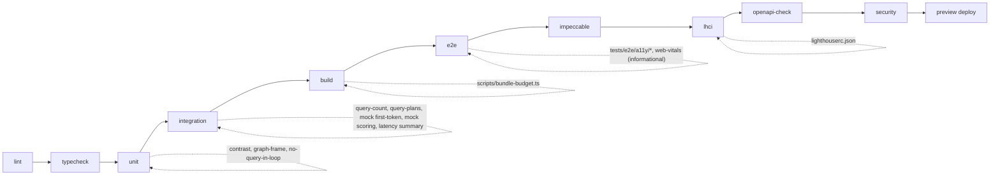

# 16 — Performance and Accessibility Budgets

**Purpose / Read this when:** you add a route, a dependency, a query, a font, a chart, or a screen and need the number it must stay under, the file that encodes that number, and the CI job that blocks the PR when it is exceeded. Every budget here is enforced by a named config file and workflow job; nothing in this file is aspirational.

**Requirements covered:** NFR-006, NFR-008, NFR-010, NFR-013, NFR-014, NFR-001, NFR-002, NFR-003, FR-004, FR-136, FR-210, FR-211, FR-212, FR-213, FR-214, SYS-018, INT-006, INT-011; axe coverage for UI-001 to UI-011, UI-020 to UI-035, UI-040 to UI-044, UI-050, UI-060. Applies D-013, D-020, D-025, D-026, D-038, D-042, D-043, D-044, D-074, D-084, D-098.

## 1. Budget register

| # | Budget | Target | Scope | Measured by | Enforced in (job, file) | Blocks PR |
|---|---|---|---|---|---|---|
| B1 | LCP | ≤ 2,500 ms | sign-in, run workspace, debrief, replay | Lighthouse CI (lab, public pages and gallery); Sentry Web Vitals (field, all pages) | `lhci` job, `lighthouserc.json`; Sentry alert | yes (lab) |
| B2 | INP | ≤ 200 ms | same | Sentry Web Vitals (field); Lighthouse `interactive` ≤ 3,500 ms as the lab proxy | `lhci` job; Sentry alert | yes (lab proxy) |
| B3 | CLS | ≤ 0.1 | same | Lighthouse CI; Sentry Web Vitals | `lhci` job | yes |
| B4 | JavaScript a run route adds to the framework floor | ≤ 130,000 bytes gzip | every route under `/runs/[runId]/` plus `/review/runs/[runId]` and `/records/[runId]` | `scripts/bundle-budget.ts` over `.next` manifests | `build` job | yes |
| B5 | JavaScript a public page adds to the framework floor | ≤ 110,000 bytes gzip | `(public)` routes | `scripts/bundle-budget.ts`; LHCI `resource-summary:script:size` | `build` job; `lhci` job | yes |
| B6 | Total transfer per page | ≤ 900,000 bytes | LHCI URLs | LHCI `resource-summary:total:size` | `lhci` job | yes |
| B7 | Lighthouse categories | accessibility ≥ 0.95, performance ≥ 0.85, best-practices ≥ 0.95 | LHCI URLs | LHCI | `lhci` job | yes |
| B8 | p95 read latency | ≤ 400 ms | GET `/api/v1/*`, RSC page renders | Sentry transactions; integration latency summary (informational); k6 | Sentry alert; Phase 15 load test | no (production signal) |
| B9 | p95 write latency | ≤ 800 ms | POST/PATCH/DELETE `/api/v1/*`, Server Actions | same | same | no |
| B10 | Delegation first token | ≤ 3,000 ms real, ≤ 300 ms mock | `POST /api/v1/runs/{runId}/delegations` | Sentry span `llm.first_token`; integration test on mock | `integration` job (mock only) | yes (mock) |
| B11 | Scoring job | p95 ≤ 3 min real, ≤ 5 s mock; alert at 8 min | `score_run` | `llm_calls.latency_ms`, job duration log; Sentry alert | `integration` job (mock only) | yes (mock) |
| B12 | Run read query count | ≤ 4 queries | `getRunWorkspace`, `getReplay`, `getDebrief`, `getRecord` | `tests/integration/perf/query-count.test.ts` | `integration` job | yes |
| B13 | Run-scoped query plans | no Seq Scan on `run_events`, `run_claims` at 10k rows | repository queries listed in §5.5 | `tests/integration/perf/query-plans.test.ts` | `integration` job | yes |
| B14 | axe violations | zero serious or critical, tags through WCAG 2.2 AA | every UI-### screen | `@axe-core/playwright` 4.13.0 | `e2e` job, `tests/e2e/a11y/*` | yes |
| B15 | Keyboard-only run | full run start to debrief without pointer events | student path | `tests/e2e/a11y/keyboard-only-run.spec.ts` | `e2e` job | yes |
| B16 | Contrast | text ≥ 4.5:1, UI components ≥ 3:1 | D-025 palette | `tests/unit/design/contrast.test.ts` | `unit` job | yes |
| B17 | Concurrency | 60 students, p95 within B8/B9 | one section | k6 `scripts/load/run-loop.js` | Phase 15 release step | release gate |

Vercel Speed Insights is not used: no `@vercel/speed-insights` dependency, no `<SpeedInsights />` component. Field Web Vitals come from Sentry (`@sentry/nextjs` 10.73.0 `browserTracingIntegration`, which reports LCP, CLS, and INP on pageload transactions) and lab values from Lighthouse CI.

## 2. Core Web Vitals

### 2.1 Targets per page

| Page | Route | LCP | INP | CLS | LCP element (by design) | Lab | Field |
|---|---|---|---|---|---|---|---|
| Sign-in (UI-001) | `/sign-in` | ≤ 2.5 s | ≤ 200 ms | ≤ 0.1 | `h1` in IBM Plex Serif, server-rendered | LHCI | Sentry |
| Run workspace (UI-023) | `/runs/[runId]/work` | ≤ 2.5 s | ≤ 200 ms | ≤ 0.1 | brief `article` first paragraph | Playwright informational (§2.4); gallery proxy in LHCI | Sentry |
| Debrief (UI-028) | `/runs/[runId]/debrief` | ≤ 2.5 s | ≤ 200 ms | ≤ 0.1 | `h1` plus frame-beside-decision text columns (server-rendered) | Playwright informational | Sentry |
| Faculty replay (UI-033) | `/review/runs/[runId]` | ≤ 2.5 s | ≤ 200 ms | ≤ 0.1 | `h1` plus trace table first rows | Playwright informational | Sentry |
| Every other page | all | ≤ 2.5 s | ≤ 200 ms | ≤ 0.1 | `h1` | LHCI for public pages and `/dev/components` | Sentry |

Lab conditions: Lighthouse `desktop` preset (the run is a desktop task; NFR-010 mobile browsers are covered functionally by the Playwright `webkit` project, not by CWV assertions). Field conditions: real sessions sampled at `SENTRY_TRACES_SAMPLE_RATE` (1.0 local and preview, 0.1 production).

### 2.2 LCP rules

- The LCP candidate on every page is server-rendered text: the `h1` or the first `article` paragraph. Nothing above the fold is rendered with `ssr: false`; the only `ssr: false` components are the four graphs (§3.3), which sit below the page `h1` and reserve their height.
- IBM Plex Sans is preloaded (§6.3); Serif and Mono are not. With `display: 'swap'` and `adjustFontFallback`, text paints in the fallback within the first frame and swaps without shift.
- No render-blocking third-party scripts. `posthog-js` and Sentry initialize in `src/instrumentation-client.ts` after hydration; both are no-ops when their keys are empty (D-098).
- RSC pages fetch through services with the ≤ 4 query rule (§5.4); a run page's server time budget is 300 ms p95 (inside B8).

### 2.3 INP rules

- Stance controls, "mark used", and document open/close use `useOptimistic`; the handler updates local state within one frame and the Server Action result reconciles.
- The clock is one `setInterval` at 1,000 ms updating a single text node inside a memoized `Clock` component (`src/components/features/run/clock.tsx`); ticks never re-render the workspace tree.
- Assistant streaming renders at most one update per 50 ms (the `useChat` throttle option in `@ai-sdk/react` 4.0.94); segments append to a list, never re-parse the transcript.
- The 5 s run poll (§7.4) applies its result inside `startTransition`.
- Recharts renders with `isAnimationActive={false}` on every series; there are no chart animations anywhere.
- No long task over 50 ms on route entry: graphs load through `next/dynamic` after the route paints; scoring payloads are pre-shaped on the server (`run_scores.graphs`).

### 2.4 CLS rules

- Every async region reserves its final height: `loading.tsx` skeletons match the layout they replace; `GraphFrame` reserves `height` (default 320 px) before the chart mounts; the assistant panel and claims panel have `min-height` set in the run layout.
- Fonts: `adjustFontFallback: 'Arial'` (Sans) and `'Times New Roman'` (Serif) generate size-adjusted fallbacks so the swap does not move text. Mono uses `adjustFontFallback: false` and is used only inside fixed-width table cells and the clock.
- Toasts (`sonner` 2.0.8), the live region, and the Paused overlay are `position: fixed` and never push content.
- No raster images anywhere (§6.1), so no unsized media.

Authenticated-page lab values: `tests/e2e/perf/web-vitals.spec.ts` signs in as `student1@tassl.local`, starts the walkthrough run, injects a `PerformanceObserver` for `largest-contentful-paint` and `layout-shift` with `page.addInitScript`, visits `/runs/[runId]/work`, `/runs/[runId]/debrief` (after the mock scoring job), and `/review/runs/[runId]` as `instructor@tassl.local`, and writes `test-results/web-vitals.json` (`{ url, lcpMs, cls }[]`). It prints a warning line when a value exceeds §2.1 and never fails: CI runner timing is too noisy to block on, and the field numbers in Sentry are authoritative for these pages.

## 3. Bundle-size budget (NFR-013)

### 3.1 Numbers

**The framework floor (D-187).** React 19 and the Next 16 App Router client runtime are charged to every route and no screen can trade against them: measured 130,897 bytes gzip on 2026-09-04, so a page with no client component of ours (`/`, `/_not-found`) totals 167,244. `scripts/bundle-budget.ts` therefore asserts the floor once (≤ 175,000) and then judges each route on what it adds. A framework upgrade fails one line instead of every route, and the per-route number stays a ceiling on the code we write.

| Route group | Budget (gzip JavaScript the route adds to the floor) | Includes |
|---|---|---|
| Run routes: `/runs/[runId]/{start,readiness,readiness/result,work,locked,turn,defense,debrief}`, `/runs/[runId]`, `/review/runs/[runId]`, `/records/[runId]` | ≤ 250,000 bytes | root main files + `(app)` layout + run layout + page chunks |
| Public pages: `/sign-in`, `/sign-up`, `/verify-email`, `/forgot-password`, `/reset-password`, `/privacy`, `/terms` | ≤ 110,000 bytes (measured max 103,058) | root main files + `(public)` layout + page chunks |
| Every other route | ≤ 175,000 bytes (measured max 170,303, `/settings/security`) | root main files + ancestor layouts + page chunks |

"gzip" means `zlib.gzipSync(level 6)` of the emitted chunk files, which is at or above what Vercel serves (Vercel uses Brotli when the client accepts it). The `polyfills` chunk is excluded (it is loaded with `nomodule` and never executed by the supported browsers of NFR-010).

### 3.2 Rules that keep routes under budget

- `recharts` 3.10.1 is imported only from `src/components/graphs/*` and only through `next/dynamic` (§3.3). It never appears in a layout, in `src/components/ui`, or in the run workspace. Routes that load it: `/runs/[runId]/debrief`, `/review/runs/[runId]`, `/records/[runId]`, `/review` (illustrative sample), `/dev/components`.
- Client components build their schemas with `zod/mini`, importing named builders (`object`, `string`, `email`, `minLength`, `maxLength`, `trim`, `refine`); never `import { z } from 'zod'`, whose namespace object drags `toJSONSchema`, the locale table and every schema class into the page (94 KB gzip; D-184). `zodResolver` accepts a mini schema unchanged. Server modules keep classic Zod, so a client component that imports a module `schema.ts` still pays for it — `src/server/modules/identity/schema.ts` is why `/settings` carries 67,271 bytes of it.
- `better-auth/react` is reached only through the facade in `src/lib/auth-client.ts`, which imports it dynamically on the first call (D-185). No client component imports `better-auth/*` directly, so the client (11,883 bytes gzip) stays out of every route's entry chunks.
- Icons: `lucide-react` 1.39.0 imported per icon (`import { Lock } from 'lucide-react'`); never `import * as icons`. Next.js applies `optimizePackageImports` to `lucide-react` and `recharts` by default, and the per-icon import keeps the graph the same under Turbopack.
- `date-fns` 4.4.0 imported per function (`import { formatDistanceStrict } from 'date-fns'`).
- No Markdown, syntax-highlighting, rich-text, or PDF libraries: every student text field is a plain `textarea` (FR-103) and every document is plain text.
- `@ai-sdk/react` is imported only by the assistant panel (`src/components/features/assistant/*`), which is loaded by the `work` and `turn` pages only.
- `posthog-js` and `@sentry/nextjs` client code load from `src/instrumentation-client.ts` (counted in the root main files; the two together must stay under 90,000 bytes gzip, verified by the same script as part of every route's total).
- No client component imports `src/server/*` (boundaries lint, `04-repo-structure.md` §2), so server-only libraries never reach a bundle.

### 3.3 Graph loading contract

`src/components/graphs/index.ts` is the only module that imports the chart implementations:

```ts
import dynamic from 'next/dynamic'
import { GraphSkeleton } from './graph-skeleton'

const loading = () => <GraphSkeleton />

export const ConfidenceLine = dynamic(() => import('./confidence-line').then((m) => m.ConfidenceLine), { ssr: false, loading })
export const ClockTimeline = dynamic(() => import('./clock-timeline').then((m) => m.ClockTimeline), { ssr: false, loading })
export const StanceMatrix = dynamic(() => import('./stance-matrix').then((m) => m.StanceMatrix), { ssr: false, loading })
export const FrameBesideDecision = dynamic(() => import('./frame-beside-decision').then((m) => m.FrameBesideDecision), { ssr: false, loading })
export { GraphFrame } from './graph-frame'
```

`GraphFrame` (§9) is a regular client component and is server-rendered, so the description and the data table are in the initial HTML; only the `recharts` SVG arrives in the deferred chunk. `GraphSkeleton` renders a box of the same `height` so the swap causes no layout shift.

### 3.4 `scripts/bundle-budget.ts`

Runs in the `build` job after `pnpm build` (`pnpm exec tsx scripts/bundle-budget.ts`). It reads the manifests Turbopack writes for the App Router (`.next/build-manifest.json` for the shared runtime chunks, each route's `page_client-reference-manifest.js` for the chunks of its layouts, page, and client components; D-148) and sums gzip sizes per route.

```ts
// scripts/bundle-budget.ts — docs/tech/16-performance-a11y-budgets.md §3.4 (B4, B5).
// Runs in the CI build job after `pnpm build`; sums gzip bytes of the JS each route loads.
// Turbopack (Next 16) writes no root app-build-manifest.json (D-148): the shared runtime chunks
// are `rootMainFiles` in .next/build-manifest.json and each route's client chunks (layouts above
// it, the page, its client components) are `entryJSFiles` in the route's
// .next/server/app/<route>/page_client-reference-manifest.js.
import { existsSync, readFileSync } from 'node:fs'
import { join } from 'node:path'
import vm from 'node:vm'
import { gzipSync } from 'node:zlib'

const NEXT = join(process.cwd(), '.next')
const budgets: Array<{ pattern: RegExp; maxBytes: number; label: string }> = [
  { pattern: /^\/\(app\)\/runs\/\[runId\](\/|$)/, maxBytes: 250_000, label: 'run route' },
  { pattern: /^\/\(app\)\/review\/runs\/\[runId\]$/, maxBytes: 250_000, label: 'run route' },
  { pattern: /^\/\(app\)\/records\/\[runId\]$/, maxBytes: 250_000, label: 'run route' },
  { pattern: /^\/\(public\)\//, maxBytes: 180_000, label: 'public page' },
  // The gallery renders every primitive at once; 300 KB here and in lighthouserc.json (D-156).
  { pattern: /^\/dev\//, maxBytes: 300_000, label: 'dev gallery' },
  { pattern: /.*/, maxBytes: 175_000, label: 'other route' },
]

type RscManifest = Record<string, { entryJSFiles?: Record<string, string[]> }>

const routes = JSON.parse(
  readFileSync(join(NEXT, 'app-path-routes-manifest.json'), 'utf8'),
) as Record<string, string>
const buildManifest = JSON.parse(readFileSync(join(NEXT, 'build-manifest.json'), 'utf8')) as {
  rootMainFiles?: string[]
}

const cache = new Map<string, number>()
const gzipBytes = (file: string): number => {
  const hit = cache.get(file)
  if (hit !== undefined) return hit
  const bytes = gzipSync(readFileSync(join(NEXT, file)), { level: 6 }).length
  cache.set(file, bytes)
  return bytes
}

/** Client chunks of one route from its client-reference manifest (a JS file assigning globalThis.__RSC_MANIFEST). */
function routeEntryFiles(pageKey: string): string[] | undefined {
  const segments = pageKey.split('/').filter(Boolean)
  const file = join(
    NEXT,
    'server',
    'app',
    ...segments.slice(0, -1),
    'page_client-reference-manifest.js',
  )
  if (!existsSync(file)) return undefined
  const sandbox: Record<string, unknown> = {}
  sandbox.globalThis = sandbox
  vm.runInNewContext(readFileSync(file, 'utf8'), sandbox)
  const manifest = sandbox.__RSC_MANIFEST as RscManifest | undefined
  const entry = manifest?.[pageKey] ?? Object.values(manifest ?? {})[0]
  return Object.values(entry?.entryJSFiles ?? {}).flat()
}

let failed = false
for (const pageKey of Object.keys(routes)
  .filter((k) => k.endsWith('/page'))
  .sort()) {
  const route = pageKey.slice(0, -'/page'.length) || '/'
  const entryFiles = routeEntryFiles(pageKey)
  if (!entryFiles) {
    if (route.startsWith('/_')) continue // Next's built-in error routes have no manifest of their own
    console.error(`no client-reference manifest for ${route}`)
    failed = true
    continue
  }
  const files = new Set<string>([...(buildManifest.rootMainFiles ?? []), ...entryFiles])
  const js = [...files].filter((f) => f.endsWith('.js') && !f.includes('polyfills'))
  const bytes = js.reduce((sum, f) => sum + gzipBytes(f), 0)
  const budget = budgets.find((b) => b.pattern.test(route))!
  const ok = bytes <= budget.maxBytes
  if (!ok) failed = true
  console.log(
    `${ok ? 'ok  ' : 'FAIL'} ${String(bytes).padStart(7)} / ${budget.maxBytes} ${budget.label.padEnd(12)} ${route}`,
  )
}
if (failed) {
  console.error('bundle budget exceeded (docs/tech/16-performance-a11y-budgets.md §3)')
  process.exit(1)
}
```

Route keys in `app-path-routes-manifest.json` keep route groups, so a run page appears as `/(app)/runs/[runId]/work/page`; its client-reference manifest lists the chunks of every layout above it and of the page itself, so no ancestor walk is needed. The script's output table is pasted into the job summary (`$GITHUB_STEP_SUMMARY`) by the workflow step.

### 3.5 `lighthouserc.json` (verbatim)

`@lhci/cli` 0.15.1 pins Lighthouse 12.6.1, which removed `budgets.json` (Lighthouse 12.0.0, "remove budgets"). The same numbers are therefore expressed as LHCI assertions on the `resource-summary` audit (still present in 12.6.1) and on the metric audits. `assertMatrix` entries are mutually exclusive by URL pattern.

```json
{
  "ci": {
    "collect": {
      "startServerCommand": "pnpm start",
      "startServerReadyPattern": "Ready in",
      "startServerReadyTimeout": 60000,
      "url": [
        "http://localhost:3000/sign-in",
        "http://localhost:3000/sign-up",
        "http://localhost:3000/privacy",
        "http://localhost:3000/terms",
        "http://localhost:3000/dev/components"
      ],
      "numberOfRuns": 3,
      "settings": {
        "preset": "desktop",
        "chromeFlags": "--no-sandbox --disable-dev-shm-usage"
      }
    },
    "assert": {
      "assertMatrix": [
        {
          "matchingUrlPattern": "/(sign-in|sign-up|privacy|terms)$",
          "assertions": {
            "categories:performance": ["error", { "minScore": 0.85, "aggregationMethod": "median" }],
            "categories:accessibility": ["error", { "minScore": 0.95, "aggregationMethod": "pessimistic" }],
            "categories:best-practices": ["error", { "minScore": 0.95, "aggregationMethod": "pessimistic" }],
            "largest-contentful-paint": ["error", { "maxNumericValue": 2500, "aggregationMethod": "median" }],
            "interactive": ["error", { "maxNumericValue": 3500, "aggregationMethod": "median" }],
            "cumulative-layout-shift": ["error", { "maxNumericValue": 0.1, "aggregationMethod": "median" }],
            "resource-summary:script:size": ["error", { "maxNumericValue": 180000, "aggregationMethod": "pessimistic" }],
            "resource-summary:total:size": ["error", { "maxNumericValue": 900000, "aggregationMethod": "pessimistic" }]
          }
        },
        {
          "matchingUrlPattern": "/dev/components$",
          "assertions": {
            "categories:performance": ["error", { "minScore": 0.85, "aggregationMethod": "median" }],
            "categories:accessibility": ["error", { "minScore": 0.95, "aggregationMethod": "pessimistic" }],
            "categories:best-practices": ["error", { "minScore": 0.95, "aggregationMethod": "pessimistic" }],
            "largest-contentful-paint": ["error", { "maxNumericValue": 2500, "aggregationMethod": "median" }],
            "interactive": ["error", { "maxNumericValue": 3500, "aggregationMethod": "median" }],
            "cumulative-layout-shift": ["error", { "maxNumericValue": 0.1, "aggregationMethod": "median" }],
            "resource-summary:script:size": ["error", { "maxNumericValue": 250000, "aggregationMethod": "pessimistic" }],
            "resource-summary:total:size": ["error", { "maxNumericValue": 900000, "aggregationMethod": "pessimistic" }]
          }
        }
      ]
    },
    "upload": { "target": "temporary-public-storage" }
  }
}
```

Why these URLs: they are deterministic without a session. `/dev/components` (UI-060) renders every run-workspace component, every claim-card state, and all four graphs on fixture data, so its script size is the lab proxy for the run routes; the gallery route answers when `APP_ENV` is `local` or `test` and returns 404 in `preview` and `production` (this file's decision, §11, extending the `local`-only rule in `02-architecture.md` §4 to CI). `resource-summary:*:size` is transfer size; `next start` gzips responses (`compress: true`, the default), so the number is comparable to §3.1. The gallery entry is asserted at 300 KB of script because it renders every primitive on one page; the 250 KB run-route budget is enforced on the real routes by `scripts/bundle-budget.ts` (D-156).

## 4. API latency (NFR-008, NFR-001, NFR-014)

### 4.1 Targets by route group

| Group | Members | p95 target | Excludes |
|---|---|---|---|
| read | every `GET /api/v1/*`; every RSC page render (`transaction.op = http.server`, `GET /runs/[runId]/work` and the rest) | 400 ms | nothing |
| read, conditional | `GET /api/v1/runs/{runId}` answered 304 (§7.4) | 150 ms | nothing |
| write | every `POST`, `PATCH`, `DELETE` under `/api/v1/*`; every Server Action (`transaction.op = function.server_action`) | 800 ms | time inside LLM calls |
| stream | `POST /api/v1/runs/{runId}/delegations` | first token ≤ 3,000 ms real provider, ≤ 300 ms mock; full reply bounded by `LLM_TIMEOUT_MS` (60,000) | nothing |
| job: scoring | `score_run` (enqueue to `runs.scored_at`) | ≤ 3 min real, ≤ 5 s mock; alert at 8 min; hard stop 300 s per drain invocation (D-038) | nothing |
| job: generation | `generate:<versionId>:<step>` | no p95 target (LLM-bound); each step bounded by `maxDuration = 300` (D-038) | nothing |
| auth | `/api/auth/*` (Better Auth) | 800 ms (scrypt hashing dominates) | nothing |

### 4.2 How latency is measured

**Sentry transactions (production and preview, authoritative).** `@sentry/nextjs` names server transactions by route pattern (`GET /api/v1/runs/[runId]`, `POST /api/v1/runs/[runId]/lock`, `GET /runs/[runId]/work`). `defineRoute` and `defineAction` (`src/server/http/`) add tags `route_group` (`read`, `write`, `stream`, `auth`) and `run_state`, and every service call runs inside `Sentry.startSpan({ op: 'service', name: '<module>.<fn>' })`. The database client (`src/server/db/client.ts`) wraps each query in `Sentry.startSpan({ op: 'db.query', name: <first 80 chars of SQL> })` when `SENTRY_TRACES_SAMPLE_RATE` > 0. The delegation stream records a `llm.first_token` span from request start to the first streamed chunk. Alerts (Sentry → Alerts → Create Alert → Performance metric, transaction duration, p95): `route_group:read` > 400 ms for 10 minutes; `route_group:write` > 800 ms for 10 minutes; `llm.first_token` p95 > 3,000 ms for 15 minutes; `score_run` duration > 8 minutes once (NFR-001). The Sentry project slug is `SENTRY_PROJECT` (`tassl`); the DSN is `NEXT_PUBLIC_SENTRY_DSN` (Sentry → Project → Settings → Client Keys (DSN)); nothing here needs a new variable.

**Integration latency summary (CI, informational).** `tests/setup/integration.ts` installs an `afterEach` hook that reads the durations recorded by the HTTP test helper (`tests/setup/http.ts` measures each `fetch` to a route handler) and, in `afterAll`, writes `test-results/latency-summary.json`:

```json
{ "generatedAt": "2026-09-02T09:00:00.000Z", "entries": [ { "route": "GET /api/v1/runs/[runId]", "group": "read", "samples": 41, "p50Ms": 38, "p95Ms": 92 } ] }
```

The `integration` job appends the table to `$GITHUB_STEP_SUMMARY` and uploads the file with `actions/upload-artifact@v7` (name `latency-summary`, retention 14 days). It never fails the job: CI Postgres in a service container is not production, and the table exists to catch order-of-magnitude regressions by eye during review. Two mock-provider numbers are asserted, not just reported: `tests/integration/assistant/delegate.test.ts` asserts first token ≤ 300 ms, and `tests/integration/scoring/score-run.test.ts` asserts the job completes ≤ 5 s.

**Structured logs.** Every request log line carries `durationMs` (`02-architecture.md` §5), so Vercel log search (`durationMs>400 route_group=read`) works without Sentry.

**Load test (NFR-014).** `scripts/load/run-loop.js` (k6, D-102) drives 60 virtual students through readiness, framing, delegation on mock, stances, lock, Turn, and defense against a preview deployment seeded for the test, with thresholds `http_req_duration{group:read}: p(95)<400` and `http_req_duration{group:write}: p(95)<800`; run once in Phase 15 and recorded in the release notes.

## 5. Database query rules

### 5.1 No N+1

- A repository function never runs a query inside a loop. Child rows are fetched by `inArray(table.parentId, ids)` in one statement or through Drizzle relational queries with `with` (`db.query.runs.findFirst({ where: eq(runs.id, runId), with: { frame: true, brief: true, turnResponse: true, addendum: true, readinessResult: true } })`), which Drizzle compiles to one statement with lateral joins.
- Services compose repositories; a service that needs claims for a list of runs calls `listRunClaimsByRunIds(tenantId, runIds)` once and groups in memory.
- Review by grep: `tests/unit/lint/no-query-in-loop.test.ts` parses every `repository.ts` and fails when `db.` appears inside a `for`, `while`, `.map(`, or `.forEach(` body.

### 5.2 Pagination everywhere (D-020)

Every list endpoint and every list Server Action takes `{ cursor?: string; limit?: number }` validated by `PaginationSchema` in `src/server/http/pagination.ts` (limit default 20, max 100) and returns `{ items, nextCursor }`. The cursor is `base64url(JSON.stringify([created_at ISO, id]))`; the query orders by `(created_at desc, id desc)` and applies `WHERE (created_at, id) < ($1, $2)`. There is no offset pagination and no unbounded `SELECT`. Run-scoped collections (`run_events`, `run_claims`) are not paginated because they are bounded per run by the clock and the package (at most a few hundred events, at most the package's claim count); they are read whole (§5.4).

### 5.3 Index per list query

Every list endpoint reads through an index named in `06-data-model.md`:

| List | Table | Index (`06-data-model.md`) |
|---|---|---|
| My runs (`GET /api/v1/runs`, `/runs`) | `runs` | `(student_id, state)` |
| Assignment runs (`GET /api/v1/assignments/{id}/runs`) | `runs` | `(assignment_id)` |
| Held runs (replay queue) | `runs` | `(state, scoring_status) where scoring_status = 'held'` |
| Courses (`GET /api/v1/courses`) | `courses` | `(organization_id) where deleted_at is null` |
| Sections of a course | `sections` | `(course_id)` |
| Roster | `section_memberships` | `(section_id, role)` |
| My sections and courses | `section_memberships` | `(user_id)` |
| Assignments of a section | `assignments` | `(section_id) where deleted_at is null` |
| Assignments on a version | `assignments` | `(package_version_id)` |
| Packages (`GET /api/v1/packages`) | `scenario_packages` | unique `(organization_id, family_key)` |
| Versions of a package | `scenario_package_versions` | `(package_id, status)` |
| Documents, claims of a version | `scenario_documents`, `scenario_claims` | `(package_version_id, position)` |
| Question bank by kind | `defense_questions` | `(package_version_id, kind)` |
| Confirmation measures | `element_confirmations` | `(package_version_id, decision)` |
| Generation status | `generation_runs` | `(package_version_id, step, pass_number)` |
| Trace (`GET /api/v1/runs/{id}/events`) | `run_events` | unique `(run_id, seq)`; `(run_id, type)` for graph builders |
| Claims panel | `run_claims` | unique `(run_id, claim_id)` |
| Lock gate | `run_claims` | `(run_id) where stance is null` |
| Document opens (clock timeline) | `run_document_opens` | `(run_id, opened_at)` |
| Actions on a claim | `run_actions` | `(run_id, claim_id)` |
| Escalation limit | `run_escalations` | `(run_id) where counts_against_limit` |
| Notifications (`GET /api/v1/notifications`) | `notifications` | `(user_id, read_at)` |
| Audit log (`/admin/audit`) | `audit_logs` | `(organization_id, created_at desc)`, `(actor_id, created_at desc)` |
| Sessions (`/settings/security`) | `session` | `session_user_id_idx` |
| Invitations | `invitation` | `(organization_id, status)` |
| LLM budgets | `llm_calls` | `(user_id, created_at)`, `(created_at)` |
| Export history | `course_exports` | unique `(run_id, version)` |

Adding a list endpoint without a row here and an index in `06-data-model.md` is a PR review failure (the PR template asks for both).

### 5.4 Whole-run reads in ≤ 4 queries

`getRunWorkspace`, `getReplay`, `getDebrief`, and `getRecord` load a run with exactly these statements, in this order, inside one read transaction:

| # | Statement | Serves |
|---|---|---|
| 1 | `runs` row with its 1:1 tables through relational `with`: `run_frames`, `run_briefs`, `run_addenda`, `run_turn_responses`, `run_readiness_results`, plus the `assignments` row (weight, clock, walkthrough flag) | header, clock anchors (D-042), lock state, timers to materialize (D-043, D-044) |
| 2 | `run_events where run_id = $1 order by seq` | delegation log, actions, escalations, document opens, defense transcript, graph builders, replay trace |
| 3 | `run_claims join scenario_claims` (reviewer views also join `variant_claim_states`) `where run_id = $1` | claims panel, stance matrix rows, lock gate display |
| 4 | `scenario_package_versions.snapshot where id = $1` (the confirmed jsonb snapshot: brief, documents, named fields, turn, question bank, counterfactual) | brief, Evidence Room, named fields, Turn text, per-claim rationale |

Read models such as `run_delegations`, `run_actions`, and `run_document_opens` exist for write-path checks (escalation limit, lock gate, duplicate open) and targeted queries; page reads derive those lists from the events in statement 2 (FR-007 guarantees every mutation is in the trace). When `materializeTimers` must append events (Turn delivery, auto-lock), the writes happen in the same transaction and do not count against the four reads.

`tests/integration/perf/query-count.test.ts` enables the postgres-js `debug` hook that `src/server/db/client.ts` exposes as `withQueryCounter(fn)` when `APP_ENV = 'test'`, calls each of the four service functions on a fixture run in state `working`, `scored`, and `recorded`, and asserts `count <= 4` (SELECT statements only; `BEGIN`/`COMMIT` excluded).

### 5.5 EXPLAIN ANALYZE gate

`tests/integration/perf/query-plans.test.ts` seeds 10,000 `run_events` rows (100 runs × 100 events) and 10,000 `run_claims` rows (1,250 runs × 8 claims) through `tests/factories/perf.ts`, runs `ANALYZE` so the planner has statistics, and asserts that no run-scoped query plans a sequential scan on either table:

```ts
import { beforeAll, describe, expect, it } from 'vitest'
import { sql } from 'drizzle-orm'
import { db } from '@/server/db/client'
import { seedRunsForPlans } from '@tests/factories/perf'

type PlanNode = { 'Node Type': string; 'Relation Name'?: string; Plans?: PlanNode[] }
const seqScans = (node: PlanNode, relations: string[]): string[] => [
  ...(node['Node Type'] === 'Seq Scan' && relations.includes(node['Relation Name'] ?? '') ? [node['Relation Name']!] : []),
  ...(node.Plans ?? []).flatMap((child) => seqScans(child, relations)),
]

describe('run-scoped query plans (NFR-008, NFR-014)', () => {
  let runId: string
  beforeAll(async () => {
    runId = await seedRunsForPlans({ eventRuns: 100, eventsPerRun: 100, claimRuns: 1250, claimsPerRun: 8 })
    await db.execute(sql`ANALYZE run_events`)
    await db.execute(sql`ANALYZE run_claims`)
  })

  const cases: Array<[string, () => ReturnType<typeof sql>]> = [
    ['events by run ordered by seq', () => sql`SELECT * FROM run_events WHERE run_id = ${runId} ORDER BY seq`],
    ['events by run and type', () => sql`SELECT * FROM run_events WHERE run_id = ${runId} AND type IN ('stance_set', 'claim_used')`],
    ['claims by run', () => sql`SELECT * FROM run_claims WHERE run_id = ${runId}`],
    ['unstanced claims (lock gate)', () => sql`SELECT * FROM run_claims WHERE run_id = ${runId} AND stance IS NULL`],
    ['next seq allocation', () => sql`SELECT max(seq) FROM run_events WHERE run_id = ${runId}`],
  ]

  for (const [name, query] of cases) {
    it(`${name}: no Seq Scan on run_events or run_claims`, async () => {
      const rows = await db.execute(sql`EXPLAIN (ANALYZE, FORMAT JSON) ${query()}`)
      const plan = (rows[0] as { 'QUERY PLAN': Array<{ Plan: PlanNode }> })['QUERY PLAN'][0]!.Plan
      expect(seqScans(plan, ['run_events', 'run_claims'])).toEqual([])
    })
  }
})
```

The test runs in the `integration` project (`vitest.config.ts`, `fileParallelism: false`) against `TEST_DATABASE_URL`, after `pnpm db:migrate`, so the indexes under test are the migrated ones, not a fixture's.

## 6. Images and fonts

### 6.1 No raster images

- The app ships no PNG, JPEG, GIF, or WebP. Icons are SVG from `lucide-react` (tree-shaken per import). The favicon is `public/favicon.svg`. Email templates use text and inline SVG only.
- `next/image` is not used; `` is forbidden by `@next/next/no-img-element` (already in `eslint-config-next/core-web-vitals`).
- Scored content is text by requirement (FR-211, NFR-013): documents, brief, frame, claims, defense. Any future scenario chart must carry a data table and description (FR-212) and would use the same `GraphFrame` (§9).

### 6.2 Font files

Self-hosted in `public/fonts/` as woff2 under the SIL Open Font License 1.1 (the `LICENSE.txt` of each package, copied beside the fonts). The files are the same OFL binaries IBM publishes at https://github.com/IBM/plex/releases (release tags `@ibm/plex-sans@1.1.0`, `@ibm/plex-mono@2.5.0`, `@ibm/plex-serif@2.0.0`); the npm tarballs are used because their paths are stable and the command below is copy-paste from the repo root on macOS and Linux:

```bash
set -euo pipefail
mkdir -p public/fonts
work="$(mktemp -d)"
for spec in @ibm/plex-sans@1.1.0 @ibm/plex-mono@2.5.0 @ibm/plex-serif@2.0.0; do
  npm pack "$spec" --pack-destination "$work" --silent
done
for tgz in "$work"/*.tgz; do
  rm -rf "$work/x" && mkdir -p "$work/x" && tar -xzf "$tgz" -C "$work/x"
  for f in IBMPlexSans-Regular IBMPlexSans-Medium IBMPlexSans-SemiBold IBMPlexMono-Regular IBMPlexMono-Medium IBMPlexSerif-Medium IBMPlexSerif-SemiBold; do
    [ -f "$work/x/package/fonts/complete/woff2/$f.woff2" ] && cp "$work/x/package/fonts/complete/woff2/$f.woff2" public/fonts/
  done
  name="$(basename "$tgz" .tgz)"
  cp "$work/x/package/LICENSE.txt" "public/fonts/LICENSE-${name%-*}.txt"
done
rm -rf "$work"
ls -l public/fonts
```

Expected inventory (sizes from the packages, rounded):

| File | Weight | Use | Size | Preloaded |
|---|---|---|---|---|
| `public/fonts/IBMPlexSans-Regular.woff2` | 400 | body, controls | 63 KB | yes |
| `public/fonts/IBMPlexSans-Medium.woff2` | 500 | labels, buttons | 67 KB | yes |
| `public/fonts/IBMPlexSans-SemiBold.woff2` | 600 | section titles, emphasis | 67 KB | yes |
| `public/fonts/IBMPlexMono-Regular.woff2` | 400 | trace data, numbers, clock | 49 KB | no |
| `public/fonts/IBMPlexMono-Medium.woff2` | 500 | emphasized numbers | 50 KB | no |
| `public/fonts/IBMPlexSerif-Medium.woff2` | 500 | `h2`, `h3` | 73 KB | no |
| `public/fonts/IBMPlexSerif-SemiBold.woff2` | 600 | `h1` | 73 KB | no |
| `public/fonts/LICENSE-ibm-plex-sans.txt`, `LICENSE-ibm-plex-mono.txt`, `LICENSE-ibm-plex-serif.txt` | | OFL 1.1 notices | 4.5 KB each | |

No italic faces are shipped; emphasis is weight 600 (`<strong>`), and `<em>` is styled as weight 500 so the browser never synthesizes an oblique.

### 6.3 `src/app/fonts.ts` (verbatim)

```ts
import localFont from 'next/font/local'

export const plexSans = localFont({
  src: [
    { path: '../../public/fonts/IBMPlexSans-Regular.woff2', weight: '400', style: 'normal' },
    { path: '../../public/fonts/IBMPlexSans-Medium.woff2', weight: '500', style: 'normal' },
    { path: '../../public/fonts/IBMPlexSans-SemiBold.woff2', weight: '600', style: 'normal' },
  ],
  variable: '--font-plex-sans',
  display: 'swap',
  preload: true,
  fallback: ['system-ui', 'Segoe UI', 'Helvetica Neue', 'Arial', 'sans-serif'],
  adjustFontFallback: 'Arial',
})

export const plexMono = localFont({
  src: [
    { path: '../../public/fonts/IBMPlexMono-Regular.woff2', weight: '400', style: 'normal' },
    { path: '../../public/fonts/IBMPlexMono-Medium.woff2', weight: '500', style: 'normal' },
  ],
  variable: '--font-plex-mono',
  display: 'swap',
  preload: false,
  fallback: ['ui-monospace', 'SFMono-Regular', 'Menlo', 'Consolas', 'monospace'],
  adjustFontFallback: false,
  declarations: [{ prop: 'font-feature-settings', value: "'tnum' 1" }], // single quotes: Turbopack's font loader cannot carry double quotes (D-153)
})

export const plexSerif = localFont({
  src: [
    { path: '../../public/fonts/IBMPlexSerif-Medium.woff2', weight: '500', style: 'normal' },
    { path: '../../public/fonts/IBMPlexSerif-SemiBold.woff2', weight: '600', style: 'normal' },
  ],
  variable: '--font-plex-serif',
  display: 'swap',
  preload: false,
  fallback: ['Georgia', 'Times New Roman', 'serif'],
  adjustFontFallback: 'Times New Roman',
})
```

`src/app/layout.tsx` sets `<html lang="en-US" className={cn(plexSans.variable, plexMono.variable, plexSerif.variable)}>`. `src/app/globals.css` maps the variables into Tailwind 4 tokens and adds the tabular-figure utility as belt and braces for any element that inherits Mono:

```css
@theme inline {
  --font-sans: var(--font-plex-sans, 'IBM Plex Sans', sans-serif);
  --font-mono: var(--font-plex-mono, 'IBM Plex Mono', monospace);
  --font-serif: var(--font-plex-serif, 'IBM Plex Serif', serif);
}
.font-mono, .tabular { font-variant-numeric: tabular-nums; font-feature-settings: "tnum" 1; }
```

`next/font/local` copies each file into `/_next/static/media/<hash>.woff2` (immutable) and emits `<link rel="preload">` only for the Sans faces (`preload: true`). The originals in `public/fonts/` remain the source of truth and are served with the immutable header in §7.2 for the react-email preview (`pnpm email:dev`) and the component gallery's font specimen.

## 7. Caching strategy

### 7.1 By asset class

| Asset | Rendered or served | `Cache-Control` | Set by |
|---|---|---|---|
| `/_next/static/*` (hashed chunks, CSS, `next/font` copies) | Vercel CDN | `public, max-age=31536000, immutable` | Next.js default |
| `/fonts/*.woff2` | Vercel CDN from `public/` | `public, max-age=31536000, immutable` | `headers()` in `next.config.ts` (§7.2) |
| `/favicon.svg` | Vercel CDN | `public, max-age=86400` | `headers()` |
| Public pages: `/sign-in`, `/sign-up`, `/verify-email`, `/forgot-password`, `/reset-password`, `/privacy`, `/terms` | static, prerendered at build | Next.js default for static pages (CDN cached, revalidated on deploy) | no `dynamic` export in `(public)`; the signed-in redirect lives in `src/proxy.ts`, not in the page |
| Authenticated RSC pages under `(app)` | Node function, every request | `private, no-cache, no-store, max-age=0, must-revalidate` (Next.js default for dynamic pages) | `export const dynamic = 'force-dynamic'` in `src/app/(app)/layout.tsx` |
| `/dev/components` | dynamic (reads `APP_ENV`) | same as above | `dynamic = 'force-dynamic'` |
| `/api/v1/*` | Node function | `no-store` | `defineRoute` on every response plus the `headers()` rule |
| `/api/auth/*` | Better Auth handler | `no-store` | `headers()` rule |
| `/api/health`, `/api/ready` | Node function | `no-store` | `headers()` rule |
| Application data | none: no ISR, no `unstable_cache`, no `'use cache'`, no module-level memo across requests | | ESLint `no-restricted-imports` forbids `unstable_cache` and `cacheLife` from `next/cache`; `revalidatePath` after Server Actions is allowed (router cache only) |

Rationale: every run read is fresh by architecture (`02-architecture.md` §7, Caching: none at the data layer); the clock and the lazy timers (D-043, D-044) would be wrong under any server data cache.

### 7.2 `next.config.ts` headers (excerpt)

```ts
import type { NextConfig } from 'next'

const config: NextConfig = {
  reactStrictMode: true,
  poweredByHeader: false,
  compress: true,
  async headers() {
    return [
      { source: '/fonts/:path*', headers: [{ key: 'Cache-Control', value: 'public, max-age=31536000, immutable' }] },
      { source: '/favicon.svg', headers: [{ key: 'Cache-Control', value: 'public, max-age=86400' }] },
      { source: '/api/:path*', headers: [{ key: 'Cache-Control', value: 'no-store' }] },
    ]
  },
}

export default config
```

Security headers (CSP, HSTS, and the rest) are added to the same `headers()` array by `12-security.md`; the `withSentryConfig` wrapper is applied last (`13-observability-ops.md`).

### 7.3 Client-side caches

- Next.js Router Cache stays at its default (`staleTimes.dynamic = 0`), so navigating back to a run page re-renders it on the server.
- `revalidatePath('/runs/[runId]/work')` after each run Server Action refreshes the RSC payload (`02-architecture.md` §5.2).
- No `localStorage` caching of run data. The only persisted client state is the unlocked frame draft (FR-043, `sessionStorage`, cleared at frame lock) and the brief draft mirror (server is the source, FR-100).

### 7.4 The 5 s run poll: ETag and 304

The client polls `GET /api/v1/runs/{runId}` every 5 s while a clock or window is running (D-013). The run version is `runs.next_event_seq - 1`, the count of trace events, which changes on every mutation and on every lazy materialization because each writes at least one event (FR-007, D-043, D-044). No new column is needed.

```mermaid
sequenceDiagram
  participant C as useRunPoll (browser)
  participant R as GET /api/v1/runs/{runId}
  participant S as runs.service.getRun
  participant DB as Postgres
  C->>R: If-None-Match: "v41"
  R->>S: getRun(actor, runId)
  S->>DB: SELECT runs row (statement 1 of §5.4)
  S->>S: materializeTimers → may append turn_delivered / decision_locked
  alt version unchanged (41)
    R-->>C: 304, ETag "v41", X-Run-Version 41, Date, Cache-Control no-store
    C->>C: keep state; refresh clock offset from Date
  else version changed (42)
    S->>DB: statements 2 to 4 of §5.4
    R-->>C: 200 JSON view model, ETag "v42", X-Run-Version 42, Date
    C->>C: startTransition(replace state); refresh clock offset
  end
```

Rules:

- Server: `defineRoute` compares the request `If-None-Match` with `"v<version>"` after `materializeTimers` has run and before loading statements 2 to 4; a match returns `304` with `ETag`, `X-Run-Version`, `Date`, and `Cache-Control: no-store` and an empty body. Every 200 response carries the same three headers.
- Client (`src/components/features/run/use-run-poll.ts`): sends `If-None-Match` itself from the last seen `X-Run-Version` (the browser cache is bypassed by `no-store`, so the conditional request is application-level); on 304 keeps state; on 200 replaces state inside `startTransition`; after three consecutive network failures shows the "reconnecting" banner and keeps polling.
- Clock drift (NFR-003): the countdown is computed from server anchors (`working_started_at`, `total_paused_ms`, `credited_ms`, `charged_ms`, `turn_window_ends_at`) and `serverOffsetMs = Date.parse(responseDateHeader) - Date.now()`, refreshed on every 200 and 304. The `Date` header has 1 s resolution and the poll period is 5 s, so displayed drift stays ≤ 1 s.
- Payload: a 200 body is the student or reviewer view model (≤ 30 KB for a fixture run); a 304 is 0 bytes. At 60 concurrent students the poll is 12 requests per second, nearly all 304, each costing one indexed row read (B8 conditional target 150 ms).

## 8. Accessibility (NFR-006, FR-210, FR-211, FR-213, FR-214)

Target: WCAG 2.2 AA on every screen, with the run screens and the faculty replay as the walkthrough's acceptance surface (PRD §7.20, §12 step 17).

### 8.1 `tests/e2e/a11y/axe.ts` (verbatim)

```ts
import AxeBuilder from '@axe-core/playwright'
import { expect, type Page, type TestInfo } from '@playwright/test'

export const AXE_TAGS = ['wcag2a', 'wcag2aa', 'wcag21a', 'wcag21aa', 'wcag22aa'] as const
export const FAILING_IMPACTS: readonly string[] = ['serious', 'critical']

export type AxeScope = { include?: string[]; exclude?: string[] }

/**
 * Runs axe on the current page state. Fails on serious and critical violations.
 * No rule is disabled anywhere in the suite; minor and moderate findings are attached to the report.
 */
export async function expectNoAxeViolations(page: Page, testInfo: TestInfo, scope: AxeScope = {}) {
  let builder = new AxeBuilder({ page }).withTags([...AXE_TAGS])
  for (const selector of scope.include ?? []) builder = builder.include(selector)
  for (const selector of scope.exclude ?? []) builder = builder.exclude(selector)
  const results = await builder.analyze()

  const summary = results.violations.map((v) => ({
    id: v.id,
    impact: v.impact ?? 'unknown',
    help: v.helpUrl,
    nodes: v.nodes.map((n) => n.target.join(' ')),
  }))
  await testInfo.attach('axe-violations.json', { body: JSON.stringify(summary, null, 2), contentType: 'application/json' })

  const failing = summary.filter((v) => FAILING_IMPACTS.includes(v.impact))
  expect(failing, JSON.stringify(failing, null, 2)).toEqual([])
  return results
}
```

`disableRules` is never called. `exclude` is used only for third-party-rendered regions that are not part of the app (none in the build; the parameter exists so a future embed cannot be silently excluded without a diff).

### 8.2 One axe test per screen

Each `test()` is named by its UI id, signs in with the seat the screen needs (D-040 seed accounts, password `SEED_PASSWORD`), navigates, waits for `networkidle`, and calls `expectNoAxeViolations` in every listed state. All specs live in `tests/e2e/a11y/` and run in the `e2e` job on the chromium project (axe results do not vary by engine; the other projects run the walkthrough).

| Screen | Route | Spec file | States scanned |
|---|---|---|---|
| UI-001 Sign-in | `/sign-in` | `public.spec.ts` | empty, validation error, Google button hidden and shown |
| UI-002 Sign-up | `/sign-up` | `public.spec.ts` | empty, validation error |
| UI-003 Verify email | `/verify-email?state=sent`, `verified`, `expired` | `public.spec.ts` | three states |
| UI-004 Forgot, reset password | `/forgot-password`, `/reset-password?token=x` | `public.spec.ts` | empty, submitted |
| UI-005 Accept invitation | `/invitations/[id]` | `shell.spec.ts` | pending, email mismatch |
| UI-006 Privacy, Terms | `/privacy`, `/terms` | `public.spec.ts` | rendered |
| UI-007 Not found, error | `/does-not-exist`, `/dev/components/error` | `public.spec.ts` | 404; error boundary with request id |
| UI-008 App shell | `/home` | `shell.spec.ts` | nav closed, institution switcher open, account menu open, notifications bell with unread |
| UI-009 Home | `/home` | `shell.spec.ts` | student seat, instructor seat, editor seat |
| UI-010 Account settings | `/settings/profile`, `/settings/security`, `/settings/data` | `shell.spec.ts` | each tab, delete-account dialog open |
| UI-011 Notifications | `/notifications` | `shell.spec.ts` | empty, with items |
| UI-020 Runs list | `/runs` | `student-run.spec.ts` | with walkthrough label |
| UI-021 Policy display | `/runs/[runId]/start` | `student-run.spec.ts` | before Begin |
| UI-022 Readiness Check, result | `/runs/[runId]/readiness`, `/readiness/result` | `student-run.spec.ts` | item 1, expiry with skip offered, result concept map |
| UI-023 Run workspace | `/runs/[runId]/work` | `student-run.spec.ts` | framing (assistant locked), document reader open, frame form with error, working with claim cards, escalation dialog open, outside-tool declaration open, brief editor open, paused overlay |
| UI-024 Lock refusal, confirmation, addendum | `/runs/[runId]/work`, `/runs/[runId]/locked` | `student-run.spec.ts` | refusal naming the claim, confirmation dialog, addendum dialog |
| UI-025 Turn window | `/runs/[runId]/turn` | `student-run.spec.ts` | Turn arrived, response form, frozen record beside |
| UI-026 Defense | `/runs/[runId]/defense` | `student-run.spec.ts` | question 1, follow-up shown, completion |
| UI-027 Run status | `/runs/[runId]` | `student-run.spec.ts` | pending scoring, under review, scored |
| UI-028 Debrief | `/runs/[runId]/debrief` | `student-run.spec.ts` | draft bands, confirmed bands with note, each graph in graph view and table view, unavailable graph |
| UI-029 Judgment Record | `/records/[runId]` | `student-run.spec.ts` | record, illustrative trajectory with label |
| UI-030 Courses | `/courses`, `/courses/[courseId]` | `instructor.spec.ts` | list, detail, mapping change preview |
| UI-031 Roster | `/courses/[courseId]/sections/[sectionId]/roster` | `instructor.spec.ts` | list, add-by-email form |
| UI-032 Assignment configuration | `/assignments/[assignmentId]` | `instructor.spec.ts` | form, runs list |
| UI-033 Faculty replay | `/review/runs/[runId]` | `instructor.spec.ts` | trace, graphs (graph and table views), evidence drawer open, confirm/override control, void dialog, neutralize dialog, claim object view, test control |
| UI-034 Review queue | `/review` | `instructor.spec.ts` | illustrative rows with label |
| UI-035 Course export | `/assignments/[assignmentId]/exports` | `instructor.spec.ts` | history with two versions |
| UI-040 Packages list | `/packages` | `author.spec.ts` | list with warning badge |
| UI-041 New package from seed | `/packages/new` | `author.spec.ts` | empty, validation error |
| UI-042 Generation progress | `/packages/[packageId]/versions/[versionId]/generation` | `author.spec.ts` | running, failed step with retry |
| UI-043 Element confirmation | `/packages/[packageId]/versions/[versionId]/confirm` | `author.spec.ts` | element list, edit form, reject dialog |
| UI-044 Package version view | `/packages/[packageId]/versions/[versionId]` | `author.spec.ts` | confirmed version, measures panel |
| UI-050 Admin | `/admin/users`, `/admin/flags`, `/admin/audit` | `admin.spec.ts` | each page, role change dialog |
| UI-060 Component gallery | `/dev/components` | `gallery.spec.ts` | whole gallery, then `include` per section so a failure names the component |

Fixture runs for the run screens are produced by `tests/e2e/a11y/fixtures.ts`, which drives the mock-provider walkthrough through the API once per worker and reuses the run ids (the `e2e` job runs with `fullyParallel: false`).

### 8.3 Keyboard-only run (FR-210)

`tests/e2e/a11y/keyboard-only-run.spec.ts` completes a run from `/runs/[runId]/start` to the debrief answers with only `page.keyboard` (`Tab`, `Shift+Tab`, `Enter`, `Space`, `ArrowUp`, `ArrowDown`, `Escape`) and `page.keyboard.type`. Before the first step it replaces `page.mouse.click`, `page.mouse.down`, `page.mouse.up`, `page.mouse.wheel`, and `page.touchscreen.tap` with functions that throw `PointerUsed`, so an accidental `locator.click()` fails the spec. Navigation uses `tabTo(page, role, name)` (presses `Tab` until `document.activeElement` matches the accessible role and name, cap 200 presses, which also verifies focus order and that nothing is a focus trap). The spec covers: Begin, sixteen readiness items, document open and close, frame fields and lock, delegation, stance on every claim card (radio group with arrow keys), Source Trace, escalation dialog, outside-tool declaration, brief fields and named numeric fields, lock refusal and lock, Turn response, nine defense answers, and the two debrief questions. It runs on all three Playwright projects.

### 8.4 Focus management

| Situation | Rule | Implementation |
|---|---|---|
| Route change (client navigation) | Focus moves to the new section's `h1` (`tabIndex={-1}`, no visible outline change beyond the standard ring); the page title updates so the Next.js route announcer reads it | `src/components/layout/route-focus.tsx`, mounted in `src/app/(app)/layout.tsx` and `src/app/(public)/layout.tsx`; `usePathname()` effect |
| Skip link | "Skip to main content" is the first focusable element on every page and targets `<main id="main" tabIndex={-1}>` | `AppShell`, `(public)/layout.tsx` |
| Dialogs (escalation, lock confirmation, addendum, void, neutralize, delete account, role change) | Focus moves into the dialog, is trapped, and returns to the opener on close; `Escape` closes cancelable dialogs; irreversible confirmations (frame lock, decision lock, Turn response) require the explicit button and `Escape` cancels | shadcn `Dialog` and `AlertDialog` (Radix) with `initialFocus` on the first field |
| Paused overlay (FR-001) | `role="alertdialog"` with `aria-labelledby` and the resume button focused; the workspace behind it is `inert` | `src/components/features/run/paused-overlay.tsx` |
| Claim card surfacing | New claim cards are appended without stealing focus; the live region announces "New claim from the assistant: <first 12 words>" | assistant panel |
| Sticky clock header (WCAG 2.2 2.4.11 Focus Not Obscured) | `scroll-padding-top` equals the header height so a focused element is never under it | `globals.css` |
| Toasts | `sonner` region is `aria-live="polite"`; toasts never receive focus and never contain the only path to an action | `Toaster` in `src/app/layout.tsx` |

Live regions (`src/components/layout/live-region.tsx`, one polite and one assertive `role="status"` region mounted once in the run layout; `announce(text, politeness)` through context):

| Event | Text (from `src/lib/i18n/en-US.ts`) | Politeness |
|---|---|---|
| Working clock reaches 5:00 remaining | "Five minutes remaining on the working clock." | polite |
| Working clock reaches 1:00 remaining | "One minute remaining on the working clock." | polite |
| Readiness timer 1:00 remaining | "One minute remaining on the Readiness Check." | polite |
| Turn arrival (poll observes `turn_delivered`) | "The Turn has arrived. New information is available and the assistant has reopened for twelve minutes." | assertive |
| Turn window 1:00 remaining | "One minute remaining in the Turn window." | polite |
| Assistant reply complete | "The assistant has finished. <n> claims surfaced." | polite |
| Action result returned | "Source Trace complete for <claim>." | polite |
| Run paused / resumed | "The run is paused; the clock has stopped." / "Resumed. <m> seconds credited." | assertive |

### 8.5 WCAG 2.2 AA specifics

| Criterion (new in 2.2) | How it is met |
|---|---|
| 2.4.11 Focus Not Obscured (Minimum) | `scroll-padding-top`; no sticky footer; dialogs are centered and scroll internally |
| 2.4.13 Focus Appearance (AAA, adopted) | `:focus-visible { outline: 2px solid #0F6E74; outline-offset: 2px }` on every control (5.59:1 against paper); `outline: none` and `outline: 0` are forbidden by the grep-based unit test `tests/unit/design/focus-outline.test.ts` over `src/**/*.css` and `src/**/*.tsx` |
| 2.5.7 Dragging Movements | no drag interactions anywhere |
| 2.5.8 Target Size (Minimum) | every interactive target ≥ 24 × 24 CSS px; stance controls and action buttons are 32 px tall |
| 3.2.6 Consistent Help | the "Help and policy" link sits in the same nav position on every screen |
| 3.3.7 Redundant Entry | the frame stays visible for the rest of the run (FR-041); the brief draft persists server-side (FR-100); defense answers persist per question (FR-126) |
| 3.3.8 Accessible Authentication (Minimum) | password fields allow paste and password managers; no CAPTCHA; Google OAuth as an alternative when configured |

Plus the 2.0 and 2.1 A and AA criteria checked by axe (§8.1) and the semantics required by FR-211: documents as `article` with `h2` title and `time` for the date; claim cards as `li` inside a `ul` with the stance control as a `radiogroup`; the defense as an ordered list of `article` elements each with its `h3` question; the frame panel as a `section` with `aria-labelledby`.

### 8.6 Reduced motion

`src/app/globals.css`:

```css
@media (prefers-reduced-motion: reduce) {
  *, *::before, *::after {
    animation-duration: 0.01ms !important;
    animation-iteration-count: 1 !important;
    transition-duration: 0.01ms !important;
    scroll-behavior: auto !important;
  }
}
```

Motion in the design is 150 to 200 ms ease-out with no bounce (D-025); under reduced motion every transition and `tw-animate-css` animation collapses to an instant change. Charts never animate in any mode (`isAnimationActive={false}`), and the clock does not pulse: the 1:00 warning is a color change plus the live region, not an animation. `tests/e2e/a11y/reduced-motion.spec.ts` emulates `reducedMotion: 'reduce'`, opens the workspace and a dialog, and asserts `getComputedStyle(el).transitionDuration === '0.01ms'` on the dialog and the claim card.

### 8.7 Contrast (D-025 palette)

Computed with the WCAG 2.x relative-luminance formula (sRGB linearization, `(L1 + 0.05) / (L2 + 0.05)`); `tests/unit/design/contrast.test.ts` recomputes these from the token values in `src/app/globals.css` and asserts every "text" pairing ≥ 4.5 and every "UI" pairing ≥ 3.0.

| Pairing | Foreground | Background | Ratio | Used as | Requirement | Result |
|---|---|---|---|---|---|---|
| Ink on paper | `#141A26` | `#F6F7F9` | 16.25:1 | body text | text ≥ 4.5 | pass |
| Primary on paper | `#0F6E74` | `#F6F7F9` | 5.59:1 | links, focus ring, secondary buttons text | text ≥ 4.5 | pass |
| Amber on paper | `#B7791F` | `#F6F7F9` | 3.40:1 | draft and uncalibrated label border and icon | UI ≥ 3.0 | pass as UI; fails as text |
| Red on paper | `#A23B2A` | `#F6F7F9` | 6.13:1 | refusal text, error text | text ≥ 4.5 | pass |
| White on primary | `#FFFFFF` | `#0F6E74` | 6.00:1 | primary button text | text ≥ 4.5 | pass |
| Green on paper | `#2E7D4F` | `#F6F7F9` | 4.71:1 | confirmation text | text ≥ 4.5 | pass |
| White on red | `#FFFFFF` | `#A23B2A` | 6.57:1 | destructive button text | text ≥ 4.5 | pass |
| White on green | `#FFFFFF` | `#2E7D4F` | 5.05:1 | confirmed badge text | text ≥ 4.5 | pass |
| Ink on amber | `#141A26` | `#B7791F` | 4.78:1 | text inside an amber-filled chip | text ≥ 4.5 | pass |
| White on amber | `#FFFFFF` | `#B7791F` | 3.64:1 | never used as text | text ≥ 4.5 | fail (forbidden) |
| Paper on ink | `#F6F7F9` | `#141A26` | 16.25:1 | inverted header, code blocks in the replay | text ≥ 4.5 | pass |

Rules that follow from the table:

- Amber `#B7791F` is never a text color on paper, at any size. The draft, provisional, and uncalibrated labels (FR-150, FR-185, FR-196, FR-203) render ink text on paper with a 2 px amber left border and an amber icon (UI contrast 3.40:1), or ink text on an amber-filled chip (4.78:1). White text is never placed on amber.
- Placeholder text uses ink at 70 percent alpha over paper (computed 8.9:1) and is never the only label.
- Disabled controls use ink at 45 percent alpha (4.6:1 computed) with `aria-disabled` rather than `disabled` where the control must remain discoverable by keyboard (the lock button while a claim is unstanced: focusable, announces the reason).
- Non-text contrast: control borders are ink at 55 percent alpha (`--line-control`), which composites to 3.8:1 on paper and 3.9:1 on white (D-157; the 40 percent value first written here measured 2.5:1); the focus ring is primary (5.59:1).
- Any second theme (the `next-themes` 0.4.6 dependency allows one) must ship its own version of this table and pass the same test before it is enabled; the build ships the light palette only.

## 9. Graph accessibility (FR-212, FR-136, FR-004)

Every one of the four graphs (confidence line, clock timeline, stance matrix, frame beside decision; D-034, D-074) is rendered inside `GraphFrame`, which owns the accessible structure. The chart component receives the SVG attributes from the frame and spreads them on its Recharts root chart.

### 9.1 Component API (`src/components/graphs/graph-frame.tsx`)

```tsx
'use client'
import { useId, useLayoutEffect, useRef, useState, type ReactNode } from 'react'

export type GraphKey = 'confidence_line' | 'clock_timeline' | 'stance_matrix' | 'frame_beside_decision'

export type GraphDataTable = {
  caption: string
  columns: string[]
  rows: Array<Array<string | number | null>>
}

export type ChartA11yProps = {
  role: 'img'
  'aria-labelledby': string
  'aria-describedby': string
  tabIndex: 0
}

export type GraphFrameProps = {
  graphKey: GraphKey
  title: string                      // visible heading, from i18n
  description: string                // the payload's text description (FR-136)
  dataTable: GraphDataTable          // the payload's data_table (FR-136)
  available: boolean                 // false renders the unavailable state (FR-004)
  missingEventTypes?: string[]       // named in the unavailable state; default []
  height?: number                    // reserved height in px; default 320
  defaultView?: 'graph' | 'table'    // default 'graph'
  children: (chart: ChartA11yProps) => ReactNode   // the recharts chart; receives the SVG attributes
}

export function GraphFrame(props: GraphFrameProps): ReactNode
```

### 9.2 Rendering contract

- Root: `<figure data-graph={graphKey} aria-labelledby={titleId}>` containing `<h3 id={titleId}>{title}</h3>`, the toggle, the graph region, the table region, and `<p id={descId} className="sr-only">{description}</p>`. The description is always in the DOM.
- Toggle: `<button type="button" aria-pressed={view === 'table'} aria-controls={tableId}>` with text "Show data table" / "Show graph". `defaultView` seeds the state; the choice is not persisted.
- Graph region: `<div style={{ height }}>` containing `children({ role: 'img', 'aria-labelledby': titleId, 'aria-describedby': descId, tabIndex: 0 })`. The chart component spreads these on its Recharts root (`<LineChart {...chart} ...>`), so the rendered `<svg>` carries `role="img"`, `aria-labelledby`, `aria-describedby`, and `tabIndex="0"`. A `useLayoutEffect` on the region ref asserts the first descendant `svg` has `role="img"` and sets the four attributes if the chart library dropped any; a unit test covers the resulting DOM. Recharts tooltips are `aria-hidden`; every value they show is in the table. Recharts `accessibilityLayer` stays at its default.
- Table region: `<div id={tableId} hidden={view !== 'table'}>` containing `<table>` with `<caption>{dataTable.caption}</caption>`, `<th scope="col">` per column, and one `<tr>` per row; numbers are rendered in Mono with tabular figures; `null` renders as the i18n string "not available". The table is server-rendered, so it exists before the chart chunk loads.
- Unavailable state (`available === false`): the toggle and graph are replaced by `<p role="status">` "This graph is not available for this run. Missing events: <missingEventTypes joined by comma>." The description and the table (with the rows that exist, possibly none) still render; the dimension read from this graph is unassessed (FR-136).
- The stance matrix graph also renders each matrix row's struck-through state (neutralized, FR-003) in the table as a "Neutralized" column, never only as a visual strike.
- Print and reduced-motion: no animation (`isAnimationActive={false}`); colors come from the D-025 palette with the contrast rules of §8.7; series are distinguished by shape and label, never by color alone (line markers: circle, square, triangle; matrix cells carry text).

`tests/unit/graphs/graph-frame.test.tsx` asserts: `svg[role="img"][aria-labelledby][aria-describedby]` exists; the description paragraph has the `sr-only` class and the payload text; the toggle has `aria-pressed="false"` then `"true"` after activation and the table becomes visible with the caption and row count; the unavailable state names every missing event type; the same payload renders identically for the student debrief and the faculty replay (FR-154, one component).

## 10. Enforcement in CI



| Budget | Workflow job (`.github/workflows/checks.yml`) | Command | Config or test | On failure |
|---|---|---|---|---|
| B16 contrast, B12/B13 helpers, graph frame | `unit` | `pnpm test` | `tests/unit/design/contrast.test.ts`, `tests/unit/graphs/graph-frame.test.tsx`, `tests/unit/lint/no-query-in-loop.test.ts` | PR blocked (required check `unit`) |
| B12 query count, B13 query plans, B10 and B11 on mock | `integration` | `pnpm test:integration` | `tests/integration/perf/*.test.ts`, `tests/integration/assistant/delegate.test.ts`, `tests/integration/scoring/score-run.test.ts` | PR blocked (`integration`) |
| B8/B9 latency summary | `integration` | same | `test-results/latency-summary.json` → step summary and artifact | informational only |
| B4/B5 bundle | `build` | `pnpm build && pnpm exec tsx scripts/bundle-budget.ts` | `scripts/bundle-budget.ts` | PR blocked (`build`) |
| B14 axe, B15 keyboard, reduced motion | `e2e` | `pnpm test:e2e` | `tests/e2e/a11y/*.spec.ts` | PR blocked (`e2e`); `playwright-report` artifact carries `axe-violations.json` per test |
| Web vitals on authenticated pages | `e2e` | same | `tests/e2e/perf/web-vitals.spec.ts` → `test-results/web-vitals.json` | informational only |
| B1, B2 (lab proxy), B3, B5, B6, B7 | `lhci` | `pnpm lhci` | `lighthouserc.json` | PR blocked (`lhci`); report link printed by `temporary-public-storage`; `.lighthouseci/` uploaded as artifact `lhci-report` |
| B8, B9, B10, B11 in production | Sentry alerts | | §4.2 | on-call notification (`13-observability-ops.md` runbook) |
| B17 | Phase 15 step | `k6 run scripts/load/run-loop.js` | thresholds in the script | release blocked until thresholds pass |

the ten `checks / <job>` contexts (`checks / lint` … `checks / security`) are the required status checks on `main` (`04-repo-structure.md` §6, D-113), so any red row above blocks the merge; there is no override label.

### 10.1 The `lhci` job

The job is listed verbatim in `15-cicd-deployment.md` §4.2 (`needs: impeccable`, the `tassl_test` service container, `pnpm db:reset && pnpm build`, then `treosh/lighthouse-ci-action@v12` with `configPath: ./lighthouserc.json`; LHCI starts and stops `pnpm start` itself through `collect.startServerCommand`).


### 10.2 Reproduce locally

```bash
docker compose up -d postgres && pnpm db:reset
pnpm build && pnpm exec tsx scripts/bundle-budget.ts
pnpm lhci
pnpm test:e2e tests/e2e/a11y
pnpm test:integration tests/integration/perf
pnpm test tests/unit/design
```

`pnpm lhci` starts `pnpm start` itself (`startServerCommand`) and stops it afterwards; do not run `pnpm dev` on port 3000 at the same time.

### 10.3 Fix loop when a budget fails

1. Read the failing artifact: `lhci-report` (Lighthouse HTML per URL), `playwright-report` (`axe-violations.json` attachment per test, traces on failure), the `build` job log (bundle table), or the `integration` log (EXPLAIN JSON is printed on failure).
2. Reproduce with the matching command in §10.2.
3. Run the Impeccable pass on the target (route file or component file), answering any taste question with the tokens in `09-frontend-spec.md` (D-005):
   - performance, bundle, CLS, LCP: `/impeccable optimize <target>` (for example `/impeccable optimize src/app/(app)/runs/[runId]/debrief/page.tsx`), then the dynamic-import and skeleton rules of §2 and §3;
   - axe or keyboard: `/impeccable audit <target>` then `/impeccable harden <target>`, then the rules of §8.4 and §8.5;
   - contrast: change the usage, never the token (D-025); re-run `pnpm test tests/unit/design`;
   - query count or plan: add the index to `06-data-model.md` and a migration, or batch the query in `repository.ts`; never add a cache.
4. Re-run the local command until green, then push; the same job re-runs on the PR.
5. A budget number is never raised in the PR that breaks it. Raising one is its own PR that edits this file and appends a `D-NNN` row to `DECISIONS.md` with the measurement that justifies it.

## 11. Decisions introduced by this file (append to `DECISIONS.md`)

| Gap | Decision | Rationale |
|---|---|---|
| Lighthouse 12 (pinned by `@lhci/cli` 0.15.1) removed `budgets.json` | Budgets are LHCI assertions (`resource-summary:*:size`, metric `maxNumericValue`) in `lighthouserc.json`; no budgets file | The pinned tool has no other mechanism; the numbers are identical |
| LHCI cannot reach authenticated routes without a session | Per-route JavaScript budget enforced by `scripts/bundle-budget.ts` from the build manifests in the `build` job; LHCI asserts public pages (180 KB) and `/dev/components` (250 KB) as the run-workspace proxy | Deterministic, no seeded session in Lighthouse |
| `/dev/components` availability in CI | The gallery answers when `APP_ENV` is `local` or `test`; 404 in `preview` and `production` | LHCI and the UI-060 axe test need it in CI; extends `02-architecture.md` §4 |
| Amber `#B7791F` on paper is 3.40:1 | Amber is never a text color; labels are ink text with amber border or icon, or ink on an amber chip (4.78:1); white on amber forbidden | D-025 palette kept; WCAG 1.4.3 met by usage, verified by a unit test |
| Run poll payload size and version | `ETag "v<runs.next_event_seq - 1>"`, `X-Run-Version`, client-managed `If-None-Match`, 304 after `materializeTimers` | No new column; every state change writes an event (FR-007), so the event count is a correct version |
| Authenticated-page Core Web Vitals | Sentry field data is authoritative; the Playwright web-vitals spec is informational | CI runner timing is too noisy to block on; Speed Insights not used |
| Lab device class | LHCI `desktop` preset only | The run is a desktop task; mobile engines are covered functionally by Playwright `webkit` |
| Whole-run read shape | Four statements (run with 1:1 tables and assignment; events; claims joined with scenario claims; package snapshot); page views derive lists from events; read models serve write-path checks | Bounded per run; matches FR-007 |
| Chart motion | `isAnimationActive={false}` everywhere, all modes | Reduced-motion parity and deterministic screenshots |
| Live-region politeness | Clock warnings polite; Turn arrival, pause, resume assertive; Paused overlay `alertdialog` | The Turn opens a timed window; clock warnings must not interrupt typing |
| Font source | npm packages `@ibm/plex-sans@1.1.0`, `@ibm/plex-mono@2.5.0`, `@ibm/plex-serif@2.0.0` (same OFL files as the GitHub release tags) copied into `public/fonts/` | Stable file paths for a copy-paste command |
| Sentry alert thresholds | read p95 > 400 ms for 10 min; write p95 > 800 ms for 10 min; first token p95 > 3 s for 15 min; scoring > 8 min once | Mirrors NFR-008 and NFR-001 with D-084 numbers |
